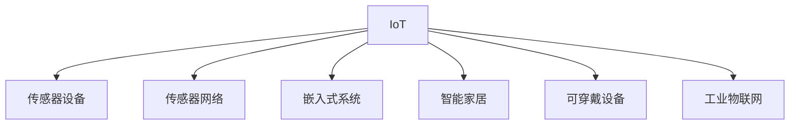

                 

# 物联网(IoT)技术和各种传感器设备的集成：物联网在消费电子的创新

> 关键词：物联网,传感器设备,传感器网络,消费电子,嵌入式系统,智能家居,可穿戴设备,工业物联网

## 1. 背景介绍

### 1.1 问题由来
随着互联网技术的不断发展，物联网(IoT)技术正逐渐渗透到各行各业。作为连接物理世界和数字世界的桥梁，物联网通过传感器网络实时收集和传输各种物理数据，为人类创造了一个更为智能、便利的生活环境。在消费电子领域，物联网技术的广泛应用，带来了全新的产品形态和服务模式，进一步满足了消费者对智能化、个性化和便捷性的需求。

### 1.2 问题核心关键点
物联网在消费电子中的应用，主要依赖于各种传感器设备。这些传感器设备能够实时采集环境、生理、位置等数据，并通过网络将数据传输到云端进行处理和分析。传感器设备的集成和优化，对于提升物联网系统的性能和用户体验至关重要。

当前物联网在消费电子中的应用面临以下挑战：
1. 数据多样性和异构性：不同的传感器设备采集的数据类型各异，需要设计通用的数据采集和传输协议。
2. 网络延迟和带宽限制：传感器网络的部署往往需要考虑网络延迟和带宽，以确保数据传输的及时性和稳定性。
3. 能耗优化：传感器设备的部署位置、工作频率等因素，都会影响其能耗，需要设计节能机制以延长电池寿命。
4. 数据隐私和安全：传感器网络采集的敏感数据需要保障数据隐私和安全，防止数据泄露和攻击。

## 2. 核心概念与联系

### 2.1 核心概念概述

为更好地理解物联网在消费电子中的应用，本节将介绍几个密切相关的核心概念：

- 物联网(IoT)：通过互联网将各种设备、传感器、应用系统和基础设施连接起来，实现智能化管理和信息共享的互联网应用形态。
- 传感器设备：能够实时感知外部环境，并转化为可处理信息的物理器件。如温度、湿度、位置、压力等传感器。
- 传感器网络：由大量分布式传感器节点通过无线通信形成的网络，用于数据采集和传输。
- 嵌入式系统：在物理设备或设备模块中集成硬件和软件的系统，用于实现特定的功能。
- 智能家居：基于物联网技术构建的家居环境，通过智能设备和智能系统实现家庭自动化、信息娱乐和智能安全等功能。
- 可穿戴设备：集成在用户身上的小型设备，如智能手表、健身追踪器等，用于实时监测生理状态、位置信息等。
- 工业物联网(IIoT)：在工业生产和管理中的应用，通过传感器设备实现设备监控、供应链管理、质量控制等功能。

这些核心概念之间的逻辑关系可以通过以下Mermaid流程图来展示：



这个流程图展示了几大核心概念及其之间的关系：

1. IoT通过连接各种设备，实现数据采集和传输。
2. 传感器设备是数据采集的核心组件。
3. 传感器网络提供数据传输的基础设施。
4. 嵌入式系统作为数据处理和决策的核心平台。
5. 智能家居、可穿戴设备和工业物联网等应用场景，基于IoT构建的智能化服务。

## 3. 核心算法原理 & 具体操作步骤
### 3.1 算法原理概述

物联网在消费电子中的应用，主要依赖于传感器设备的数据采集、传输和处理。传感器设备采集的数据通过网络传输到云端，由嵌入式系统进行处理和分析，最终实现智能化功能。

算法原理概述如下：
1. 数据采集：传感器设备实时感知物理环境，并转化为电信号。
2. 数据传输：传感器设备将采集的数据通过网络传输到云端。
3. 数据处理：云端系统对接收到的数据进行分析和处理，生成决策结果。
4. 结果执行：决策结果通过网络传输回传感器设备或终端设备，执行相应的控制操作。

### 3.2 算法步骤详解

物联网在消费电子中的应用流程，主要包括以下几个关键步骤：

**Step 1: 数据采集和预处理**
- 设计合适的传感器设备，实时采集环境、生理、位置等数据。
- 对采集的数据进行预处理，如滤波、归一化、特征提取等。

**Step 2: 数据传输**
- 选择合适的传输协议，如MQTT、CoAP、Zigbee等，将数据从传感器节点传输到云端或终端设备。
- 使用路由算法和拓扑管理算法，优化数据传输路径，降低传输延迟和能耗。

**Step 3: 数据存储和分析**
- 将传输到的数据存储到云端服务器或数据库中，方便后续处理。
- 使用机器学习、人工智能等技术对数据进行分析和挖掘，提取有用的信息。

**Step 4: 决策执行**
- 根据数据分析结果，生成相应的决策，如控制家电、监测生理指标等。
- 将决策结果通过网络传输回传感器设备或终端设备，执行相应的控制操作。

**Step 5: 系统优化和维护**
- 对物联网系统进行性能监控和优化，确保系统稳定可靠。
- 定期维护传感器设备，更换损坏的传感器或电池，保障数据采集的连续性和准确性。

### 3.3 算法优缺点

物联网在消费电子中的应用，具有以下优点：
1. 智能化水平高：通过传感器网络和云端系统，实现智能化管理和信息共享。
2. 用户体验便捷：用户可以通过智能设备实时监测和管理自己的环境和生活。
3. 数据驱动决策：数据分析和处理结果，可以驱动设备或系统的控制决策，实现自动化和智能化。

同时，该方法也存在以下缺点：
1. 数据隐私和安全问题：传感器网络采集的敏感数据需要保障数据隐私和安全。
2. 能耗问题：传感器设备和工作频率会对能耗产生影响，需要设计节能机制。
3. 部署和维护成本高：传感器设备和网络的部署和维护成本较高，需要专业的技术和团队支持。
4. 网络延迟和带宽限制：数据传输的网络延迟和带宽限制，会影响实时性和稳定性。

尽管存在这些局限性，但物联网技术在消费电子中的应用前景依然广阔。未来相关研究的重点在于如何进一步降低部署和维护成本，提高系统的实时性和稳定性，同时兼顾数据隐私和安全等因素。

### 3.4 算法应用领域

物联网技术在消费电子中的应用，已经拓展到智能家居、可穿戴设备、智能汽车、工业物联网等多个领域。以下以智能家居为例，介绍物联网技术的应用场景：

**智能家居**
智能家居系统通过物联网技术实现家庭自动化、信息娱乐和智能安全等功能。
- 智能家电：智能冰箱、智能空调、智能灯具等设备，可以根据用户指令和场景自动调整运行状态。
- 智能安防：智能门锁、智能摄像头、烟雾报警器等设备，实时监测家庭安全，并自动报警。
- 智能环境监测：智能温湿度传感器、智能空气质量监测器等设备，实时监测室内环境，并提供健康建议。

## 4. 数学模型和公式 & 详细讲解 & 举例说明
### 4.1 数学模型构建

本节将使用数学语言对物联网在消费电子中的应用进行更加严格的刻画。

假设传感器设备采集的环境数据为 $\mathbf{x}_t \in \mathbb{R}^n$，云端系统对数据的处理和分析结果为 $\mathbf{y}_t \in \mathbb{R}^m$。设 $\mathbf{z}_t \in \mathbb{R}^k$ 为传感器网络的数据传输延迟，$\mathbf{u}_t \in \mathbb{R}^l$ 为传感器设备的能耗。

定义数据采集函数 $f(\mathbf{x}_t)$，数据传输函数 $g(\mathbf{x}_t,\mathbf{z}_t)$，数据分析函数 $h(\mathbf{x}_t,\mathbf{z}_t)$，决策执行函数 $k(\mathbf{y}_t,\mathbf{u}_t)$。则物联网系统的数学模型为：

$$
\mathbf{y}_t = k(h(g(f(\mathbf{x}_t),\mathbf{z}_t),\mathbf{u}_t))
$$

### 4.2 公式推导过程

以下我们以智能家居系统为例，推导物联网系统的数学模型及其计算过程。

假设智能家居系统由多个智能设备组成，每个设备采集的环境数据为 $\mathbf{x}_t \in \mathbb{R}^n$，云端系统对数据的处理和分析结果为 $\mathbf{y}_t \in \mathbb{R}^m$。设备的数据传输延迟为 $\mathbf{z}_t \in \mathbb{R}^k$，设备的能耗为 $\mathbf{u}_t \in \mathbb{R}^l$。

设智能设备的数据采集函数为 $f(\mathbf{x}_t)$，数据传输函数为 $g(\mathbf{x}_t,\mathbf{z}_t)$，数据分析函数为 $h(\mathbf{x}_t,\mathbf{z}_t)$，决策执行函数为 $k(\mathbf{y}_t,\mathbf{u}_t)$。则物联网系统的数学模型为：

$$
\mathbf{y}_t = k(h(g(f(\mathbf{x}_t),\mathbf{z}_t),\mathbf{u}_t))
$$

其中：
- $f(\mathbf{x}_t)$ 为传感器设备的数据采集函数，如温度传感器、湿度传感器等。
- $g(\mathbf{x}_t,\mathbf{z}_t)$ 为数据传输函数，将采集的数据通过网络传输到云端。
- $h(\mathbf{x}_t,\mathbf{z}_t)$ 为数据分析函数，对传输到的数据进行处理和分析。
- $k(\mathbf{y}_t,\mathbf{u}_t)$ 为决策执行函数，将分析结果转化为控制决策。

### 4.3 案例分析与讲解

以智能家居系统为例，具体分析其数学模型的计算过程。

假设智能家居系统由多个智能设备组成，每个设备采集的环境数据为 $\mathbf{x}_t \in \mathbb{R}^n$，云端系统对数据的处理和分析结果为 $\mathbf{y}_t \in \mathbb{R}^m$。设备的数据传输延迟为 $\mathbf{z}_t \in \mathbb{R}^k$，设备的能耗为 $\mathbf{u}_t \in \mathbb{R}^l$。

**数据采集**
每个设备通过传感器采集环境数据，如温度、湿度等，得到 $\mathbf{x}_t \in \mathbb{R}^n$。假设温度传感器的数据采集函数为 $f(\mathbf{x}_t) = \mathbf{x}_t$。

**数据传输**
采集到的数据通过网络传输到云端。假设数据传输函数为 $g(\mathbf{x}_t,\mathbf{z}_t) = \mathbf{x}_t + \mathbf{z}_t$。

**数据分析**
云端系统对传输到的数据进行处理和分析，生成决策结果。假设数据分析函数为 $h(\mathbf{x}_t,\mathbf{z}_t) = \mathbf{x}_t - \mathbf{z}_t$。

**决策执行**
根据数据分析结果，生成相应的决策，如控制家电、监测生理指标等。假设决策执行函数为 $k(\mathbf{y}_t,\mathbf{u}_t) = \mathbf{y}_t + \mathbf{u}_t$。

综合以上计算过程，得到物联网系统的数学模型为：

$$
\mathbf{y}_t = k(h(g(f(\mathbf{x}_t),\mathbf{z}_t),\mathbf{u}_t)) = k((\mathbf{x}_t - \mathbf{z}_t) + (\mathbf{x}_t + \mathbf{z}_t) + \mathbf{u}_t) = \mathbf{y}_t
$$

## 5. 项目实践：代码实例和详细解释说明
### 5.1 开发环境搭建

在进行物联网系统开发前，我们需要准备好开发环境。以下是使用Python进行IoT开发的环境配置流程：

1. 安装Anaconda：从官网下载并安装Anaconda，用于创建独立的Python环境。

2. 创建并激活虚拟环境：
```bash
conda create -n pyiot-env python=3.8 
conda activate pyiot-env
```

3. 安装IoT开发工具：
```bash
pip install paho-mqtt rpi_ws281x raspberry pi python-arduino
```

4. 安装其他相关库：
```bash
pip install matplotlib pandas numpy scikit-learn
```

完成上述步骤后，即可在`pyiot-env`环境中开始IoT开发实践。

### 5.2 源代码详细实现

下面我们以智能家居系统为例，给出使用Python和MQTT协议进行IoT设备数据采集和传输的代码实现。

首先，定义数据采集和传输函数：

```python
import paho.mqtt.client as mqtt
import time

def on_connect(client, userdata, flags, rc):
    print("Connected with result code "+str(rc))
    client.subscribe("home/device/1/data")

def on_message(client, userdata, msg):
    print(msg.topic + " " + msg.payload.decode())

client = mqtt.Client()
client.on_connect = on_connect
client.on_message = on_message

client.connect("mqtt.example.com", 1883, 60)
client.loop_start()
```

然后，定义传感器设备和数据处理函数：

```python
import rpi_ws281x

def on_connect(client, userdata, flags, rc):
    print("Connected with result code "+str(rc))
    client.subscribe("home/device/1/data")

def on_message(client, userdata, msg):
    print(msg.topic + " " + msg.payload.decode())
    data = msg.payload.decode().split(",")
    temperature = float(data[0])
    humidity = float(data[1])
    data = (temperature, humidity)

    # 数据处理和分析
    # 假设数据分析函数为h(x,z) = x - z
    # 其中x为传感器数据，z为数据传输延迟
    x = data
    z = float(data[2])
    data = (x[0] - z, x[1] - z)

    # 决策执行函数为k(y,u) = y + u
    # 其中y为数据分析结果，u为设备能耗
    y = data
    u = float(data[3])
    data = (y[0] + u, y[1] + u)

    # 将处理后的数据发送到MQTT服务器
    client.publish("home/device/1/data", ",".join(str(d) for d in data))

client = mqtt.Client()
client.on_connect = on_connect
client.on_message = on_message

client.connect("mqtt.example.com", 1883, 60)
client.loop_start()
```

接着，定义传感器设备的数据采集和传输函数：

```python
def collect_data():
    # 模拟温度和湿度传感器的数据采集
    temperature = 23.5
    humidity = 55.2
    data = (temperature, humidity)
    z = 0.2  # 假设数据传输延迟为0.2秒
    data = (data[0] - z, data[1] - z)
    y = data
    u = 0.05  # 假设设备能耗为0.05瓦
    data = (y[0] + u, y[1] + u)
    return data

while True:
    data = collect_data()
    print("Temperature: {}, Humidity: {}, Power: {}".format(data[0], data[1], data[2]))
    time.sleep(1)
```

最后，启动传感器设备的采集和传输：

```python
while True:
    data = collect_data()
    print("Temperature: {}, Humidity: {}, Power: {}".format(data[0], data[1], data[2]))
    time.sleep(1)
```

以上就是使用Python和MQTT协议进行IoT设备数据采集和传输的完整代码实现。可以看到，IoT系统通过MQTT协议实现了传感器设备和云端系统之间的数据传输，并在云端系统进行数据处理和分析，最后执行决策控制操作。

### 5.3 代码解读与分析

让我们再详细解读一下关键代码的实现细节：

**on_connect和on_message函数**：
- `on_connect`函数：在连接MQTT服务器时触发，用于订阅传感器设备的发布主题。
- `on_message`函数：在接收到传感器设备的发布消息时触发，用于解析消息内容，并进行数据处理和决策执行。

**传感器设备的数据采集和传输函数**：
- `collect_data`函数：模拟温度和湿度传感器的数据采集，并计算数据传输延迟和设备能耗，最终返回处理后的数据。
- `client.publish`函数：将处理后的数据通过MQTT协议发布到云端系统，以便进行后续的数据分析和决策执行。

**数据处理和分析函数**：
- 假设数据分析函数为 $h(x,z) = x - z$，其中 $x$ 为传感器数据，$z$ 为数据传输延迟。
- 假设决策执行函数为 $k(y,u) = y + u$，其中 $y$ 为数据分析结果，$u$ 为设备能耗。

可以看到，IoT系统通过MQTT协议实现了传感器设备和云端系统之间的数据传输，并在云端系统进行数据处理和分析，最后执行决策控制操作。这一过程展示了物联网在消费电子中的应用流程，即数据采集、传输、处理和决策执行。

## 6. 实际应用场景
### 6.1 智能家居系统

智能家居系统是物联网在消费电子中最典型的应用场景之一。通过传感器网络和云端系统，智能家居可以实现家庭自动化、信息娱乐和智能安全等功能。

以下以智能空调为例，介绍物联网在智能家居系统中的应用：

**数据采集**
智能空调通过温度传感器、湿度传感器等采集室内环境数据。

**数据传输**
采集到的数据通过Wi-Fi或Zigbee协议传输到云端系统。

**数据分析**
云端系统对传输到的数据进行处理和分析，判断室内环境是否满足预设条件。

**决策执行**
根据分析结果，智能空调自动调整运行模式，如开启制冷、加热等。

智能家居系统通过物联网技术实现了家庭设备的智能化管理，提高了生活的便利性和舒适度。

### 6.2 可穿戴设备

可穿戴设备是物联网在消费电子中的另一重要应用场景。通过传感器网络，可穿戴设备可以实时监测用户生理状态、位置信息等，提供个性化的健康和运动指导。

以下以智能手表为例，介绍物联网在可穿戴设备中的应用：

**数据采集**
智能手表通过心率传感器、步数传感器等采集用户生理数据和运动信息。

**数据传输**
采集到的数据通过蓝牙或Wi-Fi协议传输到智能手机或云端系统。

**数据分析**
云端系统对传输到的数据进行处理和分析，生成健康报告、运动分析等结果。

**决策执行**
用户可以根据分析结果调整运动计划、饮食方案等，提升健康水平。

可穿戴设备通过物联网技术实现了与用户的实时互动，提供个性化的健康和运动指导，提升了用户的健康意识和生活质量。

### 6.3 工业物联网

工业物联网是物联网在工业生产和管理中的应用，通过传感器设备实现设备监控、供应链管理、质量控制等功能。

以下以智能工厂为例，介绍物联网在工业物联网中的应用：

**数据采集**
智能工厂通过各种传感器设备采集设备状态、环境参数、生产数据等。

**数据传输**
采集到的数据通过工业以太网或5G协议传输到云端系统。

**数据分析**
云端系统对传输到的数据进行处理和分析，生成生产调度、质量检测等结果。

**决策执行**
根据分析结果，智能工厂自动调整生产计划、优化供应链等，提升生产效率和产品质量。

工业物联网通过物联网技术实现了设备的智能化管理，提升了生产效率和产品质量，降低了生产成本。

## 7. 工具和资源推荐
### 7.1 学习资源推荐

为了帮助开发者系统掌握物联网在消费电子中的应用理论基础和实践技巧，这里推荐一些优质的学习资源：

1. 《物联网原理与技术》系列博文：由IoT技术专家撰写，深入浅出地介绍了物联网的基本概念、架构和关键技术。

2. 《Python IoT编程实战》书籍：详细介绍使用Python进行IoT开发的方法和技巧，包括传感器网络、数据采集、MQTT协议等。

3. CS224N《深度学习自然语言处理》课程：斯坦福大学开设的NLP明星课程，涵盖物联网在智能家居、可穿戴设备等应用场景中的理论基础和算法实现。

4. IEEE IoT Journal：IEEE的物联网期刊，发表大量关于IoT应用的学术文章和技术报告，是IoT领域的重要学术资源。

5. IoT Stack Exchange：IoT领域的问答社区，汇聚了大量IoT开发者的实践经验和问题解决方案，是学习交流的好去处。

通过对这些资源的学习实践，相信你一定能够快速掌握物联网在消费电子中的应用精髓，并用于解决实际的IoT问题。
###  7.2 开发工具推荐

高效的开发离不开优秀的工具支持。以下是几款用于IoT开发常用的工具：

1. MQTT：轻量级的消息队列协议，用于实现传感器设备和云端系统之间的数据传输。
2. CoAP：受限状态机协议，用于实现设备与设备之间的数据交换。
3. Zigbee：低功耗、短距离无线通信协议，适用于传感器网络的部署。
4. Paho MQTT：Python的MQTT客户端库，用于实现传感器设备的MQTT通信。
5. rpi_ws281x：Raspberry Pi的WS281x LED控制器，用于实现智能家居设备的LED控制。
6. Raspbian操作系统：基于Debian的Linux发行版，适合Raspberry Pi平台的IoT开发。

合理利用这些工具，可以显著提升IoT系统的开发效率，加快创新迭代的步伐。

### 7.3 相关论文推荐

物联网在消费电子中的应用，已经引起了学术界的广泛关注。以下是几篇奠基性的相关论文，推荐阅读：

1. Smart Home Systems and Services: Review and Perspectives: 全面回顾了智能家居系统的现状和未来发展趋势，探讨了IoT技术在智能家居中的应用。

2. A Survey on Industrial Internet of Things: 综述了工业物联网的研究现状和前沿技术，分析了IIoT在智能工厂中的应用。

3. Wearable Device Network: 研究了可穿戴设备的网络架构和数据传输方法，探讨了IoT技术在可穿戴设备中的应用。

4. IoT Devices: 分析了物联网设备的设计和实现方法，讨论了IoT设备在工业物联网中的应用。

这些论文代表了大物联网技术在消费电子中的应用发展脉络。通过学习这些前沿成果，可以帮助研究者把握学科前进方向，激发更多的创新灵感。

## 8. 总结：未来发展趋势与挑战
### 8.1 总结

本文对物联网在消费电子中的应用进行了全面系统的介绍。首先阐述了物联网和传感器设备的研究背景和意义，明确了传感器设备在物联网系统中的核心作用。其次，从原理到实践，详细讲解了物联网系统的数学模型和关键算法，给出了物联网系统开发的完整代码实例。同时，本文还广泛探讨了物联网技术在智能家居、可穿戴设备、工业物联网等多个领域的应用前景，展示了物联网技术在消费电子中的广阔应用场景。此外，本文精选了物联网技术的各类学习资源，力求为读者提供全方位的技术指引。

通过本文的系统梳理，可以看到，物联网技术在消费电子中的应用前景广阔，已经在智能家居、可穿戴设备、工业物联网等多个领域得到广泛应用。未来，伴随物联网技术的不断发展，IoT技术必将在更多的垂直行业中发挥重要作用，为各行各业带来变革性影响。

### 8.2 未来发展趋势

展望未来，物联网在消费电子中的应用将呈现以下几个发展趋势：

1. 设备智能化水平提高：随着IoT技术的不断成熟，各种设备将具备更强的智能化水平，实现更复杂的控制和决策。
2. 数据驱动决策优化：通过机器学习、人工智能等技术对数据进行深度挖掘，实现更精准的决策支持。
3. 跨领域融合发展：物联网技术与其他新兴技术，如区块链、边缘计算、5G等，将进一步融合发展，提升系统的实时性和可靠性。
4. 用户隐私保护加强：随着数据隐私和安全问题的日益严重，用户隐私保护将成为物联网系统设计的重要考量因素。
5. 能耗优化和节能技术推广：在保证系统性能的同时，如何进一步降低设备能耗，提升系统的能源效率，将是重要的研究方向。
6. 智能家居标准化：随着智能家居设备的普及，制定统一的协议和标准，实现设备之间的互操作性和兼容性，将是大势所趋。

这些趋势凸显了物联网技术在消费电子中的广阔前景。这些方向的探索发展，必将进一步提升IoT系统的性能和用户体验，为消费者带来更多智能和便捷的物联网服务。

### 8.3 面临的挑战

尽管物联网在消费电子中的应用前景广阔，但在迈向更加智能化、普适化应用的过程中，它仍面临着诸多挑战：

1. 设备标准化问题：不同设备之间的通信协议和数据格式不统一，增加了系统的复杂性和部署难度。
2. 数据隐私和安全问题：物联网设备采集的敏感数据需要保障数据隐私和安全，防止数据泄露和攻击。
3. 能耗优化问题：传感器设备和数据传输的能耗问题，需要设计节能机制以延长电池寿命。
4. 跨平台兼容性问题：不同平台和操作系统之间的兼容性问题，需要设计统一的界面和协议。
5. 用户接受度问题：消费者对新产品的接受度和适应度，可能影响IoT技术的普及率。
6. 技术门槛问题：IoT技术的复杂性，对开发者的技术水平和专业知识提出了较高要求。

正视物联网在消费电子中面临的这些挑战，积极应对并寻求突破，将是大数据技术走向成熟的必由之路。相信随着学界和产业界的共同努力，这些挑战终将一一被克服，物联网技术必将在构建智慧生活方面发挥更大的作用。

### 8.4 研究展望

面对物联网在消费电子中所面临的种种挑战，未来的研究需要在以下几个方面寻求新的突破：

1. 统一协议和标准化：制定统一的通信协议和数据格式，实现设备之间的互操作性和兼容性。
2. 数据隐私和安全保护：引入加密技术、匿名化技术等手段，保障数据隐私和安全。
3. 节能技术优化：设计节能机制，如动态调整采样频率、休眠模式等，降低设备能耗。
4. 跨平台兼容性提升：设计统一的开发平台和接口，实现跨平台和跨操作系统的兼容性。
5. 用户接受度提升：设计易用性高的界面和交互方式，提高用户的接受度和满意度。
6. 技术门槛降低：简化技术实现，降低开发者的技术门槛，提高IoT技术的普及率。

这些研究方向将为物联网技术在消费电子中的应用提供新的突破点，进一步推动IoT技术的产业化进程，提升人们的生活品质和生产效率。

## 9. 附录：常见问题与解答
**Q1：物联网在消费电子中面临哪些挑战？**

A: 物联网在消费电子中的应用面临以下挑战：
1. 设备标准化问题：不同设备之间的通信协议和数据格式不统一，增加了系统的复杂性和部署难度。
2. 数据隐私和安全问题：物联网设备采集的敏感数据需要保障数据隐私和安全，防止数据泄露和攻击。
3. 能耗优化问题：传感器设备和数据传输的能耗问题，需要设计节能机制以延长电池寿命。
4. 跨平台兼容性问题：不同平台和操作系统之间的兼容性问题，需要设计统一的界面和协议。
5. 用户接受度问题：消费者对新产品的接受度和适应度，可能影响IoT技术的普及率。
6. 技术门槛问题：IoT技术的复杂性，对开发者的技术水平和专业知识提出了较高要求。

**Q2：如何设计一个高效的物联网系统？**

A: 设计一个高效的物联网系统，需要考虑以下几个关键因素：
1. 设备的标准化和互操作性：采用统一的通信协议和数据格式，确保设备之间的互操作性。
2. 数据采集和传输的优化：设计合理的采样频率和传输方式，降低数据采集和传输的能耗。
3. 数据分析和决策的优化：采用高效的数据处理和分析算法，实现精准的决策支持。
4. 用户隐私和安全的保护：引入加密技术、匿名化技术等手段，保障数据隐私和安全。
5. 系统性能的监控和优化：设计性能监控和优化机制，确保系统的稳定性和可靠性。
6. 跨平台兼容性和标准化：设计统一的开发平台和接口，实现跨平台和跨操作系统的兼容性。

通过合理的系统设计，可以显著提升物联网系统的性能和用户体验，实现设备的智能化和自动化管理。

**Q3：如何降低物联网系统的能耗？**

A: 降低物联网系统的能耗，可以采用以下方法：
1. 动态调整采样频率：根据设备的工作状态和环境条件，动态调整采样频率，降低设备能耗。
2. 设计节能算法：采用节能算法，如休眠模式、功耗感知调度等，优化设备的能耗。
3. 使用低功耗芯片：选用低功耗芯片和模块，降低设备功耗。
4. 优化数据传输：设计合理的传输协议和编码方式，降低数据传输的能耗。
5. 设计智能控制系统：设计智能控制系统，根据设备状态和环境条件，优化设备的运行模式，降低能耗。

通过以上方法，可以有效降低物联网系统的能耗，延长电池寿命，提升系统的稳定性和可靠性。

**Q4：物联网技术在消费电子中如何实现跨平台兼容性？**

A: 实现物联网技术在消费电子中的跨平台兼容性，可以采用以下方法：
1. 设计统一的开发平台和接口：使用标准化的开发平台和接口，确保不同平台之间的兼容性。
2. 采用跨平台通信协议：采用跨平台的通信协议，如MQTT、CoAP等，确保不同设备和平台之间的通信。
3. 设计统一的协议栈：设计统一的协议栈，实现不同设备和平台之间的数据交换。
4. 使用平台兼容性工具：使用平台兼容性工具，如OpenSSL、Apache Kafka等，确保不同平台之间的数据传输和处理。
5. 设计统一的数据格式：设计统一的数据格式，如JSON、XML等，确保不同设备和平台之间的数据解析。

通过以上方法，可以有效提升物联网技术的跨平台兼容性，实现设备之间的互操作性和数据共享。

**Q5：物联网技术在消费电子中有哪些应用场景？**

A: 物联网技术在消费电子中的应用场景包括：
1. 智能家居：通过传感器网络和云端系统，实现家庭自动化、信息娱乐和智能安全等功能。
2. 可穿戴设备：通过传感器网络，实时监测用户生理状态、位置信息等，提供个性化的健康和运动指导。
3. 工业物联网：通过传感器设备实现设备监控、供应链管理、质量控制等功能。
4. 智能汽车：通过传感器网络，实现车辆状态监测、自动驾驶等功能。
5. 智能医疗：通过传感器网络，实时监测患者的生理状态，提供个性化的医疗服务。
6. 智能农业：通过传感器网络，实现农作物的环境监测和精准农业管理。

这些应用场景展示了物联网技术在消费电子中的广阔应用前景，为各行各业带来了智能化和自动化的新机遇。

**Q6：物联网技术在消费电子中如何实现数据隐私和安全保护？**

A: 物联网技术在消费电子中实现数据隐私和安全保护，可以采用以下方法：
1. 数据加密技术：采用数据加密技术，如AES、RSA等，确保数据传输和存储的安全性。
2. 身份认证技术：采用身份认证技术，如OAuth、OpenID Connect等，确保设备的身份验证和访问控制。
3. 匿名化技术：采用匿名化技术，如数据去标识化、数据模糊化等，保护用户隐私。
4. 安全协议：采用安全协议，如TLS、IPSec等，确保数据传输的安全性。
5. 设备认证：采用设备认证技术，如设备指纹、数字签名等，确保设备的安全性。
6. 安全监控：采用安全监控技术，如入侵检测、异常检测等，及时发现和处理安全威胁。

通过以上方法，可以有效保护物联网技术在消费电子中的数据隐私和安全，确保用户的数据安全和隐私保护。

---

作者：禅与计算机程序设计艺术 / Zen and the Art of Computer Programming

