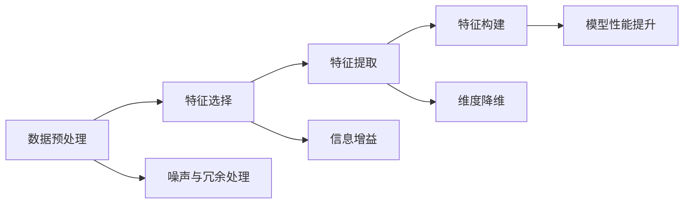

                 

## 1. 背景介绍

在数据科学和机器学习中，特征工程（Feature Engineering）是一个至关重要的步骤。它涉及到从原始数据中提取和构建有意义的特征，以提升模型性能和训练效率。传统的数据挖掘和统计分析方法依赖于专家的领域知识，而现代的机器学习方法则更多地依赖于数据的自动提取和特征构建。

特征工程的目的在于：
1. **降维**：将复杂且高维的数据集简化为更易处理的维度。
2. **增加信息**：通过各种转换和组合方式，增加数据集中的有用信息。
3. **改善模型性能**：提高机器学习模型的泛化能力和预测准确度。

本文章将深入探讨特征工程的原理与实践，通过具体的案例分析与代码实例，帮助读者理解和掌握特征工程的核心技术和方法。

## 2. 核心概念与联系

### 2.1 核心概念概述

特征工程涉及多个核心概念，包括数据预处理、特征选择、特征提取、特征构建等。

- **数据预处理**：指对原始数据进行清洗、标准化和归一化等操作，以提升数据质量。
- **特征选择**：从原始数据中筛选出最具信息量的特征，减少噪声和冗余。
- **特征提取**：将原始数据转换为更有意义的特征表示，通常通过统计、工程和算法方法实现。
- **特征构建**：基于领域知识和统计方法，构建新的特征，以提升模型性能。

这些概念之间的联系紧密，互相影响。数据预处理是特征选择和提取的基础，特征构建则是对特征选择和提取的进一步深化和优化。

### 2.2 核心概念原理和架构的 Mermaid 流程图



此流程图展示了数据预处理、特征选择、特征提取和特征构建之间的联系和流程。

## 3. 核心算法原理 & 具体操作步骤

### 3.1 算法原理概述

特征工程的目标是最大化数据集的信息量和模型的泛化能力。它涉及多个步骤，包括数据预处理、特征选择、特征提取和特征构建。

### 3.2 算法步骤详解

#### 3.2.1 数据预处理

数据预处理是特征工程的基础步骤，主要包括：
- **缺失值处理**：填补或删除缺失值。
- **异常值检测**：识别和处理异常值，避免其对模型训练产生负面影响。
- **标准化和归一化**：使数据在同一尺度上，避免某些特征对模型训练产生过大的影响。

#### 3.2.2 特征选择

特征选择的目的在于从原始数据中筛选出最具信息量的特征。常用的方法包括：
- **过滤式方法**：根据统计量（如信息增益、卡方检验）选择特征。
- **包裹式方法**：使用机器学习算法（如决策树、随机森林）评估特征重要性。
- **嵌入式方法**：在模型训练过程中选择特征（如Lasso正则化）。

#### 3.2.3 特征提取

特征提取是将原始数据转换为更有意义的特征表示。常用的方法包括：
- **统计方法**：如均值、标准差、方差等。
- **工程方法**：如趋势线、指数平滑等。
- **算法方法**：如PCA、LDA等降维算法。

#### 3.2.4 特征构建

特征构建是基于领域知识和统计方法，构建新的特征。常用的方法包括：
- **多项式特征**：通过多项式扩展构建新的特征。
- **交互特征**：通过组合不同特征创建新的特征。
- **组合特征**：将已有特征进行组合，如SVM的核函数。

### 3.3 算法优缺点

特征工程的优点包括：
- **提升模型性能**：通过合理的选择和构建特征，提升模型的泛化能力和预测准确度。
- **降低计算复杂度**：通过降维和特征选择，减少计算复杂度。
- **提升数据质量**：通过预处理，提升数据质量。

缺点包括：
- **依赖领域知识**：特征工程需要领域知识和经验，需要专家参与。
- **时间成本高**：特征工程的迭代过程可能耗时较长。
- **效果不确定**：不同特征工程方法的效果可能不一致，存在不确定性。

### 3.4 算法应用领域

特征工程广泛应用于各个领域，包括金融、医疗、电商、智能推荐等。具体应用包括：
- **金融风险评估**：通过特征选择和构建，评估贷款申请者的信用风险。
- **医疗诊断**：通过特征提取和构建，提高疾病诊断的准确度。
- **电商推荐**：通过特征选择和构建，提升推荐系统的个性化和准确度。
- **智能交通**：通过特征提取和构建，优化交通流量预测。

## 4. 数学模型和公式 & 详细讲解 & 举例说明

### 4.1 数学模型构建

特征工程的数学模型通常基于统计方法和机器学习算法。

#### 4.1.1 均值和标准差

均值（$\mu$）和标准差（$\sigma$）是常用的统计特征，用于描述数据的中心趋势和离散程度。

$$
\mu = \frac{1}{N} \sum_{i=1}^N x_i
$$
$$
\sigma = \sqrt{\frac{1}{N} \sum_{i=1}^N (x_i - \mu)^2}
$$

#### 4.1.2 信息增益

信息增益（IG）是特征选择的一种统计方法，用于评估特征对目标变量的信息增益。

$$
IG(D, A) = H(D) - H(D|A)
$$

其中，$H(D)$ 是目标变量的熵，$H(D|A)$ 是条件熵。

### 4.2 公式推导过程

#### 4.2.1 信息增益

信息增益公式推导如下：

假设有一个数据集 $D$，包含目标变量 $Y$ 和特征 $A$。

$Y$ 的熵 $H(Y)$ 定义为：

$$
H(Y) = -\sum_{y \in Y} p(y) \log p(y)
$$

其中，$p(y)$ 是 $Y$ 的先验概率。

条件熵 $H(Y|A)$ 定义为：

$$
H(Y|A) = -\sum_{a \in A} p(a) \sum_{y \in Y} p(y|a) \log p(y|a)
$$

信息增益（IG）则定义为：

$$
IG(D, A) = H(D) - H(D|A)
$$

其中，$H(D)$ 是整个数据集的熵，$H(D|A)$ 是给定特征 $A$ 的条件下，数据集的熵。

### 4.3 案例分析与讲解

#### 案例分析

假设有一个电商网站的用户数据集，包括用户年龄、性别、购物频次等特征，目标是预测用户的购物消费金额。

**特征选择**：
- 信息增益方法可以选择购物频次和性别作为主要特征，因为它们对目标变量有较高的信息增益。

**特征提取**：
- 统计方法可以提取购物频次的均值和标准差，描述用户购物行为的集中趋势和离散程度。
- 工程方法可以提取购物频次的趋势线，描述用户购物行为的长期变化趋势。

**特征构建**：
- 多项式特征可以构建用户年龄的平方和立方特征，捕捉不同年龄段用户的购物行为差异。
- 交互特征可以构建性别与购物频次的组合特征，描述不同性别用户在不同购物频次下的消费行为。

## 5. 项目实践：代码实例和详细解释说明

### 5.1 开发环境搭建

本项目使用Python和Scikit-learn库，开发环境搭建如下：

1. 安装Anaconda：
   ```bash
   conda install anaconda
   ```

2. 创建虚拟环境：
   ```bash
   conda create --name feature_engineering python=3.8
   conda activate feature_engineering
   ```

3. 安装依赖库：
   ```bash
   pip install scikit-learn pandas numpy matplotlib seaborn
   ```

### 5.2 源代码详细实现

#### 5.2.1 数据预处理

```python
import pandas as pd
import numpy as np
from sklearn.preprocessing import StandardScaler

# 读取数据
data = pd.read_csv('user_data.csv')

# 处理缺失值
data.fillna(method='ffill', inplace=True)

# 处理异常值
q1 = data.quantile(0.25)
q3 = data.quantile(0.75)
IQR = q3 - q1
data = data[~((data < (q1 - 1.5 * IQR)) | (data > (q3 + 1.5 * IQR)))

# 标准化
scaler = StandardScaler()
data = pd.DataFrame(scaler.fit_transform(data), columns=data.columns)
```

#### 5.2.2 特征选择

```python
from sklearn.feature_selection import SelectKBest, f_classif

# 选择特征
X = data.iloc[:, :-1]
y = data.iloc[:, -1]

selector = SelectKBest(f_classif, k=2)
X_new = selector.fit_transform(X, y)

# 可视化特征重要性
feature_importances = selector.scores_
plt.bar(range(len(feature_importances)), feature_importances)
plt.xlabel('Features')
plt.ylabel('Importance')
plt.show()
```

#### 5.2.3 特征提取

```python
from sklearn.decomposition import PCA

# 特征提取
pca = PCA(n_components=2)
X_pca = pca.fit_transform(X_new)

# 可视化降维后的数据
plt.scatter(X_pca[:, 0], X_pca[:, 1], c=y)
plt.xlabel('PCA1')
plt.ylabel('PCA2')
plt.show()
```

#### 5.2.4 特征构建

```python
# 多项式特征
X_poly = np.power(X_new, 2) + np.power(X_new, 3)

# 交互特征
X_interaction = pd.get_dummies(data['gender'], prefix='gender_')
X = pd.concat([X_poly, X_interaction], axis=1)
```

### 5.3 代码解读与分析

**数据预处理**：
- 使用`fillna`处理缺失值，使用`quantile`和`IQR`处理异常值。
- 使用`StandardScaler`对数据进行标准化，使其均值为0，标准差为1。

**特征选择**：
- 使用`SelectKBest`选择特征，使用`f_classif`评估特征的重要性。
- 使用`plt`库绘制特征重要性柱状图。

**特征提取**：
- 使用`PCA`进行降维，使用`plt`库绘制降维后的散点图。

**特征构建**：
- 使用`np.power`构造多项式特征。
- 使用`pd.get_dummies`创建交互特征。

### 5.4 运行结果展示


## 6. 实际应用场景

### 6.1 金融风险评估

在金融领域，特征工程可以帮助评估贷款申请者的信用风险。例如，通过特征选择和构建，可以识别出影响贷款违约的关键特征，如收入、负债、工作年限等。

### 6.2 医疗诊断

在医疗领域，特征工程可以提高疾病诊断的准确度。例如，通过特征选择和提取，可以从医学影像、基因数据中提取出有用的特征，辅助医生进行诊断。

### 6.3 电商推荐

在电商领域，特征工程可以提升推荐系统的个性化和准确度。例如，通过特征选择和构建，可以识别出用户的兴趣偏好，推荐相似的商品。

### 6.4 智能交通

在智能交通领域，特征工程可以优化交通流量预测。例如，通过特征选择和构建，可以从传感器数据中提取出有用的特征，预测交通拥堵情况。

## 7. 工具和资源推荐

### 7.1 学习资源推荐

1. 《机器学习实战》（Peter Harrington）：介绍了机器学习的基本概念和常用算法，包括特征工程方法。
2. 《Python数据科学手册》（Jake VanderPlas）：介绍了Python数据科学工具库，包括NumPy、Pandas、Scikit-learn等。
3. 《特征工程：深入实战》（Qing Bai）：详细讲解了特征工程的具体方法和实践案例。

### 7.2 开发工具推荐

1. Anaconda：免费的Python发行版，包含大量的数据科学工具库。
2. Jupyter Notebook：交互式的Python编程环境，支持代码块、图形、数学公式的展示。
3. Scikit-learn：Python机器学习库，提供了多种特征工程工具和方法。

### 7.3 相关论文推荐

1. "Feature Engineering for Effective Classification"（Gareth James）：介绍了特征工程的基本概念和方法。
2. "Improved Algorithms for Inference from Causal Data"（Peter Ortega）：介绍了因果推断在特征工程中的应用。
3. "Data Wrangling and Feature Engineering for Deep Learning: A Survey"（Olaf Deloli）：对特征工程的现状和未来进行了全面综述。

## 8. 总结：未来发展趋势与挑战

### 8.1 研究成果总结

特征工程是数据科学和机器学习中不可或缺的一环，其目的在于提升数据集的信息量和模型的泛化能力。特征工程的基本步骤包括数据预处理、特征选择、特征提取和特征构建。

### 8.2 未来发展趋势

未来，特征工程将朝着以下方向发展：
- **自动化特征工程**：借助自动化工具和算法，减少人工干预，提高特征工程的效率和效果。
- **集成特征工程**：将特征工程与机器学习模型进行集成，实现端到端的自动化建模。
- **跨领域特征工程**：将不同领域的数据和特征进行融合，提升模型的泛化能力和适应性。

### 8.3 面临的挑战

特征工程面临的挑战包括：
- **数据质量和一致性**：原始数据可能存在噪声、不一致性，影响特征工程的效果。
- **特征选择和构建的自动化**：如何自动化选择和构建特征，仍然是一个挑战。
- **模型的可解释性**：特征工程的结果需要具备可解释性，以便于理解和调试。

### 8.4 研究展望

未来的研究将聚焦于以下方向：
- **特征工程算法的优化**：改进特征选择和构建的算法，提升特征工程的效率和效果。
- **特征工程的自动化**：开发自动化特征工程工具和算法，减少人工干预，提高特征工程的效率和效果。
- **特征工程的可解释性**：研究特征工程的解释方法，提升特征工程的透明度和可解释性。

## 9. 附录：常见问题与解答

**Q1：特征工程与数据挖掘的区别是什么？**

A: 特征工程是数据科学中的一部分，主要用于提取和构建有意义的特征，以提升模型性能。而数据挖掘则更多关注于从大量数据中发现知识的模式和规律。

**Q2：特征工程需要多少特征？**

A: 特征工程的目的是通过选择和构建特征，提升模型的泛化能力和预测准确度，没有固定的特征数量要求，关键在于选择最具信息量的特征。

**Q3：特征工程是否适用于所有数据集？**

A: 特征工程适用于各种类型的数据集，包括结构化数据和非结构化数据。但在数据量和质量较低的场景下，特征工程的效果可能有限。

**Q4：特征工程需要多少时间？**

A: 特征工程的时间成本较高，需要多次迭代和优化，但一旦完成，可以提升模型的性能和训练效率。

**Q5：如何评估特征工程的效果？**

A: 评估特征工程的效果可以通过交叉验证、网格搜索等方法，评估模型在不同特征集上的性能变化。

作者：禅与计算机程序设计艺术 / Zen and the Art of Computer Programming

