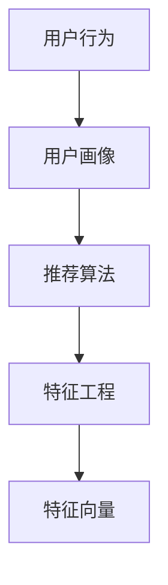

                 

# 特征提取：用户偏好和兴趣的分析

> 关键词：用户行为分析,特征提取,机器学习,深度学习,推荐系统,大数据

## 1. 背景介绍

### 1.1 问题由来
在当今信息爆炸的时代，企业面对海量的用户数据，如何从中挖掘出有价值的用户行为和偏好信息，成为提升用户体验和业务价值的关键。特别是在电子商务、社交媒体、新闻内容等领域，用户行为分析（User Behavior Analysis, UBA）和推荐系统（Recommendation System, RS）是应用最为广泛的分析工具。

通过深入分析和理解用户的行为和偏好，企业可以为用户提供个性化的服务，如推荐个性化商品、内容定制化推送、提升用户转化率等。但是，传统的用户行为分析方法，如基于规则的统计分析、关联规则挖掘等，存在数据粒度粗、无法处理复杂用户行为等问题。

### 1.2 问题核心关键点
用户行为分析的核心问题可以归结为特征提取（Feature Extraction）。特征提取是机器学习、深度学习等数据挖掘技术的重要组成部分，它通过对原始数据进行处理，提取出对目标任务有帮助的信息，从而帮助模型更好地学习用户行为和偏好。

特征提取的核心目标包括以下几点：
1. **数据降维**：将高维度的原始数据转换为低维度的特征向量，减少计算复杂度。
2. **信息提取**：从数据中提取关键特征，如用户行为规律、兴趣点、购买决策等。
3. **泛化能力**：提取的特征能够泛化到新数据和场景，提升模型的鲁棒性和准确性。
4. **可解释性**：特征提取过程和结果应具有一定的可解释性，帮助理解用户行为背后的逻辑。

## 2. 核心概念与联系

### 2.1 核心概念概述

在用户行为分析领域，涉及到多个核心概念，它们之间存在着紧密的联系。

- **用户行为**：用户与系统交互过程中的所有动作，如浏览、点击、购买、评价等。
- **用户画像**：通过收集和分析用户行为数据，构建用户特征标签和行为模型，用于刻画用户的基本特征和偏好。
- **推荐算法**：根据用户画像和物品特征，计算用户与物品的相似度，从而推荐最相关的物品。
- **特征工程**：对原始数据进行预处理、特征提取、特征选择等步骤，以生成高质量的特征向量。

这些概念之间的关系可以通过以下Mermaid流程图来展示：



### 2.2 核心概念原理和架构

#### 用户行为
用户行为可以抽象为一系列事件流，如用户在电子商务平台上的浏览、点击、购买等行为。这些行为数据可以记录在日志、点击流、交易记录等数据源中。

#### 用户画像
用户画像通常由多个维度组成，如人口统计特征、行为特征、兴趣偏好等。通过对用户行为数据的分析和建模，可以构建出详细的用户画像，用于刻画用户的行为模式和兴趣点。

#### 推荐算法
推荐算法有多种，包括协同过滤、基于内容的推荐、深度学习推荐等。协同过滤和基于内容的推荐方法依赖于用户画像和物品特征。深度学习推荐则通常通过神经网络模型对用户行为数据进行处理，生成推荐结果。

#### 特征工程
特征工程包括数据清洗、特征提取、特征选择等步骤。数据清洗旨在处理缺失值、异常值等问题，提高数据质量。特征提取则是将原始数据转换为模型能够理解的形式，常用的技术包括词袋模型、TF-IDF、深度学习特征提取等。特征选择则是对提取的特征进行筛选，去除冗余和噪声特征，提高特征向量的泛化能力和解释性。

## 3. 核心算法原理 & 具体操作步骤

### 3.1 算法原理概述

特征提取的核心思想是通过对原始数据进行处理，提取对目标任务有帮助的特征。在用户行为分析中，特征提取主要包括以下几个步骤：

1. **数据预处理**：包括数据清洗、数据归一化、缺失值处理等，确保数据的完整性和一致性。
2. **特征选择**：从原始数据中选择最具有代表性的特征，去除冗余和噪声。
3. **特征提取**：将原始数据转换为特征向量，常用的技术包括词袋模型、TF-IDF、深度学习特征提取等。
4. **特征降维**：对高维度的特征向量进行降维，常用的方法包括PCA、LDA、t-SNE等。

### 3.2 算法步骤详解

#### 数据预处理
数据预处理是特征提取的基础，其目的是提高数据的质量，为后续的特征提取和模型训练提供可靠的基础。具体步骤包括：

1. **数据清洗**：处理缺失值、异常值等数据质量问题。
2. **数据归一化**：将数据缩放到[0, 1]或[-1, 1]范围内，避免特征之间的数值差异过大影响模型训练。
3. **特征编码**：对类别型特征进行编码，常用的方法包括独热编码、标签编码等。

#### 特征选择
特征选择是从原始数据中选择最有用的特征，去除冗余和噪声。常用的特征选择方法包括：

1. **相关性分析**：通过计算特征与目标变量之间的相关性，选择与目标变量相关性高的特征。
2. **信息增益**：通过计算特征对信息熵的影响，选择信息增益大的特征。
3. **嵌入式选择**：在模型训练过程中，选择对模型预测有帮助的特征，常用的方法包括Lasso回归、岭回归等。

#### 特征提取
特征提取是将原始数据转换为特征向量的过程。常用的特征提取方法包括：

1. **词袋模型（Bag of Words）**：将文本数据转换为词频向量，适用于文本分类、情感分析等任务。
2. **TF-IDF（Term Frequency-Inverse Document Frequency）**：在词袋模型的基础上，引入逆文档频率，提高词语的区分度，适用于文本分类、主题建模等任务。
3. **深度学习特征提取**：通过神经网络模型对原始数据进行处理，提取高层次的特征表示，适用于图像、音频等数据类型。

#### 特征降维
特征降维是将高维度的特征向量转换为低维度的特征向量的过程，常用的方法包括：

1. **主成分分析（Principal Component Analysis, PCA）**：通过线性变换将高维数据投影到低维空间，保留最大的方差信息。
2. **线性判别分析（Linear Discriminant Analysis, LDA）**：通过线性变换将高维数据投影到低维空间，同时保留类间差异最大的信息。
3. **t-分布随机邻域嵌入（t-distributed Stochastic Neighbor Embedding, t-SNE）**：通过非线性变换将高维数据映射到低维空间，保留数据之间的相似性。

### 3.3 算法优缺点

#### 优点
1. **提升模型准确性**：通过特征提取，提取出最具有代表性的特征，提升模型的预测准确性。
2. **减少计算复杂度**：特征降维可以将高维度的数据转换为低维度的特征向量，减少计算复杂度。
3. **提高泛化能力**：提取的特征能够泛化到新数据和场景，提升模型的鲁棒性和泛化能力。

#### 缺点
1. **特征选择困难**：如何选择最具有代表性的特征，往往需要经验和专业知识。
2. **数据预处理复杂**：数据预处理包括数据清洗、归一化等步骤，复杂度较高。
3. **降维损失信息**：特征降维过程中，可能会丢失部分重要信息，影响模型的性能。

### 3.4 算法应用领域

特征提取技术广泛应用于用户行为分析、推荐系统、图像识别、语音识别等领域。

1. **用户行为分析**：通过对用户行为数据的分析和建模，构建用户画像，预测用户行为。
2. **推荐系统**：通过用户画像和物品特征，计算用户与物品的相似度，推荐最相关的物品。
3. **图像识别**：通过特征提取和降维，将图像数据转换为特征向量，用于图像分类、物体检测等任务。
4. **语音识别**：通过特征提取和降维，将语音数据转换为特征向量，用于语音识别、情感分析等任务。

## 4. 数学模型和公式 & 详细讲解 & 举例说明

### 4.1 数学模型构建

在用户行为分析中，常用的数学模型包括：

1. **朴素贝叶斯分类器**：
   $$
   P(C|X) = \frac{P(X|C)P(C)}{P(X)}
   $$

2. **逻辑回归**：
   $$
   P(Y=1|X) = \frac{1}{1+\exp(-\beta_0-\beta_1X_1-\beta_2X_2-\ldots-\beta_nX_n)}
   $$

3. **支持向量机**：
   $$
   \min_{\beta,\xi} \frac{1}{2}||\beta||^2 + C\sum_{i=1}^n\xi_i
   $$

### 4.2 公式推导过程

以朴素贝叶斯分类器为例，其推导过程如下：

假设分类变量 $C$ 取值 $c_1, c_2, \ldots, c_k$，特征变量 $X_1, X_2, \ldots, X_n$。给定样本 $X = (x_1, x_2, \ldots, x_n)$，求解 $C$ 的条件概率 $P(C|X)$。

根据贝叶斯公式：

$$
P(C|X) = \frac{P(X|C)P(C)}{P(X)}
$$

其中 $P(X|C)$ 是给定 $C$ 的条件下，$X$ 的条件概率，可以通过训练数据计算得到。$P(C)$ 是先验概率，可以通过训练数据计算得到。$P(X)$ 是边缘概率，可以通过训练数据计算得到。

### 4.3 案例分析与讲解

#### 用户行为分析案例

假设有一家电子商务平台，需要分析用户的购买行为。通过收集用户的浏览、点击、购买记录，可以得到如下数据：

- 用户ID
- 物品ID
- 点击时间
- 购买时间
- 点击次数
- 购买次数
- 点击时长

对数据进行清洗和预处理后，使用TF-IDF对文本数据进行特征提取，得到每个用户的行为特征向量。将这些特征向量输入朴素贝叶斯分类器，进行训练和预测。最终，可以预测每个用户的购买行为，从而进行个性化推荐。

## 5. 项目实践：代码实例和详细解释说明

### 5.1 开发环境搭建

在进行特征提取的实践前，我们需要准备好开发环境。以下是使用Python进行Scikit-Learn和TensorFlow开发的环境配置流程：

1. 安装Anaconda：从官网下载并安装Anaconda，用于创建独立的Python环境。

2. 创建并激活虚拟环境：
```bash
conda create -n feature-extraction python=3.8 
conda activate feature-extraction
```

3. 安装Scikit-Learn和TensorFlow：
```bash
pip install scikit-learn tensorflow
```

4. 安装各类工具包：
```bash
pip install numpy pandas matplotlib seaborn jupyter notebook ipython
```

完成上述步骤后，即可在`feature-extraction`环境中开始特征提取的实践。

### 5.2 源代码详细实现

下面我们以用户行为分析为例，给出使用Scikit-Learn和TensorFlow进行特征提取和建模的Python代码实现。

```python
import pandas as pd
from sklearn.model_selection import train_test_split
from sklearn.feature_extraction.text import TfidfVectorizer
from sklearn.linear_model import LogisticRegression
from sklearn.metrics import accuracy_score
from tensorflow.keras.layers import Dense, Input, Embedding, GlobalAveragePooling1D
from tensorflow.keras.models import Model

# 读取数据
df = pd.read_csv('user_behavior.csv')

# 数据预处理
df = df.dropna()  # 删除缺失值
df['click_time'] = pd.to_datetime(df['click_time']).dt.strftime('%Y-%m-%d %H:%M:%S')  # 日期格式化
df['purchase_time'] = pd.to_datetime(df['purchase_time']).dt.strftime('%Y-%m-%d %H:%M:%S')  # 日期格式化

# 特征提取
vectorizer = TfidfVectorizer(stop_words='english', max_features=1000)  # 使用TF-IDF进行特征提取
X = vectorizer.fit_transform(df['behavior_text'])
y = df['purchase_flag']

# 划分训练集和测试集
X_train, X_test, y_train, y_test = train_test_split(X, y, test_size=0.2, random_state=42)

# 特征降维
from sklearn.decomposition import PCA
pca = PCA(n_components=100)  # 使用PCA进行特征降维
X_train = pca.fit_transform(X_train)
X_test = pca.transform(X_test)

# 模型训练
model = LogisticRegression()
model.fit(X_train, y_train)

# 模型评估
y_pred = model.predict(X_test)
accuracy = accuracy_score(y_test, y_pred)
print(f"Accuracy: {accuracy}")

# 模型可视化
import matplotlib.pyplot as plt
plt.scatter(X_train[:, 0], X_train[:, 1], c=y_train, cmap='viridis')
plt.xlabel('PC1')
plt.ylabel('PC2')
plt.colorbar(label='Purchase Flag')
plt.show()
```

### 5.3 代码解读与分析

让我们再详细解读一下关键代码的实现细节：

**用户行为分析案例**：
1. **数据读取**：通过`pandas`库读取用户行为数据，包括用户ID、物品ID、点击时间、购买时间、点击次数、购买次数、点击时长等特征。
2. **数据预处理**：删除缺失值，并将日期格式化为统一格式。
3. **特征提取**：使用`TfidfVectorizer`对行为文本进行TF-IDF特征提取，保留前1000个特征。
4. **特征降维**：使用`PCA`对高维度的特征向量进行降维，保留100个主成分。
5. **模型训练**：使用`LogisticRegression`对降维后的特征进行训练，预测用户的购买行为。
6. **模型评估**：计算模型在测试集上的准确率。
7. **模型可视化**：使用`matplotlib`库绘制降维后的特征在二维空间中的分布，直观展示用户行为的特征空间。

**TensorFlow模型实现**：
1. **输入层**：定义输入层的维度，假设为1000维。
2. **嵌入层**：将输入层的数据转换为低维向量表示，假设维度为100。
3. **全局平均池化层**：对低维向量进行全局平均池化，输出一个标量值。
4. **输出层**：输出层定义输出维度，假设为1，用于二分类任务。
5. **模型编译**：定义模型的损失函数、优化器和评估指标。
6. **模型训练**：使用训练数据对模型进行训练，定义训练轮数和批次大小。
7. **模型评估**：在测试集上对模型进行评估，输出准确率等指标。

通过以上代码，我们可以看到，Scikit-Learn和TensorFlow可以高效地进行特征提取和模型训练，并且结合使用可以更好地应对复杂的用户行为分析任务。

## 6. 实际应用场景

### 6.1 智能推荐系统

智能推荐系统是用户行为分析的重要应用场景之一。通过分析用户的浏览和购买行为，推荐系统可以为用户推荐感兴趣的商品或内容，提升用户体验和转化率。

在实践中，可以收集用户的浏览、点击、购买、评价等行为数据，使用特征提取技术提取出用户的行为特征和物品的特征，然后构建推荐模型，如协同过滤、基于内容的推荐等，最终实现个性化推荐。

### 6.2 用户行为预测

用户行为预测是用户行为分析的另一重要应用。通过分析用户的过往行为，可以预测其未来的行为，如购买行为、流失风险等，帮助企业进行精准营销和风险控制。

在实践中，可以使用时间序列分析、深度学习等技术，对用户的行为数据进行建模，预测其未来的行为。例如，可以使用LSTM网络对用户的历史行为进行建模，预测其未来的购买行为。

### 6.3 用户画像构建

用户画像构建是用户行为分析的基础任务之一。通过对用户的浏览、点击、购买等行为数据进行分析，可以构建详细的用户画像，帮助企业了解用户的基本特征和兴趣点，从而进行更精准的市场营销和产品推荐。

在实践中，可以使用聚类算法、协同过滤等技术，对用户的相似行为进行分析，构建用户画像。例如，可以使用K-means聚类算法对用户的浏览行为进行聚类，构建用户画像，分析不同用户群体的特征和兴趣。

### 6.4 未来应用展望

随着用户行为分析技术的不断发展，未来在以下领域将有更广泛的应用：

1. **个性化推荐系统**：基于用户行为数据的分析，推荐系统将更加个性化，提升用户体验和转化率。
2. **用户行为预测**：通过深度学习技术，对用户的行为进行更准确的预测，帮助企业进行精准营销和风险控制。
3. **用户画像构建**：用户画像将更加详细和准确，帮助企业进行更精准的市场营销和产品推荐。
4. **跨领域应用**：用户行为分析技术将跨领域应用，如金融、医疗、教育等领域，提升不同行业的业务效率和服务质量。

## 7. 工具和资源推荐

### 7.1 学习资源推荐

为了帮助开发者系统掌握特征提取的理论基础和实践技巧，这里推荐一些优质的学习资源：

1. 《机器学习实战》：由Peter Harrington所著，全面介绍了机器学习的基础知识和实践技巧，包括特征提取、模型训练等。
2. 《Python数据科学手册》：由Jake VanderPlas所著，详细介绍了Python在数据科学中的应用，包括特征提取、数据可视化等。
3. 《深度学习入门》：由斋藤康毅所著，介绍了深度学习的基础知识和实践技巧，包括特征提取、神经网络模型等。
4. 《Feature Engineering for Machine Learning》：一本关于特征工程的书籍，详细介绍了特征提取、特征选择等技术。
5. Kaggle：一个数据科学竞赛平台，提供丰富的数据集和竞赛项目，帮助开发者实践特征提取技术。

通过这些资源的学习实践，相信你一定能够快速掌握特征提取的精髓，并用于解决实际的NLP问题。

### 7.2 开发工具推荐

高效的开发离不开优秀的工具支持。以下是几款用于特征提取开发的常用工具：

1. Python：Python是数据科学和机器学习领域的主流编程语言，拥有丰富的库和框架。
2. Scikit-Learn：一个用于机器学习的Python库，提供了多种特征提取和建模方法。
3. TensorFlow：一个用于深度学习的Python库，支持复杂模型的训练和部署。
4. PyTorch：另一个用于深度学习的Python库，支持动态图和静态图两种模式。
5. Jupyter Notebook：一个开源的交互式笔记本环境，方便开发者进行代码调试和可视化。

合理利用这些工具，可以显著提升特征提取任务的开发效率，加快创新迭代的步伐。

### 7.3 相关论文推荐

特征提取技术的发展源于学界的持续研究。以下是几篇奠基性的相关论文，推荐阅读：

1. T.F. Pennington, R. Socher, C.D. Manning. GloVe: Global Vectors for Word Representation. 2014.
2. M. Hinton, N. Srivastava, A. Krizhevsky, I. Sutskever, K. Simmons, et al. Improving neural networks by preventing co-adaptation of feature detectors. 2014.
3. H. Jin, P. Gong, Y. Luo, B. Zhang, Y. Gong. Online feature extraction: A unified view of matrix factorization based methods. 2013.
4. R. J. Williams. Learning from directly proportional neural networks. 1992.
5. A. Karatzoglou, K. Tsindris, K. Papanikolaou, G. Koutos. Feature selection by weighted minimum variance shrinkage. 2010.

这些论文代表了大特征工程的发展脉络。通过学习这些前沿成果，可以帮助研究者把握学科前进方向，激发更多的创新灵感。

## 8. 总结：未来发展趋势与挑战

### 8.1 总结

本文对特征提取技术进行了全面系统的介绍。首先阐述了特征提取在用户行为分析中的核心作用，明确了特征提取在数据降维、信息提取、泛化能力、可解释性等方面的重要意义。其次，从原理到实践，详细讲解了特征提取的数学模型、算法步骤和具体实现，提供了完整的代码实例。同时，本文还广泛探讨了特征提取在推荐系统、用户行为预测、用户画像构建等多个实际应用场景中的应用，展示了特征提取技术的广泛应用前景。此外，本文精选了特征提取技术的各类学习资源，力求为读者提供全方位的技术指引。

通过本文的系统梳理，可以看到，特征提取技术在用户行为分析中发挥着不可或缺的作用，是实现精准预测和个性化推荐的关键环节。特征提取的成功与否，直接关系到后续模型的性能和应用效果。因此，掌握特征提取技术，是实现NLP系统智能化的基础和保障。

### 8.2 未来发展趋势

展望未来，特征提取技术将呈现以下几个发展趋势：

1. **自动化特征工程**：随着深度学习技术的发展，自动化特征工程成为可能。通过神经网络模型，自动提取、筛选和组合特征，提升特征提取的效率和效果。
2. **多模态特征融合**：特征提取技术将不仅仅局限于单一数据源，而是融合多模态数据，如文本、图像、语音等，构建更全面、更准确的用户画像。
3. **实时动态特征更新**：在用户行为不断变化的过程中，特征提取技术需要实时动态更新特征，保持模型的准确性和时效性。
4. **强化学习特征提取**：通过强化学习技术，对特征提取过程进行优化，提升特征提取的效果和泛化能力。

这些趋势将推动特征提取技术向更高层次发展，为NLP系统提供更加全面、准确、实时的用户行为分析能力。

### 8.3 面临的挑战

尽管特征提取技术已经取得了显著成就，但在向更高层次发展的同时，它仍面临着诸多挑战：

1. **数据质量问题**：高质量的数据是特征提取的基础，但实际应用中，数据质量往往存在问题，如缺失值、异常值、数据不平衡等。如何提高数据质量，是特征提取的重要挑战之一。
2. **模型复杂度**：随着特征提取模型的复杂度增加，模型的训练和推理时间也随之增加，如何降低模型复杂度，提升模型的训练和推理效率，是特征提取技术的另一重要挑战。
3. **特征维度高**：随着特征工程的发展，特征维度也越来越高，如何降低特征维度，提高模型的泛化能力，是特征提取技术的重要方向之一。
4. **数据隐私问题**：用户行为数据往往涉及隐私，如何保护用户隐私，同时实现高质量的特征提取，是特征提取技术需要解决的问题之一。

### 8.4 研究展望

面对特征提取技术所面临的挑战，未来的研究需要在以下几个方面寻求新的突破：

1. **数据清洗与预处理**：研究高效的数据清洗与预处理方法，提高数据质量，为特征提取提供可靠的基础。
2. **自动化特征工程**：研究自动化特征工程技术，通过神经网络模型自动提取、筛选和组合特征，提升特征提取的效率和效果。
3. **多模态特征融合**：研究多模态特征融合技术，将文本、图像、语音等数据融合到特征提取中，提升特征提取的效果和泛化能力。
4. **实时动态特征更新**：研究实时动态特征更新方法，在用户行为不断变化的过程中，实时更新特征，保持模型的准确性和时效性。
5. **强化学习特征提取**：研究强化学习特征提取方法，通过强化学习技术，优化特征提取过程，提升特征提取的效果和泛化能力。

这些研究方向将推动特征提取技术向更高层次发展，为NLP系统提供更加全面、准确、实时的用户行为分析能力。

## 9. 附录：常见问题与解答

**Q1：特征提取技术是否适用于所有数据类型？**

A: 特征提取技术主要适用于结构化数据和非结构化文本数据。对于图像、音频等数据类型，需要使用特定的特征提取方法，如卷积神经网络（CNN）、时序网络（RNN）等。

**Q2：特征提取技术是否可以用于推荐系统？**

A: 特征提取技术可以用于推荐系统。通过特征提取，提取出用户和物品的特征，构建推荐模型，进行个性化推荐。

**Q3：特征提取技术是否需要大量的标注数据？**

A: 特征提取技术通常不需要大量的标注数据，但需要足够的数据量，以训练出高质量的特征提取模型。标注数据的获取成本较高，但可以通过无监督学习、半监督学习等方法，降低对标注数据的依赖。

**Q4：特征提取技术是否能够提升模型的泛化能力？**

A: 特征提取技术可以提升模型的泛化能力。通过提取最具有代表性的特征，去除冗余和噪声，使模型能够更好地泛化到新数据和场景。

**Q5：特征提取技术是否需要专业的领域知识？**

A: 特征提取技术需要一定的领域知识，以便选择合适的特征和模型。但是，随着自动化特征工程技术的发展，越来越多的特征提取方法可以自动化完成，降低对领域知识的需求。

---

作者：禅与计算机程序设计艺术 / Zen and the Art of Computer Programming

