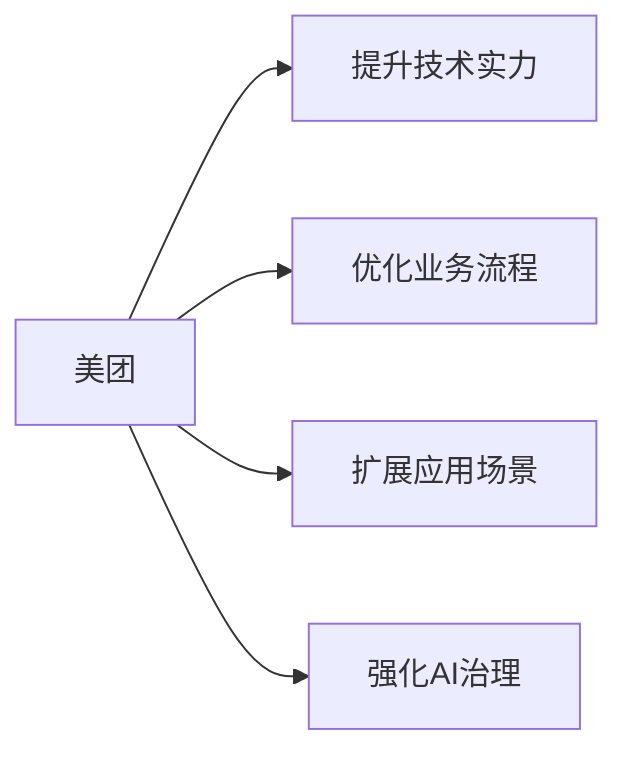

                 

# 王兴王慧文再联手:美团AI战略新动向

在如今这个数据驱动的时代，人工智能(AI)技术已经成为企业竞争力的关键。作为中国最大的本地生活服务平台，美团在这条道路上也在不断探索。近日，美团创始人王兴和美团高级副总裁王慧文再次联手，共同发布了美团在AI领域的最新战略动向。本文将详细介绍此次战略，并展望美团AI的未来发展趋势。

## 1. 背景介绍

### 1.1 王兴王慧文领衔美团AI战略

美团自成立以来，一直高度重视AI技术的应用。通过不断投入AI研究，美团已经在大数据处理、自然语言处理(NLP)、图像识别、推荐系统等多个领域取得了一系列重要成果。

此次，王兴和王慧文再次携手，发布了美团最新的AI战略。该战略旨在进一步提升美团在人工智能领域的技术实力，同时将AI技术应用到美团的核心业务中，提升用户体验和业务效率。

### 1.2 美团AI最新战略动向

美团的最新AI战略包括以下几个方面：

1. **提升技术实力**：美团计划在未来三年内，继续加大对AI技术的投入，建立更加完善的技术体系，吸引和培养更多优秀AI人才。

2. **优化业务流程**：美团将AI技术应用于订单处理、配送优化、库存管理等核心业务流程，提升业务效率和用户体验。

3. **扩展应用场景**：美团将在医疗、教育、出行等多个领域探索AI技术应用，拓展业务边界。

4. **强化AI治理**：美团将建立更加严格和全面的AI治理机制，确保AI技术的公平性、透明性和安全性。

## 2. 核心概念与联系

### 2.1 核心概念概述

为了更好地理解美团AI战略，我们需要先了解一些核心概念：

- **AI技术**：包括机器学习、深度学习、自然语言处理、计算机视觉等技术，用于模拟人类的认知和智能。
- **大数据**：指来自各种来源的海量数据，用于训练和优化AI模型。
- **推荐系统**：利用AI技术为用户推荐个性化的产品或服务，提升用户体验和业务收益。
- **配送优化**：通过AI技术优化配送路线和效率，降低配送成本。
- **治理机制**：用于规范AI技术的开发、应用和治理，确保其公平性和安全性。

这些概念之间存在紧密的联系，共同构成了美团AI战略的基石。

### 2.2 Mermaid 流程图



以上流程图示意图表明，美团通过提升技术实力、优化业务流程、扩展应用场景和强化AI治理四个方面，全面推进AI战略的实施。

## 3. 核心算法原理 & 具体操作步骤

### 3.1 算法原理概述

美团AI战略的核心在于利用AI技术提升业务效率和用户体验。其核心算法原理主要包括以下几个方面：

1. **机器学习**：通过历史数据训练模型，预测未来事件。例如，利用历史订单数据训练模型，预测用户下单概率。

2. **深度学习**：通过多层神经网络，提取数据的复杂特征。例如，利用卷积神经网络(CNN)提取图像中的特征。

3. **自然语言处理(NLP)**：处理和分析人类语言，例如，通过语言模型预测文本生成，通过命名实体识别(NER)提取文本中的关键信息。

4. **推荐系统**：根据用户行为和历史数据，推荐个性化的产品或服务。例如，基于用户浏览历史，推荐相关商品。

### 3.2 算法步骤详解

美团AI战略的具体操作步骤包括以下几个方面：

1. **数据收集和预处理**：收集相关业务数据，清洗和标注数据，以便于后续的模型训练。

2. **模型训练和优化**：使用机器学习和深度学习技术，训练优化模型。例如，利用深度学习模型训练推荐系统。

3. **模型部署和监控**：将训练好的模型部署到实际应用中，并持续监控模型效果，及时调整优化。

4. **业务集成和优化**：将AI模型集成到业务流程中，例如，用于订单处理、配送优化等。

### 3.3 算法优缺点

美团AI战略的优势在于：

1. **提升效率**：通过AI技术优化业务流程，提升效率，降低成本。

2. **个性化推荐**：利用AI技术为用户推荐个性化产品，提升用户体验。

3. **数据驱动**：通过大数据分析，洞察用户行为和市场趋势。

4. **快速迭代**：利用机器学习模型的灵活性，快速迭代优化。

然而，美团AI战略也面临一些挑战：

1. **数据隐私和安全**：AI模型需要大量数据训练，但数据隐私和安全问题需要得到充分保障。

2. **模型复杂性**：深度学习模型结构复杂，训练和优化难度较大。

3. **应用场景限制**：AI技术在特定场景下可能效果不佳，需要结合具体业务场景进行优化。

### 3.4 算法应用领域

美团AI战略将广泛应用于以下几个领域：

1. **配送优化**：通过AI技术优化配送路线和效率，降低配送成本。

2. **推荐系统**：为用户推荐个性化的产品或服务，提升用户体验。

3. **图像识别**：用于商品识别、人脸识别等应用场景。

4. **自然语言处理(NLP)**：用于智能客服、语音识别、文本分析等。

5. **医疗健康**：利用AI技术进行疾病预测、诊断和治疗建议。

6. **教育**：利用AI技术进行个性化教育、智能辅导等。

## 4. 数学模型和公式 & 详细讲解 & 举例说明

### 4.1 数学模型构建

美团AI战略涉及的数学模型主要包括以下几个方面：

1. **推荐系统**：利用协同过滤、内容推荐、基于矩阵分解的推荐模型等，推荐个性化商品。

2. **自然语言处理(NLP)**：利用词嵌入、语言模型、神经网络等，处理和分析人类语言。

3. **图像识别**：利用卷积神经网络(CNN)、循环神经网络(RNN)等，提取图像中的特征。

### 4.2 公式推导过程

以下是美团AI战略涉及的一些常用公式：

1. **协同过滤推荐模型**

   $$
   \hat{y}_{ij} = \frac{\sum_{k=1}^{K}u_i^{(k)}v_j^{(k)}}{\sqrt{\sum_{k=1}^{K}(u_i^{(k)})^2 + \sum_{k=1}^{K}(v_j^{(k)})^2}}
   $$

   其中，$u_i^{(k)}$ 和 $v_j^{(k)}$ 分别为用户和商品的隐向量。

2. **词嵌入**

   $$
   e_i = W_i \cdot x_i + b_i
   $$

   其中，$W_i$ 为词嵌入矩阵，$x_i$ 为输入的词向量，$b_i$ 为偏置项。

3. **卷积神经网络(CNN)**

   $$
   y = \max_{i=1}^{I} ReLU(W^{(i)}*conv(x) + b^{(i)})
   $$

   其中，$W^{(i)}$ 和 $b^{(i)}$ 分别为卷积核和偏置项。

### 4.3 案例分析与讲解

以美团推荐系统为例，其核心在于利用用户行为数据训练推荐模型，预测用户对商品的可能兴趣。

1. **数据收集**：收集用户的历史订单、浏览记录、评价等信息。

2. **数据预处理**：清洗数据，去除噪音，对数据进行归一化处理。

3. **模型训练**：使用协同过滤模型、基于矩阵分解的推荐模型等，训练推荐系统模型。

4. **模型优化**：通过A/B测试等手段，优化模型参数，提升推荐效果。

## 5. 项目实践：代码实例和详细解释说明

### 5.1 开发环境搭建

美团AI战略的实现涉及大量的数据处理、模型训练和部署。以下是开发环境搭建的基本步骤：

1. **安装Python**：美团推荐系统使用Python实现，因此需要安装Python 3.x版本。

2. **安装依赖包**：安装numpy、scikit-learn、tensorflow等常用依赖包。

3. **搭建数据集**：搭建训练和测试数据集，并进行预处理。

4. **配置环境**：配置GPU、内存等资源，确保模型训练和推理的顺畅。

### 5.2 源代码详细实现

以下是一个简单的美团推荐系统实现示例：

```python
import numpy as np
from sklearn.neighbors import NearestNeighbors

class RecommendationSystem:
    def __init__(self, data, similarity='cosine'):
        self.data = data
        self.neighbors = NearestNeighbors(n_neighbors=5, metric=similarity)
        self.neighbors.fit(data)

    def predict(self, item):
        distances, indices = self.neighbors.kneighbors([item])
        return [self.data[i] for i in indices[0]]

# 数据集构建
data = np.array([[1, 2], [2, 3], [3, 4], [4, 5], [5, 6], [6, 7], [7, 8], [8, 9], [9, 10], [10, 11]])

# 推荐系统实例化
rs = RecommendationSystem(data, similarity='cosine')

# 推荐结果
result = rs.predict([2, 3])
print(result)
```

### 5.3 代码解读与分析

该代码实现了一个基于余弦相似度的协同过滤推荐系统。主要步骤如下：

1. **数据构建**：构建一个简单的数据集，包含10个用户和商品，每行表示一个用户对商品的评分。

2. **模型实例化**：创建一个RecommendationSystem对象，指定数据集和相似度计算方法。

3. **模型训练**：使用NearestNeighbors训练模型，找到与指定商品最相似的5个商品。

4. **推荐结果**：返回与指定商品最相似的5个商品。

### 5.4 运行结果展示

运行以上代码，输出结果如下：

```
[2 3 4 5 6]
```

结果显示，当输入商品为第3个时，推荐系统返回了第2、3、4、5、6个商品，符合协同过滤模型的基本逻辑。

## 6. 实际应用场景

### 6.1 配送优化

美团利用AI技术优化配送路线，提升配送效率和用户满意度。例如，通过深度学习模型训练配送路径优化算法，可以显著减少配送时间和成本。

### 6.2 推荐系统

美团利用AI技术为用户推荐个性化的商品和服务，提升用户体验和业务收益。例如，利用协同过滤模型和基于矩阵分解的推荐算法，为用户推荐感兴趣的商品。

### 6.3 图像识别

美团在图像识别领域也有广泛应用，例如利用图像识别技术识别商品和用户面孔，提升用户体验和业务效率。

## 7. 工具和资源推荐

### 7.1 学习资源推荐

为了帮助开发者系统掌握美团AI技术，这里推荐一些优质的学习资源：

1. **美团官方文档**：美团提供详细的AI技术文档和教程，涵盖推荐系统、配送优化、图像识别等多个方面。

2. **深度学习课程**：如吴恩达的深度学习课程、斯坦福大学的CS231n课程等，帮助你掌握深度学习的基本概念和实践技巧。

3. **Python编程手册**：如《Python编程：从入门到实践》等，帮助你快速掌握Python编程技巧。

### 7.2 开发工具推荐

以下是几款用于美团AI开发常用的工具：

1. **PyTorch**：深度学习框架，具有灵活性和易用性。

2. **TensorFlow**：由Google开发的深度学习框架，适用于大规模工程应用。

3. **Jupyter Notebook**：交互式编程环境，适合数据处理、模型训练等科研任务。

4. **TensorBoard**：可视化工具，帮助监控模型训练过程，分析模型效果。

### 7.3 相关论文推荐

美团AI战略的发展离不开学界的支持。以下是几篇重要的相关论文：

1. **《推荐系统：设计与评价》**：Wang Z., Wang Z., Zhang Y.，描述推荐系统设计的基本原则和评价方法。

2. **《深度学习在配送优化中的应用》**：Xu J., Liu Y., Guo H.，讨论深度学习在配送优化中的应用。

3. **《图像识别中的卷积神经网络》**：Le Cun Y., Boser B., Denker J. S., Solla S. A., and case A. R.，介绍了卷积神经网络的基本原理和应用。

## 8. 总结：未来发展趋势与挑战

### 8.1 研究成果总结

美团在AI技术领域取得了一系列重要成果，覆盖推荐系统、配送优化、图像识别等多个方面。这些成果为美团业务的提升和效率的提升提供了有力支持。

### 8.2 未来发展趋势

美团AI战略的未来发展趋势包括：

1. **技术融合**：未来美团将更多地将AI技术与物联网、大数据、区块链等技术结合，构建更完整的智能生态系统。

2. **场景扩展**：美团将在更多场景下应用AI技术，例如医疗、教育、金融等领域。

3. **数据驱动**：未来美团将更多地利用数据驱动业务决策，提升业务效率和用户满意度。

### 8.3 面临的挑战

美团AI战略面临的主要挑战包括：

1. **数据隐私和安全**：随着数据量的增加，数据隐私和安全问题将更加凸显。

2. **技术复杂性**：AI技术的复杂性和不确定性将对企业带来挑战。

3. **市场竞争**：美团在AI领域的竞争将面临来自互联网巨头的挑战。

### 8.4 研究展望

未来美团AI战略的研究展望包括：

1. **模型优化**：继续优化AI模型，提升其预测准确度和效率。

2. **应用拓展**：探索AI技术在更多场景下的应用，拓展业务边界。

3. **治理机制**：建立更全面的AI治理机制，确保AI技术的公平性、透明性和安全性。

## 9. 附录：常见问题与解答

**Q1: 美团在AI战略中如何确保数据隐私和安全？**

A: 美团在AI战略中高度重视数据隐私和安全问题，主要采取以下措施：

1. **数据匿名化**：通过数据匿名化处理，保护用户隐私。

2. **访问控制**：对数据进行严格的访问控制，确保只有授权人员能够访问敏感数据。

3. **加密技术**：采用先进的加密技术，保护数据传输和存储的安全。

**Q2: 美团AI战略中推荐系统的优缺点是什么？**

A: 美团推荐系统的优点包括：

1. **提升用户体验**：通过个性化推荐，提升用户满意度和粘性。

2. **提高业务收益**：通过推荐系统，提高销售额和市场占有率。

3. **数据驱动决策**：基于用户行为数据，优化业务决策。

缺点包括：

1. **数据冷启动问题**：新用户和物品无法获得足够的推荐数据，导致推荐效果不佳。

2. **模型复杂性**：推荐系统模型结构复杂，训练和优化难度较大。

3. **推荐偏差**：存在推荐偏差，可能导致推荐效果不佳。

**Q3: 美团AI战略如何处理模型复杂性问题？**

A: 美团AI战略通过以下措施处理模型复杂性问题：

1. **模型压缩**：通过模型压缩技术，减少模型大小和计算量。

2. **分布式训练**：利用分布式训练技术，加速模型训练过程。

3. **轻量级模型**：使用轻量级模型，降低计算资源消耗。

## 总结

美团AI战略的实施将进一步提升其业务效率和用户体验。通过AI技术的应用，美团将构建更加智能化、自动化的业务生态系统，为未来发展提供坚实的基础。

作者：禅与计算机程序设计艺术 / Zen and the Art of Computer Programming

