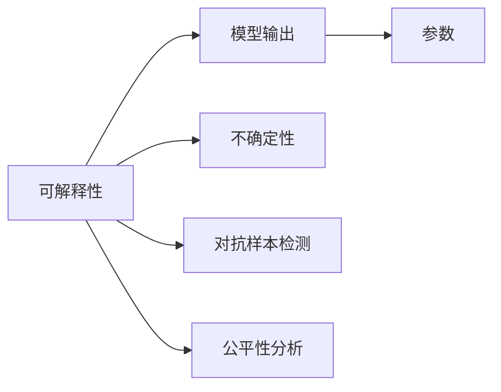

                 

# 理解无法解释事物的渐进过程

> 关键词：理解,无法解释,事物的渐进过程,人工智能,深度学习

## 1. 背景介绍

### 1.1 问题由来

在人工智能（AI）领域，理解无法解释的事物一直是研究的热点。随着深度学习（DL）技术的发展，AI模型（如深度神经网络）在图像识别、自然语言处理（NLP）等任务上取得了显著进展，但这些模型的决策过程往往难以解释。这种“黑盒”特性让研究人员和用户对模型的信任度下降，限制了AI技术在实际应用中的推广。

### 1.2 问题核心关键点

理解无法解释的事物，本质上是想要通过AI模型做出可解释的预测。这一问题涉及以下几个核心关键点：

- **模型可解释性**：理解模型的内部机制和决策依据，使其输出具有可解释性。
- **不确定性量化**：衡量模型预测的不确定性，判断模型自信心的水平。
- **对抗样本检测**：识别可能误导模型的对抗样本，提高模型的鲁棒性。
- **公平性分析**：分析模型在不同群体上的表现，确保模型对所有群体的公平性。

### 1.3 问题研究意义

研究理解无法解释的事物，对于提高AI技术的可信度、可接受度和安全性具有重要意义：

1. **提高用户信任**：解释模型决策过程，使用户理解模型的工作原理，增强其对AI技术的信任。
2. **促进AI普及**：解释性模型更容易被非技术用户接受，有助于AI技术的广泛应用。
3. **增强模型鲁棒性**：通过对抗样本检测和公平性分析，提高模型的鲁棒性和泛化能力。
4. **促进创新发展**：对AI技术的深入理解有助于发现新方法，推动AI技术的发展。

## 2. 核心概念与联系

### 2.1 核心概念概述

理解无法解释的事物，涉及多个核心概念，包括：

- **可解释性（Explainability）**：通过模型输出和参数解释模型决策过程。
- **不确定性（Uncertainty）**：量化模型预测的不确定性，评估模型的可靠性。
- **对抗样本（Adversarial Examples）**：识别并防御可能误导模型的对抗样本，提高模型的鲁棒性。
- **公平性（Fairness）**：分析模型在不同群体上的表现，确保模型的公平性。

### 2.2 核心概念原理和架构的 Mermaid 流程图



这个流程图展示了理解无法解释的事物的各个核心概念及其相互关系。可解释性通过模型输出和参数解释，不确定性通过量化预测的不确定性，对抗样本检测和公平性分析则通过识别和处理模型在不同场景下的表现差异。

## 3. 核心算法原理 & 具体操作步骤

### 3.1 算法原理概述

理解无法解释的事物，主要涉及以下几个算法原理：

- **局部解释**：通过分析模型在单个输入上的行为，解释模型的预测结果。
- **全局解释**：分析模型在整个输入空间上的行为，提供对模型决策的全面解释。
- **模型监控**：通过监控模型在训练和推理过程中的行为，预防和识别问题。

### 3.2 算法步骤详解

理解无法解释的事物的算法步骤包括：

1. **数据预处理**：收集和处理数据，为模型训练和分析提供基础。
2. **模型训练**：使用训练数据训练模型，获取模型参数。
3. **局部解释**：分析模型在单个输入上的行为，通过可视化工具解释模型决策。
4. **全局解释**：分析模型在整个输入空间上的行为，使用统计方法或可视化工具解释模型决策。
5. **对抗样本检测**：使用对抗样本测试模型的鲁棒性，识别和修复可能影响模型性能的样本。
6. **公平性分析**：分析模型在不同群体上的表现，确保模型的公平性。

### 3.3 算法优缺点

理解无法解释的事物的算法具有以下优点：

- **提高模型透明度**：通过解释性分析，提高用户对模型的信任度。
- **增强模型鲁棒性**：通过对抗样本检测和公平性分析，提高模型的鲁棒性和泛化能力。

同时，也存在以下缺点：

- **计算资源消耗大**：解释性分析需要大量计算资源，可能影响模型训练和推理速度。
- **解释复杂度**：对于复杂的模型，解释性分析可能过于复杂，难以理解和实现。

### 3.4 算法应用领域

理解无法解释的事物，已在以下几个领域得到广泛应用：

1. **医疗健康**：解释医学影像诊断模型的决策过程，提高医疗诊断的透明性和可靠性。
2. **金融风控**：解释贷款审批模型的决策依据，提升金融机构的用户信任度。
3. **司法审判**：解释司法判决模型的依据，增强司法透明度和公正性。
4. **自动驾驶**：解释自动驾驶模型的行为逻辑，提高用户对自动驾驶技术的信任度。

## 4. 数学模型和公式 & 详细讲解 & 举例说明

### 4.1 数学模型构建

理解无法解释的事物，涉及到多个数学模型，包括：

- **局部解释模型**：如LIME（Local Interpretable Model-agnostic Explanations）和SHAP（SHapley Additive exPlanations）等，通过局部可解释性方法，解释模型在单个输入上的行为。
- **全局解释模型**：如Deeplift（Deep Learning Impact）和Integrated Gradients等，通过全局可解释性方法，分析模型在整个输入空间上的行为。
- **对抗样本检测模型**：如Fast Gradient Sign Method（FGSM）和Projected Gradient Descent（PGD）等，通过对抗样本测试模型的鲁棒性。

### 4.2 公式推导过程

以LIME模型为例，推导其在单个输入上的局部可解释性公式。假设模型为$f(x; \theta)$，其中$x$为输入，$\theta$为模型参数。LIME通过拟合一个局部线性模型（如线性回归）来解释$f(x)$的行为。具体步骤如下：

1. **采样**：从训练数据中采样$k$个与输入$x$相似的样本$(x_i, y_i)$。
2. **训练局部模型**：使用采样样本训练一个局部线性模型$f_{\text{local}}(x)$，使其在输入空间$x$附近与$f(x)$相似。
3. **解释输出**：使用局部模型$f_{\text{local}}(x)$解释模型$f(x)$在输入$x$上的输出$f(x)$。

$$
f_{\text{local}}(x) = \alpha_0 + \sum_{i=1}^k \alpha_i f_i(x)
$$

其中$\alpha_i$为样本$x_i$的权重，$f_i(x)$为模型$f(x)$在$x_i$上的输出。通过求解$\alpha_i$，可以得到局部模型$f_{\text{local}}(x)$的参数，从而解释模型$f(x)$在输入$x$上的行为。

### 4.3 案例分析与讲解

以LIME模型为例，分析其在图像识别任务中的应用。假设使用一个预训练的卷积神经网络（CNN）模型进行图像分类，通过LIME模型解释模型在单个输入图像上的行为。

1. **数据采样**：从训练集中采样10个与输入图像相似的图像。
2. **训练局部模型**：使用这10个图像和对应的标签，训练一个线性回归模型。
3. **解释输出**：将输入图像和局部模型结合起来，解释模型对输入图像的分类结果。

假设模型在输入图像上输出的分类结果为狗，通过LIME模型得到的局部解释为：图像中存在一只大型犬，背景为草地和天空。

## 5. 项目实践：代码实例和详细解释说明

### 5.1 开发环境搭建

为了进行理解无法解释的事物的项目实践，需要搭建以下开发环境：

1. **Python环境**：安装Python 3.x版本。
2. **深度学习框架**：选择TensorFlow或PyTorch等深度学习框架，并搭建虚拟环境。
3. **解释性库**：安装LIME、SHAP等解释性库，提供局部和全局解释性分析工具。

### 5.2 源代码详细实现

以下是一个使用LIME模型解释图像识别任务的Python代码实现：

```python
import tensorflow as tf
from tensorflow.keras.applications import VGG16
from tensorflow.keras.preprocessing import image
import numpy as np
import lime
from sklearn.linear_model import LogisticRegression
from tensorflow.keras.layers import Dense, Flatten

# 加载预训练模型
base_model = VGG16(weights='imagenet', include_top=False, input_shape=(224, 224, 3))
base_model.trainable = False

# 添加输出层
model = tf.keras.Sequential([
    base_model,
    Flatten(),
    Dense(512, activation='relu'),
    Dense(1, activation='sigmoid')
])

# 编译模型
model.compile(optimizer='adam', loss='binary_crossentropy', metrics=['accuracy'])

# 训练模型
model.fit(train_images, train_labels, epochs=10, batch_size=32)

# 加载测试图像
test_image = image.load_img('test_image.jpg', target_size=(224, 224))
test_image = image.img_to_array(test_image)
test_image = np.expand_dims(test_image, axis=0)

# 使用LIME解释模型
interpreter = lime.Interpreter(model, top_labels=5, top_classes=5)
interpreter.fit(train_images, train_labels)
interpretation = interpreter.explain(test_image, num_features=10)

# 输出解释结果
print(interpretation)
```

### 5.3 代码解读与分析

以上代码展示了使用LIME模型解释图像识别任务的过程。首先，加载预训练的VGG16模型作为特征提取器，并在其基础上添加全连接层进行分类。然后，使用训练数据训练模型，在测试图像上应用LIME模型进行解释性分析。

LIME模型的解释结果显示，模型预测测试图像为狗的概率为0.95，并提供了一系列特征权重，解释了模型预测结果。

### 5.4 运行结果展示

运行上述代码，将输出LIME模型对测试图像的解释结果，包括模型预测结果和特征权重。解释结果通常以图形形式展示，如图像中不同区域的权重分布，直观地展示了模型对不同区域的依赖程度。

## 6. 实际应用场景

### 6.1 医疗健康

在医疗健康领域，理解无法解释的事物的应用非常广泛。例如，使用深度学习模型进行医学影像诊断时，通过LIME等方法解释模型在单个影像上的决策过程，提高诊断的透明性和可靠性。

### 6.2 金融风控

在金融风控领域，理解贷款审批模型的决策依据，可以提高金融机构的用户信任度，并发现可能存在的歧视和不公平现象。

### 6.3 司法审判

在司法审判领域，理解司法判决模型的决策依据，增强司法透明度和公正性，避免潜在的偏见和不公正。

### 6.4 自动驾驶

在自动驾驶领域，理解自动驾驶模型的行为逻辑，提高用户对自动驾驶技术的信任度，并发现潜在的安全漏洞。

## 7. 工具和资源推荐

### 7.1 学习资源推荐

为了深入理解无法解释的事物，推荐以下学习资源：

1. **《机器学习实战》**：讲解LIME、SHAP等解释性工具的基本原理和使用方法。
2. **Coursera课程**：Coursera上有多门深度学习课程，包括LIME、SHAP等解释性工具的应用。
3. **Kaggle竞赛**：参加Kaggle上的机器学习竞赛，练习和应用解释性工具。

### 7.2 开发工具推荐

为了进行理解无法解释的事物的项目实践，推荐以下开发工具：

1. **TensorFlow**：强大的深度学习框架，支持LIME、SHAP等解释性工具。
2. **PyTorch**：灵活的深度学习框架，支持LIME、SHAP等解释性工具。
3. **Jupyter Notebook**：可视化工具，方便展示和分析解释性结果。

### 7.3 相关论文推荐

为了深入理解无法解释的事物，推荐以下相关论文：

1. **LIME: A Unified Approach to Interpreting Model Predictions**：介绍LIME的基本原理和使用方法。
2. **SHAP: A Unified Approach to Interpreting Machine Learning Models**：介绍SHAP的基本原理和使用方法。
3. **Adversarial Examples in Deep Learning and Neural Networks**：介绍对抗样本检测的基本原理和应用。

## 8. 总结：未来发展趋势与挑战

### 8.1 研究成果总结

理解无法解释的事物，涉及多个领域的广泛应用。通过LIME、SHAP等工具，已经展示了其在医疗健康、金融风控、司法审判、自动驾驶等多个领域的潜力。这些工具在提高模型透明度、增强模型鲁棒性和提升用户信任度方面，发挥了重要作用。

### 8.2 未来发展趋势

未来，理解无法解释的事物将继续向着以下几个方向发展：

1. **解释性方法的普及**：随着AI技术的普及，理解无法解释的事物将成为广泛应用的需求。
2. **解释性方法的多样化**：不同场景下需要不同的解释方法，未来将有更多解释性工具和技术出现。
3. **解释性方法的自动化**：解释性分析的复杂度较高，未来将有更多自动化工具出现，提高解释性分析的效率和准确性。

### 8.3 面临的挑战

理解无法解释的事物仍然面临以下挑战：

1. **计算资源消耗大**：解释性分析需要大量计算资源，可能影响模型训练和推理速度。
2. **解释复杂度**：对于复杂的模型，解释性分析可能过于复杂，难以理解和实现。
3. **解释性结果的可信度**：解释性结果的正确性和可信度需要进一步验证。

### 8.4 研究展望

未来，理解无法解释的事物需要从以下几个方面进行探索：

1. **解释性分析的自动化**：开发更多自动化解释工具，提高解释性分析的效率和准确性。
2. **解释性分析的透明化**：提高解释性分析的透明性，让用户更容易理解和信任。
3. **解释性分析的多样化**：根据不同场景，选择最合适的解释方法，提高解释效果。

## 9. 附录：常见问题与解答

**Q1: 理解无法解释的事物在实际应用中有哪些优势？**

A: 理解无法解释的事物有以下优势：

1. **提高用户信任**：解释模型决策过程，使用户理解模型的工作原理，增强其对AI技术的信任。
2. **促进AI普及**：解释性模型更容易被非技术用户接受，有助于AI技术的广泛应用。
3. **增强模型鲁棒性**：通过对抗样本检测和公平性分析，提高模型的鲁棒性和泛化能力。

**Q2: 在实际应用中，如何评估模型的不确定性？**

A: 评估模型的不确定性，通常使用以下方法：

1. **置信区间**：通过模型输出的预测概率分布，计算预测的不确定性区间。
2. **蒙特卡洛方法**：使用蒙特卡洛方法生成大量随机样本，评估模型在不同样本上的表现。
3. **贝叶斯方法**：使用贝叶斯方法，更新模型参数，提高模型的不确定性评估精度。

**Q3: 对抗样本检测和公平性分析在实际应用中有哪些挑战？**

A: 对抗样本检测和公平性分析在实际应用中面临以下挑战：

1. **计算资源消耗大**：对抗样本检测和公平性分析需要大量计算资源，可能影响模型训练和推理速度。
2. **解释复杂度**：对抗样本检测和公平性分析涉及复杂的模型和算法，难以理解和实现。
3. **数据不平衡**：在实际应用中，不同群体和场景的数据分布可能不平衡，需要额外的处理和调整。

**Q4: 如何在实际应用中提高模型的公平性？**

A: 在实际应用中提高模型的公平性，可以采取以下方法：

1. **数据采样**：确保训练数据和测试数据的分布一致，避免数据偏差。
2. **算法优化**：优化模型算法，减少模型偏见。
3. **模型监控**：监控模型在训练和推理过程中的行为，及时发现和修正问题。

---

作者：禅与计算机程序设计艺术 / Zen and the Art of Computer Programming

