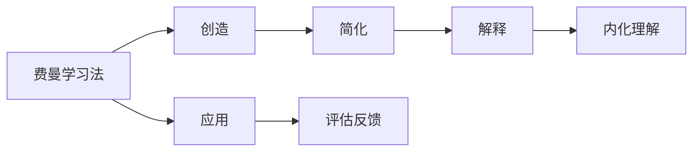

                 

# 理解费曼学习法：创造与理解的关系

## 1. 背景介绍

在人工智能和科技发展的历程中，费曼学习法（Richard Feynman's Learning Method）作为一种高效的学习策略，其核心思想简单而深远：通过将复杂问题拆解成易于理解的小部分，并通过创造性的解释，将知识内化为深层的理解。费曼学习法强调学习不仅仅是知识的积累，更是对知识深层次的理解和应用。这一思想不仅在物理学的研究中有显著作用，而且在计算机科学、人工智能等技术领域同样具有重要价值。

费曼学习法的核心理念可以归结为“创造”和“理解”，即通过创造性的表达，加深对知识的理解。本文旨在通过深入探讨费曼学习法的原理和应用，帮助我们更好地理解和应用这一学习策略，特别是在人工智能和机器学习领域，从而提升学习效率和创新能力。

## 2. 核心概念与联系

### 2.1 核心概念概述

为了更深刻地理解费曼学习法，首先需要明确其核心概念：

- **费曼学习法（Feynman Learning Method）**：一种基于创造性讲解来加深理解的学习方法。
- **创造（Creativity）**：创造性思维，通过类比、故事讲述等手段，将复杂概念简化和形象化。
- **理解（Comprehension）**：对知识的深刻理解和掌握，包括对概念、原理和应用的理解。

费曼学习法的核心在于，通过将复杂问题简化，并运用创造性思维来解释，实现知识的深层内化。这种方法尤其适用于学习复杂和抽象的科学和技术概念，如物理学中的量子力学、计算机科学中的算法和数据结构等。

### 2.2 核心概念原理和架构的 Mermaid 流程图



这个流程图展示了费曼学习法的基本流程：

1. 从复杂问题开始（A）。
2. 将问题简化（C）。
3. 创造性地解释（D）。
4. 将知识内化于理解中（E）。
5. 应用所学知识（F）。
6. 评估反馈以改进理解（G）。

### 2.3 核心概念的联系

费曼学习法的核心概念间存在紧密联系：

- **创造与理解是双向促进的**：创造性的解释可以帮助理解复杂的概念，而对概念的深刻理解又可以激发更创造性的解释。
- **简化与解释是互相辅助的**：简化的过程帮助聚焦关键点，解释的过程则确保理解不会停留在表层。
- **应用与评估是学习的终归**：通过实际应用和反馈，可以评估学习的深度和广度，并指导进一步的学习。

## 3. 核心算法原理 & 具体操作步骤

### 3.1 算法原理概述

费曼学习法的核心原理是通过创造性的讲解来加深理解，而算法化的步骤则将这一过程具体化，使其可执行和可重复。其基本步骤包括：

1. **选择学习目标**：明确学习什么以及为何学习。
2. **简化问题**：将复杂问题拆解成可理解的部分。
3. **创造性解释**：用类比、故事或比喻等手段解释简化后的部分。
4. **测试反馈**：通过教别人来评估自己的理解程度，并根据反馈调整。
5. **持续改进**：通过不断的创造性讲解和测试反馈，加深理解。

### 3.2 算法步骤详解

#### 步骤1：选择学习目标

明确学习目标和需要掌握的核心概念。例如，在学习机器学习算法时，目标是理解随机森林的工作原理和应用场景。

#### 步骤2：简化问题

将目标问题拆解成几个小部分，以便于理解和处理。例如，随机森林的决策树生成、随机性设置和集成方法。

#### 步骤3：创造性解释

用创造性的方式解释每个部分。例如，用“森林中每棵树都代表一个决策树，随机森林则是由多棵树组成的”来解释随机森林。

#### 步骤4：测试反馈

通过教别人来评估自己的解释效果，找出不足之处。例如，给非专业的朋友或同事讲解随机森林，观察他们是否能理解，并根据反馈调整解释方式。

#### 步骤5：持续改进

根据反馈不断改进解释方式，加深对概念的理解。例如，进一步优化类比和解释方式，使其更易于理解。

### 3.3 算法优缺点

费曼学习法的主要优点包括：

- **提升理解深度**：通过创造性解释，帮助将复杂概念简化并深入理解。
- **促进知识应用**：通过讲解，加深对知识的应用理解，提高解决问题能力。
- **提升记忆效果**：通过多次讲解和理解，有助于长期记忆。

其主要缺点包括：

- **需投入时间**：费曼学习法需要花费较多时间在简化和解释上。
- **依赖于创造性思维**：要求有较强的创造性思维能力，可能对一些人来说较难实现。

### 3.4 算法应用领域

费曼学习法广泛应用于教育、科学研究和软件开发等领域：

- **教育**：帮助学生理解和掌握复杂概念，提高学习效果。
- **科学研究**：促进研究人员对复杂科学原理的理解和创新。
- **软件开发**：增强程序员对复杂算法和数据结构的理解，提高代码质量。

## 4. 数学模型和公式 & 详细讲解 & 举例说明

### 4.1 数学模型构建

费曼学习法主要依赖于创造性解释，其核心在于理解复杂的概念和原理。因此，数学模型主要关注如何通过创造性解释来加深理解。

### 4.2 公式推导过程

虽然费曼学习法更多依赖于创造性思维而非严格数学公式，但在一些特定场景下，仍需进行公式推导以加深理解。例如，在学习微积分时，公式推导可以帮助理解导数和积分的概念。

### 4.3 案例分析与讲解

以学习微积分为例：

- **选择目标**：理解导数和积分的基本概念和应用。
- **简化问题**：导数是函数在某一点的变化率，积分是求函数的面积。
- **创造性解释**：将导数类比为“爬坡的速度”，将积分类比为“平铺的面积”。
- **测试反馈**：通过教别人理解这两个类比，评估自己的解释效果。
- **持续改进**：通过多次解释和反馈，加深对导数和积分的理解。

## 5. 项目实践：代码实例和详细解释说明

### 5.1 开发环境搭建

费曼学习法主要依赖于创造性思维和口头讲解，并不涉及代码实现。但在计算机科学和编程领域，可以将费曼学习法与编程实践结合，通过代码注释和讲解来加深对编程概念的理解。

### 5.2 源代码详细实现

由于费曼学习法不涉及代码实现，以下将通过代码注释和解释来说明如何在编程中应用费曼学习法。

```python
# 假设我们正在学习Python的列表推导式（List Comprehension）

# 学习目标：理解列表推导式的语法和应用
# 简化问题：列表推导式可以用于快速生成列表
# 创造性解释：列表推导式可以类比为“一道流水线”，每个步骤处理一个元素，最终生成一个新列表
# 测试反馈：向同事解释列表推导式的流水线原理，根据反馈调整解释方式
# 持续改进：多次解释和调整，加深理解

# 示例代码：生成一个包含1到10平方的列表
squares = [x**2 for x in range(1, 11)]

# 注释解释
# 列表推导式的语法：[expression for item in iterable]
# 1. 表达式：x**2，表示对每个元素进行平方操作
# 2. 迭代器：range(1, 11)，表示迭代1到10的整数
# 3. for循环：将每个元素x平方，生成一个新列表

# 输出结果
print(squares)
# 输出：[1, 4, 9, 16, 25, 36, 49, 64, 81, 100]
```

### 5.3 代码解读与分析

在代码注释中，我们使用了费曼学习法的核心步骤，通过创造性解释和测试反馈，来加深对列表推导式的理解。这种方法不仅有助于初学者快速掌握编程概念，也有助于经验丰富的程序员回顾和巩固知识。

### 5.4 运行结果展示

运行上述代码，输出结果展示了通过列表推导式生成的平方数列表。这不仅验证了代码的正确性，也加深了我们对列表推导式工作原理的理解。

## 6. 实际应用场景

### 6.1 教育领域

在教育领域，费曼学习法已被广泛应用于课堂教学和自学中。例如，在物理课中，老师可以通过类比和故事讲述，帮助学生理解复杂的物理概念。

### 6.2 科学研究

在科学研究中，费曼学习法同样有效。例如，在研究量子力学时，通过创造性解释和类比，科学家可以更深入地理解复杂的物理原理。

### 6.3 软件开发

在软件开发中，费曼学习法可以帮助程序员理解和掌握复杂算法和数据结构。例如，通过创造性讲解，可以加深对递归、图论等算法概念的理解。

### 6.4 未来应用展望

随着人工智能和机器学习的发展，费曼学习法将在更多领域得到应用：

- **自然语言处理**：通过创造性解释，帮助理解复杂的语言模型和算法。
- **机器学习**：通过创造性讲解，加深对深度学习、强化学习等概念的理解。
- **科学计算**：在科学计算中，费曼学习法可以帮助科学家理解复杂的数学模型和算法。

## 7. 工具和资源推荐

### 7.1 学习资源推荐

- **《费曼学习法：创造性的思考》（The Art of Learning）**：书籍介绍了费曼学习法的核心思想和应用方法。
- **Coursera上的《费曼学习法》课程**：在线课程通过实际案例，讲解如何应用费曼学习法。
- **费曼学习法应用案例库**：收集和分享了多种应用费曼学习法的案例，适合学习和参考。

### 7.2 开发工具推荐

- **Markdown编辑器**：如Typora、Github Pages等，方便编写和分享代码注释和解释。
- **视频教程**：如YouTube上的编程教育频道，提供丰富的编程讲解和案例。

### 7.3 相关论文推荐

- **《费曼学习法在科学教育中的应用》（Feynman Learning Method in Science Education）**：论文探讨了费曼学习法在科学教育中的实际应用效果。
- **《创造性思维与学习效率》（Creative Thinking and Learning Efficiency）**：研究论文探讨了创造性思维对学习效率的影响。

## 8. 总结：未来发展趋势与挑战

### 8.1 研究成果总结

费曼学习法是一种高效的学习策略，通过创造性解释和简化问题，帮助深入理解复杂概念。其在教育、科研、编程等领域已得到广泛应用，并展示了显著的效果。

### 8.2 未来发展趋势

未来，费曼学习法将在更多领域得到应用，并与其他学习策略和技术进行融合：

- **结合人工智能**：通过自然语言处理技术，自动生成创造性解释和简化问题。
- **多学科融合**：与其他学科的思维方法结合，提升学习效果。
- **在线化应用**：通过在线平台和工具，使费曼学习法更易于应用和分享。

### 8.3 面临的挑战

尽管费曼学习法具有显著优势，但在实际应用中仍面临一些挑战：

- **创造性思维的培养**：创造性思维的培养需要时间和实践，对于某些人来说较难实现。
- **时间投入**：费曼学习法需要花费较多的时间和精力，可能影响其他任务的完成。
- **适用性问题**：某些概念过于抽象或复杂，难以通过创造性解释进行简化。

### 8.4 研究展望

未来的研究需要在以下几个方面寻求新的突破：

- **自动化生成**：开发工具和技术，自动生成创造性解释和简化问题。
- **多模态应用**：结合视觉、听觉等多模态信息，提升学习效果。
- **跨学科应用**：将费曼学习法与其他学科的思维方法结合，提升学习效果。

## 9. 附录：常见问题与解答

**Q1：费曼学习法的核心是什么？**

A: 费曼学习法的核心是通过创造性讲解来加深理解。核心步骤包括选择学习目标、简化问题、创造性解释、测试反馈和持续改进。

**Q2：费曼学习法适用于哪些领域？**

A: 费曼学习法适用于教育、科学研究和软件开发等领域。在编程中，可以通过代码注释和解释来加深对编程概念的理解。

**Q3：费曼学习法的主要优点是什么？**

A: 费曼学习法的主要优点包括提升理解深度、促进知识应用和提升记忆效果。

**Q4：费曼学习法的主要缺点是什么？**

A: 费曼学习法的主要缺点包括需投入时间和依赖创造性思维。

**Q5：如何提高费曼学习法的应用效果？**

A: 提高费曼学习法的应用效果可以通过多学科融合、自动化生成和跨模态应用来实现。

---

作者：禅与计算机程序设计艺术 / Zen and the Art of Computer Programming

