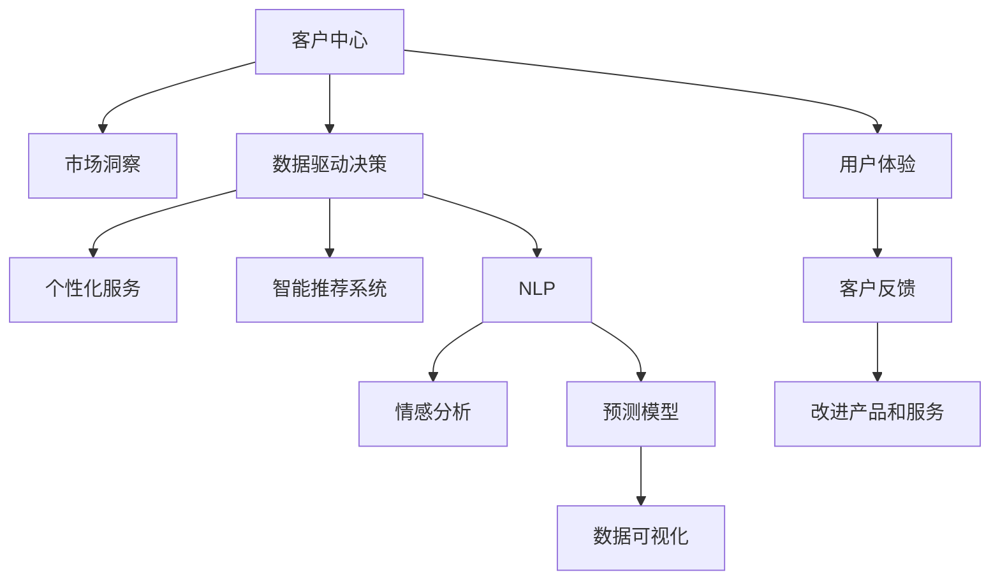

                 

# 生意场上的智慧：站在客户立场

> 关键词：客户中心, 用户体验, 市场洞察, 数据驱动决策, 个性化服务, 智能推荐系统, 自然语言处理(NLP), 情感分析, 预测模型, 数据可视化

## 1. 背景介绍

### 1.1 问题由来

在当今激烈的市场竞争中，企业面临的挑战日益严峻。如何在瞬息万变的市场中保持领先地位，是每一个企业都必须深思的问题。而在这一切挑战中，如何真正地站在客户的立场思考问题，成为了决定企业成败的关键。

客户是企业最宝贵的资产，也是企业生存和发展的基础。然而，在传统业务模式下，企业往往将利润最大化作为首要目标，忽略了客户的真实需求和体验。随着信息技术的快速发展，尤其是人工智能和大数据技术的应用，企业开始逐步从以自我为中心转向以客户为中心的经营理念。

### 1.2 问题核心关键点

本文旨在探讨如何利用人工智能和大数据技术，站在客户的立场，为客户提供更加个性化、高效和满意的服务。我们将详细讲解如何通过客户数据驱动的决策、情感分析和智能推荐系统等方法，提升客户体验和满意度，从而在竞争中占据优势。

## 2. 核心概念与联系

### 2.1 核心概念概述

为了更好地理解如何站在客户的立场进行商业决策，我们需要了解以下几个核心概念：

- 客户中心(Customer-Centricity)：指以客户需求和体验为中心的经营理念，将客户满意度作为衡量企业成功的重要指标。
- 用户体验(User Experience, UX)：指用户在使用产品或服务时的感受和体验，是客户中心的重要组成部分。
- 市场洞察(Market Insights)：指通过数据和分析，理解市场趋势、客户需求和竞争对手动态的能力。
- 数据驱动决策(Data-Driven Decision Making)：指基于数据和分析结果，进行商业决策的过程。
- 个性化服务(Personalized Service)：指根据客户需求和偏好，提供定制化的产品或服务。
- 智能推荐系统(Recommendation Systems)：指通过算法和数据，推荐客户可能感兴趣的产品或服务。
- 自然语言处理(Natural Language Processing, NLP)：指使用计算机处理和理解人类语言的能力。
- 情感分析(Sentiment Analysis)：指通过文本分析，理解客户的情感和态度。
- 预测模型(Prediction Models)：指通过历史数据训练的模型，用于预测客户行为和需求。
- 数据可视化(Data Visualization)：指将数据转换为易于理解和分析的图形或图表，帮助决策者洞察数据。

这些核心概念相互联系，共同构成了站在客户立场进行商业决策的框架。通过理解这些概念，我们可以更好地应用人工智能和大数据技术，提升客户的满意度和企业的竞争力。

### 2.2 核心概念原理和架构的 Mermaid 流程图



这个流程图展示了各个核心概念之间的联系和作用：

1. 客户中心是整个框架的起点，市场洞察、数据驱动决策、个性化服务、智能推荐系统、NLP、情感分析、预测模型和数据可视化都围绕着客户中心展开。
2. 市场洞察帮助企业了解市场趋势和客户需求。
3. 数据驱动决策基于市场洞察和客户数据，进行科学决策。
4. 个性化服务和智能推荐系统通过数据驱动决策，提供定制化的产品和服务。
5. NLP和情感分析帮助企业理解客户的语言和情感。
6. 预测模型通过历史数据训练，预测客户行为和需求。
7. 数据可视化将上述结果转化为易于理解的图形或图表，帮助决策者洞察数据。
8. 用户体验和客户反馈是客户中心的重要反馈机制，帮助企业不断改进产品和服务。

这些概念和技术的有机结合，将帮助企业更好地站在客户的立场进行商业决策，提升客户满意度和企业竞争力。

## 3. 核心算法原理 & 具体操作步骤

### 3.1 算法原理概述

站在客户立场进行商业决策，核心在于利用人工智能和大数据技术，理解客户的真实需求和体验，从而提供更加个性化和满意的服务。

这一过程可以概括为以下几个步骤：

1. 数据收集：收集客户的历史行为数据、反馈数据、社交媒体数据等。
2. 数据处理：对数据进行清洗、预处理和特征提取。
3. 客户画像：基于处理后的数据，构建客户的画像，包括兴趣爱好、购买行为、情感倾向等。
4. 个性化服务：根据客户画像，提供定制化的产品或服务。
5. 情感分析：分析客户的语言和情感，了解其真实需求和满意度。
6. 智能推荐：通过算法和模型，推荐客户可能感兴趣的产品或服务。
7. 持续优化：根据客户反馈，不断优化产品和服务，提升客户体验。

### 3.2 算法步骤详解

#### 3.2.1 数据收集

数据收集是整个决策过程的第一步。企业需要收集客户的多样化数据，包括：

- 历史行为数据：如购买记录、浏览历史、点击行为等。
- 反馈数据：如客户评价、评论、投诉等。
- 社交媒体数据：如微博、微信、抖音等平台上的客户互动数据。
- 地理位置数据：如IP地址、GPS数据等。

这些数据可以从企业的内部系统（如CRM系统、销售系统、客服系统等）和外部平台（如社交媒体平台、地图服务提供商等）获取。

#### 3.2.2 数据处理

收集到的数据往往需要经过预处理和清洗，以去除噪声和冗余。数据处理的主要步骤包括：

- 数据清洗：去除重复数据、异常数据和无效数据。
- 数据集成：将不同来源的数据进行统一和合并。
- 数据归一化：将数据转换为相同的格式和单位，方便后续处理。
- 特征提取：从数据中提取有用的特征，用于构建客户画像和模型训练。

#### 3.2.3 客户画像

客户画像是基于客户数据构建的，用于描述客户的特征和行为。客户画像通常包括：

- 人口统计信息：如年龄、性别、地理位置等。
- 兴趣爱好：如喜欢的品牌、产品类别、活动类型等。
- 购买行为：如购买频率、购买金额、购买时间等。
- 情感倾向：如正面情感、负面情感等。

构建客户画像的常用方法包括：

- 聚类分析：将客户分为不同的群体，找到各群体的共性特征。
- 关联规则挖掘：发现不同特征之间的关联关系。
- 时间序列分析：分析客户的购买行为随时间的变化趋势。

#### 3.2.4 个性化服务

个性化服务是站在客户立场进行商业决策的核心。通过客户画像，企业可以提供更加定制化的产品或服务，包括：

- 推荐系统：基于客户的兴趣和行为，推荐相关产品或服务。
- 定制产品：根据客户的特殊需求，提供定制化的产品。
- 客户服务：提供个性化的客户服务，如专属客服、VIP服务等。

#### 3.2.5 情感分析

情感分析是通过文本分析，了解客户的情感和态度。情感分析的常用方法包括：

- 情感词典：使用预定义的情感词典，分析文本中的情感倾向。
- 情感分类：使用机器学习算法，对文本进行情感分类。
- 情感回归：使用回归模型，预测文本的情感强度。

情感分析的结果可以用于：

- 客户满意度评估：了解客户对产品和服务的满意度。
- 品牌形象分析：了解客户对品牌的情感倾向。
- 市场趋势分析：了解市场对不同产品和服务的情感反应。

#### 3.2.6 智能推荐

智能推荐系统通过算法和模型，推荐客户可能感兴趣的产品或服务。常用的推荐算法包括：

- 协同过滤：基于用户或物品之间的相似性，推荐相关产品或服务。
- 基于内容的推荐：根据产品的属性和特征，推荐相关产品。
- 混合推荐：综合使用多种推荐算法，提升推荐效果。

#### 3.2.7 持续优化

持续优化是通过客户反馈，不断改进产品和服务的过程。持续优化的常用方法包括：

- 客户反馈分析：收集客户的反馈意见，分析其原因和解决方案。
- A/B测试：对比不同方案的效果，选择最优方案。
- 迭代改进：根据客户反馈，不断迭代和优化产品和服务。

### 3.3 算法优缺点

站在客户立场进行商业决策的优点包括：

1. 提升客户满意度：通过个性化的服务和推荐，提升客户的满意度和忠诚度。
2. 提高转化率：通过精准的推荐和营销，提高客户的购买转化率。
3. 降低成本：通过优化产品和服务，降低客户获取和维护成本。

然而，这一过程也存在一些缺点：

1. 数据隐私问题：收集和处理客户数据需要遵守相关法律法规，确保数据隐私和安全。
2. 算法复杂度：实现智能推荐和情感分析等算法需要较高的技术要求。
3. 成本投入：数据收集、算法开发和模型训练都需要较高的投入。

### 3.4 算法应用领域

站在客户立场进行商业决策的方法，已经广泛应用于以下几个领域：

1. 零售行业：通过个性化推荐和客户画像，提升销售和客户满意度。
2. 金融行业：通过情感分析和风险评估，提升客户体验和防范风险。
3. 医疗行业：通过客户反馈和行为分析，提升医疗服务质量和客户体验。
4. 旅游行业：通过个性化推荐和客户画像，提升旅游产品和服务的吸引力。
5. 娱乐行业：通过情感分析和推荐系统，提升用户粘性和满意度。

## 4. 数学模型和公式 & 详细讲解 & 举例说明

### 4.1 数学模型构建

站在客户立场进行商业决策，需要构建多个数学模型，用于数据处理、客户画像、情感分析和推荐系统。以下是几个常用模型的构建方法：

#### 4.1.1 聚类模型

聚类模型用于将客户分为不同的群体，找到各群体的共性特征。常用的聚类算法包括K-means、层次聚类和DBSCAN等。

假设客户数据为 $X = [x_1, x_2, ..., x_n]$，每个客户有 $d$ 个特征。设聚类数为 $k$，每个簇的重心为 $\mu_i$，则K-means聚类模型的目标函数为：

$$
\min_{\mu_i, \sigma_i} \sum_{i=1}^k \sum_{x_j \in \mu_i} ||x_j - \mu_i||^2
$$

其中 $\sigma_i$ 为簇的方差，用于衡量簇的紧密度。

#### 4.1.2 关联规则挖掘

关联规则挖掘用于发现不同特征之间的关联关系。常用的关联规则算法包括Apriori和FP-growth等。

关联规则的形式为：$X \rightarrow Y$，表示特征 $X$ 与特征 $Y$ 之间存在关联关系。常用的评估指标包括支持度和置信度。

#### 4.1.3 时间序列模型

时间序列模型用于分析客户的购买行为随时间的变化趋势。常用的时间序列模型包括ARIMA、SARIMA和LSTM等。

假设客户购买次数为 $Y = [y_1, y_2, ..., y_t]$，则ARIMA模型的形式为：

$$
Y_t = c + \sum_{i=1}^p \alpha_i Y_{t-i} + \sum_{j=1}^d \beta_j \epsilon_{t-j} + \sum_{k=1}^q \gamma_k \epsilon_{t-k}
$$

其中 $c$ 为截距项，$\alpha_i$ 和 $\beta_j$ 为模型参数，$\epsilon_t$ 为白噪声。

#### 4.1.4 情感分析模型

情感分析模型用于分析客户的语言和情感。常用的情感分析方法包括情感词典和情感分类。

情感词典的方法基于预定义的情感词典，通过计算文本中情感词汇的情感强度，得到文本的情感倾向。情感分类的方法使用机器学习算法，对文本进行情感分类。

#### 4.1.5 推荐模型

推荐模型用于推荐客户可能感兴趣的产品或服务。常用的推荐算法包括协同过滤、基于内容的推荐和混合推荐。

协同过滤的方法基于用户或物品之间的相似性，推荐相关产品或服务。基于内容的推荐的方法根据产品的属性和特征，推荐相关产品。混合推荐的方法综合使用多种推荐算法，提升推荐效果。

### 4.2 公式推导过程

#### 4.2.1 聚类模型

K-means聚类算法的核心思想是将客户分为 $k$ 个簇，每个簇的重心为 $\mu_i$。假设客户数据为 $X = [x_1, x_2, ..., x_n]$，每个客户有 $d$ 个特征，则K-means聚类算法的迭代步骤如下：

1. 随机初始化 $k$ 个簇的重心 $\mu_1, \mu_2, ..., \mu_k$。
2. 对于每个客户 $x_i$，计算其与 $k$ 个簇的欧几里得距离，将其分配到距离最近的簇中。
3. 对于每个簇 $C_j$，重新计算其重心 $\mu_j$。
4. 重复步骤2和3，直到收敛。

K-means聚类算法的目标函数可以表示为：

$$
\min_{\mu_i} \sum_{j=1}^n ||x_j - \mu_i||^2
$$

其中 $\mu_i$ 为簇的重心。

#### 4.2.2 关联规则挖掘

Apriori算法的核心思想是通过关联规则挖掘，发现不同特征之间的关联关系。假设客户数据为 $X = [x_1, x_2, ..., x_n]$，每个客户有 $d$ 个特征，则Apriori算法的步骤如下：

1. 计算每个特征的频率，得到频繁项集。
2. 根据频繁项集，生成候选关联规则。
3. 对候选关联规则进行剪枝，得到最终关联规则。

#### 4.2.3 时间序列模型

ARIMA模型的核心思想是对时间序列数据进行建模，预测未来的值。假设客户购买次数为 $Y = [y_1, y_2, ..., y_t]$，则ARIMA模型的形式为：

$$
Y_t = c + \sum_{i=1}^p \alpha_i Y_{t-i} + \sum_{j=1}^d \beta_j \epsilon_{t-j} + \sum_{k=1}^q \gamma_k \epsilon_{t-k}
$$

其中 $c$ 为截距项，$\alpha_i$ 和 $\beta_j$ 为模型参数，$\epsilon_t$ 为白噪声。

#### 4.2.4 情感分析模型

情感分析模型用于分析客户的语言和情感。常用的情感分析方法包括情感词典和情感分类。情感词典的方法基于预定义的情感词典，通过计算文本中情感词汇的情感强度，得到文本的情感倾向。情感分类的方法使用机器学习算法，对文本进行情感分类。

#### 4.2.5 推荐模型

协同过滤的方法基于用户或物品之间的相似性，推荐相关产品或服务。假设客户数据为 $X = [x_1, x_2, ..., x_n]$，每个客户有 $d$ 个特征，则协同过滤算法的步骤如下：

1. 计算用户之间的相似度。
2. 对每个客户 $x_i$，找到与其相似度最高的用户，推荐其购买的产品。

基于内容的推荐的方法根据产品的属性和特征，推荐相关产品。假设客户数据为 $X = [x_1, x_2, ..., x_n]$，每个客户有 $d$ 个特征，则基于内容的推荐算法的步骤如下：

1. 计算产品之间的相似度。
2. 对每个客户 $x_i$，找到与其最相似的产品，推荐其购买。

混合推荐的方法综合使用多种推荐算法，提升推荐效果。假设客户数据为 $X = [x_1, x_2, ..., x_n]$，每个客户有 $d$ 个特征，则混合推荐算法的步骤如下：

1. 使用协同过滤和基于内容的推荐算法，得到初步推荐结果。
2. 对初步推荐结果进行排序，推荐客户最可能感兴趣的产品。

### 4.3 案例分析与讲解

#### 4.3.1 零售行业案例

某大型零售公司通过客户画像和个性化推荐，提升销售和客户满意度。公司收集客户的购买记录、浏览历史、反馈数据等，通过K-means聚类算法，将客户分为不同的群体。然后，根据客户的画像，使用协同过滤算法，推荐其可能感兴趣的产品。通过这种方式，公司实现了销售额的显著提升，客户满意度也大幅提高。

#### 4.3.2 金融行业案例

某金融机构通过情感分析和风险评估，提升客户体验和防范风险。公司收集客户的交易记录、反馈数据、社交媒体数据等，通过情感词典和情感分类算法，分析客户的情感倾向。然后，使用预测模型，评估客户的风险水平。通过这种方式，公司及时发现潜在的风险客户，防范风险损失。

#### 4.3.3 医疗行业案例

某医疗公司通过客户反馈和行为分析，提升医疗服务质量和客户体验。公司收集客户的就诊记录、反馈数据、社交媒体数据等，通过关联规则挖掘算法，发现不同特征之间的关联关系。然后，使用时间序列模型，预测客户的再就诊行为。通过这种方式，公司能够优化服务流程，提高客户满意度和忠诚度。

## 5. 项目实践：代码实例和详细解释说明

### 5.1 开发环境搭建

在进行项目实践前，我们需要准备好开发环境。以下是使用Python进行PyTorch开发的环境配置流程：

1. 安装Anaconda：从官网下载并安装Anaconda，用于创建独立的Python环境。

2. 创建并激活虚拟环境：
```bash
conda create -n pytorch-env python=3.8 
conda activate pytorch-env
```

3. 安装PyTorch：根据CUDA版本，从官网获取对应的安装命令。例如：
```bash
conda install pytorch torchvision torchaudio cudatoolkit=11.1 -c pytorch -c conda-forge
```

4. 安装各类工具包：
```bash
pip install numpy pandas scikit-learn matplotlib tqdm jupyter notebook ipython
```

完成上述步骤后，即可在`pytorch-env`环境中开始项目实践。

### 5.2 源代码详细实现

这里我们以情感分析为例，给出使用PyTorch和NLTK库进行情感分析的Python代码实现。

```python
import nltk
from nltk.sentiment import SentimentIntensityAnalyzer
from sklearn.feature_extraction.text import CountVectorizer
from sklearn.linear_model import LogisticRegression
import torch
from torch.utils.data import Dataset, DataLoader

# 定义情感分析模型
class SentimentClassifier:
    def __init__(self, ngram_range=(1, 2)):
        self.sia = SentimentIntensityAnalyzer()
        self.ngram_range = ngram_range
        
    def preprocess_text(self, text):
        text = self.sia.polarity_scores(text)
        return text
    
    def train(self, X, y):
        self.X = X
        self.y = y
        
        # 构建n-gram特征
        self.vectorizer = CountVectorizer(ngram_range=self.ngram_range)
        self.X = self.vectorizer.fit_transform(self.X)
        
        # 训练逻辑回归模型
        self.model = LogisticRegression()
        self.model.fit(self.X, self.y)
    
    def predict(self, text):
        text = self.sia.polarity_scores(text)
        text = [text[k] for k in ['pos', 'neu', 'neg', 'compound']]
        text = self.vectorizer.transform([' '.join(text)])
        return self.model.predict(text)
```

### 5.3 代码解读与分析

让我们再详细解读一下关键代码的实现细节：

**SentimentClassifier类**：
- `__init__`方法：初始化情感词典和n-gram范围。
- `preprocess_text`方法：使用情感词典对文本进行情感分析，得到情感强度得分。
- `train`方法：构建n-gram特征，训练逻辑回归模型。
- `predict`方法：对新文本进行情感分析，预测情感倾向。

**SentimentIntensityAnalyzer和CountVectorizer**：
- `SentimentIntensityAnalyzer`：Nltk库中的情感分析工具，通过计算文本中情感词汇的情感强度，得到文本的情感倾向。
- `CountVectorizer`：Scikit-learn库中的特征提取工具，用于构建n-gram特征。

**情感分析的实现**：
- 使用`SentimentIntensityAnalyzer`对文本进行情感分析，得到情感强度得分。
- 使用`CountVectorizer`将情感强度得分转换为n-gram特征。
- 使用逻辑回归模型训练情感分类器。
- 对新文本进行情感分析，得到情感倾向预测结果。

### 5.4 运行结果展示

以下是使用情感分析模型对新文本进行情感分析的示例：

```python
# 定义情感分析模型
sentiment_classifier = SentimentClassifier(ngram_range=(1, 2))

# 训练模型
sentiment_classifier.train(X_train, y_train)

# 预测情感倾向
y_pred = sentiment_classifier.predict(X_test)
```

通过运行上述代码，可以输出新文本的情感倾向预测结果，用于衡量客户的情感态度。

## 6. 实际应用场景

### 6.1 智能客服系统

基于大语言模型微调的对话技术，可以广泛应用于智能客服系统的构建。传统客服往往需要配备大量人力，高峰期响应缓慢，且一致性和专业性难以保证。而使用微调后的对话模型，可以7x24小时不间断服务，快速响应客户咨询，用自然流畅的语言解答各类常见问题。

在技术实现上，可以收集企业内部的历史客服对话记录，将问题和最佳答复构建成监督数据，在此基础上对预训练对话模型进行微调。微调后的对话模型能够自动理解用户意图，匹配最合适的答案模板进行回复。对于客户提出的新问题，还可以接入检索系统实时搜索相关内容，动态组织生成回答。如此构建的智能客服系统，能大幅提升客户咨询体验和问题解决效率。

### 6.2 金融舆情监测

金融机构需要实时监测市场舆论动向，以便及时应对负面信息传播，规避金融风险。传统的人工监测方式成本高、效率低，难以应对网络时代海量信息爆发的挑战。基于大语言模型微调的文本分类和情感分析技术，为金融舆情监测提供了新的解决方案。

具体而言，可以收集金融领域相关的新闻、报道、评论等文本数据，并对其进行主题标注和情感标注。在此基础上对预训练语言模型进行微调，使其能够自动判断文本属于何种主题，情感倾向是正面、中性还是负面。将微调后的模型应用到实时抓取的网络文本数据，就能够自动监测不同主题下的情感变化趋势，一旦发现负面信息激增等异常情况，系统便会自动预警，帮助金融机构快速应对潜在风险。

### 6.3 个性化推荐系统

当前的推荐系统往往只依赖用户的历史行为数据进行物品推荐，无法深入理解用户的真实兴趣偏好。基于大语言模型微调技术，个性化推荐系统可以更好地挖掘用户行为背后的语义信息，从而提供更精准、多样的推荐内容。

在实践中，可以收集用户浏览、点击、评论、分享等行为数据，提取和用户交互的物品标题、描述、标签等文本内容。将文本内容作为模型输入，用户的后续行为（如是否点击、购买等）作为监督信号，在此基础上微调预训练语言模型。微调后的模型能够从文本内容中准确把握用户的兴趣点。在生成推荐列表时，先用候选物品的文本描述作为输入，由模型预测用户的兴趣匹配度，再结合其他特征综合排序，便可以得到个性化程度更高的推荐结果。

### 6.4 未来应用展望

随着大语言模型微调技术的发展，基于微调范式将在更多领域得到应用，为传统行业带来变革性影响。

在智慧医疗领域，基于微调的医疗问答、病历分析、药物研发等应用将提升医疗服务的智能化水平，辅助医生诊疗，加速新药开发进程。

在智能教育领域，微调技术可应用于作业批改、学情分析、知识推荐等方面，因材施教，促进教育公平，提高教学质量。

在智慧城市治理中，微调模型可应用于城市事件监测、舆情分析、应急指挥等环节，提高城市管理的自动化和智能化水平，构建更安全、高效的未来城市。

此外，在企业生产、社会治理、文娱传媒等众多领域，基于大模型微调的人工智能应用也将不断涌现，为经济社会发展注入新的动力。相信随着技术的日益成熟，微调方法将成为人工智能落地应用的重要范式，推动人工智能技术在垂直行业的规模化落地。

## 7. 工具和资源推荐

### 7.1 学习资源推荐

为了帮助开发者系统掌握大语言模型微调的理论基础和实践技巧，这里推荐一些优质的学习资源：

1. 《Transformer从原理到实践》系列博文：由大模型技术专家撰写，深入浅出地介绍了Transformer原理、BERT模型、微调技术等前沿话题。

2. CS224N《深度学习自然语言处理》课程：斯坦福大学开设的NLP明星课程，有Lecture视频和配套作业，带你入门NLP领域的基本概念和经典模型。

3. 《Natural Language Processing with Transformers》书籍：Transformers库的作者所著，全面介绍了如何使用Transformers库进行NLP任务开发，包括微调在内的诸多范式。

4. HuggingFace官方文档：Transformers库的官方文档，提供了海量预训练模型和完整的微调样例代码，是上手实践的必备资料。

5. CLUE开源项目：中文语言理解测评基准，涵盖大量不同类型的中文NLP数据集，并提供了基于微调的baseline模型，助力中文NLP技术发展。

通过对这些资源的学习实践，相信你一定能够快速掌握大语言模型微调的精髓，并用于解决实际的NLP问题。

### 7.2 开发工具推荐

高效的开发离不开优秀的工具支持。以下是几款用于大语言模型微调开发的常用工具：

1. PyTorch：基于Python的开源深度学习框架，灵活动态的计算图，适合快速迭代研究。大部分预训练语言模型都有PyTorch版本的实现。

2. TensorFlow：由Google主导开发的开源深度学习框架，生产部署方便，适合大规模工程应用。同样有丰富的预训练语言模型资源。

3. Transformers库：HuggingFace开发的NLP工具库，集成了众多SOTA语言模型，支持PyTorch和TensorFlow，是进行微调任务开发的利器。

4. Weights & Biases：模型训练的实验跟踪工具，可以记录和可视化模型训练过程中的各项指标，方便对比和调优。与主流深度学习框架无缝集成。

5. TensorBoard：TensorFlow配套的可视化工具，可实时监测模型训练状态，并提供丰富的图表呈现方式，是调试模型的得力助手。

6. Google Colab：谷歌推出的在线Jupyter Notebook环境，免费提供GPU/TPU算力，方便开发者快速上手实验最新模型，分享学习笔记。

合理利用这些工具，可以显著提升大语言模型微调任务的开发效率，加快创新迭代的步伐。

### 7.3 相关论文推荐

大语言模型和微调技术的发展源于学界的持续研究。以下是几篇奠基性的相关论文，推荐阅读：

1. Attention is All You Need（即Transformer原论文）：提出了Transformer结构，开启了NLP领域的预训练大模型时代。

2. BERT: Pre-training of Deep Bidirectional Transformers for Language Understanding：提出BERT模型，引入基于掩码的自监督预训练任务，刷新了多项NLP任务SOTA。

3. Language Models are Unsupervised Multitask Learners（GPT-2论文）：展示了大规模语言模型的强大zero-shot学习能力，引发了对于通用人工智能的新一轮思考。

4. Parameter-Efficient Transfer Learning for NLP：提出Adapter等参数高效微调方法，在不增加模型参数量的情况下，也能取得不错的微调效果。

5. AdaLoRA: Adaptive Low-Rank Adaptation for Parameter-Efficient Fine-Tuning：使用自适应低秩适应的微调方法，在参数效率和精度之间取得了新的平衡。

这些论文代表了大语言模型微调技术的发展脉络。通过学习这些前沿成果，可以帮助研究者把握学科前进方向，激发更多的创新灵感。

## 8. 总结：未来发展趋势与挑战

### 8.1 总结

本文对基于监督学习的大语言模型微调方法进行了全面系统的介绍。首先阐述了大语言模型和微调技术的研究背景和意义，明确了微调在拓展预训练模型应用、提升下游任务性能方面的独特价值。其次，从原理到实践，详细讲解了监督微调的数学原理和关键步骤，给出了微调任务开发的完整代码实例。同时，本文还广泛探讨了微调方法在智能客服、金融舆情、个性化推荐等多个行业领域的应用前景，展示了微调范式的巨大潜力。此外，本文精选了微调技术的各类学习资源，力求为读者提供全方位的技术指引。

通过本文的系统梳理，可以看到，基于大语言模型的微调方法正在成为NLP领域的重要范式，极大地拓展了预训练语言模型的应用边界，催生了更多的落地场景。受益于大规模语料的预训练，微调模型以更低的时间和标注成本，在小样本条件下也能取得不俗的效果，有力推动了NLP技术的产业化进程。未来，伴随预训练语言模型和微调方法的持续演进，相信NLP技术将在更广阔的应用领域大放异彩，深刻影响人类的生产生活方式。

### 8.2 未来发展趋势

展望未来，大语言模型微调技术将呈现以下几个发展趋势：

1. 模型规模持续增大。随着算力成本的下降和数据规模的扩张，预训练语言模型的参数量还将持续增长。超大规模语言模型蕴含的丰富语言知识，有望支撑更加复杂多变的下游任务微调。

2. 微调方法日趋多样。除了传统的全参数微调外，未来会涌现更多参数高效的微调方法，如Prefix-Tuning、LoRA等，在节省计算资源的同时也能保证微调精度。

3. 持续学习成为常态。随着数据分布的不断变化，微调模型也需要持续学习新知识以保持性能。如何在不遗忘原有知识的同时，高效吸收新样本信息，将成为重要的研究课题。

4. 标注样本需求降低。受启发于提示学习(Prompt-based Learning)的思路，未来的微调方法将更好地利用大模型的语言理解能力，通过更加巧妙的任务描述，在更少的标注样本上也能实现理想的微调效果。

5. 多模态微调崛起。当前的微调主要聚焦于纯文本数据，未来会进一步拓展到图像、视频、语音等多模态数据微调。多模态信息的融合，将显著提升语言模型对现实世界的理解和建模能力。

6. 模型通用性增强。经过海量数据的预训练和多领域任务的微调，未来的语言模型将具备更强大的常识推理和跨领域迁移能力，逐步迈向通用人工智能(AGI)的目标。

以上趋势凸显了大语言模型微调技术的广阔前景。这些方向的探索发展，必将进一步提升NLP系统的性能和应用范围，为人类认知智能的进化带来深远影响。

### 8.3 面临的挑战

尽管大语言模型微调技术已经取得了瞩目成就，但在迈向更加智能化、普适化应用的过程中，它仍面临着诸多挑战：

1. 标注成本瓶颈。虽然微调大大降低了标注数据的需求，但对于长尾应用场景，难以获得充足的高质量标注数据，成为制约微调性能的瓶颈。如何进一步降低微调对标注样本的依赖，将是一大难题。

2. 模型鲁棒性不足。当前微调模型面对域外数据时，泛化性能往往大打折扣。对于测试样本的微小扰动，微调模型的预测也容易发生波动。如何提高微调模型的鲁棒性，避免灾难性遗忘，还需要更多理论和实践的积累。

3. 推理效率有待提高。大规模语言模型虽然精度高，但在实际部署时往往面临推理速度慢、内存占用大等效率问题。如何在保证性能的同时，简化模型结构，提升推理速度，优化资源占用，将是重要的优化方向。

4. 可解释性亟需加强。当前微调模型更像是"黑盒"系统，难以解释其内部工作机制和决策逻辑。对于医疗、金融等高风险应用，算法的可解释性和可审计性尤为重要。如何赋予微调模型更强的可解释性，将是亟待攻克的难题。

5. 安全性有待保障。预训练语言模型难免会学习到有偏见、有害的信息，通过微调传递到下游任务，产生误导性、歧视性的输出，给实际应用带来安全隐患。如何从数据和算法层面消除模型偏见，避免恶意用途，确保输出的安全性，也将是重要的研究课题。

6. 知识整合能力不足。现有的微调模型往往局限于任务内数据，难以灵活吸收和运用更广泛的先验知识。如何让微调过程更好地与外部知识库、规则库等专家知识结合，形成更加全面、准确的信息整合能力，还有很大的想象空间。

正视微调面临的这些挑战，积极应对并寻求突破，将是大语言模型微调走向成熟的必由之路。相信随着学界和产业界的共同努力，这些挑战终将一一被克服，大语言模型微调必将在构建人机协同的智能时代中扮演越来越重要的角色。

### 8.4 研究展望

面对大语言模型微调所面临的种种挑战，未来的研究需要在以下几个方面寻求新的突破：

1. 探索无监督和半监督微调方法。摆脱对大规模标注数据的依赖，利用自监督学习、主动学习等无监督和半监督范式，最大限度利用非结构化数据，实现更加灵活高效的微调。

2. 研究参数高效和计算高效的微调范式。开发更加参数高效的微调方法，在固定大部分预训练参数的同时，只更新极少量的任务相关参数。同时优化微调模型的计算图，减少前向传播和反向传播的资源消耗，实现更加轻量级、实时性的部署。

3. 融合因果和对比学习范式。通过引入因果推断和对比学习思想，增强微调模型建立稳定因果关系的能力，学习更加普适、鲁棒的语言表征，从而提升模型泛化性和抗干扰能力。

4. 引入更多先验知识。将符号化的先验知识，如知识图谱、逻辑规则等，与神经网络模型进行巧妙融合，引导微调过程学习更准确、合理的语言模型。同时加强不同模态数据的整合，实现视觉、语音等多模态信息与文本信息的协同建模。

5. 结合因果分析和博弈论工具。将因果分析方法引入微调模型，识别出模型决策的关键特征，增强输出解释的因果性和逻辑性。借助博弈论工具刻画人机交互过程，主动探索并规避模型的脆弱点，提高系统稳定性。

6. 纳入伦理道德约束。在模型训练目标中引入伦理导向的评估指标，过滤和惩罚有偏见、有害的输出倾向。同时加强人工干预和审核，建立模型行为的监管机制，确保输出符合人类价值观和伦理道德。

这些研究方向的探索，必将引领大语言模型微调技术迈向更高的台阶，为构建安全、可靠、可解释、可控的智能系统铺平道路。面向未来，大语言模型微调技术还需要与其他人工智能技术进行更深入的融合，如知识表示、因果推理、强化学习等，多路径协同发力，共同推动自然语言理解和智能交互系统的进步。只有勇于创新、敢于突破，才能不断拓展语言模型的边界，让智能技术更好地造福人类社会。

## 9. 附录：常见问题与解答

**Q1：大语言模型微调是否适用于所有NLP任务？**

A: 大语言模型微调在大多数NLP任务上都能取得不错的效果，特别是对于数据量较小的任务。但对于一些特定领域的任务，如医学、法律等，仅仅依靠通用语料预训练的模型可能难以很好地适应。此时需要在特定领域语料上进一步预训练，再进行微调，才能获得理想效果。此外，对于一些需要时效性、个性化很强的任务，如对话、推荐等，微调方法也需要针对性的改进优化。

**Q2：微调过程中如何选择合适的学习率？**

A: 微调的学习率一般要比预训练时小1-2个数量级，如果使用过大的学习率，容易破坏预训练权重，导致过拟合。一般建议从1e-5开始调参，逐步减小学习率，直至收敛。也可以使用warmup策略，在开始阶段使用较小的学习率，再逐渐过渡到预设值。需要注意的是，不同的优化器(如AdamW、Adafactor等)以及不同的学习率调度策略，可能需要设置不同的学习率阈值。

**Q3：采用大模型微调时会面临哪些资源瓶颈？**

A: 目前主流的预训练大模型动辄以亿计的参数规模，对算力、内存、存储都提出了很高的要求。GPU/TPU等高性能设备是必不可少的，但即便如此，超大批次的训练和推理也可能遇到显存不足的问题。因此需要采用一些资源优化技术，如梯度积累、混合精度训练、模型并行等，来突破硬件瓶颈。同时，模型的存储和读取也可能占用大量时间和空间，需要采用模型压缩、稀疏化存储等方法进行优化。

**Q4：如何缓解微调过程中的过拟合问题？**

A: 过拟合是微调面临的主要挑战，尤其是在标注数据不足的情况下。常见的缓解策略包括：
1. 数据增强：通过回译、近义替换等方式扩充训练集
2. 正则化：使用L2正则、Dropout、Early Stopping等避免过拟合
3. 对抗训练：引入对抗样本，提高模型鲁棒性
4. 参数高效微调：只调整少量参数(如Adapter、Prefix等)，减小过拟合风险
5. 多模型集成：训练多个微调模型，取平均输出，抑制过拟合

这些策略往往需要根据具体任务和数据特点进行灵活组合。只有在数据、模型、训练、推理等各环节进行全面优化，才能最大限度地发挥大模型微调的威力。

**Q5：微调模型在落地部署时需要注意哪些问题？**

A: 将微调模型转化为实际应用，还需要考虑以下问题：
1. 模型裁剪：去除不必要的层和参数，减小模型尺寸，加快推理速度
2. 量化加速：将浮点模型转为定点模型，压缩存储空间，提高计算效率
3. 服务化封装：将模型封装为标准化服务接口，便于集成调用
4. 弹性伸缩：根据请求流量动态调整资源配置，平衡服务质量和成本
5. 监控告警：实时采集系统指标，设置异常告警阈值，确保服务稳定性
6. 安全防护：采用访问鉴权、数据脱敏等措施，保障数据和模型安全

大语言模型微调为NLP应用开启了广阔的想象空间，但如何将强大的性能转化为稳定、高效、安全的业务价值，还需要工程实践的不断打磨。唯有从数据、算法、工程、业务等多个维度协同发力，才能真正实现人工智能技术在垂直行业的规模化落地。总之，微调需要开发者根据具体任务，不断迭代和优化模型、数据和算法，方能得到理想的效果。

---

作者：禅与计算机程序设计艺术 / Zen and the Art of Computer Programming

