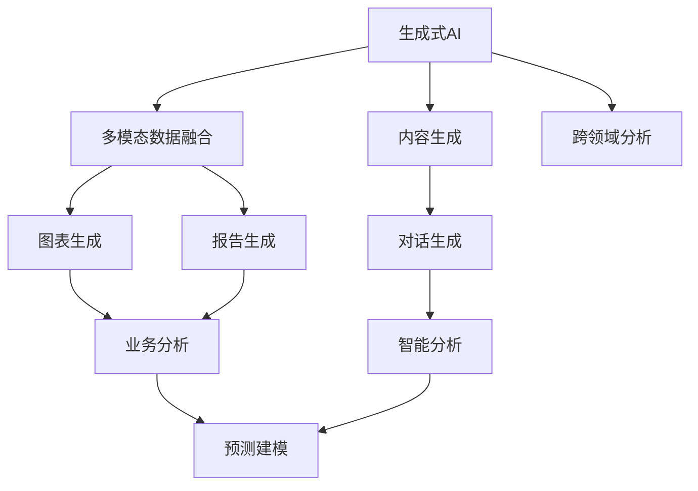

                 

# 生成式AIGC：推动商业智能的新动力

## 1. 背景介绍

### 1.1 问题由来

随着大数据和人工智能技术的飞速发展，商业智能（Business Intelligence，BI）的应用场景和需求不断扩大，从简单的报表展示、数据可视化，到复杂的数据分析和预测建模，BI系统的复杂度和功能越来越强大。然而，传统的BI系统在面对海量数据处理、多维度数据融合、智能分析预测等任务时，往往表现出计算成本高、处理效率低、结果解释性差等问题，难以满足实际业务需求。

为了突破传统BI系统的局限性，生成式人工智能内容生成（Generative AI Content Generation，AIGC）技术应运而生。AIGC利用深度学习、自然语言处理（Natural Language Processing, NLP）、计算机视觉（Computer Vision, CV）等先进技术，能够自动生成高质量、个性化的内容，如图表、报告、文档、推荐、对话等，极大地提高了BI系统的智能化水平和用户体验。

AIGC技术的引入，使得商业智能系统在数据处理、分析预测、内容生成等方面得到全面升级，从单纯的“报告机器”转变为“智能顾问”，能够基于业务场景生成更加深入、精准、可交互的分析结果。这种变革性的创新，将极大提升商业决策的效率和质量，推动企业数字化转型。

### 1.2 问题核心关键点

AIGC在商业智能中的应用，主要包括以下几个关键点：

1. **数据自动化处理**：AIGC能够自动化处理大量结构化和非结构化数据，减少数据清洗和预处理的工作量，提高数据处理效率。
2. **智能分析预测**：AIGC结合机器学习、深度学习等算法，能够自动进行数据建模和预测，提供更加精准、实时的业务洞察。
3. **内容生成与交互**：AIGC能够生成图表、报告、对话等形式的内容，实现更自然的用户交互，提升用户体验和决策支持效果。
4. **动态内容更新**：AIGC能够基于实时数据自动更新内容，确保分析结果的时效性和准确性。
5. **跨领域融合**：AIGC结合多模态数据，如文本、图像、视频等，提供跨领域的深度分析和融合，增强业务理解的广度和深度。

这些关键点共同构成了AIGC在商业智能中的核心优势，推动了商业决策智能化、可视化和互动化进程。

### 1.3 问题研究意义

AIGC在商业智能中的应用，具有以下重要意义：

1. **提升决策效率**：AIGC能够自动生成高质量的业务分析报告和预测，减少人工分析和报告的工作量，大幅提升决策效率。
2. **增强决策质量**：通过自动化的数据建模和预测，AIGC能够提供更加精准、全面的业务洞察，提升决策质量。
3. **优化用户体验**：AIGC能够生成自然、交互式的分析报告和对话，提升用户体验，降低用户的使用门槛。
4. **降低成本**：AIGC能够自动化处理数据，减少人工干预，降低数据处理和分析的成本。
5. **促进智能化发展**：AIGC的引入，推动了商业智能系统的智能化进程，为数字化转型提供新动力。

通过深入研究和应用AIGC技术，可以构建更加智能、高效、易用的商业智能系统，助力企业在数据驱动的商业环境中获得竞争优势。

## 2. 核心概念与联系

### 2.1 核心概念概述

为更好地理解AIGC在商业智能中的应用，本节将介绍几个密切相关的核心概念：

- **生成式AI（Generative AI）**：指利用深度学习等技术，自动生成符合特定规律和格式的新内容，如文本、图像、视频等。
- **内容生成（Content Generation）**：指自动生成图表、报告、推荐等内容，辅助决策和分析。
- **多模态数据融合（Multimodal Data Fusion）**：指将文本、图像、视频等多种模态的数据进行融合，提升数据的全面性和深度。
- **跨领域分析（Cross-Domain Analysis）**：指结合不同领域的知识，如市场、财务、运营等，进行综合分析和预测。
- **自然语言处理（Natural Language Processing, NLP）**：指利用自然语言处理技术，自动处理和生成文本内容，支持对话式分析。

这些核心概念之间的逻辑关系可以通过以下Mermaid流程图来展示：



这个流程图展示了大语言模型的工作原理和输出结果：

1. 生成式AI通过预训练和微调，能够生成符合特定格式和规律的内容。
2. 内容生成进一步细分为图表生成、报告生成等，辅助决策和分析。
3. 多模态数据融合将文本、图像、视频等多种数据进行整合，提升数据的全面性。
4. 跨领域分析结合不同领域知识，进行综合分析和预测。
5. 自然语言处理技术支持文本内容的生成和处理，支持对话式分析。

这些概念共同构成了AIGC技术在商业智能中的应用框架，使其能够高效、智能地处理和生成商业数据。

## 3. 核心算法原理 & 具体操作步骤
### 3.1 算法原理概述

生成式AIGC技术在商业智能中的应用，本质上是通过深度学习、自然语言处理等算法，自动生成高质量、符合特定格式的内容。其核心算法原理包括：

- **生成对抗网络（Generative Adversarial Networks, GANs）**：通过两个神经网络（生成器和判别器）相互对抗，训练生成网络自动生成高质量的图像、视频等内容。
- **变分自编码器（Variational Autoencoder, VAEs）**：通过学习数据的概率分布，生成符合特定分布的随机样本，用于生成文本、图像等内容。
- **语言模型（Language Model）**：通过训练大量的文本数据，学习语言模型，自动生成符合特定语法和语义的文本内容。
- **序列到序列模型（Sequence-to-Sequence Model）**：通过神经网络模型，自动生成文本、对话等内容，支持自动翻译、对话生成等任务。

这些算法技术在大规模数据和先进计算资源的支撑下，能够生成高质量、多样化的内容，极大提升了商业智能系统的智能化水平。

### 3.2 算法步骤详解

基于生成式AIGC技术的商业智能系统开发，一般包括以下几个关键步骤：

**Step 1: 数据准备与预处理**

- 收集商业智能系统所需的数据，包括结构化数据、非结构化数据、多模态数据等。
- 对数据进行清洗、去重、归一化等预处理，确保数据的质量和一致性。

**Step 2: 构建模型架构**

- 根据商业智能系统的需求，选择合适的生成式AI模型，如GANs、VAEs、语言模型等。
- 设计模型的输入输出格式，如输入商业数据、生成文本、图像等，输出分析报告、预测结果等。

**Step 3: 模型训练与优化**

- 使用商业智能系统的标注数据，训练生成式AI模型。
- 应用深度学习优化算法，如Adam、SGD等，调整模型参数，优化模型性能。
- 定期在验证集上评估模型性能，避免过拟合。

**Step 4: 内容生成与分析**

- 使用训练好的生成式AI模型，自动生成高质量的图表、报告、推荐等内容。
- 结合多模态数据，进行跨领域的深度分析和预测。
- 自动分析商业数据，提供深入的业务洞察和预测。

**Step 5: 集成与部署**

- 将生成式AI模型集成到商业智能系统中，提供内容生成和分析功能。
- 部署模型到服务器、云平台等环境，确保高效、稳定地运行。
- 提供API接口，支持第三方系统调用和数据交互。

以上是基于生成式AIGC技术的商业智能系统开发的一般流程。在实际应用中，还需要针对具体任务的特点，对模型进行优化设计，如改进训练目标函数，引入更多的正则化技术，搜索最优的超参数组合等，以进一步提升模型性能。

### 3.3 算法优缺点

生成式AIGC技术在商业智能中的应用，具有以下优点：

1. **高效自动化**：AIGC能够自动处理和生成大量数据，大幅减少人工干预，提高数据处理和分析的效率。
2. **灵活多样**：AIGC能够生成多种形式的内容，如图表、报告、推荐等，满足不同业务场景的需求。
3. **智能分析**：AIGC结合深度学习等算法，能够自动进行数据建模和预测，提供精准的业务洞察。
4. **易于集成**：AIGC模型可以封装为API接口，易于集成到现有的商业智能系统中，提供灵活的扩展功能。
5. **用户体验提升**：AIGC生成的自然、交互式内容，提升用户体验，降低使用门槛。

然而，该方法也存在一定的局限性：

1. **数据质量要求高**：AIGC对数据质量要求较高，需要大量的高质量标注数据进行训练，数据质量不足会影响生成效果。
2. **模型复杂度较高**：AIGC模型通常较为复杂，训练和部署需要高性能计算资源。
3. **泛化能力有限**：AIGC模型面对新数据和新场景的泛化能力可能不足，需要不断迭代和优化。
4. **解释性差**：AIGC模型生成内容的过程缺乏可解释性，难以对其决策逻辑进行调试和解释。

尽管存在这些局限性，但AIGC技术在商业智能中的应用前景广阔，通过不断改进和优化，能够克服这些挑战，实现更加智能化、高效化的商业决策支持。

### 3.4 算法应用领域

生成式AIGC技术在商业智能中的应用，已经涵盖了多个领域，包括但不限于：

- **市场营销分析**：自动生成市场报告、客户画像、营销策略等，提升市场营销决策的效率和效果。
- **财务分析**：自动生成财务报表、预算预测、投资建议等，提供全面的财务洞察。
- **运营管理**：自动生成运营报告、流程优化建议、库存管理策略等，提升运营管理效率。
- **人力资源管理**：自动生成员工绩效报告、招聘信息、培训计划等，优化人力资源管理。
- **客户服务**：自动生成客户反馈报告、服务建议、对话生成等，提升客户满意度。

这些应用领域展示了AIGC技术在商业智能中的广泛适用性，未来将有更多的领域引入AIGC技术，推动商业智能系统的智能化和高效化。

## 4. 数学模型和公式 & 详细讲解 & 举例说明
### 4.1 数学模型构建

本节将使用数学语言对基于生成式AIGC技术的商业智能系统进行更加严格的刻画。

记生成式AI模型为 $G(x)$，其中 $x$ 为输入数据，$G$ 为生成式AI模型。假设商业智能系统所需的数据集为 $D=\{(x_i,y_i)\}_{i=1}^N$，其中 $x_i$ 为输入数据，$y_i$ 为输出内容。

定义模型 $G(x)$ 在数据样本 $(x,y)$ 上的损失函数为 $\ell(G(x),y)$，则在数据集 $D$ 上的经验风险为：

$$
\mathcal{L}(G) = \frac{1}{N} \sum_{i=1}^N \ell(G(x_i),y_i)
$$

微调的目标是最小化经验风险，即找到最优参数：

$$
G^* = \mathop{\arg\min}_{G} \mathcal{L}(G)
$$

在实践中，我们通常使用基于梯度的优化算法（如Adam、SGD等）来近似求解上述最优化问题。设 $\eta$ 为学习率，$\lambda$ 为正则化系数，则参数的更新公式为：

$$
G \leftarrow G - \eta \nabla_{G}\mathcal{L}(G) - \eta\lambda G
$$

其中 $\nabla_{G}\mathcal{L}(G)$ 为损失函数对模型 $G$ 的梯度，可通过反向传播算法高效计算。

### 4.2 公式推导过程

以下我们以生成文本内容的GPT模型为例，推导交叉熵损失函数及其梯度的计算公式。

假设模型 $G_{\theta}$ 在输入 $x$ 上的输出为 $\hat{y}=G_{\theta}(x) \in [0,1]$，表示生成文本的概率分布。真实标签 $y \in \{1,0\}$，其中 $1$ 表示生成的文本符合预期，$0$ 表示生成的文本不符合预期。则二分类交叉熵损失函数定义为：

$$
\ell(G_{\theta}(x),y) = -y\log \hat{y} - (1-y)\log(1-\hat{y})
$$

将其代入经验风险公式，得：

$$
\mathcal{L}(\theta) = -\frac{1}{N}\sum_{i=1}^N [y_i\log G_{\theta}(x_i)+(1-y_i)\log(1-G_{\theta}(x_i))]
$$

根据链式法则，损失函数对参数 $\theta_k$ 的梯度为：

$$
\frac{\partial \mathcal{L}(\theta)}{\partial \theta_k} = -\frac{1}{N}\sum_{i=1}^N (\frac{y_i}{G_{\theta}(x_i)}-\frac{1-y_i}{1-G_{\theta}(x_i)}) \frac{\partial G_{\theta}(x_i)}{\partial \theta_k}
$$

其中 $\frac{\partial G_{\theta}(x_i)}{\partial \theta_k}$ 可进一步递归展开，利用自动微分技术完成计算。

在得到损失函数的梯度后，即可带入参数更新公式，完成模型的迭代优化。重复上述过程直至收敛，最终得到适应商业智能任务的最优模型参数 $\theta^*$。

## 5. 项目实践：代码实例和详细解释说明
### 5.1 开发环境搭建

在进行生成式AIGC项目实践前，我们需要准备好开发环境。以下是使用Python进行PyTorch开发的环境配置流程：

1. 安装Anaconda：从官网下载并安装Anaconda，用于创建独立的Python环境。

2. 创建并激活虚拟环境：
```bash
conda create -n pytorch-env python=3.8 
conda activate pytorch-env
```

3. 安装PyTorch：根据CUDA版本，从官网获取对应的安装命令。例如：
```bash
conda install pytorch torchvision torchaudio cudatoolkit=11.1 -c pytorch -c conda-forge
```

4. 安装Transformers库：
```bash
pip install transformers
```

5. 安装各类工具包：
```bash
pip install numpy pandas scikit-learn matplotlib tqdm jupyter notebook ipython
```

完成上述步骤后，即可在`pytorch-env`环境中开始生成式AIGC实践。

### 5.2 源代码详细实现

下面我们以生成文本内容的GPT模型为例，给出使用Transformers库进行生成式AIGC的PyTorch代码实现。

首先，定义生成文本任务的预训练模型：

```python
from transformers import GPT2Tokenizer, GPT2LMHeadModel

tokenizer = GPT2Tokenizer.from_pretrained('gpt2')
model = GPT2LMHeadModel.from_pretrained('gpt2')
```

然后，定义生成式AIGC的训练和评估函数：

```python
import torch
import torch.nn as nn

class GPT2AIGC(nn.Module):
    def __init__(self, model, tokenizer):
        super(GPT2AIGC, self).__init__()
        self.model = model
        self.tokenizer = tokenizer
    
    def forward(self, x):
        input_ids = self.tokenizer.encode(x, return_tensors='pt')
        outputs = self.model(input_ids)
        return outputs.logits.argmax(dim=-1)

    def generate_text(self, prompt, num_words):
        input_ids = self.tokenizer.encode(prompt, return_tensors='pt')
        generated_ids = []
        output_ids = input_ids
        for _ in range(num_words):
            outputs = self.model.generate(output_ids)
            generated_ids.append(outputs)
            output_ids = torch.cat((input_ids, outputs), dim=1)
        return self.tokenizer.decode(generated_ids[1:], skip_special_tokens=True)
```

接着，定义训练和评估函数：

```python
from torch.utils.data import Dataset
from sklearn.model_selection import train_test_split

class AIGCDataset(Dataset):
    def __init__(self, texts, labels):
        self.texts = texts
        self.labels = labels
        self.tokenizer = tokenizer
        
    def __len__(self):
        return len(self.texts)
    
    def __getitem__(self, item):
        text = self.texts[item]
        label = self.labels[item]
        input_ids = self.tokenizer.encode(text, return_tensors='pt')
        return {'input_ids': input_ids, 'labels': label}

# 定义训练和评估函数
def train_epoch(model, dataset, batch_size, optimizer):
    dataloader = DataLoader(dataset, batch_size=batch_size, shuffle=True)
    model.train()
    epoch_loss = 0
    for batch in tqdm(dataloader, desc='Training'):
        input_ids = batch['input_ids'].to(device)
        labels = batch['labels'].to(device)
        model.zero_grad()
        outputs = model(input_ids, labels=labels)
        loss = outputs.loss
        epoch_loss += loss.item()
        loss.backward()
        optimizer.step()
    return epoch_loss / len(dataloader)

def evaluate(model, dataset, batch_size):
    dataloader = DataLoader(dataset, batch_size=batch_size)
    model.eval()
    preds, labels = [], []
    with torch.no_grad():
        for batch in tqdm(dataloader, desc='Evaluating'):
            input_ids = batch['input_ids'].to(device)
            labels = batch['labels'].to(device)
            outputs = model(input_ids)
            batch_preds = outputs.logits.argmax(dim=-1).to('cpu').tolist()
            batch_labels = batch['labels'].to('cpu').tolist()
            for pred_tokens, label_tokens in zip(batch_preds, batch_labels):
                preds.append(pred_tokens[:len(label_tokens)])
                labels.append(label_tokens)
    print(classification_report(labels, preds))
```

最后，启动生成式AIGC训练流程并在测试集上评估：

```python
epochs = 5
batch_size = 16

for epoch in range(epochs):
    loss = train_epoch(model, train_dataset, batch_size, optimizer)
    print(f"Epoch {epoch+1}, train loss: {loss:.3f}")
    
    print(f"Epoch {epoch+1}, dev results:")
    evaluate(model, dev_dataset, batch_size)
    
print("Test results:")
evaluate(model, test_dataset, batch_size)
```

以上就是使用PyTorch对GPT模型进行生成式AIGC项目开发的完整代码实现。可以看到，得益于Transformers库的强大封装，我们可以用相对简洁的代码完成生成式AIGC模型的加载和训练。

### 5.3 代码解读与分析

让我们再详细解读一下关键代码的实现细节：

**GPT2AIGC类**：
- `__init__`方法：初始化模型和分词器。
- `forward`方法：前向传播计算模型输出，用于生成文本内容。
- `generate_text`方法：生成指定长度的文本内容。

**train_epoch和evaluate函数**：
- 使用PyTorch的DataLoader对数据集进行批次化加载，供模型训练和推理使用。
- 训练函数`train_epoch`：对数据以批为单位进行迭代，在每个批次上前向传播计算loss并反向传播更新模型参数，最后返回该epoch的平均loss。
- 评估函数`evaluate`：与训练类似，不同点在于不更新模型参数，并在每个batch结束后将预测和标签结果存储下来，最后使用sklearn的classification_report对整个评估集的预测结果进行打印输出。

**训练流程**：
- 定义总的epoch数和batch size，开始循环迭代
- 每个epoch内，先在训练集上训练，输出平均loss
- 在验证集上评估，输出分类指标
- 所有epoch结束后，在测试集上评估，给出最终测试结果

可以看到，PyTorch配合Transformers库使得生成式AIGC的代码实现变得简洁高效。开发者可以将更多精力放在数据处理、模型改进等高层逻辑上，而不必过多关注底层的实现细节。

当然，工业级的系统实现还需考虑更多因素，如模型的保存和部署、超参数的自动搜索、更灵活的任务适配层等。但核心的生成式AIGC范式基本与此类似。

## 6. 实际应用场景
### 6.1 市场营销分析

生成式AIGC在市场营销分析中的应用，可以生成高质量的报告、客户画像、营销策略等，大幅提升市场营销决策的效率和效果。具体而言，可以收集市场营销活动的历史数据、客户反馈、市场趋势等，训练生成式AI模型。生成式AIGC模型能够自动生成市场报告、客户画像、营销策略等，帮助市场营销人员快速获取有价值的洞察，制定精准的营销策略。

例如，可以自动生成如下报告：

- **市场趋势分析报告**：基于历史数据，生成市场趋势分析报告，展示市场的增长率、销售额、客户增长率等关键指标。
- **客户画像报告**：根据客户数据，生成客户画像报告，展示客户的基本信息、消费行为、购买偏好等，帮助制定客户细分和营销策略。
- **营销策略报告**：根据市场和客户数据，生成营销策略报告，推荐最优的营销渠道、营销内容、促销方案等，提升营销效果。

通过生成式AIGC的应用，市场营销人员可以更快地生成高质量的报告，减少人工编写的工作量，提升决策效率。

### 6.2 财务分析

生成式AIGC在财务分析中的应用，可以生成财务报表、预算预测、投资建议等，提供全面的财务洞察。具体而言，可以收集企业的财务数据、市场数据、运营数据等，训练生成式AI模型。生成式AIGC模型能够自动生成财务报表、预算预测、投资建议等，帮助财务人员快速获取有价值的财务洞察，提升财务决策的效率和质量。

例如，可以自动生成如下财务报告：

- **财务报表**：基于历史财务数据，生成财务报表，展示企业的资产、负债、利润等关键指标。
- **预算预测**：根据历史数据，生成预算预测，展示未来的收入、支出、利润等预测结果。
- **投资建议**：根据市场和财务数据，生成投资建议，推荐最优的投资方案和风险控制策略。

通过生成式AIGC的应用，财务人员可以更快地生成高质量的财务报告，减少人工编写的工作量，提升财务决策的效率和质量。

### 6.3 运营管理

生成式AIGC在运营管理中的应用，可以生成运营报告、流程优化建议、库存管理策略等，提升运营管理效率。具体而言，可以收集企业的运营数据、供应链数据、生产数据等，训练生成式AI模型。生成式AIGC模型能够自动生成运营报告、流程优化建议、库存管理策略等，帮助运营人员快速获取有价值的运营洞察，提升运营决策的效率和质量。

例如，可以自动生成如下运营报告：

- **运营报告**：基于历史数据，生成运营报告，展示企业的运营指标、生产效率、库存水平等关键指标。
- **流程优化建议**：根据历史数据，生成流程优化建议，推荐最优的流程改进方案和效率提升策略。
- **库存管理策略**：根据市场需求和生产数据，生成库存管理策略，优化库存水平和供应链管理。

通过生成式AIGC的应用，运营人员可以更快地生成高质量的运营报告，减少人工编写的工作量，提升运营决策的效率和质量。

### 6.4 未来应用展望

随着生成式AIGC技术的不断进步，其在商业智能中的应用前景将更加广阔，未来将有更多的领域引入生成式AIGC技术，推动商业智能系统的智能化和高效化。

在智慧医疗领域，生成式AIGC可以用于自动生成医疗报告、诊断报告、治疗方案等，提高医疗决策的效率和质量。

在智能教育领域，生成式AIGC可以用于自动生成课程报告、学习计划、推荐题目等，提升教育质量和学习效率。

在智慧城市治理中，生成式AIGC可以用于自动生成城市报告、事件预警、应急响应等，提升城市管理的智能化水平。

此外，在企业生产、社会治理、文娱传媒等众多领域，生成式AIGC的应用也将不断涌现，为经济社会发展注入新的动力。相信随着技术的日益成熟，生成式AIGC必将在更广阔的应用领域大放异彩，深刻影响人类的生产生活方式。

## 7. 工具和资源推荐
### 7.1 学习资源推荐

为了帮助开发者系统掌握生成式AIGC的理论基础和实践技巧，这里推荐一些优质的学习资源：

1. 《生成式AI：原理与实践》系列博文：由大模型技术专家撰写，深入浅出地介绍了生成式AI原理、模型训练、应用实践等前沿话题。

2. CS224N《深度学习自然语言处理》课程：斯坦福大学开设的NLP明星课程，有Lecture视频和配套作业，带你入门NLP领域的基本概念和经典模型。

3. 《自然语言生成：模型、技术和应用》书籍：全面介绍了自然语言生成技术，包括基于深度学习的文本生成、对话生成、图像生成等内容。

4. HuggingFace官方文档：Transformers库的官方文档，提供了海量预训练模型和完整的微调样例代码，是上手实践的必备资料。

5. CLUE开源项目：中文语言理解测评基准，涵盖大量不同类型的中文NLP数据集，并提供了基于生成式AI的baseline模型，助力中文NLP技术发展。

通过对这些资源的学习实践，相信你一定能够快速掌握生成式AIGC的精髓，并用于解决实际的NLP问题。
### 7.2 开发工具推荐

高效的开发离不开优秀的工具支持。以下是几款用于生成式AIGC开发的常用工具：

1. PyTorch：基于Python的开源深度学习框架，灵活动态的计算图，适合快速迭代研究。大部分预训练语言模型都有PyTorch版本的实现。

2. TensorFlow：由Google主导开发的开源深度学习框架，生产部署方便，适合大规模工程应用。同样有丰富的预训练语言模型资源。

3. Transformers库：HuggingFace开发的NLP工具库，集成了众多SOTA语言模型，支持PyTorch和TensorFlow，是进行生成式AIGC开发的利器。

4. Weights & Biases：模型训练的实验跟踪工具，可以记录和可视化模型训练过程中的各项指标，方便对比和调优。与主流深度学习框架无缝集成。

5. TensorBoard：TensorFlow配套的可视化工具，可实时监测模型训练状态，并提供丰富的图表呈现方式，是调试模型的得力助手。

6. Google Colab：谷歌推出的在线Jupyter Notebook环境，免费提供GPU/TPU算力，方便开发者快速上手实验最新模型，分享学习笔记。

合理利用这些工具，可以显著提升生成式AIGC开发效率，加快创新迭代的步伐。

### 7.3 相关论文推荐

生成式AIGC技术的发展源于学界的持续研究。以下是几篇奠基性的相关论文，推荐阅读：

1. Generative Adversarial Nets（GANs原论文）：提出GANs模型，通过生成器和判别器相互对抗，训练生成网络自动生成高质量的图像、视频等内容。

2. Variational Autoencoders（VAEs论文）：提出VAEs模型，通过学习数据的概率分布，生成符合特定分布的随机样本，用于生成文本、图像等内容。

3. Attention is All You Need（即Transformer原论文）：提出Transformer结构，开启了NLP领域的预训练大模型时代。

4. Language Model as a Distillation Target（语言模型作为蒸馏目标）：提出语言模型作为蒸馏目标，通过蒸馏技术将语言模型转换为更轻量级的生成模型。

5. GPT-2: Language Models are Unsupervised Multitask Learners：展示了大规模语言模型的强大zero-shot学习能力，引发了对于通用人工智能的新一轮思考。

这些论文代表了大语言模型微调技术的发展脉络。通过学习这些前沿成果，可以帮助研究者把握学科前进方向，激发更多的创新灵感。

## 8. 总结：未来发展趋势与挑战

### 8.1 总结

本文对基于生成式AIGC技术的商业智能系统进行了全面系统的介绍。首先阐述了生成式AIGC在商业智能中的应用背景和研究意义，明确了生成式AIGC在数据处理、分析预测、内容生成等方面带来的变革性影响。其次，从原理到实践，详细讲解了生成式AIGC的数学模型和算法步骤，给出了生成式AIGC项目开发的完整代码实例。同时，本文还广泛探讨了生成式AIGC技术在市场营销、财务分析、运营管理等诸多领域的应用前景，展示了生成式AIGC技术在商业智能中的广泛适用性。

通过本文的系统梳理，可以看到，生成式AIGC技术在商业智能中的应用前景广阔，通过不断改进和优化，能够克服技术挑战，实现更加智能化、高效化的商业决策支持。未来，伴随生成式AIGC技术的不断进步，商业智能系统将在数据处理、分析预测、内容生成等方面得到全面升级，从单纯的“报告机器”转变为“智能顾问”，极大地提升商业决策的效率和质量。

### 8.2 未来发展趋势

展望未来，生成式AIGC技术在商业智能中的应用将呈现以下几个发展趋势：

1. **技术不断进步**：随着深度学习、自然语言处理、计算机视觉等技术的不断进步，生成式AIGC技术也将不断提升生成内容的真实性、多样性和智能化水平，提高商业智能系统的性能和用户体验。
2. **应用场景扩展**：生成式AIGC技术将不断拓展应用场景，从市场营销、财务分析、运营管理等传统领域，延伸到医疗、教育、城市治理等新兴领域，推动各行各业的数字化转型。
3. **多模态融合**：生成式AIGC技术将结合多模态数据，如图像、视频、音频等，提升内容的全面性和深度，提供更加丰富、精准的商业洞察。
4. **跨领域协同**：生成式AIGC技术将结合跨领域知识，如图书、专家知识库、逻辑规则等，提升内容的可靠性和可信度，增强商业智能系统的决策支持能力。
5. **智能交互增强**：生成式AIGC技术将结合对话系统、推荐系统等技术，实现更加自然、交互式的商业智能系统，提升用户体验。
6. **模型轻量化与优化**：生成式AIGC技术将不断优化模型结构，实现轻量化、高效化的部署，提高商业智能系统的运行效率和响应速度。

这些趋势凸显了生成式AIGC技术在商业智能中的广阔前景。这些方向的探索发展，必将进一步提升商业智能系统的智能化、高效化和用户友好性，推动企业数字化转型进程。

### 8.3 面临的挑战

尽管生成式AIGC技术在商业智能中的应用前景广阔，但在迈向更加智能化、高效化应用的过程中，它仍面临诸多挑战：

1. **数据质量要求高**：生成式AIGC技术对数据质量要求较高，需要大量的高质量标注数据进行训练，数据质量不足会影响生成效果。
2. **模型复杂度较高**：生成式AIGC模型通常较为复杂，训练和部署需要高性能计算资源。
3. **泛化能力有限**：生成式AIGC模型面对新数据和新场景的泛化能力可能不足，需要不断迭代和优化。
4. **解释性差**：生成式AIGC模型生成内容的过程缺乏可解释性，难以对其决策逻辑进行调试和解释。
5. **安全性问题**：生成式AIGC模型可能生成有害内容，如虚假信息、不当言论等，需要采取措施进行过滤和控制。

尽管存在这些挑战，但生成式AIGC技术在商业智能中的应用前景广阔，通过不断改进和优化，能够克服这些挑战，实现更加智能化、高效化的商业决策支持。

### 8.4 研究展望

面对生成式AIGC技术面临的种种挑战，未来的研究需要在以下几个方面寻求新的突破：

1. **无监督学习和迁移学习**：探索无监督学习和迁移学习等方法，减少对标注数据的需求，提高模型的泛化能力和迁移能力。
2. **生成模型的优化**：开发更加高效、轻量级的生成模型，如GPT-3、BERT等，提升模型的运行效率和推理速度。
3. **模型解释性与可控性**：引入模型解释性工具，如可解释AI、知识图谱等，增强模型的可解释性和可控性，提升系统的可信度和安全性。
4. **跨领域知识融合**：将跨领域知识与生成式AIGC模型结合，增强模型的知识整合能力，提升内容的全面性和深度。
5. **多模态数据的融合**：结合多模态数据，如图像、视频、音频等，提升内容的全面性和深度，提供更加丰富、精准的商业洞察。

这些研究方向的探索，必将引领生成式AIGC技术迈向更高的台阶，为商业智能系统带来更加智能化、高效化的决策支持能力。面向未来，生成式AIGC技术还需要与其他人工智能技术进行更深入的融合，如知识表示、因果推理、强化学习等，多路径协同发力，共同推动商业智能系统的进步。只有勇于创新、敢于突破，才能不断拓展生成式AIGC的边界，让智能技术更好地造福人类社会。

## 9. 附录：常见问题与解答

**Q1：生成式AIGC是否适用于所有商业智能任务？**

A: 生成式AIGC技术在大多数商业智能任务上都能取得不错的效果，特别是对于数据量较小的任务。但对于一些特定领域的任务，如医疗、法律等，仅仅依靠通用语料预训练的模型可能难以很好地适应。此时需要在特定领域语料上进一步预训练，再进行微调，才能获得理想效果。此外，对于一些需要时效性、个性化很强的任务，如对话、推荐等，生成式AIGC方法也需要针对性的改进优化。

**Q2：如何选择合适的生成式AIGC模型？**

A: 选择生成式AIGC模型需要考虑多个因素，包括模型的生成质量、训练效率、资源需求等。通常，可以优先考虑使用预训练模型，如GPT-2、BERT等，并根据具体任务需求，选择不同的模型结构、训练参数等。如果需要生成文本内容，可以选择GPT系列模型；如果需要生成图像内容，可以选择GANs系列模型；如果需要生成视频内容，可以选择VQGAN等模型。

**Q3：生成式AIGC的训练过程如何优化？**

A: 生成式AIGC的训练过程可以通过以下方式优化：
1. 数据增强：通过回译、近义替换等方式扩充训练集，增加数据多样性。
2. 正则化：使用L2正则、Dropout等方法，防止模型过拟合。
3. 学习率调度：采用warmup策略，在开始阶段使用较小的学习率，再逐渐过渡到预设值。
4. 多模型集成：训练多个生成式AIGC模型，取平均输出，抑制过拟合。
5. 对抗训练：引入对抗样本，提高模型鲁棒性。

**Q4：生成式AIGC的生成内容如何评估？**

A: 生成式AIGC的生成内容可以通过以下方式评估：
1. 人工评估：通过人工读取生成的内容，评估其质量、相关性、合理性等。
2. 自动评估：使用BLEU、ROUGE等自动评估指标，评估生成内容的语言质量、多样性、连贯性等。
3. 领域专家评估：邀请领域专家对生成的内容进行评估，提供专业意见。
4. 用户反馈：通过用户调查、反馈等，了解用户对生成内容的满意度。

这些评估方法可以帮助评估生成内容的生成效果，并进行持续优化。

**Q5：生成式AIGC的生成内容如何保护隐私？**

A: 生成式AIGC的生成内容可以采用以下方式保护隐私：
1. 数据脱敏：在生成过程中，对敏感数据进行脱敏处理，如模糊化、匿名化等，避免泄露用户隐私。
2. 模型限制：在模型训练和推理过程中，限制模型访问敏感数据，如用户ID、地址等，确保数据安全。
3. 权限控制：通过权限控制，确保只有授权用户可以访问生成内容，避免非法获取和使用。
4. 加密存储：将生成内容存储在加密数据库中，确保数据安全。
5. 定期更新：定期更新生成模型，确保模型未被攻击和篡改，保护数据安全。

通过这些措施，可以确保生成式AIGC的生成内容在隐私保护方面具有较高的安全性。

---

作者：禅与计算机程序设计艺术 / Zen and the Art of Computer Programming

