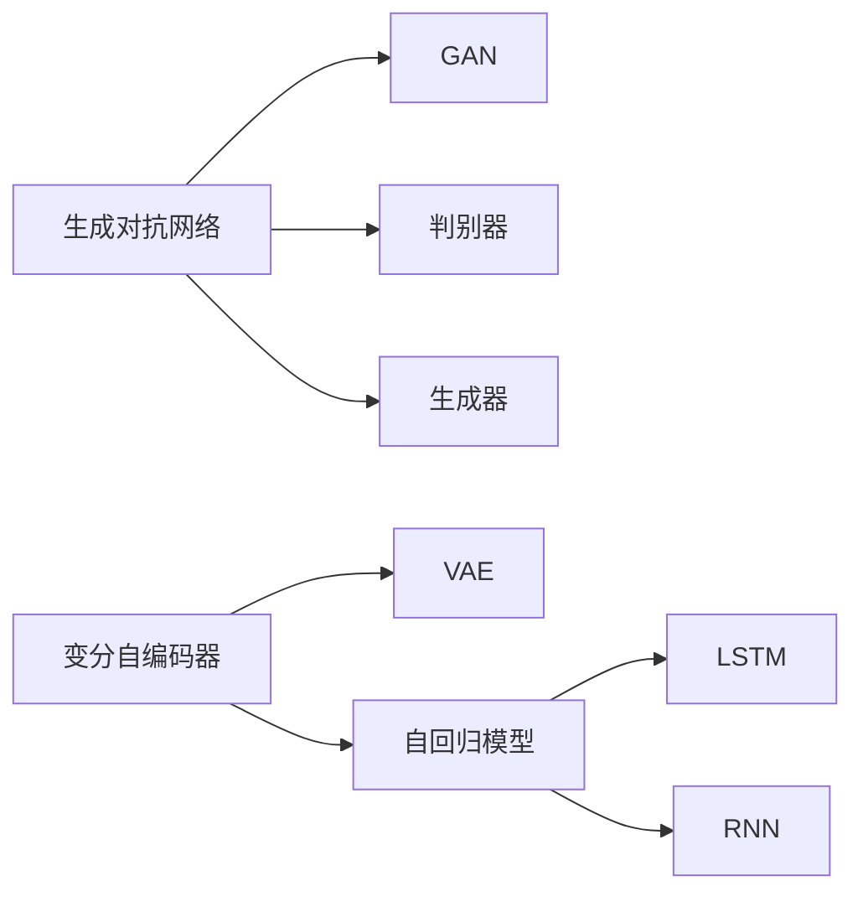

                 

# 生成式AI：颠覆传统，重塑未来商业模式

## 1. 背景介绍

在当今数字化时代，人工智能(AI)技术正以前所未有的速度发展，其中生成式AI(Generative AI)作为AI领域的新兴技术，已经开始在多个行业引发深远变革。生成式AI可以通过学习大量数据，生成新的数据，如文本、图像、音频等，具有强大的创新能力和应用潜力。然而，这一技术的发展也引发了关于商业模式的重新思考。

### 1.1 问题由来

生成式AI的出现，源于深度学习和大数据的迅猛发展。20世纪90年代以来，机器学习尤其是深度学习算法在处理大量数据、提取特征、构建模型等方面取得了显著进展。大数据技术的进步，使得对海量数据的获取和处理成为可能，为生成式AI的发展提供了坚实基础。

近年来，生成式AI技术不断突破，已在图像生成、语音合成、自然语言处理等领域取得了令人瞩目的成果。例如，GPT-3等生成式模型可以生成高质量的文本、图像和音频，广泛应用于内容创作、广告、电商、教育等领域。

生成式AI技术的进步，使得企业得以在设计和生产流程中引入AI，不断优化产品和服务。然而，这种颠覆性技术也对传统商业模式提出了新的挑战，需要企业重新思考如何利用和优化这一技术，以保持竞争优势。

### 1.2 问题核心关键点

生成式AI技术的核心关键点包括：

- **生成能力**：生成式AI的核心能力是生成新的数据，包括文本、图像、音频等。这种能力可以用于内容创作、广告设计、虚拟试衣、动画制作等多个领域。

- **创新潜力**：生成式AI能够通过训练大量数据，生成新颖、独特的内容，这种创新潜力使得企业在产品和服务创新方面具有更大灵活性。

- **自动化流程**：生成式AI可以通过自动化生成内容，减少人工操作，提高效率和生产速度，降低企业成本。

- **数据驱动决策**：生成式AI依赖大量数据进行训练，可以帮助企业更好地理解市场趋势，做出更明智的决策。

- **技术依赖性**：生成式AI技术对硬件计算资源和专业人才的要求较高，企业需要投入大量资源进行技术储备和人才培养。

- **伦理和安全问题**：生成式AI生成的内容可能包含虚假信息、偏见和歧视，需要企业在使用过程中注意伦理和安全问题。

## 2. 核心概念与联系

### 2.1 核心概念概述

生成式AI（Generative AI）是一种通过学习大量数据，生成新的数据，如图像、音频、文本等的技术。它主要依赖于深度学习模型，如生成对抗网络（GAN）、变分自编码器（VAE）、自回归模型（如LSTM、RNN等）等。这些模型可以学习数据的分布特性，生成符合该分布的新数据。

- **生成对抗网络(GAN)**：由两个神经网络组成，一个生成器生成假数据，另一个判别器识别真数据和假数据。通过这两个网络之间的对抗训练，生成器可以生成更逼真的假数据。

- **变分自编码器(VAE)**：学习数据的概率分布，并将新数据生成在训练数据的分布中。VAE通过最大化训练数据似然和最小化生成数据的似然，学习数据的分布特性。

- **自回归模型**：如LSTM、RNN等，通过将数据序列看作一个时间序列，通过时间步的递归生成新数据。

这些核心概念之间可以通过以下Mermaid流程图来展示：



这个流程图展示了生成式AI的核心组件：生成对抗网络、变分自编码器、自回归模型。这些组件通过不同的算法和模型结构，实现对数据的生成。

## 3. 核心算法原理 & 具体操作步骤

### 3.1 算法原理概述

生成式AI的核心算法原理包括生成对抗网络（GAN）和变分自编码器（VAE）。

- **生成对抗网络**：GAN由生成器和判别器两部分组成，通过对抗训练，生成器可以生成与真实数据无法区分的假数据。GAN的训练过程可以简单描述为：
  1. 生成器从随机噪声中生成假数据。
  2. 判别器判断输入数据是真数据还是假数据。
  3. 生成器和判别器交替训练，生成器不断改进生成能力，判别器不断改进鉴别能力。
  4. 最终生成器生成的数据与真实数据非常相似。

- **变分自编码器**：VAE通过学习数据的概率分布，将新数据生成在训练数据的分布中。其训练过程可以简单描述为：
  1. 编码器将输入数据映射到潜在空间。
  2. 解码器将潜在空间的向量映射回数据空间。
  3. 优化损失函数，使得生成数据和真实数据的分布尽可能接近。

### 3.2 算法步骤详解

以GAN为例，下面是生成对抗网络的具体实现步骤：

1. **生成器训练**：生成器从随机噪声中生成假数据，并输入判别器。

2. **判别器训练**：判别器判断输入数据是真数据还是假数据，并输出概率。

3. **对抗训练**：生成器和判别器交替训练，生成器不断改进生成能力，判别器不断改进鉴别能力。

4. **生成数据**：最终生成器可以生成与真实数据无法区分的假数据。

### 3.3 算法优缺点

生成式AI具有以下优点：

- **高效生成**：生成式AI能够快速生成大量高质量数据，如图像、文本、音频等。
- **创新能力**：生成式AI可以生成新颖、独特的内容，推动创新。
- **自动化**：生成式AI可以自动化生成内容，减少人工操作。

但同时，生成式AI也存在以下缺点：

- **技术依赖性**：生成式AI需要大量计算资源和专业人才，企业需要投入较大成本。
- **数据依赖**：生成式AI的效果依赖于数据的质量和多样性。
- **伦理问题**：生成式AI生成的内容可能包含虚假信息、偏见和歧视。

### 3.4 算法应用领域

生成式AI技术已经在多个领域取得了广泛应用，包括：

- **媒体内容创作**：用于生成文本、图像和音频内容，用于新闻、广告、视频制作等。
- **娱乐和游戏**：用于生成虚拟角色、环境、道具等，提升游戏和虚拟现实体验。
- **金融和保险**：用于生成虚拟交易数据、模拟市场情景，用于金融分析和保险精算。
- **教育和培训**：用于生成虚拟教学内容、练习题、模拟实验等。
- **医疗和健康**：用于生成虚拟患者数据、医疗报告等。

## 4. 数学模型和公式 & 详细讲解 & 举例说明

### 4.1 数学模型构建

生成式AI的核心数学模型包括生成对抗网络（GAN）和变分自编码器（VAE）。

- **生成对抗网络**：GAN的目标是生成逼真的假数据，其数学模型可以表示为：
  $$
  G_{\theta}(z) = \frac{1}{2} \mathbb{E}_{z \sim p_z}[L(G(z))] + \frac{1}{2} \mathbb{E}_{x \sim p_x}[L(D(x))] + \frac{1}{2} \mathbb{E}_{z \sim p_z}[L(D(G(z)))]
  $$
  其中，$G$ 为生成器，$D$ 为判别器，$L$ 为损失函数，$p_z$ 为噪声分布，$p_x$ 为数据分布。

- **变分自编码器**：VAE的目标是生成与真实数据分布接近的假数据，其数学模型可以表示为：
  $$
  \mathcal{L}(\theta,\phi) = \mathbb{E}_{x \sim p_x}[\mathbb{E}_{q(z|x)}[\log p(x|z)] + \log q(z|x)] - \mathbb{E}_{x \sim p_x}[\log p(x)]
  $$
  其中，$q$ 为编码器，$p$ 为解码器。

### 4.2 公式推导过程

以下是生成对抗网络（GAN）的详细公式推导：

1. **生成器训练**：
  $$
  \mathcal{L}_{\text{G}} = \mathbb{E}_{z \sim p_z}[\log D(G(z))]
  $$
  其中，$G$ 为生成器，$D$ 为判别器，$z$ 为随机噪声。

2. **判别器训练**：
  $$
  \mathcal{L}_{\text{D}} = \mathbb{E}_{x \sim p_x}[\log D(x)] + \mathbb{E}_{z \sim p_z}[\log (1-D(G(z))]
  $$
  其中，$x$ 为真实数据，$z$ 为随机噪声。

3. **对抗训练**：
  $$
  \min_G \mathcal{L}_{\text{G}} + \max_D \mathcal{L}_{\text{D}}
  $$

### 4.3 案例分析与讲解

以图像生成为例，使用GAN生成逼真的假图像，具体步骤包括：

1. **数据准备**：准备大量真实图像数据，如CIFAR-10、MNIST等。

2. **模型训练**：使用生成器和判别器交替训练，生成器不断改进生成能力，判别器不断改进鉴别能力。

3. **图像生成**：最终生成器可以生成与真实图像无法区分的假图像。

## 5. 项目实践：代码实例和详细解释说明

### 5.1 开发环境搭建

在进行生成式AI实践前，我们需要准备好开发环境。以下是使用Python进行TensorFlow开发的环境配置流程：

1. 安装Anaconda：从官网下载并安装Anaconda，用于创建独立的Python环境。

2. 创建并激活虚拟环境：
```bash
conda create -n tf-env python=3.8 
conda activate tf-env
```

3. 安装TensorFlow：
```bash
pip install tensorflow
```

4. 安装各类工具包：
```bash
pip install numpy pandas scikit-learn matplotlib tqdm jupyter notebook ipython
```

完成上述步骤后，即可在`tf-env`环境中开始生成式AI的实践。

### 5.2 源代码详细实现

这里我们以GAN生成图像为例，给出使用TensorFlow实现生成对抗网络的具体代码：

```python
import tensorflow as tf
from tensorflow.keras.layers import Input, Dense, Reshape, Flatten
from tensorflow.keras.models import Model
from tensorflow.keras.optimizers import Adam

# 定义生成器
def build_generator(latent_dim, img_shape):
    model = tf.keras.Sequential()
    model.add(Dense(256, input_dim=latent_dim))
    model.add(LeakyReLU(alpha=0.2))
    model.add(Dense(512))
    model.add(LeakyReLU(alpha=0.2))
    model.add(Dense(np.prod(img_shape)))
    model.add(Reshape(img_shape))
    return model

# 定义判别器
def build_discriminator(img_shape):
    model = tf.keras.Sequential()
    model.add(Flatten(input_shape=img_shape))
    model.add(Dense(256))
    model.add(LeakyReLU(alpha=0.2))
    model.add(Dense(1, activation='sigmoid'))
    return model

# 定义损失函数
cross_entropy = tf.keras.losses.BinaryCrossentropy(from_logits=True)

def discriminator_loss(real_output, fake_output):
    real_loss = cross_entropy(tf.ones_like(real_output), real_output)
    fake_loss = cross_entropy(tf.zeros_like(fake_output), fake_output)
    total_loss = real_loss + fake_loss
    return total_loss

def generator_loss(fake_output):
    return cross_entropy(tf.ones_like(fake_output), fake_output)

# 定义优化器
generator_optimizer = Adam(learning_rate=0.0002, beta_1=0.5)
discriminator_optimizer = Adam(learning_rate=0.0002, beta_1=0.5)

# 定义输入
latent_dim = 100
img_shape = (28, 28, 1)
latent_input = Input(shape=(latent_dim,))
img_input = Input(shape=(img_shape[0], img_shape[1], img_shape[2]))

# 构建生成器和判别器
generator = build_generator(latent_dim, img_shape)
discriminator = build_discriminator(img_shape)

# 构建联合模型
discriminator.trainable = False

z = latent_input
img = generator(z)
validity = discriminator(img)

combined = Model(latent_input, validity)
combined.compile(loss=generator_loss, optimizer=generator_optimizer)

# 训练模型
generator.trainable = True
discriminator.trainable = True

for epoch in range(epochs):
    random_latent_vectors = np.random.normal(0, 1, (batch_size, latent_dim))
    generated_images = generator.predict(random_latent_vectors)
    real_images = real_images[np.random.randint(0, real_images.shape[0], batch_size)]
    
    d_loss_real = discriminator_loss(discriminator.predict(real_images), 1.0)
    d_loss_fake = discriminator_loss(discriminator.predict(generated_images), 0.0)
    d_loss = 0.5 * (d_loss_real + d_loss_fake)
    
    g_loss = generator_loss(discriminator.predict(generated_images))
    
    d_optimizer.train_on_batch(real_images, 1.0)
    g_optimizer.train_on_batch(random_latent_vectors, 1.0)
```

以上就是使用TensorFlow实现生成对抗网络的具体代码。可以看到，使用TensorFlow实现生成对抗网络，只需定义生成器和判别器，并构建联合模型，即可轻松实现生成逼真的假图像。

### 5.3 代码解读与分析

让我们再详细解读一下关键代码的实现细节：

**build_generator和build_discriminator函数**：
- `build_generator`函数定义了生成器的结构，从随机噪声中生成假图像。
- `build_discriminator`函数定义了判别器的结构，判断输入图像是真实图像还是假图像。

**discriminator_loss和generator_loss函数**：
- `discriminator_loss`函数计算判别器的损失，分为真实图像的损失和假图像的损失，并取平均值。
- `generator_loss`函数计算生成器的损失，即判别器对假图像的分类损失。

**combined模型的定义**：
- `combined`模型将生成器和判别器联合起来，通过`compile`方法指定损失函数和优化器。

**训练模型的循环**：
- 在每个epoch中，随机生成噪声向量，通过生成器生成假图像。
- 将真实图像和假图像输入判别器，计算判别器的损失。
- 分别计算生成器和判别器的损失，并通过优化器更新模型参数。

可以看到，使用TensorFlow实现生成对抗网络，代码实现简单高效，适合快速迭代研究。

## 6. 实际应用场景

### 6.1 媒体内容创作

生成式AI在媒体内容创作领域的应用非常广泛。传统媒体内容的创作需要大量的创意和人力投入，而生成式AI可以自动生成高质量的文本、图像和音频内容，极大地提高了创作效率和质量。

以文本生成为例，生成式AI可以通过学习大量语料，自动生成新闻、广告、博客等文章。这种技术可以用于自动新闻稿的生成、自动广告文案的撰写、自动博客文章的创作等。通过生成式AI，媒体企业可以节省大量人力成本，同时提高内容创作的速度和质量。

### 6.2 娱乐和游戏

生成式AI在娱乐和游戏领域的应用也非常广泛。生成式AI可以用于生成虚拟角色、环境、道具等，提升游戏和虚拟现实体验。

以游戏角色生成为例，生成式AI可以通过学习大量角色设计数据，自动生成逼真的虚拟角色。这种技术可以用于游戏中的角色设计、虚拟现实环境的设计等。通过生成式AI，游戏开发者可以节省大量时间和人力，同时提高游戏和虚拟现实体验的质量。

### 6.3 金融和保险

生成式AI在金融和保险领域也有广泛应用。生成式AI可以用于生成虚拟交易数据、模拟市场情景，用于金融分析和保险精算。

以金融市场模拟为例，生成式AI可以通过学习历史交易数据，自动生成虚拟交易数据，用于市场分析和风险管理。这种技术可以用于金融机构的投资决策、风险管理、市场预测等。通过生成式AI，金融机构可以更好地理解市场趋势，做出更明智的决策。

### 6.4 教育和培训

生成式AI在教育和培训领域也有广泛应用。生成式AI可以用于生成虚拟教学内容、练习题、模拟实验等，提升教学效果和学生学习体验。

以虚拟实验生成为例，生成式AI可以通过学习大量实验数据，自动生成虚拟实验场景和实验结果。这种技术可以用于虚拟实验室的建设、在线课程的设计等。通过生成式AI，教育机构可以节省大量实验设备和实验器材，同时提高实验教学的质量和效果。

## 7. 工具和资源推荐

### 7.1 学习资源推荐

为了帮助开发者系统掌握生成式AI的理论基础和实践技巧，这里推荐一些优质的学习资源：

1. **《深度学习》**：Ian Goodfellow、Yoshua Bengio和Aaron Courville等人合著的深度学习经典教材，全面介绍了深度学习的基本概念和算法。

2. **CS231n《卷积神经网络》**：斯坦福大学开设的计算机视觉课程，详细讲解了卷积神经网络、生成对抗网络等重要算法。

3. **CS294《神经网络》**：斯坦福大学开设的深度学习课程，讲解了深度学习的基本概念、算法和应用。

4. **GANs in Action**：Sebastian Raschka和Vahid Mirjalili合著的书籍，详细讲解了生成对抗网络（GAN）的原理和实现。

5. **《深度学习入门》**：斋藤康毅合著的入门级深度学习书籍，适合初学者学习。

通过对这些资源的学习实践，相信你一定能够快速掌握生成式AI的精髓，并用于解决实际的AI问题。

### 7.2 开发工具推荐

高效的开发离不开优秀的工具支持。以下是几款用于生成式AI开发的常用工具：

1. **TensorFlow**：由Google主导开发的开源深度学习框架，支持分布式计算、自动微分、动态图等特性，适合大规模工程应用。

2. **PyTorch**：由Facebook开发的开源深度学习框架，支持动态图、GPU加速等特性，适合快速迭代研究。

3. **Jupyter Notebook**：交互式编程环境，适合在研究开发中进行代码编写和调试。

4. **Google Colab**：谷歌提供的云端Jupyter Notebook环境，免费提供GPU/TPU算力，方便开发者快速上手实验最新模型。

5. **TensorBoard**：TensorFlow配套的可视化工具，可实时监测模型训练状态，并提供丰富的图表呈现方式。

合理利用这些工具，可以显著提升生成式AI的开发效率，加快创新迭代的步伐。

### 7.3 相关论文推荐

生成式AI技术的发展源于学界的持续研究。以下是几篇奠基性的相关论文，推荐阅读：

1. **Generative Adversarial Nets**：Ian Goodfellow、Jean Pouget-Abadie、Mehdi Mirza等人提出的生成对抗网络（GAN），奠定了生成式AI的基础。

2. **A Neural Algorithm of Artistic Style**：Leon A. Gatys、Alexander S. Ecker、Matthias Bethge等人提出的基于卷积神经网络的图像风格转换算法，展示了生成式AI在图像处理方面的强大能力。

3. **Variational Autoencoders**：Diederik P. Kingma、Max Welling等人提出的变分自编码器（VAE），展示了生成式AI在概率建模方面的应用。

4. **Language Models are Unsupervised Multitask Learners**：Alec Radford、Jeffrey Wu、Robin Zheng等人提出的语言模型预训练方法，展示了生成式AI在自然语言处理方面的应用。

这些论文代表了大生成式AI技术的发展脉络。通过学习这些前沿成果，可以帮助研究者把握学科前进方向，激发更多的创新灵感。

## 8. 总结：未来发展趋势与挑战

### 8.1 研究成果总结

生成式AI技术已经在多个领域取得了显著成果，推动了技术创新和产业应用。以下是一些主要的研究成果：

- **文本生成**：生成式AI可以自动生成新闻、广告、博客等文本内容，提升了媒体内容创作效率和质量。
- **图像生成**：生成式AI可以自动生成逼真的虚拟图像，提升了娱乐、游戏、虚拟现实体验。
- **音乐生成**：生成式AI可以自动生成音乐、声音等音频内容，推动了音频内容创作的发展。
- **艺术创作**：生成式AI可以自动生成艺术作品，推动了艺术创作的发展。

### 8.2 未来发展趋势

展望未来，生成式AI技术将呈现以下几个发展趋势：

1. **高效生成**：生成式AI将进一步提高生成效率，减少计算资源消耗。

2. **多样性生成**：生成式AI将生成更多样化的内容，满足不同用户的需求。

3. **自动化**：生成式AI将进一步自动化生成内容，减少人工操作，提高效率和质量。

4. **跨模态生成**：生成式AI将实现跨模态生成，生成图像、音频、文本等多模态内容。

5. **实时生成**：生成式AI将实现实时生成，满足实时应用的需求。

6. **互动生成**：生成式AI将实现互动生成，与用户进行实时互动，提升用户体验。

### 8.3 面临的挑战

尽管生成式AI技术已经取得了显著成果，但在迈向更加智能化、普适化应用的过程中，仍面临诸多挑战：

1. **数据依赖**：生成式AI依赖大量高质量数据，数据获取和处理成本较高。

2. **计算资源**：生成式AI需要大量计算资源，设备配置和维护成本较高。

3. **伦理问题**：生成式AI生成的内容可能包含虚假信息、偏见和歧视，需要加强伦理监管。

4. **安全性**：生成式AI生成的内容可能被恶意使用，需要加强安全性保障。

5. **技术复杂性**：生成式AI涉及复杂算法和模型，需要较高的技术门槛。

6. **应用场景**：生成式AI需要结合具体应用场景，实现个性化定制。

### 8.4 研究展望

面对生成式AI所面临的诸多挑战，未来的研究需要在以下几个方面寻求新的突破：

1. **数据获取**：探索无监督和半监督生成式AI技术，减少对大规模标注数据的依赖。

2. **模型优化**：开发更高效的生成式AI模型，提高生成效率和质量。

3. **跨模态融合**：研究跨模态生成技术，实现图像、音频、文本等多模态内容生成。

4. **伦理和安全性**：引入伦理和安全性约束，确保生成式AI的应用符合人类价值观和伦理道德。

5. **自动化和互动**：研究自动化生成和互动生成技术，提升用户体验和交互效率。

这些研究方向和突破，必将引领生成式AI技术迈向更高的台阶，为人类认知智能的进化带来深远影响。

## 9. 附录：常见问题与解答

**Q1: 什么是生成式AI？**

A: 生成式AI是一种通过学习大量数据，生成新的数据（如文本、图像、音频等）的技术。它依赖于深度学习模型，如生成对抗网络（GAN）、变分自编码器（VAE）等，实现数据的自动生成。

**Q2: 生成式AI在实际应用中需要注意哪些问题？**

A: 生成式AI在实际应用中需要注意以下几个问题：

- **数据依赖**：生成式AI依赖大量高质量数据，数据获取和处理成本较高。
- **计算资源**：生成式AI需要大量计算资源，设备配置和维护成本较高。
- **伦理问题**：生成式AI生成的内容可能包含虚假信息、偏见和歧视，需要加强伦理监管。
- **安全性**：生成式AI生成的内容可能被恶意使用，需要加强安全性保障。
- **技术复杂性**：生成式AI涉及复杂算法和模型，需要较高的技术门槛。
- **应用场景**：生成式AI需要结合具体应用场景，实现个性化定制。

**Q3: 如何提升生成式AI的生成效率？**

A: 提升生成式AI的生成效率，可以从以下几个方面进行优化：

- **优化模型架构**：选择高效的生成模型架构，如变分自编码器（VAE）、生成对抗网络（GAN）等。
- **减少计算资源消耗**：使用优化算法（如Adam、Adagrad等）和梯度加速技术（如梯度积累、混合精度训练等），减少计算资源消耗。
- **数据增强**：通过对训练数据进行数据增强，如旋转、平移、缩放等，增加数据多样性，提高生成效率。
- **预训练和微调**：对模型进行预训练和微调，提高模型的泛化能力和生成效果。
- **并行计算**：使用分布式计算、GPU/TPU加速等并行计算技术，提高生成效率。

这些方法可以帮助提升生成式AI的生成效率，满足实际应用需求。

