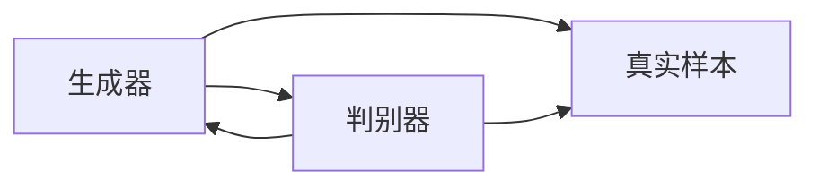

                 

# 生成式AI：颠覆传统，重塑未来商业模式

## 1. 背景介绍

### 1.1 问题由来
随着人工智能技术的不断进步，生成式AI（Generative AI）逐渐成为业内的一大热门话题。它涵盖了文本生成、图像生成、音频生成等诸多领域，已经成为驱动智能应用发展的重要引擎。

生成式AI通过学习数据集的统计特征，生成符合特定规律的新数据，具有高度的创造性和灵活性。它不仅推动了艺术创作、内容生成、游戏开发等传统领域的创新，还为社交媒体、电子商务、智能客服等行业带来了颠覆性的变革。

然而，由于生成式AI的复杂性和多样性，其在商业化应用中仍然面临诸多挑战，包括模型参数的确定、生成效率的提升、生成质量的保证等。

### 1.2 问题核心关键点
为了深入理解生成式AI在商业化应用中的潜在价值和实际效果，本文将围绕以下几个核心关键点展开探讨：

1. 生成式AI的定义和原理。
2. 生成式AI在商业化应用中的优势和劣势。
3. 生成式AI在不同行业的具体应用场景。
4. 生成式AI技术演进及其对商业模式的深远影响。
5. 生成式AI的未来发展趋势和面临的挑战。

通过深入分析这些问题，我们希望能够为读者提供清晰的视角，揭示生成式AI在商业化应用中的独特价值，探讨其未来的发展方向。

## 2. 核心概念与联系

### 2.1 核心概念概述
生成式AI，又称生成对抗网络（Generative Adversarial Networks, GANs）、变分自编码器（Variational Autoencoders, VAEs）等，是一种能够根据输入数据生成新数据的深度学习技术。

其主要思想是：由一个生成器（Generator）和一个判别器（Discriminator）两个部分组成，生成器通过学习输入数据的特征生成新的样本，而判别器则负责区分生成的样本和真实样本。通过不断训练，生成器和判别器能够互相博弈，最终生成器生成的样本可以以很高的概率欺骗判别器，从而实现高质量的生成。

### 2.2 核心概念原理和架构的 Mermaid 流程图


在这个流程图中，生成器A生成新的样本，并输入到判别器B中。判别器B尝试区分新生成的样本和真实样本C。通过反向传播，生成器和判别器不断更新参数，最终使得生成器生成的样本足以以很高的概率欺骗判别器。

### 2.3 核心概念之间的联系
生成式AI的核心概念包括生成器、判别器、损失函数等，它们之间存在着密切的联系。生成器和判别器的不断博弈，使得生成器能够生成更逼真的样本，而判别器则逐渐提高其区分真实样本和生成样本的能力。这种相互博弈的过程，最终导致生成器生成的高质量样本能够以很高的概率欺骗判别器，从而实现了生成式AI的核心目标。

## 3. 核心算法原理 & 具体操作步骤

### 3.1 算法原理概述

生成式AI的算法原理主要基于深度学习的生成模型和判别模型。其核心在于训练生成器和判别器两个部分，通过迭代训练过程，使生成器生成尽可能接近真实样本的生成数据，而判别器则尽可能准确地区分生成数据和真实数据。

在实践中，生成器和判别器的训练过程通常采用对抗训练（Adversarial Training）策略，即在每次迭代中，生成器尝试欺骗判别器，而判别器则试图正确区分真实数据和生成数据。

### 3.2 算法步骤详解

以下是一个简单的生成式AI训练步骤的详细介绍：

1. **准备数据集**：收集用于训练生成器和判别器的数据集。数据集应包含真实样本和生成样本。
2. **定义模型**：选择合适的生成器和判别器模型。生成器通常使用全连接神经网络、卷积神经网络（CNN）、循环神经网络（RNN）等。判别器则通常使用全连接神经网络、CNN等。
3. **初始化参数**：对生成器和判别器的参数进行初始化。
4. **训练过程**：
   - **生成器训练**：在生成器训练阶段，生成器尝试生成与真实样本相似的样本，并尝试欺骗判别器。生成器通过反向传播更新参数，以使生成的样本更接近真实样本。
   - **判别器训练**：在判别器训练阶段，判别器尝试区分真实样本和生成样本，并尽可能提高其区分能力。判别器通过反向传播更新参数，以提高对真实样本和生成样本的识别能力。
5. **交替训练**：生成器和判别器交替进行训练，以提高生成器生成的样本质量。
6. **评估和优化**：在训练过程中，不断评估生成器生成的样本质量，并根据评估结果调整模型参数，以优化生成样本的逼真度。

### 3.3 算法优缺点
#### 优点
1. **高灵活性**：生成式AI可以生成多种类型的数据，包括文本、图像、音频等，适应性强。
2. **广泛应用**：生成式AI已经在艺术创作、内容生成、游戏开发、社交媒体等多个领域得到广泛应用。
3. **创新潜力**：生成式AI能够创造新的数据形式，推动创新，提升用户体验。

#### 缺点
1. **训练复杂性高**：生成式AI的训练过程复杂，需要大量计算资源和时间。
2. **生成质量不稳定**：生成式AI生成的样本质量受训练数据和模型参数的影响较大，生成质量不稳定。
3. **伦理和法律问题**：生成式AI生成的假数据可能引发伦理和法律问题，如版权争议、虚假信息等。

### 3.4 算法应用领域

生成式AI在多个领域都有广泛的应用，以下是几个典型的应用场景：

#### 1. 艺术创作
生成式AI可以帮助艺术家创作新的艺术品。例如，Google DeepDream通过生成器生成具有独特视觉效果的图像，推动了艺术领域的创新。

#### 2. 内容生成
生成式AI可以用于内容生成，如文本、图像、视频等。例如，OpenAI的GPT-3可以在短时间内生成高质量的文章、故事等。

#### 3. 游戏开发
生成式AI在游戏开发中有着广泛的应用，如自动生成游戏地图、生成角色等。

#### 4. 社交媒体
生成式AI可以用于生成有趣的内容，如生成有趣的推文、图片等，提高社交媒体的互动性和趣味性。

#### 5. 智能客服
生成式AI可以用于智能客服，生成自然流畅的对话内容，提高客户满意度。

#### 6. 广告创意
生成式AI可以用于广告创意，生成吸引人的广告内容，提升广告效果。

## 4. 数学模型和公式 & 详细讲解 & 举例说明

### 4.1 数学模型构建

生成式AI的数学模型通常包括生成模型和判别模型两部分。假设生成器为$G$，判别器为$D$，输入数据为$x$，生成的样本为$y$。

生成器的输出表示为$G(x)$，判别器的输出表示为$D(y)$。生成器和判别器的损失函数通常为交叉熵损失函数，表示为$L_{GAN}$。

在训练过程中，生成器和判别器的目标函数分别为：
- 生成器的目标函数：$L_G = \mathbb{E}_{x \sim p(x)} [D(G(x))] + \lambda \mathbb{E}_{x \sim p(x)} [||\nabla_{x}G(x)||^2]$
- 判别器的目标函数：$L_D = \mathbb{E}_{x \sim p(x)} [\log D(x)] + \mathbb{E}_{y \sim p(y)} [\log (1-D(G(y)))]$

其中，$\lambda$为生成器正则化系数，$||\nabla_{x}G(x)||^2$为生成器梯度范数，$p(x)$为真实数据的概率分布，$p(y)$为生成数据的概率分布。

### 4.2 公式推导过程

以GAN为例，其核心思想是通过训练生成器和判别器，使生成器能够生成高质量的样本。

生成器$G$的输出$y$，经过判别器$D$得到输出$z$，判别器的输出表示为$z = D(G(x))$。判别器的损失函数为$L_D = \log(D(z)) + \log(1-D(z'))$，其中$z'$表示判别器对真实数据$x$的输出。

生成器的损失函数为$L_G = \log(1-D(G(x))) + \lambda ||\nabla_{x}G(x)||^2$，其中$\lambda$为生成器正则化系数。

通过交替优化生成器和判别器，不断更新生成器和判别器的参数，最终使得生成器生成的样本$y$能够以很高的概率欺骗判别器，从而实现了高质量的生成。

### 4.3 案例分析与讲解

以下是一个简单的生成式AI案例分析：

假设有一个生成式AI系统，用于生成新图像。系统包含一个生成器和一个判别器。生成器的目标是将随机噪声向量$z$转化为高质量的图像$x$。判别器的目标是将真实图像和生成图像区分开来。

在训练过程中，生成器不断更新参数，使得生成的图像更接近真实图像。判别器也持续更新参数，以提高其区分真实图像和生成图像的能力。通过不断迭代训练，生成器生成的图像质量不断提高，最终实现了高质量的图像生成。

## 5. 项目实践：代码实例和详细解释说明

### 5.1 开发环境搭建

在进行生成式AI项目实践时，需要准备好开发环境。以下是使用Python和TensorFlow搭建开发环境的流程：

1. 安装Anaconda：从官网下载并安装Anaconda，用于创建独立的Python环境。
2. 创建并激活虚拟环境：
```bash
conda create -n tf-env python=3.8 
conda activate tf-env
```

3. 安装TensorFlow：根据CUDA版本，从官网获取对应的安装命令。例如：
```bash
pip install tensorflow==2.4
```

4. 安装其他必要库：
```bash
pip install numpy scipy matplotlib scikit-learn pandas jupyter notebook ipython
```

完成上述步骤后，即可在`tf-env`环境中开始生成式AI实践。

### 5.2 源代码详细实现

以下是一个简单的生成式AI项目代码实现，用于生成手写数字图片：

```python
import tensorflow as tf
from tensorflow.keras import layers

# 定义生成器
def make_generator_model():
    model = tf.keras.Sequential()
    model.add(layers.Dense(256, use_bias=False, input_shape=(100,)))
    model.add(layers.BatchNormalization())
    model.add(layers.LeakyReLU())
    model.add(layers.Dense(512))
    model.add(layers.BatchNormalization())
    model.add(layers.LeakyReLU())
    model.add(layers.Dense(784, activation='tanh'))
    return model

# 定义判别器
def make_discriminator_model():
    model = tf.keras.Sequential()
    model.add(layers.Flatten(input_shape=(28, 28, 1)))
    model.add(layers.Dense(256))
    model.add(layers.LeakyReLU())
    model.add(layers.Dropout(0.3))
    model.add(layers.Dense(1, activation='sigmoid'))
    return model

# 定义生成式AI模型
def make_gan_model(generator, discriminator):
    model = tf.keras.Sequential()
    model.add(generator)
    model.add(discriminator)
    return model

# 定义损失函数
cross_entropy = tf.keras.losses.BinaryCrossentropy(from_logits=True)
def generator_loss(fake_output):
    return cross_entropy(tf.ones_like(fake_output), fake_output)

def discriminator_loss(real_output, fake_output):
    real_loss = cross_entropy(tf.ones_like(real_output), real_output)
    fake_loss = cross_entropy(tf.zeros_like(fake_output), fake_output)
    return real_loss + fake_loss

# 训练生成式AI模型
def train_gan(generator, discriminator, dataset):
    generator_optimizer = tf.keras.optimizers.Adam(1e-4)
    discriminator_optimizer = tf.keras.optimizers.Adam(1e-4)

    @tf.function
    def train_step(images):
        noise = tf.random.normal([BATCH_SIZE, 100])
        with tf.GradientTape() as gen_tape, tf.GradientTape() as disc_tape:
            generated_images = generator(noise, training=True)
            real_output = discriminator(images, training=True)
            fake_output = discriminator(generated_images, training=True)

            gen_loss = generator_loss(fake_output)
            disc_loss = discriminator_loss(real_output, fake_output)

        gradients_of_generator = gen_tape.gradient(gen_loss, generator.trainable_variables)
        gradients_of_discriminator = disc_tape.gradient(disc_loss, discriminator.trainable_variables)

        generator_optimizer.apply_gradients(zip(gradients_of_generator, generator.trainable_variables))
        discriminator_optimizer.apply_gradients(zip(gradients_of_discriminator, discriminator.trainable_variables))

    EPOCHS = 200
    BATCH_SIZE = 128
    dataset = dataset.batch(BATCH_SIZE).prefetch(tf.data.experimental.AUTOTUNE)

    for epoch in range(EPOCHS):
        for image_batch in dataset:
            train_step(image_batch)

    return generator

# 数据预处理
(x_train, y_train), (x_test, y_test) = tf.keras.datasets.mnist.load_data()
x_train = x_train.reshape(x_train.shape[0], 28, 28, 1).astype('float32')
x_train = (x_train - 127.5) / 127.5  # 标准化
noise_dim = 100
generator = make_generator_model()
discriminator = make_discriminator_model()
gan_model = make_gan_model(generator, discriminator)

# 训练生成式AI模型
generator = train_gan(generator, discriminator, x_train)

# 生成手写数字图片
import matplotlib.pyplot as plt

def plot_image(image, title):
    plt.figure(figsize=(3, 3))
    plt.imshow(image, cmap='gray')
    plt.title(title)
    plt.axis('off')

generated_images = generator(tf.random.normal([16, 100]))
generated_images = (generated_images * 127.5) + 127.5
generated_images = generated_images.numpy().astype('uint8')

plt.figure(figsize=(16, 16))
for i in range(generated_images.shape[0]):
    ax = plt.subplot(4, 4, i+1)
    plot_image(generated_images[i], f'Generated digit {i+1}')
```

以上代码实现了一个简单的生成式AI模型，用于生成手写数字图片。通过不断训练，生成器能够生成高质量的样本，实现了生成式AI的核心目标。

### 5.3 代码解读与分析

**生成器定义**：
```python
def make_generator_model():
    model = tf.keras.Sequential()
    model.add(layers.Dense(256, use_bias=False, input_shape=(100,)))
    model.add(layers.BatchNormalization())
    model.add(layers.LeakyReLU())
    model.add(layers.Dense(512))
    model.add(layers.BatchNormalization())
    model.add(layers.LeakyReLU())
    model.add(layers.Dense(784, activation='tanh'))
    return model
```

生成器模型由多个全连接层和激活函数组成。输入为噪声向量，输出为生成图像。

**判别器定义**：
```python
def make_discriminator_model():
    model = tf.keras.Sequential()
    model.add(layers.Flatten(input_shape=(28, 28, 1)))
    model.add(layers.Dense(256))
    model.add(layers.LeakyReLU())
    model.add(layers.Dropout(0.3))
    model.add(layers.Dense(1, activation='sigmoid'))
    return model
```

判别器模型由多个全连接层和激活函数组成，用于判断输入图像的真实性。

**生成式AI模型定义**：
```python
def make_gan_model(generator, discriminator):
    model = tf.keras.Sequential()
    model.add(generator)
    model.add(discriminator)
    return model
```

生成式AI模型由生成器和判别器组成，用于训练和生成样本。

**损失函数定义**：
```python
cross_entropy = tf.keras.losses.BinaryCrossentropy(from_logits=True)

def generator_loss(fake_output):
    return cross_entropy(tf.ones_like(fake_output), fake_output)

def discriminator_loss(real_output, fake_output):
    real_loss = cross_entropy(tf.ones_like(real_output), real_output)
    fake_loss = cross_entropy(tf.zeros_like(fake_output), fake_output)
    return real_loss + fake_loss
```

生成器和判别器的损失函数分别为二进制交叉熵损失函数，用于优化生成器和判别器的参数。

**训练函数定义**：
```python
@tf.function
def train_step(images):
    noise = tf.random.normal([BATCH_SIZE, 100])
    with tf.GradientTape() as gen_tape, tf.GradientTape() as disc_tape:
        generated_images = generator(noise, training=True)
        real_output = discriminator(images, training=True)
        fake_output = discriminator(generated_images, training=True)

        gen_loss = generator_loss(fake_output)
        disc_loss = discriminator_loss(real_output, fake_output)

    gradients_of_generator = gen_tape.gradient(gen_loss, generator.trainable_variables)
    gradients_of_discriminator = disc_tape.gradient(disc_loss, discriminator.trainable_variables)

    generator_optimizer.apply_gradients(zip(gradients_of_generator, generator.trainable_variables))
    discriminator_optimizer.apply_gradients(zip(gradients_of_discriminator, discriminator.trainable_variables))

EPOCHS = 200
BATCH_SIZE = 128
```

训练函数定义了生成器和判别器的参数更新过程，通过交替优化生成器和判别器的参数，实现了高质量的生成。

## 6. 实际应用场景

### 6.1 艺术创作

生成式AI在艺术创作领域有着广泛的应用，如生成艺术作品、设计服装等。例如，Google DeepDream通过对输入图像进行神经网络处理，生成具有独特视觉效果的图像，推动了艺术领域的创新。

### 6.2 内容生成

生成式AI可以用于内容生成，如文本、图像、视频等。例如，OpenAI的GPT-3可以在短时间内生成高质量的文章、故事等。生成式AI的应用场景包括自动摘要、自动生成代码、生成对话等。

### 6.3 游戏开发

生成式AI在游戏开发中有着广泛的应用，如自动生成游戏地图、生成角色等。例如，《我的世界》中生成的地形和资源，很大程度上得益于生成式AI技术。

### 6.4 社交媒体

生成式AI可以用于社交媒体，生成有趣的内容，如生成有趣的推文、图片等，提高社交媒体的互动性和趣味性。

### 6.5 智能客服

生成式AI可以用于智能客服，生成自然流畅的对话内容，提高客户满意度。例如，智能客服系统可以通过生成式AI生成响应，提高回答的准确性和及时性。

### 6.6 广告创意

生成式AI可以用于广告创意，生成吸引人的广告内容，提升广告效果。例如，Facebook的Ad创意生成器可以根据用户行为和偏好，自动生成个性化的广告内容。

## 7. 工具和资源推荐

### 7.1 学习资源推荐

为了帮助开发者系统掌握生成式AI的理论基础和实践技巧，这里推荐一些优质的学习资源：

1. 《生成对抗网络：深度学习中的博弈》：讲述了生成对抗网络的基本原理和应用，适合初学者入门。
2. 《深度学习入门：生成对抗网络》：详细介绍了生成对抗网络的核心思想和实现方法。
3. 《生成式模型与深度学习》：介绍了生成式模型在深度学习中的应用，包括生成对抗网络、变分自编码器等。
4. 《生成式AI：技术与实践》：一本介绍生成式AI技术的书籍，涵盖了生成对抗网络、变分自编码器、自编码器等内容。
5. 《深度学习与生成模型》：一本系统介绍深度学习中生成模型的书籍，适合深度学习初学者和从业者阅读。

通过对这些资源的学习实践，相信你一定能够快速掌握生成式AI的核心思想和实践方法，并应用于实际项目中。

### 7.2 开发工具推荐

高效的开发离不开优秀的工具支持。以下是几款用于生成式AI开发的常用工具：

1. PyTorch：基于Python的开源深度学习框架，灵活动态的计算图，适合快速迭代研究。大多数生成式AI模型都有PyTorch版本的实现。
2. TensorFlow：由Google主导开发的开源深度学习框架，生产部署方便，适合大规模工程应用。同样有丰富的生成式AI模型资源。
3. TensorFlow Probability：基于TensorFlow的概率计算库，支持各种概率模型和生成式AI模型的实现。
4. Keras：高层次的深度学习框架，支持快速搭建生成式AI模型，适合初学者和快速原型设计。
5. Jupyter Notebook：开源的交互式编程环境，支持Python、R等多种编程语言，适合数据处理和模型训练。

合理利用这些工具，可以显著提升生成式AI开发效率，加快创新迭代的步伐。

### 7.3 相关论文推荐

生成式AI的发展离不开学界的持续研究。以下是几篇奠基性的相关论文，推荐阅读：

1. Generative Adversarial Nets（GANs）：由Ian Goodfellow等人提出，奠定了生成对抗网络的基础。
2. Variational Autoencoders（VAEs）：由Kingma等人提出，提出了一种基于变分推断的生成模型。
3. DeepDream：由Google提出，通过对输入图像进行深度神经网络处理，生成具有独特视觉效果的图像。
4. GANs in the Wild：由Cao等人提出，研究了生成对抗网络在实际应用中的表现和问题。
5. Adversarial Training Methods for Semi-Supervised Text Generation：由Gao等人提出，研究了生成对抗网络在半监督文本生成中的应用。

这些论文代表了大生成式AI技术的发展脉络。通过学习这些前沿成果，可以帮助研究者把握学科前进方向，激发更多的创新灵感。

## 8. 总结：未来发展趋势与挑战

### 8.1 研究成果总结

本文对生成式AI的原理、操作步骤、优缺点、应用领域等进行了详细讲解，并对未来的发展趋势和挑战进行了探讨。通过深入分析这些问题，我们希望能够为读者提供清晰的视角，揭示生成式AI在商业化应用中的独特价值，探讨其未来的发展方向。

### 8.2 未来发展趋势

展望未来，生成式AI技术将呈现以下几个发展趋势：

1. **多样性增强**：生成式AI将不断拓展应用领域，包括文本生成、图像生成、音频生成等。
2. **生成质量提升**：随着模型参数的增加和训练数据的丰富，生成式AI的生成质量将不断提高。
3. **应用场景多样化**：生成式AI将在艺术创作、内容生成、游戏开发、社交媒体、智能客服等领域得到广泛应用。
4. **计算效率提升**：通过优化计算图和资源管理，生成式AI的计算效率将不断提升。
5. **伦理和安全问题**：随着生成式AI的广泛应用，伦理和安全问题也将越来越受到关注，需要进一步研究和规范。

### 8.3 面临的挑战

尽管生成式AI技术已经取得了瞩目成就，但在迈向更加智能化、普适化应用的过程中，它仍面临诸多挑战：

1. **训练复杂性高**：生成式AI的训练过程复杂，需要大量计算资源和时间。
2. **生成质量不稳定**：生成式AI生成的样本质量受训练数据和模型参数的影响较大，生成质量不稳定。
3. **伦理和法律问题**：生成式AI生成的假数据可能引发伦理和法律问题，如版权争议、虚假信息等。
4. **计算资源瓶颈**：生成式AI需要大量的计算资源，存在硬件瓶颈。
5. **模型可解释性差**：生成式AI模型的决策过程通常缺乏可解释性，难以解释其内部工作机制和决策逻辑。

### 8.4 研究展望

为了解决生成式AI面临的这些挑战，未来的研究需要在以下几个方面寻求新的突破：

1. **优化训练过程**：研究更高效的训练方法和优化策略，提高训练速度和生成质量。
2. **增强可解释性**：开发更具有可解释性的生成式AI模型，增强模型的透明度和可信度。
3. **降低计算成本**：研究更高效的模型结构和计算方法，降低生成式AI的计算成本。
4. **提升生成质量**：通过增加模型参数和数据量，提高生成式AI的生成质量。
5. **解决伦理和安全问题**：研究生成式AI伦理和安全问题的解决方案，确保生成数据的安全性和合法性。

这些研究方向的探索，必将引领生成式AI技术迈向更高的台阶，为构建安全、可靠、可解释、可控的智能系统铺平道路。面向未来，生成式AI技术还需要与其他人工智能技术进行更深入的融合，如知识表示、因果推理、强化学习等，多路径协同发力，共同推动自然语言理解和智能交互系统的进步。只有勇于创新、敢于突破，才能不断拓展生成式AI的边界，让智能技术更好地造福人类社会。

## 9. 附录：常见问题与解答

**Q1：生成式AI的训练过程复杂，应该如何优化？**

A: 生成式AI的训练过程复杂，可以通过以下方式优化：
1. 采用预训练模型：使用预训练的生成式AI模型，可以减少训练时间和计算资源。
2. 小批量训练：使用小批量训练，可以减少内存消耗，提高训练效率。
3. 引入正则化：使用正则化技术，如L2正则、Dropout等，减少过拟合风险。
4. 使用GPU/TPU：使用高性能的GPU/TPU设备，加速模型训练过程。
5. 优化计算图：通过优化计算图结构，减少计算量。

**Q2：生成式AI生成的样本质量不稳定，如何提升？**

A: 生成式AI生成的样本质量不稳定，可以通过以下方式提升：
1. 增加模型参数：增加模型参数，可以提高生成式AI的生成质量。
2. 增加训练数据：增加训练数据，可以提高模型的泛化能力和生成质量。
3. 优化模型结构：优化生成式AI的模型结构，减少生成质量不稳定的问题。
4. 使用生成对抗网络：使用生成对抗网络，可以提高生成式AI的生成质量。
5. 引入对抗训练：引入对抗训练策略，提高生成式AI的生成质量。

**Q3：生成式AI在实际应用中存在伦理和法律问题，如何解决？**

A: 生成式AI在实际应用中存在伦理和法律问题，可以通过以下方式解决：
1. 严格控制生成数据的来源和用途。
2. 确保生成数据的合法性和可追溯性。
3. 制定伦理和安全规范，规范生成式AI的应用。
4. 建立伦理委员会，监督生成式AI的应用。
5. 建立法律机制，处理生成式AI引发的伦理和法律问题。

**Q4：生成式AI的计算成本高，如何解决？**

A: 生成式AI的计算成本高，可以通过以下方式解决：
1. 优化计算图：通过优化计算图结构，减少计算量。
2. 使用小批量训练：使用小批量训练，减少内存消耗，提高训练效率。
3. 使用分布式训练：使用分布式训练，分散计算负载，提高训练效率。
4. 使用GPU/TPU：使用高性能的GPU/TPU设备，加速模型训练过程。
5. 使用量化加速：使用量化加速技术，减少计算量，提高计算效率。

**Q5：生成式AI的可解释性差，如何解决？**

A: 生成式AI的可解释性差，可以通过以下方式解决：
1. 引入可解释性技术：引入可解释性技术，如注意力机制、可视化方法等。
2. 增加模型透明度：增加生成式AI模型的透明度，增强其可解释性。
3. 设计可解释性输出：设计可解释性输出，增强模型的可解释性。
4. 引入专家知识：引入专家知识，增强生成式AI的可解释性。
5. 建立伦理机制：建立伦理机制，规范生成式AI的应用，增强其可解释性。

通过解决这些常见问题，生成式AI技术将更加成熟和可靠，推动其在更多领域得到广泛应用，为人工智能技术的发展带来新的突破。

---

作者：禅与计算机程序设计艺术 / Zen and the Art of Computer Programming

