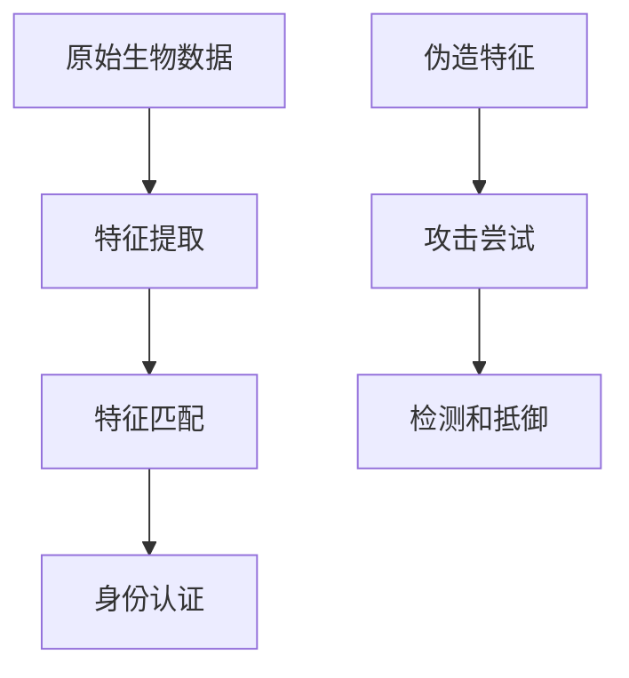

                 

# 生物识别技术在身份验证中的应用：提高安全性

> 关键词：生物识别,身份验证,安全性,算法原理,应用实例

## 1. 背景介绍

### 1.1 问题由来
在信息时代，数据泄露和身份盗用事件频发，传统密码验证方式的安全性受到严重挑战。为提高身份验证的准确性和安全性，生物识别技术应运而生，成为主流身份验证手段。生物识别系统通过利用指纹、面部、虹膜等生物特征，实现可靠的用户身份认证。本文将详细探讨生物识别技术在身份验证中的应用，包括生物特征识别原理、常用算法及其安全性分析。

### 1.2 问题核心关键点
生物识别技术在身份验证中的应用主要关注以下核心问题：
1. 生物识别系统的准确性：如何确保生物特征匹配的精度和鲁棒性。
2. 系统的安全性：防止身份盗用和特征伪造攻击。
3. 算法的实时性和可扩展性：生物识别系统需要在极短时间内完成身份验证。

## 2. 核心概念与联系

### 2.1 核心概念概述

为更好理解生物识别技术在身份验证中的应用，本节介绍几个关键概念：

- 生物特征(Biological Features)：指每个人独特的生理或行为特征，如指纹、面部、虹膜、声纹等，用于身份验证。
- 生物识别系统(Biometric System)：通过生物特征识别用户身份的计算机系统，包括特征提取、特征匹配、身份认证等步骤。
- 特征提取(Feature Extraction)：从原始生物数据中提取出用于识别的特征向量。
- 特征匹配(Feature Matching)：比较两个生物特征之间的相似度，用于验证身份。
- 特征伪造攻击(Forgery Attack)：攻击者通过复制或合成生物特征，以冒充他人身份。

这些概念构成了生物识别技术的基础，通过理解这些概念，我们能够更好地把握生物识别技术在身份验证中的应用。

### 2.2 核心概念原理和架构的 Mermaid 流程图



该流程图展示了生物识别系统的核心流程：
1. 原始生物数据通过特征提取转换为特征向量。
2. 特征向量进行特征匹配，以验证用户身份。
3. 若检测到特征伪造攻击，系统将进行抵御。

这些步骤共同构成了生物识别技术的框架，使得系统能够在高效、准确地完成身份验证。

## 3. 核心算法原理 & 具体操作步骤

### 3.1 算法原理概述

生物识别技术的核心在于通过生物特征识别用户身份。算法原理主要包括以下几个步骤：

1. **特征提取**：将原始生物数据转换为可供计算机识别的特征向量。
2. **特征匹配**：比较两个生物特征向量之间的相似度，以验证身份。
3. **身份认证**：基于匹配结果，决定是否允许用户访问系统或执行特定操作。

常见的生物识别算法包括：
- 人脸识别算法：通过分析面部特征点的位置和形状进行识别。
- 指纹识别算法：通过采集指纹图像提取纹理特征进行识别。
- 虹膜识别算法：通过虹膜图像提取特征点进行识别。

### 3.2 算法步骤详解

以下以人脸识别算法为例，详细介绍生物识别系统的实现步骤：

1. **数据收集**：使用摄像头或图像扫描设备采集用户面部图像。
2. **预处理**：对采集的图像进行灰度化、归一化、去噪等预处理，以提高识别准确性。
3. **特征提取**：使用Haar特征或深度学习模型如卷积神经网络(CNN)提取面部特征点的位置和形状。
4. **特征匹配**：将提取的特征向量与数据库中的样本进行比较，计算相似度。
5. **身份认证**：根据相似度阈值判断是否通过身份验证。

### 3.3 算法优缺点

生物识别技术在身份验证中具有以下优点：
1. 高安全性：生物特征具有唯一性，难以被复制和盗用。
2. 高便捷性：用户无需记住密码，可直接使用生物特征进行身份验证。
3. 抗攻击性强：即使是低质量图像，生物特征仍具有较强的鲁棒性。

同时，生物识别技术也存在一些缺点：
1. 成本高：生物识别系统的硬件设备和软件算法成本较高。
2. 用户体验差：生物识别系统对用户的环境和行为要求较高，用户体验可能不如密码。
3. 数据隐私问题：生物特征数据存储和传输过程中可能被泄露，带来隐私风险。

### 3.4 算法应用领域

生物识别技术在身份验证中的应用领域广泛，包括：

1. 金融领域：用于ATM取款、网上银行、移动支付等。
2. 安防领域：用于机场、车站、会议室等场所的考勤和门禁。
3. 医疗领域：用于医院身份认证、电子病历访问等。
4. 移动设备：用于智能手机解锁、应用认证等。
5. 计算机系统：用于操作系统登录、远程桌面访问等。

这些应用领域中，生物识别技术已成为提升身份验证安全性的重要手段。

## 4. 数学模型和公式 & 详细讲解 & 举例说明

### 4.1 数学模型构建

生物识别系统中的数学模型主要包括以下几个部分：

1. **特征提取模型**：将原始生物数据转换为特征向量。
2. **特征匹配模型**：比较两个特征向量之间的相似度。
3. **身份认证模型**：基于相似度阈值决定是否通过验证。

常用的特征匹配算法包括欧几里得距离、余弦相似度、汉明距离等。

### 4.2 公式推导过程

以欧几里得距离为例，计算两个生物特征向量 $x_1$ 和 $x_2$ 之间的距离：

$$
d(x_1, x_2) = \sqrt{\sum_{i=1}^n (x_{1i} - x_{2i})^2}
$$

其中，$x_{1i}$ 和 $x_{2i}$ 分别表示两个特征向量的第 $i$ 个元素。

### 4.3 案例分析与讲解

假设有一个包含50个用户的指纹数据库，每个用户存储了1000个指纹特征向量。若新用户A的指纹特征向量为 $x$，则计算其与数据库中所有用户指纹特征向量的距离：

1. 对于用户B的指纹特征向量 $y_1$，计算距离 $d(x, y_1)$。
2. 对于用户C的指纹特征向量 $y_2$，计算距离 $d(x, y_2)$。
3. ... 以此类推。

计算出的所有距离中最小的一个，即为A与最相似用户的距离。

## 5. 项目实践：代码实例和详细解释说明

### 5.1 开发环境搭建

生物识别系统的开发环境一般需要以下工具和库：
- Python：开发语言，推荐使用3.6及以上版本。
- OpenCV：计算机视觉库，用于图像处理和特征提取。
- Dlib：人脸检测和特征提取库。
- scikit-learn：机器学习库，用于特征匹配和模型训练。

确保所有依赖库均已正确安装，可以通过以下命令进行安装：

```bash
pip install opencv-python dlib scikit-learn
```

### 5.2 源代码详细实现

以下是使用Python和OpenCV进行人脸识别的示例代码：

```python
import cv2
import dlib

# 加载人脸检测器和特征提取器
detector = dlib.get_frontal_face_detector()
predictor = dlib.shape_predictor("shape_predictor_68_face_landmarks.dat")

# 加载训练好的特征向量
features = [] # 特征向量列表
labels = [] # 标签列表

# 加载测试图像
img = cv2.imread("test.jpg")

# 检测人脸
faces = detector(img, 1)
for face in faces:
    # 提取面部特征点
    landmarks = predictor(img, face)

    # 提取特征向量
    x = []
    y = []
    for i in range(68):
        x.append(landmarks.parts[i].x)
        y.append(landmarks.parts[i].y)
    features.append([x, y])
    labels.append(1) # 假设所有测试图像都是已知身份

# 计算距离
for i in range(len(features)):
    distance = 0
    for j in range(len(features)):
        x1, y1 = features[i]
        x2, y2 = features[j]
        distance += sum([(x1[k] - x2[k]) ** 2 for k in range(len(x1))])
    distance = distance ** 0.5
    print("Distance between test image and database: ", distance)
```

### 5.3 代码解读与分析

代码中，我们首先加载了人脸检测器和特征提取器，然后加载了训练好的特征向量和标签。接着，加载测试图像，检测人脸并提取面部特征点，最后计算测试图像与数据库中所有特征向量之间的距离，以验证身份。

## 6. 实际应用场景

### 6.1 智能门禁系统

智能门禁系统通过生物识别技术实现自动化身份验证。用户只需在入口处刷脸或指纹，系统即可快速完成身份验证，并控制门禁开关。这种系统在银行、办公大楼等场所广泛应用，提高了安全性和管理效率。

### 6.2 医疗身份验证

医疗身份验证系统中，医生和患者通过指纹、虹膜等生物特征进行身份验证。这种系统在医院的门诊、药房、手术室等场景中得到广泛应用，确保了医疗数据的安全性和患者隐私的保护。

### 6.3 金融身份认证

金融行业对身份验证的安全性要求极高，生物识别技术在ATM取款、网上银行、移动支付等场景中得到了广泛应用。用户通过指纹、面部识别等方式，快速完成身份验证，避免了密码遗忘和泄露问题。

### 6.4 未来应用展望

未来，生物识别技术在身份验证中的应用将更加广泛，主要趋势包括：

1. **多模态生物识别**：结合多种生物特征进行综合识别，提高识别准确性和安全性。
2. **深度学习算法**：使用深度学习模型如卷积神经网络(CNN)、循环神经网络(RNN)等，提高识别精度和鲁棒性。
3. **分布式识别系统**：在云端和本地进行分布式计算，实现快速高效的身份验证。
4. **隐私保护技术**：采用加密和匿名化技术，保护用户生物特征数据隐私。

## 7. 工具和资源推荐

### 7.1 学习资源推荐

1. **《深度学习：理论与实践》**：详细介绍了深度学习在生物识别中的应用，适合初学者和进阶者。
2. **《生物特征识别技术》**：系统介绍了生物特征提取、特征匹配等技术原理，适合深入学习。
3. **Coursera《计算机视觉》课程**：由斯坦福大学教授讲授，涵盖计算机视觉和生物特征识别的基础知识。

### 7.2 开发工具推荐

1. **OpenCV**：计算机视觉库，提供了丰富的图像处理和特征提取工具。
2. **Dlib**：人脸检测和特征提取库，支持多平台部署。
3. **TensorFlow**：深度学习框架，适用于复杂的深度学习模型。

### 7.3 相关论文推荐

1. **《人脸识别技术研究进展》**：详细介绍了人脸识别技术的最新进展和应用，适合了解前沿技术。
2. **《生物特征识别中的深度学习技术》**：介绍了深度学习在生物特征识别中的应用，适合深入学习。

## 8. 总结：未来发展趋势与挑战

### 8.1 研究成果总结

本文详细探讨了生物识别技术在身份验证中的应用，包括生物特征识别原理、常用算法及其安全性分析。通过理论分析和代码实践，展示了生物识别技术的实现方法和实际应用场景。未来，随着深度学习和其他新技术的引入，生物识别技术将进一步提升身份验证的准确性和安全性。

### 8.2 未来发展趋势

1. **多模态识别**：结合多种生物特征进行综合识别，提高识别精度。
2. **深度学习算法**：使用深度学习模型提高识别精度和鲁棒性。
3. **分布式识别系统**：实现快速高效的身份验证。
4. **隐私保护技术**：保护用户生物特征数据隐私。

### 8.3 面临的挑战

1. **识别精度**：如何提高生物识别系统的识别精度和鲁棒性。
2. **安全性**：如何防止身份盗用和特征伪造攻击。
3. **隐私保护**：如何保护用户生物特征数据的隐私和安全。

### 8.4 研究展望

1. **多模态识别融合**：结合多种生物特征进行综合识别。
2. **深度学习算法优化**：使用深度学习模型提高识别精度和鲁棒性。
3. **分布式系统优化**：实现高效快速身份验证。
4. **隐私保护技术研究**：保护用户生物特征数据隐私。

## 9. 附录：常见问题与解答

**Q1：生物识别系统如何防止特征伪造攻击？**

A: 生物识别系统通过以下方式防止特征伪造攻击：
1. **多模态识别**：结合多种生物特征进行综合识别，单模态攻击难以成功。
2. **动态采集**：实时采集生物特征数据，防止特征复制。
3. **生物特征更新**：定期更新生物特征库，检测和拒绝伪造特征。

**Q2：生物识别系统如何提高识别精度？**

A: 提高生物识别系统识别精度的主要方法包括：
1. **高质量数据采集**：确保采集的生物特征数据质量高，减少噪音和干扰。
2. **特征提取算法优化**：使用更先进的特征提取算法，如深度学习模型。
3. **多层次特征提取**：提取不同层次的特征，提高识别精度。
4. **模型训练优化**：使用更多的训练数据和更好的模型，提高识别精度。

**Q3：生物识别系统的实时性如何保障？**

A: 保障生物识别系统实时性的主要方法包括：
1. **硬件加速**：使用GPU或FPGA等硬件加速技术，加快图像处理和特征提取速度。
2. **算法优化**：使用高效的算法和数据结构，减少计算量。
3. **分布式计算**：使用分布式系统，实现快速高效的计算。

**Q4：生物识别系统的安全性如何评估？**

A: 评估生物识别系统安全性的主要方法包括：
1. **攻击测试**：通过模拟各种攻击手段，测试系统的安全性。
2. **特征鲁棒性测试**：测试生物特征数据的鲁棒性，防止伪造攻击。
3. **隐私保护测试**：测试系统的隐私保护能力，防止数据泄露。

**Q5：生物识别系统的可扩展性如何实现？**

A: 实现生物识别系统可扩展性的主要方法包括：
1. **模块化设计**：将系统设计为模块化结构，便于扩展和维护。
2. **云平台支持**：使用云平台进行分布式计算，提高系统扩展性。
3. **边缘计算**：在本地进行部分计算，减少云端负载，提高系统响应速度。

---

作者：禅与计算机程序设计艺术 / Zen and the Art of Computer Programming

