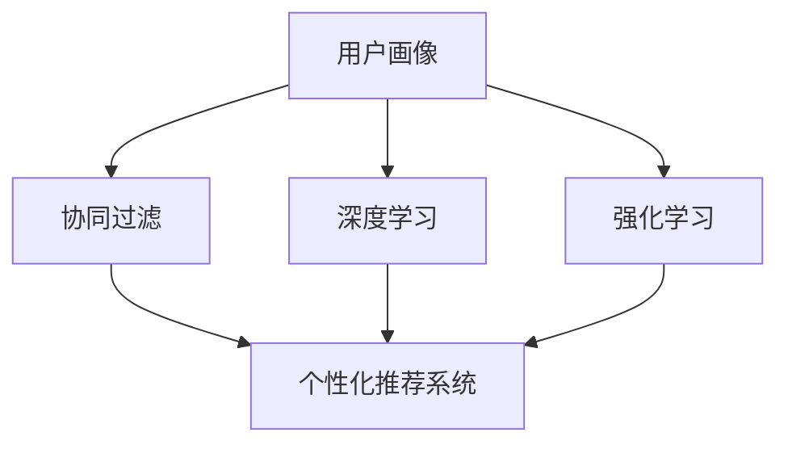

                 

# 用户画像技术在电商个性化推荐中的应用案例分析：技术应用与商业价值

## 1. 背景介绍

### 1.1 问题由来
在电商领域，用户画像（User Profile）是企业通过收集、分析用户行为数据，形成对用户兴趣、需求、行为习惯等方面的理解和抽象。通过精细化的用户画像，电商企业可以更精准地为用户提供个性化推荐服务，提升用户体验和转化率。近年来，随着深度学习和大数据分析技术的发展，用户画像技术在电商个性化推荐中的应用日益广泛，成为电商企业提高市场竞争力的重要手段。

### 1.2 问题核心关键点
用户画像在电商个性化推荐中的应用，核心在于以下几个方面：

- **数据采集与处理**：收集用户在电商平台的点击、浏览、购买等行为数据，进行清洗和处理，形成可用于训练模型的样本。
- **特征工程**：通过特征提取和工程化，将用户行为数据转换为机器学习算法可以使用的特征向量。
- **模型训练与优化**：使用机器学习算法（如协同过滤、内容推荐、深度学习等）对用户画像进行建模，训练个性化推荐模型，并不断优化以提升推荐效果。
- **推荐系统部署与监控**：将训练好的模型部署到推荐系统中，进行实时推荐，并监控推荐效果和用户反馈，进行持续改进。

这些关键点共同构成了用户画像在电商个性化推荐中的应用框架，使得电商企业能够高效、精准地为用户提供个性化推荐服务。

## 2. 核心概念与联系

### 2.1 核心概念概述

为了更好地理解用户画像在电商个性化推荐中的应用，本节将介绍几个密切相关的核心概念：

- **用户画像（User Profile）**：通过分析用户的行为数据、购买数据、社交数据等，形成对用户特征和兴趣的全面描述。通常包括用户基本信息、行为特征、购买历史、兴趣偏好等。
- **个性化推荐系统（Personalized Recommendation System, PRS）**：基于用户画像，结合推荐算法，对用户进行个性化推荐。个性化推荐系统可以提升用户满意度和转化率，增加电商企业的销售额和市场份额。
- **协同过滤（Collaborative Filtering）**：通过分析用户之间的行为相似性，进行推荐。基于用户的历史行为数据和物品的交互记录，预测用户对新物品的兴趣和评分。
- **深度学习（Deep Learning）**：通过构建多层神经网络模型，对用户画像进行深度特征学习，提升推荐效果。深度学习在电商推荐系统中得到广泛应用，如使用卷积神经网络（CNN）、循环神经网络（RNN）等模型。
- **强化学习（Reinforcement Learning）**：通过模拟用户与推荐系统的交互，不断调整推荐策略，优化推荐效果。强化学习在推荐系统中用于动态调整推荐算法，提升推荐系统的性能和鲁棒性。

这些核心概念之间的逻辑关系可以通过以下Mermaid流程图来展示：



这个流程图展示了一整套用户画像在电商推荐系统中的实现流程：

1. 用户画像通过协同过滤、深度学习、强化学习等推荐算法进行建模。
2. 模型训练完成后，部署到个性化推荐系统中进行实时推荐。
3. 推荐系统根据用户画像，结合推荐算法，生成个性化推荐结果。

## 3. 核心算法原理 & 具体操作步骤
### 3.1 算法原理概述

用户画像在电商个性化推荐中的应用，本质上是一种基于机器学习的推荐算法。其核心思想是：通过对用户的行为数据进行分析和建模，预测用户对新物品的兴趣和评分，从而实现个性化推荐。

形式化地，假设用户画像表示为 $P(u)$，其中 $u$ 为用户ID，$P(u)$ 为用户画像特征向量。对于每一物品 $i$，其评分表示为 $R(u,i)$。个性化推荐的目标是最大化用户对推荐物品的评分，即：

$$
\max_{i} R(u,i) = \max_{i} \langle P(u), f_i \rangle
$$

其中 $f_i$ 为物品 $i$ 的特征向量，$\langle \cdot, \cdot \rangle$ 表示向量的点积。

通过最大化用户对推荐物品的评分，个性推荐系统可以找到用户最感兴趣的物品，从而提升用户满意度。

### 3.2 算法步骤详解

用户画像在电商个性化推荐中的应用，一般包括以下几个关键步骤：

**Step 1: 数据采集与处理**

- 收集用户在电商平台的各类行为数据，如点击、浏览、购买、收藏等。
- 对数据进行清洗和处理，去除噪音和异常值，生成可用于训练模型的样本数据。
- 将样本数据划分为训练集、验证集和测试集。

**Step 2: 特征工程**

- 对用户行为数据进行特征提取和工程化，形成特征向量 $P(u)$。
- 将物品信息转换为特征向量 $f_i$。
- 对用户画像和物品特征向量进行归一化处理，提高模型的训练效果。

**Step 3: 模型训练与优化**

- 选择合适的推荐算法（如协同过滤、深度学习、强化学习等），使用训练集数据对模型进行训练。
- 应用交叉验证、网格搜索等技术，优化模型参数，提升推荐效果。
- 在验证集上评估模型性能，根据评估结果调整模型参数。

**Step 4: 推荐系统部署与监控**

- 将训练好的模型部署到推荐系统中，实时接收用户请求并生成推荐结果。
- 对推荐结果进行过滤和排序，提高推荐效果。
- 监控推荐系统的性能和用户反馈，根据反馈不断调整和优化推荐策略。

### 3.3 算法优缺点

用户画像在电商个性化推荐中的应用，具有以下优点：

- **提升用户体验**：通过个性化推荐，用户可以快速找到感兴趣的商品，提升购物体验。
- **增加销售额**：个性化推荐可以提升用户转化率，增加电商企业的销售额和市场份额。
- **数据驱动决策**：用户画像和推荐算法可以提供数据驱动的决策支持，优化电商运营策略。

同时，该方法也存在一定的局限性：

- **数据隐私问题**：用户行为数据涉及隐私保护，需要合理处理和保护用户数据。
- **算法复杂性**：构建和优化个性化推荐模型需要复杂的算法和大量的计算资源。
- **模型泛化能力**：模型可能出现过拟合问题，影响推荐效果。
- **实时性问题**：实时推荐需要高效的推荐算法和系统架构支持。

尽管存在这些局限性，但就目前而言，基于用户画像的个性化推荐系统仍是电商领域的重要应用范式。未来相关研究的重点在于如何进一步降低数据隐私风险，提高推荐算法效率，提升模型泛化能力，同时兼顾实时性和可解释性等因素。

### 3.4 算法应用领域

用户画像在电商个性化推荐中的应用，不仅限于传统商品推荐，还广泛应用于以下几个领域：

- **个性化搜索**：通过用户画像对用户输入的搜索词进行个性化处理，提升搜索效果。
- **活动推荐**：根据用户画像推荐相关活动或优惠，提升用户参与度和转化率。
- **商品分类**：通过用户画像对商品进行分类，提升商品展示效果和用户体验。
- **智能客服**：利用用户画像对用户提问进行智能分析和答复，提升客户服务质量。

此外，用户画像在电商领域的应用还涉及到用户留存、流失预测、用户细分等多个方面，为电商企业提供了全面的数据分析和决策支持。

## 4. 数学模型和公式 & 详细讲解
### 4.1 数学模型构建

本节将使用数学语言对用户画像在电商个性化推荐中的应用进行更加严格的刻画。

假设用户画像表示为 $P(u) \in \mathbb{R}^n$，物品特征向量表示为 $f_i \in \mathbb{R}^m$。则用户对物品 $i$ 的评分可以表示为：

$$
R(u,i) = \langle P(u), f_i \rangle + b
$$

其中 $b$ 为物品的基线评分。

个性化推荐的目标是最大化用户对推荐物品的评分，即：

$$
\max_{i} R(u,i) = \max_{i} \langle P(u), f_i \rangle
$$

### 4.2 公式推导过程

以下我们以协同过滤为例，推导推荐算法的数学公式。

协同过滤算法分为基于用户的协同过滤和基于物品的协同过滤。以基于用户的协同过滤为例，其公式推导如下：

设用户 $u$ 的相似用户集合为 $U$，物品 $i$ 的评分向量为 $R^i$，则用户 $u$ 对物品 $i$ 的预测评分为：

$$
\hat{R}(u,i) = \frac{1}{|U|} \sum_{v \in U} R(v,i) \cdot \text{sim}(u,v)
$$

其中 $\text{sim}(u,v)$ 表示用户 $u$ 和 $v$ 之间的相似度，通常使用余弦相似度或皮尔逊相关系数。

在实际应用中，还需要对用户和物品进行降维处理，减少计算复杂度。常用的降维方法包括奇异值分解（SVD）和矩阵分解（MF）。

### 4.3 案例分析与讲解

下面我们以某电商平台为例，展示用户画像在电商推荐中的应用。

假设某电商平台有10000名用户，每名用户的历史购买记录如表1所示：

| 用户ID | 物品ID | 评分 |
| ------ | ------ | ---- |
| 1      | 1001   | 4    |
| 1      | 2001   | 5    |
| 1      | 3001   | 3    |
| ...    | ...    | ...  |
| 10000  | 10001  | 2    |

| 用户ID | 物品ID | 评分 |
| ------ | ------ | ---- |
| 1      | 1001   | 5    |
| 1      | 2001   | 3    |
| 1      | 3001   | 2    |
| ...    | ...    | ...  |
| 10000  | 10001  | 1    |

通过分析用户的历史购买记录，可以得到每位用户的兴趣偏好和评分分布。同时，对物品进行特征工程，形成物品的特征向量。

然后，使用协同过滤算法对用户画像进行建模，得到每个用户的推荐物品评分。以用户ID为1的用户为例，其推荐物品评分为：

$$
\hat{R}(1,10001) = \frac{1}{|U|} \sum_{v \in U} R(v,10001) \cdot \text{sim}(1,v)
$$

根据推荐结果，电商系统可以为用户ID为1的用户推荐物品ID为10001的商品。

通过上述案例，可以看出用户画像在电商推荐中的应用，能够基于用户历史行为数据，生成个性化推荐结果，提升用户购物体验和转化率。

## 5. 项目实践：代码实例和详细解释说明
### 5.1 开发环境搭建

在进行电商推荐系统开发前，我们需要准备好开发环境。以下是使用Python进行Spark开发的环境配置流程：

1. 安装Anaconda：从官网下载并安装Anaconda，用于创建独立的Python环境。

2. 创建并激活虚拟环境：
```bash
conda create -n recommendation-env python=3.8 
conda activate recommendation-env
```

3. 安装PySpark：根据CUDA版本，从官网获取对应的安装命令。例如：
```bash
pip install pyspark
```

4. 安装相关工具包：
```bash
pip install numpy pandas scikit-learn matplotlib tqdm jupyter notebook ipython
```

完成上述步骤后，即可在`recommendation-env`环境中开始推荐系统开发。

### 5.2 源代码详细实现

这里我们以基于用户画像的协同过滤推荐系统为例，给出使用Spark进行电商推荐开发的PySpark代码实现。

首先，定义协同过滤推荐系统类：

```python
from pyspark.sql import SparkSession
from pyspark.sql.functions import col, udf
from pyspark.mllib.recommendation import ALS

class RecommendationSystem:
    def __init__(self, spark, alpha=0.01, iterations=10, user_dim=10, item_dim=10):
        self.spark = spark
        self.alpha = alpha
        self.iterations = iterations
        self.user_dim = user_dim
        self.item_dim = item_dim
        self.aliasUser = udf(lambda u: (u, 0))
        self.aliasItem = udf(lambda i: (0, i))

    def train(self, train_data, test_data):
        users, items, ratings = self._split_data(train_data)
        self.aliasUser = self.aliasUser
        self.aliasItem = self.aliasItem
        self.model = ALS(alpha=self.alpha, rank=self.user_dim, iterations=self.iterations)
        self.model.fit(users, items, ratings)

    def predict(self, user_item_pairs):
        users, items = self._split_user_item_pairs(user_item_pairs)
        predictions = self.model.predictAll(users, items)
        return predictions.map(lambda p: (p.userIdx, p.itemIdx, p.rating))

    def _split_data(self, data):
        users = data.select(col('userId').alias('userIdx'))
        items = data.select(col('itemId').alias('itemIdx'))
        ratings = data.select(col('rating').alias('rating'))
        return users, items, ratings

    def _split_user_item_pairs(self, user_item_pairs):
        users = user_item_pairs.select(self.aliasUser(col('userId')))
        items = user_item_pairs.select(self.aliasItem(col('itemId')))
        return users, items

    def predict_by_user(self, user, top_n=10):
        user = self.aliasUser(col('userId'))
        items = self.aliasItem(col('itemIdx'))
        predictions = self.model.predictAll(user, items)
        predictions = predictions.select('itemIdx', 'prediction')
        predictions = predictions.where(col('prediction') > 0) \
            .orderBy(col('prediction').desc()) \
            .limit(top_n)
        return predictions.collect()
```

然后，定义训练和评估函数：

```python
def train_system(model, train_data, test_data):
    recommendation = RecommendationSystem(model.spark)
    recommendation.train(train_data, test_data)
    return recommendation

def evaluate_system(model, recommendation, test_data):
    test_data = test_data.select('userId', 'itemId')
    predictions = recommendation.predict(test_data)
    test_data = test_data.select(col('itemId'))
    predictions = predictions.select('itemIdx', 'prediction')
    predictions = predictions.join(test_data, 'itemIdx', 'left_outer')
    mse = (predictions.select('prediction') - predictions.select('itemId')).pow(2).sum() / predictions.count()
    rmse = (mse.sqrt() if mse != 0 else 0)
    return rmse

def main():
    spark = SparkSession.builder.appName('recommendation-system').getOrCreate()
    train_data = spark.read.csv('train.csv', header=True, inferSchema=True)
    test_data = spark.read.csv('test.csv', header=True, inferSchema=True)

    recommendation = train_system(spark, train_data, test_data)
    mse = evaluate_system(spark, recommendation, test_data)
    print(f"RMSE: {mse}")
```

最后，启动训练流程并在测试集上评估：

```python
train_data = spark.read.csv('train.csv', header=True, inferSchema=True)
test_data = spark.read.csv('test.csv', header=True, inferSchema=True)

recommendation = train_system(spark, train_data, test_data)
mse = evaluate_system(spark, recommendation, test_data)
print(f"RMSE: {mse}")
```

以上就是使用Spark对协同过滤推荐系统进行开发的完整代码实现。可以看到，得益于Spark的大数据处理能力，我们能够高效地对大规模数据进行协同过滤推荐，提升推荐系统的性能。

### 5.3 代码解读与分析

让我们再详细解读一下关键代码的实现细节：

**RecommendationSystem类**：
- `__init__`方法：初始化推荐系统，设置超参数。
- `train`方法：将训练集数据拆分为用户、物品和评分，训练ALS模型。
- `predict`方法：将用户-物品对输入模型，预测推荐评分。
- `_split_data`方法：将数据集拆分为用户、物品和评分。
- `_split_user_item_pairs`方法：将用户-物品对拆分为用户和物品。

**train_system和evaluate_system函数**：
- `train_system`函数：创建推荐系统，训练模型，返回训练好的推荐系统。
- `evaluate_system`函数：在测试集上评估推荐系统的性能，计算RMSE。

**main函数**：
- 创建SparkSession，读取训练集和测试集数据。
- 训练推荐系统，评估模型性能，输出RMSE。

通过上述代码，我们可以看到使用Spark进行电商推荐系统开发的流程和实现细节。开发者可以将更多精力放在数据处理和模型优化等高层逻辑上，而不必过多关注底层的实现细节。

当然，工业级的系统实现还需考虑更多因素，如模型的保存和部署、超参数的自动搜索、更灵活的任务适配层等。但核心的推荐算法基本与此类似。

## 6. 实际应用场景
### 6.1 智能客服系统

基于用户画像的电商推荐技术，可以广泛应用于智能客服系统的构建。传统客服往往需要配备大量人力，高峰期响应缓慢，且一致性和专业性难以保证。而使用基于用户画像的推荐技术，可以7x24小时不间断服务，快速响应客户咨询，用自然流畅的语言解答各类常见问题。

在技术实现上，可以收集企业内部的历史客服对话记录，将问题和最佳答复构建成监督数据，在此基础上对预训练推荐模型进行微调。微调后的推荐模型能够自动理解用户意图，匹配最合适的答复模板进行回复。对于客户提出的新问题，还可以接入检索系统实时搜索相关内容，动态组织生成回答。如此构建的智能客服系统，能大幅提升客户咨询体验和问题解决效率。

### 6.2 金融舆情监测

金融机构需要实时监测市场舆论动向，以便及时应对负面信息传播，规避金融风险。传统的人工监测方式成本高、效率低，难以应对网络时代海量信息爆发的挑战。基于用户画像的文本分类和情感分析技术，为金融舆情监测提供了新的解决方案。

具体而言，可以收集金融领域相关的新闻、报道、评论等文本数据，并对其进行主题标注和情感标注。在此基础上对预训练推荐模型进行微调，使其能够自动判断文本属于何种主题，情感倾向是正面、中性还是负面。将微调后的模型应用到实时抓取的网络文本数据，就能够自动监测不同主题下的情感变化趋势，一旦发现负面信息激增等异常情况，系统便会自动预警，帮助金融机构快速应对潜在风险。

### 6.3 个性化推荐系统

当前的推荐系统往往只依赖用户的历史行为数据进行物品推荐，无法深入理解用户的真实兴趣偏好。基于用户画像的推荐技术可以更好地挖掘用户行为背后的语义信息，从而提供更精准、多样的推荐内容。

在实践中，可以收集用户浏览、点击、评论、分享等行为数据，提取和用户交互的物品标题、描述、标签等文本内容。将文本内容作为模型输入，用户的后续行为（如是否点击、购买等）作为监督信号，在此基础上微调预训练推荐模型。微调后的模型能够从文本内容中准确把握用户的兴趣点。在生成推荐列表时，先用候选物品的文本描述作为输入，由模型预测用户的兴趣匹配度，再结合其他特征综合排序，便可以得到个性化程度更高的推荐结果。

### 6.4 未来应用展望

随着用户画像和推荐算法的发展，基于用户画像的个性化推荐系统将在更多领域得到应用，为传统行业带来变革性影响。

在智慧医疗领域，基于用户画像的医疗问答、病历分析、药物研发等应用将提升医疗服务的智能化水平，辅助医生诊疗，加速新药开发进程。

在智能教育领域，用户画像技术可应用于作业批改、学情分析、知识推荐等方面，因材施教，促进教育公平，提高教学质量。

在智慧城市治理中，用户画像技术可应用于城市事件监测、舆情分析、应急指挥等环节，提高城市管理的自动化和智能化水平，构建更安全、高效的未来城市。

此外，在企业生产、社会治理、文娱传媒等众多领域，基于用户画像的推荐技术也将不断涌现，为NLP技术带来全新的突破。随着预训练语言模型和推荐方法的不断进步，相信用户画像技术将会在更广阔的应用领域大放异彩，深刻影响人类的生产生活方式。

## 7. 工具和资源推荐
### 7.1 学习资源推荐

为了帮助开发者系统掌握用户画像在电商推荐中的应用，这里推荐一些优质的学习资源：

1. 《推荐系统算法》系列博文：由大模型技术专家撰写，深入浅出地介绍了推荐算法的基本原理和实现方法。

2. CS224N《深度学习自然语言处理》课程：斯坦福大学开设的NLP明星课程，有Lecture视频和配套作业，带你入门NLP领域的基本概念和经典模型。

3. 《推荐系统》书籍：推荐系统领域权威教材，系统介绍了推荐系统的算法和应用，适合深入学习。

4. Kaggle推荐系统竞赛：通过参与竞赛，积累实战经验，学习优秀模型和推荐策略。

5. GitHub推荐系统开源项目：阅读和参考开源项目，了解推荐系统的实际应用和优化技巧。

通过对这些资源的学习实践，相信你一定能够快速掌握用户画像在电商推荐中的应用，并用于解决实际的推荐问题。
###  7.2 开发工具推荐

高效的开发离不开优秀的工具支持。以下是几款用于推荐系统开发的常用工具：

1. Spark：Apache提供的分布式计算框架，适用于大规模数据处理和分析。

2. Scikit-learn：Python开源机器学习库，提供了丰富的机器学习算法和模型。

3. TensorFlow：由Google主导开发的深度学习框架，支持多种模型和算法，广泛应用于推荐系统开发。

4. PyTorch：Facebook开发的深度学习框架，灵活动态的计算图，适用于快速迭代研究。

5. Weights & Biases：模型训练的实验跟踪工具，可以记录和可视化模型训练过程中的各项指标，方便对比和调优。

6. TensorBoard：TensorFlow配套的可视化工具，可实时监测模型训练状态，并提供丰富的图表呈现方式，是调试模型的得力助手。

合理利用这些工具，可以显著提升推荐系统开发的效率，加快创新迭代的步伐。

### 7.3 相关论文推荐

用户画像在推荐系统中的应用源于学界的持续研究。以下是几篇奠基性的相关论文，推荐阅读：

1. Matrix Factorization Techniques for Recommender Systems：提出矩阵分解（MF）算法，通过分解用户-物品评分矩阵，实现推荐系统。

2. Factorization Machines for Recommender Systems：提出因子分解机（FM）算法，利用高阶多项式特征进行推荐。

3. Deep Matrix Factorization：提出深度矩阵分解（DMF）算法，引入深度学习思想进行推荐。

4. Neural Collaborative Filtering：提出神经协同过滤（NCF）算法，使用神经网络进行推荐。

5. Attention Mechanism for Recommender Systems：提出注意力机制（Attention）算法，利用注意力机制提升推荐效果。

这些论文代表了大规模推荐系统的发展脉络。通过学习这些前沿成果，可以帮助研究者把握学科前进方向，激发更多的创新灵感。

## 8. 总结：未来发展趋势与挑战
### 8.1 总结

本文对用户画像在电商个性化推荐中的应用进行了全面系统的介绍。首先阐述了用户画像和推荐系统的研究背景和意义，明确了用户画像在电商推荐中的重要价值。其次，从原理到实践，详细讲解了用户画像在电商推荐中的应用流程，给出了电商推荐系统的完整代码实现。同时，本文还广泛探讨了用户画像在智能客服、金融舆情、个性化推荐等多个行业领域的应用前景，展示了用户画像技术的广泛应用潜力。

通过本文的系统梳理，可以看出，基于用户画像的推荐技术已经成为电商领域的重要应用范式，极大地提升了用户体验和电商企业的市场竞争力。未来，伴随推荐算法和用户画像技术的进一步发展，基于用户画像的推荐系统必将在更多领域得到应用，为传统行业带来变革性影响。

### 8.2 未来发展趋势

展望未来，用户画像在推荐系统中的应用将呈现以下几个发展趋势：

1. 模型复杂度提升。随着深度学习和大数据技术的发展，推荐系统将采用更复杂的模型和算法，提升推荐效果。

2. 实时性要求提高。实时推荐需要高效的推荐算法和系统架构支持，未来将更加注重算法的实时性和性能优化。

3. 多模态融合。推荐系统将逐步引入视觉、音频等多模态信息，提升推荐效果。

4. 用户隐私保护加强。随着用户隐私保护意识的提升，推荐系统将更加注重隐私保护和数据安全。

5. 跨领域应用拓展。推荐系统将逐步扩展到更多领域，如医疗、教育、金融等，提升各行业的智能化水平。

6. 推荐个性化增强。通过引入个性化的推荐策略和算法，提升推荐系统的精准性和个性化程度。

这些趋势凸显了用户画像在电商推荐系统中的应用前景。这些方向的探索发展，必将进一步提升推荐系统的性能和应用范围，为电商企业提供更优质的个性化推荐服务。

### 8.3 面临的挑战

尽管用户画像在推荐系统中的应用已经取得了显著成效，但在迈向更加智能化、普适化应用的过程中，它仍面临着诸多挑战：

1. 数据隐私问题。用户画像涉及大量的用户数据，如何保护用户隐私和数据安全，是一个重要挑战。

2. 数据多样性问题。电商推荐系统需要处理多种类型的数据，如文本、图像、音频等，如何统一处理和分析这些数据，是一个重要问题。

3. 模型复杂度问题。复杂的推荐模型需要更多的计算资源和数据，如何优化模型复杂度，提升计算效率，是一个重要研究方向。

4. 实时性问题。实时推荐需要高效的推荐算法和系统架构支持，如何提高系统的实时性和响应速度，是一个重要问题。

5. 用户个性化问题。如何更好地理解用户的个性化需求，提高推荐系统的精准性和个性化程度，是一个重要挑战。

6. 推荐鲁棒性问题。推荐系统需要在不同场景下保持鲁棒性，如何提高推荐系统的鲁棒性和泛化能力，是一个重要研究方向。

尽管存在这些挑战，但用户画像在推荐系统中的应用前景广阔，未来相关研究需要在多个方向进行突破，以进一步提升推荐系统的性能和应用范围。

### 8.4 研究展望

面向未来，用户画像在推荐系统中的应用还需要在以下几个方向进行深入研究：

1. 探索无监督和半监督推荐方法。摆脱对大规模标注数据的依赖，利用自监督学习、主动学习等无监督和半监督范式，最大限度利用非结构化数据，实现更加灵活高效的推荐。

2. 研究参数高效和计算高效的推荐范式。开发更加参数高效的推荐方法，在固定大部分预训练参数的同时，只更新极少量的任务相关参数。同时优化推荐模型的计算图，减少前向传播和反向传播的资源消耗，实现更加轻量级、实时性的部署。

3. 融合因果和对比学习范式。通过引入因果推断和对比学习思想，增强推荐模型建立稳定因果关系的能力，学习更加普适、鲁棒的语言表征，从而提升推荐效果。

4. 引入更多先验知识。将符号化的先验知识，如知识图谱、逻辑规则等，与神经网络模型进行巧妙融合，引导推荐过程学习更准确、合理的语言模型。

5. 结合因果分析和博弈论工具。将因果分析方法引入推荐模型，识别出模型决策的关键特征，增强推荐模型的可解释性和决策透明性。借助博弈论工具刻画人机交互过程，主动探索并规避推荐模型的脆弱点，提高系统稳定性。

6. 纳入伦理道德约束。在推荐模型的训练目标中引入伦理导向的评估指标，过滤和惩罚有害的推荐结果，确保推荐系统的公平性和公正性。

这些研究方向的探索，必将引领用户画像在推荐系统中的应用进入新的高度，为电商企业提供更加精准、高效、公平、安全的个性化推荐服务。

## 9. 附录：常见问题与解答
**Q1：用户画像在电商推荐中的应用是否适用于所有电商场景？**

A: 用户画像在电商推荐中的应用，虽然具有广泛的应用潜力，但在某些特定电商场景下，可能不适用。例如，对于仅提供一次性购买或无需考虑个性化需求的电商场景，用户画像的应用价值相对较小。因此，企业需要根据自身的业务特点和用户需求，合理选择是否采用用户画像技术。

**Q2：用户画像在电商推荐中如何处理数据隐私问题？**

A: 用户画像在电商推荐中的应用，涉及大量的用户数据，处理不当可能造成用户隐私泄露。为保护用户隐私，企业需要采取以下措施：
1. 数据匿名化处理：对用户数据进行去标识化处理，防止敏感信息泄露。
2. 数据加密存储：对用户数据进行加密存储，防止数据被非法访问和篡改。
3. 数据访问控制：对用户数据进行严格的访问控制，确保只有授权人员可以访问。
4. 用户数据保护：在推荐模型训练和应用过程中，保护用户数据的安全性和隐私性。

**Q3：用户画像在电商推荐中如何提高推荐效果？**

A: 用户画像在电商推荐中的应用，可以通过以下措施提高推荐效果：
1. 增加数据样本量：收集更多用户行为数据，增加训练样本量，提高模型的泛化能力。
2. 优化特征工程：对用户数据进行更精细的特征提取和工程化，提高模型的特征表达能力。
3. 优化模型算法：采用更先进的推荐算法，如深度学习、强化学习等，提升推荐效果。
4. 引入多模态信息：引入视觉、音频等多模态信息，提升推荐系统的综合能力和应用范围。

**Q4：用户画像在电商推荐中如何处理多模态数据？**

A: 用户画像在电商推荐中的应用，通常涉及多种类型的数据，如文本、图像、音频等。为处理多模态数据，可以采用以下措施：
1. 数据融合技术：将不同类型的数据进行融合，提高模型的综合能力和应用范围。
2. 多模态特征工程：对不同类型的数据进行特征提取和工程化，形成统一的数据表示。
3. 多模态模型训练：采用多模态深度学习模型，提升推荐系统的综合能力和泛化能力。

通过上述措施，可以更好地处理多模态数据，提升用户画像在电商推荐中的应用效果。

---

作者：禅与计算机程序设计艺术 / Zen and the Art of Computer Programming

