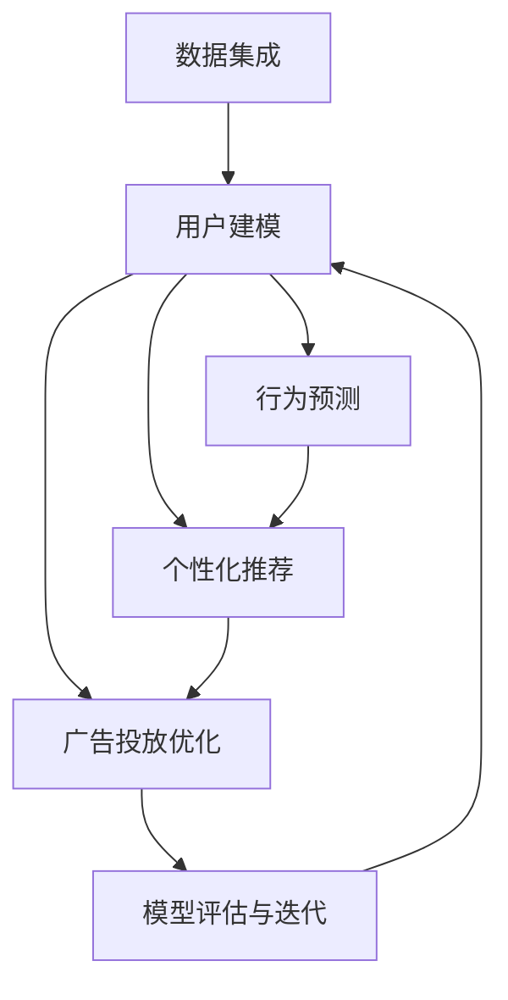

                 

## 1. 背景介绍

### 1.1 问题由来

在现代数字化经济中，用户行为分析已成为企业精细化运营和智能营销的核心手段。传统的用户行为分析方法依赖人工统计和规则匹配，难以实时响应复杂多变的用户需求，且难以捕捉更深层次的用户意图。伴随人工智能技术的迅猛发展，AI驱动的用户行为分析方法迅速崛起，成为推动企业智能化运营的重要引擎。

AI驱动的用户行为分析，通常依赖于数据挖掘、机器学习、自然语言处理等技术，对用户多渠道行为数据进行建模，从中抽取有价值的模式和规律，从而实现更精准的用户画像构建、个性化推荐、广告投放优化等应用。尤其在电商、金融、在线教育等行业，AI驱动的用户行为分析已广泛应用于商品推荐、用户画像、风险控制、客户流失预测等业务场景，显著提升了企业的运营效率和竞争力。

### 1.2 问题核心关键点

AI驱动的用户行为分析技术，主要包括以下几个关键点：

1. **数据集成**：将多渠道、多来源的用户行为数据集成到一个统一的数据平台，包括点击流、购买记录、搜索历史、社交媒体互动等。
2. **用户建模**：通过建模分析用户行为数据，构建用户画像，识别用户的兴趣偏好、行为习惯、决策路径等。
3. **行为预测**：利用历史数据和机器学习算法，预测用户未来行为，如购买倾向、流失风险、广告响应等。
4. **个性化推荐**：根据用户画像和行为预测结果，生成个性化推荐内容，提升用户体验和满意度。
5. **广告投放优化**：通过分析用户行为和兴趣，实现更精准的广告定向和投放策略，提升广告效果和ROI。

这些关键点之间相互关联，共同构成了一个完整、动态的用户行为分析体系。通过深入分析这些关键点，可以更全面地理解AI驱动的用户行为分析方法，把握其实现技术和应用场景。

## 2. 核心概念与联系

### 2.1 核心概念概述

在深入探讨AI驱动的用户行为分析方法之前，首先介绍几个核心概念及其相互联系：

1. **数据集成**：将多渠道、多来源的用户行为数据，集成到一个统一的数据平台，如数据湖、数据仓库等，进行集中管理和分析。
2. **用户建模**：通过分析用户行为数据，构建用户画像，识别用户的兴趣偏好、行为习惯、决策路径等。
3. **行为预测**：利用历史数据和机器学习算法，预测用户未来行为，如购买倾向、流失风险、广告响应等。
4. **个性化推荐**：根据用户画像和行为预测结果，生成个性化推荐内容，提升用户体验和满意度。
5. **广告投放优化**：通过分析用户行为和兴趣，实现更精准的广告定向和投放策略，提升广告效果和ROI。
6. **模型评估与迭代**：通过A/B测试、交叉验证等方法，评估模型性能，不断迭代优化。

这些概念之间的逻辑关系可以通过以下Mermaid流程图来展示：



这个流程图展示了大数据驱动的用户行为分析的关键步骤：

1. 从数据集成开始，收集用户多渠道行为数据。
2. 通过用户建模，分析用户行为数据，构建用户画像。
3. 利用行为预测，对用户未来行为进行预测。
4. 根据用户画像和行为预测结果，生成个性化推荐。
5. 通过广告投放优化，实现更精准的广告定向和投放策略。
6. 不断迭代优化模型，提升性能。

## 3. 核心算法原理 & 具体操作步骤

### 3.1 算法原理概述

AI驱动的用户行为分析，本质上是一个数据驱动、模型驱动的多步骤决策过程。其核心思想是：将用户行为数据作为输入，通过机器学习模型进行建模分析，从中抽取有价值的模式和规律，用于预测用户行为、生成个性化推荐、优化广告投放等。

形式化地，假设用户行为数据为 $D=\{x_1, x_2, ..., x_N\}$，其中 $x_i$ 表示用户在第 $i$ 个行为事件上的特征向量。构建用户画像的模型为 $M_1$，用于行为预测的模型为 $M_2$，用于个性化推荐的模型为 $M_3$，用于广告投放优化的模型为 $M_4$。则整体流程可以表示为：

$$
M_1 = \mathop{\arg\min}_{\theta_1} \mathcal{L}_1(M_1,D)
$$

$$
M_2 = \mathop{\arg\min}_{\theta_2} \mathcal{L}_2(M_2,D)
$$

$$
M_3 = \mathop{\arg\min}_{\theta_3} \mathcal{L}_3(M_3,D')
$$

$$
M_4 = \mathop{\arg\min}_{\theta_4} \mathcal{L}_4(M_4,D')
$$

其中 $\mathcal{L}_i$ 为模型 $M_i$ 在数据集 $D$ 或 $D'$ 上的损失函数，$D'$ 为优化后的数据集。

通过梯度下降等优化算法，各个模型不断更新参数 $\theta_i$，最小化损失函数，最终得到适应用户行为分析的各个模型。由于每个模型的输入输出复杂度不同，选择不同的算法和模型架构，可更好地满足实际需求。

### 3.2 算法步骤详解

AI驱动的用户行为分析，一般包括以下几个关键步骤：

**Step 1: 数据集成与预处理**
- 收集用户多渠道行为数据，包括点击流、购买记录、搜索历史、社交媒体互动等。
- 对数据进行清洗、去重、归一化等预处理，确保数据质量。

**Step 2: 特征工程与用户建模**
- 选择有意义的特征，构建特征向量 $x_i$。
- 利用协同过滤、深度学习、关联规则等方法，对用户行为数据进行建模，构建用户画像。

**Step 3: 行为预测建模**
- 根据历史行为数据，选择合适的模型架构（如线性回归、决策树、神经网络等），构建行为预测模型 $M_2$。
- 利用交叉验证、A/B测试等方法，评估模型性能，优化超参数。

**Step 4: 个性化推荐建模**
- 根据用户画像和行为预测结果，选择合适的推荐算法（如协同过滤、基于内容的推荐、深度推荐等），构建个性化推荐模型 $M_3$。
- 利用A/B测试、评分卡等方法，评估推荐效果，优化推荐策略。

**Step 5: 广告投放优化建模**
- 根据用户行为和兴趣，选择合适的广告定向和投放策略，构建广告投放优化模型 $M_4$。
- 利用CTR预测、A/B测试等方法，评估广告效果，优化投放策略。

**Step 6: 模型迭代与优化**
- 利用模型评估结果，不断迭代优化模型。
- 定期更新模型参数，保持模型性能稳定。

### 3.3 算法优缺点

AI驱动的用户行为分析，具有以下优点：

1. **高效性**：基于数据驱动的方法，能够快速分析用户行为，生成个性化的推荐和广告定向。
2. **精准性**：通过复杂的模型架构和算法，能够更准确地预测用户行为，提升广告效果和用户体验。
3. **自动化**：通过机器学习算法，能够自动抽取用户行为模式，减少人工干预，提升运营效率。

同时，该方法也存在一些局限性：

1. **数据依赖性**：模型性能高度依赖于数据质量，数据偏差可能影响模型效果。
2. **模型复杂度**：复杂的模型架构和算法，需要较高的计算资源和专业技能。
3. **隐私风险**：用户行为数据可能涉及隐私，如何保障数据安全是一个重要问题。
4. **可解释性不足**：复杂模型难以解释其内部工作机制，缺乏透明性。

尽管存在这些局限性，但就目前而言，AI驱动的用户行为分析方法仍然是主流。未来相关研究将更侧重于提升模型的可解释性、降低计算资源消耗、强化数据隐私保护等方向。

### 3.4 算法应用领域

AI驱动的用户行为分析，在电商、金融、在线教育等多个行业领域得到了广泛应用，具体如下：

- **电商行业**：通过用户行为分析，实现个性化推荐、商品搜索优化、广告投放优化等，提升用户转化率和购物体验。
- **金融行业**：利用用户行为分析，进行风险评估、客户流失预测、金融产品推荐等，提升客户满意度和金融安全。
- **在线教育**：通过用户行为分析，实现课程推荐、学习路径优化、用户行为干预等，提升学习效果和用户留存率。

除了这些经典应用外，AI驱动的用户行为分析技术还被创新性地应用到更多场景中，如智能客服、智能家居、智能城市等，为各行各业带来了全新的变革。

## 4. 数学模型和公式 & 详细讲解 & 举例说明

### 4.1 数学模型构建

在用户行为分析中，通常采用协同过滤、深度学习、矩阵分解等方法构建模型，通过用户行为数据和物品特征，进行行为预测和个性化推荐。

以协同过滤为例，假设用户行为数据为矩阵 $U \times I$，其中 $U$ 为用户数，$I$ 为物品数。设用户 $i$ 对物品 $j$ 的评分向量为 $r_i$，构建协同过滤模型的目标函数为：

$$
\min_{\theta} \| \hat{r}_i - r_i \|^2
$$

其中 $\hat{r}_i$ 为模型预测的评分向量，$\theta$ 为模型参数。

### 4.2 公式推导过程

以下是协同过滤模型的推导过程：

设用户 $i$ 对物品 $j$ 的实际评分向量为 $r_i$，模型预测的评分向量为 $\hat{r}_i$。则模型的预测误差可以表示为：

$$
\epsilon_i = \| \hat{r}_i - r_i \|
$$

通过最小二乘法，可以得到最优的预测评分向量 $\hat{r}_i$：

$$
\hat{r}_i = \arg\min_{\hat{r}_i} \| \hat{r}_i - r_i \|^2
$$

进一步展开，可以得到：

$$
\hat{r}_i = \arg\min_{\hat{r}_i} \sum_{j=1}^I (\hat{r}_{ij} - r_{ij})^2
$$

其中 $\hat{r}_{ij}$ 为模型预测的用户 $i$ 对物品 $j$ 的评分。

利用矩阵分解，可以将 $\hat{r}_{ij}$ 表示为：

$$
\hat{r}_{ij} = u_i^T V_j
$$

其中 $u_i$ 为用户的潜在特征向量，$V_j$ 为物品的潜在特征向量，$\theta = (u_i, V_j)$。

代入上述公式，得到协同过滤模型的目标函数：

$$
\min_{\theta} \sum_{i=1}^U \sum_{j=1}^I (\hat{r}_{ij} - r_{ij})^2
$$

通过梯度下降等优化算法，最小化目标函数，得到最优的参数 $\theta$。

### 4.3 案例分析与讲解

以电商行业的个性化推荐系统为例，分析协同过滤模型的实际应用。

假设一个电商网站有 $10,000$ 个用户和 $100,000$ 个商品。每个用户对每个商品的评分范围在 $0$ 到 $5$ 之间，实际评分矩阵 $R$ 为 $10,000 \times 100,000$。

首先，将 $R$ 矩阵进行归一化处理，得到归一化评分矩阵 $\tilde{R}$。然后，将 $\tilde{R}$ 矩阵分解为用户潜在特征矩阵 $U$ 和物品潜在特征矩阵 $V$，其中 $U$ 和 $V$ 的维度分别为 $10,000 \times 50$ 和 $100,000 \times 50$。

利用矩阵乘法，计算模型预测的评分矩阵 $\tilde{R}_U \times \tilde{R}_V^T$。最后，根据预测评分向量，生成个性化推荐列表，展示给用户。

通过协同过滤模型，可以实现高效、精准的个性化推荐，提升用户满意度和转化率。但需要注意的是，协同过滤模型高度依赖于数据的完整性和准确性，数据的偏差和噪声可能影响模型的效果。

## 5. 项目实践：代码实例和详细解释说明

### 5.1 开发环境搭建

在进行用户行为分析项目实践前，我们需要准备好开发环境。以下是使用Python进行TensorFlow开发的环境配置流程：

1. 安装Anaconda：从官网下载并安装Anaconda，用于创建独立的Python环境。

2. 创建并激活虚拟环境：
```bash
conda create -n tf-env python=3.8 
conda activate tf-env
```

3. 安装TensorFlow：根据CUDA版本，从官网获取对应的安装命令。例如：
```bash
conda install tensorflow==2.4 -c tf -c conda-forge
```

4. 安装TensorFlow Addons：
```bash
pip install tensorflow-addons
```

5. 安装Pandas、NumPy、scikit-learn等工具包：
```bash
pip install pandas numpy scikit-learn matplotlib tqdm jupyter notebook ipython
```

完成上述步骤后，即可在`tf-env`环境中开始用户行为分析项目实践。

### 5.2 源代码详细实现

下面我们以电商行业个性化推荐系统为例，给出使用TensorFlow实现协同过滤模型的Python代码实现。

首先，定义协同过滤模型类：

```python
import tensorflow as tf
import numpy as np

class CollaborativeFiltering:
    def __init__(self, num_users, num_items, num_factors=50):
        self.num_users = num_users
        self.num_items = num_items
        self.num_factors = num_factors
        self.user_factors = None
        self.item_factors = None
        self.user_bias = None
        self.item_bias = None
        
    def build_model(self):
        # 定义用户潜在特征矩阵U和物品潜在特征矩阵V
        self.user_factors = tf.Variable(tf.random.normal([self.num_users, self.num_factors]))
        self.item_factors = tf.Variable(tf.random.normal([self.num_items, self.num_factors]))
        self.user_bias = tf.Variable(tf.zeros([self.num_users]))
        self.item_bias = tf.Variable(tf.zeros([self.num_items]))
        
    def predict(self, user_id, item_id):
        # 计算预测评分
        user_embedding = tf.matmul(tf.expand_dims(self.user_factors[user_id], 0), self.item_factors)
        user_bias = tf.reduce_sum(tf.multiply(self.user_factors[user_id], self.user_bias))
        item_bias = tf.reduce_sum(tf.multiply(self.item_factors[item_id], self.item_bias))
        prediction = user_bias + item_bias + user_embedding
        
        return prediction
        
    def train(self, data, learning_rate=0.01, epochs=100):
        # 定义损失函数和优化器
        loss_fn = tf.keras.losses.MeanSquaredError()
        optimizer = tf.keras.optimizers.Adam(learning_rate=learning_rate)
        
        # 迭代训练
        for epoch in range(epochs):
            total_loss = 0
            for user_id, item_id, rating in data:
                prediction = self.predict(user_id, item_id)
                loss = loss_fn(tf.constant(rating), prediction)
                optimizer.apply_gradients(zip(tf.gradients(loss, [self.user_factors, self.item_factors, self.user_bias, self.item_bias]), [self.user_factors, self.item_factors, self.user_bias, self.item_bias])
                total_loss += loss.numpy()
            print(f"Epoch {epoch+1}, loss: {total_loss/len(data)}")
```

然后，定义数据集：

```python
# 生成随机数据
num_users = 1000
num_items = 1000
num_ratings = 10000

data = []
for user_id in range(num_users):
    for item_id in range(num_items):
        rating = np.random.normal(4, 1)
        data.append((user_id, item_id, rating))

# 将数据转换为TensorFlow数据集
dataset = tf.data.Dataset.from_tensor_slices(data).batch(32)
```

最后，启动训练流程并预测：

```python
# 实例化模型
model = CollaborativeFiltering(num_users, num_items, num_factors=50)
model.build_model()

# 训练模型
model.train(dataset, epochs=10)

# 预测推荐
user_id = 0
item_id = 0
recommendation = model.predict(user_id, item_id)
print(f"User {user_id} recommends item {item_id} with score {recommendation}")
```

以上就是使用TensorFlow实现协同过滤模型的完整代码实现。可以看到，通过简单的几行代码，即可构建并训练出一个基本的协同过滤模型。

### 5.3 代码解读与分析

让我们再详细解读一下关键代码的实现细节：

**CollaborativeFiltering类**：
- `__init__`方法：初始化模型参数。
- `build_model`方法：构建模型架构。
- `predict`方法：计算预测评分。
- `train`方法：训练模型。

**数据集定义**：
- 首先定义用户和物品数量，以及随机生成 $num_ratings$ 条评分数据。
- 将评分数据转换为TensorFlow数据集，用于模型训练。

**模型训练**：
- 实例化模型，构建模型架构。
- 定义损失函数和优化器，通过迭代训练最小化损失函数。
- 每个epoch打印总损失，以便评估训练效果。

**预测推荐**：
- 在训练完成后，使用预测函数计算用户对物品的推荐评分，并打印结果。

可以看到，TensorFlow提供了强大的框架支持，使得用户行为分析模型的构建和训练变得非常简洁高效。开发者可以通过丰富的API，快速实现各种复杂的模型和算法。

当然，工业级的系统实现还需考虑更多因素，如模型的保存和部署、超参数的自动搜索、多模型集成等。但核心的用户行为分析方法基本与此类似。

## 6. 实际应用场景

### 6.1 智能推荐系统

智能推荐系统是AI驱动用户行为分析的重要应用之一，广泛应用于电商、视频、音乐等行业。通过分析用户历史行为数据，智能推荐系统能够为用户推荐感兴趣的物品，提升用户体验和满意度。

例如，在电商网站中，智能推荐系统可以分析用户的浏览历史、购买记录、搜索关键词等数据，生成个性化推荐列表，展示给用户。用户可以查看推荐物品的评分、价格、评论等信息，进行综合决策。通过不断的交互和反馈，系统能够不断优化推荐算法，提升推荐效果。

### 6.2 客户流失预测

客户流失预测是金融、电信等行业的重要应用之一。通过分析用户的消费行为、投诉记录、服务质量等数据，智能预测系统能够识别出潜在的流失客户，采取相应的挽留措施，提高客户留存率。

例如，在电信公司中，智能预测系统可以分析用户的通话时长、通话频率、套餐类型等数据，预测出流失风险较高的用户。公司可以针对这些用户，提供专属套餐、优惠活动等，提升用户体验，降低流失率。

### 6.3 广告投放优化

广告投放优化是互联网广告行业的重要应用之一。通过分析用户的搜索历史、浏览记录、点击行为等数据，智能投放系统能够实现更精准的广告定向和投放策略，提升广告效果和ROI。

例如，在在线广告平台中，智能投放系统可以分析用户的搜索关键词、浏览记录、点击行为等数据，预测出潜在的目标用户。平台可以根据用户特征和行为，进行精准的广告定向，提高广告转化率和点击率。同时，系统还可以通过A/B测试、点击率预测等方法，不断优化广告投放策略。

### 6.4 未来应用展望

随着AI技术的不断演进，基于用户行为分析的应用场景将进一步扩展。未来，AI驱动的用户行为分析技术可能在更多领域得到应用，为传统行业带来深远影响。

例如，在医疗领域，通过分析病人的历史诊疗记录、生活习惯、社交信息等数据，智能系统能够预测出病人的疾病风险，提供个性化的健康管理方案。在教育领域，通过分析学生的学习行为、成绩、兴趣爱好等数据，智能系统能够提供个性化的学习推荐和辅导，提升学习效果。

同时，AI驱动的用户行为分析技术也将与IoT、区块链、5G等新技术进行深度融合，推动智慧城市、智慧医疗、智慧交通等领域的发展。通过采集、分析和利用用户行为数据，AI技术将更好地赋能各行各业，提升社会治理和公共服务的智能化水平。

## 7. 工具和资源推荐
### 7.1 学习资源推荐

为了帮助开发者系统掌握AI驱动的用户行为分析方法，这里推荐一些优质的学习资源：

1. 《Python数据科学手册》：由Jake VanderPlas所著，系统介绍了Python数据科学工具和库，包括NumPy、Pandas、TensorFlow等，适合初学者入门。

2. 《机器学习实战》：由Peter Harrington所著，详细介绍了机器学习算法的实现和应用，涵盖协同过滤、深度学习等经典方法。

3. 《深度学习》课程：由吴恩达教授在Coursera开设的深度学习课程，包括线性回归、神经网络、卷积神经网络等基本概念和算法。

4. TensorFlow官方文档：TensorFlow的官方文档，提供了丰富的API和使用案例，适合进阶学习。

5. PyTorch官方文档：PyTorch的官方文档，提供了详细的API文档和示例代码，适合深度学习初学者。

通过对这些资源的学习实践，相信你一定能够快速掌握AI驱动的用户行为分析方法，并用于解决实际的业务问题。

### 7.2 开发工具推荐

高效的开发离不开优秀的工具支持。以下是几款用于用户行为分析开发的常用工具：

1. TensorFlow：由Google主导开发的开源深度学习框架，生产部署方便，适合大规模工程应用。

2. PyTorch：由Facebook主导开发的开源深度学习框架，灵活高效，适合研究性开发。

3. Apache Spark：开源大数据处理框架，能够高效处理大规模数据，适合分布式计算。

4. Apache Hadoop：开源大数据处理框架，支持分布式存储和计算，适合海量数据的处理。

5. Elasticsearch：开源搜索引擎，支持实时索引和查询，适合文本数据的快速检索。

合理利用这些工具，可以显著提升用户行为分析的开发效率，加快创新迭代的步伐。

### 7.3 相关论文推荐

用户行为分析技术的发展源于学界的持续研究。以下是几篇奠基性的相关论文，推荐阅读：

1. Implicit Collaborative Filtering Using Matrix Factorization: 提出了基于矩阵分解的协同过滤算法，用于推荐系统，是协同过滤领域的经典之作。

2. Neural Collaborative Filtering: 将深度学习引入协同过滤模型中，提升了推荐系统的效果和泛化能力。

3. Cross-Net: 提出了一种基于卷积神经网络的协同过滤算法，用于推荐系统，提升了推荐系统的表示能力和性能。

4. Deep Attention Network for Recommender System: 提出了一种基于深度注意力网络的推荐算法，用于推荐系统，提升了推荐系统的表示能力和性能。

5. Multi-Task Feature Learning for Recommendation System: 提出了一种多任务特征学习方法，用于推荐系统，提升了推荐系统的效果和泛化能力。

这些论文代表了大数据驱动用户行为分析方法的发展脉络。通过学习这些前沿成果，可以帮助研究者把握学科前进方向，激发更多的创新灵感。

## 8. 总结：未来发展趋势与挑战

### 8.1 总结

本文对AI驱动的用户行为分析方法进行了全面系统的介绍。首先阐述了用户行为分析在现代数字化经济中的重要地位，明确了数据驱动、模型驱动的用户行为分析技术的关键点。其次，从原理到实践，详细讲解了协同过滤、深度学习等核心算法的实现细节，给出了用户行为分析项目的完整代码实例。同时，本文还广泛探讨了AI驱动的用户行为分析方法在智能推荐、客户流失预测、广告投放优化等业务场景中的应用前景，展示了其在电商、金融、在线教育等多个行业中的广泛应用。

通过对这些关键点的梳理，可以看到，AI驱动的用户行为分析方法在数据驱动、模型驱动、业务驱动等方面形成了闭环，能够高效、精准地分析用户行为，生成个性化的推荐、预测和优化策略。未来，伴随着算力成本的下降和数据规模的扩张，AI驱动的用户行为分析技术必将在更多领域得到应用，为各行各业带来颠覆性的变革。

### 8.2 未来发展趋势

展望未来，AI驱动的用户行为分析技术将呈现以下几个发展趋势：

1. **智能化程度提升**：伴随深度学习、强化学习等技术的不断演进，AI驱动的用户行为分析将更加智能化、自适应。通过不断的学习和优化，系统能够更好地理解和预测用户行为。

2. **跨领域融合**：AI驱动的用户行为分析将与其他AI技术如自然语言处理、计算机视觉、语音识别等进行深度融合，实现多模态数据的协同建模，提升系统的综合性能。

3. **实时化、个性化**：伴随边缘计算、IoT等技术的不断发展，AI驱动的用户行为分析将更加实时、个性化。通过实时分析用户行为数据，系统能够及时响应用户需求，提供个性化推荐和服务。

4. **多场景应用**：AI驱动的用户行为分析技术将在更多场景中得到应用，如智慧医疗、智慧城市、智能制造等，推动各行各业的数字化转型。

5. **隐私保护和伦理**：伴随数据隐私和安全问题的日益突出，AI驱动的用户行为分析技术将更加注重隐私保护和伦理问题。通过数据匿名化、差分隐私等技术，确保用户数据的隐私和安全。

### 8.3 面临的挑战

尽管AI驱动的用户行为分析技术已经取得了瞩目成就，但在迈向更加智能化、普适化应用的过程中，它仍面临着诸多挑战：

1. **数据依赖性**：模型性能高度依赖于数据质量，数据偏差和噪声可能影响模型效果。如何获取高质量、多渠道的数据，是一个重要问题。

2. **计算资源消耗**：复杂模型需要大量计算资源，训练和推理过程可能面临硬件瓶颈。如何优化模型结构，降低计算资源消耗，是一个重要的研究方向。

3. **隐私保护**：用户行为数据涉及隐私，如何保障数据安全，防止数据泄露和滥用，是一个重要问题。

4. **模型可解释性**：复杂模型难以解释其内部工作机制，缺乏透明性。如何提高模型的可解释性，是一个重要的研究方向。

5. **伦理和合规性**：AI驱动的用户行为分析技术可能带来偏见和歧视，如何确保算法的公平性和透明性，是一个重要的研究方向。

### 8.4 研究展望

面对AI驱动的用户行为分析所面临的种种挑战，未来的研究需要在以下几个方面寻求新的突破：

1. **数据高效采集与处理**：开发高效的数据采集和处理工具，降低数据获取成本，提升数据质量。

2. **模型高效压缩与优化**：研究高效模型压缩与优化技术，降低计算资源消耗，提升模型效率。

3. **跨模态数据融合**：研究跨模态数据的融合方法，提升多模态数据的协同建模能力。

4. **隐私保护与伦理**：研究隐私保护和伦理约束技术，确保用户数据的安全性和公平性。

5. **模型可解释性**：研究可解释性技术，提高模型的透明性和可解释性，确保算法的公平性和透明性。

6. **多领域应用**：研究AI驱动的用户行为分析技术在更多领域的应用，推动各行各业的智能化转型。

这些研究方向的探索，必将引领AI驱动的用户行为分析技术迈向更高的台阶，为构建安全、可靠、可解释、可控的智能系统铺平道路。面向未来，AI驱动的用户行为分析技术还需要与其他AI技术进行更深入的融合，如知识表示、因果推理、强化学习等，多路径协同发力，共同推动自然语言理解和智能交互系统的进步。只有勇于创新、敢于突破，才能不断拓展用户行为分析的边界，让智能技术更好地造福人类社会。

## 9. 附录：常见问题与解答

**Q1：如何处理缺失数据？**

A: 处理缺失数据的方法主要有两种：
1. 删除缺失数据：如果数据量较大，缺失数据的比例不高，可以直接删除缺失数据，不影响模型效果。
2. 填充缺失数据：如果缺失数据的比例较高，可以使用均值、中位数、插值等方法填充缺失数据，但需要谨慎处理，避免引入噪声。

**Q2：如何选择特征？**

A: 特征选择的方法主要有以下几种：
1. 统计特征：通过统计方法选择具有代表性的特征，如平均值、标准差等。
2. 卡方检验：通过卡方检验选择与目标变量相关的特征。
3. 信息增益：通过信息增益选择对目标变量预测效果较好的特征。
4. L1正则化：通过L1正则化选择具有重要意义的特征，即具有非零系数的特征。

**Q3：如何评估模型效果？**

A: 评估模型效果的方法主要有以下几种：
1. 均方误差：评估预测值与真实值之间的差异。
2. 交叉验证：通过交叉验证评估模型在不同数据集上的表现，防止过拟合。
3. A/B测试：通过A/B测试评估模型的实际效果，比较不同模型的性能。
4. ROC曲线：通过ROC曲线评估二分类模型的性能。

**Q4：如何优化模型？**

A: 优化模型的方法主要有以下几种：
1. 调整超参数：通过网格搜索、随机搜索等方法，寻找最优的超参数组合。
2. 数据增强：通过数据增强方法，扩充训练数据，提高模型泛化能力。
3. 正则化：通过L1、L2正则化等方法，防止过拟合。
4. 模型集成：通过模型集成方法，组合多个模型，提升整体性能。

通过不断优化模型，可以提高AI驱动的用户行为分析的效果和性能，更好地服务实际业务。

