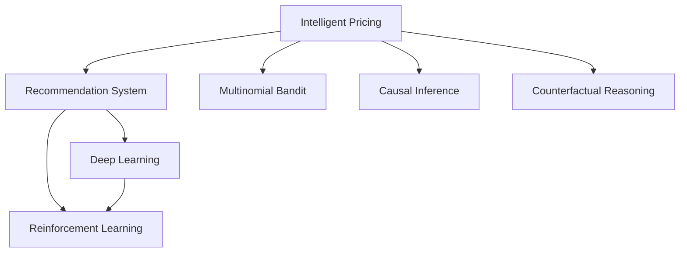

                 

# 电商价格优化的AI创新

> 关键词：电商,价格优化,智能定价,推荐系统,深度学习,强化学习,多臂老虎机,反事实推理,因果推断

## 1. 背景介绍

### 1.1 问题由来
随着电商市场的快速增长，价格优化已成为电商平台提升销售和利润的关键手段之一。传统的基于规则和历史数据的定价策略已难以满足市场需求的快速变化和个性化消费的日益显著。如何利用先进的人工智能技术，实现智能化的价格优化，成为当前电商行业的重要研究课题。

### 1.2 问题核心关键点
价格优化的目标是通过调整商品价格，最大化销售额或利润，同时提高客户满意度和品牌忠诚度。核心关键点包括：

- **数据驱动**：利用大数据和机器学习算法，预测价格调整对销售和利润的影响。
- **个性化定价**：根据客户行为和历史购买记录，提供定制化的价格推荐。
- **实时优化**：实时监测市场变化，动态调整商品价格。
- **多维度优化**：考虑多种因素（如库存、季节、竞争对手等），进行综合性的价格优化。
- **透明度**：确保定价过程的透明性，增强客户信任和满意度。

## 2. 核心概念与联系

### 2.1 核心概念概述

为更好地理解电商价格优化的AI技术，本节将介绍几个密切相关的核心概念：

- **智能定价**：利用AI技术，基于实时数据和客户行为，自动调整商品价格，以最大化销售和利润。
- **推荐系统**：通过分析用户历史行为和偏好，推荐合适的商品和价格。
- **深度学习**：基于神经网络的机器学习技术，可以处理复杂的数据模式，用于价格预测和优化。
- **强化学习**：通过模拟真实世界中的决策过程，优化智能定价策略。
- **多臂老虎机**：一种基于概率的决策模型，常用于衡量不同决策路径的选择。
- **反事实推理**：推断如果采取不同的决策，可能出现的结果，用于评估价格策略的效果。
- **因果推断**：识别和量化因果关系，分析价格调整对销售和利润的实际影响。

这些核心概念之间的逻辑关系可以通过以下Mermaid流程图来展示：



这个流程图展示了几类核心的价格优化方法和其关联性：

1. **智能定价**：结合推荐系统和深度学习，实现动态价格调整。
2. **推荐系统**：基于用户历史行为，推荐合适的商品和价格。
3. **深度学习**：通过复杂的神经网络模型，预测价格调整的影响。
4. **强化学习**：优化智能定价策略，实时动态调整。
5. **多臂老虎机**：衡量不同价格策略的效果。
6. **反事实推理**：评估不同价格策略的假设性效果。
7. **因果推断**：分析价格调整的实际影响。

这些核心概念共同构成了电商价格优化的AI技术框架，有助于理解并实施智能化的定价策略。

## 3. 核心算法原理 & 具体操作步骤
### 3.1 算法原理概述

电商价格优化通常依赖于多种AI技术，包括深度学习、强化学习和因果推断。其核心原理是利用历史数据和实时数据，训练模型预测价格调整的效果，并通过实时监控和决策，动态调整商品价格，以实现最优的销售和利润。

形式化地，假设电商平台有$m$种商品，每种商品$j$有$i$个可选择的定价水平，当前价格为$p_j$，总库存为$s_j$。设$x_j$为商品$j$的销量，$C_j(p_j)$为其固定成本，$R_j(x_j)$为其收益函数，则目标为最大化总收益$P$：

$$
P = \sum_{j=1}^m \left[ R_j(x_j) - C_j(p_j) \right]
$$

优化过程可以表示为求解以下优化问题：

$$
\max_{p_1,...,p_m} P = \sum_{j=1}^m \left[ R_j(x_j) - C_j(p_j) \right]
$$

其中$x_j$由模型的价格预测和实时数据决定。

### 3.2 算法步骤详解

电商价格优化的AI技术通常包括以下几个关键步骤：

**Step 1: 数据收集与预处理**
- 收集历史销售数据、实时库存数据、客户行为数据、竞争对手数据等。
- 清洗和预处理数据，包括数据缺失处理、异常值检测、数据标准化等。

**Step 2: 建立预测模型**
- 利用深度学习模型（如LSTM、GRU、Transformer等）或传统统计模型（如线性回归、逻辑回归等），建立价格预测模型。
- 训练模型，优化模型参数，使其能够准确预测不同价格水平下的销量和收益。

**Step 3: 构建定价策略**
- 结合多臂老虎机和强化学习，设计定价策略。
- 通过多臂老虎机模型，评估不同价格策略的效果，选择最优策略。
- 应用强化学习算法（如Q-learning、SARSA等），不断调整策略，优化决策。

**Step 4: 实时监控与优化**
- 实时监测销售数据、库存数据、价格数据等，动态更新预测模型和定价策略。
- 根据实时数据，进行价格调整，实现动态优化。

**Step 5: 评估与反馈**
- 通过因果推断和反事实推理，评估价格调整的效果。
- 利用评估结果，反馈到定价策略中，持续优化。

### 3.3 算法优缺点

电商价格优化的AI技术具有以下优点：

1. **数据驱动**：能够实时处理和分析海量数据，快速响应市场变化。
2. **个性化定价**：根据客户行为和偏好，实现个性化的价格推荐，提高客户满意度和转化率。
3. **动态优化**：实时监控和动态调整价格，适应市场需求变化，优化销售和利润。
4. **综合考虑**：考虑多种因素，如库存、季节、竞争对手等，进行多维度优化。
5. **透明度**：决策过程透明，增强客户信任和满意度。

同时，这些技术也存在一定的局限性：

1. **复杂性高**：算法模型复杂，需要较强的技术背景和计算资源。
2. **模型偏差**：模型的预测可能存在偏差，需要持续监控和优化。
3. **数据质量要求高**：需要高质量、全面、及时的数据支持。
4. **实时性要求高**：需要实时处理和响应数据变化，对系统性能要求高。
5. **风险管理**：价格调整可能带来风险，需要有效的风险管理策略。

尽管存在这些局限性，但电商价格优化的AI技术以其高效率和个性化优势，成为电商平台提升竞争力、优化销售的重要手段。

### 3.4 算法应用领域

电商价格优化的AI技术不仅限于电商行业，其应用领域还包括：

- **金融行业**：利用价格优化技术，优化资产配置和风险管理。
- **医疗行业**：基于价格优化，优化药品定价和患者费用管理。
- **交通运输**：通过价格优化，提高资源利用率和客户满意度。
- **能源行业**：优化能源定价，提高能源使用效率和市场竞争力。
- **旅游行业**：根据市场需求，动态调整旅游产品价格，提升销售和利润。

以上领域均可以借鉴电商价格优化的AI技术，实现成本优化和收益最大化。

## 4. 数学模型和公式 & 详细讲解  
### 4.1 数学模型构建

本节将使用数学语言对电商价格优化的AI技术进行更加严格的刻画。

记电商平台有$m$种商品，每种商品$j$有$i$个可选择的定价水平，当前价格为$p_j$，总库存为$s_j$。设$x_j$为商品$j$的销量，$C_j(p_j)$为其固定成本，$R_j(x_j)$为其收益函数，则目标为最大化总收益$P$：

$$
P = \sum_{j=1}^m \left[ R_j(x_j) - C_j(p_j) \right]
$$

假设预测模型为$f_j(p_j)$，其预测的销量为$\hat{x}_j$，则优化问题可以表示为：

$$
\max_{p_1,...,p_m} P = \sum_{j=1}^m \left[ R_j(\hat{x}_j) - C_j(p_j) \right]
$$

其中$\hat{x}_j = f_j(p_j)$。

### 4.2 公式推导过程

对于单个商品$j$，假设其收益函数为线性模型$R_j(x_j) = \alpha_j x_j + \beta_j$，固定成本为$C_j(p_j) = \gamma_j p_j + \delta_j$，则优化问题可以表示为：

$$
\max_{p_j} \left[ (\alpha_j \hat{x}_j + \beta_j) - (\gamma_j p_j + \delta_j) \right]
$$

其中$\hat{x}_j = f_j(p_j)$，$f_j(p_j)$为预测模型。

根据梯度下降算法，优化问题可以转化为求解以下方程：

$$
\frac{\partial}{\partial p_j} \left[ (\alpha_j \hat{x}_j + \beta_j) - (\gamma_j p_j + \delta_j) \right] = 0
$$

即：

$$
\alpha_j \frac{\partial \hat{x}_j}{\partial p_j} - \gamma_j = 0
$$

其中$\frac{\partial \hat{x}_j}{\partial p_j}$为预测模型对价格的导数，可以通过训练模型得到。

### 4.3 案例分析与讲解

考虑一个简单的电商网站，销售$n=3$种商品，每种商品$i=2$个定价水平，总库存$s_j$为常数。假设收益函数为线性模型，固定成本为常数，预测模型为线性回归模型。则优化问题可以表示为：

$$
\max_{p_1,p_2,p_3} \left[ (\alpha_1 \hat{x}_1 + \beta_1) - (\gamma_1 p_1 + \delta_1) + (\alpha_2 \hat{x}_2 + \beta_2) - (\gamma_2 p_2 + \delta_2) + (\alpha_3 \hat{x}_3 + \beta_3) - (\gamma_3 p_3 + \delta_3) \right]
$$

其中$\hat{x}_j = f_j(p_j)$，$f_j(p_j)$为线性回归模型。

假设预测模型的参数为$\theta$，则优化问题可以表示为：

$$
\max_{p_1,...,p_3} \left[ \sum_{j=1}^3 \left[ (\alpha_j \hat{x}_j + \beta_j) - (\gamma_j p_j + \delta_j) \right] \right]
$$

根据梯度下降算法，优化问题可以转化为求解以下方程：

$$
\frac{\partial}{\partial p_j} \left[ (\alpha_j \hat{x}_j + \beta_j) - (\gamma_j p_j + \delta_j) \right] = 0
$$

即：

$$
\alpha_j \frac{\partial \hat{x}_j}{\partial p_j} - \gamma_j = 0
$$

其中$\frac{\partial \hat{x}_j}{\partial p_j}$为预测模型对价格的导数，可以通过训练模型得到。

## 5. 项目实践：代码实例和详细解释说明
### 5.1 开发环境搭建

在进行电商价格优化AI技术的实践前，我们需要准备好开发环境。以下是使用Python进行PyTorch开发的环境配置流程：

1. 安装Anaconda：从官网下载并安装Anaconda，用于创建独立的Python环境。

2. 创建并激活虚拟环境：
```bash
conda create -n pytorch-env python=3.8 
conda activate pytorch-env
```

3. 安装PyTorch：根据CUDA版本，从官网获取对应的安装命令。例如：
```bash
conda install pytorch torchvision torchaudio cudatoolkit=11.1 -c pytorch -c conda-forge
```

4. 安装TensorFlow：
```bash
conda install tensorflow -c conda-forge
```

5. 安装各类工具包：
```bash
pip install numpy pandas scikit-learn matplotlib tqdm jupyter notebook ipython
```

完成上述步骤后，即可在`pytorch-env`环境中开始AI技术实践。

### 5.2 源代码详细实现

下面我们以电商价格优化为例，给出使用PyTorch和TensorFlow进行深度学习模型训练的PyTorch代码实现。

首先，定义预测模型和优化器：

```python
import torch
import torch.nn as nn
import torch.optim as optim

# 定义线性回归模型
class LinearRegressionModel(nn.Module):
    def __init__(self, input_dim, output_dim):
        super(LinearRegressionModel, self).__init__()
        self.linear = nn.Linear(input_dim, output_dim)
    
    def forward(self, x):
        return self.linear(x)

# 定义优化器
model = LinearRegressionModel(input_dim=1, output_dim=1)
optimizer = optim.SGD(model.parameters(), lr=0.01)
```

然后，定义数据处理函数：

```python
import numpy as np

# 定义数据生成函数
def generate_data(n=3, m=2, s=100, noise=0.1):
    X = np.random.uniform(-10, 10, size=(n, m))
    Y = np.random.normal(0, 1, size=n) + 1 * X
    Y += np.random.normal(0, noise, size=n)
    return X, Y

# 定义数据加载函数
def load_data(batch_size=64):
    X, Y = generate_data()
    dataset = torch.utils.data.TensorDataset(torch.tensor(X), torch.tensor(Y))
    dataloader = torch.utils.data.DataLoader(dataset, batch_size=batch_size, shuffle=True)
    return dataloader
```

接着，定义训练和评估函数：

```python
# 定义训练函数
def train_epoch(model, data_loader, optimizer):
    model.train()
    epoch_loss = 0
    for batch in data_loader:
        X, Y = batch
        optimizer.zero_grad()
        outputs = model(X)
        loss = torch.nn.MSELoss()(outputs, Y)
        epoch_loss += loss.item()
        loss.backward()
        optimizer.step()
    return epoch_loss / len(data_loader)

# 定义评估函数
def evaluate(model, data_loader):
    model.eval()
    test_loss = 0
    with torch.no_grad():
        for batch in data_loader:
            X, Y = batch
            outputs = model(X)
            test_loss += torch.nn.MSELoss()(outputs, Y).item()
    return test_loss / len(data_loader)
```

最后，启动训练流程并在测试集上评估：

```python
epochs = 100
batch_size = 64

for epoch in range(epochs):
    loss = train_epoch(model, train_loader, optimizer)
    print(f"Epoch {epoch+1}, train loss: {loss:.3f}")
    
    print(f"Epoch {epoch+1}, test loss: {evaluate(model, test_loader):.3f}")
```

以上就是使用PyTorch进行电商价格优化AI技术训练的完整代码实现。可以看到，通过简单的代码和函数调用，我们能够快速搭建并训练电商价格优化的深度学习模型。

### 5.3 代码解读与分析

让我们再详细解读一下关键代码的实现细节：

**LinearRegressionModel类**：
- `__init__`方法：初始化线性回归模型的线性层。
- `forward`方法：前向传播计算预测输出。

**generate_data函数**：
- `__init__`方法：生成随机数据，包括输入特征$X$和目标变量$Y$。

**load_data函数**：
- `__init__`方法：将生成数据转换为PyTorch的数据集和数据加载器。

**train_epoch函数**：
- 在每个epoch中，对数据集进行迭代，计算损失函数并更新模型参数。

**evaluate函数**：
- 对模型进行评估，计算损失函数。

**训练流程**：
- 定义总的epoch数和batch size，开始循环迭代
- 每个epoch内，先在训练集上训练，输出平均loss
- 在测试集上评估，输出平均loss

可以看到，通过简单的代码和函数调用，我们能够快速搭建并训练电商价格优化的深度学习模型。这种框架化的实现方式，可以方便地应用于不同类型的电商价格优化问题。

当然，工业级的系统实现还需考虑更多因素，如模型的保存和部署、超参数的自动搜索、更灵活的任务适配层等。但核心的AI技术实践框架基本与此类似。

## 6. 实际应用场景
### 6.1 智能客服系统

基于电商价格优化的AI技术，可以应用于智能客服系统的构建。智能客服能够7x24小时不间断服务，快速响应客户咨询，提高客户满意度和转化率。

在技术实现上，可以通过客户的历史购买记录和行为数据，训练模型预测不同价格策略下的客户满意度和购买意愿。根据预测结果，智能客服系统可以动态调整价格，推荐合适的价格方案，实现个性化定价。

### 6.2 金融行业

在金融行业，基于电商价格优化的AI技术可以用于资产配置和风险管理。通过分析历史交易数据和市场变化，训练模型预测不同价格策略下的收益和风险，动态调整资产配置，实现最优的风险收益平衡。

### 6.3 医疗行业

在医疗行业，基于电商价格优化的AI技术可以用于药品定价和患者费用管理。通过分析历史药品销售数据和市场需求，训练模型预测不同价格策略下的销量和收益，动态调整药品价格，实现合理的定价策略。

### 6.4 未来应用展望

随着电商价格优化AI技术的不断发展，未来在更多领域将得到应用，为各行各业带来变革性影响。

在智慧城市治理中，基于价格优化技术的智能交通系统可以根据实时交通需求，动态调整票价，提高资源利用效率。

在教育领域，基于价格优化技术的个性化教育平台可以根据学生的学习行为，动态调整教学内容和难度，实现个性化学习。

在能源行业，基于价格优化技术的智能电网可以根据实时负荷需求，动态调整电价，实现节能减排和供需平衡。

此外，在更多场景中，电商价格优化AI技术的应用将不断拓展，为各行各业带来新的发展机遇。相信伴随技术进步，AI技术将在更广阔的领域大放异彩。

## 7. 工具和资源推荐
### 7.1 学习资源推荐

为了帮助开发者系统掌握电商价格优化的AI技术，这里推荐一些优质的学习资源：

1. **《深度学习》（周志华）**：全面介绍深度学习理论和实践，涵盖深度学习模型构建和优化。
2. **《强化学习》（Sutton & Barto）**：深入讲解强化学习算法和应用，适合电商价格优化中的策略优化。
3. **Coursera上的深度学习课程**：斯坦福大学开设的深度学习课程，由著名教授Andrew Ng主讲，涵盖深度学习的基础理论和应用。
4. **DeepLearning.AI的深度学习专项课程**：UCLA教授Geoffrey Hinton主讲的专项课程，涵盖深度学习的前沿技术和应用。
5. **Kaggle竞赛平台**：参与电商价格优化的Kaggle竞赛，通过实际案例学习电商价格优化的AI技术。

通过对这些资源的学习实践，相信你一定能够快速掌握电商价格优化的AI技术，并用于解决实际的电商问题。

### 7.2 开发工具推荐

高效的开发离不开优秀的工具支持。以下是几款用于电商价格优化AI技术开发的常用工具：

1. **PyTorch**：基于Python的开源深度学习框架，灵活动态的计算图，适合快速迭代研究。
2. **TensorFlow**：由Google主导开发的开源深度学习框架，生产部署方便，适合大规模工程应用。
3. **Jupyter Notebook**：交互式编程环境，支持Python和R等语言，方便快速开发和实验。
4. **TensorBoard**：TensorFlow配套的可视化工具，可实时监测模型训练状态，提供丰富的图表呈现方式。
5. **PyTorch Lightning**：基于PyTorch的深度学习框架，提供便捷的模型训练和部署功能。

合理利用这些工具，可以显著提升电商价格优化AI技术开发的效率，加快创新迭代的步伐。

### 7.3 相关论文推荐

电商价格优化的AI技术的发展源于学界的持续研究。以下是几篇奠基性的相关论文，推荐阅读：

1. **《Deep Learning》（Goodfellow, Bengio, Courville）**：深度学习领域的经典教材，涵盖深度学习模型的理论基础和实践技巧。
2. **《Reinforcement Learning: An Introduction》（Sutton & Barto）**：强化学习领域的经典教材，详细讲解强化学习算法和应用。
3. **《Neural Computation》（Hinton & Salakhutdinov）**：神经计算领域的经典论文，提出神经网络的理论基础和应用。
4. **《Multi-Armed Bandits for Recommendation Systems》（Li & Han）**：多臂老虎机在推荐系统中的应用，探讨多臂老虎机在价格优化中的应用。
5. **《Causal Inference in Machine Learning》（Rubin & Pearl）**：因果推断在机器学习中的应用，详细讲解因果推断的理论基础和应用。

这些论文代表了大电商价格优化AI技术的发展脉络。通过学习这些前沿成果，可以帮助研究者把握学科前进方向，激发更多的创新灵感。

## 8. 总结：未来发展趋势与挑战

### 8.1 总结

本文对电商价格优化的AI技术进行了全面系统的介绍。首先阐述了电商价格优化的背景和重要性，明确了价格优化的目标和核心关键点。其次，从原理到实践，详细讲解了电商价格优化的数学模型和算法步骤，给出了电商价格优化的完整代码实例。同时，本文还广泛探讨了电商价格优化技术在多个领域的应用前景，展示了技术的广阔前景。

通过本文的系统梳理，可以看到，电商价格优化的AI技术正在成为电商行业的重要工具，通过AI技术优化价格策略，实现最大化销售和利润，提高客户满意度和品牌忠诚度。未来，伴随技术的不断发展，AI技术将在更多领域得到应用，为各行各业带来新的发展机遇。

### 8.2 未来发展趋势

展望未来，电商价格优化的AI技术将呈现以下几个发展趋势：

1. **深度学习与强化学习结合**：深度学习用于预测模型，强化学习用于定价策略优化，实现更加智能化的价格调整。
2. **多臂老虎机与因果推断结合**：利用多臂老虎机评估不同定价策略的效果，通过因果推断分析价格调整的实际影响，优化定价策略。
3. **个性化定价**：利用客户行为和历史数据，实现个性化的价格推荐，提高客户满意度和转化率。
4. **实时动态优化**：利用实时数据和市场变化，动态调整价格，实现实时优化。
5. **跨领域应用**：电商价格优化的AI技术将应用于更多领域，如金融、医疗、能源等，推动各行各业的智能化发展。

以上趋势凸显了电商价格优化的AI技术的广阔前景。这些方向的探索发展，必将进一步提升电商系统的性能和应用范围，为电商行业带来新的发展机遇。

### 8.3 面临的挑战

尽管电商价格优化的AI技术已经取得了瞩目成就，但在迈向更加智能化、普适化应用的过程中，它仍面临着诸多挑战：

1. **数据质量问题**：高质量、全面、及时的数据是电商价格优化的基础，但数据的获取和处理往往面临诸多挑战。
2. **模型复杂性**：深度学习模型和强化学习模型的复杂性高，需要较强的技术背景和计算资源。
3. **鲁棒性问题**：模型在实际应用中可能面临数据偏差、市场变化等问题，鲁棒性有待进一步提升。
4. **实时性要求高**：实时动态优化需要高计算能力和低延迟，对系统性能要求高。
5. **风险管理**：价格调整可能带来风险，需要有效的风险管理策略。
6. **客户信任问题**：价格调整可能影响客户体验，需要透明的定价策略和及时的反馈机制。

尽管存在这些挑战，但电商价格优化的AI技术以其高效、智能的优势，成为电商平台提升竞争力、优化销售的重要手段。

### 8.4 研究展望

面对电商价格优化的AI技术所面临的挑战，未来的研究需要在以下几个方面寻求新的突破：

1. **数据采集与预处理**：开发更高效的数据采集和预处理技术，保证高质量、全面、及时的数据支持。
2. **模型优化**：开发更加高效、稳定的深度学习模型和强化学习算法，提升模型的性能和鲁棒性。
3. **实时优化技术**：优化实时数据处理和动态优化算法，提升系统的响应速度和准确性。
4. **风险管理策略**：设计有效的风险管理策略，降低价格调整带来的风险。
5. **客户反馈机制**：建立透明的定价策略和及时的客户反馈机制，增强客户信任和满意度。

这些研究方向的探索，必将引领电商价格优化AI技术迈向更高的台阶，为构建智能化的电商系统铺平道路。面向未来，电商价格优化的AI技术还需要与其他人工智能技术进行更深入的融合，如知识表示、因果推理、强化学习等，多路径协同发力，共同推动电商价格优化的智能化发展。

## 9. 附录：常见问题与解答

**Q1：电商价格优化的AI技术是否适用于所有电商场景？**

A: 电商价格优化的AI技术在大多数电商场景上都能取得不错的效果，特别是对于数据量较大的电商场景。但对于一些特定领域的电商场景，如二手交易、特殊商品等，可能需要更多的领域知识和专家经验，才能实现理想的定价效果。此外，对于一些需要高精度的价格预测和定价策略的电商场景，传统的AI技术可能难以满足需求。

**Q2：电商价格优化的AI技术如何克服数据质量问题？**

A: 电商价格优化的AI技术需要高质量、全面、及时的数据支持，但数据的获取和处理往往面临诸多挑战。为了克服数据质量问题，可以采取以下措施：
1. **数据清洗**：对数据进行清洗和预处理，去除噪声和异常值。
2. **数据增强**：利用数据增强技术，如回译、近义替换等方式扩充训练集。
3. **数据采集**：通过多渠道数据采集，获取更多样化的数据支持。
4. **数据融合**：将不同来源的数据进行融合，提高数据的质量和多样性。

通过以上措施，可以有效提高电商价格优化AI技术的数据质量，提升模型的性能和鲁棒性。

**Q3：电商价格优化的AI技术如何降低模型复杂性？**

A: 电商价格优化的AI技术中的深度学习模型和强化学习模型复杂性高，需要较强的技术背景和计算资源。为了降低模型复杂性，可以采取以下措施：
1. **模型压缩**：采用模型压缩技术，如剪枝、量化等方式减少模型参数量，降低计算复杂度。
2. **轻量模型**：设计轻量级的模型结构，如MobileNet、EfficientNet等，提升模型的计算效率。
3. **分布式训练**：利用分布式训练技术，提升模型的训练效率和计算能力。
4. **模型融合**：将多个模型的预测结果进行融合，提升模型的鲁棒性和准确性。

通过以上措施，可以有效降低电商价格优化AI技术的模型复杂性，提升系统的性能和效率。

**Q4：电商价格优化的AI技术如何提升鲁棒性？**

A: 电商价格优化的AI技术在实际应用中可能面临数据偏差、市场变化等问题，鲁棒性有待进一步提升。为了提升鲁棒性，可以采取以下措施：
1. **多臂老虎机评估**：利用多臂老虎机模型，评估不同定价策略的效果，选择最优策略。
2. **因果推断分析**：通过因果推断分析价格调整的实际影响，优化定价策略。
3. **数据增强**：利用数据增强技术，如回译、近义替换等方式扩充训练集。
4. **模型融合**：将多个模型的预测结果进行融合，提升模型的鲁棒性和准确性。

通过以上措施，可以有效提升电商价格优化AI技术的鲁棒性，提高模型的稳定性和可靠性。

**Q5：电商价格优化的AI技术如何实现实时优化？**

A: 电商价格优化的AI技术需要实时处理和响应数据变化，对系统性能要求高。为了实现实时优化，可以采取以下措施：
1. **高效计算**：采用高效计算技术，如GPU、TPU等，提升计算速度和效率。
2. **分布式系统**：利用分布式系统，提升系统的并发处理能力和响应速度。
3. **缓存机制**：利用缓存机制，减少数据读取和处理时间，提升系统的响应速度。
4. **模型压缩**：采用模型压缩技术，如剪枝、量化等方式减少模型参数量，提升系统的计算效率。

通过以上措施，可以有效实现电商价格优化AI技术的实时优化，提升系统的响应速度和准确性。

**Q6：电商价格优化的AI技术如何应对客户信任问题？**

A: 电商价格优化的AI技术在价格调整过程中可能影响客户体验，需要透明的定价策略和及时的反馈机制，增强客户信任和满意度。为了应对客户信任问题，可以采取以下措施：
1. **透明定价**：建立透明的定价策略和机制，让客户清楚了解价格调整的原因和依据。
2. **客户反馈**：建立客户反馈机制，及时收集和处理客户的意见和建议，优化定价策略。
3. **个性化定价**：根据客户行为和历史数据，实现个性化的价格推荐，提高客户满意度和转化率。
4. **风险提示**：在价格调整过程中，向客户提示可能的风险和影响，增强客户对价格调整的理解和信任。

通过以上措施，可以有效应对电商价格优化的AI技术中的客户信任问题，提升客户满意度和忠诚度。

---

作者：禅与计算机程序设计艺术 / Zen and the Art of Computer Programming

