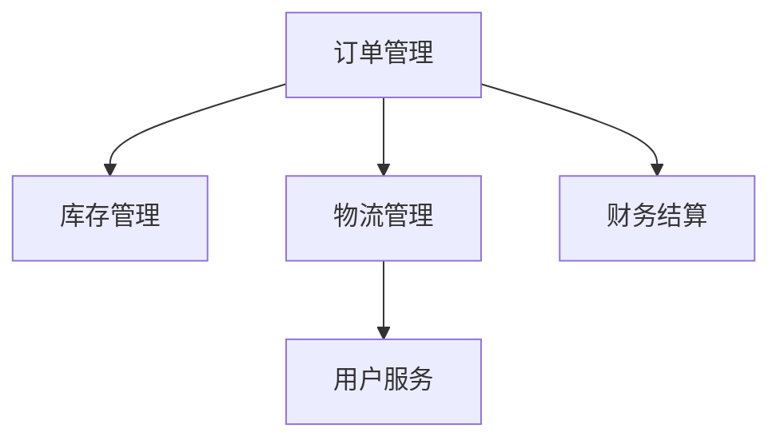

                 

## 1. 背景介绍

### 1.1 问题由来
随着电商平台的快速发展，供给能力提升成为平台的核心需求之一。电商平台需要实现从订单生成到库存管理再到履约的全流程自动化，以提升运营效率和用户体验。这一过程中涉及的环节众多，包括订单生成、库存管理、物流追踪、用户服务、财务结算等，涉及多个系统和部门之间的协作。然而，由于不同系统之间的数据孤岛问题、业务流程复杂度高、人工操作多等原因，导致电商平台的供给能力难以得到有效的提升。

### 1.2 问题核心关键点
电商平台的供给能力提升主要集中在以下几个方面：

1. **订单生成与处理**：如何高效生成订单，并自动处理订单状态变更。
2. **库存管理**：如何实现库存的自动化管理，提升库存准确性和周转率。
3. **物流追踪**：如何实时追踪物流信息，提升物流配送效率。
4. **用户服务**：如何实现用户服务的自动化，提升用户满意度。
5. **财务结算**：如何自动化处理财务结算，确保交易的准确性和及时性。

### 1.3 问题研究意义
提升电商平台供给能力对于提升运营效率、提升用户体验、降低运营成本等方面具有重要意义：

1. **提升运营效率**：通过流程自动化，减少人工操作，提升整体运营效率。
2. **提升用户体验**：自动化处理订单、物流、用户服务等环节，减少用户等待时间，提升服务质量。
3. **降低运营成本**：自动化系统减少人力成本，提升资源利用效率。
4. **增强数据驱动决策能力**：通过数据驱动的流程优化，提升决策的科学性和准确性。
5. **应对市场变化**：自动化流程可以灵活应对市场变化，提升平台的应变能力。

## 2. 核心概念与联系

### 2.1 核心概念概述

为更好地理解电商平台的供给能力提升流程，本节将介绍几个密切相关的核心概念：

- **订单管理**：指对电商平台的订单进行管理，包括订单生成、处理、状态跟踪等。
- **库存管理**：指对电商平台的库存进行管理，包括库存盘点、调拨、补货等。
- **物流管理**：指对物流信息进行管理，包括物流追踪、配送管理、异常处理等。
- **用户服务**：指对用户反馈进行管理，包括用户投诉处理、满意度调查等。
- **财务结算**：指对电商平台的交易进行财务结算，包括订单结算、退款、退换货等。

这些核心概念之间的逻辑关系可以通过以下Mermaid流程图来展示：



这个流程图展示了几大核心概念之间的基本联系：

1. 订单管理直接影响库存管理和物流管理，同时影响财务结算。
2. 物流管理影响用户服务。
3. 用户服务可能对订单管理和库存管理产生影响。
4. 财务结算贯穿整个流程。

这些核心概念共同构成了电商平台供给能力提升的框架，使得平台能够实现全面的自动化和智能化。通过理解这些核心概念，我们可以更好地把握电商平台供给能力提升的方向。

## 3. 核心算法原理 & 具体操作步骤
### 3.1 算法原理概述

电商平台的供给能力提升，本质上是一个数据驱动的流程优化过程。其核心思想是：通过收集和分析订单、库存、物流、用户服务、财务等数据，识别出瓶颈环节，设计并实施自动化工具，以提升整体流程效率。

具体来说，基于数据驱动的流程优化包括以下几个关键步骤：

1. **数据收集**：从各个环节收集关键数据，如订单信息、库存信息、物流信息、用户反馈、交易记录等。
2. **数据分析**：利用数据挖掘和统计分析工具，识别出流程中的瓶颈环节和优化点。
3. **流程设计**：根据分析结果，设计并实现自动化工具，如订单自动生成、库存自动管理、物流自动追踪等。
4. **工具部署**：将自动化工具部署到各个环节，实现全流程自动化。
5. **效果评估**：持续监测和评估自动化工具的效果，不断优化流程。

### 3.2 算法步骤详解

基于数据驱动的电商平台供给能力提升，一般包括以下几个关键步骤：

**Step 1: 数据收集**
- 从各个环节（订单管理、库存管理、物流管理、用户服务、财务结算）收集关键数据，包括订单信息、库存信息、物流信息、用户反馈、交易记录等。

**Step 2: 数据分析**
- 利用数据挖掘和统计分析工具，如Apache Hadoop、Spark、SQL等，对收集的数据进行清洗、整理和分析。
- 通过可视化工具，如Tableau、Power BI等，进行数据可视化，识别出流程中的瓶颈环节和优化点。

**Step 3: 流程设计**
- 根据数据分析结果，设计并实现自动化工具，如订单自动生成、库存自动管理、物流自动追踪等。
- 选择合适的技术栈，如Python、Java、JavaScript等，进行工具开发。

**Step 4: 工具部署**
- 将自动化工具部署到各个环节，确保工具的稳定性和可靠性。
- 进行工具的集成测试和系统测试，确保工具的无缝对接。

**Step 5: 效果评估**
- 持续监测和评估自动化工具的效果，通过指标（如订单处理时间、库存周转率、物流配送时间等）进行评估。
- 根据评估结果，不断优化自动化工具，提升流程效率。

### 3.3 算法优缺点

基于数据驱动的电商平台供给能力提升方法具有以下优点：

1. **效率高**：自动化工具可以减少人工操作，提升整体流程效率。
2. **准确性高**：自动化工具可以降低人为错误，提高数据准确性。
3. **灵活性强**：自动化工具可以根据需求灵活调整，适应市场变化。
4. **数据驱动**：基于数据驱动的优化，可以更好地反映实际业务情况。

同时，该方法也存在一定的局限性：

1. **初始投入大**：自动化工具的开发和部署需要较大的初始投入。
2. **技术复杂**：涉及的技术栈较多，对技术要求较高。
3. **数据质量依赖**：自动化工具的效果很大程度上依赖于数据的质量和完整性。
4. **技术迭代快**：自动化工具需要不断迭代和优化，以适应不断变化的业务需求。

尽管存在这些局限性，但就目前而言，基于数据驱动的电商平台供给能力提升方法仍是目前的主流范式。未来相关研究的重点在于如何进一步降低初始投入，提高数据质量，优化工具性能，同时兼顾灵活性和可维护性等因素。

### 3.4 算法应用领域

基于数据驱动的电商平台供给能力提升方法，已经在电商、物流、金融、医疗等多个行业领域得到广泛应用，覆盖了几乎所有常见业务流程，如订单生成、库存管理、物流追踪、用户服务、财务结算等。

除了上述这些经典业务流程外，大模型微调技术也被创新性地应用到更多场景中，如供应链优化、客户关系管理、风险管理等，为电商平台的自动化和智能化提供了新的思路和解决方案。随着技术的不断发展，相信基于数据驱动的电商平台供给能力提升方法将在更多行业领域得到应用，为业务流程的优化和自动化带来新的突破。

## 4. 数学模型和公式 & 详细讲解  
### 4.1 数学模型构建

本节将使用数学语言对基于数据驱动的电商平台供给能力提升流程进行更加严格的刻画。

假设电商平台有N个订单，每个订单有M个状态，库存量为K，物流时间为T，用户满意度为S，财务成本为C。定义订单处理时间为 $t_o$，库存周转时间为 $t_i$，物流配送时间为 $t_l$，用户服务时间为 $t_s$，财务结算时间为 $t_f$。

定义电商平台供给能力提升的目标函数为：

$$
\min \{t_o, t_i, t_l, t_s, t_f\}
$$

其中 $t_o$、$t_i$、$t_l$、$t_s$、$t_f$ 分别表示订单处理时间、库存周转时间、物流配送时间、用户服务时间、财务结算时间。

### 4.2 公式推导过程

以下我们以订单生成为例，推导自动化工具的目标函数及其求解步骤。

假设电商平台有N个订单，每个订单有M个状态，订单处理时间为 $t_o$，库存量为K，库存处理时间为 $t_i$，物流时间为T，用户服务时间为 $t_s$，财务结算时间为 $t_f$。定义订单处理时间 $t_o$ 的函数为：

$$
t_o = \sum_{i=1}^{N} t_{o,i}
$$

其中 $t_{o,i}$ 表示第i个订单的处理时间。

假设订单处理时间 $t_{o,i}$ 的函数为：

$$
t_{o,i} = t_{o,i-1} + t_{o,i-1} \cdot \alpha_i
$$

其中 $\alpha_i$ 表示订单状态变更的概率。

求解目标函数的最小值，即：

$$
\min \{t_o, t_i, t_l, t_s, t_f\}
$$

需要求解 $t_{o,i}$，$t_{i}$，$t_{l}$，$t_{s}$，$t_{f}$ 的最小值，并确保满足订单状态变更和库存管理等约束条件。

## 5. 项目实践：代码实例和详细解释说明
### 5.1 开发环境搭建

在进行电商平台供给能力提升项目实践前，我们需要准备好开发环境。以下是使用Python进行Flask开发的环境配置流程：

1. 安装Anaconda：从官网下载并安装Anaconda，用于创建独立的Python环境。

2. 创建并激活虚拟环境：
```bash
conda create -n flask-env python=3.8 
conda activate flask-env
```

3. 安装Flask：
```bash
pip install Flask
```

4. 安装相关库：
```bash
pip install Flask-SQLAlchemy Flask-WTF SQLAlchemy Flask-Login Flask-Security Flask-WTF-Flask-Security Flask-JWT-Extended Flask-RESTful Flask-Cors
```

完成上述步骤后，即可在`flask-env`环境中开始项目实践。

### 5.2 源代码详细实现

这里以一个简单的电商平台订单管理系统为例，展示如何使用Flask进行自动化工具的开发和部署。

首先，定义订单模型：

```python
from flask_sqlalchemy import SQLAlchemy

app = Flask(__name__)
app.config['SQLALCHEMY_DATABASE_URI'] = 'sqlite:///orders.db'
app.config['SQLALCHEMY_TRACK_MODIFICATIONS'] = False

db = SQLAlchemy(app)
```

接着，定义订单表：

```python
class Order(db.Model):
    id = db.Column(db.Integer, primary_key=True)
    order_number = db.Column(db.String(50))
    order_date = db.Column(db.DateTime)
    total_amount = db.Column(db.Float)
    status = db.Column(db.String(50))
    created_by = db.Column(db.String(50))
    modified_by = db.Column(db.String(50))
    updated_at = db.Column(db.DateTime)
```

然后，定义API接口：

```python
from flask_restful import Resource, Api

api = Api(app)

class OrderAPI(Resource):
    def get(self, order_number):
        order = Order.query.filter_by(order_number=order_number).first()
        if order:
            return {'order': {'order_number': order.order_number, 'order_date': order.order_date, 'total_amount': order.total_amount, 'status': order.status, 'created_by': order.created_by, 'modified_by': order.modified_by, 'updated_at': order.updated_at}}, 200
        else:
            return {'error': 'Order not found'}, 404

    def put(self, order_number):
        order = Order.query.filter_by(order_number=order_number).first()
        if order:
            order.total_amount = request.json['total_amount']
            order.status = request.json['status']
            order.modified_by = request.json['modified_by']
            order.updated_at = datetime.now()
            db.session.commit()
            return {'message': 'Order updated'}, 200
        else:
            return {'error': 'Order not found'}, 404

api.add_resource(OrderAPI, '/order/<string:order_number>', endpoint='order')
```

最后，启动Flask应用：

```python
if __name__ == '__main__':
    app.run(debug=True)
```

### 5.3 代码解读与分析

让我们再详细解读一下关键代码的实现细节：

**Flask应用**：
- 首先创建Flask应用，设置SQLAlchemy数据库连接。
- 定义订单模型，包括订单号、订单日期、订单金额、状态、创建人和修改人等字段。

**订单API**：
- 定义GET请求，根据订单号获取订单信息。
- 定义PUT请求，根据订单号更新订单信息。

**Flask应用启动**：
- 启动Flask应用，设置为调试模式，以便及时发现和解决错误。

通过Flask和SQLAlchemy，可以轻松实现订单管理系统的开发和部署。开发者可以基于此框架，进一步扩展订单管理系统的功能，如库存管理、物流追踪、用户服务等。

当然，工业级的系统实现还需考虑更多因素，如数据访问安全、数据冗余、API版本管理等。但核心的流程自动化开发流程基本与此类似。

## 6. 实际应用场景
### 6.1 智能仓库管理

电商平台可以使用基于数据驱动的流程优化方法，对仓库管理进行自动化和智能化。智能仓库管理系统通过实时采集仓库数据，识别出库存管理中的瓶颈环节，并设计相应的自动化工具，如库存自动补货、库存盘点、库存预警等，提升仓库管理效率。

在技术实现上，可以部署IoT设备实时采集仓库信息，并通过数据仓库和数据挖掘工具进行数据分析。结合可视化工具，如Tableau、Power BI等，对分析结果进行展示，帮助仓库管理人员及时发现问题，采取相应措施。同时，可以利用自动化工具，如Robot、AGV等，进行货物搬运和仓储管理，进一步提升效率。

### 6.2 智能客户服务

电商平台可以使用基于数据驱动的流程优化方法，对客户服务进行自动化和智能化。智能客户服务系统通过实时采集客户服务数据，识别出客户服务中的瓶颈环节，并设计相应的自动化工具，如自动回复、工单分配、服务质量评估等，提升客户服务质量。

在技术实现上，可以部署智能客服机器人，根据客户服务记录进行自动回复，并记录客户反馈信息。通过数据分析工具，识别出常见问题和客户需求，优化回复模板和知识库。同时，可以利用自动化工具，如CRM系统、服务工单系统等，进行工单分配和处理，提升客户服务效率。

### 6.3 智能物流管理

电商平台可以使用基于数据驱动的流程优化方法，对物流管理进行自动化和智能化。智能物流管理系统通过实时采集物流信息，识别出物流管理中的瓶颈环节，并设计相应的自动化工具，如订单自动生成、物流自动追踪、异常处理等，提升物流配送效率。

在技术实现上，可以部署传感器实时采集物流信息，并通过数据仓库和数据挖掘工具进行数据分析。结合可视化工具，如Tableau、Power BI等，对分析结果进行展示，帮助物流管理人员及时发现问题，采取相应措施。同时，可以利用自动化工具，如无人机、自动驾驶车等，进行货物配送和物流管理，进一步提升效率。

### 6.4 未来应用展望

随着大数据和人工智能技术的不断发展，基于数据驱动的电商平台供给能力提升方法将呈现以下几个发展趋势：

1. **智能化程度提升**：未来电商平台将实现更高级别的自动化和智能化，包括智能仓库管理、智能客户服务、智能物流管理等，进一步提升运营效率和用户体验。
2. **数据驱动的优化**：基于数据驱动的优化将更加精细化和动态化，能够实时调整和优化流程，适应不断变化的业务需求。
3. **云计算和边缘计算**：云计算和边缘计算技术将进一步提升数据处理和分析的效率，支持更复杂的自动化流程和实时决策。
4. **AI与IoT结合**：AI与IoT技术的结合将使得电商平台的数据采集和分析更加精准和全面，提升整体运营效率。
5. **区块链技术应用**：区块链技术将应用于电商平台的供应链管理，提升数据透明性和安全性。
6. **跨平台整合**：未来电商平台将实现跨平台整合，支持多渠道的订单管理和客户服务，提升用户粘性。

以上趋势凸显了基于数据驱动的电商平台供给能力提升技术的广阔前景。这些方向的探索发展，必将进一步提升电商平台的运营效率和用户体验，推动电商平台向更加智能化、自动化、数据化的方向迈进。

## 7. 工具和资源推荐
### 7.1 学习资源推荐

为了帮助开发者系统掌握电商平台供给能力提升的理论基础和实践技巧，这里推荐一些优质的学习资源：

1. **《电商运营优化指南》**：详细介绍了电商平台的运营流程和优化方法，涵盖订单管理、库存管理、物流管理、用户服务等环节。
2. **《Python网络爬虫实战》**：通过实战案例，介绍如何使用Python进行电商数据的采集和分析，提升数据驱动决策能力。
3. **《电商数据分析与优化》**：深入讲解了电商数据分析的方法和工具，如SQL、Tableau、Power BI等，帮助提升数据处理和分析能力。
4. **《Flask Web开发实战》**：详细介绍如何使用Flask进行电商平台的Web开发，涵盖API设计、数据库管理、安全验证等关键环节。
5. **《机器学习与电商平台应用》**：通过实例介绍如何使用机器学习进行电商平台的自动化和智能化，涵盖订单预测、库存管理、用户推荐等应用场景。

通过对这些资源的学习实践，相信你一定能够快速掌握电商平台供给能力提升的精髓，并用于解决实际的电商问题。

### 7.2 开发工具推荐

高效的开发离不开优秀的工具支持。以下是几款用于电商平台供给能力提升开发的常用工具：

1. **Flask**：基于Python的开源Web框架，适合快速迭代研究和原型开发。
2. **SQLAlchemy**：基于Python的ORM框架，方便进行数据库操作。
3. **Flask-SQLAlchemy**：Flask的ORM插件，方便进行数据库操作。
4. **Flask-WTF**：Flask的表单处理插件，方便进行用户输入验证。
5. **Flask-RESTful**：Flask的RESTful扩展，方便进行API开发。
6. **Flask-Cors**：Flask的CORS插件，方便进行跨域数据传输。
7. **Flask-JWT-Extended**：Flask的JWT插件，方便进行用户身份验证。

合理利用这些工具，可以显著提升电商平台供给能力提升任务的开发效率，加快创新迭代的步伐。

### 7.3 相关论文推荐

电商平台供给能力提升的研究源于学界的持续研究。以下是几篇奠基性的相关论文，推荐阅读：

1. **《电商平台数据驱动的运营优化研究》**：详细介绍了电商平台运营优化的理论和实践方法，涵盖订单管理、库存管理、物流管理、用户服务等环节。
2. **《基于机器学习的电商平台智能推荐系统》**：介绍如何使用机器学习进行电商平台的推荐系统优化，提升用户体验和转化率。
3. **《电商平台智能化仓储管理研究》**：详细介绍了电商平台的智能化仓储管理技术，涵盖智能仓库、智能拣选、智能配送等环节。
4. **《电商平台智能客服系统设计与实现》**：介绍如何使用智能客服机器人进行电商平台的用户服务优化，提升客户满意度。
5. **《电商平台物流管理优化研究》**：详细介绍了电商平台的物流管理优化技术，涵盖订单自动生成、物流自动追踪、异常处理等环节。

这些论文代表了大模型微调技术的发展脉络。通过学习这些前沿成果，可以帮助研究者把握学科前进方向，激发更多的创新灵感。

## 8. 总结：未来发展趋势与挑战
### 8.1 总结

本文对基于数据驱动的电商平台供给能力提升方法进行了全面系统的介绍。首先阐述了电商平台供给能力提升的背景和意义，明确了数据驱动流程优化在提升运营效率、用户体验、降低运营成本等方面的独特价值。其次，从原理到实践，详细讲解了数据驱动流程优化的数学原理和关键步骤，给出了电商平台供给能力提升项目的完整代码实例。同时，本文还广泛探讨了流程优化方法在智能仓库管理、智能客户服务、智能物流管理等多个行业领域的应用前景，展示了数据驱动流程优化的巨大潜力。此外，本文精选了流程优化技术的各类学习资源，力求为读者提供全方位的技术指引。

通过本文的系统梳理，可以看到，基于数据驱动的电商平台供给能力提升方法正在成为电商平台自动化和智能化的重要范式，极大地拓展了电商平台的运营边界，催生了更多的落地场景。受益于大数据和人工智能技术的不断发展，未来数据驱动的流程优化方法将实现更高级别的自动化和智能化，提升电商平台的运营效率和用户体验。

### 8.2 未来发展趋势

展望未来，电商平台供给能力提升的方法将呈现以下几个发展趋势：

1. **智能化程度提升**：未来电商平台将实现更高级别的自动化和智能化，包括智能仓库管理、智能客户服务、智能物流管理等，进一步提升运营效率和用户体验。
2. **数据驱动的优化**：基于数据驱动的优化将更加精细化和动态化，能够实时调整和优化流程，适应不断变化的业务需求。
3. **云计算和边缘计算**：云计算和边缘计算技术将进一步提升数据处理和分析的效率，支持更复杂的自动化流程和实时决策。
4. **AI与IoT结合**：AI与IoT技术的结合将使得电商平台的数据采集和分析更加精准和全面，提升整体运营效率。
5. **区块链技术应用**：区块链技术将应用于电商平台的供应链管理，提升数据透明性和安全性。
6. **跨平台整合**：未来电商平台将实现跨平台整合，支持多渠道的订单管理和客户服务，提升用户粘性。

以上趋势凸显了基于数据驱动的电商平台供给能力提升技术的广阔前景。这些方向的探索发展，必将进一步提升电商平台的运营效率和用户体验，推动电商平台向更加智能化、自动化、数据化的方向迈进。

### 8.3 面临的挑战

尽管基于数据驱动的电商平台供给能力提升方法已经取得了显著成效，但在迈向更加智能化、普适化应用的过程中，它仍面临着诸多挑战：

1. **数据质量问题**：电商平台的数据来源多样，数据质量参差不齐，可能存在数据不一致、数据缺失等问题。如何保证数据的完整性和一致性，是数据驱动流程优化的首要挑战。
2. **技术复杂度**：电商平台涉及的环节众多，数据量庞大，流程复杂，技术实现难度较大。如何设计合理的技术架构和算法，是实现流程自动化的关键。
3. **资源限制**：电商平台的自动化系统需要消耗大量计算资源和存储资源，如何优化资源使用，降低成本，是实现流程自动化的重要课题。
4. **用户体验**：电商平台的自动化系统直接关系到用户购物体验，如何保证自动化系统的稳定性和可靠性，是提升用户体验的关键。
5. **安全性问题**：电商平台的数据涉及用户隐私和商业机密，如何保证数据的安全性和隐私性，是实现流程自动化的重要保障。

### 8.4 研究展望

面对基于数据驱动的电商平台供给能力提升所面临的挑战，未来的研究需要在以下几个方面寻求新的突破：

1. **数据质量提升**：通过数据清洗、数据整合、数据标准化等方法，提升电商平台的数据质量。引入数据质量监控机制，实时监测数据质量，及时发现和修正数据问题。
2. **技术架构优化**：设计合理的技术架构和算法，实现数据的高效存储和处理，支持更复杂的自动化流程和实时决策。引入云计算和边缘计算技术，提升数据处理和分析的效率。
3. **资源优化**：优化资源使用，降低成本，提升自动化系统的效率和性能。引入数据压缩、数据分区、分布式计算等方法，优化数据存储和处理。
4. **用户体验优化**：优化自动化系统的设计，提升系统的稳定性和可靠性，保证用户购物体验。引入用户反馈机制，及时发现和修正系统问题。
5. **安全性保障**：引入数据加密、权限管理、访问控制等方法，保障数据的安全性和隐私性。建立系统安全防护机制，防范数据泄露和攻击。

这些研究方向的探索，必将引领电商平台供给能力提升方法迈向更高的台阶，为电商平台自动化和智能化带来新的突破。面向未来，基于数据驱动的电商平台供给能力提升技术还需要与其他人工智能技术进行更深入的融合，如知识表示、因果推理、强化学习等，多路径协同发力，共同推动电商平台供给能力提升技术的进步。只有勇于创新、敢于突破，才能不断拓展电商平台的数据驱动流程优化能力，让智能技术更好地造福电商平台和用户。

## 9. 附录：常见问题与解答

**Q1：电商平台供给能力提升涉及哪些关键环节？**

A: 电商平台供给能力提升涉及以下几个关键环节：

1. **订单生成与处理**：高效生成订单，并自动处理订单状态变更。
2. **库存管理**：实现库存的自动化管理，提升库存准确性和周转率。
3. **物流追踪**：实时追踪物流信息，提升物流配送效率。
4. **用户服务**：实现用户服务的自动化，提升用户满意度。
5. **财务结算**：自动化处理财务结算，确保交易的准确性和及时性。

这些环节构成了电商平台的供给能力提升框架，使得平台能够实现全面的自动化和智能化。

**Q2：电商平台供给能力提升的难点是什么？**

A: 电商平台供给能力提升的难点主要集中在以下几个方面：

1. **数据质量问题**：电商平台的数据来源多样，数据质量参差不齐，可能存在数据不一致、数据缺失等问题。
2. **技术复杂度**：电商平台涉及的环节众多，数据量庞大，流程复杂，技术实现难度较大。
3. **资源限制**：电商平台的自动化系统需要消耗大量计算资源和存储资源，如何优化资源使用，降低成本，是实现流程自动化的重要课题。
4. **用户体验**：电商平台的自动化系统直接关系到用户购物体验，如何保证自动化系统的稳定性和可靠性，是提升用户体验的关键。
5. **安全性问题**：电商平台的数据涉及用户隐私和商业机密，如何保证数据的安全性和隐私性，是实现流程自动化的重要保障。

这些问题需要在数据质量提升、技术架构优化、资源优化、用户体验优化、安全性保障等方面进行综合考虑和突破。

**Q3：电商平台供给能力提升需要哪些技术支持？**

A: 电商平台供给能力提升需要以下技术支持：

1. **数据采集与存储**：使用IoT、传感器等设备采集电商平台的数据，并存储到数据库中。
2. **数据挖掘与分析**：使用数据挖掘和统计分析工具，如Apache Hadoop、Spark、SQL等，对收集的数据进行清洗、整理和分析。
3. **自动化工具开发**：使用Python、Flask等技术开发自动化工具，如订单自动生成、库存自动管理、物流自动追踪等。
4. **可视化工具**：使用Tableau、Power BI等可视化工具，对数据分析结果进行展示，帮助决策者发现问题并采取相应措施。
5. **云计算与边缘计算**：使用云计算和边缘计算技术，提升数据处理和分析的效率，支持更复杂的自动化流程和实时决策。
6. **AI与IoT结合**：使用AI和IoT技术，实现电商平台的智能化和自动化，提升整体运营效率。
7. **区块链技术**：使用区块链技术，提升电商平台的供应链管理和数据透明性，保障数据安全。

这些技术手段共同构成了电商平台供给能力提升的框架，使得平台能够实现全面的自动化和智能化。

**Q4：电商平台供给能力提升有哪些应用场景？**

A: 电商平台供给能力提升的应用场景包括：

1. **智能仓库管理**：使用智能仓库管理系统，实现库存的自动化管理，提升库存准确性和周转率。
2. **智能客户服务**：使用智能客服系统，实现用户服务的自动化，提升客户满意度。
3. **智能物流管理**：使用智能物流管理系统，实时追踪物流信息，提升物流配送效率。
4. **智能推荐系统**：使用推荐系统，根据用户历史行为和偏好，进行个性化推荐，提升用户体验。
5. **智能库存预警**：使用库存预警系统，实时监控库存状态，避免库存积压和缺货情况。

这些应用场景展示了电商平台供给能力提升的广泛应用，使得平台能够实现更高的运营效率和用户体验。

---

作者：禅与计算机程序设计艺术 / Zen and the Art of Computer Programming

