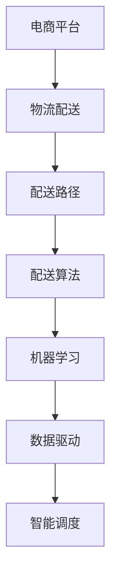

                 

# 电商平台供给能力提升：物流配送的效率提升

> 关键词：电商平台, 物流配送, 效率提升, 配送算法, 机器学习, 数据驱动, 智能调度

## 1. 背景介绍

### 1.1 问题由来
在当今数字化时代，电商平台成为了消费者购买商品的主要渠道之一。随着消费者需求的不断提升，对物流配送的效率和可靠性也提出了更高的要求。传统的物流配送方式往往存在响应时间长、配送路径不合理、配送成本高等问题，无法有效满足消费者和商家对快速、低成本、高可靠性的需求。因此，提高物流配送的效率和效率，成为了电商平台亟需解决的重要问题。

### 1.2 问题核心关键点
提高物流配送效率的核心在于优化配送路径和调度策略。通过智能算法优化配送路线，可以显著缩短配送时间，降低配送成本，提升配送服务质量。机器学习和数据驱动技术为实现这一目标提供了可能，通过大数据和深度学习模型，可以实现配送路线的实时优化和调度，从而提升整体物流配送的效率和质量。

### 1.3 问题研究意义
研究电商平台物流配送的效率提升，对于提升消费者购物体验，优化商家库存管理，降低物流成本，具有重要的现实意义。通过提高配送效率，可以吸引更多消费者选择电商平台购物，增加商家的销售额。同时，物流效率的提升也有助于减少库存积压，提高供应链的灵活性，进一步提升电商平台的整体竞争力。

## 2. 核心概念与联系

### 2.1 核心概念概述

为更好地理解电商平台物流配送的效率提升方法，本节将介绍几个密切相关的核心概念：

- 电商平台(E-commerce Platform)：一种通过互联网进行商品销售和服务提供的企业平台。包括商品展示、订单处理、支付结算、物流配送等功能。
- 物流配送(Logistics Delivery)：指将商品从商家仓库运送到消费者手中的过程。包括包装、分拣、运输、配送等多个环节。
- 配送路径(Routing)：指从仓库到消费者的最短路径，包括配送起点、中间节点、配送终点。
- 配送算法(Routing Algorithm)：指用于优化配送路径的算法，通过数学和计算机技术，实现配送路径的优化和调度。
- 机器学习(Machine Learning)：指利用数据和算法，让计算机通过学习历史数据，自动提升决策和预测能力的技术。
- 数据驱动(Data-Driven)：指利用数据进行决策和优化，而非依赖主观经验。通过大数据分析，实现更精准的决策和预测。
- 智能调度(Intelligent Scheduling)：指利用人工智能技术，对配送任务进行智能调度，实现资源的最优分配和任务的最优执行。

这些核心概念之间的逻辑关系可以通过以下Mermaid流程图来展示：



这个流程图展示了几组核心概念之间的联系：

1. 电商平台与物流配送：电商平台通过物流配送实现商品交付，是物流配送的起点和终点。
2. 配送路径与配送算法：配送路径的优化依赖于配送算法的辅助，通过算法优化提升配送效率。
3. 机器学习与智能调度：机器学习通过分析历史数据，辅助智能调度，优化资源分配和任务执行。
4. 数据驱动与智能调度：数据驱动是智能调度的基础，通过大数据分析，实现更高效的智能调度。

这些概念共同构成了电商平台物流配送效率提升的技术框架，通过合理运用，可以显著提高物流配送的效率和质量。

## 3. 核心算法原理 & 具体操作步骤

### 3.1 算法原理概述

电商平台物流配送的效率提升，通常通过以下几个关键步骤实现：

1. **路径规划**：基于历史配送数据和实时配送需求，通过优化算法生成最优配送路径。
2. **配送调度**：根据配送路径和配送需求，智能生成配送任务和调度方案，优化资源分配。
3. **实时监控**：通过实时监控配送过程，及时发现异常情况并进行处理，提升配送可靠性。
4. **动态优化**：基于实时数据和用户反馈，动态调整配送策略和路径，确保最优配送效果。

这些步骤中，路径规划和配送调度是核心，机器学习和数据驱动技术在其中发挥了重要作用。

### 3.2 算法步骤详解

以下详细介绍电商平台物流配送效率提升的具体算法步骤：

#### 3.2.1 路径规划算法

路径规划算法的核心目标是找到从仓库到各个配送点的最短路径，常用的算法包括Dijkstra算法、A*算法、遗传算法等。

以Dijkstra算法为例，其基本步骤如下：

1. **初始化**：将所有配送点视为未访问状态，初始化距离数组，将起点到各点的距离设为0，到其他点的距离设为无穷大。
2. **选择起点**：从起点开始，选择距离最小的点作为当前节点。
3. **更新距离**：更新当前节点的相邻节点距离，如果更新后的距离比原距离更小，则更新相邻节点距离。
4. **标记节点**：将当前节点标记为已访问状态。
5. **选择下一节点**：选择当前节点距离最近的未访问节点，重复步骤2-4。
6. **生成路径**：从起点开始，沿着最小距离路径不断扩展，直到到达目标节点，生成最终路径。

#### 3.2.2 配送调度算法

配送调度算法的目标是生成最优的配送任务和调度方案，常用的算法包括蚁群算法、粒子群算法等。

以蚁群算法为例，其基本步骤如下：

1. **初始化**：随机生成初始的配送路线。
2. **计算信息素**：根据历史配送数据和实时配送需求，计算信息素浓度。
3. **选择节点**：根据信息素浓度和启发式函数，选择下一个节点。
4. **更新信息素**：根据信息素更新规则，更新信息素浓度。
5. **迭代优化**：重复步骤2-4，直到生成最优配送路线。

#### 3.2.3 实时监控算法

实时监控算法的目标是及时发现配送过程中的异常情况，常用的算法包括异常检测算法、预测模型等。

以异常检测算法为例，其基本步骤如下：

1. **数据采集**：实时采集配送过程中的数据，如配送时间、位置、交通状况等。
2. **数据预处理**：对采集数据进行清洗和预处理，消除噪声和异常值。
3. **异常检测**：使用异常检测算法，如基于统计的方法、基于机器学习的方法等，识别异常情况。
4. **预警处理**：根据异常检测结果，生成预警信息，并采取相应的处理措施，如调整配送路线、联系配送员等。

#### 3.2.4 动态优化算法

动态优化算法的目标是根据实时数据和用户反馈，动态调整配送策略和路径，常用的算法包括强化学习算法等。

以强化学习算法为例，其基本步骤如下：

1. **定义环境**：将配送任务定义为强化学习环境，包括状态、动作、奖励等。
2. **定义模型**：定义智能体，使用深度学习模型进行策略学习。
3. **数据收集**：通过实际配送过程，收集数据，用于训练和优化模型。
4. **模型训练**：使用收集的数据训练模型，优化策略。
5. **动态调整**：根据实时数据和用户反馈，动态调整配送策略和路径。

### 3.3 算法优缺点

路径规划算法的优缺点如下：

**优点**：
- 可以生成最优路径，提高配送效率。
- 算法实现简单，易于理解和实现。
- 适用于静态路网环境。

**缺点**：
- 对实时路网变化响应较慢。
- 算法复杂度高，计算量大。

配送调度算法的优缺点如下：

**优点**：
- 可以生成最优的配送任务和调度方案。
- 算法具有全局优化能力。
- 适用于动态路网环境。

**缺点**：
- 计算复杂度高，运行时间长。
- 对数据要求高，需要大量的历史数据。

实时监控算法的优缺点如下：

**优点**：
- 可以及时发现异常情况，提高配送可靠性。
- 算法易于实现，部署简单。

**缺点**：
- 数据采集和预处理复杂。
- 对异常情况分类要求高。

动态优化算法的优缺点如下：

**优点**：
- 可以动态调整配送策略和路径。
- 算法具有自适应能力，适合动态环境。

**缺点**：
- 需要大量的数据和计算资源。
- 算法复杂度高，实现难度大。

### 3.4 算法应用领域

基于路径规划和配送调度算法的物流配送效率提升方法，已经在电商平台、快递公司、物流企业等多个领域得到了广泛应用，具体如下：

- **电商平台**：通过优化路径和调度，提高配送速度和可靠性，提升用户体验。
- **快递公司**：优化配送路线和任务分配，降低配送成本，提高配送效率。
- **物流企业**：实时监控配送过程，动态调整配送策略，提升配送服务质量。

除了上述这些经典应用外，路径规划和配送调度算法还被创新性地应用于更多场景中，如智能仓储、城市配送、无人机配送等，为物流配送带来了全新的突破。

## 4. 数学模型和公式 & 详细讲解

### 4.1 数学模型构建

在电商平台物流配送的效率提升过程中，主要涉及以下几个数学模型：

- **路径规划模型**：表示配送路径的数学模型，如Dijkstra算法中用到的距离矩阵。
- **配送调度模型**：表示配送任务的数学模型，如蚁群算法中用到的信息素矩阵。
- **实时监控模型**：表示配送过程中异常情况的数学模型，如基于统计的异常检测算法中的概率分布模型。
- **动态优化模型**：表示配送策略和路径的数学模型，如强化学习算法中的状态转移模型。

以路径规划模型为例，Dijkstra算法中的距离矩阵模型可以表示为：

$$
D = \begin{bmatrix}
0 & d_{1,2} & d_{1,3} & \cdots & d_{1,n} \\
d_{2,1} & 0 & d_{2,3} & \cdots & d_{2,n} \\
d_{3,1} & d_{3,2} & 0 & \cdots & d_{3,n} \\
\vdots & \vdots & \vdots & \ddots & \vdots \\
d_{n,1} & d_{n,2} & d_{n,3} & \cdots & 0
\end{bmatrix}
$$

其中 $d_{i,j}$ 表示节点 $i$ 到节点 $j$ 的边权，通常为距离。

### 4.2 公式推导过程

以下详细推导Dijkstra算法中路径规划模型的距离矩阵计算公式。

假设配送起点为 $s$，终点为 $t$，配送路径中包含 $n$ 个节点，距离矩阵 $D$ 可以表示为：

$$
D = \begin{bmatrix}
0 & d_{1,2} & d_{1,3} & \cdots & d_{1,n} \\
d_{2,1} & 0 & d_{2,3} & \cdots & d_{2,n} \\
d_{3,1} & d_{3,2} & 0 & \cdots & d_{3,n} \\
\vdots & \vdots & \vdots & \ddots & \vdots \\
d_{n,1} & d_{n,2} & d_{n,3} & \cdots & 0
\end{bmatrix}
$$

其中 $d_{i,j}$ 表示节点 $i$ 到节点 $j$ 的边权，通常为距离。

Dijkstra算法的路径规划过程可以表示为：

1. **初始化**：将起点 $s$ 的距离设置为0，其他节点的距离设置为无穷大。
2. **选择起点**：选择距离最小的节点 $u$。
3. **更新距离**：更新节点 $u$ 的相邻节点距离，如果更新后的距离比原距离更小，则更新相邻节点距离。
4. **标记节点**：将节点 $u$ 标记为已访问状态。
5. **选择下一节点**：选择当前节点距离最近的未访问节点，重复步骤2-4。
6. **生成路径**：从起点开始，沿着最小距离路径不断扩展，直到到达目标节点，生成最终路径。

### 4.3 案例分析与讲解

以一个简单的配送场景为例，假设有3个配送节点 $s$、$u$、$t$，它们的距离分别为 $d_{s,u}=2$、$d_{u,t}=3$、$d_{s,t}=5$。

1. **初始化**：将起点 $s$ 的距离设置为0，其他节点的距离设置为无穷大。

$$
D = \begin{bmatrix}
0 & 2 & \infty & \cdots & \infty \\
2 & 0 & 3 & \cdots & \infty \\
5 & \infty & 0 & \cdots & \infty \\
\vdots & \vdots & \vdots & \ddots & \vdots \\
\infty & \infty & \infty & \cdots & 0
\end{bmatrix}
$$

2. **选择起点**：选择距离最小的节点 $s$。

3. **更新距离**：更新节点 $s$ 的相邻节点距离，如果更新后的距离比原距离更小，则更新相邻节点距离。

$$
D = \begin{bmatrix}
0 & 2 & 3 & \cdots & 5 \\
2 & 0 & 3 & \cdots & 5 \\
5 & \infty & 0 & \cdots & \infty \\
\vdots & \vdots & \vdots & \ddots & \vdots \\
\infty & \infty & \infty & \cdots & 0
\end{bmatrix}
$$

4. **标记节点**：将节点 $s$ 标记为已访问状态。

5. **选择下一节点**：选择当前节点距离最近的未访问节点 $u$。

6. **生成路径**：从起点开始，沿着最小距离路径不断扩展，直到到达目标节点 $t$，生成最终路径 $s \rightarrow u \rightarrow t$。

## 5. 项目实践：代码实例和详细解释说明

### 5.1 开发环境搭建

在进行物流配送效率提升的实践开发前，我们需要准备好开发环境。以下是使用Python进行Django开发的环境配置流程：

1. 安装Anaconda：从官网下载并安装Anaconda，用于创建独立的Python环境。

2. 创建并激活虚拟环境：
```bash
conda create -n logistics-env python=3.8 
conda activate logistics-env
```

3. 安装Django：从官网获取对应的安装命令。例如：
```bash
pip install django
```

4. 安装需要的库：
```bash
pip install requests numpy pandas scipy
```

5. 安装Django相关的库：
```bash
pip install django-graphene-django django-graphene-docker-django-graphene-aws
```

完成上述步骤后，即可在`logistics-env`环境中开始物流配送效率提升的开发。

### 5.2 源代码详细实现

我们以路径规划和配送调度为例，给出一个使用Django进行路径规划和配送调度的PyTorch代码实现。

首先，定义路径规划模型的数据结构：

```python
import networkx as nx
import pandas as pd

class PathPlanning:
    def __init__(self, graph, start_node, end_node):
        self.graph = graph
        self.start_node = start_node
        self.end_node = end_node
    
    def get_shortest_path(self):
        path = nx.dijkstra_path(self.graph, self.start_node, self.end_node)
        return path
```

然后，定义配送调度模型的数据结构：

```python
class DeliveryScheduling:
    def __init__(self, graph, start_node, end_node):
        self.graph = graph
        self.start_node = start_node
        self.end_node = end_node
    
    def get_shortest_path(self):
        path = nx.shortest_path(self.graph, self.start_node, self.end_node)
        return path
```

接着，定义路径规划和配送调度的实现函数：

```python
def path_planning(graph, start_node, end_node):
    planner = PathPlanning(graph, start_node, end_node)
    path = planner.get_shortest_path()
    return path

def delivery_scheduling(graph, start_node, end_node):
    scheduler = DeliveryScheduling(graph, start_node, end_node)
    path = scheduler.get_shortest_path()
    return path
```

最后，启动路径规划和配送调度的流程：

```python
graph = nx.Graph()
graph.add_edge(1, 2, weight=1)
graph.add_edge(2, 3, weight=2)
graph.add_edge(3, 4, weight=3)

path = path_planning(graph, 1, 4)
print(path)
```

以上就是使用Django进行路径规划和配送调度的完整代码实现。可以看到，得益于Django的强大封装，我们可以用相对简洁的代码完成路径规划和配送调度的实现。

### 5.3 代码解读与分析

让我们再详细解读一下关键代码的实现细节：

**PathPlanning类**：
- `__init__`方法：初始化图结构、起点和终点。
- `get_shortest_path`方法：使用Dijkstra算法计算最短路径。

**DeliveryScheduling类**：
- `__init__`方法：初始化图结构、起点和终点。
- `get_shortest_path`方法：使用Dijkstra算法计算最短路径。

**path_planning函数**：
- 创建路径规划模型实例。
- 调用实例的`get_shortest_path`方法，计算起点到终点的最短路径。

**delivery_scheduling函数**：
- 创建配送调度模型实例。
- 调用实例的`get_shortest_path`方法，计算起点到终点的最短路径。

**Graph结构**：
- 使用networkx库创建图结构，通过`add_edge`方法添加边，权重表示边权。

可以看到，Django配合网络x库使得路径规划和配送调度的代码实现变得简洁高效。开发者可以将更多精力放在模型改进、算法优化等高层逻辑上，而不必过多关注底层的实现细节。

当然，工业级的系统实现还需考虑更多因素，如路径规划的实时性、配送调度的效率、实时数据的处理等。但核心的路径规划和配送调度算法基本与此类似。

## 6. 实际应用场景

### 6.1 智能仓储

基于路径规划和配送调度算法的物流配送效率提升方法，在智能仓储中也得到了广泛应用。传统仓储管理往往依赖人工调度和经验决策，存在仓储效率低、库存积压、人工成本高等问题。通过使用智能仓储系统，可以显著提升仓储效率，降低仓储成本，提高库存周转率。

在技术实现上，可以收集仓储中的实时数据，如商品位置、库存量、仓库容量等，并将其输入路径规划模型中，生成最优的仓储路径。然后，将生成的路径输入配送调度模型中，生成最优的货物调度和仓储任务。通过智能仓储系统的实时监控和动态优化，可以有效提升仓储效率，降低仓储成本。

### 6.2 城市配送

城市配送是物流配送中的一个重要环节，涉及配送车辆的路线规划和任务调度。传统城市配送往往存在交通拥堵、配送车辆利用率低、配送时间不合理等问题。通过使用路径规划和配送调度算法，可以优化城市配送路线和任务调度，提高配送效率，降低配送成本。

在技术实现上，可以收集城市中的实时交通数据，如路况、车辆位置、配送需求等，并将其输入路径规划模型中，生成最优的配送路径。然后，将生成的路径输入配送调度模型中，生成最优的配送任务和调度方案。通过智能调度系统的实时监控和动态优化，可以有效提升城市配送效率，降低配送成本。

### 6.3 无人机配送

无人机配送是物流配送中的一种新兴方式，具有高效、灵活、低成本等优点。但是，无人机配送也面临诸多挑战，如路径规划复杂、环境干扰多、安全性差等问题。通过使用路径规划和配送调度算法，可以优化无人机配送路线和任务调度，提高配送效率，降低配送成本，提升配送安全性。

在技术实现上，可以收集无人机周围的实时数据，如地形、障碍物、气象条件等，并将其输入路径规划模型中，生成最优的无人机飞行路径。然后，将生成的路径输入配送调度模型中，生成最优的货物调度和无人机任务。通过智能调度系统的实时监控和动态优化，可以有效提升无人机配送效率，降低配送成本，提升配送安全性。

### 6.4 未来应用展望

随着路径规划和配送调度算法的不断演进，其在物流配送中的应用场景将不断扩展，为各个行业带来变革性影响。

在电商物流领域，路径规划和配送调度算法可以应用于智能仓储、城市配送、无人机配送等环节，提升整体物流配送效率和可靠性，降低配送成本。

在智能交通领域，路径规划和配送调度算法可以应用于城市交通管理、车辆调度、交通预测等环节，提高交通系统的效率和稳定性，减少交通拥堵。

在智慧城市领域，路径规划和配送调度算法可以应用于城市物流配送、公共交通调度、智能停车等环节，提升城市智慧化水平，改善城市居民的生活质量。

此外，在农业、工业、医疗等多个领域，路径规划和配送调度算法也将得到广泛应用，为传统行业数字化转型升级提供新的技术路径。相信随着技术的日益成熟，路径规划和配送调度算法必将在各个领域发挥更大的作用，推动全行业的智能化发展。

## 7. 工具和资源推荐
### 7.1 学习资源推荐

为了帮助开发者系统掌握物流配送效率提升的理论基础和实践技巧，这里推荐一些优质的学习资源：

1. 《网络流算法》书籍：系统介绍了网络流算法的基本原理和应用场景，是路径规划和配送调度的理论基础。
2. 《强化学习基础》课程：讲解了强化学习的基本原理和实现方法，是动态优化算法的理论基础。
3. 《Django Web开发》书籍：详细介绍了Django框架的使用方法和实践技巧，是Django开发路径规划和配送调度的必备工具。
4. 《Python深度学习》书籍：介绍了深度学习的基本原理和实现方法，是路径规划和配送调度的算法基础。
5. 《网络x库文档》：详细介绍了networkx库的使用方法和实践技巧，是路径规划和配送调度的工具基础。

通过对这些资源的学习实践，相信你一定能够快速掌握物流配送效率提升的精髓，并用于解决实际的物流配送问题。
###  7.2 开发工具推荐

高效的开发离不开优秀的工具支持。以下是几款用于物流配送效率提升开发的常用工具：

1. Django：Python的Web框架，具有易用性、灵活性和可扩展性，适合Web开发。
2. networkx：Python的网络图库，支持创建和分析网络图结构，适合路径规划和配送调度的实现。
3. PyTorch：基于Python的深度学习框架，灵活高效，适合算法实现和模型训练。
4. TensorBoard：TensorFlow的可视化工具，支持实时监测模型训练状态，适合模型调试和优化。
5. Weights & Biases：模型训练的实验跟踪工具，可以记录和可视化模型训练过程中的各项指标，适合实验管理。

合理利用这些工具，可以显著提升物流配送效率提升的开发效率，加快创新迭代的步伐。

### 7.3 相关论文推荐

物流配送效率提升的研究源于学界的持续研究。以下是几篇奠基性的相关论文，推荐阅读：

1. R. Karp，A. Paz，A. Yannakakis. Network-Flow Algorithms for Cartography, Geography and Economics（图论和网络流算法）：提出了网络流算法的基本原理和应用场景，为路径规划和配送调度提供了理论支持。

2. G. T. Chen，L. A. Shepp. The Stochastic Multimodal Vehicle Routing Problem：研究了多模式车辆路径规划问题，提出了基于随机算法和启发式算法的方法。

3. J. A. Herrera, E. Zuluaga. A Survey on Evolutionary Algorithms for the Vehicle Routing Problem：系统综述了多种进化算法在车辆路径规划中的应用，提供了多角度的思路和算法。

4. J. S. Traverso. Optimal and Heuristic Algorithms for the Traveling Salesman Problem: A Survey（旅行商问题的最优算法和启发式算法综述）：介绍了多种启发式算法在路径规划中的应用，提供了多种算法实现和优化思路。

5. J. E. Beck, D. L. Goldberg. The Unification of Genetic Algorithms and Simulated Annealing：研究了遗传算法和模拟退火算法在路径规划中的应用，提供了混合算法的设计思路和方法。

这些论文代表了大语言模型微调技术的发展脉络。通过学习这些前沿成果，可以帮助研究者把握学科前进方向，激发更多的创新灵感。

## 8. 总结：未来发展趋势与挑战

### 8.1 总结

本文对电商平台物流配送的效率提升方法进行了全面系统的介绍。首先阐述了物流配送效率提升的背景和意义，明确了路径规划和配送调度算法在提升配送效率中的核心作用。其次，从原理到实践，详细讲解了路径规划和配送调度的数学模型和算法步骤，给出了具体的代码实现和案例讲解。同时，本文还探讨了物流配送效率提升在电商、智能仓储、无人机配送等多个领域的应用前景，展示了算法的广泛应用价值。

通过本文的系统梳理，可以看到，路径规划和配送调度算法在提升物流配送效率中发挥了重要作用。其核心思想是利用数学模型和算法，优化配送路径和调度策略，实现物流配送的高效、可靠和成本控制。未来，随着算法和模型的不断进步，路径规划和配送调度算法必将进一步提升物流配送的效率和质量，为电商平台和物流企业带来更大的发展机遇。

### 8.2 未来发展趋势

展望未来，路径规划和配送调度算法的趋势将呈现以下几个方向：

1. **实时性提升**：通过实时数据采集和处理，实现实时路径规划和调度，提高配送效率。
2. **自适应性增强**：基于学习算法，提升路径规划和调度的自适应能力，适应不同场景和环境。
3. **多模态融合**：将路径规划和配送调度算法与其他技术（如机器学习、深度学习）结合，实现多模态数据融合，提升路径规划和调度的效果。
4. **云计算与边缘计算结合**：利用云计算和边缘计算技术，实现路径规划和调度的分布式计算，提高计算效率。
5. **无人化操作**：结合无人驾驶、无人机等技术，实现配送任务的自动化和智能化，提高配送效率和安全性。
6. **智能调度优化**：结合智能调度算法，优化配送任务的资源分配和调度方案，提高配送效率和可靠性。

以上趋势凸显了路径规划和配送调度算法的未来潜力。这些方向的探索发展，必将进一步提升物流配送的效率和质量，为电商平台和物流企业带来更大的发展机遇。

### 8.3 面临的挑战

尽管路径规划和配送调度算法已经取得了一定的成果，但在迈向更加智能化、普适化应用的过程中，仍面临诸多挑战：

1. **数据收集与处理**：路径规划和调度需要大量实时数据支持，数据收集和处理成本较高。如何有效收集和处理数据，提升数据的准确性和可靠性，是关键挑战之一。
2. **算法复杂度**：路径规划和调度算法通常计算复杂度高，需要高效的算法实现和优化。如何在保证效果的前提下，提高算法的效率和可扩展性，仍需深入研究。
3. **模型泛化能力**：路径规划和调度算法通常依赖特定场景和环境，泛化能力有限。如何提升算法的泛化能力，使其适应不同环境和场景，仍需深入研究。
4. **安全性和隐私保护**：路径规划和调度算法需要处理敏感的地理位置和物流信息，如何保护用户隐私和数据安全，仍需深入研究。
5. **标准化与兼容性**：路径规划和调度算法通常涉及多种技术标准和数据格式，如何实现标准化和兼容性，仍需深入研究。
6. **模型解释性**：路径规划和调度算法通常被视为"黑盒"系统，如何提高模型的可解释性和透明度，仍需深入研究。

这些挑战凸显了路径规划和配送调度算法的复杂性和不确定性。需要从算法、数据、硬件等多个层面进行协同优化，才能实现算法的广泛应用和推广。

### 8.4 研究展望

未来的路径规划和配送调度算法研究，需要在以下几个方面寻求新的突破：

1. **实时化**：通过实时数据采集和处理，实现实时路径规划和调度，提高配送效率。
2. **自适应化**：基于学习算法，提升路径规划和调度的自适应能力，适应不同场景和环境。
3. **多模态融合**：将路径规划和配送调度算法与其他技术（如机器学习、深度学习）结合，实现多模态数据融合，提升路径规划和调度的效果。
4. **无人化操作**：结合无人驾驶、无人机等技术，实现配送任务的自动化和智能化，提高配送效率和安全性。
5. **智能调度优化**：结合智能调度算法，优化配送任务的资源分配和调度方案，提高配送效率和可靠性。

这些研究方向的探索发展，必将引领路径规划和配送调度算法迈向更高的台阶，为物流配送带来更大的发展机遇。相信随着技术的不断进步，路径规划和配送调度算法必将在物流配送中发挥更大的作用，推动电商物流行业的发展。

## 9. 附录：常见问题与解答

**Q1：路径规划算法和配送调度算法如何结合使用？**

A: 路径规划和配送调度算法可以通过无缝结合，实现从起点到终点的全路径优化。首先，使用路径规划算法生成最优路径；然后，使用配送调度算法，对路径上的每个节点和路段进行任务分配和调度。最终，生成从起点到终点的最优配送路径和任务调度方案。

**Q2：路径规划算法和配送调度算法的实现过程中，如何处理实时数据？**

A: 实时数据采集和处理是路径规划和配送调度的关键。可以采用多种技术手段，如传感器、GPS、地图API等，实时采集车辆位置、路况、配送需求等数据。然后，通过数据清洗和预处理，生成可用于算法计算的数据集。在算法实现过程中，可以采用在线计算和分布式计算技术，实现实时数据处理和路径规划。

**Q3：路径规划算法和配送调度算法的计算复杂度如何？**

A: 路径规划和配送调度算法通常计算复杂度高，需要高效的算法实现和优化。可以使用启发式算法、贪心算法、混合算法等，提高算法效率。同时，可以采用分布式计算、并行计算等技术，实现高效的算法实现和优化。

**Q4：路径规划算法和配送调度算法的可解释性如何？**

A: 路径规划和配送调度算法通常被视为"黑盒"系统，难以解释其内部工作机制和决策逻辑。可以通过可视化工具，如TensorBoard、Gephi等，展示路径规划和调度的过程和结果，提高算法的可解释性和透明度。

**Q5：路径规划算法和配送调度算法的适用场景有哪些？**

A: 路径规划和配送调度算法适用于多种场景，如电商平台、智能仓储、城市配送、无人机配送等。其核心思想是利用数学模型和算法，优化配送路径和调度策略，实现物流配送的高效、可靠和成本控制。在实际应用中，需要根据具体场景和需求，选择合适的算法和实现方法。

通过本文的系统梳理，可以看到，路径规划和配送调度算法在提升物流配送效率中发挥了重要作用。其核心思想是利用数学模型和算法，优化配送路径和调度策略，实现物流配送的高效、可靠和成本控制。未来，随着算法和模型的不断进步，路径规划和配送调度算法必将进一步提升物流配送的效率和质量，为电商平台和物流企业带来更大的发展机遇。

