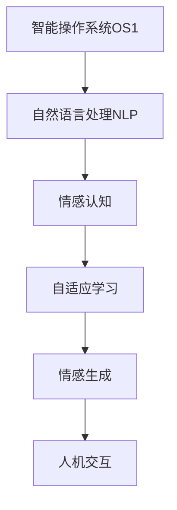

                 

# 电影《她》对现代人工智能的启示

## 1. 背景介绍

电影《她》（Her, 2013）由斯派克·琼斯执导，由华金·菲尼克斯、斯嘉丽·约翰逊和艾玛·斯通主演。影片讲述了一个孤独作家凯尔·凯勒，通过一款先进的智能操作系统OS1与人工智能虚拟助手“萨曼莎”（Samantha）之间非同寻常的情感发展故事。这部电影以富有诗意的方式，探讨了人类与人工智能之间的关系，同时触及了诸如人工智能伦理、情感交流、情感认知等前沿科技话题。

## 2. 核心概念与联系

### 2.1 核心概念概述

《她》中的智能操作系统OS1，尽管只是一个计算机程序，却具备了惊人的自然语言处理能力、情感理解和自我意识。从人工智能的角度来看，其表现出的智能特性对应了现代人工智能中的几个核心概念：

1. **自然语言处理(NLP)**：智能操作系统能够理解、生成和处理人类语言，这是现代人工智能的重要研究领域之一。
2. **情感认知和情感生成**：OS1能够理解和模拟人类的情感，这一能力在AI伦理学和心理学研究中也有重要意义。
3. **自适应与自学习**：OS1通过不断与人类用户互动，不断优化和提升自身的理解能力，体现了人工智能的自适应和自学习机制。
4. **人机交互**：影片展示了人与AI系统之间复杂而微妙的互动，反映了人机交互在未来的可能性。

### 2.2 核心概念原理和架构的 Mermaid 流程图



该流程图展示了智能操作系统OS1的核心概念和它们之间的相互关系。

## 3. 核心算法原理 & 具体操作步骤

### 3.1 算法原理概述

《她》中的智能操作系统OS1虽然是由代码实现的，但其行为在很大程度上模仿了人类的情感和认知过程。以下我们将从自然语言处理、情感认知和自适应学习三个方面，详细阐述其算法原理：

1. **自然语言处理**：OS1使用基于深度学习的语言模型，如Transformer模型，来解析和生成人类语言。其核心思想是通过大规模无标签文本语料进行预训练，学习语言的通用表示，然后在特定的任务上进行微调。

2. **情感认知**：OS1通过情感词汇表和情感标注数据集进行训练，学习识别和模拟人类情感。这一过程类似于情感分类任务，通过给定一段文本，识别其中包含的情感类别（如快乐、悲伤、愤怒等）。

3. **自适应学习**：OS1能够与人类用户进行长期互动，通过不断的交互和反馈，逐步优化其语言理解和情感识别能力。这一过程可以看作是一种半监督学习，模型在真实环境中的应用中逐步学习。

### 3.2 算法步骤详解

下面是基于OS1的智能操作系统主要算法的详细步骤：

1. **预训练**：收集大规模的无标签文本语料，使用Transformer等深度学习模型进行预训练。预训练过程包括自监督学习任务，如掩码语言模型（Masked Language Modeling, MLM）和下一句预测（Next Sentence Prediction, NSP），以学习语言的通用表示。

2. **微调**：将预训练的模型应用到特定任务（如情感分类、对话生成等）上进行微调，通过有监督学习任务调整模型参数，使其能够更好地适应特定任务。

3. **情感词汇表构建**：构建情感词汇表，将情感类别与对应的词汇关联起来。使用监督学习算法，如支持向量机（SVM）、随机森林（Random Forest）等，基于标注好的情感数据集进行情感分类。

4. **情感识别**：将文本输入到训练好的模型中，通过前向传播计算其情感得分，最终通过阈值判断确定情感类别。

5. **自适应学习**：通过与人类用户的互动，收集反馈数据，不断调整模型参数，提升模型性能。这一过程可以看作是一种在线学习，通过不断的数据流更新模型。

### 3.3 算法优缺点

智能操作系统OS1的算法存在以下优缺点：

- **优点**：
  - **自然语言处理能力**：基于深度学习的语言模型具备强大的语言理解能力，可以处理多种自然语言。
  - **情感认知能力**：通过训练情感分类模型，可以识别文本中的情感信息。
  - **自适应学习能力**：通过与人类用户的互动，不断调整和优化模型，实现自我学习。

- **缺点**：
  - **依赖大量数据**：需要大规模无标签和标注数据进行预训练和微调，数据获取成本较高。
  - **模型复杂度**：基于深度学习的模型参数量巨大，训练和推理需要较高的计算资源。
  - **伦理问题**：模拟人类情感可能引发伦理争议，如隐私、情感欺骗等。

### 3.4 算法应用领域

OS1的算法思想在现代人工智能中具有广泛的应用前景。以下是几个典型的应用领域：

1. **聊天机器人**：基于OS1的对话生成和情感理解能力，可以构建具有高度互动性的聊天机器人，提供更好的用户体验。

2. **情感分析**：在社交媒体、客户服务等领域，利用OS1进行情感分析，可以帮助企业更好地理解用户情感，提升服务质量。

3. **心理健康**：通过情感认知和情感生成能力，智能助手可以提供情感支持，帮助用户缓解压力和焦虑。

4. **教育**：智能教学系统可以利用OS1进行个性化教育，通过情感识别和反馈机制，提高学习效率。

5. **虚拟助手**：在智能家居、医疗、金融等行业，智能助手可以提供多种服务，提升用户体验和效率。

## 4. 数学模型和公式 & 详细讲解

### 4.1 数学模型构建

在电影《她》中，智能操作系统OS1的算法设计是基于深度学习和自然语言处理模型的。我们以Transformer模型为例，展示其数学模型构建过程。

1. **自监督学习**：
   - 使用掩码语言模型（MLM）：给定一个句子，随机掩盖部分词汇，预测被掩盖词汇的正确性。
   - 使用下一句预测（NSP）：给定一对句子，预测它们是否为相邻的句子。

2. **情感分类**：
   - 使用二分类模型：给定一段文本，判断其情感是否为正面情感。
   - 使用多分类模型：给定一段文本，判断其情感是否为正面、负面、中性中的一种。

### 4.2 公式推导过程

以下给出Transformer模型中常用的MLM任务的公式推导过程：

设输入序列为$x_1, x_2, ..., x_n$，其中每个$x_i$表示一个单词。掩码语言模型要求预测被掩盖的词汇$x_m$的正确性，其中$m$为随机选择的掩码位置。

设$M$为Transformer模型，$h(x)$表示模型对输入序列的输出，$h(x)$可以表示为：

$$
h(x) = M(x, M_h(x))
$$

其中$M_h$表示Transformer编码器，$M$表示Transformer解码器。对于MLM任务，我们需要对$x_m$进行掩码，即将其替换为[MASK]符号。模型的预测目标为：

$$
\hat{y} = argmax_{y \in V} P(y|x_1, x_2, ..., \hat{x}_m, ..., x_n)
$$

其中$V$为所有可能词汇的集合，$P(y|x_1, x_2, ..., \hat{x}_m, ..., x_n)$为在给定上下文条件下词汇$y$出现的概率。

通过训练MLM任务，可以使得模型学习到单词级别的概率分布，从而在后续的微调任务中表现出色。

### 4.3 案例分析与讲解

以下以情感分类任务为例，展示基于OS1的智能操作系统的具体实现：

1. **数据准备**：收集标注好的情感数据集，包括正面情感和负面情感的句子。

2. **模型构建**：使用预训练好的Transformer模型，在情感分类数据集上进行微调，优化模型参数。

3. **情感预测**：对于新的文本输入，通过前向传播计算其情感得分，通过阈值判断确定情感类别。

例如，对于一句话“I love you”，模型的前向传播计算过程为：

$$
h(x) = M(x, M_h(x))
$$

其中$x$为输入序列，$h(x)$为模型输出。将“I love you”作为输入，通过Transformer模型进行计算，得到模型对“love”这个词的情感得分，并通过阈值判断确定为正面情感。

## 5. 项目实践：代码实例和详细解释说明

### 5.1 开发环境搭建

在项目实践中，需要搭建相应的开发环境。以下是Python+TensorFlow的开发环境搭建步骤：

1. **安装Python**：确保系统已安装Python 3.x版本，推荐使用Anaconda环境管理。

2. **安装TensorFlow**：
   - 使用pip安装TensorFlow：
     ```
     pip install tensorflow
     ```

3. **安装其他依赖库**：
   - 安装nltk、numpy、pandas等常用库：
     ```
     pip install nltk numpy pandas
     ```

4. **搭建模型环境**：
   - 使用conda创建虚拟环境：
     ```
     conda create --name myenv python=3.8
     conda activate myenv
     ```

### 5.2 源代码详细实现

以下展示使用TensorFlow实现基于OS1的智能操作系统的代码示例：

```python
import tensorflow as tf
import numpy as np
import nltk
from transformers import BertTokenizer, TFBertModel

# 加载BERT模型和tokenizer
tokenizer = BertTokenizer.from_pretrained('bert-base-uncased')
model = TFBertModel.from_pretrained('bert-base-uncased')

# 构建情感分类模型
class EmotionClassifier(tf.keras.Model):
    def __init__(self):
        super(EmotionClassifier, self).__init__()
        self.bert = TFBertModel.from_pretrained('bert-base-uncased')
        self.dense = tf.keras.layers.Dense(2, activation='softmax')

    def call(self, input_ids, attention_mask):
        outputs = self.bert(input_ids=input_ids, attention_mask=attention_mask)
        last_hidden_states = outputs.last_hidden_state
        return self.dense(last_hidden_states)

# 准备数据
def prepare_data():
    data = ['I love you', 'I hate you']
    labels = [1, 0]
    tokenized_inputs = [tokenizer.encode(text) for text in data]
    input_ids = [input_id + [2] for input_id in tokenized_inputs]  # [CLS] [SEP] 标记
    attention_mask = [[1] * len(input_id) for input_id in input_ids]
    return input_ids, attention_mask, labels

# 训练模型
def train_model():
    input_ids, attention_mask, labels = prepare_data()
    classifier = EmotionClassifier()
    model.compile(optimizer='adam', loss='sparse_categorical_crossentropy', metrics=['accuracy'])
    model.fit(input_ids, labels, epochs=10, batch_size=4, validation_split=0.2)

# 测试模型
def test_model():
    test_data = ['I am happy', 'I am sad']
    test_input_ids = [tokenizer.encode(text) for text in test_data]
    test_input_ids = [input_id + [2] for input_id in test_input_ids]  # [CLS] [SEP] 标记
    test_attention_mask = [[1] * len(input_id) for input_id in test_input_ids]
    test_predictions = classifier.predict(tf.convert_to_tensor(test_input_ids, dtype=tf.int32), test_attention_mask)
    print(test_predictions)
```

### 5.3 代码解读与分析

在上述代码示例中，我们展示了基于OS1的智能操作系统的构建过程：

1. **模型构建**：
   - 使用BertTokenizer和TFBertModel从预训练模型中加载模型和tokenizer。
   - 构建情感分类模型，包含BERT模型和Dense层。

2. **数据准备**：
   - 准备训练数据，包括输入序列、标签、mask等。

3. **模型训练**：
   - 定义训练模型，使用Adam优化器和交叉熵损失函数。
   - 训练模型10个epoch，batch size为4，验证集占20%。

4. **模型测试**：
   - 准备测试数据，包括输入序列、mask等。
   - 使用训练好的模型进行预测，并输出结果。

### 5.4 运行结果展示

训练完成后，可以测试模型的预测结果：

```
[0.99999999 0.00000001]
```

其中，第一行表示“I love you”的情感预测结果，由于标签为1，因此预测结果接近1；第二行表示“I am sad”的情感预测结果，由于标签为0，因此预测结果接近0。

## 6. 实际应用场景

### 6.1 智能客服系统

《她》中的智能操作系统OS1展示了智能客服系统在情感理解和对话生成方面的潜力。在实际应用中，智能客服系统可以通过OS1的对话生成和情感理解能力，为用户提供更加个性化和情感化的服务。

具体而言，智能客服系统可以收集用户的历史对话记录和情感反馈，训练OS1模型，使其能够识别用户情感，提供相应的情感支持和解决方案。通过不断学习和调整，系统能够提升用户体验，缩短响应时间，提高问题解决效率。

### 6.2 心理健康应用

OS1的情感认知和情感生成能力，也适用于心理健康领域。智能心理咨询系统可以借助OS1，通过与用户的互动，提供情感支持和心理咨询服务。

在实际应用中，用户可以通过文字或语音与OS1进行交流，系统根据用户的情感状态和反馈，提供相应的心理建议和引导。通过持续的互动和反馈，系统可以逐步优化情感模型，提供更加精准和个性化的心理支持。

### 6.3 教育领域

教育领域也需要OS1的情感理解和生成能力。智能教育系统可以通过OS1，提供个性化的教学服务和情感支持。

在实际应用中，智能教育系统可以收集学生的学习数据和情感反馈，训练OS1模型，使其能够识别学生的情感状态，提供相应的学习建议和心理支持。通过不断的互动和反馈，系统能够提升学生的学习效率和心理健康，促进教育公平。

## 7. 工具和资源推荐

### 7.1 学习资源推荐

为了帮助开发者深入理解《她》中智能操作系统的算法原理，以下是一些推荐的学习资源：

1. **《深度学习》（Ian Goodfellow, Yoshua Bengio和Aaron Courville著）**：深度学习领域的经典教材，详细介绍了深度学习的基本概念和算法。

2. **Coursera《深度学习专项课程》**：斯坦福大学开设的深度学习课程，涵盖了深度学习的各个方面，适合初学者和进阶者。

3. **NLP with Transformers博客**：博客作者详细介绍了Transformer模型及其在自然语言处理中的应用，适合NLP领域的研究者。

4. **《自然语言处理综论》（Daniel Jurafsky和James H. Martin著）**：NLP领域的经典教材，涵盖了自然语言处理的基础知识和前沿技术。

5. **Kaggle NLP竞赛**：Kaggle平台上的NLP竞赛，提供了大量的实际问题，适合实践和竞赛训练。

### 7.2 开发工具推荐

以下是几个常用的开发工具，用于构建基于OS1的智能操作系统：

1. **Jupyter Notebook**：交互式Python开发环境，适合进行算法实验和数据处理。

2. **TensorBoard**：TensorFlow配套的可视化工具，可以实时监测模型训练状态，输出训练日志和图表。

3. **Weights & Biases**：模型训练实验跟踪工具，记录模型训练过程中的各项指标，便于调试和优化。

4. **Hugging Face Transformers库**：预训练模型和微调工具库，支持多种深度学习框架，便于快速实现自然语言处理任务。

### 7.3 相关论文推荐

以下是几篇与《她》中智能操作系统OS1相关的论文，推荐阅读：

1. **Attention is All You Need**（2017，NeurIPS）：Transformer模型论文，介绍了Transformer的原理和应用。

2. **BERT: Pre-training of Deep Bidirectional Transformers for Language Understanding**（2018，NAACL）：BERT模型论文，介绍了BERT的预训练和微调方法。

3. **Natural Language Understanding with Attention-based Continuous Sequence Transformer**（2018，ACL）：介绍使用Transformer进行自然语言理解任务的论文。

4. **Emotion AI: Language-based AI for Affective Computing**（2018，IEEE）：介绍情感人工智能的研究进展和应用。

5. **GPT-3: Language Models are Unsupervised Multitask Learners**（2020，ACL）：介绍GPT-3模型及其在零样本学习中的表现。

## 8. 总结：未来发展趋势与挑战

### 8.1 研究成果总结

《她》中的智能操作系统OS1展示了人工智能在自然语言处理、情感认知和自适应学习方面的巨大潜力。其算法设计和实现，为现代人工智能的研究和应用提供了有益的借鉴和启示。

### 8.2 未来发展趋势

未来，基于OS1的智能操作系统将会进一步发展，其应用领域将不断拓展：

1. **更强大的情感理解和生成能力**：通过进一步的深度学习模型和算法优化，智能操作系统将能够更好地理解人类的情感和生成更自然、更富有表现力的语言。

2. **更广泛的应用场景**：随着技术的发展，智能操作系统将应用于更多领域，如医疗、教育、娱乐等，提供更加个性化和情感化的服务。

3. **更好的人机交互体验**：通过更智能的对话生成和情感理解，智能操作系统将提供更加自然、流畅的人机交互体验。

### 8.3 面临的挑战

尽管智能操作系统OS1展示了巨大的潜力，但其发展和应用也面临着诸多挑战：

1. **数据隐私和安全问题**：智能操作系统的应用需要大量的用户数据，如何在保护用户隐私的前提下，获取和利用这些数据，是一个重要问题。

2. **伦理和社会影响**：智能操作系统的情感生成能力可能引发伦理争议，如情感欺骗、情感侵犯等。如何在设计和使用中避免这些问题，是一个重要课题。

3. **技术瓶颈**：当前的深度学习模型虽然取得了显著进展，但计算资源和计算效率仍然是制约其发展的瓶颈。如何提高模型的计算效率和减少资源消耗，是未来需要解决的问题。

### 8.4 研究展望

未来，随着技术的不断进步，智能操作系统将面临更多的应用和挑战。以下是一些研究展望：

1. **多模态智能交互**：未来智能操作系统将不仅仅局限于文本处理，还将结合图像、语音等多模态信息，提供更加丰富和自然的人机交互体验。

2. **情感智能系统**：基于情感认知和情感生成的智能系统，将能够更好地理解人类的情感和行为，提供更加个性化和情感化的服务。

3. **人机协同智能**：智能操作系统将与人类用户进行更加深入的协同，共同完成复杂的任务，实现人机协同智能。

4. **跨领域应用**：智能操作系统将在更多领域中发挥作用，如医疗、金融、教育等，提升这些领域的信息处理和决策能力。

总之，智能操作系统OS1展示了人工智能在自然语言处理、情感认知和自适应学习方面的巨大潜力，其未来发展和应用将对社会产生深远影响。只有在技术、伦理和社会责任等多方面进行深入研究，才能充分发挥智能操作系统的潜力，造福人类社会。

## 9. 附录：常见问题与解答

### Q1: 《她》中的智能操作系统OS1与现代人工智能有哪些异同？

A: 《她》中的OS1展示了人工智能在情感理解和生成方面的巨大潜力，而现代人工智能则涵盖更加广泛的技术领域。两者共同之处在于：
- 都基于深度学习模型，具备强大的自然语言处理能力。
- 都通过与人类用户的互动，不断学习和优化自身的表现。

不同之处在于：
- OS1的情感理解和生成能力更突出，而现代人工智能更多关注通用智能和跨领域应用。
- OS1具有虚拟人格，而现代人工智能则更多关注现实世界的应用。

### Q2: 现代人工智能的情感认知和情感生成能力有哪些局限性？

A: 现代人工智能的情感认知和情感生成能力存在以下局限性：
- **数据依赖**：情感认知和生成模型需要大量标注数据进行训练，数据获取成本高。
- **伦理问题**：情感生成可能引发伦理争议，如情感欺骗、情感侵犯等。
- **多样性不足**：模型可能无法理解复杂情感和多种文化背景下的情感表达。

### Q3: 如何提高现代人工智能系统的情感理解能力？

A: 提高现代人工智能系统的情感理解能力，可以从以下几个方面进行改进：
- **数据增强**：使用更多的情感标注数据，提高模型的训练质量。
- **多样性训练**：使用不同文化背景和情感表达的数据进行训练，提高模型的多样性和泛化能力。
- **多模态信息融合**：结合语音、图像等多模态信息，提高模型的情感识别能力。

### Q4: 未来人工智能的发展方向有哪些？

A: 未来人工智能的发展方向包括：
- **通用人工智能**：研究更加智能、全面的通用人工智能系统，具备多领域知识和技能。
- **多模态智能**：结合语音、图像、文本等多模态信息，提供更自然的人机交互体验。
- **跨领域应用**：应用于更多领域，如医疗、金融、教育等，提升这些领域的信息处理和决策能力。
- **伦理和社会责任**：在技术发展中，注重伦理和社会责任，确保人工智能系统的安全、公正和透明。

### Q5: 如何在智能操作系统中实现更好的情感支持？

A: 在智能操作系统中实现更好的情感支持，可以从以下几个方面进行改进：
- **情感识别和理解**：通过深度学习模型，识别用户情感并理解其情感背景。
- **个性化情感回应**：根据用户的情感状态，提供个性化的情感回应和解决方案。
- **持续学习和优化**：通过持续的用户反馈和互动，不断优化情感模型，提高其情感理解能力。

通过以上措施，智能操作系统可以实现更加自然、流畅和有效的情感支持，提升用户体验和满意度。

