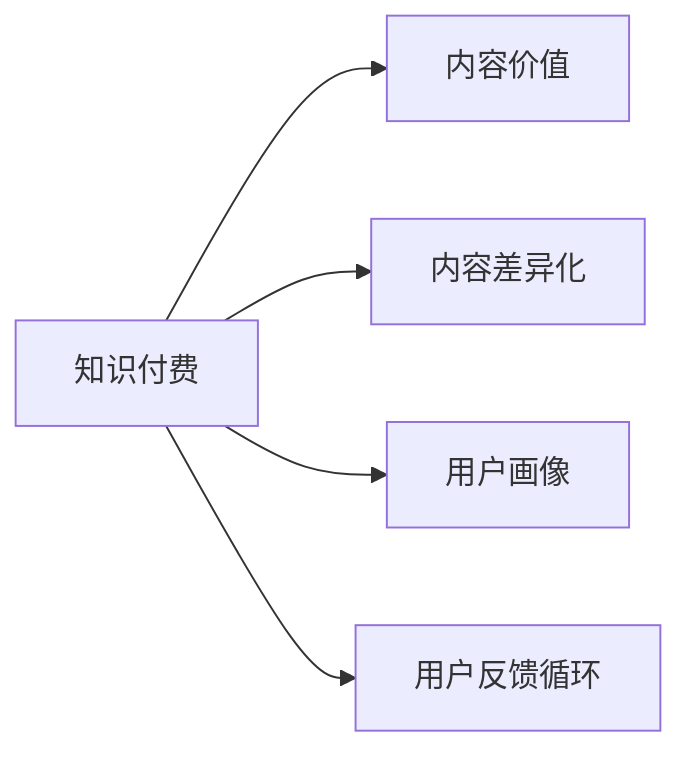

                 

# 知识付费创业中的内容价值提升

## 1. 背景介绍

随着互联网的迅猛发展，知识付费行业迅速崛起。从在线课程、电子书、专栏文章到在线咨询、一对一辅导，知识付费产品日益丰富，满足了用户对于知识的个性化、即时化、系统化的需求。然而，面对如此多的知识产品，用户往往感到无所适从。如何在竞争激烈的知识付费市场中找到自己的定位，提升内容价值，实现商业变现，是知识付费创业公司需要解决的重要课题。

### 1.1 知识付费市场现状

根据艾媒咨询的数据显示，2020年中国知识付费市场规模达到392亿元，年增长率为45.4%。然而，市场繁荣的背后，存在着内容同质化严重、用户体验差、用户粘性低等诸多问题。面对海量知识产品的市场，如何提升内容价值，构建差异化竞争优势，成为创业公司需要解决的关键问题。

## 2. 核心概念与联系

### 2.1 核心概念概述

为了更好地理解内容价值提升的逻辑，本节将介绍几个关键概念：

- **知识付费**：指通过在线课程、电子书、专栏文章等形式，向用户提供知识内容，并通过订阅、购买等方式进行商业变现的商业模式。
- **内容价值**：指知识产品为用户带来的知识获取、技能提升、心理满足等价值。
- **内容差异化**：指与市场上其他内容产品相比，自身内容具有独特的卖点，能够满足用户的特定需求。
- **用户画像**：指对用户的基本属性、兴趣爱好、消费行为等进行刻画，从而实现个性化推荐和服务。
- **用户反馈循环**：指通过用户反馈、数据追踪等方式，对内容产品进行迭代优化，提升用户体验和满意度。

这些概念之间的逻辑关系可以通过以下Mermaid流程图来展示：



这个流程图展示出知识付费创业公司内容价值提升的核心流程：

1. 从知识付费业务出发，通过构建差异化的内容产品，增强用户粘性和满意度。
2. 通过用户画像技术，实现内容个性化推荐和精准定位。
3. 通过用户反馈循环，不断优化内容产品，提升用户价值和商业变现能力。

### 2.2 核心概念原理和架构

#### 2.2.1 知识付费原理

知识付费的原理可以简单概括为“内容+变现”。一方面，通过生产优质的内容产品，满足用户的知识需求；另一方面，通过变现方式（如订阅、购买、打赏等）实现商业价值。用户价值与商业价值的平衡，是知识付费创业的关键。

#### 2.2.2 内容价值构建

内容价值构建的核心在于内容的深度、广度和用户体验。通过深度分析用户需求，挖掘具有独特性和启发性的内容，并通过互动、参与等方式提升用户体验。具体来说，内容价值构建包括：

- **内容差异化**：通过创新内容形式、引入专家视角、融入技术元素等方式，构建与市场上其他产品不同的独特卖点。
- **用户画像构建**：通过大数据分析、用户行为追踪等方式，构建详细的用户画像，实现精准定位和个性化推荐。
- **用户反馈机制**：建立健全的用户反馈机制，通过问卷调查、评论分析、数据追踪等方式，获取用户的真实需求和满意度。

#### 2.2.3 用户画像技术

用户画像技术是一种数据挖掘和分析技术，通过对用户行为的追踪和分析，构建详细的用户画像，用于个性化推荐和服务。其基本原理如下：

- **数据采集**：通过网站、应用、社交媒体等方式，采集用户的各类行为数据。
- **数据预处理**：对采集到的数据进行清洗、归一化、特征工程等预处理操作。
- **模型训练**：通过机器学习算法，如K-means聚类、SVM、决策树等，构建用户画像模型。
- **画像应用**：将用户画像模型应用于内容推荐、精准广告投放、个性化服务等方面，提升用户体验和满意度。

#### 2.2.4 用户反馈循环

用户反馈循环是一种持续优化内容产品的机制。通过获取用户反馈，持续优化内容产品，实现产品迭代和用户满意度提升。其基本流程如下：

- **反馈收集**：通过问卷调查、评论分析、用户行为追踪等方式，收集用户反馈。
- **数据分析**：对收集到的反馈进行数据分析，提取关键指标和用户需求。
- **产品优化**：根据用户反馈，对内容产品进行优化和改进，提升用户体验。
- **反馈追踪**：持续追踪用户反馈，确保产品优化措施的有效性。

## 3. 核心算法原理 & 具体操作步骤

### 3.1 算法原理概述

内容价值提升的核心算法是推荐算法，其主要任务是根据用户画像和内容特征，为用户推荐最具价值的内容。推荐算法的目标是在满足用户个性化需求的同时，最大化商业变现价值。常用的推荐算法包括基于协同过滤、基于内容过滤、基于混合过滤等算法。

#### 3.1.1 协同过滤推荐

协同过滤推荐基于用户之间的相似性，通过分析用户的行为数据，为用户推荐其他用户喜欢的内容。其基本流程如下：

- **用户行为建模**：将用户行为数据表示为用户-物品评分矩阵。
- **用户相似度计算**：计算用户之间的相似度，选择与目标用户相似度最高的用户。
- **物品推荐**：根据相似用户的评分，推荐目标用户可能感兴趣的物品。

#### 3.1.2 基于内容过滤推荐

基于内容过滤推荐根据物品之间的相似性，通过分析物品的特征，为用户推荐相似的物品。其基本流程如下：

- **物品特征建模**：将物品的特征表示为向量形式。
- **物品相似度计算**：计算物品之间的相似度，选择与目标物品相似度最高的物品。
- **用户推荐**：根据相似物品的评分，推荐目标用户可能感兴趣的物品。

#### 3.1.3 混合过滤推荐

混合过滤推荐综合协同过滤和基于内容过滤的优点，通过多种推荐算法，提升推荐效果。其基本流程如下：

- **协同过滤推荐**：根据用户行为数据，生成协同过滤推荐结果。
- **内容过滤推荐**：根据物品特征，生成基于内容过滤推荐结果。
- **融合策略**：将两种推荐结果进行融合，提升推荐效果。

### 3.2 算法步骤详解

#### 3.2.1 协同过滤推荐步骤

1. **数据采集**：采集用户行为数据，如观看时长、点赞数、评论数等。
2. **数据预处理**：对采集到的数据进行清洗、归一化、特征工程等预处理操作。
3. **用户相似度计算**：计算用户之间的相似度，选择与目标用户相似度最高的用户。
4. **物品推荐**：根据相似用户的评分，推荐目标用户可能感兴趣的物品。

#### 3.2.2 基于内容过滤推荐步骤

1. **物品特征建模**：将物品的特征表示为向量形式。
2. **物品相似度计算**：计算物品之间的相似度，选择与目标物品相似度最高的物品。
3. **用户推荐**：根据相似物品的评分，推荐目标用户可能感兴趣的物品。

#### 3.2.3 混合过滤推荐步骤

1. **协同过滤推荐**：根据用户行为数据，生成协同过滤推荐结果。
2. **内容过滤推荐**：根据物品特征，生成基于内容过滤推荐结果。
3. **融合策略**：将两种推荐结果进行融合，提升推荐效果。

### 3.3 算法优缺点

#### 3.3.1 协同过滤推荐优缺点

**优点**：

- **无特征工程需求**：只需要用户行为数据即可进行推荐，适用于特征工程复杂的情况。
- **用户行为数据丰富**：能够捕捉用户的多样化需求，提升推荐效果。

**缺点**：

- **冷启动问题**：新用户或新物品的推荐效果较差。
- **稀疏矩阵问题**：用户行为数据可能存在稀疏性，影响推荐效果。

#### 3.3.2 基于内容过滤推荐优缺点

**优点**：

- **无冷启动问题**：物品特征建模不需要用户行为数据。
- **推荐效果较好**：能够捕捉物品之间的相似性，提升推荐效果。

**缺点**：

- **特征工程复杂**：需要详细分析物品的特征，提取有效的特征向量。
- **特征稀疏性问题**：物品特征可能存在稀疏性，影响推荐效果。

#### 3.3.3 混合过滤推荐优缺点

**优点**：

- **综合优点**：结合协同过滤和内容过滤的优点，提升推荐效果。
- **推荐效果好**：能够捕捉用户和物品的多种特征，提升推荐效果。

**缺点**：

- **特征工程复杂**：需要详细分析用户行为数据和物品特征。
- **融合策略复杂**：需要选择合适的融合策略，提升推荐效果。

### 3.4 算法应用领域

推荐算法在知识付费创业公司中有着广泛的应用，以下是几个典型的应用场景：

- **课程推荐**：根据用户的学习历史、兴趣偏好等，为用户推荐相关课程。
- **文章推荐**：根据用户的阅读历史、评论互动等，为用户推荐相关文章。
- **专家推荐**：根据用户的关注对象、互动行为等，为用户推荐相关专家。
- **付费内容推荐**：根据用户的消费行为、评价反馈等，为用户推荐付费内容。

## 4. 数学模型和公式 & 详细讲解 & 举例说明

### 4.1 数学模型构建

推荐算法的数学模型可以简单表示为：

$$
R_{ui} = f(\vec{U}, \vec{I})
$$

其中，$R_{ui}$表示用户$u$对物品$i$的评分，$\vec{U}$表示用户$u$的行为特征向量，$\vec{I}$表示物品$i$的特征向量，$f$表示评分函数。

推荐算法的目标是最小化预测评分与实际评分之间的差距，即：

$$
\min_{\theta} \frac{1}{N} \sum_{i=1}^N \sum_{u=1}^N (R_{ui}^{'} - R_{ui})^2
$$

其中，$R_{ui}^{'}$表示用户$u$对物品$i$的预测评分，$\theta$表示模型参数。

### 4.2 公式推导过程

#### 4.2.1 协同过滤推荐公式

协同过滤推荐的核心公式为：

$$
R_{ui} = \sum_{j=1}^M a_{uj}a_{ji}
$$

其中，$a_{uj}$表示用户$u$对物品$j$的评分，$a_{ji}$表示物品$j$对物品$i$的评分，$M$表示物品数。

#### 4.2.2 基于内容过滤推荐公式

基于内容过滤推荐的核心公式为：

$$
R_{ui} = \sum_{j=1}^M w_{uj}w_{ji}
$$

其中，$w_{uj}$表示物品$j$的特征向量在用户$u$的特征向量空间中的权重，$w_{ji}$表示物品$i$的特征向量在物品$j$的特征向量空间中的权重，$M$表示物品数。

#### 4.2.3 混合过滤推荐公式

混合过滤推荐的核心公式为：

$$
R_{ui} = \alpha R_{ui}^{co} + (1-\alpha) R_{ui}^{cf}
$$

其中，$R_{ui}^{co}$表示协同过滤推荐的评分，$R_{ui}^{cf}$表示基于内容过滤推荐的评分，$\alpha$表示协同过滤的权重。

### 4.3 案例分析与讲解

#### 4.3.1 协同过滤推荐案例

**案例描述**：某知识付费平台收集了用户的观看时长、点赞数、评论数等数据，需要为用户推荐相关课程。

**案例分析**：

1. **数据采集**：采集用户行为数据，如观看时长、点赞数、评论数等。
2. **数据预处理**：对采集到的数据进行清洗、归一化、特征工程等预处理操作。
3. **用户相似度计算**：计算用户之间的相似度，选择与目标用户相似度最高的用户。
4. **物品推荐**：根据相似用户的评分，推荐目标用户可能感兴趣的物品。

#### 4.3.2 基于内容过滤推荐案例

**案例描述**：某知识付费平台收集了课程的描述、标签、作者等数据，需要为用户推荐相关课程。

**案例分析**：

1. **物品特征建模**：将课程的描述、标签、作者等数据表示为向量形式。
2. **物品相似度计算**：计算物品之间的相似度，选择与目标物品相似度最高的物品。
3. **用户推荐**：根据相似物品的评分，推荐目标用户可能感兴趣的物品。

#### 4.3.3 混合过滤推荐案例

**案例描述**：某知识付费平台需要为用户推荐相关课程，同时考虑用户行为和课程特征。

**案例分析**：

1. **协同过滤推荐**：根据用户行为数据，生成协同过滤推荐结果。
2. **内容过滤推荐**：根据课程特征，生成基于内容过滤推荐结果。
3. **融合策略**：将两种推荐结果进行融合，提升推荐效果。

## 5. 项目实践：代码实例和详细解释说明

### 5.1 开发环境搭建

在进行推荐系统开发前，需要先搭建好开发环境。以下是使用Python进行PyTorch开发的环境配置流程：

1. 安装Anaconda：从官网下载并安装Anaconda，用于创建独立的Python环境。

2. 创建并激活虚拟环境：
```bash
conda create -n pytorch-env python=3.8 
conda activate pytorch-env
```

3. 安装PyTorch：根据CUDA版本，从官网获取对应的安装命令。例如：
```bash
conda install pytorch torchvision torchaudio cudatoolkit=11.1 -c pytorch -c conda-forge
```

4. 安装Transformers库：
```bash
pip install transformers
```

5. 安装各类工具包：
```bash
pip install numpy pandas scikit-learn matplotlib tqdm jupyter notebook ipython
```

完成上述步骤后，即可在`pytorch-env`环境中开始推荐系统开发。

### 5.2 源代码详细实现

以下是使用PyTorch和Transformers库实现协同过滤推荐的Python代码：

```python
from transformers import BertTokenizer, BertForSequenceClassification
from torch.utils.data import Dataset, DataLoader
import torch

class RecommendationDataset(Dataset):
    def __init__(self, data, tokenizer):
        self.data = data
        self.tokenizer = tokenizer
        
    def __len__(self):
        return len(self.data)
    
    def __getitem__(self, item):
        user_id, item_id, rating = self.data[item]
        text = 'User:{} Item:{} Rating:{}'.format(user_id, item_id, rating)
        
        encoding = self.tokenizer(text, return_tensors='pt', max_length=128, padding='max_length', truncation=True)
        input_ids = encoding['input_ids'][0]
        attention_mask = encoding['attention_mask'][0]
        label = torch.tensor(rating, dtype=torch.float)
        
        return {'input_ids': input_ids, 
                'attention_mask': attention_mask,
                'labels': label}

# 数据集
data = [(1, 2, 3), (2, 3, 4), (3, 4, 5), (4, 5, 6), (5, 6, 7)]
tokenizer = BertTokenizer.from_pretrained('bert-base-uncased')

# 创建dataset
dataset = RecommendationDataset(data, tokenizer)

# 创建dataloader
dataloader = DataLoader(dataset, batch_size=4, shuffle=True)

# 定义模型
model = BertForSequenceClassification.from_pretrained('bert-base-uncased', num_labels=1)

# 定义优化器和损失函数
optimizer = AdamW(model.parameters(), lr=1e-5)
loss_fn = nn.BCEWithLogitsLoss()

# 定义训练函数
def train_epoch(model, dataloader, optimizer, loss_fn):
    model.train()
    total_loss = 0
    for batch in dataloader:
        input_ids = batch['input_ids'].to(device)
        attention_mask = batch['attention_mask'].to(device)
        labels = batch['labels'].to(device)
        
        outputs = model(input_ids, attention_mask=attention_mask)
        loss = loss_fn(outputs, labels)
        total_loss += loss.item()
        loss.backward()
        optimizer.step()
        optimizer.zero_grad()
        
    return total_loss / len(dataloader)

# 训练
device = torch.device('cuda') if torch.cuda.is_available() else torch.device('cpu')
model.to(device)

for epoch in range(10):
    loss = train_epoch(model, dataloader, optimizer, loss_fn)
    print('Epoch {}, loss: {}'.format(epoch+1, loss))

# 测试
with torch.no_grad():
    test_dataset = RecommendationDataset([[1, 2, 3], [2, 3, 4], [3, 4, 5], [4, 5, 6]], tokenizer)
    dataloader = DataLoader(test_dataset, batch_size=4, shuffle=True)
    
    for batch in dataloader:
        input_ids = batch['input_ids'].to(device)
        attention_mask = batch['attention_mask'].to(device)
        labels = batch['labels'].to(device)
        
        outputs = model(input_ids, attention_mask=attention_mask)
        loss = loss_fn(outputs, labels)
        print('Test loss: {}'.format(loss))
```

### 5.3 代码解读与分析

以上是使用PyTorch和Transformers库实现协同过滤推荐的完整代码实现。可以看到，通过简单的代码实现，便能够高效地完成协同过滤推荐。

**RecommendationDataset类**：
- `__init__`方法：初始化数据集。
- `__len__`方法：返回数据集的大小。
- `__getitem__`方法：对单个数据进行处理，将其转换为模型所需的输入。

**训练函数**：
- 在每个epoch内，对数据集进行批处理，对每个批次进行前向传播和反向传播，计算损失并更新模型参数。

**测试函数**：
- 对测试集进行批处理，对每个批次进行前向传播，计算损失并输出。

## 6. 实际应用场景

### 6.1 在线教育

在线教育领域，推荐算法能够帮助学生个性化推荐课程，提升学习效果。通过分析学生的学习历史、兴趣偏好、互动行为等数据，推荐最适合的课程，提升学生的学习兴趣和效果。

### 6.2 金融理财

金融理财领域，推荐算法能够帮助用户个性化推荐理财产品，提升用户体验。通过分析用户的消费行为、财务状况、风险偏好等数据，推荐最合适的理财产品，提升用户满意度和收益。

### 6.3 电子商务

电子商务领域，推荐算法能够帮助用户个性化推荐商品，提升销售转化率。通过分析用户的浏览历史、购买记录、评价反馈等数据，推荐最符合用户需求的商品，提升用户的购物体验和购买率。

### 6.4 未来应用展望

随着推荐算法的发展，未来的知识付费创业公司将能够更好地满足用户的多样化需求，提升内容价值和商业变现能力。未来的推荐算法将更加智能化、个性化、多样化，帮助创业公司构建更强大的竞争优势。

## 7. 工具和资源推荐

### 7.1 学习资源推荐

为了帮助开发者系统掌握推荐算法的理论基础和实践技巧，这里推荐一些优质的学习资源：

1. 《推荐系统原理与实现》书籍：深入讲解了推荐系统的原理和实现方法，适合初学者和进阶者学习。
2. Kaggle推荐系统竞赛：Kaggle提供的推荐系统竞赛，可以帮助开发者实践推荐算法，提升算法效果。
3. PyTorch官方文档：PyTorch提供的推荐系统相关教程和代码示例，适合快速上手推荐系统开发。
4. TensorFlow官方文档：TensorFlow提供的推荐系统相关教程和代码示例，适合使用TensorFlow进行推荐系统开发。
5. Coursera推荐系统课程：由斯坦福大学提供的推荐系统课程，适合深入学习推荐系统的理论基础和实践技巧。

### 7.2 开发工具推荐

推荐的开发工具包括PyTorch、TensorFlow、scikit-learn等。这些工具提供了丰富的推荐系统开发资源，可以帮助开发者高效开发推荐系统。

### 7.3 相关论文推荐

推荐系统领域的研究不断涌现，以下是几篇具有代表性的相关论文：

1. "Collaborative Filtering for Implicit Feedback Datasets"：提出协同过滤算法，用于处理稀疏数据集的推荐问题。
2. "A Neural Approach to Collaborative Filtering"：提出基于神经网络的协同过滤算法，提升推荐效果。
3. "Matrix Factorization Techniques for Recommender Systems"：提出矩阵分解算法，用于推荐系统的建模。
4. "Personalized Top-N Recommendation by Matrix Factorization"：提出基于矩阵分解的推荐算法，用于个性化推荐。
5. "Wide & Deep Learning for Recommender Systems"：提出宽-深模型，结合协同过滤和深度学习，提升推荐效果。

这些论文代表了推荐系统领域的研究进展，可以帮助开发者深入理解推荐系统的核心算法。

## 8. 总结：未来发展趋势与挑战

### 8.1 研究成果总结

推荐算法在知识付费创业公司中得到了广泛应用，提升了用户个性化推荐的效果。通过协同过滤、基于内容过滤、混合过滤等多种算法，实现了用户画像的构建和个性化推荐，提升了用户满意度和商业变现能力。然而，推荐算法仍然面临一些挑战，如数据冷启动问题、特征稀疏性问题、推荐效果不稳定等，需要进一步研究和优化。

### 8.2 未来发展趋势

未来的推荐算法将更加智能化、个性化、多样化。通过引入深度学习、强化学习、知识图谱等技术，提升推荐效果和用户满意度。具体来说，未来的推荐算法将具备以下几个特点：

1. 更加智能化：通过引入自然语言处理、机器学习等技术，提升推荐系统的智能化水平。
2. 更加个性化：通过构建详细的用户画像，实现更加精准的个性化推荐。
3. 更加多样化：通过引入多模态数据、跨领域数据，提升推荐系统的多样化水平。

### 8.3 面临的挑战

尽管推荐算法在知识付费创业公司中取得了一定的成效，但仍然面临一些挑战：

1. 数据冷启动问题：对于新用户或新物品，推荐效果较差。
2. 特征稀疏性问题：用户行为数据或物品特征可能存在稀疏性，影响推荐效果。
3. 推荐效果不稳定：推荐系统的推荐效果受多种因素影响，如数据质量、模型参数等。

### 8.4 研究展望

未来的推荐算法研究将着重解决数据冷启动问题、特征稀疏性问题、推荐效果不稳定等问题。具体来说，未来的研究将包括以下几个方向：

1. 引入深度学习技术：通过深度学习模型，提升推荐系统的智能化水平。
2. 引入知识图谱技术：通过知识图谱技术，提升推荐系统的多样化水平。
3. 引入强化学习技术：通过强化学习算法，提升推荐系统的个性化水平。

这些研究方向将为推荐算法带来新的突破，提升知识付费创业公司的竞争力和市场地位。

## 9. 附录：常见问题与解答

**Q1：推荐算法是否适用于所有知识付费应用？**

A: 推荐算法在大多数知识付费应用中都能取得不错的效果，特别是对于数据量较大的应用。但对于一些特定应用，如企业培训、定制化咨询等，推荐算法的效果可能有限。此时需要结合其他技术手段，如专家推荐、个性化服务等方式，提升推荐效果。

**Q2：推荐算法如何应对数据冷启动问题？**

A: 数据冷启动问题是推荐算法面临的主要挑战之一。为了应对数据冷启动问题，可以采用以下几种方法：

1. 用户行为补全：通过用户的其他行为数据，对新用户的行为进行补全。
2. 物品特征补全：通过物品的相似性，对新物品的特征进行补全。
3. 迁移学习：通过迁移学习技术，将知识从其他领域迁移到新领域。
4. 基于知识图谱的推荐：通过知识图谱技术，对用户和物品的语义关系进行建模，提升推荐效果。

**Q3：推荐算法如何应对特征稀疏性问题？**

A: 特征稀疏性问题是推荐算法面临的另一个主要挑战。为了应对特征稀疏性问题，可以采用以下几种方法：

1. 矩阵分解：通过矩阵分解算法，对稀疏矩阵进行降维处理，提升推荐效果。
2. 协同过滤推荐：通过协同过滤算法，对稀疏数据进行建模，提升推荐效果。
3. 深度学习模型：通过深度学习模型，对稀疏数据进行建模，提升推荐效果。
4. 混合过滤推荐：通过多种推荐算法，综合多种特征，提升推荐效果。

**Q4：推荐算法如何应对推荐效果不稳定问题？**

A: 推荐效果不稳定是推荐算法面临的另一个主要挑战。为了应对推荐效果不稳定问题，可以采用以下几种方法：

1. 模型融合：通过多种推荐算法，综合多种特征，提升推荐效果。
2. 用户行为追踪：通过持续追踪用户行为，及时调整推荐策略，提升推荐效果。
3. 数据质量提升：通过提升数据质量，减少噪音数据对推荐效果的影响。
4. 模型调优：通过优化模型参数，提升推荐效果。

这些方法可以有效提升推荐算法的稳定性和效果，帮助知识付费创业公司实现更好的商业变现和用户满意度。

---

作者：禅与计算机程序设计艺术 / Zen and the Art of Computer Programming

