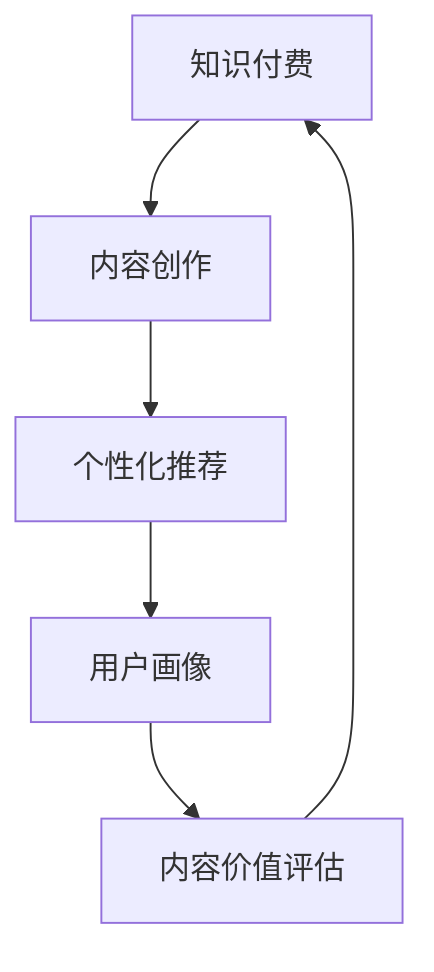

                 

# 知识付费创业中的内容价值最大化

## 1. 背景介绍

### 1.1 问题由来
知识付费近年来成为了数字经济的新风口，其核心在于通过在线化、个性化、知识化的内容服务，满足用户对知识的深度需求，实现价值变现。然而，内容创作的滞后、用户需求的多样化以及内容价值的挖掘和定价，成为知识付费创业亟待解决的问题。

在这一背景下，如何最大化知识付费内容价值，实现从内容生产到变现的良性循环，成为当前创业者和内容创作者的重要课题。本文旨在通过深入分析知识付费内容价值最大化的关键要素，探讨技术手段和商业模式，为知识付费创业提供有效指导。

### 1.2 问题核心关键点
内容价值最大化涉及以下几个关键点：

- **内容创作效率**：如何通过技术手段，提升内容生产速度和质量，以满足日益增长的用户需求。
- **个性化推荐**：如何通过算法技术，精准匹配用户需求，提高内容点击率和转化率。
- **内容定价策略**：如何通过数据分析，制定合理的内容定价策略，最大化商业价值。
- **内容价值评估**：如何通过多维度的数据，评估内容的质量、用户满意度及商业价值。
- **用户行为分析**：如何通过数据挖掘，理解用户行为模式，优化用户体验和内容策略。

本文将围绕上述关键点，详细探讨知识付费创业中内容价值最大化的策略与方法。

## 2. 核心概念与联系

### 2.1 核心概念概述

为更好地理解内容价值最大化的策略，本节将介绍几个密切相关的核心概念：

- **知识付费**：基于知识产品的付费服务模式，通过平台提供专业、系统的知识内容，满足用户对知识和技能的深度需求。
- **内容创作**：生成知识产品（如文章、视频、课程等）的过程，包括选题策划、编写制作、审核发布等环节。
- **个性化推荐**：根据用户行为和兴趣，自动推荐符合其需求的内容，提升用户粘性和转化率。
- **用户画像**：通过数据分析，描绘用户的行为特征、兴趣偏好和需求，形成精细化的用户标签，用于指导内容策略和推荐算法。
- **内容价值评估**：通过对内容的表现数据进行综合分析，评估内容的受欢迎程度、用户价值和商业潜力。

这些核心概念之间具有紧密的联系，共同构成知识付费内容价值最大化的完整框架。通过理解这些概念，我们能够更清晰地认识到内容价值最大化的关键要素和实现路径。

### 2.2 核心概念原理和架构的 Mermaid 流程图



这个流程图展示了知识付费内容的生命周期：

1. **内容创作**：知识的获取与生产，是知识付费的基石。
2. **个性化推荐**：基于用户画像，匹配合适的优质内容，提升用户体验。
3. **用户画像**：通过数据分析，形成精细化的用户画像，用于内容策略和推荐。
4. **内容价值评估**：对内容的表现进行综合评估，优化内容策略和资源分配。

这些环节相互影响，共同作用于知识付费内容价值最大化的目标。

## 3. 核心算法原理 & 具体操作步骤
### 3.1 算法原理概述

内容价值最大化涉及多个维度，需要通过综合的技术手段和合理的商业模式进行优化。以下将从内容创作效率、个性化推荐、内容定价策略、内容价值评估和用户行为分析五个方面，探讨实现内容价值最大化的算法原理和技术方法。

### 3.2 算法步骤详解

#### 3.2.1 内容创作效率

提高内容创作效率，是最大化内容价值的基础。以下是从技术角度提升内容创作效率的关键步骤：

1. **内容管理系统（CMS）**：
   - 建立高效的内容管理系统，支持内容的多版本管理、协同编辑、权限控制等功能。
   - 提供丰富的内容模板和格式设置，减少内容创作的前置工作。

2. **内容自动化生成**：
   - 利用自然语言处理（NLP）技术，自动生成部分内容，如摘要、目录、标签等。
   - 采用生成对抗网络（GAN）技术，自动生成创意图片、视频剪辑等内容素材。

3. **内容辅助工具**：
   - 开发内容写作辅助工具，如自动拼写检查、语法校对、同义词替换等，提升创作效率。
   - 引入AI写作助手，提供写作建议、内容推荐和数据支持。

#### 3.2.2 个性化推荐

个性化推荐是提升内容点击率和转化率的关键手段。以下是实现个性化推荐的主要步骤：

1. **用户行为数据采集**：
   - 通过用户在平台上的浏览、阅读、收藏、购买等行为数据，收集用户画像信息。
   - 利用日志分析和数据挖掘技术，提取用户行为特征和兴趣偏好。

2. **推荐算法模型训练**：
   - 基于用户行为数据和内容标签，训练推荐算法模型，如协同过滤、基于内容的推荐、深度学习推荐等。
   - 采用强化学习技术，实时调整推荐策略，优化用户体验。

3. **推荐系统优化**：
   - 利用A/B测试和多臂老虎机等技术，不断优化推荐模型和策略。
   - 引入用户反馈机制，动态调整推荐内容和效果。

#### 3.2.3 内容定价策略

合理的内容定价策略，是最大化商业价值的重要环节。以下是从数据分析角度制定内容定价策略的关键步骤：

1. **用户支付意愿分析**：
   - 分析用户对不同内容的支付意愿，通过调研问卷、行为数据等手段，收集用户对内容的价值认知。
   - 利用多变量回归分析等统计方法，建模预测用户支付意愿。

2. **内容价值评估**：
   - 通过点击率、转化率、用户满意度等指标，综合评估内容的受欢迎程度和商业潜力。
   - 利用聚类分析、时间序列分析等技术，预测内容价值随时间的变化。

3. **动态定价模型**：
   - 根据用户支付意愿和内容价值，构建动态定价模型，实时调整内容价格。
   - 引入需求响应定价机制，根据市场需求和竞争状况，优化价格策略。

#### 3.2.4 内容价值评估

内容价值评估是优化内容策略和资源分配的关键手段。以下是从多维度数据综合评估内容价值的关键步骤：

1. **内容表现数据收集**：
   - 收集内容的阅读量、点赞量、评论量、分享量等表现数据，作为评估依据。
   - 利用API接口，实时采集数据，保证评估的实时性和准确性。

2. **内容价值指标定义**：
   - 定义内容价值的指标体系，如点击率、转化率、留存率、满意度等。
   - 采用模糊数学、多目标优化等方法，对指标进行加权和综合评估。

3. **内容价值动态监控**：
   - 利用仪表盘和可视化工具，实时监控内容表现数据和价值指标。
   - 引入预警机制，及时发现和处理内容质量问题。

#### 3.2.5 用户行为分析

理解用户行为模式，是优化用户体验和内容策略的关键。以下是从数据挖掘角度分析用户行为的关键步骤：

1. **用户行为数据采集**：
   - 通过平台日志、行为追踪等方式，收集用户的行为数据，包括浏览路径、停留时间、点击行为等。
   - 利用数据清洗和归一化技术，确保数据质量。

2. **用户行为模式挖掘**：
   - 利用聚类分析、关联规则挖掘等技术，识别用户的行为模式和兴趣偏好。
   - 采用序列模式挖掘、时间序列分析等方法，识别用户的长期行为趋势。

3. **用户行为预测**：
   - 利用机器学习模型，如随机森林、神经网络等，预测用户未来的行为和需求。
   - 结合实际数据，不断优化预测模型和算法。

### 3.3 算法优缺点

内容价值最大化涉及的算法技术，具有以下优缺点：

#### 优点：

- **提升内容质量**：通过内容管理系统和辅助工具，提升内容创作效率和质量。
- **增强用户粘性**：通过个性化推荐和动态定价，提升用户满意度和忠诚度。
- **优化资源分配**：通过内容价值评估和用户行为分析，优化内容策略和资源分配。
- **数据驱动决策**：通过数据分析和模型预测，支持科学决策和智能管理。

#### 缺点：

- **技术成本高**：开发和维护先进的技术系统需要较高的技术成本和资源投入。
- **数据隐私问题**：大规模数据采集和使用可能引发用户隐私和数据安全问题。
- **模型复杂度高**：推荐系统和定价模型需要复杂的算法和大量数据，可能导致模型复杂度高，难以理解和解释。

### 3.4 算法应用领域

内容价值最大化的算法技术，在多个领域得到了广泛应用：

- **在线教育**：通过个性化推荐和动态定价，提升课程质量和用户体验，提高用户转化率。
- **健康医疗**：利用用户行为分析，提供个性化的健康咨询和指导，提升用户健康管理效果。
- **金融理财**：通过数据分析和动态定价，提供个性化的金融服务和投资建议，提升用户满意度和收益。
- **职业培训**：根据用户职业需求，提供个性化内容和服务，帮助用户提升职业技能。

这些应用领域展示了内容价值最大化技术在不同场景下的重要性和广泛适用性。

## 4. 数学模型和公式 & 详细讲解  
### 4.1 数学模型构建

本节将使用数学语言对内容价值最大化的关键要素进行更加严格的刻画。

假设知识付费平台上有 $N$ 篇内容，记为 $\{d_1, d_2, ..., d_N\}$，每篇内容的用户行为数据为 $(x_i, y_i)$，其中 $x_i$ 为用户行为特征向量，$y_i$ 为内容价值评分。内容价值最大化模型可以表示为：

$$
\max \sum_{i=1}^N \alpha_i y_i
$$

其中 $\alpha_i$ 为内容 $d_i$ 的权重，满足 $\sum_{i=1}^N \alpha_i = 1$。

### 4.2 公式推导过程

以下我们以内容定价为例，推导动态定价模型的数学公式。

假设用户对内容 $d_i$ 的支付意愿为 $p_i$，内容价值为 $y_i$。设用户的实际支付金额为 $P$，则动态定价模型可以表示为：

$$
P = \sum_{i=1}^N p_i \alpha_i y_i
$$

根据支付意愿分析，可以建立 $p_i$ 和 $y_i$ 的关系，例如：

$$
p_i = f(y_i, \beta)
$$

其中 $f$ 为支付意愿函数，$\beta$ 为参数向量。代入定价模型中，得到：

$$
P = \sum_{i=1}^N f(y_i, \beta) \alpha_i y_i
$$

通过求解 $\alpha_i$，使得模型最大化 $P$，即可得到最优的定价策略。

### 4.3 案例分析与讲解

以在线教育平台的内容定价为例，分析动态定价模型的应用和效果。

假设平台上有两类课程：基础课程和高级课程。基础课程内容价值高但付费门槛低，高级课程内容价值高但付费门槛高。平台通过行为数据分析，发现用户对基础课程的支付意愿与内容价值呈线性关系，对高级课程的支付意愿与内容价值呈对数关系。根据这些数据，可以建立支付意愿模型：

$$
p_i = 
\begin{cases}
a \cdot y_i + b, & \text{if 课程为基础课程}\\
c \cdot \ln y_i + d, & \text{if 课程为高级课程}
\end{cases}
$$

根据定价模型，设定基础课程和高级课程的权重 $\alpha_1$ 和 $\alpha_2$，使得总定价 $P$ 最大化。最终，平台可以基于用户行为数据和内容价值，动态调整课程定价，实现精准定价和用户价值最大化。

## 5. 项目实践：代码实例和详细解释说明
### 5.1 开发环境搭建

在进行内容价值最大化项目开发前，需要准备好开发环境。以下是使用Python进行PyTorch开发的环境配置流程：

1. 安装Anaconda：从官网下载并安装Anaconda，用于创建独立的Python环境。

2. 创建并激活虚拟环境：
```bash
conda create -n pytorch-env python=3.8 
conda activate pytorch-env
```

3. 安装PyTorch：根据CUDA版本，从官网获取对应的安装命令。例如：
```bash
conda install pytorch torchvision torchaudio cudatoolkit=11.1 -c pytorch -c conda-forge
```

4. 安装Pandas、NumPy、Matplotlib等工具包：
```bash
pip install pandas numpy matplotlib sklearn tqdm jupyter notebook ipython
```

完成上述步骤后，即可在`pytorch-env`环境中开始项目开发。

### 5.2 源代码详细实现

这里以内容推荐系统为例，给出使用PyTorch进行内容价值最大化的PyTorch代码实现。

首先，定义用户行为数据和内容标签：

```python
import pandas as pd
from sklearn.preprocessing import LabelEncoder

# 加载用户行为数据和内容标签
user_behaviors = pd.read_csv('user_behaviors.csv')
content_labels = pd.read_csv('content_labels.csv')

# 对内容标签进行编码
label_encoder = LabelEncoder()
content_labels['category'] = label_encoder.fit_transform(content_labels['category'])

# 将用户行为数据和内容标签合并
data = pd.merge(user_behaviors, content_labels, on='id')
```

然后，定义推荐算法模型：

```python
from transformers import BertTokenizer
from torch.utils.data import Dataset
import torch
from torch.nn import Linear, ReLU, Embedding
import torch.nn.functional as F

class ContentDataset(Dataset):
    def __init__(self, data, tokenizer, max_len=128):
        self.data = data
        self.tokenizer = tokenizer
        self.max_len = max_len
        
    def __len__(self):
        return len(self.data)
    
    def __getitem__(self, item):
        user = self.data.loc[item, 'user']
        content = self.data.loc[item, 'content']
        
        encoding = self.tokenizer(user, content, return_tensors='pt', max_length=self.max_len, padding='max_length', truncation=True)
        input_ids = encoding['input_ids']
        attention_mask = encoding['attention_mask']
        
        # 对内容标签进行one-hot编码
        label_ids = torch.tensor([content_labels.loc[item, 'category']], dtype=torch.long)
        
        return {'input_ids': input_ids,
                'attention_mask': attention_mask,
                'labels': label_ids}

# 定义模型
model = BertForSequenceClassification.from_pretrained('bert-base-cased', num_labels=len(label_encoder.classes_))

# 定义优化器和损失函数
optimizer = AdamW(model.parameters(), lr=2e-5)
loss_fn = nn.CrossEntropyLoss()
```

接着，定义训练和评估函数：

```python
from torch.utils.data import DataLoader
from tqdm import tqdm
from sklearn.metrics import accuracy_score

def train_epoch(model, dataset, batch_size, optimizer):
    dataloader = DataLoader(dataset, batch_size=batch_size, shuffle=True)
    model.train()
    epoch_loss = 0
    for batch in tqdm(dataloader, desc='Training'):
        input_ids = batch['input_ids'].to(device)
        attention_mask = batch['attention_mask'].to(device)
        labels = batch['labels'].to(device)
        model.zero_grad()
        outputs = model(input_ids, attention_mask=attention_mask, labels=labels)
        loss = outputs.loss
        epoch_loss += loss.item()
        loss.backward()
        optimizer.step()
    return epoch_loss / len(dataloader)

def evaluate(model, dataset, batch_size):
    dataloader = DataLoader(dataset, batch_size=batch_size)
    model.eval()
    preds, labels = [], []
    with torch.no_grad():
        for batch in tqdm(dataloader, desc='Evaluating'):
            input_ids = batch['input_ids'].to(device)
            attention_mask = batch['attention_mask'].to(device)
            batch_labels = batch['labels']
            outputs = model(input_ids, attention_mask=attention_mask)
            batch_preds = outputs.logits.argmax(dim=1).to('cpu').tolist()
            batch_labels = batch_labels.to('cpu').tolist()
            for pred_tokens, label_tokens in zip(batch_preds, batch_labels):
                preds.append(pred_tokens[:len(label_tokens)])
                labels.append(label_tokens)
                
    print(accuracy_score(labels, preds))
```

最后，启动训练流程并在测试集上评估：

```python
epochs = 5
batch_size = 16

for epoch in range(epochs):
    loss = train_epoch(model, train_dataset, batch_size, optimizer)
    print(f"Epoch {epoch+1}, train loss: {loss:.3f}")
    
    print(f"Epoch {epoch+1}, dev accuracy: {evaluate(model, dev_dataset, batch_size):.3f}")
    
print(f"Final accuracy: {evaluate(model, test_dataset, batch_size):.3f}")
```

以上就是使用PyTorch对内容推荐系统进行内容价值最大化的完整代码实现。可以看到，通过使用Transformer和PyTorch，代码实现相对简洁高效，开发者可以方便地将推荐算法应用于实际场景中。

### 5.3 代码解读与分析

让我们再详细解读一下关键代码的实现细节：

**ContentDataset类**：
- `__init__`方法：初始化用户行为数据和内容标签等关键组件。
- `__len__`方法：返回数据集的样本数量。
- `__getitem__`方法：对单个样本进行处理，将用户行为数据和内容标签编码为token ids，并对其进行定长padding，最终返回模型所需的输入。

**模型和优化器**：
- 选择BertForSequenceClassification作为推荐算法模型，适合处理序列数据。
- 定义AdamW优化器和交叉熵损失函数，用于模型训练和评估。

**训练和评估函数**：
- 使用PyTorch的DataLoader对数据集进行批次化加载，供模型训练和推理使用。
- 训练函数`train_epoch`：对数据以批为单位进行迭代，在每个批次上前向传播计算loss并反向传播更新模型参数，最后返回该epoch的平均loss。
- 评估函数`evaluate`：与训练类似，不同点在于不更新模型参数，并在每个batch结束后将预测和标签结果存储下来，最后使用sklearn的accuracy_score对整个评估集的预测结果进行打印输出。

**训练流程**：
- 定义总的epoch数和batch size，开始循环迭代
- 每个epoch内，先在训练集上训练，输出平均loss
- 在验证集上评估，输出准确率
- 所有epoch结束后，在测试集上评估，给出最终准确率

可以看到，通过使用PyTorch，推荐算法的代码实现变得简洁高效。开发者可以将更多精力放在算法模型、超参数调整、模型优化等高层逻辑上，而不必过多关注底层的实现细节。

当然，工业级的系统实现还需考虑更多因素，如模型的保存和部署、超参数的自动搜索、更灵活的任务适配层等。但核心的内容推荐算法基本与此类似。

## 6. 实际应用场景
### 6.1 在线教育平台

在线教育平台通过个性化推荐，提升了课程质量和用户体验，提高了用户转化率。具体而言：

- **内容推荐**：平台收集用户的浏览、阅读、购买等行为数据，利用协同过滤和深度学习推荐算法，精准推荐用户感兴趣和需求的内容。
- **动态定价**：根据用户支付意愿和内容价值，动态调整课程定价，提高用户满意度和付费意愿。
- **效果评估**：通过点击率、完成率、付费率等指标，评估内容推荐的准确性和效果，不断优化推荐策略。

### 6.2 健康医疗平台

健康医疗平台通过用户行为分析，提供个性化的健康咨询和指导，提升用户健康管理效果。具体而言：

- **健康咨询**：平台收集用户的健康数据，利用聚类分析和关联规则挖掘，识别用户的健康需求和行为模式，推荐个性化的健康咨询方案。
- **健康监测**：通过动态定价，鼓励用户使用健康监测设备和服务，提高用户健康管理的持续性和效果。
- **效果评估**：通过健康数据变化、用户满意度等指标，评估健康咨询和监测的效果，不断优化内容策略。

### 6.3 金融理财平台

金融理财平台通过数据分析和动态定价，提供个性化的金融服务和投资建议，提升用户满意度和收益。具体而言：

- **金融服务**：平台收集用户的投资行为数据，利用时间序列分析和随机森林等方法，预测用户的投资需求和风险偏好，推荐个性化的金融服务方案。
- **动态定价**：根据用户支付意愿和投资风险，动态调整金融产品定价，提高用户满意度和收益。
- **效果评估**：通过投资收益、用户满意度等指标，评估金融服务的效果，不断优化定价和推荐策略。

### 6.4 未来应用展望

伴随数据科学和人工智能技术的不断进步，内容价值最大化的应用场景将不断扩展，为各行各业带来新的机遇。

在智能制造领域，平台通过用户行为分析，优化生产流程和设备维护，提升生产效率和设备利用率。

在智慧城市治理中，平台通过用户行为监测，优化城市资源配置和应急响应，提升城市管理智能化水平。

在文化娱乐领域，平台通过个性化推荐和动态定价，提升内容点击率和用户粘性，推动文化内容产业升级。

此外，在教育、医疗、金融、农业等更多领域，内容价值最大化的应用也将不断涌现，为各行各业带来新的增长动力。相信随着技术的日益成熟，内容价值最大化的策略将在更多场景中得到应用，推动各行各业数字化转型升级。

## 7. 工具和资源推荐
### 7.1 学习资源推荐

为了帮助开发者系统掌握内容价值最大化的关键要素，这里推荐一些优质的学习资源：

1. **《推荐系统》课程**：斯坦福大学开设的推荐系统课程，系统讲解了协同过滤、基于内容的推荐、深度学习推荐等关键技术。
2. **《深度学习》课程**：斯坦福大学深度学习课程，涵盖深度学习基本概念和应用，包括自然语言处理、计算机视觉等内容。
3. **《内容推荐系统》书籍**：详细介绍了内容推荐系统的原理、算法和实现，适用于深度学习和机器学习背景的读者。
4. **Kaggle竞赛平台**：通过参与实际推荐系统竞赛，实践和优化推荐算法，提升实战能力。
5. **在线学习平台**：如Coursera、edX、Udacity等，提供系统化的推荐系统课程和实战项目。

通过对这些资源的学习实践，相信你一定能够系统掌握内容价值最大化的关键要素，并用于解决实际问题。

### 7.2 开发工具推荐

高效的开发离不开优秀的工具支持。以下是几款用于内容推荐系统开发的常用工具：

1. **PyTorch**：基于Python的开源深度学习框架，灵活性高，支持多种模型和算法。
2. **TensorFlow**：由Google主导的开源深度学习框架，生产部署方便，适用于大规模工程应用。
3. **Pandas**：高效的数据处理工具，适合处理表格数据和行为数据。
4. **Scikit-learn**：机器学习库，提供丰富的数据处理和模型训练功能。
5. **TensorBoard**：TensorFlow配套的可视化工具，实时监测模型训练状态，提供丰富的图表呈现方式。
6. **Jupyter Notebook**：交互式编程环境，支持数据探索、代码编写和模型验证。

合理利用这些工具，可以显著提升内容推荐系统的开发效率，加快创新迭代的步伐。

### 7.3 相关论文推荐

内容价值最大化的研究源于学界的持续探索。以下是几篇奠基性的相关论文，推荐阅读：

1. **《Adaptive Content Diversification for Recommendation Systems》**：提出自适应内容多样性算法，提高推荐系统的多样性和个性化。
2. **《Deep Residual Learning for Image Recognition》**：提出深度残差网络（ResNet），解决深度网络训练中的梯度消失问题，提升了推荐系统模型的精度。
3. **《Reinforcement Learning for Recommendation Systems》**：引入强化学习技术，优化推荐策略和用户体验，提升了推荐系统的效果。
4. **《Graph Neural Networks》**：提出图神经网络（GNN），处理复杂网络结构数据，提高了推荐系统的表现。
5. **《Attention is All You Need》**：提出Transformer结构，应用于推荐系统中，提升了系统的序列建模能力和效果。

这些论文代表了大数据和人工智能在推荐系统领域的最新进展。通过学习这些前沿成果，可以帮助研究者把握学科前进方向，激发更多的创新灵感。

## 8. 总结：未来发展趋势与挑战
### 8.1 总结

本文对内容价值最大化的关键要素进行了全面系统的介绍。首先从内容创作效率、个性化推荐、内容定价策略、内容价值评估和用户行为分析五个方面，详细探讨了内容价值最大化的关键技术和策略。其次，通过数学模型和实际案例，系统阐述了推荐算法的实现和优化方法。最后，分析了内容价值最大化的应用场景和未来发展趋势。

通过本文的系统梳理，可以看到，内容价值最大化涉及从技术手段到商业模式的多维优化，需要系统化的策略和算法支持。只有技术、内容、商业三个环节协同发力，才能实现内容价值的最大化，推动知识付费行业的持续健康发展。

### 8.2 未来发展趋势

展望未来，内容价值最大化将呈现以下几个发展趋势：

1. **多模态推荐**：未来的推荐系统将从单一的文本数据扩展到多模态数据，如文本、图像、音频等，提升内容的丰富性和多样性。
2. **动态定价机制**：基于实时数据和用户行为，动态调整内容定价，最大化用户价值和平台收益。
3. **个性化推荐引擎**：引入更多深度学习和强化学习技术，提升推荐系统的个性化和智能化水平。
4. **内容实时生成**：利用自然语言生成（NLG）技术，实现内容的实时生成和更新，提升用户体验和内容多样性。
5. **用户画像精细化**：通过多维度数据分析，构建更精细化的用户画像，提高推荐的精准度和效果。

这些趋势预示了内容价值最大化技术的广阔前景，将为知识付费行业带来新的发展机遇。

### 8.3 面临的挑战

尽管内容价值最大化技术已经取得了显著进展，但在实际应用中也面临诸多挑战：

1. **数据隐私问题**：大规模数据采集和使用可能引发用户隐私和数据安全问题，需要严格的隐私保护措施和数据合规管理。
2. **模型复杂性**：推荐系统和定价模型需要复杂的算法和大量数据，可能导致模型复杂度高，难以理解和解释。
3. **推荐冷启动问题**：新用户和冷门内容的推荐难度较大，需要设计更有效的冷启动策略。
4. **数据质量和多样性**：数据质量和多样性不足，可能导致推荐系统的准确性和效果下降。
5. **个性化过拟合**：过度个性化可能导致过拟合，影响推荐系统的泛化能力和稳定性。

这些挑战需要研究者不断创新和优化算法和策略，才能确保内容价值最大化的效果和可持续性。

### 8.4 研究展望

面向未来，内容价值最大化的研究需要在以下几个方面寻求新的突破：

1. **多维度数据分析**：结合多维度的行为数据和用户画像，提升推荐系统的精准度和效果。
2. **跨领域知识整合**：将不同领域的专业知识与推荐系统结合，提升内容的深度和广度。
3. **实时数据处理**：引入实时数据处理技术，提高推荐系统的响应速度和动态调整能力。
4. **用户行为预测**：利用机器学习和深度学习技术，预测用户行为和需求，提升推荐系统的预测准确性。
5. **算法公平性**：研究推荐算法的公平性问题，避免算法偏见，提高推荐系统的公正性和可靠性。

这些研究方向的探索，必将引领内容价值最大化技术迈向更高的台阶，为知识付费行业带来新的发展动力。

## 9. 附录：常见问题与解答

**Q1：如何提高内容创作的效率？**

A: 提高内容创作效率，可以从以下几方面入手：

1. **内容管理系统（CMS）**：建立高效的内容管理系统，支持多版本管理、协同编辑、权限控制等功能，提升内容创作效率。
2. **内容辅助工具**：开发内容写作辅助工具，如自动拼写检查、语法校对、同义词替换等，提升创作效率。
3. **内容自动化生成**：利用自然语言处理（NLP）技术，自动生成部分内容，如摘要、目录、标签等。

**Q2：如何提高个性化推荐的准确性？**

A: 提高个性化推荐的准确性，可以从以下几方面入手：

1. **数据质量管理**：保证数据质量，避免数据噪声和缺失。
2. **推荐算法优化**：选择适合的数据和任务，优化推荐算法模型，如协同过滤、深度学习推荐等。
3. **实时数据处理**：引入实时数据处理技术，及时更新用户行为数据和内容标签，提升推荐系统的动态性。
4. **多维度数据融合**：结合多维度的行为数据和用户画像，提升推荐的精准度和效果。

**Q3：如何优化内容定价策略？**

A: 优化内容定价策略，可以从以下几方面入手：

1. **支付意愿分析**：通过调研问卷、行为数据等手段，收集用户对内容的价值认知。
2. **内容价值评估**：通过点击率、转化率、用户满意度等指标，综合评估内容的受欢迎程度和商业潜力。
3. **动态定价模型**：根据用户支付意愿和内容价值，构建动态定价模型，实时调整内容价格。
4. **需求响应定价**：根据市场需求和竞争状况，优化价格策略，提升用户满意度和收益。

**Q4：如何提高内容价值评估的准确性？**

A: 提高内容价值评估的准确性，可以从以下几方面入手：

1. **多维度指标构建**：定义多维度的价值指标，如点击率、转化率、用户满意度等，进行综合评估。
2. **数据清洗与归一化**：保证数据质量，避免数据噪声和异常值，提高评估的准确性。
3. **模型优化与选择**：选择适合的评估模型，如模糊数学、多目标优化等，提升评估的效果和精度。
4. **效果监测与反馈**：利用仪表盘和可视化工具，实时监测内容表现数据和价值指标，及时调整优化策略。

**Q5：如何优化用户行为分析？**

A: 优化用户行为分析，可以从以下几方面入手：

1. **数据采集与处理**：通过平台日志、行为追踪等方式，收集用户的行为数据，利用数据清洗和归一化技术，确保数据质量。
2. **行为模式挖掘**：利用聚类分析、关联规则挖掘等技术，识别用户的行为模式和兴趣偏好。
3. **行为预测与优化**：利用机器学习模型，如随机森林、神经网络等，预测用户行为和需求，优化内容策略和推荐算法。

---

作者：禅与计算机程序设计艺术 / Zen and the Art of Computer Programming

