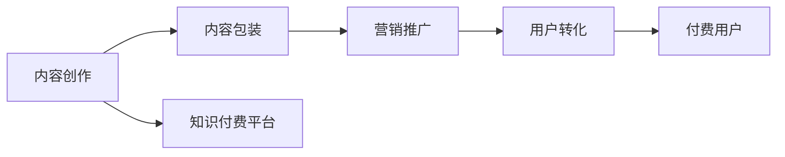
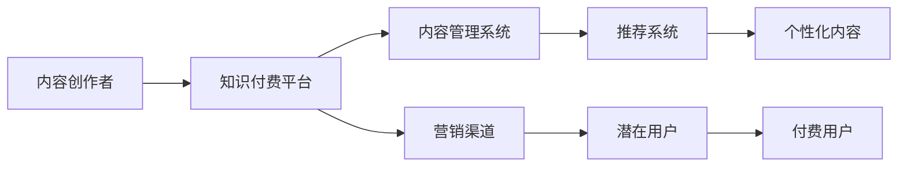

                 

# 知识付费创业中的内容价值链构建

> 关键词：知识付费,内容价值链,价值变现,内容运营,用户转化

## 1. 背景介绍

在数字化时代，知识付费成为互联网行业中一个快速增长的领域。从教育到娱乐，从科技到人文，各种形式的付费内容层出不穷，满足了人们日益增长的知识需求。然而，知识付费领域也面临着内容同质化、用户留存率低、付费转化率不高等问题。为了解决这些问题，内容价值链的构建成为知识付费创业中的关键一环。内容价值链涉及内容创作、价值传递、用户转化等多个环节，通过优化各个环节的协同作用，可以实现内容的价值最大化，提升知识付费平台的竞争力和用户粘性。

## 2. 核心概念与联系

### 2.1 核心概念概述

在知识付费领域，核心概念主要包括以下几个方面：

- **知识付费**：指消费者为获取知识或技能而支付费用的商业模式。知识付费覆盖了从线上课程、电子书到咨询服务等多种形式。

- **内容价值链**：指从内容创作、价值传递到用户转化的整个产业链条，包括内容创作、内容包装、营销推广、用户转化等环节。

- **内容创作**：指知识生产者根据市场需求，创作有价值的内容，包括文章、视频、音频等形式。

- **内容包装**：指对创作的内容进行优化、加工，使其更加符合用户需求，提高内容的吸引力。

- **营销推广**：指通过各种渠道推广内容，吸引潜在用户的关注和付费。

- **用户转化**：指将有意向付费的用户转化为实际付费用户，完成从关注到购买的转化。

这些概念之间的逻辑关系可以通过以下Mermaid流程图来展示：



这个流程图展示了一个典型的知识付费内容价值链：

1. 内容创作：知识生产者根据市场需求，创作内容。
2. 内容包装：对创作的内容进行优化，提高吸引力。
3. 营销推广：通过多种渠道推广内容，吸引用户。
4. 用户转化：将有意向的用户转化为付费用户，完成转化。

### 2.2 核心概念原理和架构的 Mermaid 流程图

这里提供一张简化的Mermaid流程图，展示内容价值链的基本架构：



在这个流程图中：

- 内容创作者（A）通过知识付费平台（B）提交内容，经过内容管理系统（C）进行管理和优化。
- 推荐系统（D）根据用户行为和兴趣推荐个性化内容（E）。
- 营销渠道（F）通过各种方式推广内容，吸引潜在用户（G）。
- 潜在用户通过营销渠道了解内容，最终转化为付费用户（H）。

## 3. 核心算法原理 & 具体操作步骤

### 3.1 算法原理概述

内容价值链的构建涉及多个环节，每个环节都需要通过算法进行优化。以下是内容价值链构建中的核心算法原理：

1. **内容推荐算法**：根据用户的兴趣和行为，推荐最相关的内容。
2. **用户画像构建**：通过用户行为数据，构建详细的用户画像，用于个性化推荐和营销。
3. **内容定价策略**：通过市场调研和用户反馈，制定合理的价格策略，提高付费转化率。
4. **用户行为分析**：分析用户行为数据，识别高价值用户，进行精准营销。

### 3.2 算法步骤详解

以内容推荐算法为例，详细说明其操作步骤：

1. **数据收集**：收集用户的浏览记录、购买记录、评分数据等行为数据。
2. **数据清洗和预处理**：对收集到的数据进行清洗和预处理，去除噪声数据，确保数据的准确性。
3. **特征提取**：从数据中提取有用的特征，如用户兴趣标签、内容主题、时间戳等。
4. **相似度计算**：使用相似度算法（如余弦相似度、Jaccard相似度等）计算内容之间的相似度。
5. **排序与推荐**：根据相似度计算结果，对内容进行排序，生成推荐列表。

### 3.3 算法优缺点

内容推荐算法具有以下优点：

- 提高用户满意度：通过推荐相关内容，满足用户的个性化需求。
- 提升平台营收：通过精准推荐，提高付费转化率，增加平台收入。

其缺点包括：

- 数据隐私问题：需要收集用户行为数据，涉及用户隐私保护问题。
- 计算复杂度高：对于大规模数据集，计算复杂度高，需要高效的算法和硬件支持。
- 过度依赖推荐算法：过分依赖算法可能导致内容同质化，缺乏新鲜感。

### 3.4 算法应用领域

内容推荐算法广泛应用于知识付费平台、电商、社交网络等多个领域，通过精准推荐，提升用户体验和平台收益。

## 4. 数学模型和公式 & 详细讲解 & 举例说明

### 4.1 数学模型构建

内容推荐算法的基本模型包括用户-内容评分矩阵和相似度矩阵，可以用矩阵乘法表示：

设用户集为 $U$，内容集为 $I$，用户对内容的评分矩阵为 $R_{ui}$，其中 $R_{ui}$ 表示用户 $u$ 对内容 $i$ 的评分。相似度矩阵为 $S_{ij}$，其中 $S_{ij}$ 表示内容 $i$ 和内容 $j$ 之间的相似度。

推荐算法的基本模型为：

$$
\hat{R}_{ui} = \sum_{j \in I} R_{uj} S_{ij}
$$

其中 $\hat{R}_{ui}$ 表示用户 $u$ 对内容 $i$ 的推荐评分。

### 4.2 公式推导过程

推导推荐算法的基本公式时，需要考虑以下几个关键步骤：

1. **用户行为矩阵**：将用户对内容的评分转化为用户行为矩阵 $R$，每个元素 $R_{ui}$ 表示用户 $u$ 对内容 $i$ 的评分。

2. **相似度矩阵**：计算内容之间的相似度，生成相似度矩阵 $S$。常见的方法包括余弦相似度、皮尔逊相关系数、Jaccard相似度等。

3. **用户评分预测**：通过相似度矩阵 $S$ 和用户行为矩阵 $R$，预测用户对内容的评分。常用的方法包括基于矩阵分解的方法，如奇异值分解（SVD）、矩阵乘法等。

4. **推荐排序**：根据预测评分对内容进行排序，生成推荐列表。

### 4.3 案例分析与讲解

以YouTube推荐算法为例，分析推荐算法的具体实现。

YouTube推荐算法主要包括以下几个步骤：

1. **数据收集**：收集用户观看记录、评分数据、互动行为等。

2. **特征提取**：从数据中提取有用的特征，如视频主题、时长、观看次数等。

3. **相似度计算**：使用余弦相似度计算视频之间的相似度。

4. **评分预测**：通过矩阵乘法和SVD分解，预测用户对视频的评分。

5. **推荐排序**：根据预测评分对视频进行排序，生成推荐列表。

## 5. 项目实践：代码实例和详细解释说明

### 5.1 开发环境搭建

在进行内容推荐算法开发前，需要准备好开发环境。以下是使用Python进行TensorFlow开发的环境配置流程：

1. 安装Anaconda：从官网下载并安装Anaconda，用于创建独立的Python环境。

2. 创建并激活虚拟环境：
```bash
conda create -n tensorflow-env python=3.7
conda activate tensorflow-env
```

3. 安装TensorFlow：根据CUDA版本，从官网获取对应的安装命令。例如：
```bash
pip install tensorflow==2.6
```

4. 安装TensorBoard：TensorFlow配套的可视化工具，可实时监测模型训练状态，并提供丰富的图表呈现方式。

5. 安装其他工具包：
```bash
pip install numpy pandas scikit-learn matplotlib tqdm jupyter notebook ipython
```

完成上述步骤后，即可在`tensorflow-env`环境中开始开发。

### 5.2 源代码详细实现

以下是使用TensorFlow实现内容推荐算法的PyTorch代码实现：

```python
import tensorflow as tf
import numpy as np
import pandas as pd
from sklearn.model_selection import train_test_split
from sklearn.metrics import mean_squared_error

# 数据集读取
data = pd.read_csv('user_content_ratings.csv')

# 数据清洗和预处理
user_ids = data['user_id'].unique().tolist()
content_ids = data['content_id'].unique().tolist()
user_content_ratings = data[['user_id', 'content_id', 'rating']].values

# 用户行为矩阵
R = np.zeros((len(user_ids), len(content_ids)))
for user, content, rating in user_content_ratings:
    R[user-1, content-1] = rating

# 内容相似度矩阵
S = np.zeros((len(content_ids), len(content_ids)))
for i, j in zip(range(len(content_ids)), range(len(content_ids))):
    S[i, j] = np.abs(R[:, i] - R[:, j]).mean()

# 评分预测
model = tf.keras.Sequential([
    tf.keras.layers.Dense(100, activation='relu'),
    tf.keras.layers.Dense(1)
])
model.compile(optimizer='adam', loss='mse')

# 模型训练
model.fit(S, R, epochs=100, batch_size=32)

# 评分预测
predictions = model.predict(S)

# 评估
mse = mean_squared_error(R.flatten(), predictions.flatten())
print(f"Mean Squared Error: {mse:.4f}")
```

### 5.3 代码解读与分析

让我们再详细解读一下关键代码的实现细节：

**数据集读取和清洗**：
- `pd.read_csv`：读取CSV格式的数据文件。
- `unique`：获取数据集中不重复的值。
- `tolist`：将Series对象转换为列表。

**用户行为矩阵**：
- 根据用户ID和内容ID，生成用户行为矩阵 $R$。
- 遍历数据集，填充用户行为矩阵。

**内容相似度矩阵**：
- 根据用户行为矩阵，计算内容之间的相似度，生成相似度矩阵 $S$。
- 遍历内容ID，计算两两内容之间的相似度。

**评分预测**：
- 定义神经网络模型，包含两个全连接层。
- 编译模型，选择Adam优化器和均方误差损失函数。
- 使用训练数据训练模型，设置epochs和batch size。

**评分预测和评估**：
- 使用训练好的模型预测评分。
- 计算预测评分与真实评分之间的均方误差，评估模型效果。

可以看到，TensorFlow结合了Python和深度学习框架的优势，能够高效地实现内容推荐算法。开发者可以更容易地进行模型调试和性能优化。

## 6. 实际应用场景

### 6.1 视频平台推荐系统

YouTube、Netflix等视频平台广泛应用内容推荐算法，根据用户观看历史和评分，推荐个性化的视频内容。通过精准推荐，平台能够提高用户留存率和付费转化率，增加平台收入。

### 6.2 电商平台个性化推荐

亚马逊、淘宝等电商平台通过内容推荐算法，为用户推荐最相关的商品，提升用户购物体验。通过个性化推荐，平台能够提高销售额，增加用户黏性。

### 6.3 社交网络信息流推荐

Facebook、微信等社交平台通过内容推荐算法，为用户推荐最感兴趣的内容。通过个性化推荐，平台能够提高用户活跃度，增加用户停留时间。

## 7. 工具和资源推荐

### 7.1 学习资源推荐

为了帮助开发者系统掌握内容推荐算法的理论基础和实践技巧，这里推荐一些优质的学习资源：

1. 《推荐系统实战》系列博文：由大模型技术专家撰写，深入浅出地介绍了推荐系统的原理和实现方法。

2. CS229《机器学习》课程：斯坦福大学开设的机器学习经典课程，涵盖推荐系统等内容，是推荐系统学习的必备资源。

3. 《推荐系统》书籍：介绍推荐系统的经典书籍，涵盖各种推荐算法及其应用。

4. Kaggle推荐系统竞赛：通过参与推荐系统竞赛，可以锻炼推荐算法设计和优化能力。

通过对这些资源的学习实践，相信你一定能够快速掌握内容推荐算法的精髓，并用于解决实际的推荐问题。

### 7.2 开发工具推荐

高效的开发离不开优秀的工具支持。以下是几款用于内容推荐算法开发的常用工具：

1. TensorFlow：由Google主导开发的深度学习框架，生产部署方便，适合大规模工程应用。

2. PyTorch：基于Python的开源深度学习框架，灵活动态的计算图，适合快速迭代研究。

3. NumPy：高性能的科学计算库，适合矩阵运算和数据处理。

4. Pandas：数据处理和分析库，适合大规模数据集的读取和处理。

5. Scikit-learn：机器学习库，适合特征工程和模型训练。

6. TensorBoard：TensorFlow配套的可视化工具，可实时监测模型训练状态，提供丰富的图表呈现方式。

合理利用这些工具，可以显著提升内容推荐算法的开发效率，加快创新迭代的步伐。

### 7.3 相关论文推荐

内容推荐技术的发展源于学界的持续研究。以下是几篇奠基性的相关论文，推荐阅读：

1. Large-Scale Parallel Collaborative Filtering for Recommendation：提出基于并行处理的推荐系统，显著提升了推荐效率。

2. Feature-Rank for Sequential Recommendation Systems：提出基于特征和权重排序的推荐方法，提升了推荐精度。

3. Fast Matrix Factorization Techniques for Recommendation Systems：提出矩阵分解优化方法，提高了推荐算法的计算效率。

4. Modeling Implicit Feedback with Nonnegative Matrix Factorization：提出基于非负矩阵分解的推荐方法，适用于无标签数据的推荐。

5. Embedding-Based Recommender Systems：介绍基于嵌入的推荐方法，提升了推荐系统的可解释性。

这些论文代表了大规模推荐系统的技术演进，对推荐系统研究具有重要指导意义。

## 8. 总结：未来发展趋势与挑战

### 8.1 总结

本文对内容推荐算法进行了全面系统的介绍。首先阐述了内容推荐算法在知识付费平台中的应用背景和意义，明确了内容推荐在提升用户体验和平台收益中的重要作用。其次，从原理到实践，详细讲解了推荐算法的数学模型和关键步骤，给出了推荐任务开发的完整代码实例。同时，本文还广泛探讨了推荐算法在视频平台、电商平台、社交网络等多个行业领域的应用前景，展示了推荐范式的广泛潜力。

通过对这些资源的学习实践，相信你一定能够快速掌握内容推荐算法的精髓，并用于解决实际的推荐问题。

### 8.2 未来发展趋势

展望未来，内容推荐算法将呈现以下几个发展趋势：

1. **深度学习范式发展**：深度学习范式将成为推荐算法的主流，通过神经网络实现更加复杂的推荐模型，提升推荐精度。

2. **多模态推荐发展**：未来的推荐系统将不仅基于文本信息，还将整合图像、视频等多模态数据，提升推荐效果。

3. **冷启动问题解决**：通过用户画像构建、协同过滤等方法，解决新用户和新商品的推荐问题。

4. **个性化推荐发展**：推荐系统将更加注重个性化，根据用户的行为和偏好，提供定制化的推荐服务。

5. **推荐效果评估发展**：推荐算法将引入更加综合的评估指标，如用户满意度、留存率、转化率等，衡量推荐效果。

以上趋势凸显了内容推荐算法的广阔前景。这些方向的探索发展，必将进一步提升推荐系统的性能和应用范围，为知识付费平台的成功运营提供重要支撑。

### 8.3 面临的挑战

尽管内容推荐算法已经取得了瞩目成就，但在迈向更加智能化、普适化应用的过程中，它仍面临着诸多挑战：

1. **数据隐私问题**：推荐算法需要收集用户行为数据，涉及用户隐私保护问题。如何保护用户隐私，同时获取有价值的数据，是一大难题。

2. **计算复杂度高**：对于大规模数据集，推荐算法的计算复杂度高，需要高效的算法和硬件支持。

3. **内容同质化问题**：推荐算法可能过度依赖算法本身，导致内容同质化，缺乏新鲜感。如何实现内容多样化，提升用户满意度，还需要进一步优化。

4. **推荐效果评估**：推荐算法的评估指标单一，如何综合考虑用户满意度、留存率、转化率等指标，评价推荐效果，也是一大挑战。

5. **用户行为变化**：用户行为具有动态变化性，推荐算法如何适应变化，持续提供优质的推荐服务，也是一大挑战。

6. **推荐算法公平性**：推荐算法可能存在推荐偏见，如何设计公平、无偏的推荐模型，避免对某些用户或内容的歧视，是一大挑战。

这些挑战需要技术、政策、伦理等多方面的协同努力，才能实现推荐系统的公平、透明、可控。相信随着技术进步和政策完善，内容推荐算法将不断克服这些挑战，为用户提供更加优质的推荐服务。

### 8.4 研究展望

面对内容推荐算法所面临的种种挑战，未来的研究需要在以下几个方面寻求新的突破：

1. **推荐算法优化**：开发更加高效的推荐算法，如基于深度学习的推荐模型，提高推荐精度和计算效率。

2. **多模态推荐**：整合图像、视频等多模态数据，实现更全面的推荐服务。

3. **用户画像构建**：通过多种数据源构建详细的用户画像，实现个性化推荐。

4. **推荐算法公平性**：设计公平、无偏的推荐模型，避免对某些用户或内容的歧视。

5. **推荐算法透明性**：提高推荐算法的可解释性，增强用户对推荐结果的信任。

6. **推荐效果评估**：引入更加综合的评估指标，综合考虑用户满意度、留存率、转化率等指标，评价推荐效果。

这些研究方向的探索，必将引领内容推荐技术迈向更高的台阶，为知识付费平台的成功运营提供重要支撑。面向未来，内容推荐技术还需要与其他人工智能技术进行更深入的融合，如知识表示、因果推理、强化学习等，多路径协同发力，共同推动知识付费平台的进步。

## 9. 附录：常见问题与解答

**Q1：如何构建详细的用户画像？**

A: 构建详细的用户画像需要收集多方面的数据，如用户基本信息、行为数据、兴趣偏好等。通过数据分析和特征提取，形成用户画像。常用的方法包括聚类分析、因子分析等。

**Q2：如何解决推荐算法中的冷启动问题？**

A: 冷启动问题可以通过协同过滤、基于内容的推荐等方法解决。协同过滤方法利用已有用户行为数据，对新用户和新商品进行推荐。基于内容的推荐方法通过分析商品的属性和特征，推荐相似的商品。

**Q3：如何提高推荐算法的计算效率？**

A: 提高推荐算法的计算效率需要采用高效的数据结构和算法，如矩阵分解、特征选择等。同时，合理配置计算资源，如使用GPU、分布式计算等，提升计算速度。

**Q4：如何衡量推荐算法的推荐效果？**

A: 推荐算法的推荐效果可以通过多种指标衡量，如均方误差、平均绝对误差、准确率等。此外，还可以通过用户满意度、留存率、转化率等综合指标，全面评价推荐效果。

**Q5：如何提升推荐算法的公平性？**

A: 提升推荐算法的公平性需要从数据采集、模型设计、结果评估等多个环节进行优化。保证数据采集的公平性，避免数据偏差。设计公平、无偏的推荐模型，如使用公平性约束等。评估推荐结果的公平性，确保对所有用户的推荐公平公正。

这些问题的解答，可以为内容推荐算法的开发和优化提供指导，帮助知识付费平台构建更加公平、透明、可控的推荐系统。

---

作者：禅与计算机程序设计艺术 / Zen and the Art of Computer Programming

