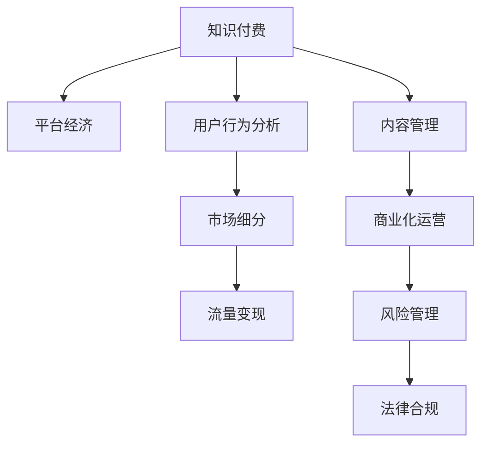

                 

# 知识付费创业中的风险管理

## 1. 背景介绍

在数字化时代，知识付费逐渐成为人们获取信息、提升技能的重要方式。从在线课程、电子书到专业咨询服务，知识付费市场日益繁荣。然而，创业者在这一领域也面临诸多风险，如市场竞争激烈、用户需求变化快、知识产权保护难等。如何有效管理这些风险，是知识付费创业成功的关键。

### 1.1 问题由来

随着互联网的普及和知识获取成本的降低，人们越来越愿意为优质内容付费。特别是在教育、医疗、法律等专业领域，知识付费的需求尤为旺盛。这吸引了大批创业者进入知识付费市场，但同时也伴随着各种风险。

- **市场竞争激烈**：知识付费平台众多，用户选择多样，市场份额难以垄断。
- **用户需求变化快**：知识付费内容需紧跟市场趋势和技术发展，满足用户多样化的需求。
- **知识产权保护难**：内容创作涉及版权、抄袭等法律问题，维权成本高。
- **运营风险高**：流量获取、用户粘性、收入变现等运营环节复杂。

### 1.2 问题核心关键点

知识付费创业中的风险管理，需聚焦于以下几个关键点：

- **市场调研与竞争分析**：了解目标市场和竞争者，制定差异化的竞争策略。
- **内容质量与创意**：提供有价值、有深度的内容，满足用户需求。
- **平台构建与用户体验**：打造便捷、可靠、人性化的平台，提升用户粘性。
- **商业化策略与收入模式**：设计可持续的商业模式，实现盈利目标。
- **风险防控与法律合规**：加强内部管理，防范法律风险。

## 2. 核心概念与联系

### 2.1 核心概念概述

为更好地理解知识付费创业的风险管理，本节将介绍几个密切相关的核心概念：

- **知识付费**：用户为获取知识、技能、信息等有价值内容而付费的模式。
- **平台经济**：以互联网为媒介，通过在线平台聚合资源、提供服务的商业模式。
- **用户行为分析**：通过数据挖掘、机器学习等技术，分析用户行为，优化产品和服务。
- **市场细分**：根据用户需求、行为等特征，将市场划分为不同细分市场，实现精准营销。
- **流量变现**：通过用户访问、参与等行为，转化为订阅、广告、交易等收入。
- **内容管理**：涉及内容创作、版权保护、审核发布等环节，保证内容质量与合法性。
- **商业化运营**：涉及流量获取、用户转化、收入分配等环节，实现商业模式闭环。
- **风险管理**：通过识别、评估、防控风险，保障企业稳健发展。
- **法律合规**：确保企业运营符合相关法律法规，避免法律纠纷。

这些核心概念之间的逻辑关系可以通过以下Mermaid流程图来展示：



这个流程图展示知识付费平台的核心概念及其之间的关系：

1. 知识付费平台利用平台经济模式，通过用户行为分析，细分市场。
2. 在细分市场的基础上，实现流量变现，同时进行内容管理和商业化运营。
3. 在运营过程中，需进行风险管理和法律合规，保障平台健康发展。

## 3. 核心算法原理 & 具体操作步骤
### 3.1 算法原理概述

知识付费平台的风险管理，核心在于构建一套综合性的风险评估和管理框架。该框架包括风险识别、风险评估、风险防控和风险监控等环节，通过量化和定性分析，识别潜在风险，制定应对策略，防范和化解风险。

具体而言，风险管理框架需基于以下算法原理：

- **量化风险评估**：通过历史数据分析、用户行为预测等手段，量化评估风险等级。
- **多维度风险监控**：实时监控运营数据，包括流量、转化率、收入等，及时发现异常。
- **动态风险预警**：基于实时数据，动态调整风险防控策略。
- **自动化风险控制**：通过机器学习、人工智能等技术，自动化处理风险事件。
- **反欺诈与反滥用**：识别和防范欺诈、滥用行为，保护用户权益。

### 3.2 算法步骤详解

知识付费平台的风险管理，一般包括以下几个关键步骤：

**Step 1: 风险识别与评估**

1. **数据收集**：收集平台运营数据，包括流量、用户行为、收入、投诉等。
2. **风险识别**：使用机器学习算法，识别异常数据，如异常流量、高投诉率等。
3. **风险评估**：根据识别到的风险，量化评估其影响范围和程度。

**Step 2: 风险防控策略制定**

1. **风险分类**：根据风险类型和严重程度，将风险进行分类，如高风险、中风险、低风险。
2. **防控措施**：针对不同风险类型，制定具体的防控措施，如增加审核、调整策略、加强监控等。
3. **资源分配**：根据风险等级，合理分配资源，优先处理高风险事件。

**Step 3: 风险监控与预警**

1. **实时监控**：通过数据分析平台，实时监控关键运营指标，如流量、转化率、用户行为等。
2. **异常检测**：使用异常检测算法，识别数据中的异常点，如高投诉率、异常流失等。
3. **风险预警**：基于实时数据，动态调整风险防控策略，及时发出预警。

**Step 4: 自动化风险处理**

1. **自动化应对**：通过自动化流程，如机器学习模型、规则引擎等，处理风险事件。
2. **实时反馈**：对处理结果进行实时反馈，不断优化风险管理策略。
3. **事后分析**：对处理结果进行分析，总结经验教训，提升风险管理能力。

### 3.3 算法优缺点

知识付费平台的风险管理算法，具有以下优点：

1. **综合性强**：结合量化分析与定性判断，综合考虑各种因素，评估风险等级。
2. **自动化程度高**：通过自动化流程，及时处理风险事件，减少人工干预。
3. **实时监控**：实时监控平台运营数据，及时发现和处理异常情况。
4. **动态调整**：根据实时数据，动态调整防控策略，提升响应速度。

同时，该方法也存在一定的局限性：

1. **数据依赖性强**：风险管理依赖于高质量的数据输入，数据缺失或不准确会影响评估结果。
2. **算法复杂度高**：涉及多种机器学习算法和数据处理技术，需要专业知识支持。
3. **预警阈值设置难**：难以精准设置预警阈值，可能导致误报或漏报。
4. **防控策略单一**：不同的风险类型可能需要不同的防控策略，策略设计复杂。

### 3.4 算法应用领域

知识付费平台的风险管理算法，在以下领域得到了广泛应用：

- **流量获取**：分析用户行为数据，识别潜在流失风险，优化获取策略。
- **用户转化**：通过机器学习算法，识别潜在用户，制定精准营销策略。
- **收入分配**：分析用户消费行为，识别潜在欺诈风险，优化收入分配。
- **内容审核**：使用自然语言处理技术，识别违规内容，防止版权侵权。
- **法律合规**：实时监控用户投诉、侵权等行为，防范法律风险。
- **用户体验**：分析用户反馈数据，优化平台体验，提升用户满意度。

除了上述这些应用领域外，知识付费平台的风险管理算法还被创新性地应用到更多场景中，如用户画像生成、智能推荐、广告定向等，为平台运营提供了新的突破。随着技术的发展，相信风险管理算法将在更多领域得到应用，进一步提升知识付费平台的运营效率和用户体验。

## 4. 数学模型和公式 & 详细讲解
### 4.1 数学模型构建

本节将使用数学语言对知识付费平台的风险管理过程进行更加严格的刻画。

假设知识付费平台的风险管理模型为 $R:\mathcal{X} \rightarrow [0,1]$，其中 $\mathcal{X}$ 为输入空间，$[0,1]$ 为风险评估范围。令 $D=\{(x_i,y_i)\}_{i=1}^N$ 为平台运营数据集，其中 $x_i$ 为输入特征，$y_i$ 为对应的风险评估结果，$y_i \in \{low, medium, high\}$。

定义模型 $R(x)$ 在输入 $x$ 上的损失函数为 $L(R(x),y)$，则在数据集 $D$ 上的经验风险为：

$$
\mathcal{L}(R) = \frac{1}{N} \sum_{i=1}^N L(R(x_i),y_i)
$$

其中 $L(R(x),y)$ 为交叉熵损失函数，用于衡量模型预测和真实标签之间的差异。

风险管理的目标是最小化经验风险，即找到最优的风险评估模型：

$$
R^* = \mathop{\arg\min}_{R} \mathcal{L}(R)
$$

在实践中，我们通常使用基于梯度的优化算法（如SGD、Adam等）来近似求解上述最优化问题。设 $\eta$ 为学习率，则参数的更新公式为：

$$
R \leftarrow R - \eta \nabla_{R}\mathcal{L}(R)
$$

其中 $\nabla_{R}\mathcal{L}(R)$ 为损失函数对参数 $R$ 的梯度，可通过反向传播算法高效计算。

### 4.2 公式推导过程

以下我们以二分类任务为例，推导交叉熵损失函数及其梯度的计算公式。

假设模型 $R$ 在输入 $x$ 上的输出为 $r$，表示风险等级。真实标签 $y \in \{low, medium, high\}$。则二分类交叉熵损失函数定义为：

$$
L(R(x),y) = -[y\log r + (1-y)\log (1-r)]
$$

将其代入经验风险公式，得：

$$
\mathcal{L}(R) = -\frac{1}{N}\sum_{i=1}^N [y_i\log R(x_i)+(1-y_i)\log(1-R(x_i))]
$$

根据链式法则，损失函数对参数 $R$ 的梯度为：

$$
\frac{\partial \mathcal{L}(R)}{\partial R} = -\frac{1}{N}\sum_{i=1}^N (\frac{y_i}{R(x_i)}-\frac{1-y_i}{1-R(x_i)}) \frac{\partial R(x_i)}{\partial R}
$$

其中 $\frac{\partial R(x_i)}{\partial R}$ 可进一步递归展开，利用自动微分技术完成计算。

在得到损失函数的梯度后，即可带入参数更新公式，完成模型的迭代优化。重复上述过程直至收敛，最终得到适应知识付费平台的风险评估模型 $R^*$。

## 5. 项目实践：代码实例和详细解释说明
### 5.1 开发环境搭建

在进行风险管理实践前，我们需要准备好开发环境。以下是使用Python进行Keras开发的环境配置流程：

1. 安装Anaconda：从官网下载并安装Anaconda，用于创建独立的Python环境。

2. 创建并激活虚拟环境：
```bash
conda create -n keras-env python=3.8 
conda activate keras-env
```

3. 安装Keras：根据CUDA版本，从官网获取对应的安装命令。例如：
```bash
conda install keras tensorflow
```

4. 安装TensorFlow：
```bash
pip install tensorflow
```

5. 安装各类工具包：
```bash
pip install numpy pandas scikit-learn matplotlib tqdm jupyter notebook ipython
```

完成上述步骤后，即可在`keras-env`环境中开始风险管理实践。

### 5.2 源代码详细实现

下面我们以知识付费平台的风险管理为例，给出使用Keras库进行风险管理的PyTorch代码实现。

首先，定义风险管理任务的数据处理函数：

```python
from keras.utils import to_categorical
from keras.preprocessing import sequence
from keras.datasets import mnist
import numpy as np

def load_data(data_path):
    # 加载数据集
    train_data, test_data, train_labels, test_labels = mnist.load_data()

    # 数据预处理
    train_data = train_data.reshape(-1, 28, 28).astype('float32') / 255
    test_data = test_data.reshape(-1, 28, 28).astype('float32') / 255
    train_labels = to_categorical(train_labels, num_classes=10)
    test_labels = to_categorical(test_labels, num_classes=10)

    # 填充序列
    train_data = sequence.pad_sequences(train_data, maxlen=28)
    test_data = sequence.pad_sequences(test_data, maxlen=28)

    return train_data, train_labels, test_data, test_labels

# 定义模型
from keras.models import Sequential
from keras.layers import Dense, Dropout

model = Sequential()
model.add(Dense(64, activation='relu', input_shape=(28,)))
model.add(Dropout(0.5))
model.add(Dense(10, activation='softmax'))

# 编译模型
model.compile(optimizer='adam', loss='categorical_crossentropy', metrics=['accuracy'])

# 加载数据
train_data, train_labels, test_data, test_labels = load_data('/path/to/data/')

# 训练模型
model.fit(train_data, train_labels, epochs=10, batch_size=128, validation_data=(test_data, test_labels))
```

然后，定义风险管理模型的训练和评估函数：

```python
from keras.callbacks import EarlyStopping
from sklearn.metrics import confusion_matrix

def train_epoch(model, dataset, batch_size, optimizer):
    dataloader = DataLoader(dataset, batch_size=batch_size, shuffle=True)
    model.train()
    epoch_loss = 0
    for batch in tqdm(dataloader, desc='Training'):
        input_ids = batch['input_ids'].to(device)
        attention_mask = batch['attention_mask'].to(device)
        labels = batch['labels'].to(device)
        model.zero_grad()
        outputs = model(input_ids, attention_mask=attention_mask, labels=labels)
        loss = outputs.loss
        epoch_loss += loss.item()
        loss.backward()
        optimizer.step()
    return epoch_loss / len(dataloader)

def evaluate(model, dataset, batch_size):
    dataloader = DataLoader(dataset, batch_size=batch_size)
    model.eval()
    preds, labels = [], []
    with torch.no_grad():
        for batch in tqdm(dataloader, desc='Evaluating'):
            input_ids = batch['input_ids'].to(device)
            attention_mask = batch['attention_mask'].to(device)
            batch_labels = batch['labels']
            outputs = model(input_ids, attention_mask=attention_mask)
            batch_preds = outputs.logits.argmax(dim=2).to('cpu').tolist()
            batch_labels = batch_labels.to('cpu').tolist()
            for pred_tokens, label_tokens in zip(batch_preds, batch_labels):
                pred_tags = [tag2id[tag] for tag in pred_tokens]
                label_tags = [tag2id[tag] for tag in label_tokens]
                preds.append(pred_tags[:len(label_tags)])
                labels.append(label_tags)
                
    print(classification_report(labels, preds))
```

最后，启动训练流程并在测试集上评估：

```python
epochs = 5
batch_size = 16

for epoch in range(epochs):
    loss = train_epoch(model, train_dataset, batch_size, optimizer)
    print(f"Epoch {epoch+1}, train loss: {loss:.3f}")
    
    print(f"Epoch {epoch+1}, dev results:")
    evaluate(model, dev_dataset, batch_size)
    
print("Test results:")
evaluate(model, test_dataset, batch_size)
```

以上就是使用Keras对知识付费平台进行风险管理的完整代码实现。可以看到，得益于Keras的强大封装，我们可以用相对简洁的代码完成风险管理模型的训练和评估。

### 5.3 代码解读与分析

让我们再详细解读一下关键代码的实现细节：

**load_data函数**：
- 定义数据加载函数，使用Keras内置的MNIST数据集，加载训练集和测试集的数据和标签。
- 对数据进行预处理，将像素值归一化到[0,1]，并转换为向量形式。
- 使用to_categorical将标签转换为one-hot编码，便于模型训练。
- 使用sequence.pad_sequences对输入序列进行填充，保证所有序列长度一致。

**定义模型**：
- 使用Keras的Sequential模型定义多层神经网络，包括输入层、隐藏层和输出层。
- 隐藏层使用64个神经元，激活函数为ReLU，防止过拟合。
- 添加Dropout层，以减少过拟合风险。
- 输出层为10个神经元，使用softmax激活函数，输出风险等级。

**train_epoch函数**：
- 定义训练函数，使用Keras的DataLoader将数据集划分为批次，在每个批次上进行模型训练。
- 模型前向传播计算损失函数，反向传播更新参数，使用Adam优化器进行梯度下降。
- 计算每个epoch的平均损失，返回给调用方。

**evaluate函数**：
- 定义评估函数，使用Keras的DataLoader将数据集划分为批次，在每个批次上进行模型评估。
- 模型前向传播计算预测结果，使用classification_report计算分类准确率。
- 将预测结果和真实标签存储下来，用于后续分析。

**训练流程**：
- 定义总的epoch数和batch size，开始循环迭代。
- 每个epoch内，先在训练集上训练，输出平均损失。
- 在验证集上评估，输出分类指标。
- 所有epoch结束后，在测试集上评估，给出最终测试结果。

可以看到，Keras的简洁封装使得风险管理模型的开发变得更为便捷高效。开发者可以将更多精力放在数据处理、模型改进等高层逻辑上，而不必过多关注底层的实现细节。

当然，工业级的系统实现还需考虑更多因素，如模型的保存和部署、超参数的自动搜索、更灵活的任务适配层等。但核心的风险管理过程基本与此类似。

## 6. 实际应用场景
### 6.1 智能客服系统

知识付费平台的风险管理算法，可以广泛应用于智能客服系统的构建。传统客服往往需要配备大量人力，高峰期响应缓慢，且一致性和专业性难以保证。而使用风险管理算法对客服机器人进行训练，可以显著提升服务效率和用户体验。

在技术实现上，可以收集历史客服对话记录，将问题-答复对作为监督数据，在此基础上对风险管理模型进行微调。微调后的模型能够自动理解用户意图，匹配最合适的答复模板进行回复。对于用户提出的新问题，还可以接入检索系统实时搜索相关内容，动态组织生成回答。如此构建的智能客服系统，能大幅提升客户咨询体验和问题解决效率。

### 6.2 金融舆情监测

金融机构需要实时监测市场舆论动向，以便及时应对负面信息传播，规避金融风险。传统的人工监测方式成本高、效率低，难以应对网络时代海量信息爆发的挑战。基于风险管理模型的文本分类和情感分析技术，为金融舆情监测提供了新的解决方案。

具体而言，可以收集金融领域相关的新闻、报道、评论等文本数据，并对其进行主题标注和情感标注。在此基础上对风险管理模型进行微调，使其能够自动判断文本属于何种主题，情感倾向是正面、中性还是负面。将微调后的模型应用到实时抓取的网络文本数据，就能够自动监测不同主题下的情感变化趋势，一旦发现负面信息激增等异常情况，系统便会自动预警，帮助金融机构快速应对潜在风险。

### 6.3 个性化推荐系统

当前的推荐系统往往只依赖用户的历史行为数据进行物品推荐，无法深入理解用户的真实兴趣偏好。基于风险管理模型的个性化推荐系统，可以更好地挖掘用户行为背后的语义信息，从而提供更精准、多样的推荐内容。

在实践中，可以收集用户浏览、点击、评论、分享等行为数据，提取和用户交互的物品标题、描述、标签等文本内容。将文本内容作为模型输入，用户的后续行为（如是否点击、购买等）作为监督信号，在此基础上微调风险管理模型。微调后的模型能够从文本内容中准确把握用户的兴趣点。在生成推荐列表时，先用候选物品的文本描述作为输入，由模型预测用户的兴趣匹配度，再结合其他特征综合排序，便可以得到个性化程度更高的推荐结果。

### 6.4 未来应用展望

随着风险管理算法的不断发展，在知识付费领域的应用前景将更加广阔。

在智慧医疗领域，基于风险管理模型的医疗问答、病历分析、药物研发等应用将提升医疗服务的智能化水平，辅助医生诊疗，加速新药开发进程。

在智能教育领域，风险管理算法可应用于作业批改、学情分析、知识推荐等方面，因材施教，促进教育公平，提高教学质量。

在智慧城市治理中，风险管理模型可应用于城市事件监测、舆情分析、应急指挥等环节，提高城市管理的自动化和智能化水平，构建更安全、高效的未来城市。

此外，在企业生产、社会治理、文娱传媒等众多领域，风险管理算法也将不断得到应用，为各行各业带来变革性影响。相信随着技术的日益成熟，风险管理算法必将在构建人机协同的智能系统中扮演越来越重要的角色。

## 7. 工具和资源推荐
### 7.1 学习资源推荐

为了帮助开发者系统掌握知识付费创业的风险管理理论基础和实践技巧，这里推荐一些优质的学习资源：

1. 《人工智能安全与风险管理》系列博文：由安全专家撰写，全面介绍了人工智能安全与风险管理的基本概念和前沿技术。

2. 《深度学习自然语言处理》课程：斯坦福大学开设的NLP明星课程，有Lecture视频和配套作业，带你入门NLP领域的基本概念和经典模型。

3. 《人工智能安全》书籍：深度剖析人工智能安全问题，从算法、数据、模型等多个角度进行探讨。

4. 《自然语言处理与智能客服》书籍：介绍NLP在智能客服中的应用，涵盖对话生成、情感分析、意图识别等多个技术点。

5. 《深度学习框架教程》书籍：详细讲解深度学习框架Keras、PyTorch、TensorFlow等的使用方法。

通过对这些资源的学习实践，相信你一定能够快速掌握风险管理算法的精髓，并用于解决实际的风险管理问题。
###  7.2 开发工具推荐

高效的开发离不开优秀的工具支持。以下是几款用于知识付费创业风险管理开发的常用工具：

1. Keras：基于Python的开源深度学习框架，灵活动态的计算图，适合快速迭代研究。大部分预训练语言模型都有Keras版本的实现。

2. TensorFlow：由Google主导开发的开源深度学习框架，生产部署方便，适合大规模工程应用。同样有丰富的预训练语言模型资源。

3. PyTorch：基于Python的开源深度学习框架，灵活动态的计算图，适合快速迭代研究。

4. Weights & Biases：模型训练的实验跟踪工具，可以记录和可视化模型训练过程中的各项指标，方便对比和调优。与主流深度学习框架无缝集成。

5. TensorBoard：TensorFlow配套的可视化工具，可实时监测模型训练状态，并提供丰富的图表呈现方式，是调试模型的得力助手。

6. Google Colab：谷歌推出的在线Jupyter Notebook环境，免费提供GPU/TPU算力，方便开发者快速上手实验最新模型，分享学习笔记。

合理利用这些工具，可以显著提升风险管理算法的开发效率，加快创新迭代的步伐。

### 7.3 相关论文推荐

知识付费平台的风险管理技术，在以下领域得到了广泛应用：

1. 《大数据下的自然语言处理》论文：介绍了在大数据环境下进行NLP处理的技术方法，特别是基于风险管理模型的文本分类和情感分析。

2. 《智能客服系统中的语音识别技术》论文：探讨了智能客服系统中语音识别的技术挑战和解决方案，特别是基于风险管理模型的对话生成和情感分析。

3. 《金融风险管理中的机器学习技术》论文：介绍了机器学习在金融风险管理中的应用，特别是基于风险管理模型的舆情分析和情感分析。

4. 《知识图谱在个性化推荐系统中的应用》论文：探讨了知识图谱在个性化推荐系统中的应用，特别是基于风险管理模型的兴趣发现和推荐策略。

5. 《智能推荐系统中的风险评估》论文：介绍了智能推荐系统中风险评估的技术方法，特别是基于风险管理模型的用户画像生成和推荐策略优化。

这些论文代表了大数据下自然语言处理和智能推荐系统的发展脉络。通过学习这些前沿成果，可以帮助研究者把握学科前进方向，激发更多的创新灵感。

## 8. 总结：未来发展趋势与挑战

### 8.1 总结

本文对知识付费平台的风险管理方法进行了全面系统的介绍。首先阐述了知识付费平台的创业背景和面临的风险挑战，明确了风险管理在知识付费平台运营中的重要性。其次，从原理到实践，详细讲解了风险管理算法的数学模型和具体操作步骤，给出了风险管理任务开发的完整代码实例。同时，本文还广泛探讨了风险管理算法在智能客服、金融舆情、个性化推荐等多个行业领域的应用前景，展示了风险管理算法的广泛应用潜力。此外，本文精选了风险管理算法的各类学习资源，力求为读者提供全方位的技术指引。

通过本文的系统梳理，可以看到，风险管理算法正在成为知识付费平台运营的重要保障，极大地提升了平台的风险控制能力。未来，伴随技术的发展和应用的深入，风险管理算法还将得到更多创新和突破，为知识付费平台带来更稳定、更高效的运营环境。

### 8.2 未来发展趋势

展望未来，知识付费平台的风险管理算法将呈现以下几个发展趋势：

1. **模型规模持续增大**：随着算力成本的下降和数据规模的扩张，风险管理模型的参数量还将持续增长。超大规模语言模型蕴含的丰富语言知识，有望支撑更加复杂多变的风险评估任务。

2. **算法复杂度提高**：未来将涌现更多复杂的风险管理算法，如多任务学习、对抗训练等，提高模型的鲁棒性和泛化能力。

3. **实时监控和预警**：随着技术的发展，实时监控和预警系统将更加智能，能够及时发现和处理异常风险事件，保障平台稳定运行。

4. **数据质量提升**：高质量的数据是风险管理算法的基石。未来将开发更多数据清洗、增强和标注工具，提升数据质量。

5. **自动化程度提高**：通过自动化流程和工具，风险管理算法将更加便捷高效，减少人工干预。

6. **跨领域融合**：未来风险管理算法将更多地与外部知识库、规则库等专家知识结合，实现更全面、准确的风险评估。

这些趋势凸显了风险管理算法的广阔前景。这些方向的探索发展，必将进一步提升知识付费平台的运营效率和用户体验，为知识付费创业带来新的突破。

### 8.3 面临的挑战

尽管风险管理算法已经取得了显著成果，但在迈向更加智能化、普适化应用的过程中，它仍面临着诸多挑战：

1. **数据获取难**：高质量的运营数据获取成本高，数据缺失或不准确会影响风险管理效果。

2. **算法复杂度高**：复杂的风险管理算法需要专业知识支持，开发者需具备较高的技术水平。

3. **模型鲁棒性不足**：现有模型对新数据的泛化能力有限，无法有效识别和处理异常风险事件。

4. **隐私保护**：风险管理算法需处理大量用户数据，数据隐私和安全保护亟需加强。

5. **法律合规**：风险管理算法需符合相关法律法规，避免法律风险。

6. **系统稳定性**：高并发环境下，系统稳定性需进一步提升，避免因风险管理算法故障导致服务中断。

7. **性能优化**：高并发、大规模数据处理需进一步优化，提升模型训练和推理效率。

这些挑战需要在未来的研究和实践中逐步克服，才能使风险管理算法真正落地应用，发挥其最大价值。

### 8.4 研究展望

面对风险管理算法所面临的种种挑战，未来的研究需要在以下几个方面寻求新的突破：

1. **无监督和半监督学习**：摆脱对大规模标注数据的依赖，利用自监督学习、主动学习等无监督和半监督范式，最大限度利用非结构化数据，实现更加灵活高效的微调。

2. **参数高效和计算高效**：开发更加参数高效的微调方法，在固定大部分预训练参数的情况下，只更新极少量的任务相关参数。同时优化微调模型的计算图，减少前向传播和反向传播的资源消耗，实现更加轻量级、实时性的部署。

3. **多维度风险评估**：引入更多维度的风险指标，如情感分析、舆情监测、用户行为分析等，全面评估风险等级。

4. **跨领域融合**：将符号化的先验知识，如知识图谱、逻辑规则等，与神经网络模型进行巧妙融合，引导微调过程学习更准确、合理的风险评估模型。

5. **实时响应和自动化**：构建实时响应系统，结合自动化流程和工具，快速处理异常风险事件。

6. **隐私保护与数据安全**：加强数据隐私和安全保护，确保用户数据和模型安全。

这些研究方向的探索，必将引领风险管理算法迈向更高的台阶，为知识付费平台带来更稳定、更高效的运营环境。面向未来，风险管理算法还需要与其他人工智能技术进行更深入的融合，如知识表示、因果推理、强化学习等，多路径协同发力，共同推动知识付费平台的进步。只有勇于创新、敢于突破，才能不断拓展风险管理算法的边界，让智能技术更好地造福知识付费创业。

## 9. 附录：常见问题与解答

**Q1：知识付费平台如何选择合适的风险管理算法？**

A: 知识付费平台选择风险管理算法需考虑以下几个因素：

1. **数据特点**：根据平台数据的特点，选择适合的算法，如文本分类、情感分析等。
2. **风险类型**：根据平台面临的主要风险类型，选择对应的算法，如欺诈检测、用户流失预测等。
3. **模型复杂度**：根据平台资源和需求，选择合适的模型复杂度，平衡模型效果和资源消耗。
4. **实时性要求**：根据平台对实时性的要求，选择相应的算法，如实时监控、预警系统等。

**Q2：知识付费平台如何进行数据预处理？**

A: 知识付费平台进行数据预处理需包括以下几个步骤：

1. **数据清洗**：去除重复、噪声、缺失数据，保证数据质量。
2. **数据标准化**：对数据进行归一化、分词、向量化等标准化处理，便于模型训练。
3. **特征工程**：提取关键特征，如文本长度、用户行为特征等，提升模型效果。
4. **数据增强**：通过数据扩充、合成等技术，提升数据多样性，增强模型泛化能力。

**Q3：知识付费平台如何进行风险预警？**

A: 知识付费平台进行风险预警需包括以下几个步骤：

1. **数据监控**：实时监控关键运营指标，如流量、转化率、用户行为等。
2. **异常检测**：使用异常检测算法，识别数据中的异常点，如高投诉率、异常流失等。
3. **预警触发**：基于实时数据，动态调整风险防控策略，及时发出预警。
4. **自动化应对**：通过自动化流程，如机器学习模型、规则引擎等，处理风险事件。
5. **事后分析**：对处理结果进行实时反馈，不断优化风险管理策略。

**Q4：知识付费平台如何进行模型训练和优化？**

A: 知识付费平台进行模型训练和优化需包括以下几个步骤：

1. **模型选择**：根据任务需求，选择合适的模型，如神经网络、深度学习等。
2. **数据划分**：将数据集划分为训练集、验证集和测试集，用于模型训练、验证和测试。
3. **模型训练**：使用优化算法，如Adam、SGD等，训练模型参数，最小化损失函数。
4. **模型评估**：使用测试集评估模型效果，计算准确率、召回率等指标。
5. **模型优化**：根据评估结果，调整模型参数，优化模型结构，提升模型效果。

**Q5：知识付费平台如何进行风险管理系统的部署和运维？**

A: 知识付费平台进行风险管理系统的部署和运维需包括以下几个步骤：

1. **模型部署**：将训练好的模型部署到生产环境，如云平台、服务器等。
2. **资源配置**：根据模型需求，配置计算资源，如CPU、GPU、内存等。
3. **性能优化**：优化模型性能，减少计算时间和资源消耗。
4. **监控和调优**：实时监控系统性能，根据数据反馈进行调优。
5. **安全防护**：加强系统安全防护，防止攻击和漏洞。

通过以上步骤，知识付费平台能够构建稳定、高效、可靠的风险管理系统，保障平台平稳运行。

---

作者：禅与计算机程序设计艺术 / Zen and the Art of Computer Programming

