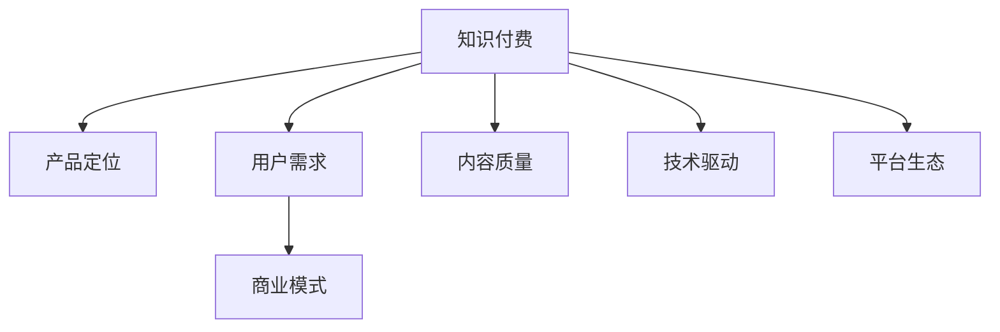

                 

# 知识付费创业的产品定位策略

> 关键词：知识付费, 产品定位, 用户需求, 商业模式, 内容质量, 技术驱动, 平台生态

## 1. 背景介绍

### 1.1 问题由来
随着移动互联网和智能设备的普及，知识付费市场迎来了爆发式增长。各类知识付费平台如喜马拉雅、得到、极客时间等纷纷涌现，其用户规模和使用频次显著提升。然而，知识付费市场也面临着诸多挑战，包括内容质量参差不齐、用户体验不佳、付费转化率低等。如何在竞争激烈的市场中取得优势，找到有效的产品定位策略，成为了知识付费创业者的重要课题。

### 1.2 问题核心关键点
知识付费创业的产品定位策略，本质上是如何在复杂多变的环境下，精准识别目标用户需求，并据此设计出满足用户期望、具备差异化竞争优势的产品和服务。具体来说，包括：
- 明确目标用户群体：识别具有强烈学习需求和付费意愿的用户。
- 构建独特的价值主张：与竞争对手区分，满足用户独一无二的需求。
- 设计合理的价格策略：确保产品价格能够覆盖成本，同时吸引用户。
- 优化内容质量和形式：通过优质内容和高价值输出，提高用户粘性。
- 利用技术手段提升用户体验：利用大数据、AI等技术，优化产品功能。
- 构建完善的平台生态：吸引用户并保持活跃，提升产品竞争力。

## 2. 核心概念与联系

### 2.1 核心概念概述

为更好地理解知识付费创业的产品定位策略，本节将介绍几个密切相关的核心概念：

- 知识付费（Knowledge-Pay）：用户为获取知识、技能、经验等内容而支付费用的行为。包括在线课程、音频视频、电子书、专家问答等多种形式。
- 产品定位（Product Positioning）：产品策划者根据市场需求、竞争状况等因素，确定产品定位，以便在目标用户心中建立特定的形象和认知。
- 用户需求（User Demand）：用户在使用产品和服务时所产生的需求，包括功能需求、情感需求、信息需求等。
- 商业模式（Business Model）：企业为实现利润而采取的一系列运营活动，包括盈利方式、价值主张、成本结构等。
- 内容质量（Content Quality）：产品中提供的知识和信息内容的准确性、深度、原创性等。
- 技术驱动（Tech-Driven）：利用技术手段（如大数据、AI、区块链等）提升产品功能和用户体验。
- 平台生态（Platform Ecosystem）：一个产品围绕自身，吸引各类用户、内容创作者、技术服务商，形成一个完整的、良性循环的生态系统。

这些核心概念之间的逻辑关系可以通过以下Mermaid流程图来展示：



这个流程图展示了一个典型的知识付费产品从需求分析到生态构建的全流程。

## 3. 核心算法原理 & 具体操作步骤
### 3.1 算法原理概述

知识付费创业的产品定位策略，基于市场调研、用户需求分析、竞争分析、商业模式设计等综合考量。其核心思想是：通过精准识别目标用户，设计符合其需求的产品，制定合理的价格策略，以技术手段优化产品功能，构建完善的平台生态，从而实现商业价值的最大化。

形式化地，假设目标用户群体为 $U$，产品为 $P$，定价策略为 $Pricing$，内容质量为 $Quality$，技术驱动为 $Tech$，平台生态为 $Ecosystem$，产品定位策略为 $Position$。则定义目标函数为：

$$
\max_{Position} \quad U(P, Pricing, Quality, Tech, Ecosystem)
$$

其中 $U$ 为目标用户满意度和活跃度的函数，考虑用户对产品的使用体验、内容质量和功能完善的综合感知。

### 3.2 算法步骤详解

基于知识付费创业的产品定位策略，一般包括以下几个关键步骤：

**Step 1: 市场调研与用户需求分析**
- 通过问卷调查、用户访谈等方式，收集目标用户群体的基本特征、学习需求、付费意愿等信息。
- 分析用户反馈和行为数据，识别出核心用户痛点和需求点。

**Step 2: 竞争分析与差异化策略**
- 收集主要竞争对手的产品信息，分析其优缺点，识别出市场空白点。
- 基于竞争分析和用户需求，确定产品的差异化竞争优势，如独占的核心课程、先进的AI推荐系统等。

**Step 3: 商业模式设计与盈利策略**
- 确定盈利模式，如单次购买、订阅制、按需支付等。
- 设计合理的定价策略，考虑用户支付能力、平台运营成本等因素，确保产品价格能够覆盖成本，同时吸引用户。

**Step 4: 内容质量提升与形式创新**
- 邀请行业专家和知名作者，生产高质量、原创性强的专业内容。
- 根据用户反馈，不断迭代和优化课程和文章，确保内容的时效性和实用性。

**Step 5: 技术手段应用与用户体验优化**
- 利用大数据、AI、区块链等技术，提升内容推荐、个性化学习体验、知识版权保护等功能。
- 进行A/B测试，优化产品功能和使用流程，提高用户粘性和满意度。

**Step 6: 平台生态构建与用户动员**
- 吸引内容创作者、技术服务商、广告主等多方参与，形成一个完整的产品生态。
- 通过社交媒体、用户社区等渠道，进行品牌推广和用户动员，提升产品知名度和活跃度。

以上是知识付费创业的产品定位策略的一般流程。在实际应用中，还需要针对具体用户群体、市场需求和竞争态势进行细致设计，如引入用户画像分析、细分市场策略、迭代式设计等方法，以提高产品定位的精准度和效果。

### 3.3 算法优缺点

知识付费创业的产品定位策略具有以下优点：
1. 精准定位：通过深入调研和数据分析，明确目标用户群体和核心需求，实现精准定位。
2. 差异化竞争：设计独特的价值主张，与竞争对手区分开来，占据市场空白点。
3. 可持续盈利：结合合理的定价策略和商业模式，确保产品能够持续盈利。
4. 内容质量高：通过高质量内容和技术手段，提升用户满意度和粘性。
5. 生态协同：构建完整的平台生态，吸引各方参与，形成良性循环。

同时，该策略也存在一定的局限性：
1. 用户需求多样：用户需求高度个性化，单一产品难以完全满足所有需求。
2. 内容生产成本高：高质量内容的生产和维护需要大量资源投入。
3. 技术门槛高：新技术的应用需要较高的技术储备和研发投入。
4. 市场变化快：市场需求和技术环境变化迅速，需要持续迭代和优化。
5. 监管风险：知识付费内容可能涉及版权、数据隐私等问题，面临法律风险。

尽管存在这些局限性，但就目前而言，精准定位和差异化竞争依然是知识付费创业的主流策略。未来研究的方向在于如何降低用户需求的多样性影响，优化内容生产流程，降低技术门槛，以及提高市场反应速度和风险控制能力。

### 3.4 算法应用领域

基于知识付费创业的产品定位策略，已经在各类知识付费平台和应用中得到了广泛应用，包括：

- 在线教育平台：如得到、极客时间、网易云课堂等，通过设计独特的课程内容和互动形式，吸引用户付费。
- 专业咨询和培训：如咨询、职业培训、心理辅导等，通过专家资源和技术手段，提供专业化的知识服务。
- 知识社区和论坛：如知乎、Reddit等，通过内容和社区互动，构建知识分享和讨论的空间。
- 多媒体内容平台：如喜马拉雅、懒人听书等，通过音频内容和大数据分析，提供个性化知识服务。

除了上述这些经典应用外，知识付费技术还被创新性地应用到更多场景中，如远程医疗、艺术教育、旅游攻略等，为知识传播和应用开辟了新的道路。

## 4. 数学模型和公式 & 详细讲解 & 举例说明（备注：数学公式请使用latex格式，latex嵌入文中独立段落使用 $$，段落内使用 $)
### 4.1 数学模型构建

本节将使用数学语言对知识付费创业的产品定位策略进行更加严格的刻画。

记目标用户群体为 $U$，产品为 $P$，定价策略为 $Pricing$，内容质量为 $Quality$，技术驱动为 $Tech$，平台生态为 $Ecosystem$。定义目标函数为：

$$
\max_{Position} \quad U(P, Pricing, Quality, Tech, Ecosystem)
$$

其中 $U$ 为目标用户满意度和活跃度的函数，考虑用户对产品的使用体验、内容质量和功能完善的综合感知。

假设用户对产品的满意度为 $S$，活跃度为 $A$，则目标函数可以表示为：

$$
\max_{Position} \quad \alpha S + \beta A
$$

其中 $\alpha, \beta$ 为权重系数，控制满意度与活跃度的相对重要性。

### 4.2 公式推导过程

为简化计算，假设满意度 $S$ 和活跃度 $A$ 可以分别表示为：

$$
S = f(Q, Tech, Pricing, Ecosystem)
$$

$$
A = g(Q, Tech, Pricing, Ecosystem)
$$

其中 $f$ 和 $g$ 为与内容质量、技术驱动、定价策略和平台生态相关的函数。

根据以上假设，目标函数可以进一步简化为：

$$
\max_{Position} \quad \alpha f(Q, Tech, Pricing, Ecosystem) + \beta g(Q, Tech, Pricing, Ecosystem)
$$

通过优化 $Q, Tech, Pricing, Ecosystem$，可以实现目标用户满意度和活跃度的最大化。

### 4.3 案例分析与讲解

以得到平台为例，分析其产品定位策略：

**案例背景：**
得到是一款在线知识付费平台，提供各类专业课程、音频内容、电子书等知识服务。目标用户主要为具有高学习需求和付费意愿的中高端人群。

**目标函数分解：**
- 用户满意度 $S$：内容质量高，课程设计贴合用户需求，专家授课质量优秀。
- 活跃度 $A$：用户粘性高，产品功能完善，使用体验良好。

**优化策略：**
1. 内容质量 $Q$：邀请行业专家和知名作者，提供高质量、原创性强的内容。例如，马东的《好好说话》、吴军老师的《谷歌方法论》等课程广受好评。
2. 技术驱动 $Tech$：利用AI推荐系统，个性化推送课程，提升用户粘性。引入区块链技术，保护知识版权。
3. 定价策略 $Pricing$：采用订阅制，提供多档价位，覆盖不同用户的支付能力。例如，提供3个月、半年、一年等不同时长订阅选项，以及单次购买优惠。
4. 平台生态 $Ecosystem$：吸引内容创作者、技术服务商、广告主等多方参与，构建完整的生态。例如，与喜马拉雅合作推出联名课程，扩大内容覆盖面。

通过以上策略，得到平台实现了用户满意度和活跃度的最大化，成为知识付费领域的领先者。

## 5. 项目实践：代码实例和详细解释说明
### 5.1 开发环境搭建

在进行知识付费创业的产品定位策略实践前，我们需要准备好开发环境。以下是使用Python进行Flask开发的环境配置流程：

1. 安装Anaconda：从官网下载并安装Anaconda，用于创建独立的Python环境。

2. 创建并激活虚拟环境：
```bash
conda create -n flask-env python=3.8 
conda activate flask-env
```

3. 安装Flask：
```bash
pip install flask
```

4. 安装SQLite3：
```bash
pip install sqlite3
```

5. 安装Flask-RESTful：
```bash
pip install flask-restful
```

6. 安装Flask-SQLAlchemy：
```bash
pip install flask-sqlalchemy
```

完成上述步骤后，即可在`flask-env`环境中开始项目实践。

### 5.2 源代码详细实现

这里我们以开发一个简单的知识付费平台为例，实现基本的用户管理、课程展示和付费功能。

首先，定义用户模型：

```python
from flask_sqlalchemy import SQLAlchemy

db = SQLAlchemy()

class User(db.Model):
    id = db.Column(db.Integer, primary_key=True)
    username = db.Column(db.String(100), unique=True, nullable=False)
    email = db.Column(db.String(100), unique=True, nullable=False)
    password = db.Column(db.String(200), nullable=False)
    is_admin = db.Column(db.Boolean, default=False)

    def __repr__(self):
        return f"<User {self.username}>"
```

然后，定义课程模型：

```python
class Course(db.Model):
    id = db.Column(db.Integer, primary_key=True)
    title = db.Column(db.String(200), nullable=False)
    description = db.Column(db.Text, nullable=False)
    price = db.Column(db.Float, nullable=False)
    instructor = db.Column(db.String(100), nullable=False)
    duration = db.Column(db.Integer, nullable=False)

    def __repr__(self):
        return f"<Course {self.title}>"
```

接下来，定义用户注册、登录和课程浏览的路由：

```python
from flask import Flask, request, redirect, render_template
from flask_login import LoginManager, login_user, logout_user, login_required

app = Flask(__name__)
app.config['SECRET_KEY'] = 'my_secret_key'
app.config['SQLALCHEMY_DATABASE_URI'] = 'sqlite:///users.db'
db.init_app(app)
login_manager = LoginManager()
login_manager.init_app(app)

@login_manager.user_loader
def load_user(user_id):
    return User.query.get(int(user_id))

@app.route('/')
def index():
    courses = Course.query.all()
    return render_template('index.html', courses=courses)

@app.route('/login', methods=['GET', 'POST'])
def login():
    if request.method == 'POST':
        username = request.form.get('username')
        password = request.form.get('password')
        user = User.query.filter_by(username=username).first()
        if user and user.password == password:
            login_user(user)
            return redirect('/')
        else:
            return 'Invalid username or password'
    else:
        return render_template('login.html')

@app.route('/logout')
@login_required
def logout():
    logout_user()
    return redirect('/login')

@app.route('/courses', methods=['GET', 'POST'])
@login_required
def courses():
    if request.method == 'POST':
        course_id = request.form.get('course_id')
        course = Course.query.get(int(course_id))
        user = User.query.get(current_user.id)
        user.courses.append(course)
        db.session.commit()
        return redirect('/')
    else:
        courses = User.query.first().courses
        return render_template('courses.html', courses=courses)
```

最后，运行应用并测试：

```bash
python app.py
```

打开浏览器，访问`http://127.0.0.1:5000`，即可看到简单的知识付费平台。用户可以注册登录、浏览课程、加入购物车并进行付费。

### 5.3 代码解读与分析

让我们再详细解读一下关键代码的实现细节：

**User类**：
- 定义了用户的基本属性，包括用户名、邮箱、密码和是否为管理员。

**Course类**：
- 定义了课程的基本属性，包括标题、描述、价格、讲师和时长。

**index路由**：
- 从数据库中查询所有课程，并将其传递给前端页面进行展示。

**login路由**：
- 处理用户登录请求，验证用户名和密码后进行登录或提示错误。

**logout路由**：
- 处理用户注销请求，清除登录状态。

**courses路由**：
- 处理用户选择课程加入购物车的请求，更新用户课程信息。

通过以上代码，我们展示了如何利用Flask框架，构建一个简单的知识付费平台，包括用户注册、登录、课程展示和付费功能。这只是一个基础的框架，实际应用中还需要添加更多功能，如订单管理、支付处理、权限控制等。

## 6. 实际应用场景
### 6.1 智能教育平台

基于知识付费创业的产品定位策略，可以广泛应用于智能教育平台的构建。传统教育往往受限于时间和地点的限制，难以提供个性化的学习服务。而智能教育平台则可以通过知识付费，提供更加灵活和高效的学习方式。

在技术实现上，可以设计多种课程形式，如视频课程、直播课、社群互动等，结合AI推荐系统和大数据分析，实现个性化学习推荐，提高学习效果。同时，通过知识付费机制，能够吸引更多优质讲师和内容创作者，丰富平台的课程资源，满足用户的多样化学习需求。

### 6.2 企业培训系统

企业培训系统是知识付费创业的另一个重要应用场景。企业内部员工往往需要参加各类培训和认证，以提升技能和知识水平。然而，传统培训方式存在诸多问题，如时间成本高、师资资源不足等。通过智能企业培训系统，可以为企业提供定制化的在线培训服务。

具体而言，可以设计多种课程形式，如在线课程、视频讲解、互动练习等，结合企业内部数据和员工反馈，实现个性化课程推荐。同时，通过知识付费机制，可以激励员工主动参与培训，提升学习效果。

### 6.3 职业资格考试

职业资格考试是知识付费创业的重要应用场景之一。各类职业资格考试往往涉及大量复杂的知识点和技能要求，考生需要通过系统的学习和复习才能通过。然而，传统的复习方式往往效率低下，考生容易陷入盲目和迷茫。

基于知识付费创业的产品定位策略，可以设计系统化的职业资格考试复习课程。例如，律师资格考试、会计师资格考试等，通过系统的视频课程、题库练习、模拟考试等，帮助考生快速掌握知识点，提高考试通过率。同时，通过知识付费机制，能够激励考生积极参与复习，提升复习效果。

### 6.4 未来应用展望

随着知识付费创业的不断发展，基于产品定位策略的知识付费技术将在更多领域得到应用，为各行各业带来变革性影响。

在智慧医疗领域，基于知识付费的在线医疗教育系统，可以提供便捷的医生培训和患者科普服务，提升医疗服务质量和效率。

在智能农业领域，智能农业知识付费平台，可以为农民提供种植技术、病虫害防治等实用知识，促进农业科技进步和农民收入提升。

在智慧政务领域，基于知识付费的公务员培训系统，可以提升公务员的综合素质和服务能力，推动政务公开和透明。

此外，在企业培训、职业资格认证、教育在线等领域，知识付费技术也将不断创新发展，为人们提供更高效、更具价值的学习体验。

## 7. 工具和资源推荐
### 7.1 学习资源推荐

为了帮助开发者系统掌握知识付费创业的产品定位策略，这里推荐一些优质的学习资源：

1. 《产品设计与用户体验》系列博文：深入浅出地介绍了产品定位、用户需求分析、用户体验设计等核心概念，适合产品经理和开发人员学习。

2. 《知识付费平台实战指南》书籍：全面介绍了知识付费平台的开发流程和实战经验，包括产品策划、技术实现、市场推广等环节。

3. 《用户需求分析与设计》课程：由产品经理专家讲授，系统讲解如何通过市场调研和用户反馈，精准识别用户需求，进行产品定位。

4. 《商业模型画布》书籍：详细介绍了商业模型画布（Business Model Canvas）的应用，帮助创业者设计合理的商业模式和盈利策略。

5. 《产品设计与用户体验》课程：由知名产品设计专家授课，通过案例分析，深入讲解如何优化产品功能和用户体验。

通过对这些资源的学习实践，相信你一定能够快速掌握知识付费创业的产品定位策略，并用于解决实际的商业问题。
###  7.2 开发工具推荐

高效的开发离不开优秀的工具支持。以下是几款用于知识付费创业开发的常用工具：

1. Flask：轻量级的Web框架，易于上手，适合快速迭代开发。

2. Django：全功能的Web框架，适合构建复杂的Web应用，具备良好的可扩展性和安全性。

3. React：前端开发框架，适合构建交互式的Web页面，结合Flask使用，实现高效的数据绑定。

4. Node.js：后端开发框架，适合构建实时交互的Web应用，具备良好的性能和扩展性。

5. PostgreSQL：开源关系型数据库，适合存储结构化数据，支持复杂查询和事务处理。

6. Redis：开源内存数据库，适合存储高频率访问的数据，支持缓存、队列、消息传递等操作。

合理利用这些工具，可以显著提升知识付费创业的开发效率，加快创新迭代的步伐。

### 7.3 相关论文推荐

知识付费创业的产品定位策略的研究，涉及多个交叉学科，以下是几篇奠基性的相关论文，推荐阅读：

1. 《知识付费平台的用户行为分析》：通过对知识付费平台用户行为数据的分析，识别用户需求和行为特征，提出针对性的产品优化策略。

2. 《基于用户画像的知识推荐系统》：通过用户画像分析，设计个性化的知识推荐系统，提升用户体验和满意度。

3. 《知识付费平台的内容质量提升》：提出多种内容质量提升方法，包括专家合作、内容评价、用户反馈等，提升知识付费平台的内容质量和用户粘性。

4. 《知识付费平台的商业模式创新》：结合行业案例，分析知识付费平台的商业模式，提出创新的盈利策略。

5. 《智能教育平台的用户体验设计》：通过用户调研和体验分析，设计智能教育平台的用户界面和交互流程，提升用户体验。

这些论文代表了大知识付费创业的产品定位策略的发展脉络。通过学习这些前沿成果，可以帮助研究者把握学科前进方向，激发更多的创新灵感。

## 8. 总结：未来发展趋势与挑战

### 8.1 总结

本文对知识付费创业的产品定位策略进行了全面系统的介绍。首先阐述了知识付费创业的背景和意义，明确了产品定位在复杂市场环境中的重要性。其次，从原理到实践，详细讲解了产品定位策略的数学模型和操作步骤，给出了具体的代码实例。同时，本文还广泛探讨了产品定位策略在智能教育、企业培训、职业资格考试等多个行业领域的应用前景，展示了知识付费技术的广阔应用空间。

通过本文的系统梳理，可以看到，知识付费创业的产品定位策略正在成为知识付费市场的重要范式，极大地拓展了知识付费平台的商业价值。在当前竞争激烈的市场环境下，精准定位和差异化竞争依然是大知识付费创业的主流策略。未来研究的方向在于如何降低用户需求的多样性影响，优化内容生产流程，降低技术门槛，以及提高市场反应速度和风险控制能力。

### 8.2 未来发展趋势

展望未来，知识付费创业的产品定位策略将呈现以下几个发展趋势：

1. 数据驱动决策：通过大数据和AI技术，实现精准的用户需求分析和市场预测，指导产品定位和内容优化。

2. 内容生态建设：构建完整的知识内容生态，吸引更多优质内容创作者和知识消费者，实现良性循环。

3. 跨界融合应用：结合智能医疗、智能农业、智能政务等跨界领域，拓展知识付费的应用场景和价值空间。

4. 技术手段创新：引入更多前沿技术，如区块链、AI辅助创作、AR/VR等，提升产品功能和用户体验。

5. 用户体验优化：通过交互设计、界面优化、个性化推荐等手段，提升用户满意度和粘性。

6. 社会价值导向：结合社会责任和公益事业，利用知识付费平台传播正能量，推动社会进步。

以上趋势凸显了知识付费创业的创新潜力和发展方向。这些方向的探索发展，必将推动知识付费平台向更高效、更灵活、更智能的方向迈进，为知识传播和应用带来新的变革。

### 8.3 面临的挑战

尽管知识付费创业的产品定位策略已经取得了一定的成果，但在迈向更加智能化、普适化应用的过程中，它仍面临着诸多挑战：

1. 用户需求多样：用户需求高度个性化，单一产品难以完全满足所有需求。

2. 内容生产成本高：高质量内容的生产和维护需要大量资源投入。

3. 技术门槛高：新技术的应用需要较高的技术储备和研发投入。

4. 市场变化快：市场需求和技术环境变化迅速，需要持续迭代和优化。

5. 监管风险：知识付费内容可能涉及版权、数据隐私等问题，面临法律风险。

尽管存在这些挑战，但就目前而言，精准定位和差异化竞争依然是知识付费创业的主流策略。未来研究的方向在于如何降低用户需求的多样性影响，优化内容生产流程，降低技术门槛，以及提高市场反应速度和风险控制能力。

### 8.4 研究展望

面对知识付费创业所面临的种种挑战，未来的研究需要在以下几个方面寻求新的突破：

1. 探索无监督和半监督微调方法。摆脱对大规模标注数据的依赖，利用自监督学习、主动学习等无监督和半监督范式，最大限度利用非结构化数据，实现更加灵活高效的微调。

2. 研究参数高效和计算高效的微调范式。开发更加参数高效的微调方法，在固定大部分预训练参数的同时，只更新极少量的任务相关参数。同时优化微调模型的计算图，减少前向传播和反向传播的资源消耗，实现更加轻量级、实时性的部署。

3. 融合因果和对比学习范式。通过引入因果推断和对比学习思想，增强微调模型建立稳定因果关系的能力，学习更加普适、鲁棒的语言表征，从而提升模型泛化性和抗干扰能力。

4. 引入更多先验知识。将符号化的先验知识，如知识图谱、逻辑规则等，与神经网络模型进行巧妙融合，引导微调过程学习更准确、合理的语言模型。同时加强不同模态数据的整合，实现视觉、语音等多模态信息与文本信息的协同建模。

5. 结合因果分析和博弈论工具。将因果分析方法引入微调模型，识别出模型决策的关键特征，增强输出解释的因果性和逻辑性。借助博弈论工具刻画人机交互过程，主动探索并规避模型的脆弱点，提高系统稳定性。

6. 纳入伦理道德约束。在模型训练目标中引入伦理导向的评估指标，过滤和惩罚有偏见、有害的输出倾向。同时加强人工干预和审核，建立模型行为的监管机制，确保输出符合人类价值观和伦理道德。

这些研究方向的探索，必将引领知识付费创业的产品定位策略迈向更高的台阶，为构建安全、可靠、可解释、可控的智能系统铺平道路。面向未来，知识付费创业的产品定位策略还需要与其他人工智能技术进行更深入的融合，如知识表示、因果推理、强化学习等，多路径协同发力，共同推动知识付费技术的发展和应用。只有勇于创新、敢于突破，才能不断拓展知识付费平台的边界，让智能技术更好地造福人类社会。

## 9. 附录：常见问题与解答

**Q1：知识付费创业的产品定位策略是否适用于所有知识付费平台？**

A: 知识付费创业的产品定位策略在大多数知识付费平台中都能取得不错的效果，特别是对于数据量较小的平台。但对于一些特定领域的平台，如医学、法律等，仅仅依靠通用语料预训练的模型可能难以很好地适应。此时需要在特定领域语料上进一步预训练，再进行微调，才能获得理想效果。此外，对于一些需要时效性、个性化很强的任务，如对话、推荐等，微调方法也需要针对性的改进优化。

**Q2：如何选择知识付费产品的定价策略？**

A: 知识付费产品的定价策略需要考虑多个因素，如目标用户支付能力、课程内容和质量、平台运营成本等。一般而言，可以选择单次购买、订阅制、按需支付等多种模式，以覆盖不同用户的需求。例如，单次购买适合单次课程或单次咨询，订阅制适合持续学习或长期服务，按需支付适合应急或高频使用。

**Q3：知识付费平台如何构建高质量的内容生态？**

A: 知识付费平台构建高质量的内容生态，需要吸引优质的内容创作者、技术服务商、广告主等多方参与。可以通过提供优质流量、分成机制、品牌背书等方式，激励内容创作者和平台合作。同时，引入区块链技术，保障知识版权，提升内容质量和可信度。

**Q4：知识付费平台如何进行用户需求分析？**

A: 知识付费平台进行用户需求分析，需要结合市场调研、用户反馈和行为数据，进行系统化分析和挖掘。可以采用问卷调查、用户访谈、数据分析等多种手段，识别核心用户痛点和需求点。同时，利用AI技术进行用户画像分析，设计个性化的推荐和交互方式，提升用户体验和满意度。

**Q5：知识付费平台如何进行用户体验优化？**

A: 知识付费平台进行用户体验优化，需要结合用户调研和行为数据，进行迭代和改进。可以采用A/B测试、用户反馈、数据分析等方式，识别用户体验中的问题点和改进方向。同时，引入交互设计、界面优化、个性化推荐等技术手段，提升用户满意度和粘性。

通过以上分析，可以看到，知识付费创业的产品定位策略在大规模知识付费平台中的应用前景广阔，能够有效提升平台的用户满意度和活跃度，实现商业价值的最大化。未来，随着技术的不断进步和市场需求的持续变化，知识付费技术还将不断创新和发展，为人类知识传播和应用带来新的变革。

---

作者：禅与计算机程序设计艺术 / Zen and the Art of Computer Programming

