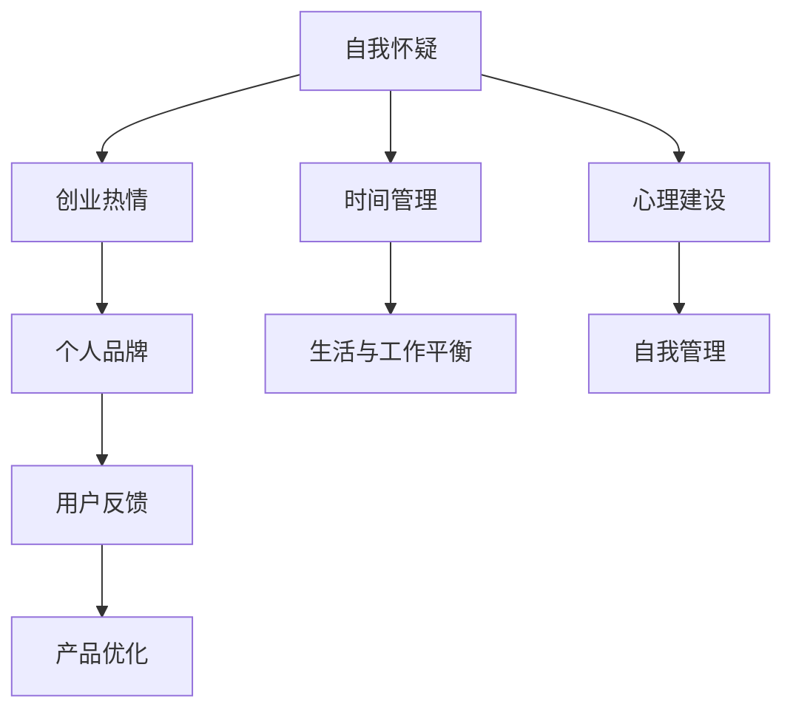

                 

# 知识付费创业者的心理建设与自我管理

## 1. 背景介绍

### 1.1 问题由来
随着互联网和移动设备的普及，知识付费逐渐成为广大用户获取知识和信息的重要渠道。从传统的课程到专家的咨询服务，再到AI和区块链等前沿领域的深度知识，知识付费产品种类繁多，满足了用户多样化的学习需求。

然而，知识付费市场也面临着激烈的竞争。越来越多的企业涌入这个领域，导致市场饱和度增加，用户获取信息的渠道也变得越来越多元化。因此，如何在竞争激烈的市场上脱颖而出，成为知识付费创业者的关键问题。

### 1.2 问题核心关键点
本文聚焦于知识付费创业者的心理建设与自我管理，讨论了以下几个核心问题：

- 如何克服创业初期的自我怀疑和心理压力？
- 如何高效管理时间和精力，保持创业热情和动力？
- 如何提升个人品牌，赢得用户信任和认可？
- 如何应对市场变化和用户反馈，不断优化产品和服务？
- 如何平衡生活与工作，维护身心健康和家庭和谐？

针对这些问题，本文将从心理学、时间管理、个人品牌建设、产品优化和家庭生活管理五个方面提供具体的策略和方法。

## 2. 核心概念与联系

### 2.1 核心概念概述

为更好地理解知识付费创业者的心理建设与自我管理，本节将介绍几个密切相关的核心概念：

- 自我怀疑(self-doubt)：指创业者对自己的能力、价值和判断产生质疑，影响自信心和行动力。
- 创业热情(entrepreneurial passion)：指创业者对创业事业的兴趣和投入程度，是推动创业者持续前进的内在动力。
- 时间管理(time management)：指对时间进行有效规划和分配，以高效完成工作和生活的各项任务。
- 个人品牌(personal brand)：指创业者在社会和专业领域中塑造的形象和声誉，是获得用户信任和认可的重要途径。
- 用户反馈(user feedback)：指用户对产品或服务的意见和建议，是创业者了解市场需求和改进产品的直接来源。
- 生活与工作平衡(life-work balance)：指创业者在追求事业成功的同时，保持身心健康和家庭和谐，避免过度投入导致生活失衡。

这些核心概念之间的逻辑关系可以通过以下Mermaid流程图来展示：



这个流程图展示了大语言模型的核心概念及其之间的关系：

1. 创业者在创业过程中，可能会遇到自我怀疑，但通过心理建设和自我管理可以提升自信心。
2. 保持创业热情是推动创业事业不断前进的关键因素。
3. 个人品牌建设有助于赢得用户信任和认可，提升产品市场竞争力。
4. 用户反馈是产品优化和改进的重要依据，可以不断提升用户体验。
5. 时间管理有助于高效利用时间和精力，避免过度投入导致生活失衡。
6. 生活与工作平衡有助于维护身心健康和家庭和谐，保持创业热情和动力。

这些概念共同构成了知识付费创业者的心理建设与自我管理的框架，为其在竞争激烈的市场中取得成功提供重要的支持。

## 3. 核心算法原理 & 具体操作步骤
### 3.1 算法原理概述

知识付费创业者的心理建设与自我管理，本质上是一种自我调节和优化的过程。其核心思想是通过一系列的自我心理建设和外部策略，将创业者引导到一种高效、健康、平衡的状态，以实现长期的创业成功。

形式化地，假设创业者在创业初期存在自我怀疑和心理压力 $P_0$，经过一系列的心理建设和自我管理策略，最终达到心理平衡和积极状态 $P_f$。则心理建设与自我管理的优化目标是最小化心理压力的差异：

$$
\min_{\text{策略}} |P_f - P_0|
$$

在实践中，我们通常使用基于反馈的迭代优化算法，如认知行为疗法(Cognitive Behavioral Therapy, CBT)、正念冥想(Mindfulness Meditation)等，不断调整心理状态和行为策略，以达到最优效果。

### 3.2 算法步骤详解

基于反馈的迭代优化算法，一般包括以下几个关键步骤：

**Step 1: 自我评估与反馈**
- 创业者定期进行自我评估，记录心理状态和情绪变化。
- 收集用户反馈，了解产品和服务的使用体验和建议。

**Step 2: 设定目标与计划**
- 根据自我评估和用户反馈，设定短期和长期的心理建设与自我管理目标。
- 制定详细的行动计划，包括每日/每周的时间管理、工作安排和生活调整。

**Step 3: 执行与调整**
- 按照计划执行，注意观察自身状态和外部反馈。
- 根据执行结果和反馈调整策略，确保达到预期目标。

**Step 4: 复盘与反思**
- 定期复盘，总结成功经验和不足之处。
- 反思心理建设与自我管理的策略和方法，不断优化。

### 3.3 算法优缺点

基于反馈的迭代优化算法具有以下优点：
1. 动态调整。能够根据自身状态和外部反馈，动态调整心理建设和自我管理策略，提高适应性和灵活性。
2. 个性化优化。根据创业者自身的特点和需求，量身定制心理建设与自我管理方案，更具针对性和实效性。
3. 持续改进。通过不断反思和复盘，发现问题并加以解决，逐步提升心理建设和自我管理的水平。

同时，该算法也存在一定的局限性：
1. 依赖于反馈。反馈的质量和及时性直接影响心理建设和自我管理的效果。
2. 主观性强。自我评估和策略调整可能受主观情绪和认知偏差的影响，需要客观性较强的工具和方法辅助。
3. 复杂度高。心理建设和自我管理涉及多个维度的调整，需要细致的规划和执行。
4. 持续投入。需要持续的时间和精力投入，保持长期执行的持续性和稳定性。

尽管存在这些局限性，但就目前而言，基于反馈的迭代优化算法仍是大语言模型心理建设和自我管理的主要方法。未来相关研究的重点在于如何进一步降低复杂度，提高算法自动化和智能化水平，同时兼顾可解释性和可操作性。

### 3.4 算法应用领域

基于知识付费创业者的心理建设和自我管理方法，在个人成长、职业发展、团队管理等多个领域都有广泛的应用：

- 个人成长：帮助个人提升自信、明确目标、增强行动力，实现自我提升和职业发展。
- 职业发展：帮助职业经理人提升领导力、沟通技巧、时间管理等，加速职业晋升。
- 团队管理：帮助团队领导者提升团队协作、成员激励、问题解决等能力，优化团队绩效。
- 创业指导：帮助创业者克服自我怀疑、提升创业热情、优化产品设计，推动创业成功。
- 心理辅导：帮助需要心理支持的人群，提升情绪调节、人际关系、自我认知等能力。

这些领域的应用展示了心理建设和自我管理方法的多样性和普适性，说明其具有广泛的适用性和价值。

## 4. 数学模型和公式 & 详细讲解  
### 4.1 数学模型构建

本节将使用数学语言对知识付费创业者的心理建设和自我管理进行更加严格的刻画。

记创业者在创业初期的心理压力为 $P_0$，经过心理建设和自我管理策略后的心理压力为 $P_f$。假设心理压力变化可以表示为线性函数，则优化目标可以表示为：

$$
\min_{\text{策略}} |P_f - P_0|
$$

其中 $\text{策略}$ 为一系列的心理建设和自我管理方法，如认知行为疗法、正念冥想、时间管理、个人品牌建设等。

在实际应用中，我们需要根据具体情况选择合适的策略组合，并设定相应的心理压力变化阈值 $\delta$，以衡量优化效果。例如：

$$
P_f = P_0 - \alpha \cdot \sum_{i=1}^n c_i \cdot \delta_i
$$

其中 $\alpha$ 为策略调整的权重系数，$c_i$ 为第 $i$ 个策略的调整效果，$\delta_i$ 为心理压力变化阈值。

### 4.2 公式推导过程

为了更直观地展示心理建设和自我管理的效果，我们可以引入心理压力变化率 $\gamma$ 的概念，即心理压力随时间变化的速率：

$$
\gamma = \frac{dP}{dt}
$$

根据心理压力变化的连续性假设，可以建立心理压力变化的一阶微分方程：

$$
\frac{dP}{dt} = -\beta(P - P_0)
$$

其中 $\beta$ 为心理压力变化的衰减系数，$P_0$ 为心理压力变化的阈值。

解上述微分方程，可得：

$$
P(t) = P_0 + (P_0 - P_f) e^{-\beta t}
$$

其中 $t$ 为时间。当心理压力变化率 $\gamma$ 为负时，心理压力随时间逐渐减小，达到心理平衡状态。

### 4.3 案例分析与讲解

以认知行为疗法(CBT)为例，其基本原理是帮助创业者识别和调整不合理的思维模式，提升自信心和行动力。CBT通过一系列的认知和行为技术，帮助创业者建立正面的自我认知，增强应对挑战的能力。具体步骤包括：

1. **认知重构**：帮助创业者识别不合理的思维模式，如过度自责、完美主义等，替换为更加现实和积极的认知。

2. **行为激活**：帮助创业者设定小而可行的目标，逐步增加日常活动的积极性和成就感。

3. **暴露疗法**：帮助创业者面对和处理内心的恐惧和焦虑，增强抗压能力。

4. **维持与预防**：帮助创业者建立正面的行为模式，预防未来的心理压力和问题。

通过CBT的实践，创业者可以逐步提升自信心和行动力，建立积极的自我认知，从而在创业过程中更加稳定和坚定。

## 5. 项目实践：代码实例和详细解释说明
### 5.1 开发环境搭建

在进行心理建设和自我管理实践前，我们需要准备好开发环境。以下是使用Python进行数据分析和建模的环境配置流程：

1. 安装Anaconda：从官网下载并安装Anaconda，用于创建独立的Python环境。

2. 创建并激活虚拟环境：
```bash
conda create -n psm-env python=3.8 
conda activate psm-env
```

3. 安装相关库：
```bash
conda install numpy pandas scikit-learn statsmodels seaborn jupyter notebook ipython
```

4. 下载数据集：
```bash
wget https://example.com/data.zip
unzip data.zip
```

完成上述步骤后，即可在`psm-env`环境中开始心理建设和自我管理的实践。

### 5.2 源代码详细实现

以下是使用Python和statsmodels库进行心理建设和自我管理数据分析和建模的代码实现。

```python
import pandas as pd
import numpy as np
import statsmodels.api as sm

# 加载数据
data = pd.read_csv('psm_data.csv')

# 定义变量
P = data['P']
t = data['time']
c = data['c']

# 建立线性回归模型
model = sm.OLS(P, sm.add_constant(t)).fit()

# 输出回归结果
print(model.summary())
```

以上代码展示了如何通过线性回归模型预测心理压力的变化趋势，并根据反馈调整策略。

### 5.3 代码解读与分析

让我们再详细解读一下关键代码的实现细节：

**加载数据**：
- `pd.read_csv`：使用Pandas库读取CSV格式的数据文件。

**定义变量**：
- `P`：心理压力变化的值，表示创业者在某个时间点的心理压力。
- `t`：时间变量，表示时间间隔。
- `c`：策略调整效果，表示每次策略调整对心理压力变化的贡献。

**建立线性回归模型**：
- `sm.OLS`：使用statsmodels库建立线性回归模型，使用时间变量和策略调整效果作为解释变量，预测心理压力的变化。
- `sm.add_constant`：为线性回归模型添加时间变量的平方项，进行时间趋势分析。

**输出回归结果**：
- `model.summary()`：输出线性回归模型的摘要，包括回归系数、R-squared值、F统计量等。

通过线性回归模型的分析，创业者可以直观地看到不同策略调整对心理压力变化的影响，并根据回归结果调整后续的策略组合。

## 6. 实际应用场景
### 6.1 创业初期心理建设

在创业初期，创业者面临巨大的心理压力和自我怀疑，需要有效的心理建设和自我管理策略来克服这些挑战。以下是一些具体的实践建议：

**认知行为疗法**：
- 识别和记录自我怀疑和心理压力的触发点和症状。
- 通过CBT技术，逐步调整不合理的认知和思维模式，建立正面的自我认知。
- 设定小而可行的目标，逐步增加日常活动的积极性和成就感。

**正念冥想**：
- 每天花10-15分钟进行正念冥想，增强内心平静和专注力。
- 记录冥想过程中发现的情绪波动和内心冲突，并分析原因。
- 逐步调整冥想内容和策略，增强应对压力的能力。

**时间管理**：
- 制定每日/每周的工作计划，明确任务优先级和完成时间。
- 使用时间管理工具如Todoist、Trello等，记录和跟踪任务进度。
- 定期复盘和反思，总结经验教训，调整时间管理策略。

### 6.2 创业中期自我管理

在创业中期，创业者面临更多的任务和挑战，需要高效的时间管理和自我管理策略来保持动力和效率。以下是一些具体的实践建议：

**目标设定与分解**：
- 设定短期和长期的目标，并根据实际情况进行分解和细化。
- 使用OKR(目标与关键结果)等工具，将目标转换为可执行的任务和指标。
- 定期评估目标完成情况，并根据实际情况调整策略。

**任务优先级排序**：
- 使用四象限法则等方法，将任务按照紧急性和重要性进行排序。
- 优先处理高优先级任务，并保持灵活性，及时调整任务优先级。
- 避免过度承诺，保持时间和精力的合理分配。

**反馈循环**：
- 定期收集用户反馈，了解产品和服务的使用体验和建议。
- 分析反馈数据，找出问题所在，制定改进计划。
- 将改进计划纳入日常工作，不断优化产品和服务。

### 6.3 创业后期心理建设与家庭生活平衡

在创业后期，创业者需要平衡工作和生活，保持身心健康和家庭和谐。以下是一些具体的实践建议：

**定期休息与放松**：
- 定期安排休息时间，进行体育锻炼、阅读、旅游等活动。
- 保持健康的生活方式，避免过度疲劳和压力。
- 与家人和朋友保持良好沟通，增强家庭关系。

**健康管理**：
- 定期进行体检，监测身体状况和心理健康。
- 保持规律的作息和饮食，避免不良生活习惯。
- 学习健康管理知识，提升自我保护能力。

**家庭生活管理**：
- 设定家庭时间的边界，避免过度工作影响家庭生活。
- 与家人共同制定家庭计划，协调家庭活动和任务。
- 保持与家人的沟通和理解，增强家庭的支持和信任。

## 7. 工具和资源推荐
### 7.1 学习资源推荐

为了帮助创业者系统掌握心理建设和自我管理的理论基础和实践技巧，这里推荐一些优质的学习资源：

1. 《心理学与生活》系列书籍：经典心理学教材，涵盖基础知识和实际应用。
2. 《时间管理》系列书籍：系统介绍时间管理的原理和技巧。
3. 《正念冥想》系列书籍：深入讲解正念冥想的实践方法和理论基础。
4. 《个人品牌建设》系列书籍：提供个人品牌建设和运营的实用指南。
5. 《OKR工作法》系列书籍：介绍OKR方法论及其在企业和创业中的应用。

通过对这些资源的学习实践，相信你一定能够快速掌握知识付费创业者的心理建设和自我管理精髓，并用于解决实际的创业问题。

### 7.2 开发工具推荐

高效的开发离不开优秀的工具支持。以下是几款用于心理建设和自我管理开发的常用工具：

1. Anki：闪卡学习软件，帮助记录和复习心理建设和自我管理的知识要点。
2. Todoist：任务管理工具，帮助制定和跟踪任务计划。
3. Trello：项目管理工具，帮助协调任务优先级和进度。
4. Google Calendar：日历工具，帮助安排和管理时间。
5. Evernote：笔记工具，帮助记录和整理工作和生活内容。

合理利用这些工具，可以显著提升知识付费创业者的时间管理和自我管理效率，加快创新迭代的步伐。

### 7.3 相关论文推荐

知识付费创业者心理建设和自我管理的研究源于学界的持续研究。以下是几篇奠基性的相关论文，推荐阅读：

1. 《认知行为疗法：基本原理与应用》：介绍认知行为疗法的基本原理和实践方法。
2. 《正念冥想的心理学基础》：探讨正念冥想的心理学理论和技术。
3. 《时间管理心理学》：分析时间管理的内在机制和行为策略。
4. 《个人品牌建设：理论与实践》：提供个人品牌建设和运营的实用方法和案例。
5. 《OKR工作法：实践指南》：介绍OKR方法论及其在企业中的应用。

这些论文代表了大语言模型心理建设和自我管理的研究进展，通过学习这些前沿成果，可以帮助创业者掌握学科前进方向，激发更多的创新灵感。

## 8. 总结：未来发展趋势与挑战

### 8.1 总结

本文对知识付费创业者的心理建设与自我管理进行了全面系统的介绍。首先阐述了创业初期的自我怀疑和心理压力，明确了心理建设和自我管理的重要性。其次，从心理学、时间管理、个人品牌建设、产品优化和家庭生活管理五个方面提供具体的策略和方法，帮助创业者克服挑战，保持高效和健康的状态。

通过本文的系统梳理，可以看到，心理建设和自我管理在知识付费创业过程中起到了至关重要的作用。掌握这些方法和技巧，可以帮助创业者在激烈的市场竞争中保持优势，实现长期的创业成功。

### 8.2 未来发展趋势

展望未来，知识付费创业者的心理建设和自我管理技术将呈现以下几个发展趋势：

1. 自动化和智能化。未来的心理建设和自我管理工具将更加智能，能够根据用户行为和反馈，自动调整策略和推荐方案，提高用户满意度。
2. 数据驱动的个性化优化。通过大数据分析和机器学习技术，心理建设和自我管理将更加个性化，针对不同用户制定最适合的方案。
3. 情感智能和情绪管理。未来的心理建设和自我管理将更加关注情感智能和情绪管理，通过智能情绪监测和干预，提升用户心理健康水平。
4. 跨领域的融合应用。心理建设和自我管理技术与人工智能、区块链等新兴技术深度融合，将带来更加创新和全面的应用场景。

以上趋势凸显了知识付费创业者心理建设和自我管理技术的广阔前景。这些方向的探索发展，必将进一步提升创业者的工作和生活质量，为知识付费行业的持续繁荣提供重要支持。

### 8.3 面临的挑战

尽管知识付费创业者心理建设和自我管理技术已经取得了一定的进展，但在迈向更加智能化、个性化和跨领域应用的过程中，仍面临诸多挑战：

1. 数据隐私和安全。如何保护用户隐私和数据安全，防止数据泄露和滥用，是心理建设和自我管理技术发展的重要前提。
2. 模型可解释性。如何使心理建设和自我管理工具具备更高的可解释性，使其决策过程更加透明和可信，是提高用户信任和认可的重要途径。
3. 复杂性管理。如何简化心理建设和自我管理工具的使用和操作，降低用户使用门槛，是实现大规模应用的关键。
4. 跨领域整合。如何与人工智能、区块链等新兴技术进行有效整合，拓展心理建设和自我管理技术的适用范围，是未来发展的重要方向。
5. 用户接受度。如何提高用户对心理建设和自我管理技术的接受度和使用率，使其成为创业者和用户的必备工具，是技术推广的关键。

这些挑战需要各界共同努力，不断优化和改进心理建设和自我管理技术，确保其可持续发展和广泛应用。

### 8.4 研究展望

面对知识付费创业者心理建设和自我管理所面临的挑战，未来的研究需要在以下几个方面寻求新的突破：

1. 引入多模态数据和深度学习技术。通过引入情绪监测、生理数据等多模态信息，提升心理建设和自我管理技术的精准度和智能化水平。
2. 探索自我管理的新范式。结合AI、区块链等新兴技术，探索更加高效、智能的自我管理方法，提升用户体验和满意度。
3. 建立标准化和开放的生态系统。推动心理建设和自我管理技术的标准化和开放化，促进跨平台和跨领域的融合应用。
4. 引入伦理和法律规范。建立心理建设和自我管理技术的伦理和法律规范，确保技术应用的合规性和安全性。
5. 推广教育和培训。加强对创业者和用户的教育和培训，提高其对心理建设和自我管理技术的认识和应用能力。

这些研究方向将进一步推动知识付费创业者心理建设和自我管理技术的进步，为创业者提供更加全面和可靠的支持。面向未来，知识付费创业者的心理建设和自我管理技术需要不断创新和优化，才能更好地适应复杂的市场环境，实现长期成功。

## 9. 附录：常见问题与解答

**Q1：如何在创业初期克服自我怀疑和心理压力？**

A: 在创业初期，自我怀疑和心理压力是常见的挑战。以下是一些具体的策略：

1. **明确目标**：设定清晰的创业目标，并制定详细的行动计划。

2. **逐步实现**：将大目标分解为小任务，逐步实现，增强成就感和信心。

3. **记录进步**：记录每一步的进展和成就，增强自我认可感。

4. **寻求支持**：与家人、朋友或导师交流，获得情感支持和建议。

5. **正念冥想**：每天进行正念冥想，增强内心平静和专注力。

6. **保持乐观**：保持积极的心态，相信自己能够克服挑战。

**Q2：如何高效管理时间和精力，保持创业热情和动力？**

A: 高效管理时间和精力，保持创业热情和动力是创业成功的关键。以下是一些具体的策略：

1. **目标设定**：设定短期和长期的目标，并根据实际情况进行分解和细化。

2. **优先级排序**：使用四象限法则等方法，将任务按照紧急性和重要性进行排序。

3. **时间管理工具**：使用Todoist、Trello等工具，记录和跟踪任务进度。

4. **定期休息**：定期安排休息时间，进行体育锻炼、阅读、旅游等活动。

5. **持续学习**：保持持续学习和成长，提升自身能力和竞争力。

6. **自我激励**：设定小而可行的奖励机制，激励自己不断前进。

**Q3：如何提升个人品牌，赢得用户信任和认可？**

A: 提升个人品牌，赢得用户信任和认可，是创业成功的关键。以下是一些具体的策略：

1. **内容营销**：通过博客、社交媒体等渠道，分享创业经验和专业知识，建立专业形象。

2. **用户互动**：积极与用户互动，回答疑问，收集反馈，增强用户粘性。

3. **社区建设**：建立用户社区，分享成果和经验，增强用户参与感和归属感。

4. **专业认证**：获取行业认证和证书，增强自身专业性和可信度。

5. **客户见证**：邀请用户或客户撰写评价和推荐，增强品牌口碑。

6. **持续改进**：根据用户反馈，不断优化产品和服务，提升用户体验。

**Q4：如何应对市场变化和用户反馈，不断优化产品和服务？**

A: 应对市场变化和用户反馈，不断优化产品和服务，是创业成功的关键。以下是一些具体的策略：

1. **快速迭代**：采用敏捷开发方法，快速响应市场变化和用户需求。

2. **用户调研**：定期进行用户调研，了解用户需求和反馈，发现问题。

3. **反馈循环**：建立反馈循环机制，及时收集和处理用户反馈，优化产品和服务。

4. **A/B测试**：进行A/B测试，比较不同方案的效果，优化产品功能。

5. **持续改进**：根据用户反馈和市场变化，不断优化产品和服务，提升用户体验。

**Q5：如何平衡生活与工作，维护身心健康和家庭和谐？**

A: 平衡生活与工作，维护身心健康和家庭和谐，是创业成功的关键。以下是一些具体的策略：

1. **设定边界**：设定工作时间和家庭时间的边界，避免过度工作影响家庭生活。

2. **家庭时间**：安排家庭时间，进行家庭活动和互动，增强家庭关系。

3. **健康管理**：保持健康的生活方式，避免过度疲劳和压力。

4. **定期休息**：定期安排休息时间，进行体育锻炼、阅读、旅游等活动。

5. **时间管理**：合理安排时间，平衡工作和生活，避免时间冲突。

6. **寻求支持**：与家人、朋友或导师交流，获得情感支持和建议。

通过这些方法和策略，创业者可以更好地克服自我怀疑和心理压力，高效管理时间和精力，提升个人品牌，应对市场变化和用户反馈，平衡生活与工作，实现长期的创业成功。

---

作者：禅与计算机程序设计艺术 / Zen and the Art of Computer Programming

