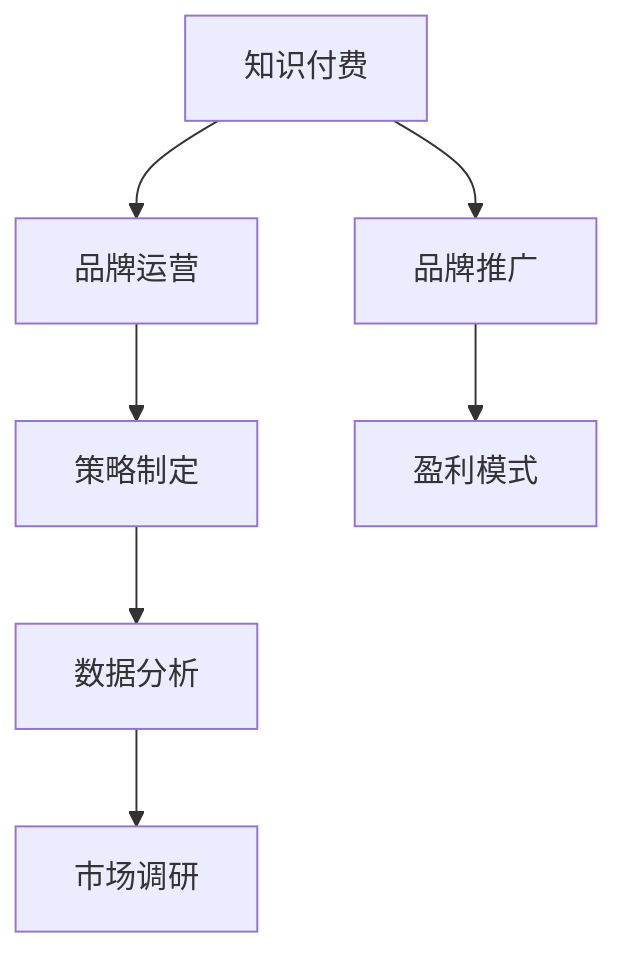

                 

# 知识付费赚钱的品牌品牌运营与品牌推广策略

> 关键词：知识付费, 品牌运营, 品牌推广, 策略, 盈利模式, 用户增长, 内容创作, 营销渠道, 数据分析, 市场调研

## 1. 背景介绍

### 1.1 问题由来
随着信息时代的到来，知识付费逐渐成为人们获取新知、提升个人能力的重要方式。各大知识付费平台如雨后春笋般涌现，内容形式也从单一的音频、视频拓展到图文、直播、图文专栏、电子书等多种形式。然而，如何在这片红海中突出重围，打造具有竞争力的知识付费品牌，成为众多平台亟需解决的问题。

### 1.2 问题核心关键点
品牌运营与品牌推广是知识付费平台成功的关键因素，具体来说，包括：
1. **品牌定位**：明确品牌使命、愿景和核心价值主张，以便在市场中树立独特的品牌形象。
2. **用户增长**：通过有效的市场推广策略，吸引并留住更多用户，形成良性循环。
3. **内容创作**：生产高质量、符合用户需求的内容，建立品牌信任。
4. **营销渠道**：选择合适的渠道，扩大品牌影响力，提升知名度。
5. **数据分析**：利用数据驱动决策，优化运营策略。

### 1.3 问题研究意义
在信息泛滥的互联网时代，打造具有市场竞争力的知识付费品牌，不仅能满足用户的学习需求，还能带来可观的经济收益。研究品牌运营与推广策略，对于平台优化运营流程、提升用户体验、拓展市场空间具有重要意义。

## 2. 核心概念与联系

### 2.1 核心概念概述

为更好地理解品牌运营与推广策略，本节将介绍几个核心概念：

- **知识付费**：基于互联网的付费内容分享模式，用户为获取专业知识、技能、经验等知识资源而支付费用。
- **品牌运营**：通过一系列策略和活动，塑造和提升品牌形象，实现品牌价值的最大化。
- **品牌推广**：通过营销手段，将品牌价值传达给目标用户，提升品牌知名度和美誉度。
- **策略制定**：根据品牌定位、市场需求、用户行为等因素，制定符合自身发展的经营策略。
- **盈利模式**：通过多元化经营，实现平台的长期盈利。

这些概念之间的逻辑关系可以通过以下Mermaid流程图来展示：



这个流程图展示出知识付费与品牌运营、品牌推广、策略制定、盈利模式等核心概念之间的逻辑联系，强调了数据分析和市场调研在其中的重要作用。

## 3. 核心算法原理 & 具体操作步骤
### 3.1 算法原理概述

品牌运营与推广的核心在于通过一系列策略和活动，提升品牌知名度和美誉度，最终实现盈利。其核心算法原理包括：

1. **品牌定位**：通过市场调研和数据分析，确定品牌的目标用户、核心价值和差异化特点，以便制定明确的品牌策略。
2. **用户增长**：通过精准营销、社交网络、内容营销等手段，吸引新用户并提升用户留存率。
3. **内容创作**：利用数据驱动的内容推荐，提升内容相关性和吸引力，满足用户个性化需求。
4. **营销渠道**：根据品牌特点和用户行为，选择合适的营销渠道，如SEO、社交媒体、KOL合作等。
5. **数据分析**：通过用户行为数据分析，优化产品推荐、营销策略，提升用户体验和品牌价值。

### 3.2 算法步骤详解

基于上述核心原理，品牌运营与推广可以概括为以下几个关键步骤：

**Step 1: 市场调研与用户分析**
- 收集目标市场的数据，包括用户需求、竞争对手情况、市场趋势等。
- 分析用户画像，确定品牌的目标用户群体。
- 利用数据挖掘和分析工具，识别用户行为模式和偏好。

**Step 2: 制定品牌策略**
- 确定品牌定位，明确品牌的使命、愿景和核心价值。
- 制定内容策略，定义内容类型、风格、发布频率等。
- 制定营销策略，确定营销渠道、推广活动、合作方式等。

**Step 3: 内容创作与用户互动**
- 根据品牌定位和用户需求，生产高质量的内容，如专业文章、视频、直播等。
- 利用用户互动机制，如评论、点赞、分享等，提升用户参与度。
- 通过数据分析，优化内容推荐策略，提升用户粘性。

**Step 4: 渠道选择与活动推广**
- 选择合适的营销渠道，如社交媒体、搜索引擎、电子邮件等。
- 设计并实施品牌推广活动，如限时优惠、社交媒体挑战等。
- 利用数据分析，调整和优化推广策略，提升活动效果。

**Step 5: 数据驱动与持续优化**
- 建立数据分析体系，实时监控品牌表现和用户反馈。
- 利用数据分析结果，持续优化品牌策略和运营流程。
- 定期评估品牌效果，调整目标和策略，适应市场变化。

### 3.3 算法优缺点

品牌运营与推广算法具有以下优点：
1. 数据驱动决策：通过数据支持品牌决策，提升策略的科学性和有效性。
2. 用户个性化：利用数据分析，提供个性化内容和服务，提升用户体验。
3. 快速迭代：根据数据反馈，快速调整策略，实现灵活的运营模式。
4. 市场覆盖广：选择合适的营销渠道，扩大品牌影响力，吸引更多用户。

同时，该算法也存在以下局限性：
1. 对数据依赖高：数据分析的准确性和全面性直接影响策略的效果。
2. 用户隐私问题：在收集和分析用户数据时，需要遵守隐私保护法规。
3. 成本高：高质量内容生产和数据分析需要投入大量资源。
4. 市场竞争激烈：在信息爆炸的时代，品牌需要不断创新，才能保持竞争力。

尽管存在这些局限性，但就目前而言，基于数据驱动的品牌运营与推广方法仍是主流的品牌建设策略。未来相关研究的重点在于如何进一步降低运营成本，提高数据使用的安全性，同时兼顾品牌的长远发展。

### 3.4 算法应用领域

品牌运营与推广方法在多个领域得到广泛应用，如：

- **在线教育**：平台通过精准推荐和优质内容，提升用户满意度和品牌忠诚度。
- **职业培训**：通过品牌推广和高质量课程，吸引潜在学员，提升市场份额。
- **健康管理**：利用品牌效应和健康资讯，吸引健康意识强的用户，提升品牌影响力。
- **科技创业**：通过内容营销和品牌推广，吸引投资者和合作伙伴，加速公司发展。

除了上述这些经典应用外，品牌运营与推广方法还被创新性地应用到更多场景中，如智能客服、电子商务、在线旅游等，为不同行业的品牌打造提供了新的思路。

## 4. 数学模型和公式 & 详细讲解 & 举例说明

### 4.1 数学模型构建

品牌运营与推广的核心算法可以抽象为以下数学模型：

1. **用户增长模型**：
   $$
   N_{n+1} = N_n + f_{n+1} - c_{n+1}
   $$
   其中，$N_n$ 为第 $n$ 周的用户数，$f_{n+1}$ 为第 $n+1$ 周的新增用户数，$c_{n+1}$ 为第 $n+1$ 周的流失用户数。

2. **内容推荐模型**：
   $$
   R(u,v) = \sum_{i=1}^n p_i \cdot q_i
   $$
   其中，$R(u,v)$ 为用户 $u$ 对内容 $v$ 的推荐得分，$p_i$ 和 $q_i$ 分别为内容和用户特征向量的权重。

3. **营销效果模型**：
   $$
   E = \sum_{i=1}^n p_i \cdot \frac{C_i}{P_i}
   $$
   其中，$E$ 为总营销效果，$C_i$ 为第 $i$ 次推广的成本，$P_i$ 为第 $i$ 次推广的收益。

### 4.2 公式推导过程

- **用户增长模型**：
  用户增长模型描述了用户在一定时间内的动态变化，通过时间序列分析和预测，可以帮助平台制定用户增长策略。

- **内容推荐模型**：
  内容推荐模型利用用户和内容的特征向量，通过内积计算相似度，进行个性化推荐。

- **营销效果模型**：
  营销效果模型通过成本收益分析，衡量每次推广的效果，为后续的推广策略优化提供依据。

### 4.3 案例分析与讲解

**案例1: 在线教育平台的品牌推广**
某在线教育平台通过社交媒体广告投放，将品牌推广至目标用户群体。通过A/B测试，分析不同广告形式的点击率和转化率，优化广告内容。利用数据分析工具，实时监控推广效果，调整广告预算。最终，平台在推广活动后，用户数增长了30%，实现了显著的营销效果。

**案例2: 职业培训平台的品牌运营**
某职业培训平台通过内容营销策略，定期发布行业报告和案例分析文章，提升平台在行业内的影响力。同时，通过品牌大使计划，邀请知名专家和学员分享学习经验，提升平台的品牌美誉度。利用用户互动数据，优化内容推荐策略，提升用户体验。平台的用户粘性和品牌忠诚度显著提升，市场份额逐步扩大。

## 5. 项目实践：代码实例和详细解释说明
### 5.1 开发环境搭建

在进行品牌运营与推广项目实践前，我们需要准备好开发环境。以下是使用Python进行数据分析和营销推广的开发环境配置流程：

1. 安装Anaconda：从官网下载并安装Anaconda，用于创建独立的Python环境。

2. 创建并激活虚拟环境：
```bash
conda create -n brand-env python=3.8 
conda activate brand-env
```

3. 安装必要的库：
```bash
conda install pandas numpy scikit-learn matplotlib seaborn jupyter notebook ipython
```

4. 安装相关的营销推广工具：
```bash
pip install social-media-analytics google-analytics campaign-manager
```

完成上述步骤后，即可在`brand-env`环境中开始项目实践。

### 5.2 源代码详细实现

下面以一个简单的社交媒体营销推广项目为例，给出使用Python进行数据分析和推广的代码实现。

首先，导入必要的库：

```python
import pandas as pd
import numpy as np
from sklearn.model_selection import train_test_split
from sklearn.linear_model import LogisticRegression
from sklearn.metrics import accuracy_score
```

然后，准备数据集：

```python
# 假设有如下的社交媒体广告数据
data = pd.read_csv('social_media_data.csv')

# 特征工程，提取用户特征和广告特征
features = data[['age', 'gender', 'interests']]
labels = data['clicked']
```

接着，构建模型：

```python
# 划分训练集和测试集
features_train, features_test, labels_train, labels_test = train_test_split(features, labels, test_size=0.2, random_state=42)

# 训练逻辑回归模型
model = LogisticRegression()
model.fit(features_train, labels_train)
```

最后，进行模型评估：

```python
# 预测测试集
labels_pred = model.predict(features_test)

# 计算准确率
accuracy = accuracy_score(labels_test, labels_pred)
print(f'Accuracy: {accuracy:.2f}')
```

以上就是使用Python进行社交媒体广告效果分析的完整代码实现。可以看到，通过简单的数据处理和模型训练，我们就能分析出广告推广的效果，为后续的推广策略优化提供依据。

### 5.3 代码解读与分析

让我们再详细解读一下关键代码的实现细节：

**数据准备**：
- `pd.read_csv`方法用于读取社交媒体广告数据。
- `train_test_split`方法用于将数据集划分为训练集和测试集。

**模型构建**：
- `LogisticRegression`用于构建逻辑回归模型。
- `fit`方法用于训练模型，通过训练数据拟合出最佳参数。

**模型评估**：
- `predict`方法用于预测测试集标签。
- `accuracy_score`方法用于计算模型的准确率，评估模型效果。

通过以上步骤，我们就能快速实现社交媒体广告效果的初步分析，为后续的推广策略优化提供数据支持。

当然，工业级的系统实现还需考虑更多因素，如模型的保存和部署、超参数的自动搜索、更灵活的任务适配层等。但核心的品牌运营与推广范式基本与此类似。

## 6. 实际应用场景
### 6.1 在线教育

在线教育平台的品牌运营与推广，可以通过精准推荐、内容营销、社交媒体合作等方式进行。具体实施时，可以：
- 利用用户行为数据，进行个性化推荐，提升用户粘性。
- 通过内容营销策略，发布高质量的教学视频、文章等，提升平台在行业内的影响力。
- 与知名教育机构和KOL合作，利用他们的影响力推广平台，扩大用户群体。
- 定期举办线上线下活动，增强用户互动，提升品牌忠诚度。

### 6.2 健康管理

健康管理平台通过品牌推广和高质量的健康资讯，吸引健康意识强的用户。具体实施时，可以：
- 发布与健康相关的科学文章、视频、直播等，满足用户需求。
- 通过社交媒体和搜索引擎优化(SEO)推广平台，提升品牌知名度。
- 与知名健康专家和机构合作，增强平台内容的权威性和可信度。
- 定期发布用户健康数据报告，提升用户粘性和品牌美誉度。

### 6.3 科技创业

科技创业公司通过品牌运营与推广，吸引投资者和合作伙伴，加速公司发展。具体实施时，可以：
- 发布公司技术创新和产品发布的最新资讯，提升品牌形象。
- 通过KOL合作、技术竞赛等方式，增强品牌影响力和市场曝光度。
- 在社交媒体和专业论坛上积极互动，提升用户参与度。
- 利用数据分析工具，优化推广策略，提升投资回报率。

### 6.4 未来应用展望

随着技术的发展，品牌运营与推广方法将进一步优化和创新，主要体现在以下几个方面：

1. **多渠道融合**：通过多渠道融合，提升品牌曝光率和用户粘性。例如，将社交媒体、搜索引擎、电子邮件等多渠道数据整合，进行全局优化。
2. **智能推荐系统**：利用机器学习算法，构建智能推荐系统，提升内容相关性和用户体验。
3. **个性化营销**：通过用户画像分析，实现精准营销，提升转化率和客户满意度。
4. **数据可视化**：利用数据可视化工具，直观展示品牌运营效果，为决策提供支持。
5. **跨领域应用**：将品牌运营与推广方法应用于更多领域，如电子商务、在线旅游等，实现更广泛的应用场景。

## 7. 工具和资源推荐
### 7.1 学习资源推荐

为了帮助开发者系统掌握品牌运营与推广的理论基础和实践技巧，这里推荐一些优质的学习资源：

1. 《品牌运营与推广实战指南》系列博文：由品牌运营专家撰写，深入浅出地介绍了品牌定位、用户增长、内容创作等前沿话题。

2. 《营销数据分析与可视化》课程：国内外知名大学开设的营销数据分析课程，系统讲解数据驱动的营销策略。

3. 《品牌推广的艺术》书籍：品牌推广领域的经典著作，介绍了品牌建设、市场推广、品牌管理等实用技巧。

4. 《社交媒体营销》课程：Coursera等平台提供的社交媒体营销课程，涵盖了社交媒体策略、用户互动、广告投放等内容。

5. 《数据科学与营销》书籍：结合数据科学和营销的实用书籍，提供了大量的案例和工具，帮助读者进行品牌运营和推广。

通过对这些资源的学习实践，相信你一定能够快速掌握品牌运营与推广的精髓，并用于解决实际的营销问题。
###  7.2 开发工具推荐

高效的开发离不开优秀的工具支持。以下是几款用于品牌运营与推广开发的常用工具：

1. Google Analytics：全球领先的网站分析工具，可以实时监控网站流量和用户行为，为品牌推广提供数据支持。

2. Hootsuite：领先的社交媒体管理工具，支持多平台社交媒体发布、分析和互动，提升品牌曝光率。

3. Mailchimp：全球领先的电子邮件营销工具，支持自动化邮件营销、用户细分和效果分析。

4. SEMrush：全球领先的搜索引擎优化和竞争分析工具，帮助品牌提升在搜索引擎中的排名和曝光率。

5. HubSpot：领先的CRM和营销自动化平台，支持多渠道营销、数据分析和用户管理。

合理利用这些工具，可以显著提升品牌运营与推广的效率，加快创新迭代的步伐。

### 7.3 相关论文推荐

品牌运营与推广技术的发展源于学界的持续研究。以下是几篇奠基性的相关论文，推荐阅读：

1. "Brand Positioning and Brand Identity in Digital Marketing"：探讨了数字时代品牌定位和品牌建设的重要性，提供了具体的品牌建设策略。

2. "Social Media Marketing Analytics"：介绍了社交媒体数据分析的基本框架和方法，为品牌运营提供数据支持。

3. "Content Marketing Strategy and Execution"：讲解了内容营销的策略和执行方法，提供了实用的品牌推广建议。

4. "Campaign Management and ROI Optimization"：介绍了营销活动的策划、执行和效果分析，帮助品牌提升投资回报率。

5. "Brand Value and Customer Experience Management"：探讨了品牌价值和客户体验管理的关系，为品牌运营提供理论支持。

这些论文代表了大品牌运营与推广技术的发展脉络。通过学习这些前沿成果，可以帮助研究者把握学科前进方向，激发更多的创新灵感。

## 8. 总结：未来发展趋势与挑战
### 8.1 总结

本文对品牌运营与推广方法进行了全面系统的介绍。首先阐述了品牌运营与推广的背景和意义，明确了品牌策略、用户增长、内容创作、营销渠道等核心概念。其次，从原理到实践，详细讲解了品牌运营与推广的数学模型和操作步骤，给出了品牌推广的完整代码实现。同时，本文还广泛探讨了品牌运营与推广在多个行业领域的应用前景，展示了品牌推广的巨大潜力。此外，本文精选了品牌运营与推广的各类学习资源，力求为读者提供全方位的技术指引。

通过本文的系统梳理，可以看到，品牌运营与推广方法在知识付费平台上的重要性，以及其对于提升品牌价值和用户粘性的关键作用。品牌运营与推广方法将成为知识付费平台的核心竞争力，通过持续的优化和创新，在市场中占据一席之地。

### 8.2 未来发展趋势

展望未来，品牌运营与推广方法将呈现以下几个发展趋势：

1. **数据驱动决策**：利用大数据和人工智能技术，实现品牌运营的精准化和智能化。通过数据分析，提升决策的科学性和有效性。
2. **多渠道融合**：实现多渠道数据整合，提升品牌曝光率和用户粘性。通过跨平台营销，形成品牌合力。
3. **个性化营销**：利用用户画像分析，实现精准营销，提升转化率和客户满意度。
4. **智能推荐系统**：构建智能推荐系统，提升内容相关性和用户体验。
5. **品牌价值链优化**：通过品牌建设、内容创作、营销推广等环节的优化，提升品牌的综合价值。

以上趋势凸显了品牌运营与推广技术的广阔前景。这些方向的探索发展，必将进一步提升品牌运营的效率和效果，为品牌打造带来新的突破。

### 8.3 面临的挑战

尽管品牌运营与推广技术已经取得了显著成就，但在品牌打造和推广过程中，仍面临诸多挑战：

1. **数据隐私和安全**：在收集和分析用户数据时，需要遵守隐私保护法规，避免数据泄露和滥用。
2. **市场竞争激烈**：在信息爆炸的时代，品牌需要不断创新，才能保持竞争力和市场地位。
3. **用户需求多样**：不同用户群体的需求和偏好各异，品牌需要提供多样化的内容和个性化的服务。
4. **成本投入高**：高质量内容生产和数据分析需要投入大量资源，如何控制成本是关键问题。
5. **效果评估难**：品牌运营的效果评估复杂，需要结合多维度的数据指标进行综合分析。

尽管存在这些挑战，但通过持续的技术创新和实践优化，品牌运营与推广方法仍有很大的提升空间。未来研究需要在数据隐私、市场策略、内容创意等方面寻求新的突破。

### 8.4 研究展望

面对品牌运营与推广面临的挑战，未来的研究需要在以下几个方面寻求新的突破：

1. **多源数据融合**：将不同来源的数据整合，提升品牌运营的全面性和精准性。
2. **跨领域应用**：将品牌运营与推广方法应用于更多领域，如电子商务、在线旅游等，实现更广泛的应用场景。
3. **个性化推荐**：通过机器学习算法，实现用户个性化推荐，提升用户体验和品牌粘性。
4. **数据隐私保护**：研究数据隐私保护技术，确保品牌运营过程中用户数据的安全性和隐私性。
5. **品牌价值链优化**：通过品牌建设、内容创作、营销推广等环节的优化，提升品牌的综合价值。

这些研究方向的探索，必将引领品牌运营与推广技术迈向更高的台阶，为品牌打造带来新的突破。面向未来，品牌运营与推广技术还需要与其他人工智能技术进行更深入的融合，如知识表示、因果推理、强化学习等，多路径协同发力，共同推动品牌价值的最大化。只有勇于创新、敢于突破，才能不断拓展品牌运营的边界，让品牌更好地服务于用户和社会。

## 9. 附录：常见问题与解答

**Q1：品牌运营与推广是否适用于所有行业？**

A: 品牌运营与推广方法在大多数行业中都能取得不错的效果，特别是对于需要建立品牌信任和用户忠诚度的行业。但对于一些特殊行业，如医疗、金融等，需要结合行业特点进行特定的品牌建设。

**Q2：如何制定品牌运营策略？**

A: 品牌运营策略的制定需要考虑多个因素，包括品牌定位、目标用户、市场环境等。建议先进行市场调研，了解行业趋势和用户需求。然后根据调研结果，制定详细的品牌策略，包括内容创作、营销渠道、推广活动等。

**Q3：如何在品牌运营中控制成本？**

A: 控制品牌运营成本，需要从多个方面入手，如优化营销渠道、提升内容质量、利用数据分析等。具体措施包括：
- 利用社交媒体和搜索引擎优化(SEO)，降低广告成本。
- 提高内容创作效率，利用自动化工具生成内容。
- 利用数据挖掘技术，优化推广策略，提升转化率。

**Q4：品牌运营中的数据分析需要注意哪些问题？**

A: 品牌运营中的数据分析需要注意以下问题：
- 数据的准确性和完整性，确保数据分析结果的可靠性。
- 用户隐私保护，遵守相关法律法规，确保用户数据的安全性。
- 数据的多维度分析，结合用户行为、市场趋势等进行综合评估。

**Q5：品牌推广的KPI指标有哪些？**

A: 品牌推广的KPI指标包括：
- 品牌知名度：通过调查问卷、搜索引擎结果等衡量品牌知名度。
- 用户增长：新增用户数、活跃用户数等指标。
- 用户留存：用户留存率、流失率等指标。
- 转化率：广告点击率、用户注册率等指标。
- 用户参与度：内容浏览量、互动量等指标。

通过以上指标，可以全面评估品牌推广的效果，进行持续优化。

