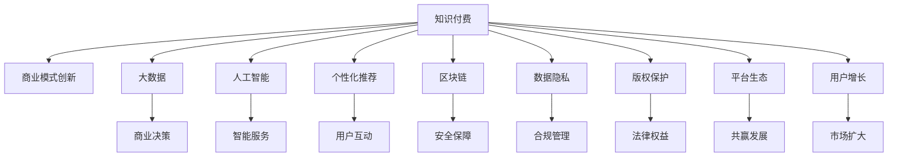

                 

# 知识经济时代下的知识付费创新商业模式运营

> 关键词：知识付费、商业创新、商业模式、数据驱动、AI技术、个性化推荐、区块链、数据隐私、版权保护、平台生态、用户增长

## 1. 背景介绍

### 1.1 问题由来
随着互联网技术的高速发展，信息获取的门槛逐渐降低，公众对知识的渴求日益增长。知识付费作为一种新兴商业模式，利用大数据、人工智能等技术手段，为知识的传播、获取、利用提供了新的解决方案。然而，传统的知识付费模式面临着用户粘性低、成本高、收入分成复杂等问题，亟需新的创新来破局。

### 1.2 问题核心关键点
知识付费创新的关键在于如何利用先进技术手段，提高知识的传播效率、降低获取成本、提升用户体验、增加用户粘性。实现上述目标，需要构建一套以数据和算法为基础，兼具市场和技术创新的商业模型，同时平衡好知识生产者、消费者以及平台三方的利益。

### 1.3 问题研究意义
构建创新的知识付费商业模式，对于推动知识经济的发展，促进知识生产、传播和消费，具有重要意义。具体而言，创新商业模式将有助于：
- 提升知识生产者的收益，激发更多高质量知识的创作。
- 降低知识消费者获取成本，扩大知识消费群体。
- 优化平台运营效率，增加商业收益。
- 保障知识版权，提升知识质量。
- 促进知识生态的良性发展，形成正反馈循环。

## 2. 核心概念与联系

### 2.1 核心概念概述

为更好地理解知识付费的创新商业模式，本节将介绍几个密切相关的核心概念：

- **知识付费**：指消费者为获取特定知识而支付费用的行为。知识付费平台通过平台化、市场化的方式，将知识产品化，提供便捷获取知识的渠道。

- **商业模式创新**：指重新思考和设计商业流程、价值链、盈利模式等关键要素，以适应市场需求和技术变化，创造新的价值来源和竞争优势。

- **大数据**：指大规模、多样化的数据集合，通过数据驱动的分析挖掘，为商业决策提供依据。

- **人工智能**：指利用算法和计算能力，使计算机具有模拟人类智能行为的能力，如机器学习、自然语言处理等。

- **个性化推荐**：指通过分析用户行为数据，推荐符合用户兴趣和需求的个性化知识产品。

- **区块链**：指一种分布式数据库技术，通过加密、共识等手段，保障数据的透明性、安全性、不可篡改性。

- **数据隐私**：指个人数据的收集、存储、处理和使用过程中，保障个人数据不被滥用，确保个人权益。

- **版权保护**：指通过法律手段和技术手段，保护知识生产者的智力劳动成果，确保知识产权权益。

- **平台生态**：指构建开放、共享、合作的平台环境，促进知识生产者、消费者、平台三方共赢发展。

- **用户增长**：指通过各种策略，提升平台用户数量和用户活跃度，扩大知识市场规模。

这些核心概念之间的逻辑关系可以通过以下Mermaid流程图来展示：



这个流程图展示出知识付费、商业模式创新与相关概念之间的紧密联系：

1. 知识付费通过商业模式创新获得新的商业价值，推动平台发展。
2. 大数据和人工智能技术提升知识获取和传播效率。
3. 个性化推荐提高用户体验，促进知识消费。
4. 区块链保障数据安全和版权保护，增强用户信任。
5. 数据隐私和平台生态促进用户增长，拓展知识市场。
6. 版权保护保障知识生产者的合法权益。

这些概念共同构成了知识付费创新商业模式的基石，为其成功实施提供了保障。

## 3. 核心算法原理 & 具体操作步骤
### 3.1 算法原理概述

知识付费商业模式的创新，实质上是通过大数据、人工智能等技术手段，对传统知识获取、传播、消费模式进行重构。其核心算法原理可以归纳为：

- **数据收集与分析**：通过收集用户的浏览、购买、学习行为数据，分析用户兴趣、偏好、需求等，为个性化推荐提供依据。

- **推荐算法**：设计个性化推荐模型，基于用户行为数据、知识内容特征等输入，推荐符合用户兴趣的个性化知识产品。

- **定价策略**：设计合理的知识产品定价策略，结合用户价值和成本预期，实现精准定价，提升用户满意度和平台收益。

- **用户交互界面设计**：优化平台的用户界面，提供便捷、友好、高效的知识获取和使用体验，增强用户粘性。

- **营销策略**：通过精准营销手段，提升平台曝光度和用户增长，扩大知识市场规模。

- **商业模型优化**：持续优化平台商业模型，平衡知识生产者、消费者、平台三方利益，实现良性循环。

### 3.2 算法步骤详解

基于上述算法原理，知识付费商业模式的创新主要包括以下几个关键步骤：

**Step 1: 数据收集与分析**
- 收集用户的浏览记录、购买记录、学习行为数据等，形成用户行为数据集。
- 利用大数据技术，对数据进行清洗、去重、聚合等处理，生成特征数据集。
- 应用机器学习算法，如协同过滤、深度学习等，挖掘用户兴趣和行为规律，生成用户画像。

**Step 2: 推荐算法设计**
- 设计个性化推荐模型，如基于内容的推荐、协同过滤推荐、混合推荐等。
- 利用深度学习框架，如TensorFlow、PyTorch等，构建推荐模型，进行模型训练和调优。
- 引入多模态信息，如文本、图片、视频等，提升推荐模型效果。

**Step 3: 定价策略设计**
- 基于用户画像和知识产品特征，设计动态定价模型，优化知识产品价格。
- 采用A/B测试等方法，测试不同定价策略对用户行为的影响，进行不断优化。

**Step 4: 用户交互界面设计**
- 优化平台的用户界面，提供简洁、美观、易用的用户体验。
- 设计互动式界面，增强用户与平台、其他用户的交互，提升用户粘性。

**Step 5: 营销策略实施**
- 利用大数据分析用户行为和兴趣，设计精准营销策略，提高平台曝光度和用户增长。
- 利用社交媒体、SEO、广告投放等手段，提升平台知名度和用户数量。

**Step 6: 商业模型优化**
- 分析平台收入、成本、用户增长等关键指标，进行商业模型优化。
- 持续监控平台运营数据，进行数据分析和决策支持，优化商业模式。

### 3.3 算法优缺点

基于大数据和人工智能的知识付费商业模式，具有以下优点：
1. 提升知识获取效率，降低用户成本。
2. 增强用户体验，提高用户满意度。
3. 提高平台运营效率，增加商业收益。
4. 保障知识版权，提升知识质量。
5. 促进用户增长，扩大知识市场。

同时，该模式也存在一些局限性：
1. 对数据质量要求高，需要大量高质量用户行为数据。
2. 算法复杂，技术门槛高，需要专业人才支持。
3. 对平台数据安全性和隐私保护要求高。
4. 定价策略复杂，需要精准分析用户需求和行为。
5. 需要持续优化，平衡多方利益。

尽管存在这些局限性，但就目前而言，基于大数据和人工智能的知识付费模式，仍是大势所趋。未来相关研究的重点在于如何进一步降低技术门槛，提高算法效率，提升平台数据安全性和隐私保护，同时兼顾商业模式的公平性和透明度。

### 3.4 算法应用领域

基于大数据和人工智能的知识付费商业模式，已经在多个领域得到了广泛应用，例如：

- 在线教育：提供个性化的课程推荐，提高学习效率。
- 专业培训：推荐符合职业需求的专业培训课程，提高培训效果。
- 健康咨询：提供个性化的健康咨询和指导，提升健康管理水平。
- 法律咨询：推荐符合用户需求的法律咨询和法律产品，提高法律服务质量。
- 金融理财：推荐个性化的金融产品，提高理财效果。
- 艺术创作：推荐符合用户兴趣的艺术作品，提升艺术创作体验。

除了上述这些经典领域外，知识付费模式还在更多场景中得到创新应用，如旅游导览、技术咨询、心理咨询等，为知识生产者提供了新的商业机会，同时增强了用户获取知识的便捷性。

## 4. 数学模型和公式 & 详细讲解  
### 4.1 数学模型构建

为更好地理解基于大数据和人工智能的知识付费商业模式，本节将介绍几个核心的数学模型：

**用户画像模型**：通过用户行为数据，建立用户兴趣、偏好、需求等特征模型。形式化表达为：

$$
P_{user}(x) = \frac{1}{\sum_{i=1}^N \exp(\vec{u}_i^T\vec{w})} \exp(\vec{u}^T\vec{w})
$$

其中 $P_{user}(x)$ 为用户 $x$ 的兴趣评分，$u_i$ 为用户 $i$ 的行为数据，$w$ 为模型权重向量，$\exp$ 为指数函数。

**个性化推荐模型**：基于用户画像和知识内容特征，设计推荐算法。常用的推荐算法包括基于内容的推荐、协同过滤推荐、混合推荐等。形式化表达为：

$$
R_{item}(u) = \frac{\exp(\vec{u}^T\vec{v}_i)}{\sum_{j=1}^M \exp(\vec{u}^T\vec{v}_j)}
$$

其中 $R_{item}(u)$ 为物品 $i$ 对用户 $u$ 的推荐评分，$v_i$ 为物品 $i$ 的特征向量，$M$ 为物品总数，$\exp$ 为指数函数。

**定价模型**：基于用户画像和知识产品特征，设计定价策略。常用的定价策略包括动态定价、拍卖定价等。形式化表达为：

$$
P_{item}(x) = c_0 + c_1\cdot u(x) + c_2\cdot v(x)
$$

其中 $P_{item}(x)$ 为知识产品 $x$ 的定价，$c_0$ 为常数项，$c_1$、$c_2$ 为模型系数，$u(x)$ 为知识产品 $x$ 的用户价值评分，$v(x)$ 为知识产品 $x$ 的特征评分。

### 4.2 公式推导过程

以下我们以协同过滤推荐算法为例，推导推荐模型的基本公式。

设用户集合为 $U$，物品集合为 $I$，用户对物品的评分矩阵为 $R$，用户特征矩阵为 $U$，物品特征矩阵为 $V$。推荐算法的目标是为用户 $u$ 推荐物品 $i$，使得评分 $R_{i|u}$ 最大化。

协同过滤推荐算法包括基于用户的协同过滤和基于物品的协同过滤。以基于用户的协同过滤为例，其基本思路是找到与用户 $u$ 兴趣相似的其他用户，计算这些用户对物品 $i$ 的评分，得到物品 $i$ 的推荐评分。具体公式为：

$$
R_{i|u} = \frac{\sum_{j \in N(u)} \alpha R_{i|j}}{\sqrt{\sum_{k \in N(u)} R_{k|j}^2} + \epsilon}
$$

其中 $N(u)$ 为与用户 $u$ 兴趣相似的其他用户集合，$\alpha$ 为相似度系数，$\epsilon$ 为平滑项，用于避免零分母的情况。

### 4.3 案例分析与讲解

考虑一个在线教育平台的个性化推荐系统。平台收集了用户的历史学习记录和课程评价数据，构建了用户画像和课程特征模型。利用协同过滤算法，平台为每个用户推荐课程，以提高学习效果和平台收益。

假设用户 $u$ 学习过课程 $i_1,i_2,i_3$，用户画像为 $\vec{u}$，课程特征为 $\vec{v}_{i_1},\vec{v}_{i_2},\vec{v}_{i_3}$，用户对课程的评分向量为 $\vec{r}_u = (r_{i_1},r_{i_2},r_{i_3})$。平台利用协同过滤算法，推荐用户 $u$ 学习其他课程 $i_4,i_5,i_6$，得到推荐评分向量 $\vec{r}_{u'} = (r_{i_4},r_{i_5},r_{i_6})$。具体计算过程如下：

1. 计算用户 $u$ 与兴趣相似的其他用户 $j$ 的相似度 $\sigma_j$。
2. 对所有与用户 $u$ 相似的其他用户 $j$ 的评分进行加权平均，得到物品 $i$ 的推荐评分 $R_{i|u'}$。
3. 计算推荐评分向量 $\vec{r}_{u'}$ 与用户 $u$ 对其他课程的评分向量 $\vec{r}_u$ 的夹角余弦值，排序推荐课程。
4. 根据排序结果，推荐用户 $u$ 学习课程 $i_4,i_5,i_6$。

在实际应用中，为了提高推荐效果，平台还需要不断优化用户画像和物品特征模型，调整相似度计算方法，引入多模态信息等策略。

## 5. 项目实践：代码实例和详细解释说明
### 5.1 开发环境搭建

在进行知识付费商业模式的实践前，我们需要准备好开发环境。以下是使用Python进行TensorFlow开发的环境配置流程：

1. 安装Anaconda：从官网下载并安装Anaconda，用于创建独立的Python环境。

2. 创建并激活虚拟环境：
```bash
conda create -n tf-env python=3.8 
conda activate tf-env
```

3. 安装TensorFlow：根据CUDA版本，从官网获取对应的安装命令。例如：
```bash
pip install tensorflow tensorflow-gpu==2.6
```

4. 安装各类工具包：
```bash
pip install numpy pandas scikit-learn matplotlib tqdm jupyter notebook ipython
```

完成上述步骤后，即可在`tf-env`环境中开始知识付费商业模式的开发。

### 5.2 源代码详细实现

下面我们以在线教育平台为例，给出使用TensorFlow进行知识付费个性化推荐系统的PyTorch代码实现。

首先，定义推荐模型和数据处理函数：

```python
import tensorflow as tf
from tensorflow.keras.layers import Dense, Input, Embedding, Flatten
from tensorflow.keras.models import Model

# 定义推荐模型
def recommendation_model(input_dim, hidden_dim):
    user_input = Input(shape=(input_dim,))
    user_embedding = Embedding(input_dim, hidden_dim)(user_input)
    user_flatten = Flatten()(user_embedding)
    
    item_input = Input(shape=(input_dim,))
    item_embedding = Embedding(input_dim, hidden_dim)(item_input)
    item_flatten = Flatten()(item_embedding)
    
    concat = tf.keras.layers.concatenate([user_flatten, item_flatten])
    fc1 = Dense(64, activation='relu')(concat)
    fc2 = Dense(1, activation='sigmoid')(fc1)
    
    return Model(inputs=[user_input, item_input], outputs=fc2)

# 数据处理函数
def preprocess_data(data, user_dim, item_dim, max_seq_len):
    user_ids = []
    item_ids = []
    labels = []
    
    for user, items, scores in data:
        user_ids.append(user)
        item_ids.append(items)
        labels.append(scores)
        
    user_ids = tf.reshape(user_ids, (-1, max_seq_len))
    item_ids = tf.reshape(item_ids, (-1, max_seq_len))
    labels = tf.reshape(labels, (-1, max_seq_len))
    
    return user_ids, item_ids, labels

# 构建数据集
user_ids = tf.keras.preprocessing.sequence.pad_sequences(user_ids, maxlen=max_seq_len, padding='post', truncating='post')
item_ids = tf.keras.preprocessing.sequence.pad_sequences(item_ids, maxlen=max_seq_len, padding='post', truncating='post')
labels = tf.keras.preprocessing.sequence.pad_sequences(labels, maxlen=max_seq_len, padding='post', truncating='post')
```

然后，训练推荐模型：

```python
# 定义优化器和损失函数
optimizer = tf.keras.optimizers.Adam(learning_rate=0.001)
loss_function = tf.keras.losses.BinaryCrossentropy()

# 编译模型
model = recommendation_model(user_dim, hidden_dim)
model.compile(optimizer=optimizer, loss=loss_function)

# 训练模型
model.fit([user_ids, item_ids], labels, epochs=10, batch_size=32, validation_split=0.2)
```

最后，评估和预测：

```python
# 评估模型
test_data = preprocess_test_data(test_data, user_dim, item_dim, max_seq_len)
test_loss = model.evaluate(test_data)
print('Test loss:', test_loss)

# 预测推荐
recommendations = model.predict([test_user_ids, test_item_ids])
print('Recommendations:', recommendations)
```

以上就是使用TensorFlow进行在线教育平台个性化推荐系统的完整代码实现。可以看到，TensorFlow提供了强大的工具链，支持从数据处理到模型训练的各个环节，显著简化了推荐系统的开发流程。

### 5.3 代码解读与分析

让我们再详细解读一下关键代码的实现细节：

**recommendation_model函数**：
- 定义了推荐模型的基本结构，包括用户嵌入层、物品嵌入层、全连接层和输出层。

**preprocess_data函数**：
- 对用户ID、物品ID和标签进行填充和标准化处理，形成模型输入。

**用户特征和物品特征**：
- 用户特征和物品特征可以来自多种数据源，如用户学习记录、课程评价等，通过Embedding层进行编码。

**训练和评估过程**：
- 使用Adam优化器和二元交叉熵损失函数，进行模型训练。
- 在测试集上评估模型性能，使用MSE损失进行回归预测。

**推荐生成**：
- 在测试样本上，输入用户ID和物品ID，通过模型预测推荐评分，按照评分高低排序，生成推荐列表。

可以看到，TensorFlow提供了强大的工具支持，使得推荐系统的开发和部署变得高效便捷。但工业级的系统实现还需考虑更多因素，如模型的保存和部署、超参数的自动搜索、更灵活的任务适配层等。

## 6. 实际应用场景
### 6.1 教育平台

基于知识付费推荐系统的在线教育平台，可以为学生提供个性化的课程推荐，提高学习效果和平台收益。在技术实现上，可以收集学生的历史学习记录、课程评价等数据，构建用户画像和课程特征模型，对学生进行推荐，推荐符合其学习兴趣和需求的课程，从而提高学习效果和平台粘性。

### 6.2 金融理财平台

基于知识付费推荐系统的金融理财平台，可以为用户推荐个性化的理财方案和投资产品，提高用户收益和平台收益。通过分析用户的理财行为数据和投资偏好，构建用户画像和产品特征模型，对用户进行理财方案和投资产品的推荐，同时结合市场行情和专家推荐，优化投资组合，提高收益。

### 6.3 法律咨询平台

基于知识付费推荐系统的法律咨询平台，可以为用户推荐符合其法律需求的咨询和法律产品，提高咨询效果和平台收益。通过分析用户的法律需求和历史咨询数据，构建用户画像和咨询产品特征模型，对用户进行推荐，推荐符合其法律需求的咨询和法律产品，同时结合专家推荐和市场行情，优化咨询方案，提高服务质量。

### 6.4 未来应用展望

随着知识付费推荐系统的不断发展，基于大数据和人工智能的知识付费模式将在更多领域得到应用，为传统行业带来变革性影响。

在智慧医疗领域，基于推荐系统的智慧医疗平台，可以为患者推荐个性化的健康方案和医疗产品，提高健康管理效果和平台收益。

在智能制造领域，基于推荐系统的智能制造平台，可以为制造企业推荐个性化的生产方案和设备维护产品，提高生产效率和平台收益。

在能源领域，基于推荐系统的能源管理平台，可以为能源用户推荐个性化的能源使用方案和节能产品，提高能源利用效率和平台收益。

除了上述这些经典领域外，知识付费推荐系统还在更多场景中得到创新应用，如教育、金融、法律、旅游等，为知识生产者提供了新的商业机会，同时增强了用户获取知识的便捷性。

## 7. 工具和资源推荐
### 7.1 学习资源推荐

为了帮助开发者系统掌握知识付费推荐系统的理论基础和实践技巧，这里推荐一些优质的学习资源：

1. TensorFlow官方文档：详细介绍了TensorFlow的各种功能和使用方式，适合初学者和进阶开发者使用。

2. PyTorch官方文档：介绍了PyTorch的各种功能和使用方式，提供了丰富的实例和教程，适合开发者学习和实践。

3. Keras官方文档：提供了简单易用的API，适合初学者入门和快速开发。

4. Coursera《深度学习》课程：由斯坦福大学教授Andrew Ng开设的深度学习课程，涵盖了机器学习、深度学习的基本概念和常用算法。

5. Udacity《深度学习专项课程》：涵盖深度学习模型的设计、训练和应用，适合进阶开发者学习。

6. 《深度学习入门》书籍：全面介绍了深度学习的基本概念和常用算法，适合初学者和进阶开发者阅读。

通过这些资源的学习实践，相信你一定能够快速掌握知识付费推荐系统的精髓，并用于解决实际的商业问题。
###  7.2 开发工具推荐

高效的开发离不开优秀的工具支持。以下是几款用于知识付费推荐系统开发的常用工具：

1. TensorFlow：由Google主导开发的开源深度学习框架，生产部署方便，适合大规模工程应用。提供了丰富的API和工具链，支持从模型设计到训练和推理的全流程开发。

2. PyTorch：基于Python的开源深度学习框架，灵活动态的计算图，适合快速迭代研究。支持动态图和静态图两种模式，灵活性高。

3. Keras：提供了简单易用的API，适合快速原型开发和模型部署。支持多种后端，可以无缝切换到TensorFlow、Theano等框架。

4. Scikit-learn：提供简单易用的机器学习算法库，适合快速实现简单的机器学习模型。

5. H2O：提供简单易用的机器学习算法库，支持大规模数据处理和分布式计算，适合处理大数据集。

6. Apache Spark：提供分布式计算框架，支持大数据处理和机器学习，适合处理大规模数据集。

合理利用这些工具，可以显著提升知识付费推荐系统的开发效率，加快创新迭代的步伐。

### 7.3 相关论文推荐

知识付费推荐系统的研究源于学界的持续研究。以下是几篇奠基性的相关论文，推荐阅读：

1. Matrix Factorization Techniques for Recommender Systems：提出基于矩阵分解的推荐算法，开创了协同过滤推荐算法的先河。

2. Deep Collaborative Filtering Using Neural Networks：提出基于深度神经网络的推荐算法，提升了协同过滤推荐算法的精度和可解释性。

3. Neural Collaborative Filtering：提出基于神经网络的推荐算法，进一步提升了协同过滤推荐算法的精度和可解释性。

4. Attention-Based Recommender Systems：提出基于注意力机制的推荐算法，提高了推荐模型的效果和可解释性。

5. Multi-Task Learning in Recommendation Systems：提出基于多任务学习的推荐算法，提高了推荐模型的效果和泛化能力。

6. Knowledge Graph-Based Recommender Systems：提出基于知识图谱的推荐算法，提高了推荐模型的效果和可解释性。

这些论文代表了大数据和人工智能推荐系统的研究脉络。通过学习这些前沿成果，可以帮助研究者把握学科前进方向，激发更多的创新灵感。

## 8. 总结：未来发展趋势与挑战
### 8.1 总结

本文对基于大数据和人工智能的知识付费推荐系统进行了全面系统的介绍。首先阐述了知识付费推荐系统的背景和意义，明确了推荐系统在大数据和人工智能技术支持下，提升知识获取效率和用户体验的价值。其次，从原理到实践，详细讲解了推荐系统的数学模型和关键步骤，给出了推荐系统开发的完整代码实例。同时，本文还广泛探讨了知识付费推荐系统在教育、金融、法律等领域的实际应用场景，展示了其广阔的应用前景。

通过本文的系统梳理，可以看到，基于大数据和人工智能的知识付费推荐系统正在成为知识付费领域的重要范式，极大地提高了知识获取的效率和用户体验。未来，伴随推荐系统的不断演进，其在更多领域得到应用，为知识经济的发展提供了新的动力。

### 8.2 未来发展趋势

展望未来，知识付费推荐系统的发展趋势包括：

1. 推荐模型将更加复杂和多样化。深度学习、多任务学习、知识图谱等技术手段将进一步提升推荐模型的效果和可解释性。

2. 推荐算法将更加注重个性化和精准度。利用大数据和人工智能技术，进一步挖掘用户行为和兴趣，提高推荐模型的个性化和精准度。

3. 推荐系统将更加注重数据隐私和用户权益保护。在推荐算法设计中，将更加注重数据隐私和用户权益保护，避免数据滥用和隐私泄露。

4. 推荐系统将更加注重模型的可解释性和透明性。在推荐算法设计中，将更加注重模型的可解释性和透明性，提升用户信任和平台可信度。

5. 推荐系统将更加注重推荐场景的多样化和复杂化。在推荐算法设计中，将更加注重推荐场景的多样化和复杂化，支持更多场景下的个性化推荐。

6. 推荐系统将更加注重商业模式的创新。在推荐系统设计中，将更加注重商业模式的创新，平衡知识生产者、消费者、平台三方利益，实现共赢发展。

以上趋势凸显了知识付费推荐系统的广阔前景。这些方向的探索发展，必将进一步提升推荐系统的精度和用户体验，实现商业价值的最大化。

### 8.3 面临的挑战

尽管知识付费推荐系统已经取得了显著成就，但在迈向更加智能化、普适化应用的过程中，它仍面临着诸多挑战：

1. 数据质量和完整性问题。推荐系统依赖高质量、完整的数据，而用户行为数据的质量和完整性往往难以保证，影响推荐效果。

2. 推荐模型的复杂性和可解释性问题。推荐模型通常包含多个复杂层级，难以理解和解释其内部工作机制，影响用户信任和平台可信度。

3. 推荐系统对技术门槛的要求。推荐系统需要高水平的数据科学和算法工程师支持，技术门槛较高，对开发团队的能力要求高。

4. 推荐系统的冷启动问题。新用户或新物品的推荐往往缺乏足够的数据支持，导致推荐效果不佳。

5. 推荐系统的公平性和公正性问题。推荐系统容易产生偏见，如性别偏见、种族偏见等，影响用户体验和平台声誉。

6. 推荐系统的扩展性和可维护性问题。推荐系统的规模和复杂度不断增大，系统扩展性和可维护性成为重要挑战。

尽管存在这些挑战，但随着技术的不断进步和应用经验的积累，知识付费推荐系统必将逐渐克服这些问题，迎来更加广阔的发展前景。

### 8.4 研究展望

面对知识付费推荐系统所面临的挑战，未来的研究需要在以下几个方面寻求新的突破：

1. 优化数据采集和处理流程。提高数据质量、完整性和多样性，增强推荐系统的数据基础。

2. 改进推荐模型的可解释性和透明性。设计可解释的推荐模型，提升用户信任和平台可信度。

3. 降低推荐系统的技术门槛。开发易用、易维护的推荐系统，降低技术门槛，提高开发效率。

4. 解决冷启动问题。采用冷启动策略，如基于内容推荐、协同过滤推荐等，提高新用户和新物品的推荐效果。

5. 提高推荐系统的公平性和公正性。设计公平、公正的推荐算法，避免偏见和歧视，提升用户体验和平台声誉。

6. 提高推荐系统的扩展性和可维护性。采用分布式计算、模型压缩等技术手段，提高推荐系统的扩展性和可维护性。

这些研究方向的探索，必将引领知识付费推荐系统迈向更高的台阶，为知识经济的繁荣提供坚实保障。面向未来，知识付费推荐系统需要与其他人工智能技术进行更深入的融合，如自然语言处理、计算机视觉等，多路径协同发力，共同推动智能推荐系统的进步。只有勇于创新、敢于突破，才能不断拓展推荐系统的边界，让智能技术更好地服务于知识经济的发展。

## 9. 附录：常见问题与解答

**Q1：知识付费推荐系统在实际应用中需要注意哪些问题？**

A: 知识付费推荐系统在实际应用中需要注意以下问题：

1. 数据质量问题。推荐系统依赖高质量的数据，需要做好数据清洗、去重、归一化等工作，提高数据质量。

2. 数据隐私问题。在推荐算法设计中，需要注重数据隐私保护，避免数据滥用和隐私泄露。

3. 模型可解释性问题。推荐系统需要注重模型可解释性，提升用户信任和平台可信度。

4. 推荐算法选择问题。推荐算法有多种，需要根据具体场景选择合适的算法，避免算法不当导致推荐效果不佳。

5. 商业化问题。推荐系统需要注重商业化，平衡知识生产者、消费者、平台三方利益，实现共赢发展。

6. 技术实现问题。推荐系统需要注重技术实现，提高系统扩展性、可维护性和可部署性。

通过有效解决这些问题，可以确保知识付费推荐系统的稳定运行和高效应用。

**Q2：如何设计有效的个性化推荐算法？**

A: 设计有效的个性化推荐算法需要考虑以下几个方面：

1. 用户画像模型。通过分析用户行为数据，建立用户兴趣、偏好、需求等特征模型。

2. 物品特征模型。分析物品特征，提取物品的属性、标签、关联信息等。

3. 相似度计算。设计合适的相似度计算方法，如余弦相似度、Jaccard相似度等，计算用户和物品之间的相似度。

4. 协同过滤。利用用户行为数据和物品特征，构建协同过滤模型，推荐用户兴趣相似的其他用户和物品。

5. 混合推荐。结合多种推荐算法，如基于内容的推荐、协同过滤推荐、混合推荐等，提升推荐效果。

6. 多模态信息。引入多模态信息，如文本、图片、视频等，提高推荐模型的效果和可解释性。

7. 实时更新。不断更新推荐模型，引入实时数据，提高推荐效果。

通过合理设计以上几个方面，可以设计出有效的个性化推荐算法，提升推荐系统的精度和用户体验。

**Q3：如何保障知识付费推荐系统的公平性和公正性？**

A: 保障知识付费推荐系统的公平性和公正性，需要从以下几个方面入手：

1. 数据采集和处理。采集和处理数据时，避免性别、年龄、种族等敏感信息，防止算法偏见。

2. 算法设计。设计公平、公正的推荐算法，避免算法偏见和歧视，提升用户体验和平台声誉。

3. 用户反馈机制。建立用户反馈机制，及时发现和纠正算法偏见，增强用户信任和平台可信度。

4. 人工干预。引入人工干预，对算法输出进行人工审核，避免偏见和歧视。

5. 透明性。提高推荐系统的透明性，让用户了解推荐算法的工作机制和决策过程，提升用户信任和平台可信度。

6. 持续优化。不断优化推荐算法，改进推荐效果，提高公平性和公正性。

通过以上措施，可以确保知识付费推荐系统的公平性和公正性，避免偏见和歧视，增强用户信任和平台可信度。

**Q4：如何构建知识付费推荐系统的商业模型？**

A: 构建知识付费推荐系统的商业模型需要考虑以下几个方面：

1. 用户增长。通过精准营销、用户推荐、用户激励等手段，提升平台用户数量和用户活跃度，扩大知识市场规模。

2. 定价策略。设计合理的知识产品定价策略，结合用户价值和成本预期，实现精准定价，提升用户满意度和平台收益。

3. 平台合作。与其他平台合作，共享用户数据和推荐模型，提升推荐效果和平台收益。

4. 商业化运营。优化平台商业模式，平衡知识生产者、消费者、平台三方利益，实现共赢发展。

5. 品牌建设。通过内容营销、用户互动等手段，提升平台品牌知名度和影响力，吸引更多用户。

6. 持续创新。不断创新推荐算法和商业模型，保持平台的竞争力。

通过合理设计以上几个方面，可以构建有效的知识付费推荐系统商业模型，实现商业价值的最大化。

---

作者：禅与计算机程序设计艺术 / Zen and the Art of Computer Programming

