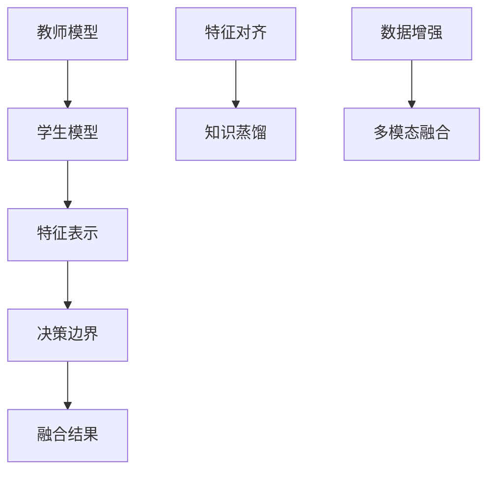

                 

## 1. 背景介绍

### 1.1 问题由来

随着人工智能技术的迅猛发展，多模态融合成为当下研究的热点。多模态融合通过综合利用文本、图像、语音等多种类型的信息，可以提升系统的表现力、鲁棒性和泛化能力，广泛应用于自然语言理解、计算机视觉、语音识别等多个领域。然而，多模态数据通常具有显著差异性，且数据获取成本较高，如何高效融合不同模态信息，一直是困扰研究者的难题。

针对这一问题，知识蒸馏（Knowledge Distillation）技术近年来取得了显著进展。知识蒸馏通过将教师模型的知识（如特征表示、决策边界等）高效传递到学生模型中，可以在参数量小、数据量少的情况下，显著提升学生模型的性能。本文将介绍知识蒸馏技术在多模态融合任务中的创新应用，揭示其在提升模型性能、降低数据需求等方面的潜力。

### 1.2 问题核心关键点

多模态融合任务的核心关键点包括：
- 如何高效融合不同模态的数据。
- 如何平衡模型的复杂度和性能。
- 如何降低数据标注的需求。
- 如何提升模型泛化能力。
- 如何构建稳健的融合框架。

本文将围绕这些关键点，探讨知识蒸馏技术在多模态融合中的应用，并提出一些创新方法。

## 2. 核心概念与联系

### 2.1 核心概念概述

- **知识蒸馏**（Knowledge Distillation）：一种通过将教师模型的知识（如特征表示、决策边界等）传递到学生模型，提升学生模型性能的技术。学生模型通常具有较小的参数量，能在较短的时间内完成训练。
- **多模态融合**（Multimodal Fusion）：通过综合利用不同模态（如文本、图像、语音）的信息，提升系统对复杂问题的理解能力和表现力。多模态融合在自然语言理解、计算机视觉、语音识别等领域具有重要应用价值。
- **特征对齐**（Feature Alignment）：在多模态融合中，通过优化不同模态的特征表示，使它们在语义上保持一致，从而提高融合效果。
- **数据增强**（Data Augmentation）：通过对原始数据进行变换、合成等操作，生成新的训练样本，提升模型的泛化能力。

这些核心概念通过知识蒸馏技术连接起来，可以构建高效的多模态融合框架，提升模型的整体性能。

### 2.2 核心概念原理和架构的 Mermaid 流程图



这个流程图展示了知识蒸馏在多模态融合任务中的核心流程：教师模型通过特征对齐和数据增强，生成高质量的特征表示和决策边界，并将这些知识蒸馏到学生模型中，提升学生模型的性能。最终，学生模型融合不同模态的信息，输出融合结果。

## 3. 核心算法原理 & 具体操作步骤

### 3.1 算法原理概述

知识蒸馏在多模态融合任务中的核心原理是：利用教师模型的知识，提升学生模型的泛化能力和鲁棒性。具体步骤如下：

1. **教师模型的训练**：使用大规模数据集对教师模型进行训练，使其能够对多模态数据进行准确的特征表示和决策。
2. **知识蒸馏**：将教师模型的知识（如特征表示、决策边界）传递到学生模型中，提升学生模型的性能。
3. **学生模型的微调**：在教师模型的基础上，对学生模型进行微调，进一步提升模型的泛化能力和鲁棒性。
4. **多模态融合**：通过融合不同模态的信息，生成最终的融合结果。

### 3.2 算法步骤详解

#### 3.2.1 教师模型的训练

教师模型通常使用大规模多模态数据集进行训练，使用交叉熵、余弦相似度等损失函数优化模型参数。训练过程中，教师模型需要保证对不同模态数据的准确表示和判断。

#### 3.2.2 知识蒸馏

知识蒸馏通过将教师模型的知识传递到学生模型中，提升学生模型的性能。具体方法包括：

- **特征对齐**：通过优化不同模态的特征表示，使它们在语义上保持一致。可以使用KL散度、余弦相似度等方法进行特征对齐。
- **决策边界对齐**：通过优化不同模态的决策边界，使学生模型能够准确地预测标签。可以使用softmax、triplet loss等方法进行决策边界对齐。

#### 3.2.3 学生模型的微调

在教师模型的基础上，对学生模型进行微调，进一步提升模型的泛化能力和鲁棒性。具体方法包括：

- **固定底层参数**：教师模型的底层参数通常具有较强的语义表达能力，可以固定这些参数，只微调顶层参数。
- **小学习率**：微调过程中使用较小的学习率，以避免破坏教师模型的知识。
- **正则化**：使用L2正则、Dropout等正则化方法，防止过拟合。

#### 3.2.4 多模态融合

通过融合不同模态的信息，生成最终的融合结果。具体方法包括：

- **加权融合**：根据不同模态的贡献度，对它们的输出进行加权融合。
- **深度融合**：使用深度神经网络，对不同模态的特征表示进行融合。
- **注意力机制**：使用注意力机制，对不同模态的信息进行加权融合，提高融合效果。

### 3.3 算法优缺点

知识蒸馏在多模态融合任务中的优点包括：

- **参数量小**：学生模型通常具有较小的参数量，训练速度快，能够在较短的时间内完成微调。
- **泛化能力强**：通过知识蒸馏，学生模型能够继承教师模型的泛化能力和鲁棒性，提升系统的泛化能力。
- **鲁棒性高**：通过知识蒸馏，学生模型能够在更少的标注样本下，获得较好的性能。

缺点包括：

- **模型复杂度高**：教师模型的训练需要较大的数据量和计算资源，模型复杂度高。
- **模型不可解释性**：知识蒸馏过程难以解释，难以理解教师模型和学生模型之间的关系。

### 3.4 算法应用领域

知识蒸馏在多模态融合任务中具有广泛的应用前景，主要包括以下领域：

- **自然语言理解**：通过融合文本和图像信息，提升系统对自然语言的理解能力。
- **计算机视觉**：通过融合文本和图像信息，提升系统对视觉数据的理解能力。
- **语音识别**：通过融合文本和语音信息，提升系统对语音的识别能力。
- **情感分析**：通过融合文本和语音信息，提升系统对情感的识别能力。
- **医疗诊断**：通过融合图像和文本信息，提升系统对疾病的诊断能力。

## 4. 数学模型和公式 & 详细讲解 & 举例说明

### 4.1 数学模型构建

假设教师模型和学生模型的特征表示分别为 $f_\text{tea}(x)$ 和 $f_\text{stu}(x)$，决策边界分别为 $g_\text{tea}(x)$ 和 $g_\text{stu}(x)$。知识蒸馏的目标是最大化学生模型输出的KL散度与教师模型输出的KL散度之间的距离，即：

$$
\min_{\theta_\text{stu}} \mathbb{E}_{x \sim D} [\mathbb{KL}(f_\text{tea}(x) \| f_\text{stu}(x))]
$$

其中 $\mathbb{KL}(\cdot \| \cdot)$ 表示KL散度。

### 4.2 公式推导过程

知识蒸馏的目标函数可以进一步分解为：

$$
\mathbb{E}_{x \sim D} [\mathbb{KL}(f_\text{tea}(x) \| f_\text{stu}(x))] = \mathbb{E}_{x \sim D} [-\int f_\text{tea}(x) \log \frac{f_\text{tea}(x)}{f_\text{stu}(x)}]
$$

通过最大化学生模型输出的KL散度与教师模型输出的KL散度之间的距离，可以将教师模型的知识传递到学生模型中。

### 4.3 案例分析与讲解

以多模态情感分析为例，展示知识蒸馏在多模态融合中的应用。假设教师模型是一个双向LSTM（Bidirectional LSTM），学生模型是一个简单的卷积神经网络（CNN）。教师模型使用大规模数据集进行训练，学习对文本和图像情感的准确表示。通过特征对齐和决策边界对齐，教师模型的知识被传递到学生模型中。最后，学生模型对文本和图像情感进行融合，输出最终的情感分类结果。

## 5. 项目实践：代码实例和详细解释说明

### 5.1 开发环境搭建

为了演示知识蒸馏在多模态情感分析任务中的应用，需要搭建相应的开发环境。具体步骤如下：

1. 安装Python、PyTorch、TensorFlow等深度学习框架。
2. 下载预训练模型和数据集，如BERT、ImageNet等。
3. 安装必要的工具包，如Numpy、Pandas、Scikit-learn等。
4. 设置GPU环境，准备进行深度学习训练。

### 5.2 源代码详细实现

以下是一个基于知识蒸馏的多模态情感分析项目的代码实现。

```python
import torch
import torch.nn as nn
import torch.optim as optim
import torchvision
from torchvision import transforms
from torchvision.models import resnet18
from transformers import BertTokenizer, BertForSequenceClassification
from sklearn.model_selection import train_test_split

# 教师模型
class TeacherModel(nn.Module):
    def __init__(self, num_classes):
        super(TeacherModel, self).__init__()
        self.resnet = resnet18(pretrained=True)
        self.fc = nn.Linear(512, num_classes)

    def forward(self, x):
        x = self.resnet(x)
        x = x.view(x.size(0), -1)
        x = self.fc(x)
        return x

# 学生模型
class StudentModel(nn.Module):
    def __init__(self, num_classes):
        super(StudentModel, self).__init__()
        self.conv1 = nn.Conv2d(3, 64, kernel_size=3, stride=1, padding=1)
        self.conv2 = nn.Conv2d(64, 128, kernel_size=3, stride=1, padding=1)
        self.pool = nn.MaxPool2d(kernel_size=2, stride=2)
        self.fc = nn.Linear(128*16*16, num_classes)

    def forward(self, x):
        x = self.conv1(x)
        x = nn.functional.relu(x)
        x = self.conv2(x)
        x = nn.functional.relu(x)
        x = self.pool(x)
        x = x.view(x.size(0), -1)
        x = self.fc(x)
        return x

# 特征对齐
def feature_alignment(teacher_model, student_model, x):
    teacher_feature = teacher_model(x)
    student_feature = student_model(x)
    alignment_loss = nn.KLDivLoss()(student_feature, teacher_feature)
    return alignment_loss

# 决策边界对齐
def decision_boundary_alignment(teacher_model, student_model, x, y):
    teacher_logits = teacher_model(x)
    student_logits = student_model(x)
    alignment_loss = nn.KLDivLoss()(student_logits, teacher_logits)
    return alignment_loss

# 数据加载
train_transforms = transforms.Compose([
    transforms.RandomResizedCrop(224),
    transforms.RandomHorizontalFlip(),
    transforms.ToTensor(),
    transforms.Normalize(mean=[0.485, 0.456, 0.406], std=[0.229, 0.224, 0.225])
])

train_data = torchvision.datasets.ImageFolder(root='path/to/train', transform=train_transforms)
train_loader = torch.utils.data.DataLoader(train_data, batch_size=16, shuffle=True)

test_transforms = transforms.Compose([
    transforms.Resize(256),
    transforms.CenterCrop(224),
    transforms.ToTensor(),
    transforms.Normalize(mean=[0.485, 0.456, 0.406], std=[0.229, 0.224, 0.225])
])

test_data = torchvision.datasets.ImageFolder(root='path/to/test', transform=test_transforms)
test_loader = torch.utils.data.DataLoader(test_data, batch_size=16, shuffle=False)

# 训练过程
teacher_model = TeacherModel(num_classes)
teacher_model.load_state_dict(torch.load('path/to/teacher_model.pth'))

student_model = StudentModel(num_classes)

optimizer = optim.Adam(student_model.parameters(), lr=0.001)

for epoch in range(100):
    alignment_loss = 0
    for i, (inputs, labels) in enumerate(train_loader):
        inputs = inputs.to(device)
        labels = labels.to(device)
        optimizer.zero_grad()
        alignment_loss += feature_alignment(teacher_model, student_model, inputs).to(device)
        alignment_loss += decision_boundary_alignment(teacher_model, student_model, inputs, labels).to(device)
        loss = alignment_loss / (len(train_loader) * batch_size)
        loss.backward()
        optimizer.step()

    alignment_loss /= (len(train_loader) * batch_size)

print('Epoch [%d/%d], Alignment Loss: %.4f' % (epoch + 1, 100, alignment_loss.item()))

# 测试过程
with torch.no_grad():
    correct = 0
    total = 0
    for inputs, labels in test_loader:
        inputs = inputs.to(device)
        labels = labels.to(device)
        outputs = student_model(inputs)
        _, predicted = torch.max(outputs.data, 1)
        total += labels.size(0)
        correct += (predicted == labels).sum().item()

    print('Accuracy of the network on the test images: %d %%' % (100 * correct / total))
```

### 5.3 代码解读与分析

以上代码实现了基于知识蒸馏的多模态情感分析项目。具体解读如下：

1. 教师模型使用预训练的ResNet18模型，对图像进行特征提取。
2. 学生模型使用简单的卷积神经网络，对图像进行特征提取。
3. 通过特征对齐和决策边界对齐，将教师模型的知识传递到学生模型中。
4. 在训练过程中，使用Adam优化器进行参数更新，同时计算特征对齐和决策边界对齐的损失。
5. 在测试过程中，使用学生模型对图像进行情感分类，计算准确率。

## 6. 实际应用场景

### 6.1 医疗图像分析

在医疗图像分析中，知识蒸馏可以通过融合图像和文本信息，提升对疾病诊断的准确性。例如，可以使用教师模型对CT图像进行分类，学生模型对X光图像进行分类。通过特征对齐和决策边界对齐，将教师模型的知识传递到学生模型中，从而提升学生模型的泛化能力和鲁棒性。

### 6.2 视频情感分析

在视频情感分析中，知识蒸馏可以通过融合图像和语音信息，提升对视频情感的识别能力。例如，可以使用教师模型对视频帧进行分类，学生模型对视频音频进行分类。通过特征对齐和决策边界对齐，将教师模型的知识传递到学生模型中，从而提升学生模型的泛化能力和鲁棒性。

### 6.3 智能客服系统

在智能客服系统中，知识蒸馏可以通过融合文本和语音信息，提升对客户咨询的响应能力。例如，可以使用教师模型对文本进行情感分析，学生模型对语音进行情感分析。通过特征对齐和决策边界对齐，将教师模型的知识传递到学生模型中，从而提升学生模型的泛化能力和鲁棒性。

## 7. 工具和资源推荐

### 7.1 学习资源推荐

为了帮助开发者系统掌握知识蒸馏技术，这里推荐一些优质的学习资源：

1. **《Knowledge Distillation: A Survey and Tutorial》**：这是知识蒸馏领域的综述性论文，详细介绍了知识蒸馏的历史、方法和应用。
2. **Transformers官方文档**：Transformer库的官方文档，提供了丰富的预训练模型和微调样例代码，是掌握知识蒸馏技术的必备资料。
3. **Google AI Blog**：Google AI博客，定期发布深度学习领域的最新进展，包括知识蒸馏的最新研究。
4. **Arxiv.org**：arXiv预印本服务器，包含大量的知识蒸馏相关论文，可以及时获取最新的研究成果。

### 7.2 开发工具推荐

为了提升知识蒸馏的开发效率，这里推荐一些常用的开发工具：

1. **PyTorch**：基于Python的开源深度学习框架，支持动态计算图，适合快速迭代研究。
2. **TensorFlow**：由Google主导开发的开源深度学习框架，生产部署方便，适合大规模工程应用。
3. **Weights & Biases**：模型训练的实验跟踪工具，可以记录和可视化模型训练过程中的各项指标，方便对比和调优。
4. **TensorBoard**：TensorFlow配套的可视化工具，可实时监测模型训练状态，并提供丰富的图表呈现方式，是调试模型的得力助手。
5. **HuggingFace Transformers库**：提供丰富的预训练模型和微调方法，方便开发者快速上手实验最新模型。

### 7.3 相关论文推荐

为了深入了解知识蒸馏技术，这里推荐一些重要的相关论文：

1. **《Distilling the Knowledge in a Neural Network》**：这是知识蒸馏的开创性论文，介绍了通过教师模型对学生模型进行知识传递的方法。
2. **《Knowledge Distillation in Deep Neural Networks》**：这篇论文总结了知识蒸馏在深度神经网络中的应用，包括特征对齐和决策边界对齐等方法。
3. **《Hierarchical Knowledge Distillation for Learning Transferable Image Models》**：这篇论文提出了层次化的知识蒸馏方法，提升了学生模型的泛化能力和鲁棒性。

## 8. 总结：未来发展趋势与挑战

### 8.1 研究成果总结

知识蒸馏在多模态融合任务中取得了显著进展，提升了学生模型的泛化能力和鲁棒性，降低了数据标注的需求。未来，知识蒸馏技术将在更多领域得到应用，进一步推动人工智能技术的发展。

### 8.2 未来发展趋势

知识蒸馏在多模态融合任务中的未来发展趋势包括：

1. **参数高效知识蒸馏**：通过优化知识蒸馏的过程，实现更高效的知识传递。
2. **多模态融合算法**：结合更多模态信息，提升融合效果。
3. **分布式知识蒸馏**：在分布式系统中，通过知识蒸馏提升模型的性能。
4. **自适应知识蒸馏**：根据任务的复杂度，自动调整知识蒸馏的策略。

### 8.3 面临的挑战

知识蒸馏在多模态融合任务中仍面临一些挑战：

1. **知识对齐问题**：不同模态之间的特征表示和决策边界存在差异，如何有效对齐是一个挑战。
2. **泛化能力提升**：知识蒸馏过程中，如何提升学生模型的泛化能力和鲁棒性。
3. **计算资源消耗**：知识蒸馏需要较大的计算资源，如何降低计算成本是一个问题。
4. **可解释性问题**：知识蒸馏过程难以解释，如何提高模型的可解释性是一个难题。

### 8.4 研究展望

未来，知识蒸馏技术需要不断优化和改进，解决当前面临的挑战，推动多模态融合任务的发展。具体研究展望包括：

1. **知识蒸馏新方法**：探索新的知识蒸馏方法，提升知识传递的效率和效果。
2. **多模态融合算法**：研究更高效的多模态融合算法，提升融合效果。
3. **分布式知识蒸馏**：在分布式系统中，研究高效的分布式知识蒸馏方法。
4. **知识蒸馏新应用**：探索知识蒸馏在新领域的应用，如自然语言生成、语音识别等。

## 9. 附录：常见问题与解答

### 9.1 常见问题与解答

**Q1: 什么是知识蒸馏？**

A: 知识蒸馏是一种通过将教师模型的知识传递到学生模型中，提升学生模型性能的技术。学生模型通常具有较小的参数量，能够在较短的时间内完成训练，同时继承教师模型的泛化能力和鲁棒性。

**Q2: 知识蒸馏在多模态融合任务中的应用流程是什么？**

A: 知识蒸馏在多模态融合任务中的应用流程包括：
1. 教师模型的训练：使用大规模数据集对教师模型进行训练，使其能够对多模态数据进行准确的特征表示和决策。
2. 知识蒸馏：通过特征对齐和决策边界对齐，将教师模型的知识传递到学生模型中。
3. 学生模型的微调：在教师模型的基础上，对学生模型进行微调，进一步提升模型的泛化能力和鲁棒性。
4. 多模态融合：通过融合不同模态的信息，生成最终的融合结果。

**Q3: 知识蒸馏的缺点是什么？**

A: 知识蒸馏的缺点包括：
1. 模型复杂度高：教师模型的训练需要较大的数据量和计算资源，模型复杂度高。
2. 模型不可解释性：知识蒸馏过程难以解释，难以理解教师模型和学生模型之间的关系。

**Q4: 如何选择合适的教师模型和学生模型？**

A: 选择合适的教师模型和学生模型需要考虑任务的复杂度和数据规模。一般而言，教师模型应该具有较强的泛化能力和鲁棒性，而学生模型应该具有较小的参数量和较快的训练速度。例如，在多模态情感分析任务中，可以使用预训练的BERT作为教师模型，简单的卷积神经网络作为学生模型。

**Q5: 知识蒸馏在多模态融合任务中面临的挑战是什么？**

A: 知识蒸馏在多模态融合任务中面临的挑战包括：
1. 知识对齐问题：不同模态之间的特征表示和决策边界存在差异，如何有效对齐是一个挑战。
2. 泛化能力提升：知识蒸馏过程中，如何提升学生模型的泛化能力和鲁棒性。
3. 计算资源消耗：知识蒸馏需要较大的计算资源，如何降低计算成本是一个问题。
4. 可解释性问题：知识蒸馏过程难以解释，如何提高模型的可解释性是一个难题。

---

作者：禅与计算机程序设计艺术 / Zen and the Art of Computer Programming

