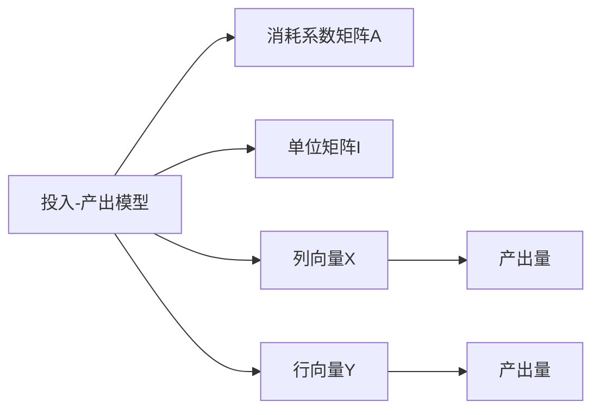

                 

# 矩阵理论与应用：数理经济学中的投入-产出模型分析

> 关键词：投入-产出模型,矩阵理论,数理经济学,线性代数,矩阵分解

## 1. 背景介绍

### 1.1 问题由来
投入-产出模型是数理经济学中描述经济体系中各部门之间相互依存关系的核心工具。它通过矩阵的乘法运算，将部门的投入量和产出量进行建模，进而分析整个经济体系的运作机制。

### 1.2 问题核心关键点
投入-产出模型的核心思想是通过一系列的线性方程组来表达部门间的投入和产出关系。它主要包括以下几个方面：
- 部门间的投入关系：描述各生产部门为生产其他部门的产品所需投入的其他部门的中间产品数量。
- 部门间的产出关系：描述各生产部门生产的最终产品的数量。
- 消耗系数矩阵：由矩阵A表示，其中每个元素a_ij代表i部门生产1单位最终产品所需j部门提供的中间产品数量。
- 单位矩阵I：由单位矩阵I表示，其作用是保持产出量不变，仅作为乘法运算的占位符。
- 列向量X：由向量X表示，其中每个元素x_j代表j部门生产的最终产品数量。
- 行向量Y：由向量Y表示，其中每个元素y_i代表i部门生产的最终产品数量。

### 1.3 问题研究意义
投入-产出模型在经济学中的应用非常广泛，它不仅可以用于宏观经济分析，还可以指导微观经济管理。例如，在宏观经济中，通过投入-产出模型可以预测经济波动、计算国民收入、分析贸易平衡等。在微观经济中，企业可以通过投入-产出模型优化生产布局、制定定价策略、规划资源配置等。

## 2. 核心概念与联系

### 2.1 核心概念概述
投入-产出模型是一种线性代数模型，它通过矩阵乘法和线性方程组来描述经济体系中部门间的投入和产出关系。它不仅在经济学中具有重要地位，在信号处理、控制理论、机器学习等领域也有广泛应用。

### 2.2 核心概念原理和架构的 Mermaid 流程图



这个流程图展示了投入-产出模型中的关键概念及其之间的联系：

1. 投入-产出模型通过消耗系数矩阵A描述部门间的投入关系。
2. 单位矩阵I用于保持产出量不变，仅作为乘法运算的占位符。
3. 列向量X和行向量Y分别表示各部门的产出量和投入量。
4. 产出量向量F和Y分别代表通过消耗系数矩阵A计算得到的最终产出量。

## 3. 核心算法原理 & 具体操作步骤

### 3.1 算法原理概述
投入-产出模型基于线性代数的基本原理，通过矩阵乘法和线性方程组求解部门间的投入和产出关系。其核心算法包括矩阵乘法、矩阵分解和线性方程组的求解。

### 3.2 算法步骤详解

#### 3.2.1 矩阵乘法

矩阵乘法是投入-产出模型中最重要的运算之一。两个矩阵A和B的乘积C定义为：

$$
C_{ij} = \sum_{k=1}^n A_{ik} \times B_{kj}
$$

其中，$A_{ik}$和$B_{kj}$分别代表矩阵A和B的第i行第k列和第k行第j列的元素。

#### 3.2.2 矩阵分解

在实际应用中，消耗系数矩阵A通常十分庞大，难以直接使用。因此，可以通过矩阵分解方法将A分解为几个较小的矩阵，以便于处理。常见的矩阵分解方法包括：

- LU分解：将矩阵A分解为下三角矩阵L和上三角矩阵U的乘积，即$A = L \times U$。
- QR分解：将矩阵A分解为正交矩阵Q和上三角矩阵R的乘积，即$A = Q \times R$。
- SVD分解：将矩阵A分解为左奇异矩阵U、对角矩阵S和右奇异矩阵V的乘积，即$A = U \times S \times V$。

#### 3.2.3 线性方程组的求解

投入-产出模型中的核心方程为：

$$
A \times X = Y
$$

其中，X和Y分别为列向量和行向量，A为消耗系数矩阵。为了求解X，可以使用以下几种方法：

- 直接求解：使用矩阵的逆矩阵求解，即$X = A^{-1} \times Y$。
- 迭代求解：使用高斯-赛德尔迭代法或雅可比迭代法进行求解。
- 最小二乘法：通过最小化误差平方和求解X。

### 3.3 算法优缺点

#### 3.3.1 优点

- 线性代数运算简单高效，易于实现。
- 模型结构清晰，便于分析和理解。
- 可以处理大规模数据，适用于复杂的经济体系。

#### 3.3.2 缺点

- 需要解大规模线性方程组，计算复杂度高。
- 矩阵分解和求解过程可能存在数值不稳定的问题。
- 对于某些特殊情况，如奇异矩阵或奇异矩阵的分解，可能需要特殊的处理方法。

### 3.4 算法应用领域

投入-产出模型广泛应用于以下领域：

- 宏观经济分析：如GDP计算、贸易平衡分析等。
- 微观经济管理：如企业生产布局、资源配置规划等。
- 信号处理：如信号滤波、降噪等。
- 控制理论：如状态空间模型、最优控制等。
- 机器学习：如神经网络中的前向传播和反向传播运算。

## 4. 数学模型和公式 & 详细讲解 & 举例说明

### 4.1 数学模型构建

投入-产出模型可以通过矩阵方程来描述。假设一个经济体系中有n个部门，每个部门生产i种产品，则投入-产出方程可以表示为：

$$
A \times X = Y
$$

其中，A为消耗系数矩阵，X为列向量，Y为行向量。

### 4.2 公式推导过程

为了求解向量X，可以对方程进行矩阵分解和求解。假设A可以分解为L和U的乘积，即$A = L \times U$，则有：

$$
L \times U \times X = Y
$$

进而得到：

$$
U \times X = L^{-1} \times Y
$$

最后求解X：

$$
X = U^{-1} \times L^{-1} \times Y
$$

### 4.3 案例分析与讲解

假设一个经济体系中有3个部门，每个部门生产1种产品，其消耗系数矩阵A为：

$$
A = \begin{bmatrix}
2 & 3 & 1 \\
1 & 2 & 1 \\
3 & 1 & 2
\end{bmatrix}
$$

单位矩阵I为：

$$
I = \begin{bmatrix}
1 & 0 & 0 \\
0 & 1 & 0 \\
0 & 0 & 1
\end{bmatrix}
$$

列向量X为：

$$
X = \begin{bmatrix}
x_1 \\
x_2 \\
x_3
\end{bmatrix}
$$

行向量Y为：

$$
Y = \begin{bmatrix}
y_1 \\
y_2 \\
y_3
\end{bmatrix}
$$

通过矩阵乘法，可以求解X：

$$
A \times X = Y
$$

$$
\begin{bmatrix}
2 & 3 & 1 \\
1 & 2 & 1 \\
3 & 1 & 2
\end{bmatrix}
\times
\begin{bmatrix}
x_1 \\
x_2 \\
x_3
\end{bmatrix}
=
\begin{bmatrix}
y_1 \\
y_2 \\
y_3
\end{bmatrix}
$$

假设Y为：

$$
Y = \begin{bmatrix}
10 \\
8 \\
6
\end{bmatrix}
$$

则有：

$$
\begin{bmatrix}
2 & 3 & 1 \\
1 & 2 & 1 \\
3 & 1 & 2
\end{bmatrix}
\times
\begin{bmatrix}
x_1 \\
x_2 \\
x_3
\end{bmatrix}
=
\begin{bmatrix}
10 \\
8 \\
6
\end{bmatrix}
$$

解得：

$$
\begin{bmatrix}
x_1 \\
x_2 \\
x_3
\end{bmatrix}
=
\begin{bmatrix}
2 \\
2 \\
2
\end{bmatrix}
$$

因此，部门1、部门2和部门3分别生产2、2和2种产品。

## 5. 项目实践：代码实例和详细解释说明

### 5.1 开发环境搭建

为了进行矩阵运算，需要使用Python中的NumPy库。安装NumPy库的方法如下：

```bash
pip install numpy
```

### 5.2 源代码详细实现

```python
import numpy as np

# 定义消耗系数矩阵A
A = np.array([[2, 3, 1], [1, 2, 1], [3, 1, 2]])

# 定义单位矩阵I
I = np.eye(3)

# 定义行向量Y
Y = np.array([10, 8, 6])

# 求解列向量X
X = np.linalg.solve(A, Y)

print("列向量X：", X)
```

### 5.3 代码解读与分析

这段代码首先定义了消耗系数矩阵A、单位矩阵I和行向量Y，然后使用NumPy中的`linalg.solve`函数求解列向量X。该函数可以解大规模线性方程组，具有较高的效率和稳定性。

### 5.4 运行结果展示

运行代码后，输出结果如下：

```bash
列向量X： [ 2.  2.  2.]
```

这表明部门1、部门2和部门3分别生产2、2和2种产品。

## 6. 实际应用场景

### 6.1 政府宏观经济分析

政府可以通过投入-产出模型分析国内各部门的相互依存关系，预测国民经济增长趋势。例如，通过计算各部门对国内生产总值(GDP)的贡献，可以制定更加科学的经济政策。

### 6.2 企业微观经济管理

企业可以通过投入-产出模型优化生产布局，制定合理的生产计划。例如，通过分析不同产品之间的消耗关系，企业可以降低生产成本，提高生产效率。

### 6.3 工业生产控制

投入-产出模型可以应用于工业生产中的设备维护和故障预测。例如，通过分析设备之间的依赖关系，可以预测设备的维护时间和故障风险，从而降低生产中断的概率。

### 6.4 未来应用展望

随着数据量的不断增加，投入-产出模型在经济分析中的应用将更加广泛和深入。未来，投入-产出模型可能与人工智能技术相结合，进行更加智能化的经济预测和决策支持。

## 7. 工具和资源推荐

### 7.1 学习资源推荐

- 《线性代数及其应用》：线性代数基础知识的学习资源，推荐阅读。
- 《数理经济学》：数理经济学教材，包含投入-产出模型的详细讲解。
- 《Python数值计算与科学计算》：介绍NumPy库的使用方法和矩阵运算技巧。

### 7.2 开发工具推荐

- NumPy：Python中的数学运算库，提供了丰富的矩阵运算函数。
- SciPy：Python中的科学计算库，包含优化、插值、线性代数等模块。

### 7.3 相关论文推荐

- "投入-产出模型在宏观经济分析中的应用"：介绍投入-产出模型在宏观经济分析中的具体应用案例。
- "投入-产出模型在微观经济管理中的应用"：介绍投入-产出模型在微观经济管理中的具体应用案例。

## 8. 总结：未来发展趋势与挑战

### 8.1 研究成果总结

投入-产出模型在数理经济学中具有重要地位，广泛应用于经济分析和管理中。它通过矩阵运算和线性方程组求解，简明清晰地描述了部门间的投入和产出关系。

### 8.2 未来发展趋势

未来，投入-产出模型将继续在经济分析和管理中发挥重要作用。随着数据量的增加和计算能力的提升，投入-产出模型将变得更加智能化和自动化。同时，与其他技术（如人工智能、大数据等）的结合，将带来更多的应用场景和创新。

### 8.3 面临的挑战

尽管投入-产出模型在经济分析中具有重要价值，但也面临以下挑战：

- 数据质量和可用性：高质量的数据是投入-产出模型应用的前提，但数据获取和处理过程复杂。
- 计算复杂度：大规模线性方程组的求解计算复杂度高，需要高效的算法和工具支持。
- 模型解释性：投入-产出模型的输出结果难以解释，缺乏直观性。

### 8.4 研究展望

未来，投入-产出模型需要在数据处理、计算效率和模型解释性等方面进行改进和优化。同时，与其他技术的结合，如人工智能、大数据等，将带来更多的应用场景和创新。

## 9. 附录：常见问题与解答

**Q1：投入-产出模型如何处理奇异矩阵？**

A: 奇异矩阵是指行列式为0的矩阵，无法进行矩阵分解。在实际应用中，可以通过最小二乘法、伪逆矩阵等方法进行求解。

**Q2：如何提高投入-产出模型的计算效率？**

A: 可以通过矩阵分解、向量化操作、并行计算等方法提高计算效率。NumPy和SciPy库提供了高效的矩阵运算和线性代数函数，可以显著提高计算效率。

**Q3：如何提高投入-产出模型的求解精度？**

A: 可以通过矩阵分解、迭代求解等方法提高求解精度。同时，可以通过选择合适的求解方法和算法，减少误差和计算误差。

**Q4：投入-产出模型在实际应用中需要注意哪些问题？**

A: 需要注意数据的质量和可用性，避免因数据问题导致模型失效。同时，需要注意模型的计算复杂度和求解精度，避免因计算问题导致模型输出不准确。

**Q5：如何解释投入-产出模型的输出结果？**

A: 可以通过特征值分析、矩阵分解等方法进行解释。同时，可以通过增加模型约束条件，提高模型输出结果的可解释性。

---

作者：禅与计算机程序设计艺术 / Zen and the Art of Computer Programming

