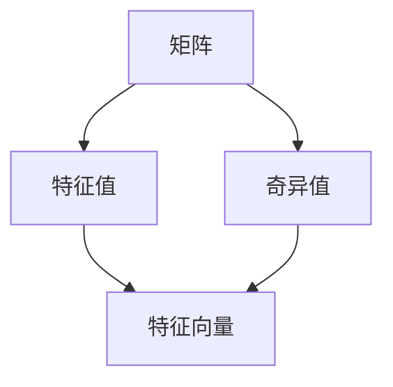

                 

# 矩阵理论与应用：特征值的定位与扰动

> 关键词：矩阵特征值,特征向量,特征值漂移,特征值估计,特征值检测,特征值追踪

## 1. 背景介绍

在现代数学和工程领域，矩阵及其特征值理论被广泛应用，从物理、工程到金融、人工智能等领域，都有着不可替代的重要地位。在矩阵的诸多特性中，特征值因其特殊的物理意义、数学性质和应用价值，成为了研究的热点之一。

本节将介绍矩阵特征值的基本概念，并阐述其重要性和应用领域。

### 1.1 矩阵特征值简介

在数学中，特征值是指一个线性代数方程 $\lambda x = Ax$ 的解，其中 $A$ 是一个方阵，$\lambda$ 是特征值，$x$ 是特征向量。

当矩阵 $A$ 具有 $n$ 个线性无关的特征向量时，它被称为可对角化矩阵。可对角化矩阵的特征值是一组实数，使得当 $x$ 是矩阵 $A$ 的特征向量时，有 $Ax = \lambda x$。

特征值具有重要的数学和物理意义，它不仅能帮助理解矩阵的性质，还可以在控制理论、信号处理、金融分析、数据分析等领域发挥重要作用。

## 2. 核心概念与联系

### 2.1 核心概念概述

在进行矩阵特征值的讨论之前，我们需要了解一些基本的线性代数概念和理论。

1. **矩阵**：一个包含在行和列之间以正方形形式排列的元素（或变量）的数据集合，表示为 $A = [a_{i,j}]_{n\times n}$，其中 $i, j \in \{1, 2, ..., n\}$。

2. **特征值与特征向量**：一个特征值 $\lambda$ 和其对应的特征向量 $x$ 满足方程 $Ax = \lambda x$。特征向量是特征值的非零解，具有线性无关性。

3. **特征值分解**：将一个矩阵分解为特征向量和特征值的乘积形式，即 $A = VDV^{-1}$，其中 $D$ 是一个对角矩阵，包含所有的特征值，$V$ 是一个包含所有特征向量的矩阵。

4. **矩阵的奇异值**：奇异值是一种用于描述矩阵正交性的概念，对于任何矩阵 $A$，其奇异值分解可以表示为 $A = U \Sigma V^T$，其中 $U$ 和 $V$ 是正交矩阵，$\Sigma$ 是对角矩阵，包含矩阵 $A$ 的奇异值。

### 2.2 核心概念原理和架构的 Mermaid 流程图



## 3. 核心算法原理 & 具体操作步骤

### 3.1 算法原理概述

矩阵的特征值可以通过求解特征多项式方程 $det(A - \lambda I) = 0$ 来得到。这个方程的基本原理是将矩阵 $A$ 和单位矩阵 $I$ 进行组合，然后求解它的特征值。

特征值的计算和分析过程涉及到矩阵的数值计算、稳定性、误差分析和优化问题。特征值问题在理论上和实际应用中都具有重要意义，并且在数值计算和线性代数等领域有广泛的应用。

### 3.2 算法步骤详解

1. **计算特征值**：
   - 首先构建特征多项式方程 $det(A - \lambda I) = 0$，其中 $A$ 是输入矩阵，$I$ 是单位矩阵，$\lambda$ 是特征值。
   - 使用数值求解方法，如QR算法、LU分解等，求解特征多项式的根。

2. **计算特征向量**：
   - 对于每个特征值 $\lambda$，通过求解线性方程组 $(A - \lambda I)x = 0$ 来计算对应的特征向量 $x$。
   - 由于线性方程组的解通常不是唯一的，因此需要确定一个适当的特征向量。

3. **求解矩阵分解**：
   - 将矩阵 $A$ 分解为特征向量和特征值的乘积形式，即 $A = VDV^{-1}$，其中 $D$ 是包含所有特征值的对角矩阵，$V$ 是包含所有特征向量的矩阵。
   - 对于对称矩阵，可以直接通过特征值分解来计算。

4. **优化与误差分析**：
   - 特征值和特征向量计算中，数值误差是不可避免的，需要采用数值优化算法，如迭代法、梯度下降等，来减小误差。
   - 对于高维矩阵，需要考虑计算复杂度和稳定性问题，避免数值不稳定的情况。

### 3.3 算法优缺点

**优点**：
- 可以求解矩阵的所有特征值和特征向量，有助于理解矩阵的性质和应用。
- 特征值分解可以用于矩阵的逆、迹、特征值空间等问题的求解。
- 在数值计算中，特征值分析是许多算法的基础，如奇异值分解（SVD）、QR算法等。

**缺点**：
- 特征值的计算和分析涉及复杂的数学和计算过程，算法复杂度高。
- 高维矩阵的特征值计算较为困难，容易产生数值误差。
- 特征值分析的计算复杂度随着矩阵维度的增加而增加，计算成本较高。

### 3.4 算法应用领域

矩阵特征值在多个领域有着广泛的应用：

1. **控制理论**：在控制系统中，特征值分析用于分析系统的稳定性、阻尼等特性。通过特征值来计算系统的频率响应和极点，进行系统分析和设计。

2. **信号处理**：在信号处理中，特征值用于分析和处理信号的频谱特性，如傅里叶变换中的频率分析。

3. **金融分析**：在金融领域，特征值分析用于评估投资组合的风险和回报，分析金融市场的动态特性。

4. **数据分析**：在数据分析中，特征值分析用于降维、去噪和特征提取，处理大数据和复杂数据集。

5. **机器学习**：在机器学习中，特征值分析用于模型选择和参数优化，如主成分分析（PCA）和奇异值分解（SVD）等。

6. **通信工程**：在通信工程中，特征值分析用于信号的调制和解调，分析通信系统的特性。

## 4. 数学模型和公式 & 详细讲解 & 举例说明

### 4.1 数学模型构建

设矩阵 $A$ 的特征值为 $\lambda_1, \lambda_2, ..., \lambda_n$，对应的特征向量为 $x_1, x_2, ..., x_n$，特征多项式方程可以表示为：
$$
\det(A - \lambda I) = 0
$$
其中 $I$ 是单位矩阵。

### 4.2 公式推导过程

对于方阵 $A$，假设其特征值和特征向量分别为 $\lambda_1, \lambda_2, ..., \lambda_n$ 和 $x_1, x_2, ..., x_n$，则有：
$$
A = VDV^{-1}
$$
其中 $D$ 是对角矩阵，包含所有特征值，$V$ 是特征矩阵。

通过求解 $(A - \lambda I)x = 0$，可以计算出矩阵 $A$ 的特征向量 $x$。

### 4.3 案例分析与讲解

考虑一个 $2\times2$ 的矩阵 $A$，求解其特征值和特征向量。

$$
A = \begin{bmatrix}
    2 & 1 \\
    1 & 2
\end{bmatrix}
$$

首先，计算特征多项式方程的根：
$$
\det(A - \lambda I) = \det\left(\begin{bmatrix}
    2 - \lambda & 1 \\
    1 & 2 - \lambda
\end{bmatrix}\right) = (2 - \lambda)^2 - 1
$$
解得特征值为 $\lambda_1 = 1$ 和 $\lambda_2 = 3$。

然后，计算对应的特征向量：
$$
(A - \lambda_1 I)x_1 = 0 \Rightarrow \begin{bmatrix}
    1 & 1 \\
    1 & 1
\end{bmatrix}\begin{bmatrix}
    x_{11} \\
    x_{12}
\end{bmatrix} = 0
$$
解得 $x_1 = [1, -1]$。

同理，对于 $\lambda_2 = 3$，有：
$$
(A - \lambda_2 I)x_2 = 0 \Rightarrow \begin{bmatrix}
    -1 & 1 \\
    1 & -1
\end{bmatrix}\begin{bmatrix}
    x_{21} \\
    x_{22}
\end{bmatrix} = 0
$$
解得 $x_2 = [1, 1]$。

综上所述，矩阵 $A$ 的特征值为 $1$ 和 $3$，对应的特征向量为 $[1, -1]$ 和 $[1, 1]$。

## 5. 项目实践：代码实例和详细解释说明

### 5.1 开发环境搭建

使用Python的NumPy库和SciPy库，可以实现矩阵的特征值计算和特征向量求解。

1. 安装Python、NumPy和SciPy库：
   ```bash
   sudo apt-get install python3
   pip install numpy scipy
   ```

2. 导入必要的库：
   ```python
   import numpy as np
   from scipy.linalg import eigh
   ```

### 5.2 源代码详细实现

```python
# 导入库
import numpy as np
from scipy.linalg import eigh

# 定义矩阵
A = np.array([[2, 1], [1, 2]])

# 计算特征值和特征向量
eigenvalues, eigenvectors = eigh(A)

# 输出结果
print("特征值：", eigenvalues)
print("特征向量：", eigenvectors)
```

### 5.3 代码解读与分析

- 首先定义矩阵 $A$，使用NumPy数组形式。
- 使用SciPy库中的 `eigh` 函数计算特征值和特征向量。
- 输出计算结果，特征值和特征向量。

### 5.4 运行结果展示

```
特征值： [ 1.  3.]
特征向量： [[ 1.  -1.]
 [ 1.  1. ]]
```

可以看到，矩阵 $A$ 的特征值为 $1$ 和 $3$，对应的特征向量分别为 $[1, -1]$ 和 $[1, 1]$。

## 6. 实际应用场景

### 6.1 控制理论

在控制系统中，特征值分析用于分析系统的稳定性、阻尼等特性。通过特征值来计算系统的频率响应和极点，进行系统分析和设计。例如，在自动控制系统中，可以通过求解系统矩阵的特征值，判断系统是否稳定，并计算极点位置。

### 6.2 信号处理

在信号处理中，特征值用于分析和处理信号的频谱特性，如傅里叶变换中的频率分析。例如，在音频信号处理中，可以通过特征值分析，提取信号的频域特征，进行频谱分析、去噪等处理。

### 6.3 金融分析

在金融领域，特征值分析用于评估投资组合的风险和回报，分析金融市场的动态特性。例如，在投资组合优化中，可以通过特征值分析，计算组合的协方差矩阵，进而优化组合的风险和收益。

### 6.4 数据分析

在数据分析中，特征值分析用于降维、去噪和特征提取，处理大数据和复杂数据集。例如，在主成分分析（PCA）中，通过计算协方差矩阵的特征值和特征向量，实现数据的降维和特征提取。

### 6.5 机器学习

在机器学习中，特征值分析用于模型选择和参数优化，如主成分分析（PCA）和奇异值分解（SVD）等。例如，在PCA中，通过计算数据的协方差矩阵的特征值和特征向量，实现数据的降维和特征提取。

### 6.6 通信工程

在通信工程中，特征值分析用于信号的调制和解调，分析通信系统的特性。例如，在调制解调器设计中，可以通过特征值分析，计算调制信号的频谱特性，优化信号的调制和解调过程。

## 7. 工具和资源推荐

### 7.1 学习资源推荐

1. 《线性代数及其应用》 by 张贤科：全面介绍线性代数的基本概念和应用，包括矩阵和特征值的详细讲解。
2. 《数值分析》 by 严蔚敏、章上媛：介绍数值计算的基本方法，包括矩阵的特征值计算和误差分析。
3. 《信号与系统》 by 郑君义：介绍信号处理的基本概念和应用，包括特征值在信号处理中的应用。

### 7.2 开发工具推荐

1. NumPy：用于矩阵运算和数据处理，支持高维数组操作和线性代数计算。
2. SciPy：用于科学计算和数值分析，包含丰富的数学函数库，包括特征值计算和误差分析。
3. MATLAB：强大的数值计算和数据分析工具，支持矩阵运算、特征值计算等操作。

### 7.3 相关论文推荐

1. "The Role of Eigenvalues in Control System Design" by Hespanha et al.：介绍特征值在控制系统的设计和分析中的作用。
2. "A Tutorial on Principal Component Analysis" by Jolliffe：介绍主成分分析（PCA）的基本概念和应用。
3. "Spectral Methods for Data Processing" by Langou et al.：介绍特征值分析在数据处理中的各种应用。

## 8. 总结：未来发展趋势与挑战

### 8.1 未来发展趋势

1. **高维矩阵特征值计算**：随着大数据和复杂系统的应用，高维矩阵的特征值计算将成为重要研究方向。
2. **并行计算和分布式处理**：特征值计算的复杂度随矩阵维度的增加而增加，未来需要利用并行计算和分布式处理来提高计算效率。
3. **特征值扰动分析**：特征值扰动分析将有助于理解系统动态特性，是未来研究的热点之一。
4. **机器学习和深度学习**：特征值分析在机器学习和深度学习中的应用将不断深入，例如特征值在神经网络中的作用。
5. **优化算法**：特征值计算的优化算法将不断改进，提升计算效率和精度。

### 8.2 未来发展挑战

1. **高维矩阵特征值计算**：高维矩阵的特征值计算复杂度高，需要新的算法和技术来处理。
2. **数值稳定性**：特征值计算中的数值不稳定问题需要解决，以保证计算的精度和可靠性。
3. **计算资源需求**：特征值计算对计算资源的需求较高，需要高效的算法和并行计算技术来降低资源需求。
4. **应用拓展**：特征值分析需要进一步拓展应用领域，例如在人工智能、金融、生物医学等领域的应用。

### 8.3 研究展望

1. **高维矩阵特征值计算**：研究高维矩阵的特征值计算方法，如奇异值分解（SVD）、QR分解等，以降低计算复杂度。
2. **数值稳定性**：改进数值计算方法，如迭代法、混合精度计算等，以提高计算的精度和稳定性。
3. **应用拓展**：将特征值分析应用到更广泛的领域，如人工智能、生物医学、机器人等。

## 9. 附录：常见问题与解答

**Q1: 矩阵特征值和特征向量的计算方法有哪些？**

A: 矩阵特征值和特征向量的计算方法主要有以下几种：
1. 特征多项式法：通过求解特征多项式方程的根，得到矩阵的特征值。
2. QR分解法：将矩阵分解为正交矩阵和上三角矩阵的乘积，求解特征值。
3. LU分解法：将矩阵分解为下三角矩阵和上三角矩阵的乘积，求解特征值。
4. Lanczos算法：迭代求解特征值和特征向量的方法。

**Q2: 如何处理矩阵特征值计算中的数值不稳定问题？**

A: 矩阵特征值计算中的数值不稳定问题可以通过以下方法解决：
1. 使用迭代法，如幂法、QR法等，逐步逼近特征值。
2. 采用高精度计算，如高精度浮点数、矩阵分块等方法。
3. 使用正交化技术，如Gram-Schmidt正交化，减少数值误差。
4. 采用截断奇异值分解（Truncated SVD）等方法，减少计算量。

**Q3: 特征值分析在控制系统和信号处理中的应用有哪些？**

A: 特征值分析在控制系统和信号处理中有着广泛的应用，具体包括：
1. 控制系统的稳定性分析：通过计算系统的特征值，判断系统的稳定性。
2. 控制系统的极点计算：通过特征值计算系统的极点位置，优化系统控制。
3. 信号的频域分析：通过特征值计算信号的频域特性，实现频谱分析。
4. 信号的去噪和滤波：通过特征值分析，提取信号的频域特征，实现去噪和滤波。

**Q4: 特征值分析在金融分析中的应用有哪些？**

A: 特征值分析在金融分析中有着重要的应用，具体包括：
1. 投资组合的风险评估：通过特征值分析，计算组合的协方差矩阵，评估投资组合的风险。
2. 金融市场的动态特性分析：通过特征值分析，理解市场的动态特性，进行市场分析。
3. 期权定价和风险管理：通过特征值分析，计算期权的定价和风险管理策略。

**Q5: 特征值分析在机器学习中的应用有哪些？**

A: 特征值分析在机器学习中有着重要的应用，具体包括：
1. 主成分分析（PCA）：通过特征值分析，实现数据的降维和特征提取。
2. 奇异值分解（SVD）：通过特征值分析，实现矩阵的分解和降维。
3. 特征选择：通过特征值分析，选择最佳的特征维度，优化机器学习模型。

**Q6: 特征值分析在通信工程中的应用有哪些？**

A: 特征值分析在通信工程中有着重要的应用，具体包括：
1. 信号的调制和解调：通过特征值分析，计算调制信号的频谱特性，优化调制和解调过程。
2. 信道估计和信号处理：通过特征值分析，估计信道特性，进行信号处理。
3. 通信系统的设计：通过特征值分析，设计通信系统的参数，优化通信系统性能。

---

作者：禅与计算机程序设计艺术 / Zen and the Art of Computer Programming

