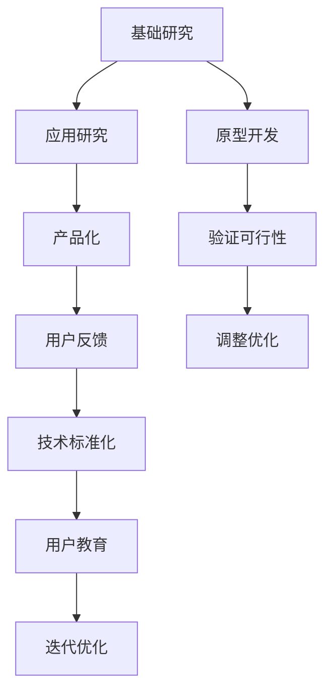

                 

# 硅谷AI竞赛：贾扬清观察产品落地基础研究并重

## 1. 背景介绍

### 1.1 问题由来
随着人工智能技术的飞速发展，硅谷的AI竞赛愈发激烈。大数据、深度学习、计算机视觉、自然语言处理等领域出现了大批创新成果，AI技术正逐渐渗透到各行各业，改变着人们的生活方式。在这样一个快速变化的时代，如何使AI技术更好地落地，服务于实际生产生活，成为了当前科技界的重要议题。

### 1.2 问题核心关键点
在AI技术的落地应用中，基础研究与产品化的衔接是一个关键问题。没有坚实的基础研究做支撑，AI技术将难以在工业界得到广泛应用；而脱离实际问题的产品开发，又可能导致技术的不切实际。因此，如何在理论与应用之间找到平衡，成为了硅谷AI竞赛的核心焦点。

### 1.3 问题研究意义
研究基础研究与产品化并重的AI技术开发，对于推动AI技术的广泛应用，加速技术落地，具有重要意义：

1. 缩短研发周期。基础研究能够为产品开发提供方向指引和理论支撑，减少试错成本，加速技术应用。
2. 提高技术可靠性。基础研究能够揭示技术底层原理，保证产品的稳定性和可靠性。
3. 降低应用门槛。基础研究能够简化复杂技术，降低产品应用的难度和成本。
4. 激发技术创新。基础研究能够催生新的技术范式，为产品创新提供动力。
5. 赋能产业升级。基础研究能够提升行业智能化水平，加速数字化转型。

## 2. 核心概念与联系

### 2.1 核心概念概述

为更好地理解基础研究与产品化并重的AI技术开发，本节将介绍几个密切相关的核心概念：

- 基础研究(Basic Research)：旨在探索科学原理和发现新知识的研究活动，通常不以实用为目的，但能为未来技术创新提供重要基础。
- 应用研究(Appplied Research)：旨在解决实际问题，提升技术应用效果，具有明确的实际应用目标。
- 原型开发(Prototype Development)：在基础和应用研究的基础上，设计并实现可行的技术原型，验证技术可行性和应用潜力。
- 产品化(Productization)：将原型开发成果转化为市场化的产品和服务，满足用户需求，实现商业价值。
- 用户反馈(User Feedback)：收集用户使用产品后的反馈，指导产品迭代和优化，进一步提升用户体验。
- 技术标准化(Technical Standardization)：制定并实施技术标准，保证技术的稳定性和可互操作性。
- 用户教育(User Education)：通过培训、文档等方式，提升用户对新技术的理解和应用能力，降低应用门槛。

这些核心概念之间的逻辑关系可以通过以下Mermaid流程图来展示：



这个流程图展示了大规模AI技术开发的关键环节：

1. 基础研究提供理论基础。
2. 应用研究解决实际问题。
3. 原型开发验证技术可行性。
4. 产品化实现市场应用。
5. 用户反馈指导产品优化。
6. 技术标准化保障互操作性。
7. 用户教育提升应用普及。
8. 迭代优化提高技术成熟度。

这些环节相互关联，共同支撑AI技术的全面落地。

## 3. 核心算法原理 & 具体操作步骤
### 3.1 算法原理概述

基础研究与产品化并重的AI技术开发，本质上是一个从科学原理到技术应用的迭代过程。其核心思想是：在基础研究中发现科学原理和技术规律，通过应用研究解决实际问题，在原型开发中验证技术效果，最终通过产品化将技术转化为实际应用，并在用户反馈中不断优化。

形式化地，假设有一项基础研究 $R$ 发现了新原理 $P$，能够应用于解决实际问题 $Q$。则产品化过程可以表示为：

1. **基础研究阶段**：研究 $R$ 提出理论 $P$，并为未来技术应用提供基础。
2. **应用研究阶段**：在问题 $Q$ 上，利用 $P$ 设计算法 $A$，通过数据集 $D$ 进行训练和验证。
3. **原型开发阶段**：在算法 $A$ 的基础上，设计技术原型 $M$，并实现应用系统 $S$。
4. **产品化阶段**：将系统 $S$ 部署到实际环境中，收集用户反馈 $F$，进行迭代优化。
5. **技术标准化阶段**：制定并实施技术标准 $T$，保证技术的稳定性和可互操作性。
6. **用户教育阶段**：通过培训、文档等方式，提升用户对 $S$ 的理解和应用能力。

### 3.2 算法步骤详解

基础研究与产品化并重的AI技术开发过程一般包括以下几个关键步骤：

**Step 1: 基础研究阶段**
- 提出具有广泛应用前景的理论假设。
- 设计科学实验或理论模型验证假设。
- 发表论文，推动学术界对该领域的关注。

**Step 2: 应用研究阶段**
- 根据基础研究结果，设计实际问题的解决方案。
- 使用大规模数据集训练模型，并评估性能。
- 识别模型在实际应用中的优势和局限性。

**Step 3: 原型开发阶段**
- 基于模型设计技术原型，实现关键算法和功能。
- 构建系统架构，整合软硬件资源。
- 进行系统测试，验证技术可行性和可靠性。

**Step 4: 产品化阶段**
- 部署系统至实际环境，进行试用和收集反馈。
- 根据用户反馈，进行系统优化和调整。
- 制定技术标准，保障系统稳定性和互操作性。

**Step 5: 用户教育阶段**
- 编写用户手册和培训材料，提升用户对系统的理解和应用。
- 提供在线支持和社区交流平台，帮助用户解决问题。
- 通过产品迭代，进一步提升用户体验和满意度。

### 3.3 算法优缺点

基础研究与产品化并重的AI技术开发方法具有以下优点：
1. 理论与实践结合。基础研究提供科学原理，应用研究解决实际问题，使得技术开发具有坚实的理论基础。
2. 系统性开发。通过系统性设计各个研发环节，保证技术开发的全面性和深度。
3. 渐进迭代。原型开发和产品化过程中的不断优化，使得技术开发能够快速适应市场需求。
4. 降低风险。系统性研发过程能够识别技术风险，并通过迭代优化加以解决，降低技术应用的风险。

同时，该方法也存在一定的局限性：
1. 时间成本高。基础研究和应用研究阶段通常需要较长时间，可能会影响产品上市速度。
2. 资金投入大。大规模数据集和硬件设备的投入，对企业资源需求较大。
3. 依赖人才。对人才的需求在各个环节都很大，需要构建完善的人才培养和储备机制。
4. 市场适应性差。基础研究和应用研究阶段往往难以准确预测市场需求，可能导致技术产品不受欢迎。

尽管存在这些局限性，但就目前而言，基础研究与产品化并重的技术开发方法仍是硅谷AI竞赛中的主流范式。未来相关研究的重点在于如何缩短研发周期，降低成本，提高市场适应性，同时兼顾可解释性和伦理安全性等因素。

### 3.4 算法应用领域

基于基础研究与产品化并重的AI技术开发方法，在多个领域得到了广泛的应用，例如：

- 医疗健康：通过基础研究，发现新的生物标志物，利用机器学习模型进行疾病预测和诊断。
- 自动驾驶：基于基础研究，提出高精度地图和定位算法，开发自动驾驶技术。
- 金融科技：利用大数据和机器学习模型，进行金融风险预测和反欺诈检测。
- 自然语言处理：通过语言学研究，提升模型在语言理解和生成的准确性和自然度。
- 推荐系统：结合用户行为和市场趋势，设计推荐算法，提升用户体验。
- 工业制造：利用计算机视觉和智能传感技术，进行质量检测和生产优化。

除了上述这些经典应用外，基础研究与产品化并重的方法也被创新性地应用于更多场景中，如智慧城市、能源管理、农业智能化等，为各行各业带来了新的技术革新。

## 4. 数学模型和公式 & 详细讲解 & 举例说明

### 4.1 数学模型构建

本节将使用数学语言对基础研究与产品化并重的AI技术开发过程进行更加严格的刻画。

假设有一项基础研究 $R$ 发现的新原理 $P$，能够应用于解决实际问题 $Q$。则应用研究阶段中的数学模型可以表示为：

- 假设问题 $Q$ 可以表示为训练样本集 $D = \{(x_i, y_i)\}_{i=1}^N$，其中 $x_i$ 为输入特征，$y_i$ 为输出标签。
- 假设设计了深度神经网络模型 $M_{\theta}$ 作为算法 $A$，其中 $\theta$ 为模型参数。
- 假设模型在训练集 $D$ 上的损失函数为 $\mathcal{L}(\theta)$，目标是最小化该损失函数，即：

$$
\theta^* = \mathop{\arg\min}_{\theta} \mathcal{L}(\theta)
$$

在得到最优模型参数 $\theta^*$ 后，即可在原型开发阶段设计技术原型 $M$，并实现应用系统 $S$。

### 4.2 公式推导过程

以下我们以图像分类任务为例，推导深度神经网络模型的损失函数及其梯度计算公式。

假设模型 $M_{\theta}$ 在输入 $x$ 上的输出为 $\hat{y}=M_{\theta}(x) \in [0,1]$，表示样本属于正类的概率。真实标签 $y \in \{0,1\}$。则二分类交叉熵损失函数定义为：

$$
\ell(M_{\theta}(x),y) = -[y\log \hat{y} + (1-y)\log (1-\hat{y})]
$$

将其代入经验风险公式，得：

$$
\mathcal{L}(\theta) = -\frac{1}{N}\sum_{i=1}^N [y_i\log M_{\theta}(x_i)+(1-y_i)\log(1-M_{\theta}(x_i))]
$$

根据链式法则，损失函数对参数 $\theta_k$ 的梯度为：

$$
\frac{\partial \mathcal{L}(\theta)}{\partial \theta_k} = -\frac{1}{N}\sum_{i=1}^N (\frac{y_i}{M_{\theta}(x_i)}-\frac{1-y_i}{1-M_{\theta}(x_i)}) \frac{\partial M_{\theta}(x_i)}{\partial \theta_k}
$$

其中 $\frac{\partial M_{\theta}(x_i)}{\partial \theta_k}$ 可进一步递归展开，利用自动微分技术完成计算。

在得到损失函数的梯度后，即可带入参数更新公式，完成模型的迭代优化。重复上述过程直至收敛，最终得到适应实际问题 $Q$ 的最优模型参数 $\theta^*$。

### 4.3 案例分析与讲解

**案例1: 医疗影像分类**
- **基础研究阶段**：通过生物医学研究，发现特定的基因表达模式与疾病相关。
- **应用研究阶段**：利用深度学习模型，设计分类算法，对医学影像进行疾病预测。
- **原型开发阶段**：开发医疗影像分类系统，实现早期癌症检测。
- **产品化阶段**：部署系统至医院，收集医生反馈，进行优化。
- **用户教育阶段**：培训医生使用系统，提升诊断准确率。

**案例2: 自动驾驶**
- **基础研究阶段**：通过计算机视觉和控制理论研究，提出高精度地图和定位算法。
- **应用研究阶段**：利用传感器数据，训练模型，进行行为预测和决策。
- **原型开发阶段**：实现自动驾驶系统，并在模拟环境中进行测试。
- **产品化阶段**：部署系统至自动驾驶车辆，收集用户反馈，进行优化。
- **用户教育阶段**：培训用户，解释系统工作原理，提升用户信心。

以上案例展示了基础研究与产品化并重在实际应用中的具体实施步骤，每个环节都需要紧密结合，才能保证技术的全面落地。

## 5. 项目实践：代码实例和详细解释说明
### 5.1 开发环境搭建

在进行AI技术开发前，我们需要准备好开发环境。以下是使用Python进行TensorFlow开发的环境配置流程：

1. 安装Anaconda：从官网下载并安装Anaconda，用于创建独立的Python环境。

2. 创建并激活虚拟环境：
```bash
conda create -n tf-env python=3.8 
conda activate tf-env
```

3. 安装TensorFlow：根据CUDA版本，从官网获取对应的安装命令。例如：
```bash
conda install tensorflow=2.8 tf-gpu-cu111 -c conda-forge
```

4. 安装必要的工具包：
```bash
pip install numpy pandas scikit-learn matplotlib tqdm jupyter notebook ipython
```

完成上述步骤后，即可在`tf-env`环境中开始AI技术开发。

### 5.2 源代码详细实现

下面我们以图像分类任务为例，给出使用TensorFlow对卷积神经网络(CNN)进行原型开发的PyTorch代码实现。

首先，定义图像分类任务的数据处理函数：

```python
from tensorflow.keras.datasets import cifar10
from tensorflow.keras.utils import to_categorical
from tensorflow.keras.preprocessing.image import ImageDataGenerator

def load_data(batch_size):
    (x_train, y_train), (x_test, y_test) = cifar10.load_data()
    x_train = x_train / 255.0
    x_test = x_test / 255.0
    y_train = to_categorical(y_train)
    y_test = to_categorical(y_test)
    train_datagen = ImageDataGenerator(rescale=1./255, validation_split=0.2)
    train_generator = train_datagen.flow(x_train, y_train, batch_size=batch_size)
    val_generator = train_datagen.flow(x_train, y_train, batch_size=batch_size, shuffle=False, validation_split=0.2)
    test_generator = train_datagen.flow(x_test, y_test, batch_size=batch_size)
    return train_generator, val_generator, test_generator
```

然后，定义卷积神经网络模型：

```python
from tensorflow.keras.models import Sequential
from tensorflow.keras.layers import Conv2D, MaxPooling2D, Flatten, Dense

def build_model(input_shape, num_classes):
    model = Sequential()
    model.add(Conv2D(32, (3, 3), activation='relu', input_shape=input_shape))
    model.add(MaxPooling2D((2, 2)))
    model.add(Conv2D(64, (3, 3), activation='relu'))
    model.add(MaxPooling2D((2, 2)))
    model.add(Conv2D(64, (3, 3), activation='relu'))
    model.add(Flatten())
    model.add(Dense(64, activation='relu'))
    model.add(Dense(num_classes, activation='softmax'))
    return model
```

接着，定义训练和评估函数：

```python
from tensorflow.keras.callbacks import EarlyStopping

def train_model(model, train_generator, val_generator, epochs, callbacks):
    model.compile(optimizer='adam', loss='categorical_crossentropy', metrics=['accuracy'])
    history = model.fit(train_generator, validation_data=val_generator, epochs=epochs, callbacks=callbacks)
    return history
```

最后，启动训练流程并在测试集上评估：

```python
batch_size = 64
epochs = 50
callbacks = [EarlyStopping(patience=3)]

train_generator, val_generator, test_generator = load_data(batch_size)

model = build_model((32, 32, 3), num_classes=10)
history = train_model(model, train_generator, val_generator, epochs, callbacks)

print(history.history)
```

以上就是使用TensorFlow对卷积神经网络进行原型开发的完整代码实现。可以看到，通过简单的代码，就可以构建出一套完整的图像分类系统，并验证其性能。

### 5.3 代码解读与分析

让我们再详细解读一下关键代码的实现细节：

**load_data函数**：
- 利用TensorFlow的CIFAR-10数据集，加载训练集和测试集。
- 将数据进行归一化，并将标签进行one-hot编码。
- 使用ImageDataGenerator进行数据增强，实现随机裁剪、翻转等预处理。
- 将数据集划分为训练集和验证集，并将验证集进行不重复抽样。

**build_model函数**：
- 定义了卷积神经网络的基本结构。
- 通过添加多个卷积层和池化层，逐步提取图像特征。
- 利用全连接层对特征进行分类。

**train_model函数**：
- 定义了模型的优化器和损失函数。
- 使用EarlyStopping回调函数，防止模型过拟合。
- 利用fit函数进行模型训练，返回训练过程中的损失和准确率曲线。

**训练流程**：
- 设置批次大小和迭代轮数，启动训练。
- 在训练集上进行前向传播和反向传播，更新模型参数。
- 每轮训练结束后，在验证集上进行性能评估。
- 记录训练过程中的损失和准确率，帮助调优。

可以看到，TensorFlow提供了便捷的深度学习框架，使得原型开发过程变得简单高效。开发者可以根据具体任务，通过调整网络结构、优化器等参数，进一步提升模型性能。

当然，工业级的系统实现还需考虑更多因素，如模型保存和部署、超参数调优、数据增强等，但核心的原型开发范式基本与此类似。

## 6. 实际应用场景
### 6.1 医疗影像分类

医疗影像分类是基础研究与产品化并重的典型应用之一。通过基础研究，科学家发现某种特定的基因表达模式与疾病相关。利用机器学习模型，对医学影像进行分类预测，可以显著提升疾病诊断的准确性和效率。

在技术实现上，可以收集大量的医疗影像数据，提取特征，并在该数据集上训练深度学习模型。通过医疗影像分类系统，医生可以快速准确地进行疾病诊断，减少误诊率。同时，该系统还可以用于研究疾病发生机制，为新的治疗方法提供数据支持。

### 6.2 自动驾驶

自动驾驶技术是基础研究与产品化并重的另一大应用领域。通过计算机视觉和控制理论的研究，科学家提出了高精度地图和定位算法。利用传感器数据，训练深度学习模型，进行行为预测和决策，实现自动驾驶。

在原型开发阶段，将模型部署至自动驾驶车辆，进行测试和优化。通过不断收集用户反馈，改进系统，提升安全性。最终，自动驾驶系统可以代替人类进行驾驶，减少交通事故，提高出行效率。

### 6.3 金融风控

金融风控是基础研究与产品化并重的典型应用之一。通过大数据和机器学习研究，科学家发现了新的风险预测指标。利用模型进行风险预测，可以降低金融风险，保障金融机构的安全。

在技术实现上，可以收集用户的交易数据，提取特征，训练风险预测模型。通过金融风控系统，金融机构可以实时监控交易行为，及时发现异常，防范金融诈骗。同时，该系统还可以用于评估用户的信用风险，提升贷款审批的效率和准确性。

### 6.4 未来应用展望

随着基础研究与产品化并重的方法不断成熟，AI技术将在更多领域得到应用，为各行各业带来变革性影响。

在智慧医疗领域，基于医疗影像分类的诊断系统，可以辅助医生进行疾病诊断，提升诊疗效率。基于高精度地图的自动驾驶系统，可以实现安全、高效的自动驾驶。基于风险预测的金融风控系统，可以提升金融机构的稳定性。基于自然语言处理的智能客服系统，可以提升客户服务体验。

此外，在教育、娱乐、交通等多个领域，基于AI技术的产品也将不断涌现，为人们的生活带来更多便利。相信在未来，AI技术将渗透到更多行业，助力人类社会的全面数字化转型。

## 7. 工具和资源推荐
### 7.1 学习资源推荐

为了帮助开发者系统掌握基础研究与产品化并重的AI技术开发，这里推荐一些优质的学习资源：

1. Coursera《Deep Learning》课程：由斯坦福大学教授Andrew Ng主讲，涵盖深度学习的基本概念和经典模型，适合初学者入门。

2. Udacity《AI For Everyone》课程：由Google AI首席科学家Fei-Fei Li主讲，介绍AI技术的实际应用，适合非技术背景的受众。

3. Arxiv上的最新论文：Arxiv是全球最大的预印本服务器，收录了大量前沿研究论文，可以帮助开发者跟踪最新技术进展。

4. GitHub上的开源项目：GitHub上有众多开源AI项目，提供了丰富的技术参考和代码实现，适合开发者学习和应用。

5. TensorFlow官方文档：TensorFlow提供了详细的文档和代码示例，帮助开发者快速上手TensorFlow，构建AI系统。

通过对这些资源的学习实践，相信你一定能够系统掌握基础研究与产品化并重的AI技术开发，并用于解决实际的AI问题。

### 7.2 开发工具推荐

高效的开发离不开优秀的工具支持。以下是几款用于AI技术开发的常用工具：

1. PyTorch：基于Python的开源深度学习框架，灵活性强，适合快速迭代研究。

2. TensorFlow：由Google主导开发的开源深度学习框架，生产部署方便，适合大规模工程应用。

3. Jupyter Notebook：支持多语言的交互式开发环境，方便开发者快速调试和验证模型。

4. Colab：谷歌提供的在线Jupyter Notebook环境，免费提供GPU/TPU算力，方便开发者实验最新模型。

5. TensorBoard：TensorFlow配套的可视化工具，实时监测模型训练状态，提供丰富的图表呈现方式。

6. Weights & Biases：模型训练的实验跟踪工具，记录和可视化模型训练过程中的各项指标，方便对比和调优。

合理利用这些工具，可以显著提升AI技术开发的效率，加快技术迭代的步伐。

### 7.3 相关论文推荐

基础研究与产品化并重的AI技术开发源于学界的持续研究。以下是几篇奠基性的相关论文，推荐阅读：

1. "Deep Learning" by Ian Goodfellow, Yoshua Bengio, and Aaron Courville（《深度学习》）：全面介绍了深度学习的原理、算法和应用，是AI领域的重要经典。

2. "Convolutional Neural Networks for Histopathological Image Classification" by Maragos et al.（《卷积神经网络在病理学图像分类中的应用》）：展示了卷积神经网络在医学影像分类上的强大效果。

3. "A Survey on Deep Learning for Digital Pathology" by Liu et al.（《深度学习在数字病理学上的综述》）：介绍了深度学习在病理学图像处理上的应用和挑战。

4. "ImageNet Classification with Deep Convolutional Neural Networks" by Krizhevsky et al.（《使用深度卷积神经网络进行ImageNet分类》）：展示了卷积神经网络在图像分类上的突破性成果。

5. "Playing Atari with Deep Reinforcement Learning" by Mnih et al.（《使用深度强化学习进行Atari游戏》）：展示了深度学习在强化学习中的应用。

6. "Fastai" by Rachel Thomas, Jeremy Howard, and Jason Brownlee（《fastai》）：介绍了基于fastai库的深度学习开发方法，适合快速原型开发和模型调优。

这些论文代表了大规模AI技术开发的发展脉络。通过学习这些前沿成果，可以帮助研究者把握学科前进方向，激发更多的创新灵感。

## 8. 总结：未来发展趋势与挑战

### 8.1 总结

本文对基础研究与产品化并重的AI技术开发进行了全面系统的介绍。首先阐述了基础研究与产品化并重的重要性，明确了在理论与应用之间找到平衡的关键点。其次，从原理到实践，详细讲解了基础研究与产品化并重的开发流程，给出了原型开发的完整代码实例。同时，本文还广泛探讨了基础研究与产品化并重在医疗、自动驾驶、金融等领域的实际应用，展示了其广泛的应用前景。

通过本文的系统梳理，可以看到，基础研究与产品化并重的方法在大规模AI技术开发中具有重要的作用。这些方法在理论与实践之间架起了桥梁，使得AI技术能够更好地服务于实际生产生活，加速技术的产业化进程。未来，随着基础研究与产品化并重的方法不断成熟，AI技术将在更多领域得到应用，为人类社会的全面数字化转型提供新的动力。

### 8.2 未来发展趋势

展望未来，基础研究与产品化并重的AI技术开发将呈现以下几个发展趋势：

1. 跨领域融合。基础研究将与更多学科交叉融合，产生新的技术范式。例如，深度学习与生物学、医学、物理学的结合，将带来更多创新应用。

2. 数据驱动。随着数据量的不断增长，数据驱动的方法将进一步提升AI模型的性能。利用大数据、大模型进行预测和决策，将更加精准可靠。

3. 算法优化。新的算法和优化技术，如GNN、Transformer等，将推动AI技术的不断进步。高性能算法的应用，将提升模型训练和推理的速度。

4. 伦理和隐私。AI技术的快速发展，带来了伦理和隐私问题。如何在开发过程中注重伦理导向，保护用户隐私，将是未来技术发展的重要课题。

5. 可解释性和可控性。AI技术的复杂性，使得模型的决策过程难以解释。如何增强模型的可解释性，提高系统的可控性，将是未来研究的重要方向。

6. 多模态融合。利用语音、图像、文本等多种模态数据，实现多模态信息的融合，提升系统的智能化水平。

以上趋势凸显了基础研究与产品化并重AI技术开发的重要意义。这些方向的探索发展，必将进一步提升AI技术的性能和应用范围，为人类社会的全面数字化转型提供新的动力。

### 8.3 面临的挑战

尽管基础研究与产品化并重的AI技术开发取得了许多成果，但在迈向更加智能化、普适化应用的过程中，它仍面临诸多挑战：

1. 数据隐私问题。AI技术的开发和应用，需要大量的数据支持，但数据隐私和用户同意一直是难以解决的问题。如何在保证隐私的前提下，获取高质量的数据，将是未来的关键。

2. 算法透明性。AI技术的复杂性，使得模型的决策过程难以解释。如何增强模型的可解释性，提高系统的可控性，将是未来研究的重要方向。

3. 伦理和社会影响。AI技术的广泛应用，可能带来伦理和社会问题。如何制定合理的技术标准，规范AI技术的应用，将是未来的重要课题。

4. 技术风险。AI技术的快速迭代，可能带来新的技术风险。如何识别和规避技术风险，保障技术安全，将是未来研究的重要方向。

5. 人才缺口。AI技术的开发和应用，需要大量高素质人才。如何培养和吸引AI人才，将是未来教育的重要任务。

6. 计算资源。AI技术的开发和应用，需要大量的计算资源。如何降低计算成本，提升计算效率，将是未来的重要课题。

正视基础研究与产品化并重AI技术开发所面临的挑战，积极应对并寻求突破，将是大规模AI技术开发的重要任务。相信随着学界和产业界的共同努力，这些挑战终将一一被克服，AI技术必将为人类社会的全面数字化转型带来新的动力。

### 8.4 研究展望

面向未来，基础研究与产品化并重的AI技术开发需要在以下几个方面寻求新的突破：

1. 探索无监督和半监督学习方法。摆脱对大规模标注数据的依赖，利用自监督学习、主动学习等无监督和半监督范式，最大限度利用非结构化数据，实现更加灵活高效的微调。

2. 研究参数高效和计算高效的微调范式。开发更加参数高效的微调方法，在固定大部分预训练参数的同时，只更新极少量的任务相关参数。同时优化微调模型的计算图，减少前向传播和反向传播的资源消耗，实现更加轻量级、实时性的部署。

3. 融合因果和对比学习范式。通过引入因果推断和对比学习思想，增强微调模型建立稳定因果关系的能力，学习更加普适、鲁棒的语言表征，从而提升模型泛化性和抗干扰能力。

4. 引入更多先验知识。将符号化的先验知识，如知识图谱、逻辑规则等，与神经网络模型进行巧妙融合，引导微调过程学习更准确、合理的语言模型。同时加强不同模态数据的整合，实现视觉、语音等多模态信息与文本信息的协同建模。

5. 结合因果分析和博弈论工具。将因果分析方法引入微调模型，识别出模型决策的关键特征，增强输出解释的因果性和逻辑性。借助博弈论工具刻画人机交互过程，主动探索并规避模型的脆弱点，提高系统稳定性。

6. 纳入伦理道德约束。在模型训练目标中引入伦理导向的评估指标，过滤和惩罚有偏见、有害的输出倾向。同时加强人工干预和审核，建立模型行为的监管机制，确保输出符合人类价值观和伦理道德。

这些研究方向的探索，必将引领基础研究与产品化并重AI技术开发技术迈向更高的台阶，为构建安全、可靠、可解释、可控的智能系统铺平道路。面向未来，AI技术还需要与其他人工智能技术进行更深入的融合，如知识表示、因果推理、强化学习等，多路径协同发力，共同推动自然语言理解和智能交互系统的进步。只有勇于创新、敢于突破，才能不断拓展AI技术的边界，让智能技术更好地造福人类社会。

## 9. 附录：常见问题与解答

**Q1：如何平衡基础研究和应用研究的时间？**

A: 基础研究与应用研究的平衡，通常需要根据项目需求和资源情况来定。通常建议将项目分为几个阶段：

1. 前期研究阶段：主要进行基础研究，建立科学原理和技术框架。
2. 中期研发阶段：进行应用研究，开发原型系统，验证技术可行性。
3. 后期优化阶段：进行产品化，实现系统部署，收集用户反馈，进行优化迭代。

在各个阶段中，可以适当调整时间分配，保证研发进度。

**Q2：如何进行有效的模型优化？**

A: 模型优化是AI技术开发中的重要环节。以下是一些常用的优化方法：

1. 超参数调优：通过网格搜索、随机搜索等方法，寻找最优的超参数组合。
2. 模型压缩：通过剪枝、量化、蒸馏等方法，减小模型大小，提高推理效率。
3. 数据增强：通过数据扩充、合成等方法，增加数据多样性，提升模型泛化能力。
4. 对抗训练：通过对抗样本训练，提升模型的鲁棒性。
5. 模型融合：通过集成多个模型，提升整体性能。

在实际开发中，需要根据具体问题和数据情况，选择适当的优化方法。

**Q3：如何进行有效的用户教育？**

A: 用户教育是AI技术落地应用的重要环节。以下是一些常用的用户教育方法：

1. 用户手册：编写详细的用户手册，介绍系统功能、使用方法和注意事项。
2. 在线培训：通过在线课程、视频教程等方式，帮助用户理解系统。
3. 社区交流：建立用户社区，提供在线支持，解答用户问题。
4. 技术支持：提供专业的技术支持，帮助用户解决问题。

在实际应用中，需要根据用户群体和需求，选择合适的教育方式，提升用户对系统的理解和应用。

通过本文的系统梳理，可以看到，基础研究与产品化并重的AI技术开发在实际应用中具有重要的作用。这些方法在理论与实践之间架起了桥梁，使得AI技术能够更好地服务于实际生产生活，加速技术的产业化进程。未来，随着基础研究与产品化并重的方法不断成熟，AI技术将在更多领域得到应用，为人类社会的全面数字化转型提供新的动力。

