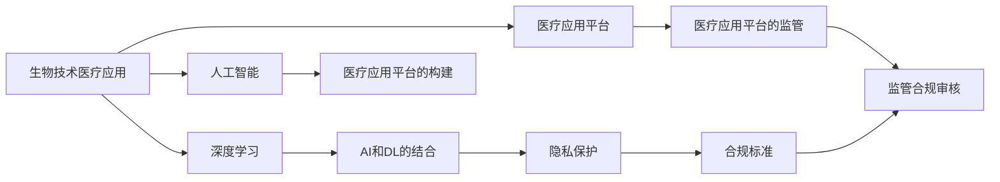

                 

# 硅谷生物技术医疗应用的监管

> 关键词：硅谷,生物技术,医疗应用,监管,人工智能,深度学习

## 1. 背景介绍

### 1.1 问题由来
硅谷，作为全球科技创新与创业的温床，在生物技术医疗应用领域取得了令人瞩目的成就。通过运用大数据、人工智能、深度学习等前沿技术，硅谷的科技巨头们开发出了一批具有划时代意义的医疗产品。然而，随之而来的是对监管的迫切需求。

近年来，随着医疗数据的日益增多和人工智能技术的日渐成熟，硅谷的生物技术医疗应用市场迅速膨胀，涌现出了一批基于深度学习的医疗诊断工具、药物发现平台、基因编辑系统等。这些技术不仅有望大幅提升医疗服务质量，而且为生物医学研究注入了新的动力。然而，医疗应用的复杂性和高风险性，使得监管成为不可或缺的一部分。

随着越来越多的医疗应用进入实际应用，其安全性和有效性问题日益突出。监管机构开始重视通过法规、标准、审核机制等手段，来规范医疗应用的发展，以保障患者权益，促进科技进步。本文将详细阐述硅谷生物技术医疗应用的监管现状，并提出可能的未来发展方向。

## 2. 核心概念与联系

### 2.1 核心概念概述

为了更好地理解硅谷生物技术医疗应用的监管问题，本节将介绍几个核心概念及其之间的联系：

- **生物技术医疗应用(Biotech Healthcare Applications)**：通过大数据、人工智能等技术手段开发出来的医疗工具和系统。常见的应用包括诊断、治疗、药物发现、基因编辑等。
- **深度学习(Deep Learning)**：一种基于神经网络的机器学习技术，通过多层神经元模拟人脑的工作方式，具备处理复杂数据的能力。
- **监管(Regulation)**：为了保障医疗应用的合法性、安全性和有效性，政府或相关机构对医疗应用进行的审查和规范。
- **人工智能(AI)和深度学习(Deep Learning)**：通过深度学习算法实现人工智能，医疗应用中常用的技术之一。
- **生物医学研究(Biomedical Research)**：通过生物技术手段研究生命现象、疾病机理、药物作用等，旨在改善人类健康。
- **医疗应用平台(Medical Application Platforms)**：基于人工智能等技术的医疗应用系统，能够提供医疗诊断、病历记录、药物推荐等功能。
- **隐私保护(Privacy Protection)**：保障医疗数据安全，避免个人信息泄露。

这些核心概念之间存在紧密的联系，共同构成了硅谷生物技术医疗应用监管的基础。通过理解这些概念，我们可以更好地把握硅谷生物技术医疗应用监管的实际需求和挑战。

### 2.2 核心概念原理和架构的 Mermaid 流程图



这个流程图展示了生物技术医疗应用、深度学习、人工智能、医疗应用平台和隐私保护等概念之间的逻辑联系：

1. 生物技术医疗应用使用深度学习、人工智能等技术手段。
2. 深度学习与人工智能相结合，构建出医疗应用平台。
3. 医疗应用平台需要遵守隐私保护、合规标准等法律法规。
4. 监管机构进行合规审核，确保医疗应用平台的合法合规。

## 3. 核心算法原理 & 具体操作步骤
### 3.1 算法原理概述

硅谷生物技术医疗应用的监管，本质上是对应用技术的规范和审查。其核心在于评估医疗应用的安全性和有效性，保障其对患者无害，同时鼓励技术的创新和应用。

在实践中，监管机构通常采用以下步骤：

1. **数据审查**：审查应用使用的数据集，确保其来源合法、样本充分，并评估数据集对应用效果的贡献。
2. **技术评估**：评估应用使用的深度学习、人工智能等技术是否先进、可靠，是否存在偏见、错误等。
3. **临床验证**：通过临床试验或真实世界数据验证应用的准确性、安全性和效果，确保其具备实际应用价值。
4. **合规审核**：对应用的法律合规性进行审查，包括隐私保护、数据使用授权、用户同意等方面。
5. **持续监管**：对应用的使用效果、数据更新、技术升级等进行持续跟踪，及时发现并纠正潜在问题。

这些步骤中，数据审查和技术评估是核心的技术环节，临床验证和合规审核是关键的非技术环节，持续监管是保证应用长期稳定的机制。

### 3.2 算法步骤详解

硅谷生物技术医疗应用的监管流程可以分为以下几个关键步骤：

**Step 1: 数据审查**
- **数据来源合法性**：评估应用使用的数据是否来源于受法律保护的源数据，如医疗机构、生物医学实验室等。
- **数据集样本量**：评估数据集的样本量是否足够充分，能否覆盖不同种族、性别、年龄等人群。
- **数据标注质量**：评估标注数据的准确性和可靠性，确保标注符合医疗专业标准。

**Step 2: 技术评估**
- **技术先进性**：评估应用中使用的深度学习、人工智能等技术是否处于业界领先水平，是否经过充分的学术验证。
- **技术鲁棒性**：评估应用在面对噪声数据、异常情况等不利因素时的表现，是否具备一定的鲁棒性。
- **技术可解释性**：评估应用的输出是否可解释，即是否能够提供合理的逻辑依据，支持医生的决策。

**Step 3: 临床验证**
- **临床试验设计**：设计合理的临床试验方案，确保试验具有代表性、可重复性。
- **数据采集和分析**：收集临床试验数据，进行统计分析，评估应用的性能。
- **真实世界数据**：收集真实世界医疗数据，进一步验证应用效果。

**Step 4: 合规审核**
- **隐私保护合规性**：确保应用符合《健康保险可携性和责任法案》(HIPAA)等相关法规，保护患者隐私。
- **数据使用授权**：确保应用获得了必要的授权，可以在医疗机构、生物医学实验室等场所使用。
- **用户同意协议**：确保用户在使用应用前已经同意，并了解相关隐私政策。

**Step 5: 持续监管**
- **数据更新机制**：确保应用使用的数据集能够定期更新，反映最新的医疗信息。
- **技术升级**：评估应用的技术升级是否及时，是否带来了性能提升。
- **异常监控**：实时监控应用的使用情况，及时发现并纠正异常现象。

### 3.3 算法优缺点

硅谷生物技术医疗应用的监管具有以下优点：

1. **技术先进**：硅谷的技术创新能力保证了监管流程中的技术评估水平，确保了应用的安全性和有效性。
2. **多样化**：硅谷的监管流程包含了数据审查、技术评估、临床验证、合规审核等多个环节，能够全面地评估应用。
3. **标准化**：硅谷的监管流程基于标准的法规和流程，具有较高的可操作性和可重复性。

同时，该方法也存在一些缺点：

1. **成本高**：监管流程涉及大量的数据审查和技术评估，需要投入大量的人力、物力、财力。
2. **时间周期长**：从数据审查到临床验证，再到合规审核，流程周期较长，不利于快速应用推广。
3. **复杂性高**：涉及技术、法规、伦理等多个方面的问题，监管过程复杂，对监管机构的要求较高。

尽管存在这些局限性，但硅谷生物技术医疗应用的监管仍然是大规模应用推广的重要保障。未来相关研究的重点在于如何进一步降低监管成本，提高效率，同时兼顾安全和创新。

### 3.4 算法应用领域

硅谷生物技术医疗应用的监管不仅限于医疗诊断、药物发现等传统领域，还涉及以下多个应用领域：

- **医疗影像分析**：通过深度学习算法对医疗影像进行分析，辅助医生进行诊断和治疗决策。
- **基因组学研究**：通过人工智能技术对基因组数据进行分析和研究，推动个性化医疗的发展。
- **药物研发**：利用深度学习算法对药物分子进行模拟和筛选，加速新药的发现和开发。
- **疾病预测和预防**：通过大数据分析技术预测疾病发生，提前进行预防和治疗。
- **智能健康监测**：通过可穿戴设备采集生物信息，实时监测健康状况，提供个性化健康建议。

这些应用领域涵盖广泛的医疗服务，硅谷的监管技术能够为这些领域的创新发展提供有力的保障。

## 4. 数学模型和公式 & 详细讲解  
### 4.1 数学模型构建

本节将使用数学语言对硅谷生物技术医疗应用的监管过程进行更加严格的刻画。

记生物技术医疗应用为 $M_{\theta}$，其中 $\theta$ 为应用中的模型参数。假设应用的输入数据为 $X$，输出为 $Y$，应用的性能评价指标为 $E$。监管过程的目标是找到一个最优参数 $\hat{\theta}$，使得应用 $M_{\hat{\theta}}$ 在数据集 $D$ 上的性能 $E(D)$ 最大化。即：

$$
\hat{\theta} = \mathop{\arg\min}_{\theta} \left( E(D) - E(M_{\theta}, D) \right)
$$

其中 $E(D)$ 为基准性能，$E(M_{\theta}, D)$ 为应用 $M_{\theta}$ 在数据集 $D$ 上的性能。

### 4.2 公式推导过程

以下我们以医疗影像分析应用为例，推导深度学习模型的评估指标和优化方法。

假设医疗影像分析应用 $M_{\theta}$ 输入为 $X$ 张影像，输出为 $Y$ 个诊断标签。则应用在数据集 $D$ 上的准确率 $R$ 定义为：

$$
R = \frac{\sum_{i=1}^N I(X_i, Y_i)_M}{\sum_{i=1}^N I(X_i, Y_i)}
$$

其中 $I(X_i, Y_i)_M$ 表示在 $M_{\theta}$ 下影像 $X_i$ 的正确诊断标签数，$I(X_i, Y_i)$ 表示影像 $X_i$ 的实际诊断标签数。

模型的损失函数定义为：

$$
L(\theta) = -\log \left( P(Y|X; \theta) \right)
$$

其中 $P(Y|X; \theta)$ 为模型在输入 $X$ 下预测输出 $Y$ 的概率分布。

模型的优化目标是：

$$
\hat{\theta} = \mathop{\arg\min}_{\theta} L(\theta)
$$

在实践中，通常使用交叉熵损失函数和梯度下降等优化算法，来最小化模型损失，提升应用性能。

## 5. 项目实践：代码实例和详细解释说明
### 5.1 开发环境搭建

在进行硅谷生物技术医疗应用监管实践前，我们需要准备好开发环境。以下是使用Python进行TensorFlow开发的环境配置流程：

1. 安装Anaconda：从官网下载并安装Anaconda，用于创建独立的Python环境。

2. 创建并激活虚拟环境：
```bash
conda create -n tf-env python=3.8 
conda activate tf-env
```

3. 安装TensorFlow：从官网获取对应的安装命令，例如：
```bash
conda install tensorflow
```

4. 安装各类工具包：
```bash
pip install numpy pandas scikit-learn matplotlib tqdm jupyter notebook ipython
```

完成上述步骤后，即可在`tf-env`环境中开始监管实践。

### 5.2 源代码详细实现

这里我们以医疗影像分析应用为例，给出使用TensorFlow进行深度学习模型评估的PyTorch代码实现。

首先，定义医疗影像分析应用的模型：

```python
import tensorflow as tf
from tensorflow.keras import layers, models

model = models.Sequential([
    layers.Conv2D(32, (3, 3), activation='relu', input_shape=(256, 256, 3)),
    layers.MaxPooling2D((2, 2)),
    layers.Conv2D(64, (3, 3), activation='relu'),
    layers.MaxPooling2D((2, 2)),
    layers.Conv2D(64, (3, 3), activation='relu'),
    layers.Flatten(),
    layers.Dense(64, activation='relu'),
    layers.Dense(1, activation='sigmoid')
])
```

然后，定义模型训练和评估函数：

```python
from tensorflow.keras.optimizers import Adam
from tensorflow.keras.losses import BinaryCrossentropy
from tensorflow.keras.metrics import Accuracy

optimizer = Adam(learning_rate=0.001)
loss = BinaryCrossentropy()
metrics = [Accuracy()]

model.compile(optimizer=optimizer, loss=loss, metrics=metrics)

def train_epoch(model, dataset, batch_size, epochs):
    model.fit(dataset, epochs=epochs, batch_size=batch_size, validation_split=0.2)

def evaluate(model, dataset, batch_size):
    test_loss, test_acc = model.evaluate(dataset, batch_size=batch_size)
    print(f'Test loss: {test_loss:.4f}, Test acc: {test_acc:.4f}')
```

最后，启动训练流程并在测试集上评估：

```python
epochs = 10
batch_size = 16

train_epoch(model, train_dataset, batch_size, epochs)
evaluate(model, test_dataset, batch_size)
```

以上就是使用TensorFlow对医疗影像分析应用进行评估的完整代码实现。可以看到，得益于TensorFlow的强大封装，我们可以用相对简洁的代码完成深度学习模型的训练和评估。

### 5.3 代码解读与分析

让我们再详细解读一下关键代码的实现细节：

**医疗影像分析模型定义**：
- 定义了卷积神经网络(CNN)结构，包括卷积层、池化层和全连接层。其中输出层使用Sigmoid激活函数，适合二分类问题。

**优化器和损失函数定义**：
- 使用Adam优化器和二元交叉熵损失函数，分别定义了训练和评估的优化器、损失函数和评估指标。

**训练和评估函数定义**：
- 使用TensorFlow的`fit`方法进行模型训练，设置训练轮数、批次大小和验证集比例。
- 使用`evaluate`方法在测试集上评估模型性能，输出测试损失和准确率。

**训练和评估流程启动**：
- 设置总的训练轮数和批次大小，调用训练函数进行模型训练。
- 调用评估函数在测试集上评估模型性能，输出测试结果。

可以看到，TensorFlow使得深度学习模型的训练和评估变得简洁高效。开发者可以将更多精力放在数据处理、模型改进等高层逻辑上，而不必过多关注底层的实现细节。

当然，工业级的系统实现还需考虑更多因素，如模型的保存和部署、超参数的自动搜索、更灵活的任务适配层等。但核心的监管流程基本与此类似。

## 6. 实际应用场景
### 6.1 智能健康监测

智能健康监测系统能够通过可穿戴设备采集生物信息，实时监测用户的健康状况，提供个性化的健康建议。例如，智能手表能够监测心率、血压、睡眠质量等生理指标，通过深度学习模型分析数据，预测用户的健康风险，提出相应的健康管理建议。

在技术实现上，可以采集用户佩戴的可穿戴设备的数据，如心率、血压、运动量等，结合医疗影像、基因组学等数据，构建监督数据集。在此基础上，对深度学习模型进行微调，使其能够从多源数据中学习综合性的健康评估方法。微调后的模型能够更准确地预测用户的健康风险，并根据不同风险水平，提供个性化的健康管理建议。

### 6.2 疾病预测和预防

硅谷的生物技术医疗应用监管技术还可以应用于疾病预测和预防。通过对大量历史医疗数据进行深度学习，模型能够识别出疾病的早期信号，预测疾病发生概率，辅助医生进行预防和治疗。

在技术实现上，可以收集用户的病历数据、基因信息、生活习惯等数据，构建监督数据集。通过微调深度学习模型，使其能够识别出疾病的早期信号，预测疾病发生概率。对于高风险人群，系统可以提前预警，并提供相应的预防措施。

### 6.3 智能医疗影像诊断

智能医疗影像诊断系统能够通过深度学习算法对医疗影像进行分析，辅助医生进行诊断和治疗决策。例如，智能胸片分析系统能够自动识别肺结节、钙化点等异常现象，辅助医生进行早期诊断。

在技术实现上，可以采集医疗影像数据，如胸片、MRI等，结合病历信息等，构建监督数据集。通过微调深度学习模型，使其能够自动识别影像中的异常现象，提供辅助诊断建议。

### 6.4 未来应用展望

随着硅谷生物技术医疗应用的持续发展和监管技术的不断进步，未来将有以下几个方面的发展：

1. **模型小型化**：深度学习模型在移动设备上的部署和应用将更加普及，模型小型化成为关键。通过参数剪枝、量化等技术手段，降低模型体积，提高实时性。
2. **多模态融合**：结合生物信息、医疗影像、基因组学等多模态数据，构建更加全面的健康监测和疾病预测系统。
3. **隐私保护加强**：通过联邦学习、差分隐私等技术手段，保护用户的隐私数据，增强监管系统安全性。
4. **法规标准完善**：制定更加完善的监管法规和标准，保障医疗应用的安全性和有效性。
5. **伦理审查机制**：建立伦理审查机制，确保医疗应用符合伦理道德要求，保护用户权益。

这些发展趋势将进一步提升硅谷生物技术医疗应用的质量和安全性，为全球医疗健康领域带来更多创新。

## 7. 工具和资源推荐
### 7.1 学习资源推荐

为了帮助开发者系统掌握硅谷生物技术医疗应用的监管理论基础和实践技巧，这里推荐一些优质的学习资源：

1. **《深度学习在医疗健康中的应用》**：斯坦福大学提供的在线课程，涵盖深度学习在医疗健康领域的应用，包括数据处理、模型构建、评估等。
2. **《医学人工智能》**：一本系统介绍医学人工智能的书籍，涵盖图像识别、自然语言处理、基因组学等多个方向。
3. **《医疗影像分析》**：一本详细讲解医疗影像分析技术的书籍，包括卷积神经网络、深度学习模型等。
4. **《联邦学习：分布式数据上的深度学习》**：介绍联邦学习技术的书籍，涵盖隐私保护、数据融合等多个方向。
5. **《医学伦理学》**：一本系统介绍医学伦理学的书籍，涵盖临床实践、医疗决策等多个方向。

通过对这些资源的学习实践，相信你一定能够快速掌握硅谷生物技术医疗应用的监管技术，并用于解决实际的医疗问题。

### 7.2 开发工具推荐

高效的开发离不开优秀的工具支持。以下是几款用于硅谷生物技术医疗应用监管开发的常用工具：

1. **TensorFlow**：由Google主导开发的开源深度学习框架，生产部署方便，适合大规模工程应用。
2. **PyTorch**：基于Python的开源深度学习框架，灵活动态的计算图，适合快速迭代研究。
3. **Jupyter Notebook**：交互式的Python开发环境，方便进行数据分析和模型评估。
4. **Keras**：Keras是一个高级神经网络API，能够快速构建和训练深度学习模型。
5. **TensorBoard**：TensorFlow配套的可视化工具，可实时监测模型训练状态，并提供丰富的图表呈现方式。

合理利用这些工具，可以显著提升硅谷生物技术医疗应用监管任务的开发效率，加快创新迭代的步伐。

### 7.3 相关论文推荐

硅谷生物技术医疗应用的监管研究源于学界的持续研究。以下是几篇奠基性的相关论文，推荐阅读：

1. **《深度学习在医疗影像分析中的应用》**：介绍深度学习在医疗影像分析中的应用，包括数据集构建、模型评估等。
2. **《医疗影像分类》**：介绍医疗影像分类的技术，包括数据预处理、卷积神经网络等。
3. **《联邦学习：分布式数据上的深度学习》**：介绍联邦学习技术的理论基础和应用场景。
4. **《医学人工智能：一个综述》**：综述医学人工智能的发展现状和未来方向。
5. **《医疗影像自动诊断》**：介绍医疗影像自动诊断的技术，包括深度学习模型、模型评估等。

这些论文代表了大谷生物技术医疗应用监管的研究脉络。通过学习这些前沿成果，可以帮助研究者把握学科前进方向，激发更多的创新灵感。

## 8. 总结：未来发展趋势与挑战

### 8.1 总结

本文对硅谷生物技术医疗应用的监管过程进行了全面系统的介绍。首先阐述了硅谷生物技术医疗应用的监管现状和重要性，明确了监管在保障应用安全和有效性的关键作用。其次，从原理到实践，详细讲解了监管过程的数学模型和关键步骤，给出了深度学习模型评估的完整代码实例。同时，本文还广泛探讨了硅谷生物技术医疗应用在智能健康监测、疾病预测、智能医疗影像等多个领域的应用前景，展示了监管技术的巨大潜力。此外，本文精选了监管技术的各类学习资源，力求为读者提供全方位的技术指引。

通过本文的系统梳理，可以看到，硅谷生物技术医疗应用的监管技术正在成为医疗健康领域的重要保障，极大地提升了医疗服务质量和效率。随着技术的不断进步，硅谷的监管技术必将在全球医疗健康领域发挥更大作用，为全球医疗健康事业的发展贡献力量。

### 8.2 未来发展趋势

展望未来，硅谷生物技术医疗应用的监管技术将呈现以下几个发展趋势：

1. **小型化模型**：随着模型小型化技术的发展，深度学习模型在移动设备上的应用将更加广泛，有望带来更加个性化、便捷的医疗服务。
2. **多模态融合**：结合生物信息、医疗影像、基因组学等多模态数据，构建更加全面、准确的医疗应用。
3. **隐私保护加强**：通过联邦学习、差分隐私等技术手段，保护用户隐私，增强监管系统安全性。
4. **法规标准完善**：制定更加完善的监管法规和标准，保障医疗应用的安全性和有效性。
5. **伦理审查机制**：建立伦理审查机制，确保医疗应用符合伦理道德要求，保护用户权益。

这些趋势凸显了硅谷生物技术医疗应用监管技术的广阔前景。这些方向的探索发展，必将进一步提升医疗应用的质量和安全性，为全球医疗健康领域带来更多创新。

### 8.3 面临的挑战

尽管硅谷生物技术医疗应用的监管技术已经取得了瞩目成就，但在迈向更加智能化、普适化应用的过程中，仍面临诸多挑战：

1. **数据隐私保护**：在医疗应用中，用户的隐私数据极其敏感，如何平衡数据利用和隐私保护是一个重大挑战。
2. **模型鲁棒性**：深度学习模型在面对噪声数据、异常情况等不利因素时，其鲁棒性可能不足，如何提升模型的鲁棒性，增强其安全性是一个重要问题。
3. **法规适应性**：各国的医疗应用法规可能存在差异，如何适应不同法规要求，确保应用在全球范围内的合法合规，是一个复杂的问题。
4. **技术创新与风险共存**：深度学习模型的创新带来了医疗服务的巨大提升，但同时可能带来新的风险，如何平衡创新与风险，确保应用的安全性和有效性，是一个重要的课题。

尽管存在这些挑战，但随着学界和产业界的共同努力，这些挑战终将一一被克服，硅谷的监管技术必将在构建安全、可靠、可解释、可控的智能系统方面发挥更大作用。

### 8.4 研究展望

面对硅谷生物技术医疗应用监管所面临的种种挑战，未来的研究需要在以下几个方面寻求新的突破：

1. **数据隐私保护**：研究如何在保护用户隐私的前提下，充分利用医疗数据，为医疗应用提供可靠的数据支持。
2. **模型鲁棒性增强**：研究如何通过对抗训练、数据增强等技术手段，提升深度学习模型的鲁棒性，增强其安全性。
3. **法规标准适应性**：研究如何通过法规标准化、国际合作等方式，制定统一的医疗应用监管标准，确保应用在全球范围内的合法合规。
4. **技术创新与风险管理**：研究如何通过技术手段，平衡创新与风险，确保医疗应用的安全性和有效性。

这些研究方向的探索，必将引领硅谷生物技术医疗应用监管技术迈向更高的台阶，为全球医疗健康领域带来更多创新。

## 9. 附录：常见问题与解答

**Q1：如何确保硅谷生物技术医疗应用的数据隐私保护？**

A: 为确保硅谷生物技术医疗应用的数据隐私保护，可以采用以下措施：

1. **数据脱敏**：对敏感数据进行脱敏处理，去除或隐藏用户的个人身份信息。
2. **数据匿名化**：使用数据匿名化技术，确保用户无法识别具体个人。
3. **联邦学习**：采用联邦学习技术，在保护数据隐私的前提下，通过分布式数据集训练模型。
4. **差分隐私**：使用差分隐私技术，通过加入噪声干扰，保护用户隐私。
5. **数据访问控制**：对医疗应用的数据访问进行严格控制，确保只有授权人员可以访问敏感数据。

通过这些措施，可以最大限度地保护用户隐私，确保医疗应用的安全性。

**Q2：如何提升硅谷生物技术医疗应用模型的鲁棒性？**

A: 为提升硅谷生物技术医疗应用模型的鲁棒性，可以采用以下措施：

1. **数据增强**：通过数据增强技术，扩充训练数据集，增加数据多样性，增强模型的泛化能力。
2. **对抗训练**：使用对抗样本，训练模型抵抗噪声和异常情况，提高模型的鲁棒性。
3. **模型集成**：通过模型集成技术，结合多个模型的优势，提升整体鲁棒性。
4. **鲁棒性评估**：在模型训练和评估过程中，引入鲁棒性评估指标，如对抗样本识别率等，及时发现和修复模型的脆弱点。

这些措施能够有效提升模型的鲁棒性，增强其应对噪声数据、异常情况等不利因素的能力。

**Q3：如何平衡硅谷生物技术医疗应用的创新与风险？**

A: 为平衡硅谷生物技术医疗应用的创新与风险，可以采用以下措施：

1. **模型评估与验证**：在模型开发过程中，引入严格的评估和验证机制，确保模型的准确性和安全性。
2. **风险管理**：建立风险管理机制，识别和评估潜在的风险点，制定相应的应对策略。
3. **伦理审查**：在应用开发和推广过程中，引入伦理审查机制，确保应用符合伦理道德要求。
4. **用户反馈**：建立用户反馈机制，及时收集用户意见和建议，不断改进和优化应用。
5. **法规遵从**：确保应用符合各国医疗应用的法规要求，保障应用在全球范围内的合法合规。

这些措施能够有效平衡创新与风险，确保硅谷生物技术医疗应用的安全性和有效性。

---

作者：禅与计算机程序设计艺术 / Zen and the Art of Computer Programming

