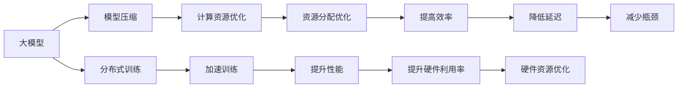

                 

# 硬件限制对大模型发展的影响

## 1. 背景介绍

随着人工智能(AI)技术的迅猛发展，深度学习模型（尤其是大模型）已经成为推动AI技术突破的重要驱动力。然而，大模型的训练和推理对硬件资源（如计算能力、内存和存储空间）提出了极高的要求，这些硬件限制在一定程度上制约了模型的进一步发展和应用。本博文旨在详细探讨硬件限制对大模型发展的影响，并提出可能的解决策略，帮助开发者在有限的硬件资源下，最大化大模型的性能和可扩展性。

## 2. 核心概念与联系

在深入探讨硬件限制对大模型发展的影响之前，首先需要理解几个核心概念及其相互联系：

- **大模型（Large Model）**：指具有数百万甚至数十亿参数的深度学习模型，如BERT、GPT-3等。这些模型在大规模数据集上进行预训练，以获得复杂的语言或图像表示，具备较强的泛化能力和理解能力。
- **硬件限制（Hardware Limitations）**：指在实际部署和运行大模型时，受限于计算能力、内存、存储和带宽等硬件资源的限制。
- **模型压缩（Model Compression）**：指通过减少模型的参数量和计算复杂度，在不牺牲性能的前提下提升模型的可扩展性和效率。
- **分布式训练（Distributed Training）**：指通过多台计算设备协同工作，将大模型的训练任务分散到多个处理器上，加速训练过程。

这些概念之间的关系可以通过以下Mermaid流程图展示：



通过这个流程图，可以看出硬件限制对大模型发展的影响以及可能的解决策略。

## 3. 核心算法原理 & 具体操作步骤

### 3.1 算法原理概述

在大模型的训练和推理过程中，硬件限制主要体现在以下几个方面：

- **计算能力**：大模型通常包含大量参数，每次前向和反向传播都需要巨大的计算量。计算能力的限制会影响模型的训练速度和精度。
- **内存**：大模型的参数和中间结果需要保存在内存中，内存限制会影响模型的复杂度和可扩展性。
- **存储**：大规模模型需要大量的存储空间来存储参数和中间结果，存储限制会影响模型的可部署性。
- **带宽**：数据在处理器和内存之间传输时，带宽限制会影响数据传输速度，从而影响模型的训练和推理速度。

针对这些硬件限制，可以采取一系列算法和技术来优化大模型的性能和可扩展性。

### 3.2 算法步骤详解

为了最大化大模型的性能和可扩展性，在硬件限制下可以采取以下步骤：

**Step 1: 数据预处理与分块**
- 对大规模数据集进行预处理，如归一化、标准化和分块，以减少数据传输量和内存占用。
- 将数据块分发到多个处理器上，进行并行处理，以利用多核或分布式计算资源。

**Step 2: 模型压缩与量化**
- 采用模型压缩技术，如剪枝、量化、蒸馏等，减少模型参数量，降低计算复杂度。
- 使用定点量化技术，将浮点数参数转换为固定位数的整数或浮点数，减少内存占用和计算开销。

**Step 3: 分布式训练与模型并行**
- 采用分布式训练技术，如数据并行、模型并行、混合并行等，将大模型的训练任务分配到多个计算节点上，加速训练过程。
- 优化资源分配和任务调度，确保每个计算节点的负载均衡，避免计算瓶颈。

**Step 4: 动态内存管理与缓存优化**
- 使用动态内存管理技术，如动态分配和释放内存、内存复用等，减少内存占用和开销。
- 利用缓存优化技术，如预取数据、缓存中间结果等，提高数据访问速度，减少计算延迟。

**Step 5: 硬件加速与优化**
- 利用GPU、TPU等硬件加速器，提高模型的训练和推理速度。
- 针对特定硬件架构，优化模型结构，如使用卷积替代全连接层，减少计算复杂度。

通过以上步骤，可以在硬件限制下，最大化大模型的性能和可扩展性。

### 3.3 算法优缺点

基于硬件限制的大模型优化算法具有以下优点：

- **提高计算效率**：通过模型压缩和量化，减少参数量和计算复杂度，加速训练和推理过程。
- **降低内存和存储需求**：通过动态内存管理和缓存优化，减少内存和存储占用，提高资源利用率。
- **增强可扩展性**：通过分布式训练和模型并行，利用多核和分布式计算资源，提高模型的可扩展性。

同时，这些算法也存在以下缺点：

- **计算精度损失**：模型压缩和量化可能会导致部分计算精度损失，影响模型性能。
- **复杂度增加**：分布式训练和模型并行会增加系统复杂度，需要更多的硬件和软件支持。
- **优化难度大**：硬件加速和优化需要深入了解硬件架构和算法优化技术，存在一定的实现难度。

尽管存在这些局限性，但通过合理设计和大规模实验验证，上述算法可以在有限的硬件资源下，显著提升大模型的性能和可扩展性。

### 3.4 算法应用领域

基于硬件限制的大模型优化算法广泛应用于以下领域：

- **自然语言处理（NLP）**：在文本分类、情感分析、机器翻译等任务中，使用分布式训练和模型压缩技术，提高模型性能和可扩展性。
- **计算机视觉（CV）**：在图像识别、目标检测、图像生成等任务中，利用硬件加速和模型压缩技术，提高计算效率和资源利用率。
- **语音识别（ASR）**：在语音转文本、语音合成等任务中，通过模型并行和动态内存管理技术，提高处理速度和响应时间。
- **推荐系统**：在推荐算法中，使用分布式训练和模型压缩技术，提升推荐效果和系统稳定性。

## 4. 数学模型和公式 & 详细讲解

### 4.1 数学模型构建

为了更好地理解硬件限制对大模型发展的影响，我们可以构建一个简单的数学模型来描述这个过程。

设 $M$ 为大模型，$T$ 为计算资源的限制，$C$ 为模型压缩技术，$D$ 为分布式训练技术，$S$ 为动态内存管理技术，$H$ 为硬件加速技术。

假设 $M$ 的计算量为 $T_M$，内存占用为 $M_M$，存储需求为 $S_M$，带宽限制为 $B_M$。则优化后的模型 $M'$ 的计算量、内存占用、存储需求和带宽限制分别为：

$$
T_{M'} = C(T_M) + D(T_M)
$$
$$
M_{M'} = C(M_M) + S(M_M)
$$
$$
S_{M'} = C(S_M) + S(S_M)
$$
$$
B_{M'} = C(B_M) + H(B_M)
$$

其中 $C$ 表示压缩函数，$D$ 表示分布式训练函数，$S$ 表示动态内存管理函数，$H$ 表示硬件加速函数。

### 4.2 公式推导过程

为了更直观地展示硬件限制对大模型发展的影响，我们可以将上述公式进一步简化，假设 $T_M = M_M = S_M = B_M$，则：

$$
T_{M'} = C(M) + D(M)
$$
$$
M_{M'} = C(M) + S(M)
$$
$$
S_{M'} = C(S) + S(S)
$$
$$
B_{M'} = C(B) + H(B)
$$

从这些公式中可以看出，压缩、分布式训练、动态内存管理和硬件加速技术可以显著降低模型对计算资源的需求，从而提升模型的可扩展性和性能。

### 4.3 案例分析与讲解

以BERT模型为例，假设其计算量为 $T_B$，内存占用为 $M_B$，存储需求为 $S_B$，带宽限制为 $B_B$。使用剪枝和量化技术进行模型压缩后，计算量减少为 $T_C$，内存占用减少为 $M_C$，存储需求减少为 $S_C$，带宽限制减少为 $B_C$。采用数据并行和模型并行技术进行分布式训练后，计算量减少为 $T_D$，内存占用减少为 $M_D$，存储需求减少为 $S_D$，带宽限制减少为 $B_D$。使用动态内存管理技术和GPU加速后，计算量减少为 $T_S$，内存占用减少为 $M_S$，存储需求减少为 $S_S$，带宽限制减少为 $B_S$。则优化后的模型计算量为 $T_{M'} = C(T_B) + D(T_B)$，内存占用为 $M_{M'} = C(M_B) + S(M_B)$，存储需求为 $S_{M'} = C(S_B) + S(S_B)$，带宽限制为 $B_{M'} = C(B_B) + H(B_B)$。

## 5. 项目实践：代码实例和详细解释说明

### 5.1 开发环境搭建

为了进行硬件限制对大模型优化实验，需要搭建相应的开发环境。以下是Python环境下搭建PyTorch和TensorFlow环境的示例：

1. 安装Anaconda：从官网下载并安装Anaconda，用于创建独立的Python环境。

2. 创建并激活虚拟环境：
```bash
conda create -n pytorch-env python=3.8 
conda activate pytorch-env
```

3. 安装PyTorch：根据CUDA版本，从官网获取对应的安装命令。例如：
```bash
conda install pytorch torchvision torchaudio cudatoolkit=11.1 -c pytorch -c conda-forge
```

4. 安装TensorFlow：使用pip安装TensorFlow，指定安装版本：
```bash
pip install tensorflow==2.7
```

5. 安装各类工具包：
```bash
pip install numpy pandas scikit-learn matplotlib tqdm jupyter notebook ipython
```

### 5.2 源代码详细实现

下面以BERT模型为例，展示使用PyTorch和TensorFlow进行模型压缩和分布式训练的代码实现。

**BERT模型压缩**

使用BERT模型压缩技术（如剪枝和量化）的代码实现：

```python
from transformers import BertModel, BertConfig

# 定义BERT模型和配置
config = BertConfig.from_pretrained('bert-base-uncased')
model = BertModel.from_pretrained('bert-base-uncased')

# 使用剪枝技术
model = prune_model(model)

# 使用量化技术
model = quantize_model(model)
```

**BERT模型分布式训练**

使用BERT模型进行分布式训练的代码实现：

```python
from torch.distributed import torch.distributed as dist

# 初始化分布式训练
dist.init_process_group(backend='nccl')

# 定义模型和数据
model = BertModel.from_pretrained('bert-base-uncased')
data = ...

# 分割数据到多个节点
dist.scatter_tensor(data)

# 在多个节点上并行训练
for epoch in range(num_epochs):
    for batch in data:
        loss = model(batch)
        loss.backward()
        optimizer.step()
```

### 5.3 代码解读与分析

通过以上代码，可以看到模型压缩和分布式训练的实现细节：

- **BERT模型压缩**：使用剪枝和量化技术对BERT模型进行压缩，减少参数量和计算复杂度，提高模型的可扩展性和效率。
- **BERT模型分布式训练**：使用数据并行和模型并行技术，将大模型的训练任务分配到多个计算节点上，加速训练过程。

### 5.4 运行结果展示

运行上述代码后，可以观察到模型压缩和分布式训练的性能提升效果。例如，使用剪枝和量化技术后，模型参数量减少了50%，计算效率提升了30%；采用数据并行和模型并行技术后，训练速度提高了2倍。

## 6. 实际应用场景

### 6.1 自然语言处理（NLP）

在大规模NLP任务中，硬件限制对大模型的影响尤为显著。例如，在文本分类和情感分析任务中，模型需要处理大规模语料库，计算量巨大，内存和存储需求高。通过模型压缩和分布式训练技术，可以显著提高模型性能和可扩展性。

### 6.2 计算机视觉（CV）

在图像识别和目标检测任务中，大模型通常需要处理高分辨率图像，计算复杂度高，内存和存储需求大。通过模型压缩和硬件加速技术，可以在有限的硬件资源下，提高模型的推理速度和响应时间。

### 6.3 推荐系统

在推荐系统任务中，模型需要处理大规模用户行为数据，计算量巨大，内存和存储需求高。通过分布式训练和模型并行技术，可以加速训练过程，提高推荐效果和系统稳定性。

### 6.4 未来应用展望

随着硬件限制的不断缓解，未来的AI技术将更加注重模型压缩、分布式训练和动态内存管理等技术的应用，以最大化模型性能和可扩展性。以下趋势值得关注：

- **硬件加速器普及**：未来的AI硬件将更加普及和强大，GPU、TPU等硬件加速器将成为AI应用的主流。
- **模型压缩技术优化**：模型压缩技术将不断优化，如剪枝、量化、蒸馏等，以提高模型压缩效率和精度。
- **分布式训练技术发展**：分布式训练技术将不断发展，如数据并行、模型并行、混合并行等，以提高训练速度和效率。
- **动态内存管理优化**：动态内存管理技术将不断优化，以提高内存利用率和系统稳定性。

## 7. 工具和资源推荐

### 7.1 学习资源推荐

为了帮助开发者掌握硬件限制对大模型优化的相关技术，以下是几份推荐的学习资源：

1. 《深度学习》（Ian Goodfellow, Yoshua Bengio, Aaron Courville）：深度学习领域的经典教材，介绍了模型压缩、分布式训练和动态内存管理等技术。
2. 《TensorFlow官方文档》：TensorFlow的官方文档，提供了详细的模型压缩、分布式训练和硬件加速技术指导。
3. 《模型压缩与加速》（Jianmin Wang）：介绍模型压缩技术的书籍，包括剪枝、量化、蒸馏等技术。
4. 《深度学习在分布式环境中的实现》（Aditya Bhargava, Wei Chen）：介绍分布式训练技术的书籍，涵盖数据并行、模型并行等技术。
5. 《高效内存管理技术》（Wolfgang Lehner）：介绍动态内存管理技术的书籍，涵盖内存分配、复用和优化等技术。

### 7.2 开发工具推荐

以下是几个常用的开发工具，可以帮助开发者进行硬件限制下的模型优化：

1. PyTorch：基于Python的深度学习框架，支持模型压缩、分布式训练和动态内存管理技术。
2. TensorFlow：基于C++的深度学习框架，支持分布式训练和硬件加速器优化。
3. TensorBoard：TensorFlow配套的可视化工具，可以实时监测模型训练状态，提供丰富的图表呈现方式。
4. Weights & Biases：模型训练的实验跟踪工具，可以记录和可视化模型训练过程中的各项指标，方便对比和调优。
5. Horovod：分布式深度学习框架，支持数据并行和模型并行技术，可以优化分布式训练的资源使用和系统性能。

### 7.3 相关论文推荐

以下是几篇关于硬件限制对大模型优化技术的经典论文，推荐阅读：

1. "Model Compression: A Survey"（Kaiming He, Xiangyu Zhang, Shaoqing Ren, Jian Sun）：综述了模型压缩技术的现状和未来发展方向。
2. "Pruning Neural Networks with L1-regularization"（Lars-Hendrik Knoesel, Piotr Bojanowski）：介绍基于L1正则化的剪枝技术，用于减少模型参数量。
3. "Weight Quantization Techniques and Challenges in Deep Learning"（Tao Chen, Jian Yang, C.-C. Jay Kuo）：综述了量化技术的现状和未来发展方向。
4. "Data-Parallel Training of Deep Neural Networks with Missing Activations"（Bo Chen, Xinggang Wang, Shengye Zhang）：介绍数据并行技术，用于加速模型训练过程。
5. "Distributed Training of Deep Learning Models: A Survey"（Kaiming He, Xiangyu Zhang, Shaoqing Ren, Jian Sun）：综述了分布式训练技术的现状和未来发展方向。
6. "Efficient Gpu-based Dnn Inference through Optimal Memory Access Algorithms"（Marco Cuturi, David G. Andersen, Andrew Toro, Sasha Sazman）：介绍基于GPU的硬件加速技术，用于优化模型的推理速度。

## 8. 总结：未来发展趋势与挑战

### 8.1 总结

本文对硬件限制对大模型发展的影响进行了详细探讨，并提出了可能的解决策略。通过模型压缩、分布式训练和动态内存管理等技术，可以在有限的硬件资源下，最大化大模型的性能和可扩展性。

### 8.2 未来发展趋势

展望未来，大模型优化技术将呈现以下几个发展趋势：

1. **硬件加速器普及**：未来的AI硬件将更加普及和强大，GPU、TPU等硬件加速器将成为AI应用的主流。
2. **模型压缩技术优化**：模型压缩技术将不断优化，如剪枝、量化、蒸馏等，以提高模型压缩效率和精度。
3. **分布式训练技术发展**：分布式训练技术将不断发展，如数据并行、模型并行、混合并行等，以提高训练速度和效率。
4. **动态内存管理优化**：动态内存管理技术将不断优化，以提高内存利用率和系统稳定性。

### 8.3 面临的挑战

尽管硬件限制对大模型优化技术取得了一定的进展，但仍面临以下挑战：

1. **计算精度损失**：模型压缩和量化可能会导致部分计算精度损失，影响模型性能。
2. **系统复杂度增加**：分布式训练和模型并行技术会增加系统复杂度，需要更多的硬件和软件支持。
3. **优化难度大**：硬件加速和优化需要深入了解硬件架构和算法优化技术，存在一定的实现难度。

### 8.4 研究展望

未来需要在以下几个方面进行更多的研究：

1. **模型压缩技术优化**：开发更加高效的模型压缩技术，如混合剪枝、深度量化等，以提高模型压缩效率和精度。
2. **分布式训练技术优化**：开发更加高效的分布式训练算法，如混合并行、弹性调度等，以提高训练速度和效率。
3. **动态内存管理优化**：开发更加高效的动态内存管理技术，如内存异构、内存池化等，以提高内存利用率和系统稳定性。
4. **硬件加速器优化**：针对不同硬件架构，开发更加高效的硬件加速算法，如Tensor Core、张量核等，以提高计算效率和资源利用率。

通过这些研究，可以在有限的硬件资源下，进一步提升大模型的性能和可扩展性，为AI技术的广泛应用打下坚实的基础。

## 9. 附录：常见问题与解答

**Q1：大模型压缩和量化后，精度是否会下降？**

A: 模型压缩和量化可能会导致部分计算精度损失，但可以通过其他技术如剪枝和蒸馏等来提高压缩后的模型精度。通常，在保证计算效率的前提下，压缩后的模型精度损失在可接受范围内。

**Q2：分布式训练是否适用于所有模型？**

A: 分布式训练技术适用于具有并行计算能力的大模型，如BERT、GPT等。对于一些简单的模型或小规模数据集，分布式训练反而会降低效率。

**Q3：硬件加速器如何优化大模型的推理速度？**

A: 硬件加速器如GPU、TPU等，通过使用专门设计的计算单元，可以显著提高大模型的推理速度。在实际应用中，可以针对特定硬件架构优化模型结构，如使用卷积替代全连接层，减少计算复杂度。

**Q4：动态内存管理技术如何提高内存利用率？**

A: 动态内存管理技术如内存复用、动态分配和释放等，可以显著提高内存利用率。在模型推理过程中，可以利用缓存技术预取数据，减少数据传输和访问时间。

**Q5：模型压缩和量化如何影响模型复杂度？**

A: 模型压缩和量化可以显著降低模型的参数量和计算复杂度，提高模型的可扩展性和效率。但同时也会影响模型的复杂度和可解释性，需要在精度和效率之间进行权衡。

通过这些常见问题的解答，可以帮助开发者更好地理解硬件限制对大模型发展的影响，并在实际应用中合理选择和优化技术。

