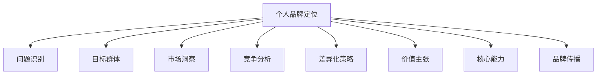

                 

# 确立个人品牌定位：明确你要解决的问题

> 关键词：品牌定位, 问题识别, 目标群体, 市场洞察, 竞争分析, 差异化策略, 价值主张, 核心能力, 品牌传播

## 1. 背景介绍

在当今快速变化的市场环境中，个人品牌定位成为了企业与个人取得成功的关键因素之一。无论是初创公司还是职场人士，明确的个人品牌定位都能帮助其更好地与目标市场连接，提升竞争力和影响力。然而，许多人在定位个人品牌时感到困惑和迷茫，不知道如何从零开始建立和维护一个有吸引力的品牌形象。本文旨在通过深入解析个人品牌定位的核心概念，提供一系列切实可行的步骤和策略，帮助您明确你要解决的问题，从而构建一个成功的个人品牌。

## 2. 核心概念与联系

### 2.1 核心概念概述

**个人品牌定位**：是指个人或品牌在目标市场中明确其独特价值和差异化优势，以便与竞争对手区分开来，并吸引目标客户群体的过程。

**问题识别**：指的是通过市场调研和数据分析，明确目标市场的需求和痛点，识别潜在的市场机会。

**目标群体**：即品牌的核心用户群，包含对品牌价值高度认可和积极反馈的人群。

**市场洞察**：通过分析市场趋势、客户行为和竞争环境，深入理解目标市场的需求和变化。

**竞争分析**：评估竞争对手的品牌定位、市场份额和客户反馈，找出自身的优势和不足。

**差异化策略**：根据市场洞察和竞争分析的结果，制定独特的品牌策略，凸显品牌的独特价值。

**价值主张**：明确品牌的核心价值和提供给客户的独特价值，解决客户的痛点问题。

**核心能力**：个人或品牌在市场竞争中的核心竞争力和资源。

**品牌传播**：通过各种营销渠道传播品牌信息，提升品牌知名度和影响力。

这些核心概念之间的关系可以通过以下Mermaid流程图来展示：



这个流程图展示了个人品牌定位的各个关键步骤及其相互关系。

## 3. 核心算法原理 & 具体操作步骤

### 3.1 算法原理概述

个人品牌定位的算法原理基于系统化的问题解决和差异化策略。首先，通过问题识别和市场洞察获取目标市场的需求和痛点，然后通过竞争分析找出自身的独特优势和差异化策略，最后结合核心能力和价值主张，制定一个明确的品牌传播策略。

### 3.2 算法步骤详解

**Step 1: 问题识别**
- **市场调研**：通过问卷调查、访谈、社交媒体分析等方法，了解目标市场的需求和痛点。
- **竞争分析**：收集竞争对手的品牌资料，分析其定位、优势和不足。
- **客户反馈**：收集客户的直接反馈，了解其需求和期望。

**Step 2: 市场洞察**
- **数据分析**：使用数据分析工具，如Google Analytics、Tableau等，深入理解目标市场的行为和趋势。
- **行为分析**：分析目标客户的行为模式和决策路径。
- **趋势预测**：根据历史数据和趋势分析，预测未来的市场变化。

**Step 3: 差异化策略**
- **竞争优势**：确定品牌的独特卖点和差异化优势，如技术创新、独特服务、优质产品等。
- **差异化定位**：结合品牌资源和市场需求，制定具体的差异化定位策略。
- **差异化营销**：设计差异化的营销策略，如独特的品牌形象、宣传口号、营销渠道等。

**Step 4: 价值主张**
- **核心价值**：明确品牌的核心价值，如诚信、创新、质量等。
- **客户利益**：阐述品牌提供的具体价值和利益，如何解决客户的痛点问题。
- **价值传达**：设计有效的价值传达方式，如产品演示、客户案例、社交媒体等。

**Step 5: 核心能力**
- **资源评估**：评估品牌的核心资源，如技术、人才、资金等。
- **能力提升**：识别需要提升的核心能力，制定提升计划。
- **能力整合**：将核心能力整合到品牌定位和价值主张中，增强品牌竞争力。

**Step 6: 品牌传播**
- **渠道选择**：选择适合的营销渠道，如社交媒体、行业会议、内容营销等。
- **内容创作**：创作高质量的内容，如博客文章、视频、白皮书等，传达品牌价值。
- **品牌互动**：与客户和受众进行互动，建立情感连接，增强品牌忠诚度。

### 3.3 算法优缺点

个人品牌定位的算法优点包括：
- **系统化**：通过系统化的问题解决和差异化策略，确保品牌定位的科学性和可执行性。
- **数据驱动**：基于市场调研和数据分析，确保品牌定位符合市场实际需求。
- **差异化竞争**：通过明确差异化策略，确保品牌在市场中的独特性。

算法缺点包括：
- **复杂度高**：需要收集和分析大量数据，过程较为繁琐。
- **资源需求高**：需要投入较多的时间、资金和人力资源。
- **市场变化快**：市场环境变化快，品牌定位需要不断调整和优化。

### 3.4 算法应用领域

个人品牌定位的算法可以应用于各种行业和企业，如科技公司、金融机构、咨询公司、初创企业等。无论是在国内市场还是国际市场，个人品牌定位都是提升竞争力和影响力的有效工具。

## 4. 数学模型和公式 & 详细讲解 & 举例说明

### 4.1 数学模型构建

个人品牌定位的数学模型主要基于需求-痛点分析、市场趋势预测和竞争对比分析。

**需求-痛点分析模型**：
\[
\text{需求-痛点} = \sum_{i=1}^{n} w_i \times \text{痛点}_i
\]
其中 \( w_i \) 为各个痛点的权重， \( \text{痛点}_i \) 为具体痛点描述。

**市场趋势预测模型**：
\[
\text{趋势预测} = f(\text{历史数据}, \text{市场环境})
\]
其中 \( f \) 为预测函数，可以根据线性回归、时间序列分析等方法确定。

**竞争对比分析模型**：
\[
\text{竞争对比} = \text{品牌竞争力} - \text{竞争者竞争力}
\]

### 4.2 公式推导过程

**需求-痛点分析模型推导**：
- 通过市场调研，获取目标市场的痛点描述。
- 根据不同痛点的重要性，赋予每个痛点一个权重 \( w_i \)。
- 对所有痛点进行加权求和，得到需求-痛点分析结果。

**市场趋势预测模型推导**：
- 收集历史市场数据，包括销量、用户反馈、市场份额等。
- 使用时间序列分析或回归分析等方法，建立预测模型。
- 将预测模型应用于当前市场环境，得出趋势预测结果。

**竞争对比分析模型推导**：
- 收集竞争对手的品牌资料，包括产品特点、市场份额、用户评价等。
- 根据各竞争对手的特点，计算其竞争力。
- 计算自身品牌与竞争对手的竞争力差异，得出竞争对比结果。

### 4.3 案例分析与讲解

以某科技初创公司的品牌定位为例：

**需求-痛点分析**：通过市场调研，发现目标市场对产品功能、用户界面和价格敏感。调研结果显示，用户最痛点是对现有产品的功能和界面不友好，且价格过高。

**市场趋势预测**：根据历史数据和市场环境，预测未来市场对功能丰富、界面友好和价格合理的需求将增加。

**竞争对比分析**：分析竞争对手的品牌资料，发现其功能较为单一，界面设计不够人性化，且价格较高。自身的品牌竞争力在于产品创新和价格优势。

**差异化策略**：结合上述分析，确定品牌差异化策略为“功能丰富、界面友好、价格合理”。

**价值主张**：明确品牌核心价值为“创新与用户体验”，解释如何通过产品创新和人性化的界面设计，解决用户的痛点问题。

**核心能力**：评估公司资源，确定技术研发、用户体验和市场营销为公司核心能力。

**品牌传播**：选择社交媒体、内容营销和行业会议为传播渠道，创建高质量的产品演示、客户案例和博客文章，与客户和受众进行互动，建立品牌信任和忠诚度。

## 5. 项目实践：代码实例和详细解释说明

### 5.1 开发环境搭建

在开始个人品牌定位的实践之前，需要搭建一个适合的技术开发环境。以下是一个基本的开发环境搭建步骤：

1. **环境准备**：
   - 安装Python和相关的依赖库，如Pandas、NumPy、SciPy等。
   - 安装数据分析和可视化工具，如Jupyter Notebook、Tableau等。
   - 配置数据访问权限，确保可以访问所需的数据源。

2. **数据收集**：
   - 收集市场调研数据，如问卷调查、访谈记录、社交媒体数据等。
   - 收集竞争对手数据，如品牌资料、市场份额、用户评价等。

3. **数据分析**：
   - 使用Python编写数据处理和分析脚本，如使用Pandas进行数据清洗和分析。
   - 使用NumPy进行数学计算和模型推导。
   - 使用SciPy进行统计分析。

### 5.2 源代码详细实现

以下是一个简单的Python脚本，用于需求-痛点分析：

```python
import pandas as pd

# 读取市场调研数据
df = pd.read_csv('market_survey_data.csv')

# 计算痛点权重
weights = df['weight'].sum() / df['weight'].sum()

# 计算需求-痛点分析
problem_pain_analysis = df['pain'] * weights
problem_pain_analysis = problem_pain_analysis.sum()

# 输出结果
print("需求-痛点分析结果：", problem_pain_analysis)
```

这个脚本通过Pandas读取市场调研数据，计算各个痛点的权重，并计算需求-痛点分析结果。

### 5.3 代码解读与分析

这个脚本的核心是使用Pandas对市场调研数据进行清洗和分析。通过计算痛点的权重和需求-痛点分析，可以得到市场调研中最重要的痛点，从而明确目标市场的核心需求。

## 6. 实际应用场景

### 6.1 科技公司

科技公司在制定个人品牌定位时，可以通过需求-痛点分析了解用户对产品功能和界面的期望，结合市场趋势预测和竞争对比分析，确定差异化策略和价值主张。例如，某科技初创公司通过需求-痛点分析发现用户最关注的功能和界面友好性，结合市场趋势预测和竞争对比分析，确定“功能丰富、界面友好”的品牌定位。通过内容营销和社交媒体传播，成功吸引了大量用户关注和购买。

### 6.2 金融公司

金融公司在制定个人品牌定位时，可以通过需求-痛点分析了解用户对金融产品风险控制、收益率和流动性的需求，结合市场趋势预测和竞争对比分析，确定差异化策略和价值主张。例如，某金融公司通过需求-痛点分析发现用户最关注的是风险控制，结合市场趋势预测和竞争对比分析，确定“风险控制能力强”的品牌定位。通过内容营销和行业会议传播，成功提升了品牌在市场中的地位。

### 6.3 咨询公司

咨询公司在制定个人品牌定位时，可以通过需求-痛点分析了解客户对咨询服务的质量和效率的期望，结合市场趋势预测和竞争对比分析，确定差异化策略和价值主张。例如，某咨询公司通过需求-痛点分析发现客户最关注的是咨询服务的质量，结合市场趋势预测和竞争对比分析，确定“高质量咨询服务”的品牌定位。通过内容营销和社交媒体传播，成功吸引了大量客户关注和合作。

### 6.4 未来应用展望

随着科技的不断进步和市场的快速变化，个人品牌定位的方法和技术也在不断演进。未来，个人品牌定位将更加依赖人工智能和大数据分析，通过智能算法自动分析市场数据，快速识别市场趋势和用户痛点，提供更加精准和个性化的品牌定位策略。此外，跨领域的数据融合和人工智能辅助设计也将成为新的趋势，帮助个人和企业在复杂的市场环境中取得竞争优势。

## 7. 工具和资源推荐

### 7.1 学习资源推荐

- **《个人品牌定位指南》**：一本系统介绍个人品牌定位方法和工具的书籍，涵盖市场调研、竞争分析、差异化策略等内容。
- **Coursera《数字营销策略》课程**：由世界知名大学开设的数字营销课程，涵盖品牌定位、市场调研和营销策略等内容。
- **LinkedIn Learning《品牌管理》课程**：由LinkedIn推出的品牌管理课程，涵盖品牌定位、市场洞察和竞争分析等内容。

### 7.2 开发工具推荐

- **Jupyter Notebook**：开源的Python数据分析和可视化工具，适合数据处理和分析。
- **Tableau**：流行的商业智能工具，适合数据可视化和市场洞察分析。
- **Python**：功能强大的编程语言，适合数据分析和模型推导。

### 7.3 相关论文推荐

- **《需求分析与痛点管理：提升品牌定位精准度》**：一篇关于需求分析和痛点管理的论文，探讨了如何通过需求分析提升品牌定位的精准度。
- **《人工智能在品牌定位中的应用》**：一篇关于人工智能在品牌定位中的应用的论文，探讨了人工智能如何帮助品牌快速识别市场需求和用户痛点。

## 8. 总结：未来发展趋势与挑战

### 8.1 研究成果总结

本文通过深入解析个人品牌定位的核心概念和算法原理，提供了一系列切实可行的操作步骤和策略，帮助个人明确所要解决的问题，从而构建一个成功的个人品牌。未来，随着数据科学和人工智能技术的不断进步，个人品牌定位将变得更加智能和高效，帮助个人和企业在复杂多变的市场环境中取得成功。

### 8.2 未来发展趋势

未来，个人品牌定位将更加依赖数据驱动和人工智能技术，通过智能算法自动分析市场数据，快速识别市场趋势和用户痛点，提供更加精准和个性化的品牌定位策略。此外，跨领域的数据融合和人工智能辅助设计也将成为新的趋势，帮助个人和企业在复杂的市场环境中取得竞争优势。

### 8.3 面临的挑战

尽管个人品牌定位在理论和实践上取得了一定的进展，但仍面临诸多挑战：
- **数据质量**：市场调研数据和竞争对手数据的准确性和完整性可能存在问题。
- **市场变化快**：市场环境和用户需求变化快，需要不断调整和优化品牌定位。
- **资源投入高**：品牌定位需要投入大量的时间和资源，对中小企业来说可能面临较大压力。

### 8.4 研究展望

未来的研究将重点关注以下几个方面：
- **自动化品牌定位**：开发智能算法，自动化分析市场数据，快速识别市场需求和用户痛点。
- **多模态数据分析**：将数据来源从单一的市场调研扩展到多模态数据，如社交媒体、行业报告等。
- **跨领域融合**：探索跨领域的数据融合和人工智能辅助设计，提升品牌定位的精准度和有效性。
- **伦理和责任**：在品牌定位过程中，需要考虑数据的隐私和伦理问题，确保品牌传播的透明和负责任。

通过不断探索和优化，个人品牌定位将更加科学和高效，帮助个人和企业在复杂多变的市场环境中取得成功。

## 9. 附录：常见问题与解答

**Q1: 如何确定品牌的核心价值？**

A: 品牌的核心价值应基于品牌独特的资源和能力，以及市场调研和用户反馈。可以通过SWOT分析（优势、劣势、机会、威胁），确定品牌的核心价值。

**Q2: 如何确定品牌的差异化策略？**

A: 差异化策略应结合市场趋势和竞争对比分析，确定品牌的独特卖点和差异化优势。例如，产品创新、独特服务、优质产品等。

**Q3: 如何衡量品牌定位的成功？**

A: 品牌定位的成功应基于市场反应和用户反馈。可以通过市场份额、用户增长、品牌知名度等指标衡量品牌定位的效果。

**Q4: 如何在品牌传播中保持一致性？**

A: 品牌传播应有一套明确的品牌指南，包括品牌语调、视觉风格、传播语境等，确保品牌传播的一致性和专业性。

**Q5: 如何在不同的市场环境中保持品牌定位的有效性？**

A: 品牌定位应具备跨市场和跨文化的适应性。可以通过市场调研和数据分析，确定不同市场的需求和痛点，进行针对性的品牌定位和传播。

---

作者：禅与计算机程序设计艺术 / Zen and the Art of Computer Programming

