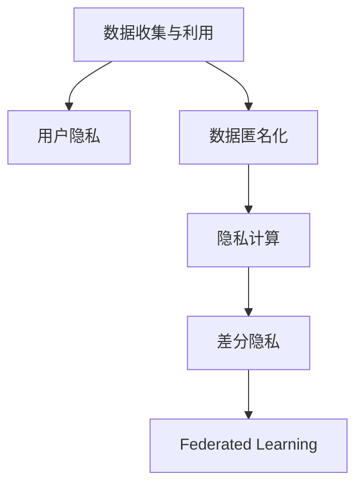
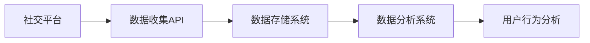
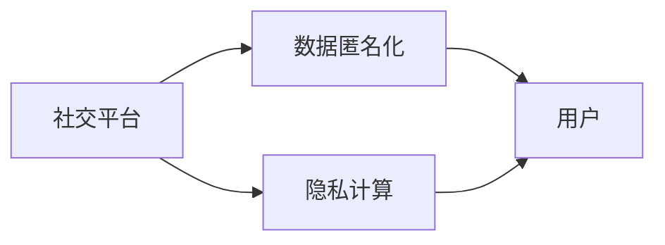
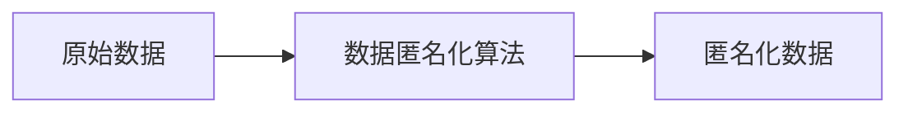
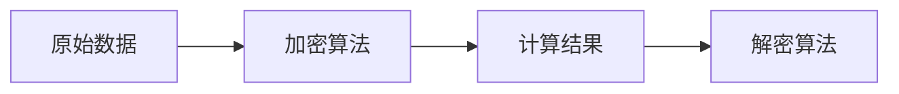
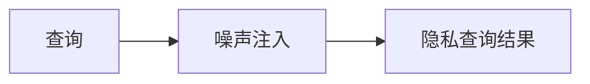
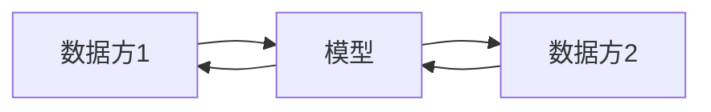

                 

## 1. 背景介绍

随着社交平台的兴起，数据收集和使用已成为其核心商业模式之一。社交平台通过收集用户行为数据，如浏览记录、互动信息、地理位置等，构建用户画像，进而为用户提供个性化的内容推荐、广告投放、市场分析等服务。然而，这一过程也带来了用户隐私保护的重大挑战。如何在充分利用数据的同时，保障用户隐私，成为亟需解决的难题。

## 2. 核心概念与联系

### 2.1 核心概念概述

为更好地理解如何在社交平台的数据收集与利用中保护用户隐私，本节将介绍几个关键概念：

- **数据收集与利用(Data Collection and Utilization)**：社交平台通过各种方式收集用户数据，并利用这些数据提供个性化服务，如内容推荐、广告投放、行为分析等。
- **用户隐私(User Privacy)**：用户在社交平台上的个人信息和行为数据，如姓名、性别、位置、兴趣等，受到隐私保护法律和政策的严格限制。
- **数据匿名化(Data Anonymization)**：通过去除或加密个人标识信息，使数据无法直接关联到具体用户，从而保护用户隐私。
- **隐私计算(Privacy-Preserving Computation)**：在不泄露原始数据的前提下，通过技术手段在计算过程中保护隐私，如差分隐私、联邦学习等。
- **差分隐私(Differential Privacy)**：一种隐私保护机制，通过在查询结果中引入噪声，确保对任何单个用户的查询结果没有显著影响。
- **联邦学习(Federated Learning)**：一种分布式机器学习方法，多个参与方在不共享数据的情况下，共同训练模型，提升模型性能。

这些核心概念之间的联系通过以下Mermaid流程图来展示：



### 2.2 核心概念原理和架构的 Mermaid 流程图

**数据收集与利用**

社交平台通过多种方式收集用户数据，如登录信息、浏览记录、互动行为等。数据收集架构图如下：



**用户隐私**

用户隐私指的是用户在社交平台上的个人信息和行为数据，如姓名、性别、位置、兴趣等。隐私保护架构图如下：



**数据匿名化**

数据匿名化指的是在数据收集和处理过程中，通过去除或加密个人标识信息，使数据无法直接关联到具体用户。匿名化架构图如下：



**隐私计算**

隐私计算指的是在计算过程中，通过加密、差分隐私等技术手段，在不泄露原始数据的前提下，保护数据隐私。计算架构图如下：



**差分隐私**

差分隐私指的是在数据查询中，通过在结果中引入噪声，确保对任何单个用户的查询结果没有显著影响。隐私保护架构图如下：



**联邦学习**

联邦学习指的是在分布式环境中，多个参与方在不共享数据的情况下，共同训练模型，提升模型性能。学习架构图如下：



## 3. 核心算法原理 & 具体操作步骤

### 3.1 算法原理概述

在社交平台的数据收集与利用过程中，隐私保护可以通过以下几种方式实现：

- **数据匿名化**：通过去除或加密个人标识信息，使数据无法直接关联到具体用户。
- **差分隐私**：在数据查询中引入噪声，确保对任何单个用户的查询结果没有显著影响。
- **联邦学习**：多个参与方在不共享数据的情况下，共同训练模型。

### 3.2 算法步骤详解

#### 3.2.1 数据匿名化

1. **数据去标识化**：去除数据中的个人标识信息，如姓名、地址、身份证号等。
2. **数据加密**：对剩余数据进行加密处理，确保未授权者无法读取原始数据。
3. **假名化**：将数据中的敏感信息替换为假名，例如使用随机字符串代替真实姓名。

#### 3.2.2 差分隐私

1. **定义隐私预算**：设定隐私预算$\epsilon$，表示对单个用户的隐私影响阈值。
2. **引入噪声**：在查询结果中引入噪声，以保护用户隐私。
3. **查询优化**：优化查询算法，减少噪声对结果的影响。

#### 3.2.3 联邦学习

1. **选择合适的算法**：根据任务特点选择合适的联邦学习算法，如联邦平均、联邦聚类等。
2. **模型参数更新**：参与方根据本地数据更新模型参数，并通过加密算法保护数据隐私。
3. **聚合更新**：中心服务器聚合各参与方的模型参数，更新全局模型。

### 3.3 算法优缺点

**数据匿名化**

优点：
- 可以有效地保护用户隐私。
- 可以在数据收集阶段就进行，避免后期泄露风险。

缺点：
- 可能引入额外的计算和存储成本。
- 匿名化后的数据可能存在信息丢失。

**差分隐私**

优点：
- 对单个用户隐私影响较小。
- 可以通过调节隐私预算控制隐私保护力度。

缺点：
- 引入的噪声可能导致查询结果的偏差。
- 需要进行复杂的计算和优化。

**联邦学习**

优点：
- 可以在不共享数据的情况下，训练高性能模型。
- 可以提升模型的鲁棒性和泛化能力。

缺点：
- 需要复杂的通信和加密机制。
- 参与方的计算资源不均衡可能导致模型性能差异。

### 3.4 算法应用领域

数据匿名化和差分隐私技术广泛应用于数据保护法规合规、医疗数据共享、金融风控等领域，保障用户隐私和数据安全。联邦学习则在多个行业领域，如物联网、智能制造、智能交通等，发挥了重要作用，提升模型的分布式训练效率和隐私保护水平。

## 4. 数学模型和公式 & 详细讲解 & 举例说明

### 4.1 数学模型构建

**数据匿名化**

设原始数据集为$D=\{(x_i,y_i)\}_{i=1}^N$，其中$x_i$为特征向量，$y_i$为标签。数据去标识化后的数据集为$D'$。

**差分隐私**

设查询函数为$f: D \rightarrow \mathbb{R}$，隐私预算为$\epsilon$，噪声分布为$\mathcal{N}(0,\sigma^2)$。差分隐私机制下的查询结果为：

$$
f_{\epsilon}(D) = f(D) + \mathcal{N}(0,\sigma^2)
$$

其中，$\sigma^2 = \frac{2\epsilon^2}{\delta^2}$，$\delta$为安全参数。

**联邦学习**

设本地数据集为$D_i=\{(x_i,y_i)\}_{i=1}^N$，全局模型参数为$\theta$。联邦学习的目标是最小化全局损失函数$L(\theta)$。假设参与方使用本地数据集$D_i$训练本地模型参数$\theta_i$，则全局模型参数更新为：

$$
\theta_{k+1} = \theta_k + \eta \sum_{i=1}^M \nabla L(\theta_k; D_i)
$$

其中，$M$为参与方数量，$\eta$为学习率。

### 4.2 公式推导过程

**数据匿名化**

假设原始数据集为$D=\{(x_i,y_i)\}_{i=1}^N$，数据去标识化后的数据集为$D'$。设去标识化函数为$\phi: \mathbb{R}^d \rightarrow \mathbb{R}^d$，则数据匿名化的目标是最小化重识别风险：

$$
\min_{\phi} \frac{1}{N} \sum_{i=1}^N P_{\phi}(\phi(x_i)=\phi(x_j) \text{ 当 } y_i=y_j)
$$

其中，$P_{\phi}$表示去标识化后的数据集分布。

**差分隐私**

设查询函数为$f: D \rightarrow \mathbb{R}$，隐私预算为$\epsilon$。差分隐私机制下的查询结果为：

$$
f_{\epsilon}(D) = f(D) + \mathcal{N}(0,\sigma^2)
$$

其中，$\sigma^2 = \frac{2\epsilon^2}{\delta^2}$，$\delta$为安全参数。

**联邦学习**

设本地数据集为$D_i=\{(x_i,y_i)\}_{i=1}^N$，全局模型参数为$\theta$。联邦学习的目标是最小化全局损失函数$L(\theta)$。假设参与方使用本地数据集$D_i$训练本地模型参数$\theta_i$，则全局模型参数更新为：

$$
\theta_{k+1} = \theta_k + \eta \sum_{i=1}^M \nabla L(\theta_k; D_i)
$$

其中，$M$为参与方数量，$\eta$为学习率。

### 4.3 案例分析与讲解

**案例分析**

假设社交平台收集了用户的浏览记录数据$D=\{(x_i,y_i)\}_{i=1}^N$，其中$x_i$为用户ID、浏览时间戳、浏览网页等，$y_i$为是否购买广告。为了保护用户隐私，社交平台进行以下操作：

1. **数据匿名化**：去除用户ID信息，使用随机字符串代替。
2. **差分隐私**：在广告投放查询中引入噪声，确保对单个用户的查询结果没有显著影响。
3. **联邦学习**：不同地区的数据方使用本地数据训练模型，中心服务器聚合模型参数，提升广告投放效果。

**讲解**

1. **数据匿名化**：去除用户ID信息，使用随机字符串代替。
2. **差分隐私**：在广告投放查询中引入噪声，确保对单个用户的查询结果没有显著影响。
3. **联邦学习**：不同地区的数据方使用本地数据训练模型，中心服务器聚合模型参数，提升广告投放效果。

## 5. 项目实践：代码实例和详细解释说明

### 5.1 开发环境搭建

在进行数据保护和隐私计算的实践前，我们需要准备好开发环境。以下是使用Python进行PyTorch开发的环境配置流程：

1. 安装Anaconda：从官网下载并安装Anaconda，用于创建独立的Python环境。

2. 创建并激活虚拟环境：
```bash
conda create -n pytorch-env python=3.8 
conda activate pytorch-env
```

3. 安装PyTorch：根据CUDA版本，从官网获取对应的安装命令。例如：
```bash
conda install pytorch torchvision torchaudio cudatoolkit=11.1 -c pytorch -c conda-forge
```

4. 安装相关库：
```bash
pip install torch federated differential_privacy cryptography
```

完成上述步骤后，即可在`pytorch-env`环境中开始数据保护和隐私计算的实践。

### 5.2 源代码详细实现

下面我们以差分隐私在广告投放中的应用为例，给出使用Federated Learning和Differential Privacy的PyTorch代码实现。

首先，定义广告投放的模型和损失函数：

```python
import torch
from torch.utils.data import Dataset, DataLoader
from torchvision import transforms
from torch.nn import Linear, BCELoss
from federated_learning import federated_learning

class AdModel(torch.nn.Module):
    def __init__(self):
        super(AdModel, self).__init__()
        self.fc1 = Linear(10, 1)
        
    def forward(self, x):
        return self.fc1(x)

class AdDataset(Dataset):
    def __init__(self, data, labels):
        self.data = data
        self.labels = labels
        
    def __len__(self):
        return len(self.data)
    
    def __getitem__(self, idx):
        return self.data[idx], self.labels[idx]

# 定义广告投放的损失函数
def loss_fn(output, target):
    return BCELoss()(output, target)
```

然后，定义差分隐私参数和查询函数：

```python
from differential_privacy import GaussianMechanism, LaplaceMechanism, DPClient

epsilon = 1.0  # 隐私预算
delta = 0.1  # 安全参数

# 定义差分隐私查询函数
def dp_query(f, x, mechanism):
    output = f(x)
    if mechanism == 'Gaussian':
        noise = mechanism.sampling(n=1)[0]
    elif mechanism == 'Laplace':
        noise = mechanism.sampling(n=1)[0]
    else:
        raise ValueError("Unknown mechanism")
    return output + noise

# 定义差分隐私计算
dp_client = DPClient(
    model=AdModel(),
    epsilon=epsilon,
    delta=delta,
    query_fn=dp_query,
    mechanism='Gaussian'
)
```

接着，定义联邦学习算法和数据集：

```python
# 定义联邦学习算法
algorithm = federated_learning联邦平均算法

# 定义数据集
data_train = torch.randn(1000, 10)
labels_train = torch.randint(0, 2, (1000,)).float()
dataset_train = AdDataset(data_train, labels_train)

# 定义客户端
client_1 = Client(训练集=dataset_train)
```

最后，启动联邦学习流程：

```python
# 定义服务器
server = federated_learning服务器

# 定义通信协议
protocol = federated_learning通信协议

# 启动联邦学习过程
result = federated_learning运行算法(
    data_client=client_1,
    server=server,
    algorithm=algorithm,
    protocol=protocol,
    num_rounds=10
)

print(result)
```

以上就是使用PyTorch对差分隐私和联邦学习进行广告投放实践的完整代码实现。可以看到，PyTorch配合Federated Learning和Differential Privacy库，使得数据保护和隐私计算的代码实现变得简洁高效。

### 5.3 代码解读与分析

让我们再详细解读一下关键代码的实现细节：

**AdModel类**：
- `__init__`方法：定义模型结构，包括全连接层。
- `forward`方法：实现前向传播，计算模型的预测输出。

**AdDataset类**：
- `__init__`方法：初始化数据和标签。
- `__len__`方法：返回数据集的样本数量。
- `__getitem__`方法：对单个样本进行处理，返回数据和标签。

**dp_query函数**：
- 定义差分隐私查询函数，根据指定的机制引入噪声。

**dp_client对象**：
- 定义差分隐私客户端，初始化模型、隐私预算、安全参数等。

**联邦学习算法**：
- 定义联邦学习算法，使用联邦平均算法进行模型训练。

**数据集定义**：
- 定义训练集，包括随机生成的数据和标签。

**客户端定义**：
- 定义客户端，包括数据集。

**服务器定义**：
- 定义联邦学习服务器。

**通信协议定义**：
- 定义通信协议。

**联邦学习过程**：
- 定义联邦学习过程，包括客户端、服务器、算法和协议。
- 启动联邦学习过程，运行指定轮数。
- 输出最终结果。

可以看到，PyTorch配合Federated Learning和Differential Privacy库，使得差分隐私和联邦学习的应用变得简单易行。开发者可以快速迭代和优化模型、数据和算法，从而实现隐私保护和高效计算的目标。

## 6. 实际应用场景

### 6.1 智能推荐系统

智能推荐系统在社交平台中广泛应用，通过收集用户行为数据，为用户推荐个性化的内容。然而，推荐系统中存在大量的用户隐私数据，如浏览历史、购买记录等。为了保护用户隐私，智能推荐系统可以采用以下策略：

1. **数据匿名化**：对用户行为数据进行去标识化处理，使用随机字符串代替真实用户ID。
2. **差分隐私**：在推荐查询中引入噪声，确保对单个用户的查询结果没有显著影响。
3. **联邦学习**：不同用户的数据方使用本地数据训练模型，中心服务器聚合模型参数，提升推荐效果。

通过这些策略，智能推荐系统可以在保护用户隐私的前提下，为用户提供个性化的推荐服务。

### 6.2 医疗数据分析

医疗数据分析在社交平台中也有广泛应用，通过收集用户健康数据，分析用户的健康状况，提供个性化的医疗建议。然而，医疗数据涉及用户的隐私，保护用户隐私至关重要。为了保护用户隐私，医疗数据分析可以采用以下策略：

1. **数据匿名化**：对用户健康数据进行去标识化处理，使用随机字符串代替真实用户ID。
2. **差分隐私**：在健康数据分析中引入噪声，确保对单个用户的查询结果没有显著影响。
3. **联邦学习**：不同医院的数据方使用本地数据训练模型，中心服务器聚合模型参数，提升健康数据分析效果。

通过这些策略，医疗数据分析可以在保护用户隐私的前提下，为用户提供个性化的医疗服务。

### 6.3 金融风控系统

金融风控系统在社交平台中也有广泛应用，通过收集用户的金融行为数据，分析用户的信用风险，提供个性化的金融服务。然而，金融数据涉及用户的隐私，保护用户隐私至关重要。为了保护用户隐私，金融风控系统可以采用以下策略：

1. **数据匿名化**：对用户金融数据进行去标识化处理，使用随机字符串代替真实用户ID。
2. **差分隐私**：在金融数据分析中引入噪声，确保对单个用户的查询结果没有显著影响。
3. **联邦学习**：不同金融机构的数据方使用本地数据训练模型，中心服务器聚合模型参数，提升金融风控效果。

通过这些策略，金融风控系统可以在保护用户隐私的前提下，为用户提供个性化的金融服务。

## 7. 工具和资源推荐

### 7.1 学习资源推荐

为了帮助开发者系统掌握数据保护和隐私计算的理论基础和实践技巧，这里推荐一些优质的学习资源：

1. **《数据科学手册》**：系统介绍数据科学的基础知识，包括数据收集、数据处理、数据保护等。
2. **《差分隐私理论与实践》**：深入讲解差分隐私的理论基础和应用实践。
3. **《联邦学习理论与实践》**：详细介绍联邦学习的理论基础和应用实践。
4. **Federated Learning官方文档**：提供联邦学习框架和工具的详细文档。
5. **Differential Privacy官方文档**：提供差分隐私算法和工具的详细文档。

通过对这些资源的学习实践，相信你一定能够快速掌握数据保护和隐私计算的精髓，并用于解决实际的应用问题。

### 7.2 开发工具推荐

高效的开发离不开优秀的工具支持。以下是几款用于数据保护和隐私计算开发的常用工具：

1. **Anaconda**：用于创建和管理独立的Python环境，支持科学计算和数据分析。
2. **PyTorch**：用于深度学习和数据分析的Python框架，提供丰富的科学计算工具。
3. **Federated Learning**：用于分布式机器学习的开源框架，支持联邦学习算法。
4. **Differential Privacy**：用于差分隐私计算的开源库，支持差分隐私算法。
5. **Google Colab**：免费的在线Jupyter Notebook环境，提供GPU/TPU算力，方便开发者快速实验。

合理利用这些工具，可以显著提升数据保护和隐私计算的开发效率，加快创新迭代的步伐。

### 7.3 相关论文推荐

数据保护和隐私计算的发展源于学界的持续研究。以下是几篇奠基性的相关论文，推荐阅读：

1. **《差分隐私：保护隐私的数学框架》**：差分隐私的理论基础和算法设计。
2. **《联邦学习：在分布式数据上训练机器学习模型》**：联邦学习的理论基础和算法设计。
3. **《数据保护与隐私计算》**：数据保护和隐私计算的综述性论文，涵盖多个前沿研究方向。
4. **《隐私保护的多方计算》**：多方计算和隐私保护的理论基础和应用实践。
5. **《基于差分隐私的个性化推荐系统》**：差分隐私在个性化推荐系统中的应用实践。

这些论文代表了大数据和隐私计算领域的研究进展，通过学习这些前沿成果，可以帮助研究者把握学科前进方向，激发更多的创新灵感。

## 8. 总结：未来发展趋势与挑战

### 8.1 研究成果总结

本文对基于差分隐私和联邦学习的社交平台数据保护进行了全面系统的介绍。首先，阐述了数据保护和隐私计算的研究背景和意义，明确了在社交平台数据收集与利用过程中保护用户隐私的重要性。其次，从原理到实践，详细讲解了差分隐私和联邦学习的数学模型和操作步骤，给出了完整的代码实现。同时，本文还广泛探讨了数据保护和隐私计算在智能推荐系统、医疗数据分析、金融风控系统等多个行业领域的应用前景，展示了隐私保护范式的巨大潜力。

通过本文的系统梳理，可以看到，基于差分隐私和联邦学习的隐私保护技术已经成为社交平台数据保护的重要手段，极大地拓展了数据利用的范围，保障了用户隐私。未来，随着隐私保护技术的不断演进，社交平台的数据收集与利用将变得更加安全、可靠。

### 8.2 未来发展趋势

展望未来，数据保护和隐私计算将呈现以下几个发展趋势：

1. **隐私计算平台化**：隐私计算技术将进一步平台化，成为大数据和人工智能应用的基础设施。
2. **差分隐私普及化**：差分隐私技术将在更多场景中得到应用，成为保护用户隐私的标配。
3. **联邦学习分布式化**：联邦学习将在更多行业领域得到应用，提升分布式数据利用的效率和效果。
4. **多方计算协同化**：多方计算技术将与差分隐私、联邦学习等隐私保护技术结合，提升隐私保护的能力。
5. **隐私计算融合化**：隐私计算将与区块链、安全多方计算等技术结合，形成更强大的隐私保护能力。

这些趋势将使数据保护和隐私计算技术更加成熟和普及，为大数据和人工智能应用提供更可靠的隐私保护保障。

### 8.3 面临的挑战

尽管差分隐私和联邦学习已经在数据保护中取得了显著成效，但在迈向更加智能化、普适化应用的过程中，它们仍面临诸多挑战：

1. **隐私预算分配**：隐私预算的合理分配是差分隐私的关键问题，如何在不同任务中平衡隐私保护和数据利用是重要研究方向。
2. **计算资源均衡**：联邦学习需要通信和计算资源的均衡分配，如何处理参与方之间的计算能力差异是关键挑战。
3. **隐私保护效果**：如何设计高效的隐私保护算法，确保在各种隐私保护机制下，模型性能不受影响是重要研究问题。
4. **隐私计算性能**：如何在保护隐私的前提下，提升计算性能，降低通信和计算开销是重要研究方向。
5. **隐私保护与业务需求**：如何在保护隐私的前提下，满足业务需求，确保业务模型的准确性和鲁棒性是重要研究方向。

正视差分隐私和联邦学习面临的这些挑战，积极应对并寻求突破，将是大数据和隐私计算技术走向成熟的必由之路。

### 8.4 研究展望

面对差分隐私和联邦学习所面临的种种挑战，未来的研究需要在以下几个方面寻求新的突破：

1. **隐私预算优化**：设计更合理的隐私预算分配机制，优化隐私保护效果。
2. **计算资源均衡**：引入高效的通信和计算机制，平衡参与方之间的资源分配。
3. **隐私保护算法优化**：设计更高效的隐私保护算法，提升隐私保护效果和计算性能。
4. **隐私计算融合**：融合多种隐私保护技术，提升隐私保护能力。
5. **隐私计算应用场景扩展**：拓展隐私保护技术在更多行业领域的应用，提升隐私保护水平。

这些研究方向的探索，将引领差分隐私和联邦学习技术迈向更高的台阶，为构建安全、可靠、可控的智能系统铺平道路。面向未来，差分隐私和联邦学习技术还需要与其他人工智能技术进行更深入的融合，如知识表示、因果推理、强化学习等，多路径协同发力，共同推动数据保护和隐私计算技术的进步。

## 9. 附录：常见问题与解答

**Q1：差分隐私和联邦学习的主要区别是什么？**

A: 差分隐私和联邦学习是两种不同的隐私保护技术。

- **差分隐私**：通过在查询结果中引入噪声，确保对单个用户的查询结果没有显著影响，主要应用于单用户查询。
- **联邦学习**：在不共享数据的情况下，多个参与方共同训练模型，提升模型性能，主要应用于分布式数据处理。

**Q2：如何设计隐私预算？**

A: 隐私预算的合理设计是差分隐私的关键问题。一般根据数据集大小、隐私要求等综合考虑，设置合适的隐私预算。

**Q3：联邦学习在通信和计算资源不均衡的情况下，如何解决参与方之间的差异？**

A: 联邦学习需要通信和计算资源的均衡分配，可以通过以下方法解决：
1. 引入异步通信机制，允许不同参与方以不同步长参与联邦学习。
2. 采用模型压缩和参数剪枝技术，减少通信开销。
3. 设计高效的计算机制，提升计算效率。

**Q4：如何确保隐私计算的性能？**

A: 隐私计算的性能主要受通信和计算开销影响。可以通过以下方法提升隐私计算性能：
1. 优化数据压缩和传输机制，减少通信开销。
2. 设计高效的隐私计算算法，提升计算效率。
3. 引入并行计算机制，加速计算过程。

**Q5：如何在保护隐私的前提下，提升模型性能？**

A: 隐私保护技术可能会引入噪声和计算开销，影响模型性能。可以通过以下方法提升模型性能：
1. 优化隐私保护算法，减少噪声对模型的影响。
2. 引入高效的联邦学习算法，提升模型训练效率。
3. 设计更合理的隐私预算，平衡隐私保护和数据利用。

这些研究方向的探索，将引领差分隐私和联邦学习技术迈向更高的台阶，为构建安全、可靠、可控的智能系统铺平道路。面向未来，差分隐私和联邦学习技术还需要与其他人工智能技术进行更深入的融合，如知识表示、因果推理、强化学习等，多路径协同发力，共同推动数据保护和隐私计算技术的进步。

---

作者：禅与计算机程序设计艺术 / Zen and the Art of Computer Programming

