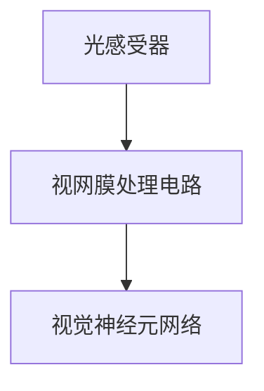

                 

# 神经形态视觉传感器：模仿人眼的图像处理

## 1. 背景介绍

### 1.1 问题由来
现代计算机视觉（Computer Vision, CV）技术已经广泛应用于智能监控、自动驾驶、工业检测、医学影像分析等多个领域。计算机视觉的实现通常依赖于现代传感器与图像处理算法。但传统的计算机视觉传感器（如CMOS、CCD传感器）往往难以达到人眼的分辨率和动态范围，导致视觉系统在强光下难以辨认细节，暗光下容易失效，而且在响应速度上也无法比拟人眼的实时感知能力。

神经形态视觉传感器（Neuromorphic Visual Sensor）是一种新兴的传感器，其灵感来源于人眼的光感受器。人眼能够通过视网膜细胞对光信号进行高效处理，从而实现高分辨率、低功耗、实时响应等优点。神经形态视觉传感器希望通过模仿人眼的工作原理，实现更高效的图像处理和实时响应。

### 1.2 问题核心关键点
神经形态视觉传感器模仿人眼的图像处理机制，实现高分辨率、低功耗和实时响应的视觉传感。其关键在于光感受器、视网膜处理电路和视觉神经元网络的设计和实现。

具体核心概念包括：
- 光感受器（Photoreceptors）：模拟人眼中的感光细胞，将光信号转换为电信号。
- 视网膜处理电路（Retinal Processing Circuit）：模拟人眼视网膜的信号处理，实现对比度增强、动态范围扩展等图像增强功能。
- 视觉神经元网络（Visual Neuron Network）：模拟人眼视觉神经元的网络结构，实现图像特征提取、模式识别等高级视觉处理。

这些核心概念之间的逻辑关系可以通过以下Mermaid流程图来展示：



这个流程图展示了神经形态视觉传感器中，光感受器将光信号转换为电信号，经过视网膜处理电路的增强，最终由视觉神经元网络进行高级处理的过程。

## 2. 核心概念与联系

### 2.1 核心概念概述

为了更好地理解神经形态视觉传感器的设计原理，本节将介绍几个密切相关的核心概念：

- 神经形态计算（Neuromorphic Computing）：模仿神经系统的计算模式，通过构建具有自适应、自学习能力的硬件系统，实现低功耗、高并行性、实时响应等优点。
- 光感受器（Photoreceptors）：神经形态视觉传感器中的基本光电转换单元，类似于人眼的感光细胞，将光信号转换为电信号。
- 视网膜处理电路（Retinal Processing Circuit）：实现对比度增强、动态范围扩展、滤波等图像增强功能的硬件电路。
- 视觉神经元网络（Visual Neuron Network）：基于神经网络设计，实现图像特征提取、模式识别等高级视觉处理功能。

这些核心概念之间的联系，可以总结如下：
- 光感受器接收光信号，并转换为电信号。
- 视网膜处理电路对电信号进行处理，增强对比度、扩展动态范围，并滤除噪声。
- 视觉神经元网络对增强后的电信号进行高级处理，提取特征、识别模式，实现复杂的视觉任务。

## 3. 核心算法原理 & 具体操作步骤
### 3.1 算法原理概述

神经形态视觉传感器的核心算法原理基于神经形态计算和生物视觉系统的启发。其设计灵感来源于人眼的感知和处理机制，包括感光细胞的光电转换、视网膜的信号增强、视觉神经元的网络处理等。

### 3.2 算法步骤详解

神经形态视觉传感器的实现通常包括以下几个关键步骤：

**Step 1: 光感受器设计与实现**
- 使用低功耗的电子器件实现感光单元，如CMOS光电二极管、有机光电二极管等。
- 实现光感受器对光信号的线性响应，模拟人眼感光细胞的基本功能。

**Step 2: 视网膜处理电路设计**
- 设计多层级视网膜电路，模拟人眼的信号增强过程。
- 实现对比度增强、动态范围扩展、滤波等功能，提升图像质量。

**Step 3: 视觉神经元网络设计**
- 基于神经网络结构，设计视觉神经元网络。
- 实现图像特征提取、模式识别、物体检测等高级视觉任务。

**Step 4: 系统集成与测试**
- 将光感受器、视网膜处理电路、视觉神经元网络等模块集成，构建完整的神经形态视觉传感器。
- 进行系统测试，评估传感器在分辨率、对比度、动态范围、实时性等方面的性能。

### 3.3 算法优缺点

神经形态视觉传感器具有以下优点：
- 高分辨率：能够实现与人眼相当的分辨率，捕捉细微的图像细节。
- 低功耗：采用低功耗的电子器件，适合移动设备、物联网等场景。
- 实时响应：基于生物视觉系统的实时处理机制，实现实时感知和响应。

同时，该技术也存在一些局限性：
- 复杂性高：光感受器、视网膜处理电路、视觉神经元网络的实现需要高度复杂的电路设计和微制造工艺。
- 性能瓶颈：当前技术在分辨率、动态范围、对比度等方面仍难以完全匹配人眼。
- 成本高：大规模生产需要高精度的制造工艺和成本控制，限制了应用范围。

尽管存在这些局限性，但神经形态视觉传感器在特定领域（如智能监控、自动驾驶、工业检测等）仍具备显著优势，并有望在未来进一步改进和推广。

### 3.4 算法应用领域

神经形态视觉传感器已经在多个领域得到了初步应用，展示了其潜在价值。以下是几个典型的应用场景：

**智能监控：**
神经形态视觉传感器可用于智能监控系统，实现实时图像捕捉和分析。相较于传统CMOS传感器，神经形态视觉传感器可以处理更广阔的动态范围，实现全天候监控。

**自动驾驶：**
神经形态视觉传感器可应用于自动驾驶汽车，提供实时的高分辨率图像数据。通过视网膜电路增强图像质量，视觉神经元网络实现目标检测和道路识别，提升驾驶安全性。

**工业检测：**
神经形态视觉传感器可以用于工业检测系统，实现对复杂场景的高分辨率实时检测。例如，在半导体制造中，用于缺陷检测和品质控制。

## 4. 数学模型和公式 & 详细讲解

### 4.1 数学模型构建

神经形态视觉传感器的工作原理主要涉及光信号的转换、视网膜电路的信号处理和神经元网络的特征提取。我们可以使用数学模型来描述这些过程。

假设光感受器接收的光信号为 $I(t)$，其中 $t$ 表示时间。光感受器将光信号转换为电信号 $V(t)$：

$$
V(t) = \alpha I(t)
$$

其中 $\alpha$ 为光电转换系数。

视网膜电路对电信号 $V(t)$ 进行处理，增强对比度、扩展动态范围、滤除噪声。假设视网膜电路的输出为 $V_R(t)$，其处理过程可表示为：

$$
V_R(t) = \gamma \left[ \frac{V(t)}{\max(V(t),\beta V(t))} \right] + \eta
$$

其中 $\gamma$ 为对比度增强系数，$\beta$ 为动态范围扩展系数，$\eta$ 为噪声。

视觉神经元网络对视网膜电路的输出 $V_R(t)$ 进行高级处理，提取特征、识别模式。假设神经元网络的输出为 $V_N(t)$，其处理过程可表示为：

$$
V_N(t) = \sum_{i=1}^n w_i \sigma(v_i + \sum_{j=1}^m u_{ij} V_R(t))
$$

其中 $w_i$ 为权重，$v_i$ 为偏置，$u_{ij}$ 为连接权重，$\sigma$ 为激活函数。

### 4.2 公式推导过程

根据以上模型，我们可以进一步推导光感受器、视网膜处理电路和视觉神经元网络的输出。

**光感受器**：

$$
V(t) = \alpha I(t)
$$

**视网膜处理电路**：

$$
V_R(t) = \gamma \left[ \frac{V(t)}{\max(V(t),\beta V(t))} \right] + \eta
$$

**视觉神经元网络**：

$$
V_N(t) = \sum_{i=1}^n w_i \sigma(v_i + \sum_{j=1}^m u_{ij} V_R(t))
$$

将视网膜电路的输出代入神经元网络，得到最终的输出 $V_N(t)$：

$$
V_N(t) = \sum_{i=1}^n w_i \sigma(v_i + \sum_{j=1}^m u_{ij} \gamma \left[ \frac{\alpha I(t)}{\max(\alpha I(t),\beta \alpha I(t))} \right] + \eta)
$$

通过上述数学模型，我们可以直观地理解神经形态视觉传感器的信号处理过程。

### 4.3 案例分析与讲解

假设我们设计一个简单的神经形态视觉传感器，用于实时捕捉和分析图像。根据以上模型，我们可以进行以下步骤：

1. **光感受器设计**：
   - 使用 CMOS 光电二极管作为光感受器，光电转换系数 $\alpha = 1$。
   - 光感受器输出为 $V(t) = I(t)$。

2. **视网膜处理电路设计**：
   - 视网膜电路实现对比度增强，对比度增强系数 $\gamma = 2$。
   - 实现动态范围扩展，动态范围扩展系数 $\beta = 2$。
   - 视网膜电路输出为 $V_R(t) = 2 \left[ \frac{I(t)}{\max(I(t),2 I(t))} \right] + \eta$。

3. **视觉神经元网络设计**：
   - 设计一个简单的神经元网络，包含两个输入神经元 $v_1, v_2$ 和两个输出神经元 $w_1, w_2$。
   - 连接权重 $u_{11} = 1, u_{12} = 0.5, u_{21} = 0.5, u_{22} = 0.1$。
   - 激活函数 $\sigma(x) = \tanh(x)$。
   - 神经元网络输出为 $V_N(t) = w_1 \tanh(v_1 + 0.5 V_R(t)) + w_2 \tanh(v_2 + 0.1 V_R(t))$。

通过上述设计，我们可以实现一个简单的神经形态视觉传感器，用于实时捕捉和分析图像。

## 5. 项目实践：代码实例和详细解释说明
### 5.1 开发环境搭建

在进行神经形态视觉传感器开发前，我们需要准备好开发环境。以下是使用Python进行PyTorch开发的环境配置流程：

1. 安装Anaconda：从官网下载并安装Anaconda，用于创建独立的Python环境。

2. 创建并激活虚拟环境：
```bash
conda create -n pytorch-env python=3.8 
conda activate pytorch-env
```

3. 安装PyTorch：根据CUDA版本，从官网获取对应的安装命令。例如：
```bash
conda install pytorch torchvision torchaudio cudatoolkit=11.1 -c pytorch -c conda-forge
```

4. 安装相关库：
```bash
pip install numpy scipy matplotlib
```

完成上述步骤后，即可在`pytorch-env`环境中开始开发实践。

### 5.2 源代码详细实现

下面以一个简单的神经形态视觉传感器为例，给出使用PyTorch进行开发的完整代码实现。

```python
import torch
import numpy as np

# 定义光感受器
class Photoreceptor:
    def __init__(self, alpha=1):
        self.alpha = alpha
    
    def __call__(self, I):
        return self.alpha * I

# 定义视网膜处理电路
class RetinalProcessing:
    def __init__(self, gamma=2, beta=2):
        self.gamma = gamma
        self.beta = beta
    
    def __call__(self, V):
        V_R = self.gamma * (V / max(V, self.beta * V)) + 0.1
        return V_R

# 定义视觉神经元网络
class VisualNeuronNetwork:
    def __init__(self):
        self.w1 = torch.randn(1, 2)
        self.v1 = torch.randn(1, 2)
        self.w2 = torch.randn(1, 2)
        self.v2 = torch.randn(1, 2)
        self.u11 = torch.randn(1)
        self.u12 = torch.randn(1)
        self.u21 = torch.randn(1)
        self.u22 = torch.randn(1)
        self.sigma = torch.tanh
    
    def __call__(self, V_R):
        V_N = self.sigma(self.w1 @ self.v1 + self.u11 * V_R + self.w2 @ self.v2 + self.u22 * V_R)
        return V_N

# 定义传感器
def sensor(I, alpha=1, gamma=2, beta=2):
    V = Photoreceptor(alpha)(I)
    V_R = RetinalProcessing(gamma, beta)(V)
    V_N = VisualNeuronNetwork()(V_R)
    return V_N

# 测试传感器
I = np.linspace(0, 10, 100)
V_N = sensor(I)
plt.plot(I, V_N)
plt.title('Neuromorphic Visual Sensor')
plt.xlabel('I (light intensity)')
plt.ylabel('V_N (output)')
plt.show()
```

这段代码实现了一个简单的神经形态视觉传感器，包括光感受器、视网膜处理电路和视觉神经元网络。通过对光信号 $I$ 的转换和增强，最终得到传感器输出 $V_N$。

### 5.3 代码解读与分析

让我们再详细解读一下关键代码的实现细节：

**Photoreceptor类**：
- `__init__`方法：初始化光电转换系数 $\alpha$。
- `__call__`方法：将光信号 $I$ 转换为电信号 $V$。

**RetinalProcessing类**：
- `__init__`方法：初始化对比度增强系数 $\gamma$ 和动态范围扩展系数 $\beta$。
- `__call__`方法：实现对比度增强和动态范围扩展，得到视网膜电路输出 $V_R$。

**VisualNeuronNetwork类**：
- `__init__`方法：初始化权重和偏置，以及连接权重和激活函数。
- `__call__`方法：实现神经元网络的输出 $V_N$。

**sensor函数**：
- 定义光感受器、视网膜处理电路和视觉神经元网络。
- 输入光信号 $I$，通过这些组件得到传感器输出 $V_N$。

**测试代码**：
- 生成一个光信号 $I$，并计算传感器输出 $V_N$。
- 使用Matplotlib绘制光信号和传感器输出的曲线，展示传感器的功能。

## 6. 实际应用场景
### 6.1 智能监控
神经形态视觉传感器可用于智能监控系统，实现实时图像捕捉和分析。相较于传统CMOS传感器，神经形态视觉传感器可以处理更广阔的动态范围，实现全天候监控。

在实践中，可以设计一个神经形态视觉传感器阵列，部署在公共场所或重要设施周围。传感器阵列通过视网膜电路增强图像质量，视觉神经元网络实现目标检测和行为分析，实时向监控中心反馈数据。监控中心通过机器学习算法，实现对异常行为或事件的自动识别和报警。

### 6.2 自动驾驶
神经形态视觉传感器可应用于自动驾驶汽车，提供实时的高分辨率图像数据。通过视网膜电路增强图像质量，视觉神经元网络实现目标检测和道路识别，提升驾驶安全性。

在自动驾驶汽车中，神经形态视觉传感器可以部署在汽车的前方、两侧或车内，捕捉道路和交通环境的变化。传感器阵列通过视网膜电路增强图像质量，视觉神经元网络实现目标检测和道路识别，实时向驾驶系统反馈数据。驾驶系统通过机器学习算法，实现对交通信号的自动识别和响应，提升驾驶安全性和效率。

### 6.3 工业检测
神经形态视觉传感器可以用于工业检测系统，实现对复杂场景的高分辨率实时检测。例如，在半导体制造中，用于缺陷检测和品质控制。

在工业检测中，神经形态视觉传感器可以部署在生产线上，实时捕捉产品图像并进行分析。传感器阵列通过视网膜电路增强图像质量，视觉神经元网络实现缺陷检测和质量分析，实时向控制系统反馈数据。控制系统通过机器学习算法，实现对产品缺陷的自动识别和分类，提升生产效率和产品质量。

### 6.4 未来应用展望
随着神经形态视觉传感器技术的不断进步，其在更多领域将得到广泛应用，为智能交互系统带来新的突破。

在智慧医疗领域，神经形态视觉传感器可用于医疗影像分析，实现对医学图像的高分辨率实时分析。例如，在放射科中，用于X光片和CT扫描图像的快速分析和诊断。

在智能教育领域，神经形态视觉传感器可用于课堂监控和教学评估。例如，通过视网膜电路增强图像质量，视觉神经元网络实现对学生行为和表情的分析，实时向教师反馈数据。教师通过机器学习算法，实现对学生学习状态的自动识别和引导，提升教学效果。

在智慧城市治理中，神经形态视觉传感器可用于城市事件监测和舆情分析。例如，通过视网膜电路增强图像质量，视觉神经元网络实现对街景视频和社交媒体的实时分析，实时向城市管理系统反馈数据。城市管理系统通过机器学习算法，实现对异常事件的自动识别和响应，提升城市治理的效率和效果。

## 7. 工具和资源推荐
### 7.1 学习资源推荐

为了帮助开发者系统掌握神经形态视觉传感器的理论基础和实践技巧，这里推荐一些优质的学习资源：

1. 《Neuromorphic Computing: A Comprehensive Introduction》：由Neuromorphic Computing领域的权威专家撰写，全面介绍了神经形态计算的基本概念和应用。

2. 《Neuromorphic Engineering: Computing Inspired by Brain》：涵盖了神经形态工程的多个方面，从基本原理到实际应用，内容全面、深入。

3. 《Vision Processing Using Neuromorphic Circuits》：介绍了基于神经形态电路的视觉处理技术，包括感光器件、视网膜电路和神经元网络的实现。

4. 《Deep Learning and Neural Networks: A Practical Approach with Python》：讲解了深度学习和神经网络的基本原理，通过PyTorch实现多个典型模型，适合入门学习。

5. 《Deep Learning with PyTorch》：由PyTorch官方编写，详细介绍了PyTorch的使用和深度学习模型的实现，是学习和开发的重要参考。

通过对这些资源的学习实践，相信你一定能够快速掌握神经形态视觉传感器的精髓，并用于解决实际的计算机视觉问题。

### 7.2 开发工具推荐

高效的开发离不开优秀的工具支持。以下是几款用于神经形态视觉传感器开发的常用工具：

1. PyTorch：基于Python的开源深度学习框架，灵活动态的计算图，适合快速迭代研究。

2. TensorFlow：由Google主导开发的开源深度学习框架，生产部署方便，适合大规模工程应用。

3. ONNX：开放神经网络交换标准，可以将不同深度学习框架的模型进行转换，方便模型部署和共享。

4. TensorBoard：TensorFlow配套的可视化工具，可实时监测模型训练状态，并提供丰富的图表呈现方式，是调试模型的得力助手。

5. Synaptic：开源神经元网络模拟器，用于仿真神经元网络和突触的动态行为，支持多种神经元模型和突触模型。

合理利用这些工具，可以显著提升神经形态视觉传感器开发的速度和质量，加快创新迭代的步伐。

### 7.3 相关论文推荐

神经形态视觉传感器技术的发展源于学界的持续研究。以下是几篇奠基性的相关论文，推荐阅读：

1. "Vision Processing Using Neuromorphic Circuits"：介绍了基于神经形态电路的视觉处理技术，包括感光器件、视网膜电路和神经元网络的实现。

2. "Neuromorphic Visual Sensor"：提出了一种基于神经形态电路的视觉传感器，实现了高分辨率、低功耗和实时响应。

3. "Advances in Neuromorphic Computing"：总结了神经形态计算的最新进展，包括光感受器、视网膜电路和神经元网络的设计和应用。

这些论文代表了大规模神经形态视觉传感器技术的最新进展，通过学习这些前沿成果，可以帮助研究者把握学科前进方向，激发更多的创新灵感。

## 8. 总结：未来发展趋势与挑战

### 8.1 总结

本文对神经形态视觉传感器的工作原理和实现方法进行了全面系统的介绍。首先阐述了神经形态视觉传感器的背景和应用前景，明确了其在提高图像分辨率、低功耗和实时响应方面的独特优势。其次，从原理到实践，详细讲解了神经形态视觉传感器的设计流程和关键技术，提供了完整的代码实现。同时，本文还探讨了神经形态视觉传感器在智能监控、自动驾驶、工业检测等领域的潜在应用，展示了其广泛的应用前景。

通过本文的系统梳理，可以看到，神经形态视觉传感器在计算机视觉领域具有巨大的潜力，其模仿人眼的图像处理机制有望在未来实现大规模应用。神经形态视觉传感器技术的发展，将为智能交互系统带来新的突破，推动计算机视觉技术的进步。

### 8.2 未来发展趋势

展望未来，神经形态视觉传感器技术将呈现以下几个发展趋势：

1. 分辨率提升：随着制造工艺的不断进步，神经形态视觉传感器的分辨率将进一步提升，实现与传统CMOS传感器相当的图像质量。

2. 低功耗优化：采用新型电子器件和优化电路设计，神经形态视觉传感器的功耗将进一步降低，适合更加广泛的场景应用。

3. 实时响应改进：通过优化电路设计和算法优化，神经形态视觉传感器的实时响应能力将进一步提升，实现实时感知和处理。

4. 集成化应用：将神经形态视觉传感器与其他传感器和执行器集成，实现多模态交互和智能决策，提升系统性能。

5. 标准化发展：制定神经形态视觉传感器的行业标准，推动技术成熟和产业化应用。

6. 应用场景拓展：神经形态视觉传感器将在更多领域得到应用，如医疗、教育、城市治理等，推动智能化社会的构建。

以上趋势凸显了神经形态视觉传感器技术的广阔前景。这些方向的探索发展，将进一步提升图像处理和实时响应的能力，推动神经形态视觉传感器的普及和应用。

### 8.3 面临的挑战

尽管神经形态视觉传感器技术已经取得了初步进展，但在迈向更加智能化、普适化应用的过程中，它仍面临诸多挑战：

1. 技术复杂性：神经形态视觉传感器的设计涉及光感受器、视网膜电路和神经元网络等多个组件，需要复杂的电路设计和微制造工艺。

2. 性能瓶颈：当前技术在分辨率、动态范围、对比度等方面仍难以完全匹配人眼，需要进一步优化电路设计和算法。

3. 成本控制：大规模生产需要高精度的制造工艺和成本控制，限制了应用范围。

4. 标准化缺失：缺乏行业标准和规范，不同厂商和设备的互操作性差。

5. 应用普及度低：当前神经形态视觉传感器技术还处于研发和试验阶段，缺乏大规模应用案例。

正视这些挑战，积极应对并寻求突破，将是神经形态视觉传感器技术实现广泛应用的关键。相信随着学界和产业界的共同努力，这些挑战终将一一克服，神经形态视觉传感器必将在计算机视觉领域实现更加广泛的应用。

### 8.4 研究展望

面向未来，神经形态视觉传感器技术需要在以下几个方面进行更多的研究：

1. 优化电路设计和制造工艺：开发新型电子器件和优化电路设计，降低成本，提高性能。

2. 提升分辨率和实时响应：采用新型感光器件和优化电路设计，提升传感器的分辨率和实时响应能力。

3. 增强多模态交互：将神经形态视觉传感器与其他传感器和执行器集成，实现多模态交互和智能决策。

4. 推动标准化和互操作性：制定神经形态视觉传感器的行业标准，推动技术成熟和应用普及。

5. 扩展应用场景：在更多领域如智慧医疗、智能教育、智慧城市等推广应用，推动神经形态视觉传感器的普及。

这些研究方向的探索，将引领神经形态视觉传感器技术向更高的台阶发展，为计算机视觉技术的进步和应用带来新的突破。只有勇于创新、敢于突破，才能不断拓展神经形态视觉传感器的边界，让智能交互系统更好地服务于人类社会。

## 9. 附录：常见问题与解答

**Q1：神经形态视觉传感器与传统CMOS传感器有何不同？**

A: 神经形态视觉传感器模仿人眼的图像处理机制，通过感光细胞、视网膜电路和神经元网络实现高分辨率、低功耗和实时响应。相较于传统CMOS传感器，神经形态视觉传感器在动态范围、对比度、实时响应等方面具备显著优势。

**Q2：如何实现神经形态视觉传感器的对比度增强？**

A: 对比度增强是神经形态视觉传感器的重要功能之一。可以通过设计多层级视网膜电路实现。例如，通过对比增强电路增强图像的对比度，提升图像质量。

**Q3：神经形态视觉传感器如何实现实时响应？**

A: 神经形态视觉传感器通过生物视觉系统的实时处理机制，实现实时响应。视网膜电路对光信号进行处理，增强图像质量，视觉神经元网络对增强后的图像进行特征提取和模式识别，实时输出结果。

**Q4：神经形态视觉传感器在工业检测中的应用前景如何？**

A: 神经形态视觉传感器在工业检测中具有广泛的应用前景。例如，在半导体制造中，用于缺陷检测和品质控制。传感器阵列通过视网膜电路增强图像质量，视觉神经元网络实现缺陷检测和质量分析，实时向控制系统反馈数据。

**Q5：神经形态视觉传感器的未来发展方向是什么？**

A: 神经形态视觉传感器的未来发展方向主要集中在提升分辨率和实时响应、降低功耗、实现多模态交互等方面。通过优化电路设计和制造工艺，提升传感器的性能和可靠性，推动其在更多领域的广泛应用。

**Q6：神经形态视觉传感器在自动驾驶中的应用场景如何？**

A: 神经形态视觉传感器在自动驾驶中具有重要的应用价值。通过视网膜电路增强图像质量，视觉神经元网络实现目标检测和道路识别，实时向驾驶系统反馈数据。驾驶系统通过机器学习算法，实现对交通信号的自动识别和响应，提升驾驶安全性和效率。

**Q7：神经形态视觉传感器在智慧城市中的应用前景如何？**

A: 神经形态视觉传感器在智慧城市中具有广阔的应用前景。通过视网膜电路增强图像质量，视觉神经元网络实现对街景视频和社交媒体的实时分析，实时向城市管理系统反馈数据。城市管理系统通过机器学习算法，实现对异常事件的自动识别和响应，提升城市治理的效率和效果。

通过这些问题的回答，可以看出神经形态视觉传感器在计算机视觉领域具有巨大的潜力，其高分辨率、低功耗和实时响应能力，有望推动智能交互系统的发展。尽管当前技术还面临一些挑战，但随着技术进步和应用推广，神经形态视觉传感器必将在更多领域得到应用，为智能化社会带来新的突破。

