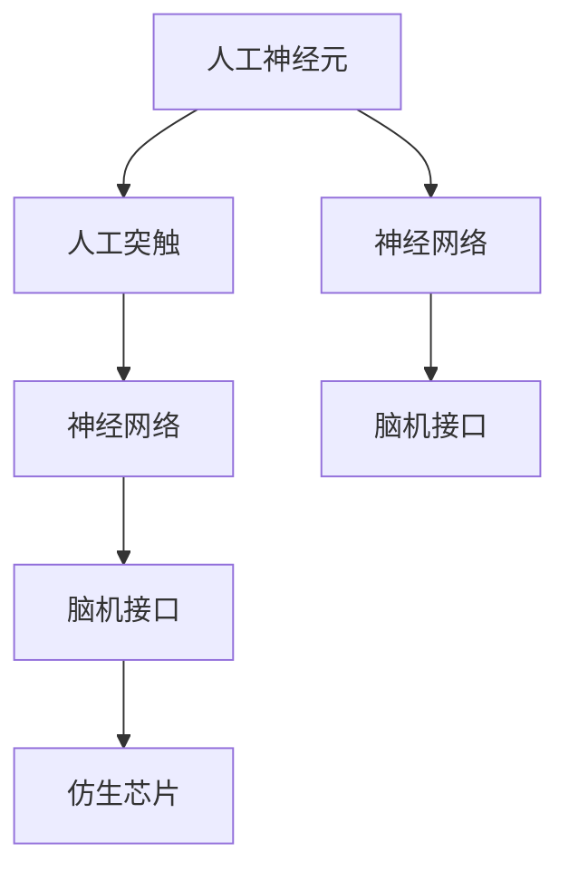

                 

# 神经形态计算:模仿大脑的新型AI硬件

> 关键词：神经形态计算、类脑计算、人工神经元、神经网络、脑机接口、仿生芯片

## 1. 背景介绍

### 1.1 问题由来
随着深度学习技术的迅猛发展，人工智能（AI）正逐渐成为驱动未来科技的重要引擎。然而，传统的基于冯诺依曼架构的AI系统面临着计算效率、功耗、能耗等诸多瓶颈问题。这些系统无法与人类大脑的自然高效性相媲美，且随着模型复杂度的提升，训练和推理成本急剧增加，致使大规模AI模型应用受限。

在此背景下，模仿人类大脑结构和功能的新型AI计算范式——神经形态计算（Neuromorphic Computing）应运而生。神经形态计算借鉴了人脑的结构和运作方式，致力于开发能够高效、低能耗地处理复杂信息的硬件平台。本文将详细探讨神经形态计算的原理、核心概念与架构，并结合实际案例，分析其在AI硬件设计中的应用，以期为未来AI芯片的创新发展提供参考。

## 2. 核心概念与联系

### 2.1 核心概念概述

神经形态计算旨在通过构建类脑结构，在硬件层面实现对神经网络模拟，从而达到更高效、更节能的AI处理能力。其核心概念包括：

- **人工神经元（Artificial Neuron）**：模仿大脑神经元的计算模型，接收输入、执行计算并传递输出，具备简单的记忆和可塑性。
- **人工突触（Artificial Synapse）**：模拟神经元间的连接方式，存储和传递信号，实现信息传递和模式识别。
- **神经网络（Neural Network）**：由多个人工神经元、人工突触组成的计算网络，具有复杂的非线性映射能力。
- **脑机接口（Brain-Computer Interface, BCI）**：用于连接人脑与计算机，实现信息直接交换的技术，可应用于康复、人机交互等领域。
- **仿生芯片（Bio-Inspired Chip）**：基于神经形态计算原理设计开发的人工智能芯片，具有模拟大脑处理信息的能力。

这些概念之间的逻辑关系可以通过以下Mermaid流程图展示：



这个流程图展示了几大概念之间的关系：

1. 人工神经元是构建神经网络的基础单元。
2. 人工突触实现神经元间的连接，是神经网络中的信息传递核心。
3. 神经网络通过人工神经元与人工突触构成，具备复杂的计算能力。
4. 脑机接口用于实现信息在人脑与计算机之间的交换，与神经网络紧密相关。
5. 仿生芯片则是神经形态计算在实际硬件中的实现，综合了上述概念的技术优势。

## 3. 核心算法原理 & 具体操作步骤
### 3.1 算法原理概述

神经形态计算的基本原理是模拟人脑的神经网络结构，通过类脑硬件实现神经网络中的计算、存储、通信等功能。其关键在于设计人工神经元、人工突触和神经网络模型，使其能够高效、准确地处理输入信号。

神经形态计算的核心算法包括以下几个步骤：

1. **模型构建**：建立人工神经元、人工突触和神经网络的数学模型，进行符号化的描述和计算。
2. **仿真实现**：通过软件工具模拟神经网络的计算过程，进行信号传递、权重更新等仿真操作。
3. **硬件映射**：将神经网络模型映射到特定的芯片设计中，实现硬件化实现。
4. **优化与训练**：在硬件上运行神经网络，通过特定算法进行优化和训练，提升其处理能力。

### 3.2 算法步骤详解

下面详细介绍神经形态计算的核心算法步骤：

**Step 1: 神经元与突触设计**

人工神经元和人工突触是神经形态计算的基础组件。神经元设计模拟人类大脑神经元的计算方式，如电位变化、激活函数等。人工突触设计模仿神经元间的突触传递，如突触权重、传递函数等。

**Step 2: 神经网络建模**

通过人工神经元、人工突触的连接构成神经网络。常用的神经网络模型包括卷积神经网络（CNN）、循环神经网络（RNN）、深度信念网络（DBN）等。

**Step 3: 硬件映射**

将神经网络模型映射到硬件芯片设计中，一般采用忆阻器（Memristor）、磁存储器（Magnetoresistive RAM, MRAM）等硬件技术实现突触权重存储和信号传递。

**Step 4: 优化与训练**

在硬件平台上运行神经网络，通过反向传播（Backpropagation）、随机梯度下降（SGD）等算法进行优化和训练。此外，还需要考虑功耗、延迟等硬件因素。

### 3.3 算法优缺点

神经形态计算的优势在于其高效、低功耗、高并行性，具有模仿人脑处理的潜力。然而，其缺点也显而易见：

**优点：**

1. **高效性**：神经形态计算可以同时进行大量计算，相比传统计算具有极高的并行效率。
2. **低功耗**：类脑芯片采用模拟生物电信号的计算方式，功耗较低。
3. **可塑性**：通过学习算法调整神经元、突触权重，适应不同任务需求。

**缺点：**

1. **设计复杂性高**：神经元、突触的设计和仿真需要复杂的数学模型和算法，设计难度较大。
2. **算法复杂度较高**：在硬件上实现反向传播等优化算法，需考虑硬件特性。
3. **生产成本高**：高精度的仿生芯片制造工艺复杂，成本较高。

### 3.4 算法应用领域

神经形态计算技术在游戏、机器人、医学、智能交通等多个领域得到了广泛应用：

- **游戏**：通过神经形态计算实现实时游戏渲染、路径规划、敌我识别等任务。
- **机器人**：利用类脑芯片加速机器人决策和动作控制，提升智能化水平。
- **医学**：用于神经网络训练和仿真，开发脑电图、脑磁图等医学影像处理工具。
- **智能交通**：在自动驾驶、交通流量预测等方面应用神经形态计算，提高交通系统的智能化和安全性。

## 4. 数学模型和公式 & 详细讲解

### 4.1 数学模型构建

神经形态计算的数学模型主要建立在神经元、突触和神经网络的基础上。下面以一个简单的神经网络为例，介绍其数学模型构建：

**神经元模型**：

- 输入：$x = [x_1, x_2, ..., x_n]$
- 激活函数：$f(x) = \sigma(x) = \frac{1}{1 + e^{-x}}$
- 输出：$y = f(W \cdot x + b)$

其中，$W$ 为权重矩阵，$b$ 为偏置向量，$\sigma$ 为激活函数。

**突触模型**：

- 权重：$w_{ij}$
- 传递函数：$f(x) = \frac{1}{1 + e^{-x}}$

**神经网络模型**：

- 输入层：$x = [x_1, x_2, ..., x_n]$
- 隐藏层：$h = f(W_1 \cdot x + b_1)$
- 输出层：$y = f(W_2 \cdot h + b_2)$

**反向传播算法**：

- 计算输出误差：$E = (y_{pred} - y_{true})^2$
- 计算误差对输出层的偏导数：$\frac{\partial E}{\partial y} = -2(y_{pred} - y_{true})$
- 计算误差对隐藏层的偏导数：$\frac{\partial E}{\partial h} = \frac{\partial E}{\partial y} \cdot \frac{\partial y}{\partial h}$

### 4.2 公式推导过程

神经形态计算的数学模型构建需要依据神经元、突触和神经网络的结构，推导出相关的计算公式。下面以反向传播算法为例，展示其推导过程：

**Step 1: 计算输出误差**

设神经网络的输出为 $y_{pred}$，真实输出为 $y_{true}$，则输出误差为：

$$E = \frac{1}{2}(y_{pred} - y_{true})^2$$

**Step 2: 计算误差对输出层的偏导数**

将输出误差对输出层的权重 $W_2$ 和偏置 $b_2$ 进行微分，得到：

$$\frac{\partial E}{\partial y} = \frac{\partial E}{\partial y_{pred}} \cdot \frac{\partial y_{pred}}{\partial h} \cdot \frac{\partial h}{\partial W_2} + \frac{\partial E}{\partial y_{pred}} \cdot \frac{\partial y_{pred}}{\partial b_2}$$

**Step 3: 计算误差对隐藏层的偏导数**

将输出误差对隐藏层的输出 $h$ 进行微分，得到：

$$\frac{\partial E}{\partial h} = \frac{\partial E}{\partial y} \cdot \frac{\partial y}{\partial h}$$

其中，$\frac{\partial y}{\partial h}$ 为激活函数的导数，即：

$$\frac{\partial y}{\partial h} = y(1 - y) \cdot \frac{\partial y_{pred}}{\partial h}$$

### 4.3 案例分析与讲解

以一个简单的图像分类任务为例，展示神经形态计算在实际应用中的数学模型构建和算法实现：

**任务描述**：给定一张图像，将其分类为“猫”或“狗”。

**输入**：图像像素值向量 $x$。

**神经网络结构**：

- 输入层：$n = 784$（28x28）
- 隐藏层：$h_1$，$h_2$
- 输出层：$y$，二分类

**神经元模型**：

- 激活函数：$f(x) = \sigma(x) = \frac{1}{1 + e^{-x}}$

**突触模型**：

- 权重矩阵：$W_1$, $W_2$
- 偏置向量：$b_1$, $b_2$

**反向传播算法**：

- 计算输出误差：$E = \frac{1}{2}(y_{pred} - y_{true})^2$
- 计算误差对输出层的偏导数：$\frac{\partial E}{\partial y} = -2(y_{pred} - y_{true})$
- 计算误差对隐藏层的偏导数：$\frac{\partial E}{\partial h} = \frac{\partial E}{\partial y} \cdot \frac{\partial y}{\partial h}$

## 5. 项目实践：代码实例和详细解释说明
### 5.1 开发环境搭建

神经形态计算的开发环境搭建需要考虑以下几个关键步骤：

1. **硬件平台选择**：选择具有神经形态计算能力的硬件平台，如IBM TrueNorth、Intel Loihi、Google TensorFlow-On-Chip等。
2. **开发工具选择**：选择合适的开发工具和编程语言，如C++、Python等。
3. **仿真工具选择**：选择适合的神经网络仿真工具，如Synaptic Compiler、NeuronCore等。

### 5.2 源代码详细实现

以IBM TrueNorth为例，展示神经形态计算在实际应用中的代码实现：

```python
import synaptic_compiler as sc

# 创建神经网络结构
network = sc.Network()
network.add_layer("input", n=784, type="Neuron")
network.add_layer("hidden1", n=128, type="Neuron")
network.add_layer("hidden2", n=128, type="Neuron")
network.add_layer("output", n=2, type="Neuron")

# 设置神经元、突触权重等参数
network.set_layer_weights("hidden1", W=sc.rand(nrows=128, ncols=784))
network.set_layer_weights("hidden2", W=sc.rand(nrows=128, ncols=128))
network.set_layer_weights("output", W=sc.rand(nrows=2, ncols=128))

# 设置激活函数
network.set_layer_activations("input", "logistic")
network.set_layer_activations("hidden1", "logistic")
network.set_layer_activations("hidden2", "logistic")
network.set_layer_activations("output", "logistic")

# 设置学习率等参数
network.set_learning_rate(0.1)
network.set_momentum(0.9)

# 训练神经网络
network.train(inputs=[...], outputs=[...], num_epochs=100, verbose=True)

# 测试神经网络
test_inputs = [...]
test_outputs = network.run(test_inputs)
```

### 5.3 代码解读与分析

神经形态计算的代码实现需要考虑以下几个关键步骤：

1. **创建神经网络结构**：定义神经元的数量、类型和连接方式。
2. **设置神经元、突触权重**：根据实际任务需求，设置神经元和突触的权重参数。
3. **设置激活函数**：选择适合的激活函数，如逻辑函数、Sigmoid函数等。
4. **设置学习率等参数**：调整学习率、动量等优化参数。
5. **训练和测试**：通过仿真工具进行训练和测试，获取模型输出。

## 6. 实际应用场景
### 6.1 游戏

神经形态计算在游戏领域有广泛的应用，如实时游戏渲染、路径规划、敌我识别等。通过类脑芯片的并行计算能力，游戏可以实现高效的实时处理，提升玩家的游戏体验。

**应用案例**：Nvidia的PlayStation VR系统，利用类脑芯片进行实时渲染，实现流畅的游戏体验。

### 6.2 机器人

神经形态计算在机器人领域可用于决策和动作控制，提升智能机器人的智能化水平。通过类脑芯片的高并行性和低功耗特性，机器人可以高效地处理大量传感器数据，实现复杂动作和路径规划。

**应用案例**：Boston Dynamics的Spot机器人，利用神经形态计算实现高精度的路径规划和避障功能。

### 6.3 医学

神经形态计算在医学领域可用于脑电图、脑磁图等医学影像的处理和分析，辅助医生进行诊断和治疗。

**应用案例**：Intel的Loihi芯片，用于医学影像分析，提高了脑部疾病的诊断准确性。

### 6.4 智能交通

神经形态计算在智能交通领域可用于自动驾驶、交通流量预测等任务，提升交通系统的智能化和安全性。

**应用案例**：Waymo的自动驾驶系统，利用神经形态计算实现实时环境感知和决策，提高了自动驾驶的安全性和准确性。

## 7. 工具和资源推荐
### 7.1 学习资源推荐

神经形态计算的快速发展得益于学界和产业界的共同努力。以下是几篇奠基性的相关论文，推荐阅读：

1. "Neuromorphic Engineering: State-of-the-Art and Future Directions"（IEEE TNN）
2. "Neuromorphic Circuits and Systems"（Springer）
3. "The Silicon Cell as a Computing Engine"（IEEE TNSP）
4. "Neuromorphic Computing: A Review"（IEEE TNSP）
5. "Neuromorphic Systems Design"（Springer）

通过阅读这些论文，可以深入理解神经形态计算的理论基础和前沿研究，把握学科的发展方向。

### 7.2 开发工具推荐

神经形态计算的开发工具众多，以下是几款常用的开发工具：

1. Synaptic Compiler：IBM提供的神经形态计算仿真工具，支持多种神经网络模型的仿真和优化。
2. NeuronCore：OpenXino提供的神经网络仿真工具，支持多种硬件平台的仿真。
3. TensorFlow-On-Chip：Google开发的针对类脑芯片的TensorFlow版本，支持高效的神经网络计算。

### 7.3 相关论文推荐

神经形态计算的研究涉及多个领域，以下是一些值得关注的论文：

1. "A Survey on Recurrent Neural Networks and Learning Platforms for Neuromorphic Engineering"（IEEE TNSP）
2. "Emerging Technologies for Neuromorphic Computing"（IEEE TNSP）
3. "Review of Memristor-Based Computing Architectures"（IEEE TNSP）
4. "Hybrid Systems for Real-Time Event Detection and Decision Making"（IEEE TNSP）
5. "Simulated Annealing for Dynamic Behavior of the Small-World Networks"（IEEE TNSP）

## 8. 总结：未来发展趋势与挑战
### 8.1 研究成果总结

神经形态计算作为模仿人类大脑的新型AI硬件，具有高效、低功耗、高并行性等显著优势，展现出广阔的应用前景。其核心算法和设计方法已经逐步成熟，但实际应用仍面临诸多挑战。

### 8.2 未来发展趋势

神经形态计算的未来发展趋势主要包括以下几个方面：

1. **硬件技术的进步**：神经形态计算硬件的制造工艺将不断提升，芯片的计算速度、功耗、并行性将进一步提高。
2. **神经网络模型的优化**：基于硬件特点，开发更加高效的神经网络模型和算法，提升计算效率和精度。
3. **跨学科融合**：神经形态计算与其他学科，如神经科学、计算神经科学、认知科学等的交叉融合，将推动人工智能技术的全面进步。
4. **标准化的制定**：神经形态计算技术的标准化和开放性将提升其通用性和应用范围。

### 8.3 面临的挑战

尽管神经形态计算技术具有巨大潜力，但在实际应用中仍面临诸多挑战：

1. **硬件成本高**：高精度的仿生芯片制造工艺复杂，成本较高。
2. **算法复杂性高**：在硬件上实现复杂的优化算法，需考虑硬件特性。
3. **跨学科难度大**：神经形态计算需要多个学科的知识和技能，跨学科的合作和研究难度较大。
4. **实际应用场景少**：尽管具有潜力，但实际应用场景仍较少，需进一步拓展。

### 8.4 研究展望

未来，神经形态计算技术需要在以下几个方面寻求新的突破：

1. **硬件优化**：进一步提升芯片的计算速度和能效比，降低制造和部署成本。
2. **算法优化**：结合硬件特性，开发高效的神经网络算法和优化方法。
3. **跨学科融合**：加强与其他学科的合作，推动神经形态计算技术的全面发展。
4. **实际应用拓展**：探索更多应用场景，提升技术的实用性和普及性。

## 9. 附录：常见问题与解答

**Q1：什么是神经形态计算？**

A: 神经形态计算是一种模仿人类大脑结构和功能的计算范式，通过构建类脑硬件实现神经网络的计算和存储。

**Q2：神经形态计算的优势和劣势是什么？**

A: 神经形态计算的优势在于高效性、低功耗和并行性，具有模仿人脑处理的潜力。劣势在于设计复杂性高、算法复杂度高、生产成本高等。

**Q3：神经形态计算的应用场景有哪些？**

A: 神经形态计算在游戏、机器人、医学、智能交通等多个领域得到了广泛应用。

**Q4：如何提升神经形态计算的实际应用效果？**

A: 提升神经形态计算的实际应用效果，需从硬件、算法和跨学科合作等方面进行综合优化。

**Q5：神经形态计算的未来发展方向是什么？**

A: 神经形态计算的未来发展方向包括硬件技术的进步、神经网络模型的优化、跨学科融合和标准化制定等。

---

作者：禅与计算机程序设计艺术 / Zen and the Art of Computer Programming

