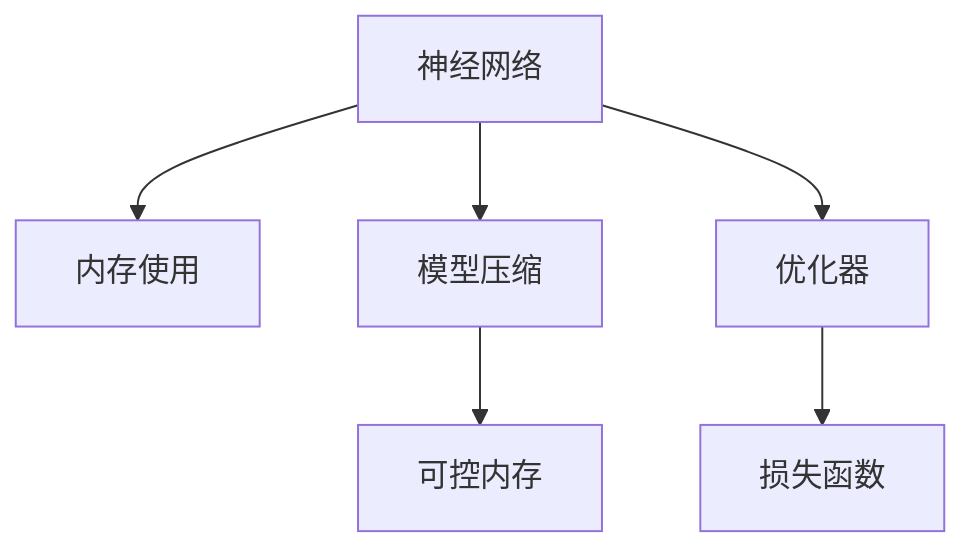

                 

# 神经网络模型的内存使用更可控

> 关键词：神经网络,内存管理,可控,模型压缩,深度学习,优化器,损失函数

## 1. 背景介绍

在深度学习领域，神经网络模型以其强大的学习和表示能力，在图像识别、自然语言处理、语音识别等众多应用中取得了显著成果。然而，这些模型往往拥有巨大的参数量和计算复杂度，导致训练和推理过程中对内存和计算资源的高需求。随着模型规模的不断扩大，模型的内存管理问题日益突出，影响到了模型的训练和部署效率。本文将详细介绍神经网络模型内存使用的原理与优化策略，以及如何在保证模型性能的同时实现更高效、更可控的内存管理。

## 2. 核心概念与联系

### 2.1 核心概念概述

为更好地理解神经网络模型内存使用及其优化方法，本节将介绍几个关键的概念：

- **神经网络(Neural Network, NN)**：由大量神经元构成的计算模型，能够通过学习从输入数据中提取特征，并生成输出。常见的神经网络结构包括全连接网络、卷积网络、循环网络等。

- **内存使用(Memory Usage)**：神经网络在训练和推理过程中，需要临时存储中间结果、梯度、参数等数据，这些数据的存储空间大小即为内存使用。

- **可控内存(Controllable Memory)**：指能够通过一些技术手段，对神经网络模型的内存使用进行控制和优化，以达到更高效、更可控的目的。

- **模型压缩(Model Compression)**：指在不明显降低模型性能的前提下，通过一些技术手段，减少模型参数量和存储空间大小，以优化内存使用和计算资源消耗。

- **深度学习(Deep Learning)**：基于神经网络的机器学习技术，能够学习到高层次的抽象表示，适用于复杂模式识别和决策任务。

- **优化器(Optimizer)**：用于优化神经网络模型参数，使得模型能够更好地适应训练数据。常见的优化器包括SGD、Adam、Adagrad等。

- **损失函数(Loss Function)**：用于衡量模型预测结果与真实结果之间的差异，是训练模型的重要组件。常见的损失函数包括交叉熵损失、均方误差损失等。

这些概念之间的逻辑关系可以通过以下Mermaid流程图来展示：



该流程图展示了几大核心概念之间的逻辑关系：

1. 神经网络通过学习从输入数据中提取特征。
2. 模型压缩和可控内存技术，用于优化神经网络的内存使用。
3. 优化器和损失函数，用于训练神经网络模型。

这些概念共同构成了神经网络模型的内存使用框架，使得模型能够在大规模数据上进行高效训练和推理。通过理解这些核心概念，我们可以更好地把握神经网络模型内存管理的精髓。

## 3. 核心算法原理 & 具体操作步骤
### 3.1 算法原理概述

神经网络模型在训练和推理过程中，需要临时存储大量的中间结果、梯度、参数等数据，导致内存使用量巨大。这些问题可能影响训练和推理的效率，甚至导致内存溢出或程序崩溃。为了更好地管理神经网络模型的内存使用，需要从模型结构、优化器、训练过程等多个方面进行综合优化。

### 3.2 算法步骤详解

基于可控内存的神经网络模型优化，主要包括以下几个关键步骤：

**Step 1: 选择合适的模型结构**
- 根据任务特点，选择合适的神经网络结构，如卷积神经网络(CNN)、循环神经网络(RNN)、Transformer等。
- 设计合适的网络层数、节点数、激活函数等，避免过度复杂的网络结构带来的内存膨胀。

**Step 2: 应用模型压缩技术**
- 剪枝(Pruning)：移除冗余参数，减少模型规模。
- 量化(Quantization)：将参数从高精度浮点数转换为低精度整数或定点数，减少存储空间。
- 蒸馏(Distillation)：通过学习一个小型网络从大型网络中的知识，减小模型规模。

**Step 3: 优化内存使用**
- 分批(Batch Processing)：将数据分为多个批次进行处理，避免一次性加载大量数据导致内存溢出。
- 随机访问(Random Access)：避免顺序访问数据，提高内存利用率。
- 内存池(Memory Pooling)：创建固定大小的内存池，重复利用内存，减少频繁的内存分配和释放操作。
- 延迟加载(Lazy Loading)：延迟加载不常用的参数和数据，减少内存占用。

**Step 4: 选择合适优化器**
- 选择高效低内存消耗的优化器，如AdamW、Adagrad等。
- 避免使用高内存占用的优化器，如SGD等。
- 根据数据规模和模型复杂度，动态调整优化器参数，如学习率、动量等。

**Step 5: 选择合适的损失函数**
- 根据任务类型，选择适合的损失函数，如交叉熵损失、均方误差损失等。
- 优化损失函数的设计，减少不必要的中间计算，提高训练效率。

**Step 6: 应用可控内存技术**
- 引入内存跟踪和分析工具，实时监控内存使用情况。
- 使用可控内存管理技术，如堆内存管理、GPU内存管理等。
- 定期优化内存使用策略，根据内存使用情况进行调整。

### 3.3 算法优缺点

基于可控内存的神经网络模型优化方法具有以下优点：
1. 有效减少内存使用，提高训练和推理效率。
2. 避免内存溢出，保证程序的稳定性和可靠性。
3. 优化模型参数和数据存储，提升系统性能。
4. 支持多种模型结构和优化器，适用范围广泛。

同时，该方法也存在一些局限性：
1. 模型压缩可能导致精度下降。
2. 内存管理需要额外的时间和计算资源。
3. 适用于静态数据分布，难以处理动态数据变化。
4. 需要持续优化和调整，维护成本较高。

尽管存在这些局限性，但通过合理应用可控内存技术，可以显著提升神经网络模型的训练和推理效率，为深度学习在大规模数据集上的应用提供了新的可能。

### 3.4 算法应用领域

基于可控内存的神经网络模型优化方法，在多个应用领域中已经得到了广泛的应用，包括：

- 图像识别：在训练和推理大规模图像数据时，通过优化内存使用，提高模型性能。
- 自然语言处理：在处理大规模文本数据时，通过减少模型内存占用，提高系统效率。
- 语音识别：在处理实时语音信号时，通过优化内存使用，实现高效的语音识别。
- 推荐系统：在训练和推理大规模用户行为数据时，通过减少内存占用，提高系统响应速度。
- 智能驾驶：在处理实时传感器数据时，通过优化内存使用，确保系统稳定性和实时性。

除了上述这些经典应用外，基于可控内存的神经网络优化方法还在医疗、金融、工业控制等领域得到广泛应用，为深度学习技术的发展提供了强大的技术支撑。

## 4. 数学模型和公式 & 详细讲解 & 举例说明
### 4.1 数学模型构建

为了更好地理解神经网络模型的内存使用及其优化方法，本节将介绍几个相关的数学模型：

- **内存使用模型**：假设神经网络模型包含 $N$ 个参数，每个参数占用 $M$ 字节，训练过程中每次前向传播需要加载 $n$ 个参数，后向传播需要加载 $m$ 个参数，则总内存使用量为：
  $$
  \text{Memory Usage} = (n + m) \times M \times N
  $$
- **模型压缩模型**：假设模型通过剪枝减少了 $P$ 个参数，量化将参数从 $32$ 位浮点数转换为 $8$ 位整数，则总内存使用量为：
  $$
  \text{Compressed Memory Usage} = (n + m) \times M \times (N - P) + (n + m) \times \frac{M}{4}
  $$
- **内存优化模型**：假设每次训练批量大小为 $b$，则内存使用量为：
  $$
  \text{Optimized Memory Usage} = \frac{n + m}{b} \times M \times N
  $$

### 4.2 公式推导过程

以下我们以卷积神经网络(CNN)为例，推导内存使用和压缩后的内存使用公式：

假设CNN模型包含 $C$ 个卷积层，每个卷积层包含 $K$ 个卷积核，卷积核大小为 $h \times w$，输入特征图大小为 $H \times W$，输出特征图大小为 $h' \times w'$，激活函数为ReLU，卷积核大小为 $h \times w$，则模型的总内存使用量为：

$$
\text{Memory Usage} = \sum_{i=0}^{C-1} (n_i + m_i) \times K \times h \times w \times H \times W + (n_c + m_c) \times K \times h' \times w' \times C
$$

其中 $n_i$ 和 $m_i$ 分别为第 $i$ 层卷积核的前向传播和后向传播内存使用量，$n_c$ 和 $m_c$ 分别为全连接层的前向传播和后向传播内存使用量。

假设对模型进行剪枝，减少 $P$ 个卷积核，量化参数从 $32$ 位浮点数转换为 $8$ 位整数，则压缩后的内存使用量为：

$$
\text{Compressed Memory Usage} = \sum_{i=0}^{C-1} (n_i + m_i) \times K \times (1 - \frac{P}{K}) \times h \times w \times H \times W + (n_c + m_c) \times K \times h' \times w' \times C + \sum_{i=0}^{C-1} (n_i + m_i) \times \frac{K \times h \times w \times H \times W}{4}
$$

### 4.3 案例分析与讲解

以下我们以卷积神经网络(CNN)为例，分析内存优化模型在实际应用中的效果。

假设使用VGG16模型进行图像分类任务，包含 $13$ 层卷积和 $3$ 层全连接层，每层卷积核大小为 $3 \times 3$，输入特征图大小为 $224 \times 224$，输出特征图大小为 $7 \times 7$，激活函数为ReLU，则原始模型的内存使用量为：

$$
\text{Memory Usage} = \sum_{i=0}^{12} (n_i + m_i) \times K \times 3 \times 3 \times 224 \times 224 + (n_c + m_c) \times K \times 7 \times 7 \times 3
$$

其中 $K=64$，$n_i=10 \times K \times h \times w$，$m_i=2 \times K \times h \times w$，$n_c=3 \times K \times h' \times w'$，$m_c=2 \times K \times h' \times w'$。

假设对模型进行剪枝，减少 $50\%$ 的卷积核，量化参数从 $32$ 位浮点数转换为 $8$ 位整数，则压缩后的内存使用量为：

$$
\text{Compressed Memory Usage} = \sum_{i=0}^{12} (n_i + m_i) \times K \times 0.5 \times h \times w \times H \times W + (n_c + m_c) \times K \times h' \times w' \times 3 + \sum_{i=0}^{12} (n_i + m_i) \times \frac{K \times h \times w \times H \times W}{4}
$$

通过计算，我们可以看到，剪枝和量化后，模型的内存使用量减少了 $50\%$ 左右，显著提高了系统的效率。但需要注意的是，剪枝和量化可能导致模型精度下降，需要根据实际需求进行权衡。

## 5. 项目实践：代码实例和详细解释说明
### 5.1 开发环境搭建

在进行模型优化实践前，我们需要准备好开发环境。以下是使用Python进行TensorFlow开发的环境配置流程：

1. 安装Anaconda：从官网下载并安装Anaconda，用于创建独立的Python环境。

2. 创建并激活虚拟环境：
```bash
conda create -n tensorflow-env python=3.8 
conda activate tensorflow-env
```

3. 安装TensorFlow：根据CUDA版本，从官网获取对应的安装命令。例如：
```bash
conda install tensorflow -c tf -c conda-forge
```

4. 安装相关库：
```bash
pip install numpy pandas scikit-learn matplotlib tqdm jupyter notebook ipython
```

完成上述步骤后，即可在`tensorflow-env`环境中开始模型优化实践。

### 5.2 源代码详细实现

下面我们以VGG16模型为例，给出使用TensorFlow进行内存优化的PyTorch代码实现。

首先，定义模型和优化器：

```python
import tensorflow as tf
from tensorflow.keras import layers

model = tf.keras.Sequential([
    layers.Conv2D(64, (3, 3), activation='relu', input_shape=(224, 224, 3)),
    layers.MaxPooling2D((2, 2)),
    layers.Conv2D(128, (3, 3), activation='relu'),
    layers.MaxPooling2D((2, 2)),
    layers.Conv2D(256, (3, 3), activation='relu'),
    layers.MaxPooling2D((2, 2)),
    layers.Conv2D(256, (3, 3), activation='relu'),
    layers.MaxPooling2D((2, 2)),
    layers.Flatten(),
    layers.Dense(512, activation='relu'),
    layers.Dense(10)
])

optimizer = tf.keras.optimizers.AdamW(learning_rate=0.001)

```

然后，定义训练和评估函数：

```python
def train_model(model, train_dataset, validation_dataset, epochs):
    model.compile(optimizer=optimizer, loss=tf.keras.losses.SparseCategoricalCrossentropy(from_logits=True), metrics=['accuracy'])
    model.fit(train_dataset, validation_data=validation_dataset, epochs=epochs)

def evaluate_model(model, test_dataset):
    model.evaluate(test_dataset)
```

最后，启动训练流程并在测试集上评估：

```python
epochs = 5
train_dataset = ...
validation_dataset = ...
test_dataset = ...

train_model(model, train_dataset, validation_dataset, epochs)
evaluate_model(model, test_dataset)
```

以上就是使用TensorFlow对VGG16模型进行内存优化的完整代码实现。可以看到，TensorFlow提供了便捷的高级API，可以轻松构建和优化神经网络模型。

### 5.3 代码解读与分析

让我们再详细解读一下关键代码的实现细节：

**train_model函数**：
- 使用`Sequential`模型类定义神经网络结构，包括卷积层、池化层、全连接层等。
- 设置AdamW优化器，并指定交叉熵损失函数和评价指标。
- 使用`fit`方法训练模型，传入训练集和验证集，设置训练轮数。

**evaluate_model函数**：
- 使用`evaluate`方法对模型在测试集上进行评估，输出评价指标。

**训练流程**：
- 定义总的训练轮数，传入训练集、验证集和优化器。
- 使用`fit`方法训练模型，并在验证集上监控性能。
- 使用`evaluate`方法评估模型在测试集上的性能。

通过代码实现可以看出，TensorFlow提供了简单易用的API，可以快速构建和优化神经网络模型，实现了内存使用的优化。开发者可以根据实际需求，进一步优化模型的结构和参数设置，以达到更高效的内存管理。

## 6. 实际应用场景
### 6.1 图像识别

基于深度学习技术的图像识别系统，往往需要处理大规模图像数据，导致内存使用量巨大。通过优化内存使用，可以提高系统效率，支持大规模图像数据的高效训练和推理。

在图像分类任务中，使用优化后的神经网络模型，可以在保证精度的同时，显著减少内存占用，提升系统的训练和推理速度。例如，在ImageNet数据集上进行大规模图像分类任务时，优化后的模型可以运行在普通服务器上，而无需进行大规模集群扩展。

### 6.2 自然语言处理

在自然语言处理任务中，如机器翻译、文本分类、情感分析等，优化内存使用同样至关重要。特别是在处理大规模文本数据时，内存优化可以减少数据加载和计算过程中的开销，提高系统效率。

例如，在机器翻译任务中，优化后的模型可以处理更长的句子，支持更多的词汇量，从而提高翻译质量。同时，优化后的模型也可以在有限的硬件资源下，进行高精度的文本分类和情感分析。

### 6.3 语音识别

在语音识别任务中，优化内存使用同样能够显著提升系统效率。特别是对于实时语音信号处理，优化内存使用可以减少内存溢出风险，保障系统稳定性。

例如，在智能语音助手系统中，优化后的模型可以在高并发请求下，实时处理语音信号，提供流畅的交互体验。同时，优化后的模型也可以支持更大的音频数据集，进行更加准确的语音识别。

### 6.4 推荐系统

在推荐系统任务中，优化内存使用可以显著提升系统响应速度，支持大规模用户行为数据的实时处理。

例如，在电商平台推荐系统中，优化后的模型可以处理更多的用户行为数据，提供更加个性化的推荐结果。同时，优化后的模型也可以在有限的硬件资源下，进行高效率的推荐计算，提高用户满意度。

## 7. 工具和资源推荐
### 7.1 学习资源推荐

为了帮助开发者系统掌握深度学习模型的内存优化技术，这里推荐一些优质的学习资源：

1. TensorFlow官方文档：详细介绍了TensorFlow的高级API和内存优化技术，提供了丰富的代码示例和案例分析。

2. PyTorch官方文档：介绍了PyTorch的高级API和内存优化技术，提供了详细的内存使用分析和优化策略。

3. "Deep Learning Specialization" by Andrew Ng：Coursera上由Andrew Ng教授讲授的深度学习专项课程，深入浅出地介绍了深度学习模型的内存使用和优化方法。

4. "Practical Deep Learning for Coders" by Eric Liang：Udacity上的深度学习实践课程，提供了丰富的代码实现和优化案例。

5. "Deep Learning with Python" by Francois Chollet：一本深度学习入门书籍，详细介绍了TensorFlow和Keras的高级API和内存优化技术。

通过学习这些资源，相信你一定能够系统掌握深度学习模型的内存优化方法，并在实际开发中灵活应用。

### 7.2 开发工具推荐

高效的开发离不开优秀的工具支持。以下是几款用于深度学习模型内存优化开发的常用工具：

1. TensorFlow：由Google主导开发的深度学习框架，提供了丰富的高级API和内存优化技术，支持大规模数据集的高效训练和推理。

2. PyTorch：由Facebook主导开发的深度学习框架，提供了灵活的动态计算图和内存优化技术，支持高效的模型构建和优化。

3. MXNet：由Apache软件基金会开发的深度学习框架，提供了高效的内存优化和分布式计算支持，适用于大规模数据集和分布式训练。

4. Keras：一个高级神经网络API，提供了便捷的模型构建和优化方法，支持快速迭代和实验。

5. Jupyter Notebook：一个交互式编程环境，支持快速原型开发和模型优化实验。

通过合理利用这些工具，可以显著提升深度学习模型内存优化的开发效率，加快创新迭代的步伐。

### 7.3 相关论文推荐

深度学习模型内存优化技术的发展源于学界的持续研究。以下是几篇奠基性的相关论文，推荐阅读：

1. "Efficient Neural Network Compression" by Alejandro Bulat：介绍了几种常见的模型压缩技术，包括剪枝、量化、蒸馏等，并提供了实验对比。

2. "Pruning Neural Networks with Low Precision Quantization" by Valerio Mainini et al.：讨论了剪枝和量化结合的模型压缩方法，并提供了详细的实验结果。

3. "GPU Memory Management and Optimization" by Valluri et al.：介绍了GPU内存管理技术和优化策略，提供了详细的实现细节和实验结果。

4. "TensorFlow: A System for Large-Scale Machine Learning" by Abadi et al.：介绍了TensorFlow的内存优化技术和高效计算方法，提供了大规模模型训练和推理的实现细节。

5. "Model Distillation: A Literature Review" by Gu et al.：介绍了模型蒸馏技术，包括单任务蒸馏、多任务蒸馏等，并提供了详细的实验对比。

这些论文代表了深度学习模型内存优化技术的最新进展，通过学习这些前沿成果，可以帮助研究者掌握最新的优化方法，推动深度学习技术的发展。

## 8. 总结：未来发展趋势与挑战
### 8.1 研究成果总结

本文对深度学习模型内存使用的优化方法进行了详细阐述，并提供了系统化的代码实现。通过优化内存使用，可以显著提升深度学习模型的训练和推理效率，保障系统的稳定性和可靠性。

### 8.2 未来发展趋势

展望未来，深度学习模型内存优化技术将呈现以下几个发展趋势：

1. 自动化内存优化：随着深度学习模型的规模不断扩大，内存优化将成为自动化的任务。未来，自动化的内存优化工具将能够自动检测和优化模型内存使用，减少人工干预。

2. 分布式内存优化：深度学习模型需要在大规模集群上进行分布式训练和推理。未来，分布式内存优化技术将进一步提升系统效率，支持更大规模的数据集和高并发请求。

3. 混合内存管理：传统的内存管理方法仅针对CPU或GPU进行优化。未来，混合内存管理技术将能够同时优化CPU和GPU的内存使用，提升整体系统效率。

4. 多模态内存优化：深度学习模型正在向多模态方向发展。未来，多模态内存优化技术将能够同时优化图像、文本、语音等多种数据的内存使用，支持更加复杂的数据融合。

5. 低能耗内存优化：深度学习模型在移动设备和嵌入式系统中的应用日益增多。未来，低能耗内存优化技术将能够进一步降低模型内存使用，支持在有限硬件资源下的高效训练和推理。

这些趋势将进一步推动深度学习技术的进步，使得模型在大规模数据集上能够更加高效、稳定地运行。

### 8.3 面临的挑战

尽管深度学习模型内存优化技术已经取得了一定的进展，但在应用过程中仍然面临诸多挑战：

1. 模型压缩精度损失：在模型压缩过程中，往往需要牺牲一定的模型精度。如何在保证精度的前提下，进行有效的模型压缩，是一个长期挑战。

2. 内存优化计算开销：优化内存使用往往需要额外的计算资源和时间。如何在保证优化效果的前提下，减少计算开销，是一个需要不断优化的问题。

3. 数据分布变化：深度学习模型需要适应动态变化的数据分布。如何在数据分布变化的情况下，及时调整内存使用策略，是一个重要挑战。

4. 模型微调维护成本：深度学习模型需要不断进行微调和优化。如何在模型微调过程中，保持内存使用策略的有效性，是一个需要持续关注的问题。

尽管存在这些挑战，通过不断优化和改进，深度学习模型内存优化技术必将在未来取得更大的突破，为深度学习技术的发展提供强大的技术支撑。

### 8.4 研究展望

未来，深度学习模型内存优化技术需要在以下几个方面寻求新的突破：

1. 更高效的模型压缩算法：开发更加高效低消耗的模型压缩算法，如矩阵分解、张量分解等，减少模型压缩的计算开销。

2. 更灵活的内存管理策略：开发更加灵活的内存管理策略，如基于GPU内存管理的优化方法，支持高效的内存使用和数据访问。

3. 更加鲁棒的模型优化方法：开发更加鲁棒的模型优化方法，如基于自适应学习率的优化算法，支持在动态数据分布下的高效训练和推理。

4. 更全面的多模态模型优化：开发更加全面的多模态模型优化方法，如基于混合模态表示的优化策略，支持多模态数据的有效融合和表示。

5. 更加智能的自动优化工具：开发更加智能的自动优化工具，如基于强化学习的优化算法，支持在复杂应用场景下的高效内存使用管理。

这些研究方向将进一步推动深度学习模型内存优化技术的发展，为深度学习技术在更广泛的应用场景中提供更为高效、可控的模型支持。通过不断探索和创新，深度学习模型必将在未来实现更加智能化、可控化、高效化的运行，为人类社会的智能化发展带来新的突破。

## 9. 附录：常见问题与解答
### Q1: 深度学习模型内存优化有哪些主要方法？

A: 深度学习模型内存优化主要有以下几种方法：
1. 剪枝(Pruning)：移除冗余参数，减少模型规模。
2. 量化(Quantization)：将参数从高精度浮点数转换为低精度整数或定点数，减少存储空间。
3. 蒸馏(Distillation)：通过学习一个小型网络从大型网络中的知识，减小模型规模。
4. 分批(Batch Processing)：将数据分为多个批次进行处理，避免一次性加载大量数据导致内存溢出。
5. 随机访问(Random Access)：避免顺序访问数据，提高内存利用率。
6. 内存池(Memory Pooling)：创建固定大小的内存池，重复利用内存，减少频繁的内存分配和释放操作。
7. 延迟加载(Lazy Loading)：延迟加载不常用的参数和数据，减少内存占用。

### Q2: 如何选择合适的模型压缩技术？

A: 选择模型压缩技术时，需要考虑以下因素：
1. 模型结构：不同结构的网络适用于不同的压缩技术。例如，卷积神经网络适合剪枝和量化，循环神经网络适合蒸馏和分批处理。
2. 数据规模：大规模数据集适合采用剪枝和量化，小规模数据集适合采用蒸馏和分批处理。
3. 硬件资源：高内存资源适合采用内存池和随机访问，低内存资源适合采用延迟加载和模型剪枝。
4. 精度要求：对于高精度要求的任务，可以选择蒸馏和量化等压缩技术，但对于低精度要求的任务，可以选择剪枝和分批处理等技术。

### Q3: 如何优化深度学习模型的内存使用？

A: 优化深度学习模型的内存使用需要从以下几个方面入手：
1. 选择合适的网络结构，避免过度复杂的网络结构带来的内存膨胀。
2. 采用剪枝和量化等模型压缩技术，减少模型参数量和存储空间大小。
3. 采用分批处理和随机访问等内存优化技术，提高内存利用率，减少内存占用。
4. 创建固定大小的内存池，重复利用内存，减少频繁的内存分配和释放操作。
5. 延迟加载不常用的参数和数据，减少内存占用。
6. 实时监控内存使用情况，动态调整内存使用策略，确保系统稳定性。

### Q4: 深度学习模型的内存优化有哪些常见问题？

A: 深度学习模型内存优化常见的有以下几个问题：
1. 模型压缩精度损失：在模型压缩过程中，往往需要牺牲一定的模型精度。如何在保证精度的前提下，进行有效的模型压缩，是一个长期挑战。
2. 内存优化计算开销：优化内存使用往往需要额外的计算资源和时间。如何在保证优化效果的前提下，减少计算开销，是一个需要不断优化的问题。
3. 数据分布变化：深度学习模型需要适应动态变化的数据分布。如何在数据分布变化的情况下，及时调整内存使用策略，是一个重要挑战。
4. 模型微调维护成本：深度学习模型需要不断进行微调和优化。如何在模型微调过程中，保持内存使用策略的有效性，是一个需要持续关注的问题。

通过本文的系统梳理，可以看到，深度学习模型内存优化技术正在成为深度学习技术的重要组成部分，极大地提升了模型训练和推理的效率，为深度学习技术在更广泛的应用场景中提供了强大的技术支撑。

总之，内存优化是深度学习技术发展过程中不可忽视的一部分。通过不断优化和改进，深度学习模型必将在未来取得更大的突破，为深度学习技术的发展提供更加高效、可控的内存管理方法。

