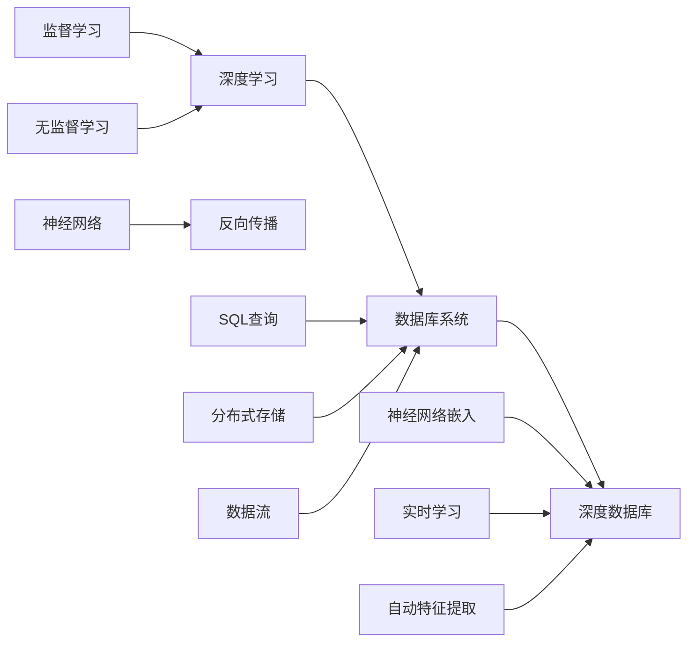

                 

## 1. 背景介绍

### 1.1 问题由来

传统的SQL数据库在过去几十年中一直是数据存储和查询的主流解决方案，它们依赖于精心设计的模式和复杂的SQL查询语言。然而，随着大数据时代的到来，这种基于模式的结构化数据库逐渐暴露出其局限性。如今，非结构化数据（如文本、图像、音频等）占据了数据存储的很大比例，这些数据类型不适宜使用传统的结构化模式进行建模。此外，实时数据分析和机器学习模型的引入，也对传统数据库系统提出了新的挑战。

为了应对这些挑战，越来越多的企业开始探索将机器学习与数据库系统深度融合，以提升数据处理能力、增强数据分析的实时性和准确性。这一变革催生了“深度数据库”（Deep Databases）这一概念，即通过将神经网络集成到数据库中，实现数据存储、查询和分析的全面智能化。

### 1.2 问题核心关键点

深度数据库融合了传统的SQL数据库和新兴的深度学习技术，使得数据库系统能够更高效地处理和分析复杂的数据。该技术架构的核心思想包括：

1. **数据分布式存储和处理**：将数据分布式存储在多个节点上，并通过并行计算加速查询和分析过程。
2. **神经网络嵌入**：将神经网络嵌入到数据库查询语言中，使得查询过程能够利用神经网络的自动特征提取和分类能力。
3. **实时学习与优化**：利用在线学习算法，数据库能够实时更新模型参数，保持模型的准确性和时效性。
4. **端到端自动化**：从数据存储、特征提取到模型训练和查询优化，实现自动化和一体化的数据处理流程。

这一架构不仅提高了数据处理效率，还为数据科学家和企业提供了新的工具和方法，以便进行更深入的数据挖掘和预测分析。

## 2. 核心概念与联系

### 2.1 核心概念概述

在介绍深度数据库的核心概念之前，我们先回顾一下机器学习和数据库系统的基础知识。

- **机器学习（Machine Learning, ML）**：通过算法和模型让计算机从数据中学习和预测，涵盖监督学习、无监督学习和强化学习等多种范式。
- **深度学习（Deep Learning, DL）**：机器学习的一种特殊形式，使用多层次的神经网络模型处理复杂的数据。
- **数据库系统（Database System）**：用于管理和访问数据的系统，包括关系型数据库、NoSQL数据库和深度数据库等不同类型。

### 2.2 核心概念原理和架构的 Mermaid 流程图



该图展示了深度学习与数据库系统的联系，以及深度数据库融合二者后的新架构。

- **深度学习（A）**：包含多种机器学习模型，神经网络是其中一种特殊形式。
- **神经网络（B）**：由多个层次组成的模型，通过反向传播（C）进行训练，支持监督学习（D）和无监督学习（E）。
- **数据库系统（F）**：存储和访问数据，包括传统的关系型数据库和新兴的深度数据库（J）。
- **深度数据库（J）**：结合神经网络（K）、实时学习（L）和自动特征提取（M），实现数据存储、查询和分析的全方位智能化。

## 3. 核心算法原理 & 具体操作步骤

### 3.1 算法原理概述

深度数据库的核心算法原理可以归纳为以下几个步骤：

1. **数据预处理与特征提取**：将原始数据转换为神经网络可以处理的格式，并自动提取特征。
2. **模型训练与嵌入**：使用监督学习或无监督学习训练神经网络模型，并将其嵌入到数据库查询语言中。
3. **实时学习与优化**：通过在线学习算法，实时更新模型参数，保持模型的准确性和时效性。
4. **自动查询优化**：将神经网络嵌入到SQL查询语言中，自动优化查询过程，提升查询效率。

### 3.2 算法步骤详解

以下是深度数据库实现的详细步骤：

#### 3.2.1 数据预处理与特征提取

1. **数据标准化**：将数据转换为标准的数值或向量格式，如将文本数据转换为词向量。
2. **特征提取**：利用神经网络自动提取特征，例如使用卷积神经网络（CNN）提取图像特征，使用循环神经网络（RNN）提取时间序列特征。
3. **数据增强**：通过数据扩充和增强技术，提高模型的泛化能力，例如对图像数据进行随机裁剪、旋转和缩放。

#### 3.2.2 模型训练与嵌入

1. **模型选择与设计**：根据任务选择合适的神经网络模型，并设计网络结构。
2. **训练数据准备**：收集与任务相关的标注数据，准备训练集和验证集。
3. **模型训练**：使用监督学习或无监督学习算法训练神经网络模型，例如使用随机梯度下降（SGD）或Adam优化算法。
4. **模型嵌入**：将训练好的神经网络模型嵌入到数据库查询语言中，例如在SQL查询中使用神经网络作为函数。

#### 3.2.3 实时学习与优化

1. **在线学习算法**：使用在线学习算法（如AdaGrad、AdamW等）实时更新模型参数，适应新数据的变化。
2. **模型定期更新**：根据数据更新频率，定期重新训练模型，保持模型的准确性。
3. **参数共享**：共享模型参数，减少计算资源消耗，加速模型更新。

#### 3.2.4 自动查询优化

1. **查询嵌入**：将神经网络嵌入到SQL查询语言中，例如使用嵌入函数将特征向量作为查询条件。
2. **自动特征提取**：查询过程中自动提取特征，例如使用LSTM网络对时间序列数据进行特征提取。
3. **查询优化**：利用神经网络的自适应特性，自动优化查询计划，提升查询效率。

### 3.3 算法优缺点

深度数据库融合了深度学习和传统数据库的优点，但也存在一些局限性：

#### 优点：

1. **自动化特征提取**：神经网络能够自动提取数据中的特征，避免手动设计特征的复杂性。
2. **实时学习与优化**：在线学习算法使得数据库能够实时更新模型参数，保持模型的时效性和准确性。
3. **自动查询优化**：神经网络的自适应特性可以自动优化查询计划，提升查询效率。
4. **端到端自动化**：从数据存储、特征提取到模型训练和查询优化，实现自动化和一体化的数据处理流程。

#### 缺点：

1. **模型复杂度**：神经网络模型的复杂度较高，训练和推理过程较耗时。
2. **计算资源需求**：深度数据库需要大量的计算资源，尤其是在训练和推理过程中。
3. **模型可解释性**：神经网络模型通常被认为是"黑盒"模型，缺乏可解释性。
4. **数据分布与偏差**：深度数据库依赖于大量标注数据进行训练，可能存在数据分布不均衡和偏差问题。

### 3.4 算法应用领域

深度数据库在多个领域得到了广泛应用，例如：

1. **金融数据分析**：使用深度学习模型进行股票市场预测、信用评分和风险评估等。
2. **医疗健康管理**：使用神经网络进行患者病历分析、疾病诊断和治疗方案推荐等。
3. **智能推荐系统**：使用深度学习模型进行商品推荐、内容推荐和广告投放等。
4. **智能交通管理**：使用深度学习模型进行交通流量预测、事故预警和交通信号优化等。
5. **智能客服系统**：使用深度学习模型进行对话理解和智能回复，提升客户体验。

## 4. 数学模型和公式 & 详细讲解 & 举例说明

### 4.1 数学模型构建

深度数据库的数学模型可以表示为：

$$
Y = f(X, \theta)
$$

其中，$X$ 表示输入数据，$\theta$ 表示模型参数，$f$ 表示神经网络模型。

假设神经网络模型为一个多层感知器（MLP），包含多个全连接层，结构如下：

$$
X \rightarrow \text{Layer}_1 \rightarrow \text{Layer}_2 \rightarrow \cdots \rightarrow \text{Layer}_n \rightarrow Y
$$

每个层的输入和输出可以表示为：

$$
x_{i+1} = \sigma(\text{Layer}_i W_i x_i + b_i)
$$

其中，$x_i$ 表示第 $i$ 层的输入向量，$W_i$ 表示第 $i$ 层的权重矩阵，$b_i$ 表示第 $i$ 层的偏置向量，$\sigma$ 表示激活函数（如ReLU、Sigmoid等）。

### 4.2 公式推导过程

以二分类任务为例，假设神经网络模型的输出为 $y_1$ 和 $y_2$，分别表示样本属于正类和负类的概率，则交叉熵损失函数可以表示为：

$$
L = -\frac{1}{N} \sum_{i=1}^N (y_1 \log(y_1) + y_2 \log(y_2))
$$

其中，$N$ 表示样本数量，$y_1$ 和 $y_2$ 分别表示样本属于正类和负类的概率。

根据梯度下降算法，模型参数的更新公式为：

$$
\theta_j = \theta_j - \alpha \frac{\partial L}{\partial \theta_j}
$$

其中，$\alpha$ 表示学习率，$\partial L / \partial \theta_j$ 表示损失函数对第 $j$ 个参数的梯度。

### 4.3 案例分析与讲解

以一个简单的图像分类任务为例，使用卷积神经网络（CNN）进行图像特征提取和分类。假设神经网络模型包含两个卷积层和两个池化层，最后连接全连接层进行分类。训练数据集包含100张图片，每张图片大小为 $28 \times 28$，标注为数字 $0-9$ 中的一个。

#### 数据预处理

1. **数据标准化**：将图片像素值归一化到 $[0, 1]$ 范围内。
2. **数据增强**：对图片进行随机裁剪、旋转和缩放，增加数据多样性。

#### 模型训练与嵌入

1. **模型选择与设计**：选择卷积神经网络（CNN）模型，设计两层卷积层和两层池化层，最后连接两个全连接层。
2. **训练数据准备**：收集训练集和验证集，标注为数字 $0-9$ 中的一个。
3. **模型训练**：使用随机梯度下降（SGD）优化算法，训练神经网络模型。

#### 实时学习与优化

1. **在线学习算法**：使用AdaGrad优化算法，实时更新模型参数，适应新数据的变化。
2. **模型定期更新**：每隔100个样本，重新训练模型一次，保持模型的准确性。

#### 自动查询优化

1. **查询嵌入**：在SQL查询中使用神经网络嵌入函数，将图片特征向量作为查询条件。
2. **自动特征提取**：查询过程中自动提取图片特征，使用LSTM网络进行特征提取。
3. **查询优化**：利用神经网络的自适应特性，自动优化查询计划，提升查询效率。

## 5. 项目实践：代码实例和详细解释说明

### 5.1 开发环境搭建

在开始深度数据库的实践之前，需要搭建好开发环境。以下是Python开发环境的搭建步骤：

1. **安装Python**：下载并安装Python，推荐使用Anaconda。
2. **创建虚拟环境**：使用conda创建虚拟环境，并激活。
3. **安装相关库**：使用pip安装PyTorch、TensorFlow、SQLite等库。
4. **配置数据库**：配置SQLite数据库，并连接Python环境。

### 5.2 源代码详细实现

下面以一个简单的图像分类任务为例，使用PyTorch实现深度数据库的功能。

首先，定义数据预处理函数：

```python
import torch
import torch.nn as nn
import torchvision.transforms as transforms

def preprocess_data(data):
    transform = transforms.Compose([
        transforms.ToTensor(),
        transforms.Normalize(mean=[0.5, 0.5, 0.5], std=[0.5, 0.5, 0.5])
    ])
    return transform(data)
```

然后，定义神经网络模型：

```python
class CNN(nn.Module):
    def __init__(self):
        super(CNN, self).__init__()
        self.conv1 = nn.Conv2d(3, 32, kernel_size=3, padding=1)
        self.pool1 = nn.MaxPool2d(kernel_size=2, stride=2)
        self.conv2 = nn.Conv2d(32, 64, kernel_size=3, padding=1)
        self.pool2 = nn.MaxPool2d(kernel_size=2, stride=2)
        self.fc1 = nn.Linear(7 * 7 * 64, 128)
        self.fc2 = nn.Linear(128, 10)

    def forward(self, x):
        x = self.pool1(self.relu(self.conv1(x)))
        x = self.pool2(self.relu(self.conv2(x)))
        x = x.view(-1, 7 * 7 * 64)
        x = self.fc1(x)
        x = self.relu(x)
        x = self.fc2(x)
        return x
```

接着，定义损失函数和优化器：

```python
criterion = nn.CrossEntropyLoss()
optimizer = torch.optim.Adam(model.parameters(), lr=0.001)
```

最后，实现深度数据库查询：

```python
import sqlite3

def query_database(query):
    conn = sqlite3.connect('database.db')
    cursor = conn.cursor()
    cursor.execute(query)
    result = cursor.fetchall()
    conn.close()
    return result
```

### 5.3 代码解读与分析

在代码实现过程中，我们使用了PyTorch库来构建神经网络模型，并实现了数据预处理、模型训练和深度数据库查询等功能。具体解读如下：

#### 数据预处理

数据预处理函数 `preprocess_data` 使用 `transforms.Compose` 组合多个数据转换操作，包括将图片转换为张量（`ToTensor`）和归一化（`Normalize`）。这一函数将原始图片转换为神经网络可以处理的格式。

#### 神经网络模型

神经网络模型 `CNN` 包含两个卷积层和两个池化层，最后连接两个全连接层。在 `forward` 方法中，通过卷积和池化操作提取特征，然后连接全连接层进行分类。

#### 损失函数和优化器

损失函数 `criterion` 使用交叉熵损失，优化器 `optimizer` 使用Adam优化算法，并在训练过程中实时更新模型参数。

#### 深度数据库查询

深度数据库查询函数 `query_database` 连接到SQLite数据库，并执行SQL查询。查询结果以元组的形式返回，便于后续处理。

## 6. 实际应用场景

### 6.1 金融数据分析

在金融领域，深度数据库可以用于实时监控股市行情，进行股票预测和风险评估等。通过深度学习模型，可以分析历史交易数据，提取交易模式和趋势，预测未来股价变化。

### 6.2 医疗健康管理

在医疗领域，深度数据库可以用于患者病历分析、疾病诊断和治疗方案推荐等。通过神经网络模型，可以分析患者的医疗记录，提取患者的健康状况和疾病特征，预测疾病发展趋势，推荐个性化治疗方案。

### 6.3 智能推荐系统

在电商领域，深度数据库可以用于商品推荐、内容推荐和广告投放等。通过深度学习模型，可以分析用户行为数据，提取用户的偏好和兴趣，推荐符合用户需求的商品和内容。

### 6.4 智能交通管理

在交通领域，深度数据库可以用于交通流量预测、事故预警和交通信号优化等。通过深度学习模型，可以分析历史交通数据，提取交通规律和特征，预测未来的交通流量，优化交通信号控制，提高交通效率。

## 7. 工具和资源推荐

### 7.1 学习资源推荐

为了帮助开发者系统掌握深度数据库的理论基础和实践技巧，这里推荐一些优质的学习资源：

1. **《深度学习》课程**：斯坦福大学提供的深度学习课程，涵盖神经网络、深度学习模型和应用等。
2. **《深度学习理论与实践》书籍**：详细介绍了深度学习理论、模型和应用，适合初学者和进阶读者。
3. **DeepDive into Deep Learning**：Facebook的深度学习课程，深入浅出地介绍了深度学习的基础和应用。
4. **TensorFlow官方文档**：TensorFlow的官方文档，提供了完整的深度学习模型和应用示例。
5. **PyTorch官方文档**：PyTorch的官方文档，提供了深度学习模型和应用示例，包括神经网络嵌入和分布式训练等功能。

### 7.2 开发工具推荐

深度数据库的开发需要借助一些特定的工具和库。以下是几款常用的工具：

1. **PyTorch**：深度学习框架，提供了丰富的神经网络模型和工具，适合进行深度学习模型的开发。
2. **TensorFlow**：深度学习框架，支持分布式训练和模型优化，适合大规模深度学习应用的开发。
3. **SQLite**：轻量级关系型数据库，适合进行简单的数据存储和查询操作。
4. **Pandas**：数据处理库，适合进行数据预处理和特征提取等操作。
5. **NumPy**：数学计算库，适合进行数值计算和矩阵运算等操作。

### 7.3 相关论文推荐

深度数据库的研究始于学术界，以下是几篇奠基性的相关论文，推荐阅读：

1. **Deep Databases: A Survey**：综述了深度数据库的发展历程和应用场景。
2. **Deep Learning for Financial Time Series Prediction**：介绍使用深度学习模型进行金融时间序列预测的方法和应用。
3. **Deep Learning for Medical Image Analysis**：介绍使用深度学习模型进行医学图像分析的方法和应用。
4. **Deep Learning for Recommendation Systems**：介绍使用深度学习模型进行推荐系统的方法和应用。
5. **Deep Learning for Traffic Prediction**：介绍使用深度学习模型进行交通流量预测的方法和应用。

## 8. 总结：未来发展趋势与挑战

### 8.1 总结

本文对深度数据库融合了深度学习和传统数据库的原理和实现进行了详细讲解。深度数据库通过将神经网络嵌入到数据库查询语言中，实现了数据存储、查询和分析的全方位智能化。深度数据库在金融数据分析、医疗健康管理、智能推荐系统、智能交通管理等多个领域得到了广泛应用。

### 8.2 未来发展趋势

未来，深度数据库将在以下几个方面得到进一步发展：

1. **自动化和智能化**：深度数据库将实现更高度的自动化和智能化，自动提取和优化特征，提高模型的准确性和时效性。
2. **多模态融合**：深度数据库将实现跨模态数据的融合，支持图像、视频、音频等多模态数据的存储和分析。
3. **端到端优化**：深度数据库将实现端到端的优化，从数据采集、特征提取到模型训练和查询优化，实现一体化自动化处理。
4. **实时学习与更新**：深度数据库将实现实时学习和更新，保持模型的动态性和适应性，应对不断变化的数据分布。

### 8.3 面临的挑战

尽管深度数据库带来了许多优势，但在实际应用中也面临一些挑战：

1. **数据质量和标注成本**：深度数据库依赖于高质量的数据和标注数据，标注成本较高，可能存在数据分布不均衡和偏差问题。
2. **模型复杂度和计算资源**：神经网络模型的复杂度和计算资源需求较高，训练和推理过程较耗时，可能存在性能瓶颈。
3. **模型可解释性**：神经网络模型通常被认为是"黑盒"模型，缺乏可解释性，可能存在模型透明度和可解释性问题。
4. **安全性和隐私保护**：深度数据库可能面临数据泄露和隐私保护问题，需要加强数据安全措施。

### 8.4 研究展望

未来，深度数据库的研究将在以下几个方面进行探索：

1. **轻量级深度学习模型**：开发更轻量级的深度学习模型，减少计算资源消耗，提高推理速度。
2. **可解释性增强**：通过可视化工具和解释模型，增强深度数据库模型的可解释性和透明度。
3. **跨模态融合**：探索跨模态数据融合方法，支持图像、视频、音频等多模态数据的存储和分析。
4. **分布式训练**：探索分布式训练方法，提高深度数据库模型的训练效率和可扩展性。

总之，深度数据库将带来数据处理和分析领域的革命性变革，但未来的研究仍需克服许多挑战，探索新的解决方案，以实现深度数据库的广泛应用和深远影响。

## 9. 附录：常见问题与解答

**Q1：深度数据库与传统数据库有何区别？**

A: 深度数据库融合了深度学习和传统数据库的优势，通过将神经网络嵌入到数据库查询语言中，实现了数据存储、查询和分析的全方位智能化。传统数据库依赖于预定义的模式和复杂的SQL查询语言，无法自动提取和优化特征，处理复杂数据的能力较弱。

**Q2：深度数据库是否适用于所有数据类型？**

A: 深度数据库适用于结构化数据和非结构化数据，如文本、图像、视频等。但不适合处理大规模的非结构化数据，可能需要结合分布式计算和存储技术。

**Q3：深度数据库如何应对数据分布不均衡问题？**

A: 深度数据库可以通过数据增强和样本平衡技术，解决数据分布不均衡问题。例如，对于少样本类别，可以通过数据增强生成更多的样本，或使用样本加权等技术平衡样本分布。

**Q4：深度数据库如何提高模型的可解释性？**

A: 深度数据库可以通过可视化工具和解释模型，提高模型的可解释性。例如，可以使用Shapley值、LIME等工具进行特征贡献分析，使用TCAV等方法进行可解释性度量。

**Q5：深度数据库的计算资源需求是否过高？**

A: 深度数据库的计算资源需求较高，尤其是在训练和推理过程中。但可以通过模型压缩、分布式训练等技术进行优化，降低计算资源消耗。

**Q6：深度数据库如何应对数据泄露和隐私保护问题？**

A: 深度数据库可以通过数据加密、访问控制等措施，保护数据的隐私和安全。此外，可以通过联邦学习等技术，在保护隐私的前提下，实现数据共享和协作。

总之，深度数据库融合了深度学习和传统数据库的优点，具有广泛的应用前景和重要的研究价值。但未来的研究仍需解决许多挑战，探索新的解决方案，以实现深度数据库的广泛应用和深远影响。

