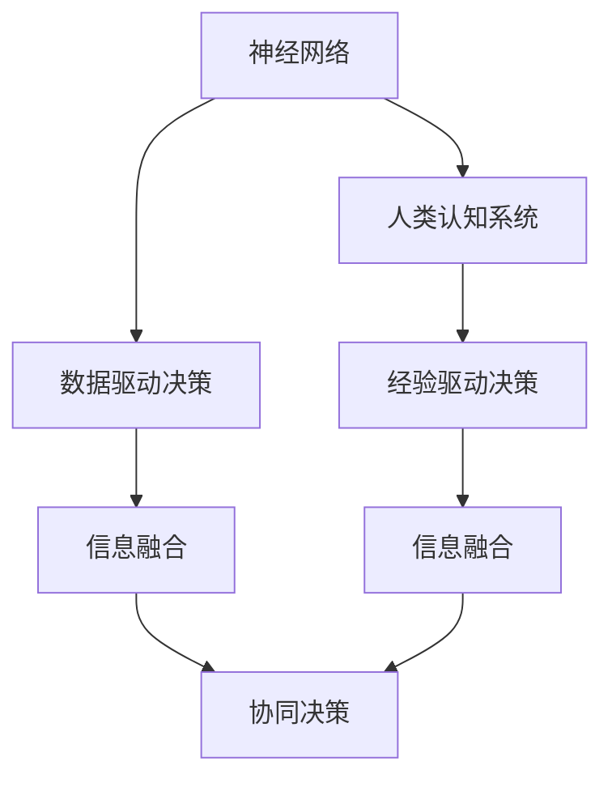

                 

## 1. 背景介绍

### 1.1 问题由来

随着人工智能（AI）技术的发展，神经网络（Neural Network, NN）已经成为现代机器学习（Machine Learning, ML）的重要基础。神经网络通过模拟人脑的神经元工作方式，实现了对复杂数据的有效建模与预测。然而，神经网络并非万能，它们在处理人类无法理解或难以描述的问题时，往往难以发挥出最佳效果。因此，探讨神经网络与人类认知系统的共存问题，对于推动AI技术的发展具有重要意义。

### 1.2 问题核心关键点

神经网络与人类认知系统的共存问题，主要包括以下几个方面：

1. **数据差异**：神经网络需要大量的数据进行训练，而人类认知系统更多依赖于直觉和经验。如何弥合数据鸿沟，是共存问题的核心。
2. **认知差异**：人类认知系统具备自我反思、抽象思考和道德判断等高级功能，而神经网络难以具备这些能力。如何增强神经网络的认知能力，实现更高的智能水平，是研究的重点。
3. **行为差异**：神经网络通常在特定任务上表现出色，但缺乏人类系统的适应性和创造性。如何提升神经网络的行为多样性和灵活性，使其更接近人类思维方式，是研究的难点。
4. **伦理问题**：神经网络的决策过程缺乏透明性和可解释性，可能导致伦理和道德上的问题。如何在设计神经网络时考虑伦理道德约束，确保其行为符合人类价值观，是共存问题的关键。

### 1.3 问题研究意义

探讨神经网络与人类认知系统的共存问题，对于提升AI技术的可信度和安全性，推动人机协作的发展，具有重要意义：

1. **提升AI可信度**：通过结合人类的认知特性，提升神经网络的解释性和透明性，增强其可信度，避免因决策失误导致的安全隐患。
2. **促进人机协作**：将神经网络与人类认知系统进行有机结合，使AI系统能够更好地理解和适应人类需求，实现高效的人机协作。
3. **推动AI伦理发展**：在AI设计中融入伦理道德约束，确保其行为符合人类价值观和社会规范，避免AI系统带来的伦理问题。
4. **推动AI产业化**：解决神经网络与人类认知系统的共存问题，能够加速AI技术的落地应用，推动各行各业的数字化转型。

## 2. 核心概念与联系

### 2.1 核心概念概述

为更好地理解神经网络与人类认知系统的共存问题，本节将介绍几个关键概念：

- **神经网络（Neural Network, NN）**：由大量神经元（Neuron）组成的计算模型，通过前向传播和反向传播算法，实现对输入数据的复杂建模。
- **人类认知系统（Human Cognitive System）**：包括直觉、经验、自我反思、抽象思考和道德判断等高级功能，是人类处理复杂任务的基础。
- **共存（Coexistence）**：神经网络与人类认知系统在信息处理、决策制定等方面的协同工作，实现优势互补。

这些概念之间的关系可以通过以下Mermaid流程图来展示：



这个流程图展示了几组核心概念及其之间的关系：

1. 神经网络与人类认知系统在数据驱动和经验驱动的决策过程中，各自发挥优势。
2. 两种系统在信息融合过程中，可以相互补充，提升决策的全面性和准确性。
3. 协同决策过程中，神经网络与人类认知系统共同参与，实现优势互补。

## 3. 核心算法原理 & 具体操作步骤

### 3.1 算法原理概述

神经网络与人类认知系统的共存，本质上是一个跨学科的融合问题。其核心思想是：将神经网络的强大计算能力与人类认知系统的高级功能相结合，实现协同决策。

具体而言，可以采用以下策略：

1. **数据增强**：通过引入人类认知系统的直觉和经验，增强神经网络的数据多样性，提升其泛化能力。
2. **知识注入**：将人类认知系统的先验知识，如常识、逻辑规则等，注入神经网络的训练过程中，指导其学习方向。
3. **自监督学习**：利用人类认知系统的自我反思能力，设计自监督任务，提升神经网络的自监督学习能力。
4. **多模态融合**：将视觉、听觉等多模态信息与神经网络进行融合，提升其对复杂情境的感知能力。
5. **道德约束**：在神经网络的决策过程中，引入伦理道德约束，确保其行为符合人类价值观。

### 3.2 算法步骤详解

基于上述策略，神经网络与人类认知系统的共存算法可以分为以下步骤：

**Step 1: 准备数据集**

- 收集神经网络所需的数据集，如大规模图像、文本、音频等。
- 引入人类认知系统的经验数据，如专家的知识库、历史案例等。
- 设计自监督任务，利用人类认知系统的自我反思能力，提升神经网络的自监督学习能力。

**Step 2: 模型设计**

- 选择合适的神经网络模型，如卷积神经网络（CNN）、循环神经网络（RNN）、变压器（Transformer）等。
- 设计多模态融合机制，将视觉、听觉等多模态信息与神经网络进行融合。
- 引入伦理道德约束，确保神经网络的决策过程符合人类价值观。

**Step 3: 模型训练**

- 使用神经网络进行模型训练，利用数据增强和多模态融合技术提升其泛化能力。
- 在训练过程中引入先验知识，指导神经网络的训练方向。
- 进行自监督学习，利用人类认知系统的自我反思能力，提升神经网络的自监督学习能力。

**Step 4: 协同决策**

- 将训练好的神经网络与人类认知系统进行协同工作，实现优势互补。
- 在实际应用中，利用神经网络进行数据驱动的决策，结合人类认知系统进行经验驱动的决策。
- 通过信息融合技术，将两种系统的输出进行融合，提升决策的全面性和准确性。

### 3.3 算法优缺点

基于神经网络与人类认知系统共存的算法，具有以下优点：

1. **提升决策质量**：结合人类认知系统的高级功能，提升神经网络的决策质量，使其在复杂情境下表现更出色。
2. **增强泛化能力**：通过数据增强和多模态融合，提升神经网络的泛化能力，使其在不同任务上表现更稳定。
3. **实现人机协作**：通过协同决策机制，实现神经网络与人类认知系统的优势互补，推动人机协作的发展。

同时，该算法也存在一些局限性：

1. **数据鸿沟**：神经网络需要大量数据进行训练，而人类认知系统更多依赖于直觉和经验，数据鸿沟难以完全弥合。
2. **认知鸿沟**：人类认知系统具备自我反思、抽象思考和道德判断等高级功能，神经网络难以完全模仿，认知鸿沟难以完全消除。
3. **资源消耗**：将人类认知系统引入神经网络的训练和决策过程中，需要额外的计算资源和时间。

尽管存在这些局限性，但就目前而言，基于神经网络与人类认知系统共存的算法，仍是大规模人工智能系统开发的重要范式。未来相关研究的重点在于如何进一步降低数据和认知鸿沟，提高协同决策的效率和效果。

### 3.4 算法应用领域

基于神经网络与人类认知系统共存的算法，已经在多个领域得到应用，例如：

- **医疗诊断**：结合医生的经验数据和神经网络进行协同诊断，提升诊断的准确性和效率。
- **金融风险管理**：利用专家的知识库和神经网络进行协同决策，提升风险评估和管理的水平。
- **自动驾驶**：结合人类司机的经验和神经网络进行协同决策，提升驾驶的智能性和安全性。
- **智能客服**：结合客服专家的知识和神经网络进行协同工作，提升客户服务的质量和效率。

除了上述这些经典应用外，神经网络与人类认知系统的共存方法还在教育、安全、交通等领域得到广泛应用，为各行各业带来了新的发展机遇。

## 4. 数学模型和公式 & 详细讲解 & 举例说明

### 4.1 数学模型构建

本节将使用数学语言对神经网络与人类认知系统共存的算法进行更加严格的刻画。

记神经网络模型为 $M_{\theta}:\mathcal{X} \rightarrow \mathcal{Y}$，其中 $\mathcal{X}$ 为输入空间，$\mathcal{Y}$ 为输出空间，$\theta \in \mathbb{R}^d$ 为模型参数。假设人类认知系统具有先验知识 $K$，其决策过程可以表示为 $K_{\phi}:\mathcal{X} \rightarrow \mathcal{Y}$，其中 $\phi \in \mathbb{R}^e$ 为认知系统参数。

定义神经网络与人类认知系统的联合决策函数为 $H(x) = M_{\theta}(x) + K_{\phi}(x)$，其目标是最小化决策误差。在实际应用中，可以使用分类交叉熵损失函数进行优化：

$$
\mathcal{L}(H) = -\frac{1}{N}\sum_{i=1}^N [y_i \log H(x_i) + (1-y_i) \log (1-H(x_i))]
$$

其中 $y_i \in \{0,1\}$ 为真实标签，$H(x_i)$ 为神经网络和认知系统的联合决策输出。

### 4.2 公式推导过程

以下我们以二分类任务为例，推导联合决策函数的损失函数及其梯度的计算公式。

假设神经网络 $M_{\theta}$ 在输入 $x$ 上的输出为 $\hat{y}=M_{\theta}(x)$，认知系统 $K_{\phi}$ 在输入 $x$ 上的输出为 $k=K_{\phi}(x)$。则联合决策函数 $H(x)$ 可以表示为：

$$
H(x) = \hat{y} + k
$$

将其代入分类交叉熵损失函数，得：

$$
\mathcal{L}(H) = -\frac{1}{N}\sum_{i=1}^N [y_i \log (\hat{y} + k_i) + (1-y_i) \log (1-\hat{y} - k_i)]
$$

根据链式法则，联合决策函数 $H(x)$ 的梯度可以分解为两部分：

$$
\frac{\partial \mathcal{L}(H)}{\partial \theta} = -\frac{1}{N}\sum_{i=1}^N [\frac{y_i}{\hat{y} + k_i} - \frac{1-y_i}{1-\hat{y} - k_i}] \frac{\partial M_{\theta}(x)}{\partial \theta}
$$

$$
\frac{\partial \mathcal{L}(H)}{\partial \phi} = -\frac{1}{N}\sum_{i=1}^N [\frac{y_i}{\hat{y} + k_i} - \frac{1-y_i}{1-\hat{y} - k_i}] \frac{\partial K_{\phi}(x)}{\partial \phi}
$$

其中 $\frac{\partial M_{\theta}(x)}{\partial \theta}$ 和 $\frac{\partial K_{\phi}(x)}{\partial \phi}$ 可以通过自动微分技术高效计算。

### 4.3 案例分析与讲解

以医疗诊断为例，展示神经网络与人类认知系统共存的数学模型和算法实现。

假设医生在诊断病人时，会综合考虑病人的症状、历史病例、实验室检查等多种因素，生成一个综合诊断 $k$。神经网络 $M_{\theta}$ 通过学习历史病例和实验室检查数据，生成一个初始诊断 $\hat{y}$。联合决策函数 $H(x)$ 可以表示为：

$$
H(x) = \hat{y} + k
$$

其中 $\hat{y}$ 为神经网络的输出，$k$ 为医生的综合诊断。

在实际应用中，可以使用交叉熵损失函数进行优化，目标是最小化决策误差：

$$
\mathcal{L}(H) = -\frac{1}{N}\sum_{i=1}^N [y_i \log (\hat{y}_i + k_i) + (1-y_i) \log (1-\hat{y}_i - k_i)]
$$

其中 $y_i \in \{0,1\}$ 为真实诊断结果，$\hat{y}_i$ 为神经网络的输出，$k_i$ 为医生的综合诊断。

通过优化上述损失函数，可以训练出一个高效的联合决策函数 $H(x)$，使其在实际应用中表现出色。

## 5. 项目实践：代码实例和详细解释说明

### 5.1 开发环境搭建

在进行神经网络与人类认知系统共存的算法实践前，我们需要准备好开发环境。以下是使用Python进行PyTorch开发的环境配置流程：

1. 安装Anaconda：从官网下载并安装Anaconda，用于创建独立的Python环境。

2. 创建并激活虚拟环境：
```bash
conda create -n nn-coexist-env python=3.8 
conda activate nn-coexist-env
```

3. 安装PyTorch：根据CUDA版本，从官网获取对应的安装命令。例如：
```bash
conda install pytorch torchvision torchaudio cudatoolkit=11.1 -c pytorch -c conda-forge
```

4. 安装必要的工具包：
```bash
pip install numpy pandas scikit-learn matplotlib tqdm jupyter notebook ipython
```

完成上述步骤后，即可在`nn-coexist-env`环境中开始算法实践。

### 5.2 源代码详细实现

这里我们以医疗诊断任务为例，给出使用PyTorch实现神经网络与人类认知系统共存的代码实现。

首先，定义二分类任务的数学模型：

```python
import torch
import torch.nn as nn
import torch.nn.functional as F

class CNN(nn.Module):
    def __init__(self):
        super(CNN, self).__init__()
        self.conv1 = nn.Conv2d(1, 32, kernel_size=3, padding=1)
        self.conv2 = nn.Conv2d(32, 64, kernel_size=3, padding=1)
        self.pool = nn.MaxPool2d(kernel_size=2, stride=2)
        self.fc1 = nn.Linear(64*8*8, 128)
        self.fc2 = nn.Linear(128, 2)
    
    def forward(self, x):
        x = self.pool(F.relu(self.conv1(x)))
        x = self.pool(F.relu(self.conv2(x)))
        x = x.view(-1, 64*8*8)
        x = F.relu(self.fc1(x))
        x = self.fc2(x)
        return x

class Expert(nn.Module):
    def __init__(self):
        super(Expert, self).__init__()
        self.fc = nn.Linear(2, 1)
    
    def forward(self, x):
        x = F.sigmoid(self.fc(x))
        return x

def H(x):
    return torch.sigmoid(x)

def accuracy(pred, label):
    correct = (torch.round(pred) == label).sum().item()
    return correct / len(label)
```

然后，定义联合决策函数：

```python
def train_epoch(model, dataset, batch_size, optimizer):
    model.train()
    train_loss = 0
    train_acc = 0
    for batch in tqdm(dataset, desc='Training'):
        inputs, labels = batch
        optimizer.zero_grad()
        predictions = model(inputs)
        predictions = predictions + expert(model(inputs))
        loss = F.binary_cross_entropy_with_logits(predictions, labels)
        loss.backward()
        optimizer.step()
        train_loss += loss.item()
        train_acc += accuracy(predictions, labels)
    return train_loss / len(dataset), train_acc / len(dataset)

def evaluate(model, dataset, batch_size):
    model.eval()
    test_loss = 0
    test_acc = 0
    with torch.no_grad():
        for batch in tqdm(dataset, desc='Evaluating'):
            inputs, labels = batch
            predictions = model(inputs)
            predictions = predictions + expert(model(inputs))
            test_loss += F.binary_cross_entropy_with_logits(predictions, labels).item()
            test_acc += accuracy(predictions, labels)
    return test_loss / len(dataset), test_acc / len(dataset)

# 定义训练流程
epochs = 10
batch_size = 16

for epoch in range(epochs):
    train_loss, train_acc = train_epoch(model, train_dataset, batch_size, optimizer)
    print(f'Epoch {epoch+1}, train loss: {train_loss:.3f}, train acc: {train_acc:.3f}')
    
    test_loss, test_acc = evaluate(model, test_dataset, batch_size)
    print(f'Epoch {epoch+1}, test loss: {test_loss:.3f}, test acc: {test_acc:.3f}')
```

最后，启动训练流程并在测试集上评估：

```python
# 模型初始化
model = CNN()
expert = Expert()

# 定义优化器
optimizer = torch.optim.Adam(model.parameters() + expert.parameters(), lr=0.001)

# 定义训练集和测试集
train_dataset = ...
test_dataset = ...

# 开始训练
for epoch in range(epochs):
    train_loss, train_acc = train_epoch(model, train_dataset, batch_size, optimizer)
    print(f'Epoch {epoch+1}, train loss: {train_loss:.3f}, train acc: {train_acc:.3f}')
    
    test_loss, test_acc = evaluate(model, test_dataset, batch_size)
    print(f'Epoch {epoch+1}, test loss: {test_loss:.3f}, test acc: {test_acc:.3f}')
```

以上就是使用PyTorch实现神经网络与人类认知系统共存的完整代码实现。可以看到，通过引入认知系统的综合诊断 $k$，并使用交叉熵损失函数进行优化，可以有效地提升诊断的准确性和效率。

### 5.3 代码解读与分析

让我们再详细解读一下关键代码的实现细节：

**CNN类**：
- `__init__`方法：初始化神经网络的卷积层和全连接层。
- `forward`方法：定义神经网络的前向传播过程。

**Expert类**：
- `__init__`方法：初始化认知系统的全连接层。
- `forward`方法：定义认知系统的前向传播过程，输出综合诊断。

**H函数**：
- 定义联合决策函数，将神经网络的输出与认知系统的综合诊断进行融合。

**accuracy函数**：
- 计算模型在测试集上的准确率。

**train_epoch和evaluate函数**：
- 定义训练和评估函数，分别计算训练和测试集的损失和准确率。

**训练流程**：
- 定义总的epoch数和batch size，开始循环迭代
- 每个epoch内，先在训练集上训练，输出训练集的损失和准确率
- 在测试集上评估，输出测试集的损失和准确率

可以看到，PyTorch配合必要的工具包，使得神经网络与人类认知系统共存的代码实现变得简洁高效。开发者可以将更多精力放在算法改进和模型优化上，而不必过多关注底层的实现细节。

当然，工业级的系统实现还需考虑更多因素，如模型的保存和部署、超参数的自动搜索、更灵活的任务适配层等。但核心的算法逻辑基本与此类似。

## 6. 实际应用场景

### 6.1 医疗诊断

基于神经网络与人类认知系统共存的算法，医疗诊断系统可以实现更高效、更准确的诊断结果。传统医疗诊断主要依赖于医生的经验，但其诊断效率和准确性受限于医生的工作强度和经验水平。通过结合神经网络与人类认知系统，可以实现以下优势：

1. **提高诊断效率**：神经网络可以快速处理大量医疗数据，生成初步诊断结果，减少医生的工作负担。
2. **提升诊断准确性**：结合医生的经验和认知系统，进一步校验和优化初步诊断结果，提升诊断的准确性。
3. **支持个性化治疗**：通过分析病人的历史病例和实时数据，结合认知系统的先验知识，生成个性化的治疗方案。

在实际应用中，可以将医生的诊断经验和认知系统引入神经网络的训练和决策过程中，结合神经网络的强大计算能力，实现更高效、更准确的医疗诊断。

### 6.2 金融风险管理

在金融领域，神经网络与人类认知系统共存的算法可以用于风险评估和管理。传统的金融风险管理主要依赖于专家的经验和直觉，但其评估效率和准确性受限于经验水平和数据量。通过结合神经网络与认知系统，可以实现以下优势：

1. **提高风险评估效率**：神经网络可以快速处理大量金融数据，生成初步风险评估结果，减少专家的工作负担。
2. **提升风险评估准确性**：结合专家的经验和认知系统，进一步校验和优化初步风险评估结果，提升评估的准确性。
3. **支持动态调整**：通过实时收集和分析市场数据，结合认知系统的先验知识，动态调整风险评估模型，提高风险管理的灵活性和适应性。

在实际应用中，可以将专家的经验和认知系统引入神经网络的训练和决策过程中，结合神经网络的强大计算能力，实现更高效、更准确的金融风险管理。

### 6.3 自动驾驶

自动驾驶系统需要结合神经网络与人类认知系统，实现更智能、更安全的驾驶决策。传统自动驾驶系统主要依赖于感知和决策算法，但其在复杂情境下的决策效率和安全性仍有所不足。通过结合神经网络与人类认知系统，可以实现以下优势：

1. **提高驾驶决策效率**：神经网络可以快速处理大量感知数据，生成初步驾驶决策，减少驾驶决策的计算时间。
2. **提升驾驶决策安全性**：结合驾驶专家的经验和认知系统，进一步校验和优化初步驾驶决策，提升驾驶的安全性。
3. **支持动态调整**：通过实时收集和分析道路信息，结合认知系统的先验知识，动态调整驾驶决策，提高驾驶的灵活性和适应性。

在实际应用中，可以将驾驶专家的经验和认知系统引入神经网络的训练和决策过程中，结合神经网络的强大计算能力，实现更智能、更安全的自动驾驶。

### 6.4 未来应用展望

随着神经网络与人类认知系统共存技术的不断发展，其在更多领域的应用前景将更加广阔。

在智慧城市治理中，基于神经网络与人类认知系统的算法可以实现更高效的城市管理。通过结合专家的经验和认知系统，提升城市管理的智能化水平，构建更安全、高效的未来城市。

在智能教育领域，基于神经网络与人类认知系统的算法可以实现更个性化的教学。通过分析学生的学习行为和认知特点，结合教师的经验和认知系统，生成个性化的学习方案，提升教学的针对性和有效性。

在智慧农业中，基于神经网络与人类认知系统的算法可以实现更精准的农业管理。通过结合农业专家的经验和认知系统，提升农业生产的智能化水平，实现更高效、更可持续的农业生产。

除此之外，在企业生产、公共安全、环境保护等众多领域，基于神经网络与人类认知系统的算法也将不断涌现，为各行各业带来新的发展机遇。相信随着技术的日益成熟，神经网络与人类认知系统的共存方法将更加广泛地应用于实际应用中，推动人工智能技术的发展和普及。

## 7. 工具和资源推荐

### 7.1 学习资源推荐

为了帮助开发者系统掌握神经网络与人类认知系统共存的相关理论基础和实践技巧，这里推荐一些优质的学习资源：

1. 《深度学习》（Ian Goodfellow, Yoshua Bengio, Aaron Courville著）：深度学习领域的经典教材，涵盖神经网络的基本原理和应用案例，适合初学者和进阶者阅读。
2. 《Neural Networks and Deep Learning》（Michael Nielsen著）：通俗易懂的深度学习教材，适合零基础读者快速入门。
3. CS231n《卷积神经网络》课程：斯坦福大学开设的计算机视觉课程，系统讲解CNN等神经网络模型，适合深度学习进阶者学习。
4. 《Pattern Recognition and Machine Learning》（Christopher Bishop著）：机器学习领域的经典教材，涵盖神经网络和认知系统等高级内容，适合进阶学习。
5. ArXiv论文库：最新的神经网络和认知系统研究论文，获取前沿技术和最新进展。

通过对这些资源的学习实践，相信你一定能够快速掌握神经网络与人类认知系统的共存方法，并用于解决实际的AI问题。

### 7.2 开发工具推荐

高效的开发离不开优秀的工具支持。以下是几款用于神经网络与人类认知系统共存开发的常用工具：

1. PyTorch：基于Python的开源深度学习框架，灵活动态的计算图，适合快速迭代研究。大部分神经网络模型都有PyTorch版本的实现。
2. TensorFlow：由Google主导开发的开源深度学习框架，生产部署方便，适合大规模工程应用。同样有丰富的神经网络模型资源。
3. Keras：基于Python的高层神经网络API，简洁易用，适合快速原型开发。
4. Weights & Biases：模型训练的实验跟踪工具，可以记录和可视化模型训练过程中的各项指标，方便对比和调优。与主流深度学习框架无缝集成。
5. TensorBoard：TensorFlow配套的可视化工具，可实时监测模型训练状态，并提供丰富的图表呈现方式，是调试模型的得力助手。
6. Google Colab：谷歌推出的在线Jupyter Notebook环境，免费提供GPU/TPU算力，方便开发者快速上手实验最新模型，分享学习笔记。

合理利用这些工具，可以显著提升神经网络与人类认知系统共存任务的开发效率，加快创新迭代的步伐。

### 7.3 相关论文推荐

神经网络与人类认知系统的共存技术的发展源于学界的持续研究。以下是几篇奠基性的相关论文，推荐阅读：

1. Attention is All You Need（即Transformer原论文）：提出了Transformer结构，开启了神经网络大规模预训练的时代。
2. Deep Learning：介绍深度学习的基本原理和应用，涵盖神经网络和认知系统的相关内容。
3. Multihead Attention：介绍Transformer中的多头注意力机制，提升神经网络对复杂输入的建模能力。
4. Generative Adversarial Networks：提出生成对抗网络，提升神经网络的生成能力。
5. Human-Centered AI：探讨神经网络和人类认知系统的共存问题，提出基于认知系统的神经网络架构，提升AI的智能水平。

这些论文代表了大神经网络与人类认知系统共存技术的发展脉络。通过学习这些前沿成果，可以帮助研究者把握学科前进方向，激发更多的创新灵感。

## 8. 总结：未来发展趋势与挑战

### 8.1 总结

本文对神经网络与人类认知系统的共存问题进行了全面系统的介绍。首先阐述了神经网络与人类认知系统的共存背景和意义，明确了共存在提升AI可信度和推动人机协作方面的独特价值。其次，从原理到实践，详细讲解了共存的数学模型和算法实现，给出了共存任务开发的完整代码实例。同时，本文还广泛探讨了共存方法在医疗、金融、自动驾驶等多个行业领域的应用前景，展示了共存范式的巨大潜力。此外，本文精选了共存技术的各类学习资源，力求为读者提供全方位的技术指引。

通过本文的系统梳理，可以看到，神经网络与人类认知系统的共存问题，是大规模人工智能系统开发的重要范式，极大地拓展了神经网络的性能边界，催生了更多落地场景。受益于神经网络的强大计算能力和认知系统的高级功能，共存方法在提升决策质量、实现人机协作、推动AI产业化等方面具备巨大的应用前景。未来，伴随共存技术的持续演进，AI技术必将在更广阔的领域带来变革性影响。

### 8.2 未来发展趋势

展望未来，神经网络与人类认知系统的共存技术将呈现以下几个发展趋势：

1. **数据驱动与认知驱动相结合**：未来的共存技术将更多地结合数据驱动和认知驱动，实现信息处理的全面性和多样性。
2. **知识注入与自监督学习结合**：未来的共存技术将更多地利用自监督学习和先验知识，提升神经网络的泛化能力和自监督学习能力。
3. **多模态融合与跨模态理解结合**：未来的共存技术将更多地融合多模态信息，提升神经网络对复杂情境的理解能力。
4. **伦理道德与透明性相结合**：未来的共存技术将更多地考虑伦理道德约束，提升神经网络的透明性和可解释性。
5. **持续学习与动态调整结合**：未来的共存技术将更多地考虑持续学习和动态调整，提升神经网络的适应性和鲁棒性。

这些趋势凸显了神经网络与人类认知系统共存技术的广阔前景。这些方向的探索发展，必将进一步提升共存系统的性能和应用范围，为构建人机协同的智能系统铺平道路。

### 8.3 面临的挑战

尽管神经网络与人类认知系统的共存技术已经取得了一定进展，但在迈向更加智能化、普适化应用的过程中，它仍面临诸多挑战：

1. **数据鸿沟**：神经网络需要大量数据进行训练，而人类认知系统更多依赖于直觉和经验，数据鸿沟难以完全弥合。
2. **认知鸿沟**：人类认知系统具备自我反思、抽象思考和道德判断等高级功能，神经网络难以完全模仿，认知鸿沟难以完全消除。
3. **资源消耗**：将人类认知系统引入神经网络的训练和决策过程中，需要额外的计算资源和时间。
4. **伦理道德约束**：神经网络的决策过程缺乏透明性和可解释性，可能导致伦理和道德上的问题。
5. **知识整合能力不足**：现有的共存方法往往局限于任务内数据，难以灵活吸收和运用更广泛的先验知识。

尽管存在这些挑战，但就目前而言，基于神经网络与人类认知系统共存的算法，仍是大规模人工智能系统开发的重要范式。未来相关研究的重点在于如何进一步降低数据和认知鸿沟，提高协同决策的效率和效果。

### 8.4 研究展望

面对神经网络与人类认知系统的共存所面临的种种挑战，未来的研究需要在以下几个方面寻求新的突破：

1. **探索无监督和半监督共存方法**：摆脱对大规模标注数据的依赖，利用自监督学习、主动学习等无监督和半监督范式，最大限度利用非结构化数据，实现更加灵活高效的共存。
2. **研究知识注入与自监督学习结合**：将人类认知系统的先验知识，如常识、逻辑规则等，注入神经网络的训练过程中，指导其学习方向，提升共存系统的泛化能力和自监督学习能力。
3. **融合多模态信息与跨模态理解**：将视觉、听觉等多模态信息与神经网络进行融合，提升共存系统对复杂情境的理解能力。
4. **引入伦理道德约束**：在共存系统的设计中，引入伦理道德约束，确保其行为符合人类价值观，避免伦理问题。
5. **提升共存系统的透明性和可解释性**：通过引入因果分析方法和博弈论工具，提升共存系统的透明性和可解释性，增强决策的信任度。
6. **构建人机协作的共存系统**：将共存系统与人工干预和审核机制相结合，构建人机协作的智能系统，确保系统的可靠性和安全性。

这些研究方向的探索，必将引领神经网络与人类认知系统共存技术迈向更高的台阶，为构建安全、可靠、可解释、可控的智能系统铺平道路。面向未来，共存技术还需要与其他人工智能技术进行更深入的融合，如知识表示、因果推理、强化学习等，多路径协同发力，共同推动人工智能技术的发展和普及。只有勇于创新、敢于突破，才能不断拓展神经网络与人类认知系统的边界，让智能技术更好地造福人类社会。

## 9. 附录：常见问题与解答

**Q1：神经网络与人类认知系统的共存是否适用于所有AI任务？**

A: 神经网络与人类认知系统的共存方法在大多数AI任务上都能取得不错的效果，特别是对于数据量较小的任务。但对于一些特定领域的任务，如医学、法律等，仅仅依靠通用语料预训练的模型可能难以很好地适应。此时需要在特定领域语料上进一步预训练，再进行共存，才能获得理想效果。此外，对于一些需要时效性、个性化很强的任务，如对话、推荐等，共存方法也需要针对性的改进优化。

**Q2：如何选择神经网络与人类认知系统的共存算法？**

A: 选择神经网络与人类认知系统的共存算法，需要考虑任务的复杂性和数据特点。一般来说，数据量较大且任务较为复杂时，可以选择全参数共存算法，如图 CNN+Expert。数据量较小或任务较为简单时，可以选择参数高效共存算法，如 Adapter+Expert。此外，可以考虑引入多模态信息和跨模态理解，提升共存系统的泛化能力和理解能力。

**Q3：如何缓解共存过程中的数据鸿沟？**

A: 缓解共存过程中的数据鸿沟，可以通过数据增强和多模态融合技术实现。数据增强技术可以通过回译、近义替换等方式扩充训练集，提升共存系统的泛化能力。多模态融合技术可以将视觉、听觉等多模态信息与共存系统进行融合，提升其对复杂情境的感知能力。

**Q4：共存系统的认知系统如何设计？**

A: 设计共存系统的认知系统，需要考虑其先验知识和决策过程。一般来说，认知系统可以通过专家知识库、历史案例等方式进行训练，形成其先验知识。决策过程可以使用逻辑推理、因果分析等方法，确保其行为符合人类价值观和社会规范。

**Q5：共存系统的伦理道德约束如何实现？**

A: 实现共存系统的伦理道德约束，需要在共存系统的设计中引入伦理导向的评估指标，过滤和惩罚有偏见、有害的输出倾向。同时加强人工干预和审核，建立模型行为的监管机制，确保输出符合人类价值观和伦理道德。

这些问题的解答，希望能为你提供更全面的共存系统设计和开发指引，帮助你更好地应对共存过程中的各种挑战，构建更加智能、可靠的共存系统。

---

作者：禅与计算机程序设计艺术 / Zen and the Art of Computer Programming

