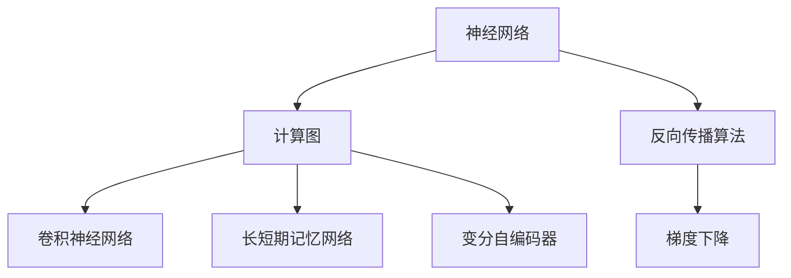

                 

# 神经网络：人类智慧的延伸

> 关键词：
神经网络,人工智能,机器学习,深度学习,强化学习,计算图,计算神经科学,反向传播算法,梯度下降,反向传播,计算机视觉,自然语言处理,语音识别,推荐系统,自动驾驶,数据挖掘

## 1. 背景介绍

### 1.1 问题由来
自从20世纪60年代人工神经网络（Artificial Neural Networks, ANN）的构想被提出以来，经过几十年的发展，神经网络已经成为人工智能（Artificial Intelligence, AI）和机器学习（Machine Learning, ML）领域的重要工具。从最初的感知器、多层前馈网络，到卷积神经网络（Convolutional Neural Networks, CNNs）、递归神经网络（Recurrent Neural Networks, RNNs）、长短期记忆网络（Long Short-Term Memory, LSTM）、变分自编码器（Variational Autoencoders, VAEs）等复杂模型，神经网络在视觉、语音、语言、推荐等诸多领域展现了强大的学习和泛化能力。

神经网络之所以能够取得如此令人瞩目的成就，根本原因在于其对于人类智慧的模拟和延伸。神经系统通过突触传递信息、进行计算，神经元将接收到的信号处理后发送给其他神经元，这一过程与神经网络的结构高度相似。从生物神经网络到人工神经网络，人类通过对神经系统的理解，创造出了高效的计算模型，这不仅是计算机科学的伟大成就，更是对人类智慧的一次深刻探索。

### 1.2 问题核心关键点
神经网络的核心关键点在于其计算图和反向传播算法。计算图将输入数据从网络输入层传递到输出层，反向传播算法则通过链式法则，将损失函数对各层参数的梯度传递回网络，从而更新参数，优化模型。这一过程不仅高效地利用了现代计算机硬件的并行处理能力，而且可以通过大量的数据进行学习，从而在许多任务上取得了超越人类的表现。

神经网络模型通常由以下几个核心组件构成：
- **输入层**：接受原始数据。
- **隐藏层**：对数据进行一系列计算和变换，提取特征。
- **输出层**：对输入数据进行分类、回归等处理，输出结果。

神经网络的学习过程可以分为两个阶段：前向传播和反向传播。在前向传播中，数据从输入层开始，逐层向前传递，最终输出结果；在反向传播中，根据损失函数对输出层参数的梯度进行反向计算，更新所有层参数，从而最小化损失。

## 2. 核心概念与联系

### 2.1 核心概念概述

为了更好地理解神经网络的工作原理和优化方向，本节将介绍几个密切相关的核心概念：

- **神经网络**：由多个神经元（即计算单元）组成的计算模型，用于模拟生物神经网络进行信息处理和计算。
- **计算图**：描述神经网络中各个节点（即神经元）之间的连接关系和数据流动路径的图形结构。
- **反向传播算法**：一种利用链式法则将损失函数对网络参数的梯度传递到每一层的算法，用于更新网络参数。
- **梯度下降**：一种基于梯度的优化算法，通过迭代调整参数值，使损失函数最小化。
- **卷积神经网络**：针对图像数据设计的特殊神经网络，通过卷积层、池化层等组件，高效提取图像特征。
- **长短期记忆网络**：用于处理时间序列数据的神经网络，通过循环结构，能够捕捉时间依赖关系。
- **变分自编码器**：用于生成数据的神经网络，通过编码器和解码器的结构，将输入数据转换为潜在表示，再由解码器生成。

这些核心概念之间的逻辑关系可以通过以下Mermaid流程图来展示：



这个流程图展示了神经网络的核心概念及其之间的关系：

1. 神经网络通过计算图进行数据处理和计算。
2. 反向传播算法用于计算损失函数对各层参数的梯度。
3. 梯度下降算法用于更新参数，最小化损失函数。
4. 卷积神经网络、长短期记忆网络、变分自编码器等特殊神经网络，各自针对特定数据类型设计了特殊结构。

## 3. 核心算法原理 & 具体操作步骤
### 3.1 算法原理概述

神经网络的学习过程基于反向传播算法和梯度下降算法。其核心思想是：通过前向传播计算预测结果，与真实结果进行比较，得到损失函数；再通过反向传播计算损失函数对各层参数的梯度，并利用梯度下降算法更新参数，使损失函数最小化。

具体步骤如下：

1. **前向传播**：将输入数据从输入层传递到输出层，计算出预测结果。
2. **计算损失函数**：将预测结果与真实结果进行比较，得到损失函数。
3. **反向传播**：通过链式法则，将损失函数对输出层参数的梯度传递到每一层，计算出各层参数的梯度。
4. **更新参数**：利用梯度下降算法，根据各层参数的梯度更新模型参数。

这一过程通过计算图进行高效计算，可以并行化处理大规模数据，从而在深度学习时代大放异彩。

### 3.2 算法步骤详解

基于反向传播算法和梯度下降算法，神经网络的学习过程可以总结如下：

1. **初始化模型参数**：随机初始化神经网络的权重和偏置。
2. **前向传播**：将输入数据传递到神经网络，计算出每一层的输出。
3. **计算损失函数**：将神经网络的预测结果与真实结果进行比较，得到损失函数。
4. **反向传播**：通过链式法则，计算出损失函数对每一层参数的梯度。
5. **更新参数**：利用梯度下降算法，根据各层参数的梯度更新模型参数。
6. **重复迭代**：重复执行前向传播、损失函数计算、反向传播和参数更新的过程，直到损失函数收敛或达到预设的迭代次数。

### 3.3 算法优缺点

神经网络的学习过程有以下优点：
- **高效并行计算**：计算图结构使得前向传播和反向传播可以并行计算，大大提升了计算效率。
- **可处理复杂结构**：神经网络能够高效处理大规模数据和复杂结构，适用于多种任务。
- **可迁移性**：神经网络在预训练过程中学习到的特征可以迁移到其他任务中，提高模型泛化能力。
- **自适应性**：通过反向传播算法，神经网络能够自动调整参数，适应新的数据和任务。

同时，神经网络的学习过程也存在一些缺点：
- **过拟合风险**：神经网络的复杂结构可能过拟合训练数据，导致在测试数据上表现不佳。
- **训练成本高**：需要大量的数据和计算资源进行训练，对硬件要求较高。
- **黑盒性质**：神经网络的内部结构复杂，难以解释其决策过程。
- **参数初始化敏感**：初始化不当可能导致模型收敛速度慢或陷入局部最优。

### 3.4 算法应用领域

神经网络的应用领域非常广泛，涵盖了计算机视觉、自然语言处理、语音识别、推荐系统、自动驾驶等诸多领域。以下是一些典型的应用案例：

- **计算机视觉**：用于图像分类、目标检测、图像生成、图像分割等任务。神经网络能够高效处理图像数据，提取丰富的特征信息。
- **自然语言处理**：用于文本分类、机器翻译、文本生成、问答系统等任务。神经网络能够处理文本数据，学习语言规律和语义信息。
- **语音识别**：用于语音识别、语音合成、语音转换等任务。神经网络能够处理语音信号，捕捉语音特征和语义信息。
- **推荐系统**：用于用户推荐、商品推荐、内容推荐等任务。神经网络能够处理用户行为数据，学习用户偏好和商品特征。
- **自动驾驶**：用于感知环境、路径规划、决策制定等任务。神经网络能够处理传感器数据，提取环境和行为信息。

这些应用领域展示了神经网络在人工智能领域的广泛影响力，推动了各个行业的技术进步和产业升级。

## 4. 数学模型和公式 & 详细讲解  
### 4.1 数学模型构建

神经网络的学习过程可以通过数学模型来描述。记神经网络的结构为 $f(x; \theta)$，其中 $x$ 表示输入数据，$\theta$ 表示模型参数。假设神经网络的输出为 $y$，则损失函数可以表示为 $L(y, \hat{y})$，其中 $\hat{y}$ 表示神经网络的预测结果。

具体而言，对于线性回归任务，损失函数可以表示为：

$$
L(y, \hat{y}) = \frac{1}{2N} \sum_{i=1}^N (y_i - \hat{y}_i)^2
$$

对于分类任务，常用的损失函数包括交叉熵损失函数：

$$
L(y, \hat{y}) = -\frac{1}{N} \sum_{i=1}^N \sum_{j=1}^C y_{ij} \log \hat{y}_{ij}
$$

其中 $y_{ij}$ 表示样本 $i$ 在类别 $j$ 上的真实标签，$\hat{y}_{ij}$ 表示神经网络对样本 $i$ 在类别 $j$ 上的预测概率。

### 4.2 公式推导过程

以下以线性回归任务为例，推导梯度下降算法的具体实现。

假设神经网络的输出为 $\hat{y} = W^T x + b$，其中 $W$ 表示权重矩阵，$b$ 表示偏置项，$x$ 表示输入数据。损失函数为均方误差损失，即：

$$
L(y, \hat{y}) = \frac{1}{2N} \sum_{i=1}^N (y_i - \hat{y}_i)^2
$$

对损失函数求偏导数，得到：

$$
\frac{\partial L}{\partial W} = \frac{1}{N} \sum_{i=1}^N (y_i - \hat{y}_i)x_i
$$

$$
\frac{\partial L}{\partial b} = \frac{1}{N} \sum_{i=1}^N (y_i - \hat{y}_i)
$$

利用梯度下降算法，更新参数 $W$ 和 $b$：

$$
W \leftarrow W - \eta \frac{\partial L}{\partial W}
$$

$$
b \leftarrow b - \eta \frac{\partial L}{\partial b}
$$

其中 $\eta$ 为学习率。

### 4.3 案例分析与讲解

假设有一个简单的二分类任务，已知训练数据集 $\{(x_1, y_1), (x_2, y_2), \ldots, (x_N, y_N)\}$，其中 $x_i \in \mathbb{R}^d$ 表示输入特征向量，$y_i \in \{0, 1\}$ 表示类别标签。

我们可以构建一个二分类神经网络，其中输入层有 $d$ 个神经元，隐藏层有 $h$ 个神经元，输出层有 1 个神经元。隐藏层的激活函数为 $\tanh$，输出层的激活函数为 $sigmoid$。

通过前向传播计算得到输出层的预测结果 $\hat{y} = sigmoid(W^T x + b)$。利用交叉熵损失函数，可以得到损失函数：

$$
L(y, \hat{y}) = -\frac{1}{N} \sum_{i=1}^N [y_i \log \hat{y}_i + (1-y_i) \log (1-\hat{y}_i)]
$$

通过反向传播计算梯度：

$$
\frac{\partial L}{\partial W} = \frac{1}{N} \sum_{i=1}^N (\hat{y}_i - y_i)x_i
$$

$$
\frac{\partial L}{\partial b} = \frac{1}{N} \sum_{i=1}^N (\hat{y}_i - y_i)
$$

利用梯度下降算法，更新参数 $W$ 和 $b$：

$$
W \leftarrow W - \eta \frac{\partial L}{\partial W}
$$

$$
b \leftarrow b - \eta \frac{\partial L}{\partial b}
$$

通过不断迭代上述过程，神经网络可以逐渐逼近真实分类边界，提高分类准确率。

## 5. 项目实践：代码实例和详细解释说明
### 5.1 开发环境搭建

在进行神经网络项目实践前，我们需要准备好开发环境。以下是使用Python进行PyTorch开发的环境配置流程：

1. 安装Anaconda：从官网下载并安装Anaconda，用于创建独立的Python环境。

2. 创建并激活虚拟环境：
```bash
conda create -n pytorch-env python=3.8 
conda activate pytorch-env
```

3. 安装PyTorch：根据CUDA版本，从官网获取对应的安装命令。例如：
```bash
conda install pytorch torchvision torchaudio cudatoolkit=11.1 -c pytorch -c conda-forge
```

4. 安装TensorBoard：
```bash
pip install tensorboard
```

5. 安装PyTorch Lightning：用于快速搭建和调试深度学习模型。
```bash
pip install pytorch-lightning
```

6. 安装Git和GitHub：用于代码版本管理和代码下载。

完成上述步骤后，即可在`pytorch-env`环境中开始神经网络项目的开发。

### 5.2 源代码详细实现

下面我们以手写数字识别任务为例，给出使用PyTorch和PyTorch Lightning进行线性回归模型的代码实现。

首先，导入所需的库和数据集：

```python
import torch
import torch.nn as nn
import torch.optim as optim
from torch.utils.data import DataLoader
from torchvision import datasets, transforms

# 加载MNIST数据集
train_dataset = datasets.MNIST(root='./data', train=True, transform=transforms.ToTensor(), download=True)
test_dataset = datasets.MNIST(root='./data', train=False, transform=transforms.ToTensor(), download=True)
```

然后，定义模型和优化器：

```python
# 定义线性回归模型
class LinearRegression(nn.Module):
    def __init__(self, input_size, output_size):
        super(LinearRegression, self).__init__()
        self.linear = nn.Linear(input_size, output_size)
    
    def forward(self, x):
        return self.linear(x)

# 加载数据并创建数据加载器
train_loader = DataLoader(train_dataset, batch_size=64, shuffle=True)
test_loader = DataLoader(test_dataset, batch_size=64, shuffle=False)

# 定义模型
model = LinearRegression(784, 10)

# 定义优化器
optimizer = optim.SGD(model.parameters(), lr=0.01)

# 定义损失函数
criterion = nn.CrossEntropyLoss()
```

接着，定义训练和评估函数：

```python
def train_epoch(model, data_loader, optimizer):
    model.train()
    losses = []
    for batch_idx, (data, target) in enumerate(data_loader):
        data, target = data.to(device), target.to(device)
        optimizer.zero_grad()
        output = model(data)
        loss = criterion(output, target)
        loss.backward()
        optimizer.step()
        losses.append(loss.item())
    return sum(losses) / len(data_loader)

def evaluate(model, data_loader):
    model.eval()
    losses = []
    with torch.no_grad():
        for batch_idx, (data, target) in enumerate(data_loader):
            data, target = data.to(device), target.to(device)
            output = model(data)
            loss = criterion(output, target)
            losses.append(loss.item())
    return sum(losses) / len(data_loader)

# 训练模型
device = torch.device('cuda' if torch.cuda.is_available() else 'cpu')
model.to(device)

for epoch in range(10):
    train_loss = train_epoch(model, train_loader, optimizer)
    test_loss = evaluate(model, test_loader)
    print(f'Epoch {epoch+1}, train loss: {train_loss:.4f}, test loss: {test_loss:.4f}')
```

以上就是使用PyTorch和PyTorch Lightning进行线性回归模型的代码实现。可以看到，借助PyTorch Lightning，我们可以更简洁高效地搭建和调试深度学习模型，加速神经网络的开发进程。

### 5.3 代码解读与分析

让我们再详细解读一下关键代码的实现细节：

**LinearRegression类**：
- `__init__`方法：初始化线性回归模型，包含权重和偏置参数。
- `forward`方法：前向传播计算，返回输出结果。

**train_epoch函数**：
- 定义训练过程中的一些参数，如学习率、批次大小等。
- 在每个批次上进行前向传播、损失函数计算和反向传播，更新模型参数。
- 返回本轮训练的平均损失。

**evaluate函数**：
- 与训练类似，不同点在于不更新模型参数，直接计算预测结果和损失函数。
- 返回本轮评估的平均损失。

**训练流程**：
- 定义总的epoch数，开始循环迭代。
- 每个epoch内，先在训练集上训练，输出平均损失。
- 在验证集上评估，输出测试损失。
- 重复上述过程直至模型收敛。

可以看到，PyTorch和PyTorch Lightning使得神经网络的搭建和训练过程变得简洁高效，大大降低了开发难度。开发者可以将更多精力放在模型改进和算法优化上，而不必过多关注底层实现细节。

当然，工业级的系统实现还需考虑更多因素，如模型的保存和部署、超参数的自动搜索、更灵活的模型架构等。但核心的神经网络学习过程基本与此类似。

## 6. 实际应用场景
### 6.1 智能推荐系统

神经网络在智能推荐系统中被广泛应用，用于推荐用户可能感兴趣的物品或内容。通过分析用户的历史行为数据，神经网络能够学习用户偏好和物品特征，从而生成个性化推荐。

在实践中，可以将用户行为数据作为输入，物品特征作为输出，构建一个神经网络模型。利用交叉熵损失函数，训练模型学习用户对物品的评分。模型训练完成后，对新物品进行评分，并根据评分生成推荐列表。

### 6.2 自然语言处理

神经网络在自然语言处理领域展现了强大的语言理解和生成能力，被广泛应用于文本分类、机器翻译、文本生成、问答系统等任务。通过将文本数据作为输入，神经网络能够学习语言规律和语义信息，从而实现自然语言处理任务。

在实践中，可以将文本数据作为输入，目标分类标签或输出文本作为输出，构建神经网络模型。利用交叉熵损失函数或序列到序列（Seq2Seq）框架，训练模型学习文本分类或机器翻译。模型训练完成后，对新文本进行分类或生成，并根据任务需求进行进一步处理。

### 6.3 计算机视觉

神经网络在计算机视觉领域被广泛应用于图像分类、目标检测、图像生成、图像分割等任务。通过将图像数据作为输入，神经网络能够学习图像特征，从而实现各种视觉处理任务。

在实践中，可以将图像数据作为输入，目标类别标签作为输出，构建卷积神经网络模型。利用交叉熵损失函数，训练模型学习图像分类。模型训练完成后，对新图像进行分类，并根据任务需求进行进一步处理。

### 6.4 未来应用展望

随着神经网络模型的不断进步，未来的应用场景将更加广阔。以下是一些典型的未来应用：

- **医疗诊断**：用于医学影像分析、疾病预测、个性化治疗等任务。神经网络能够处理复杂的医疗数据，辅助医生进行诊断和治疗。
- **金融分析**：用于市场预测、信用评估、风险管理等任务。神经网络能够处理金融数据，提供智能化的投资建议和风险预警。
- **自动驾驶**：用于环境感知、路径规划、决策制定等任务。神经网络能够处理传感器数据，实现自动驾驶。
- **语音识别**：用于语音识别、语音合成、语音转换等任务。神经网络能够处理语音信号，提供智能化的语音交互体验。
- **智能客服**：用于智能对话、情感分析、意图识别等任务。神经网络能够处理自然语言文本，提供智能化的客服服务。

这些应用领域展示了神经网络在人工智能领域的广泛影响力，推动了各个行业的技术进步和产业升级。

## 7. 工具和资源推荐
### 7.1 学习资源推荐

为了帮助开发者系统掌握神经网络的理论基础和实践技巧，这里推荐一些优质的学习资源：

1. 《深度学习》书籍：Ian Goodfellow等人所著，全面介绍了深度学习的基本原理和应用。
2. 《神经网络与深度学习》课程：由Andrew Ng等人讲授，提供视频和讲义，适合初学者入门。
3. 《Python深度学习》书籍：Francois Chollet所著，深入浅出地介绍了TensorFlow和Keras的使用方法。
4. 《Hands-On Machine Learning with Scikit-Learn, Keras, and TensorFlow》书籍：Aurélien Géron所著，详细介绍了机器学习和深度学习的实战技巧。
5. Kaggle竞赛平台：提供大量数据集和竞赛任务，可以帮助开发者实践和验证神经网络模型的性能。

通过对这些资源的学习实践，相信你一定能够快速掌握神经网络模型的精髓，并用于解决实际的NLP问题。
### 7.2 开发工具推荐

高效的开发离不开优秀的工具支持。以下是几款用于神经网络微调开发的常用工具：

1. PyTorch：基于Python的开源深度学习框架，灵活动态的计算图，适合快速迭代研究。大部分预训练语言模型都有PyTorch版本的实现。

2. TensorFlow：由Google主导开发的开源深度学习框架，生产部署方便，适合大规模工程应用。同样有丰富的预训练语言模型资源。

3. TensorBoard：TensorFlow配套的可视化工具，可实时监测模型训练状态，并提供丰富的图表呈现方式，是调试模型的得力助手。

4. PyTorch Lightning：用于快速搭建和调试深度学习模型，支持多种模型架构和优化器。

5. Weights & Biases：模型训练的实验跟踪工具，可以记录和可视化模型训练过程中的各项指标，方便对比和调优。

6. Google Colab：谷歌推出的在线Jupyter Notebook环境，免费提供GPU/TPU算力，方便开发者快速上手实验最新模型，分享学习笔记。

合理利用这些工具，可以显著提升神经网络微调任务的开发效率，加快创新迭代的步伐。

### 7.3 相关论文推荐

神经网络的发展源于学界的持续研究。以下是几篇奠基性的相关论文，推荐阅读：

1. Deep Blue Book: Pattern Recognition and Machine Learning by Christopher M. Bishop。
2. "A Learning Framework for Deep Neural Networks" by Yann LeCun, Yoshua Bengio, Geoffrey Hinton。
3. "Learning representations by back-propagating errors" by David E. Rumelhart, Geoffrey E. Hinton, Ronald J. Williams。
4. "Convolutional Neural Networks for Visual Recognition" by LeCun, Boser, Denker, Solla, and Case。
5. "Long Short-Term Memory" by Hochreiter and Schmidhuber。
6. "Generative Adversarial Nets" by Ian Goodfellow, Jean Pouget-Abadie, Mehdi Mirza, Bing Xu, David Warde-Farley, Sergey Ozair, Aaron Courville, Yoshua Bengio。

这些论文代表了大神经网络的发展脉络。通过学习这些前沿成果，可以帮助研究者把握学科前进方向，激发更多的创新灵感。

## 8. 总结：未来发展趋势与挑战

### 8.1 总结

本文对神经网络的学习过程进行了全面系统的介绍。首先阐述了神经网络的基本原理和核心概念，明确了反向传播算法和梯度下降算法的作用。其次，从原理到实践，详细讲解了神经网络的学习过程，给出了神经网络模型的代码实现。同时，本文还广泛探讨了神经网络在多个领域的应用场景，展示了神经网络在人工智能领域的广泛影响力。

通过本文的系统梳理，可以看到，神经网络的学习过程通过反向传播算法和梯度下降算法高效利用计算机硬件并行处理能力，可以处理大规模数据和复杂结构，在多个领域展现了强大的学习和泛化能力。未来，神经网络的应用场景还将不断拓展，为人工智能技术的落地和产业化提供重要支撑。

### 8.2 未来发展趋势

展望未来，神经网络的学习过程将呈现以下几个发展趋势：

1. **模型规模持续增大**：随着算力成本的下降和数据规模的扩张，神经网络模型的参数量还将持续增长。超大模型能够处理更复杂的任务，带来更高的性能。

2. **自监督学习的应用**：自监督学习可以更好地利用未标注数据进行预训练，减少对标注数据的依赖，提升模型的泛化能力。

3. **跨领域迁移学习**：神经网络能够在多个领域之间进行迁移学习，通过共享知识和特征，提高模型在不同任务上的表现。

4. **参数高效学习**：通过改进模型结构和算法，减少对标注数据的依赖，提高模型的参数效率和训练速度。

5. **多模态学习**：神经网络能够处理视觉、听觉、语言等多种模态数据，实现跨模态学习，提高模型的综合性。

6. **低资源学习**：神经网络能够在资源受限的环境中进行学习，如移动设备、嵌入式设备等。

### 8.3 面临的挑战

尽管神经网络的学习过程已经取得了显著进展，但在迈向更加智能化、普适化应用的过程中，仍面临以下挑战：

1. **过拟合风险**：神经网络的复杂结构可能过拟合训练数据，导致在测试数据上表现不佳。

2. **训练成本高**：需要大量的数据和计算资源进行训练，对硬件要求较高。

3. **可解释性不足**：神经网络的内部结构复杂，难以解释其决策过程。

4. **模型鲁棒性差**：面对域外数据时，神经网络的泛化性能往往大打折扣。

5. **参数初始化敏感**：初始化不当可能导致模型收敛速度慢或陷入局部最优。

6. **公平性和安全性**：神经网络可能学习到有偏见、有害的信息，对社会产生负面影响。

### 8.4 研究展望

面对神经网络学习过程中面临的挑战，未来的研究需要在以下几个方面寻求新的突破：

1. **自监督和半监督学习**：摆脱对大规模标注数据的依赖，利用自监督和半监督学习范式，提高模型的泛化能力。

2. **参数高效和计算高效学习**：开发更加参数高效的神经网络模型，减少过拟合风险，提高训练速度。

3. **多模态和跨模态学习**：融合多种模态数据，提高模型的综合性和跨领域迁移能力。

4. **公平性和安全性研究**：研究神经网络在公平性、安全性等方面的表现，确保模型的伦理和社会责任。

5. **可解释性和可理解性**：探索提高神经网络可解释性的方法，增强模型的可理解性和透明度。

6. **跨领域和跨模态迁移学习**：研究如何在不同领域和模态间进行迁移学习，提升模型的适应性和通用性。

这些研究方向的探索，必将引领神经网络学习过程迈向更高的台阶，为人工智能技术的落地和产业化提供重要支撑。面向未来，神经网络的学习过程还需要与其他人工智能技术进行更深入的融合，如知识表示、因果推理、强化学习等，多路径协同发力，共同推动人工智能技术的进步。

## 9. 附录：常见问题与解答

**Q1：神经网络模型为什么需要反向传播算法？**

A: 反向传播算法是神经网络学习过程中不可或缺的一部分。通过前向传播计算预测结果，利用反向传播计算损失函数对各层参数的梯度，才能更新模型参数，优化模型性能。反向传播算法利用链式法则，将梯度从输出层传递回输入层，使得每个参数都能得到有效的更新。

**Q2：神经网络模型如何进行参数初始化？**

A: 神经网络模型的参数初始化对于模型的训练效果和收敛速度至关重要。常见的参数初始化方法包括随机初始化、Xavier初始化、He初始化等。不同的初始化方法适用于不同的网络结构，需要进行仔细的选择和调参。

**Q3：神经网络模型如何进行正则化？**

A: 正则化是避免神经网络过拟合的有效手段。常见的正则化方法包括L1正则化、L2正则化、Dropout等。通过添加正则化项，可以防止模型对训练数据过度拟合，提升模型在测试数据上的泛化能力。

**Q4：神经网络模型如何进行超参数调优？**

A: 神经网络模型的超参数包括学习率、批次大小、迭代次数等，需要通过反复实验调整才能找到最优配置。常见的超参数调优方法包括网格搜索、随机搜索、贝叶斯优化等。在实际应用中，可以使用自动化调参工具如Hyperopt、Ray Tune等，加速超参数调优过程。

**Q5：神经网络模型如何进行模型剪枝和量化？**

A: 模型剪枝和量化是优化神经网络模型的有效手段，可以减小模型尺寸和计算开销，提升推理速度。模型剪枝通过去除无关的权重，减小模型参数量；模型量化通过将浮点数转换为定点数，减少存储空间和计算资源。

这些常见问题及其解答，可以帮助你更好地理解神经网络的学习过程，解决实际开发中的问题。

---

作者：禅与计算机程序设计艺术 / Zen and the Art of Computer Programming

