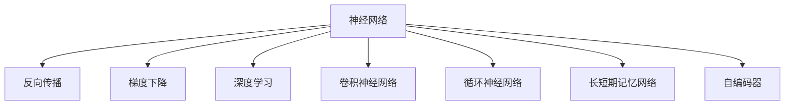

                 

# 神经网络：人类智慧的解放

## 1. 背景介绍

### 1.1 问题由来

随着人工智能技术的不断进步，神经网络（Neural Networks）已经成为实现人工智能的重要基础。其不仅在图像识别、语音识别等领域取得了巨大的成功，还在自然语言处理（Natural Language Processing, NLP）中展现出卓越的能力。神经网络技术的成熟和普及，使得人类可以通过机器进行更高效、更精确的数据处理与智能决策，其对人类智慧的解放意义深远。

### 1.2 问题核心关键点

神经网络核心在于其强大的表征学习能力，通过多层的非线性变换，可以将输入数据映射到一个高维空间，从而实现复杂模式的抽取和分类。对于大规模数据集，神经网络还可以利用其高度并行化的计算能力，快速高效地进行训练与预测。然而，神经网络在实际应用中，也面临诸如过拟合、可解释性不足等诸多挑战。

### 1.3 问题研究意义

神经网络技术的进步，不仅极大地推动了人工智能的产业化应用，而且也促进了相关领域的基础研究。神经网络技术为解决传统领域中的难题提供了新的解决方案，同时也为科学研究带来了新的方向。因此，深入研究神经网络的核心原理和优化策略，对于推动人工智能的发展和应用具有重要意义。

## 2. 核心概念与联系

### 2.1 核心概念概述

为更好地理解神经网络的核心原理及其应用，本节将介绍几个关键的概念：

- 神经网络（Neural Network）：由大量的人工神经元通过非线性变换构成的网络模型，用于实现复杂模式的识别和分类。
- 反向传播（Backpropagation）：一种用于训练神经网络的算法，通过计算输出层的误差，反向更新网络中各层的权重和偏置，以最小化误差。
- 梯度下降（Gradient Descent）：一种用于寻找最优解的迭代算法，通过计算梯度来指导参数更新方向，使损失函数最小化。
- 深度学习（Deep Learning）：利用多层神经网络进行训练，学习数据深层次特征的一种机器学习技术。
- 卷积神经网络（Convolutional Neural Network, CNN）：针对图像识别等视觉任务设计的网络结构，通过卷积、池化等操作提取图像特征。
- 循环神经网络（Recurrent Neural Network, RNN）：针对序列数据设计的网络结构，通过循环结构处理时序信息。
- 长短期记忆网络（Long Short-Term Memory, LSTM）：一种特殊的RNN，可以更好地处理长序列信息，避免梯度消失问题。
- 自编码器（Autoencoder）：用于数据压缩和特征提取的一种无监督学习方法，通过重建输入数据来学习特征表示。

这些核心概念之间的逻辑关系可以通过以下Mermaid流程图来展示：



这个流程图展示了几大核心概念之间的关系：

1. 神经网络是核心模型，反向传播是其训练算法，梯度下降是其优化策略。
2. 深度学习是神经网络的扩展应用，CNN和RNN是其典型结构。
3. LSTM是RNN的一种改进，用于处理序列数据。
4. 自编码器是神经网络的一种无监督应用，用于数据压缩和特征学习。

这些概念共同构成了神经网络的学习和应用框架，使得神经网络能够处理复杂的模式识别任务，推动人工智能技术的发展和应用。

## 3. 核心算法原理 & 具体操作步骤
### 3.1 算法原理概述

神经网络的核心在于其表征学习能力，通过多层的非线性变换，可以将输入数据映射到一个高维空间，从而实现复杂模式的抽取和分类。其主要原理如下：

1. 前向传播：将输入数据通过各层神经元进行非线性变换，得到输出结果。
2. 损失函数计算：将输出结果与真实标签进行比较，计算损失函数。
3. 反向传播：根据损失函数计算梯度，反向更新网络中各层的权重和偏置，以最小化损失函数。
4. 参数优化：利用梯度下降等优化算法，更新网络参数，使其逐步接近最优解。

### 3.2 算法步骤详解

基于上述原理，神经网络的训练过程通常包括以下几个关键步骤：

**Step 1: 数据准备**
- 收集训练数据，分为训练集、验证集和测试集。
- 对数据进行预处理，如归一化、标准化、标签编码等。

**Step 2: 模型搭建**
- 选择合适的神经网络结构，如CNN、RNN、LSTM等。
- 设计合适的网络层数和节点数，定义各层激活函数、损失函数等。

**Step 3: 模型训练**
- 选择合适的优化算法及其参数，如Adam、SGD等。
- 设置训练轮数、批大小、学习率等超参数。
- 在训练集上迭代进行前向传播和反向传播，更新网络参数。

**Step 4: 模型评估**
- 在验证集上对模型进行评估，计算损失函数和性能指标。
- 根据验证集上的结果调整超参数，避免过拟合。
- 在测试集上对模型进行最终评估，输出预测结果。

**Step 5: 模型应用**
- 将训练好的模型应用于实际数据，进行预测、分类、回归等任务。
- 定期重新训练模型，适应数据分布的变化。

以上是神经网络训练的一般流程。在实际应用中，还需要根据具体任务的特点，对训练过程的各个环节进行优化设计，如改进损失函数，引入更多的正则化技术，搜索最优的超参数组合等，以进一步提升模型性能。

### 3.3 算法优缺点

神经网络在许多领域都取得了显著的成功，但其也存在一定的局限性：

**优点：**
1. 强大的表征学习能力：能够学习数据深层次的特征，适用于复杂的模式识别任务。
2. 高度并行化的计算能力：可利用GPU、TPU等硬件进行高效计算。
3. 自适应性：能够适应大规模数据集的训练，快速提升模型性能。

**缺点：**
1. 可解释性不足：神经网络通常被视为"黑盒"，难以解释其内部工作机制和决策逻辑。
2. 过拟合风险：对于小规模数据集，容易过拟合，泛化能力不足。
3. 资源消耗大：神经网络参数量大，训练和推理时资源消耗较大。
4. 数据依赖性强：需要大量标注数据进行训练，数据获取成本高。

尽管存在这些局限性，但神经网络在实际应用中仍然表现出色，广泛应用于图像识别、语音识别、自然语言处理等领域。未来，相关研究的重点在于如何进一步提高神经网络的解释性、鲁棒性和资源利用率，使其更加适应实际应用场景。

### 3.4 算法应用领域

神经网络技术在众多领域都有广泛的应用，以下是几个典型案例：

- 计算机视觉：神经网络可以用于图像分类、目标检测、人脸识别等任务，广泛应用于智能监控、自动驾驶、医学影像分析等领域。
- 自然语言处理：神经网络可以用于文本分类、情感分析、机器翻译等任务，推动了智能客服、智能翻译、智能问答等领域的发展。
- 语音识别：神经网络可以用于语音识别、语音合成等任务，推动了智能家居、语音助手等领域的发展。
- 推荐系统：神经网络可以用于推荐算法，提升个性化推荐效果，推动了电商、视频、社交网络等领域的发展。
- 医疗健康：神经网络可以用于疾病诊断、影像分析、基因组学等领域，推动了医疗诊断和治疗的智能化。
- 金融交易：神经网络可以用于股票预测、风险管理、信用评估等领域，推动了金融市场的智能化。

此外，神经网络还在游戏、音乐、艺术创作等领域展现出广泛的应用前景，为人类智慧的解放提供了新的可能性。

## 4. 数学模型和公式 & 详细讲解 & 举例说明
### 4.1 数学模型构建

神经网络的数学模型基于矩阵运算，其核心在于对输入数据的线性变换和非线性变换。以下是一个简单的全连接神经网络的结构：

```
输入层 -> [激活函数1] -> 隐藏层 -> [激活函数2] -> 输出层
```

其中，输入层有 $m$ 个节点，输出层有 $n$ 个节点。隐藏层有 $h$ 个节点，其激活函数为 $f$，如ReLU、Sigmoid等。神经网络的权重矩阵为 $W$，偏置向量为 $b$，输入向量为 $x$，输出向量为 $y$。神经网络的前向传播过程可以表示为：

$$
y = f(\sum_{i=1}^{h} x_i W_i + b)
$$

其中 $x_i$ 表示输入层的第 $i$ 个节点，$W_i$ 表示与第 $i$ 个节点相连的隐藏层节点的权重，$b$ 表示偏置项。

### 4.2 公式推导过程

以一个简单的全连接神经网络为例，其前向传播和反向传播过程如下：

**前向传播：**

$$
y = f(\sum_{i=1}^{h} x_i W_i + b)
$$

其中 $f$ 为激活函数，$W$ 为权重矩阵，$x$ 为输入向量，$y$ 为输出向量。

**损失函数计算：**

假设输出层为分类任务，使用交叉熵损失函数：

$$
L = -\sum_{i=1}^{N} \sum_{j=1}^{C} y_{ij} \log(\hat{y}_{ij})
$$

其中 $N$ 为样本数，$C$ 为类别数，$y_{ij}$ 为样本 $i$ 的真实标签，$\hat{y}_{ij}$ 为模型对样本 $i$ 的预测概率。

**反向传播：**

反向传播过程的公式较为复杂，包括链式法则的应用和梯度计算。以下以全连接神经网络为例，推导反向传播的公式。

**全连接层梯度：**

设 $L$ 为损失函数，$W$ 为权重矩阵，$x$ 为输入向量，$y$ 为输出向量，$f$ 为激活函数，$g$ 为激活函数的导数，则全连接层的梯度计算公式为：

$$
\frac{\partial L}{\partial W} = \frac{\partial L}{\partial y} \frac{\partial y}{\partial z} \frac{\partial z}{\partial W}
$$

其中 $z = f(\sum_{i=1}^{h} x_i W_i + b)$。

**权重更新：**

根据梯度下降算法，权重更新公式为：

$$
W \leftarrow W - \eta \frac{\partial L}{\partial W}
$$

其中 $\eta$ 为学习率。

### 4.3 案例分析与讲解

以一个简单的二分类任务为例，使用逻辑回归（Logistic Regression）进行讲解。

假设输入数据为 $x = [1, 2, 3]$，权重矩阵为 $W = [0.5, -0.3, 0.7]$，偏置项为 $b = 0.2$，激活函数为sigmoid函数，则前向传播过程如下：

$$
y = \sigma(\sum_{i=1}^{3} x_i W_i + b) = \sigma(1 \times 0.5 - 2 \times 0.3 + 3 \times 0.7 + 0.2) = 0.999
$$

设真实标签为 $y_{true} = 1$，预测概率为 $y_{pred} = 0.999$，交叉熵损失为 $L = -\log(0.999) \approx 0.001$。

进行反向传播，计算权重梯度：

$$
\frac{\partial L}{\partial W} = \frac{\partial L}{\partial y} \frac{\partial y}{\partial z} \frac{\partial z}{\partial W} = (y_{true} - y_{pred}) y_{pred} (1 - y_{pred}) [W_1, W_2, W_3]
$$

带入具体值计算：

$$
\frac{\partial L}{\partial W} = (1 - 0.999) \times 0.999 \times (1 - 0.999) [0.5, -0.3, 0.7] = [0.00001, -0.00003, 0.00007]
$$

根据梯度更新公式，更新权重：

$$
W \leftarrow W - \eta \frac{\partial L}{\partial W} = [0.5, -0.3, 0.7] - \eta [0.00001, -0.00003, 0.00007] = [0.5 - 0.00001, -0.3 + 0.00003, 0.7 - 0.00007] = [0.49991, -0.29996, 0.69993]
$$

通过反向传播和权重更新，神经网络逐步优化模型参数，降低损失函数，提高预测准确率。

## 5. 项目实践：代码实例和详细解释说明
### 5.1 开发环境搭建

在进行神经网络项目实践前，我们需要准备好开发环境。以下是使用Python进行TensorFlow开发的环境配置流程：

1. 安装Anaconda：从官网下载并安装Anaconda，用于创建独立的Python环境。

2. 创建并激活虚拟环境：
```bash
conda create -n tensorflow-env python=3.8 
conda activate tensorflow-env
```

3. 安装TensorFlow：根据CUDA版本，从官网获取对应的安装命令。例如：
```bash
conda install tensorflow -c tensorflow -c conda-forge
```

4. 安装各类工具包：
```bash
pip install numpy pandas scikit-learn matplotlib tqdm jupyter notebook ipython
```

完成上述步骤后，即可在`tensorflow-env`环境中开始神经网络项目的实践。

### 5.2 源代码详细实现

这里我们以一个简单的手写数字识别任务为例，使用TensorFlow进行神经网络的开发和训练。

首先，定义手写数字数据集：

```python
import tensorflow as tf
from tensorflow.keras.datasets import mnist

(x_train, y_train), (x_test, y_test) = mnist.load_data()
x_train = x_train.reshape(-1, 784).astype('float32') / 255
x_test = x_test.reshape(-1, 784).astype('float32') / 255
y_train = tf.keras.utils.to_categorical(y_train, 10)
y_test = tf.keras.utils.to_categorical(y_test, 10)
```

然后，定义神经网络模型：

```python
model = tf.keras.Sequential([
    tf.keras.layers.Dense(512, activation='relu', input_shape=(784,)),
    tf.keras.layers.Dense(10, activation='softmax')
])
```

接着，定义优化器和损失函数：

```python
optimizer = tf.keras.optimizers.Adam(learning_rate=0.001)
loss = tf.keras.losses.CategoricalCrossentropy()
```

最后，执行训练过程：

```python
model.compile(optimizer=optimizer, loss=loss, metrics=['accuracy'])
model.fit(x_train, y_train, epochs=10, batch_size=32, validation_data=(x_test, y_test))
```

以上就是使用TensorFlow进行手写数字识别任务神经网络微调的完整代码实现。可以看到，得益于TensorFlow的强大封装，我们可以用相对简洁的代码完成神经网络的搭建、训练和评估。

### 5.3 代码解读与分析

让我们再详细解读一下关键代码的实现细节：

**手写数字数据集**：
- 从TensorFlow内置的MNIST数据集加载手写数字图片和标签。
- 将像素值归一化到[0,1]范围内。
- 使用`to_categorical`函数将标签转换为one-hot编码。

**神经网络模型**：
- 使用`Sequential`模型定义一个包含两个全连接层的神经网络。
- 第一个全连接层有512个节点，使用ReLU激活函数。
- 输出层有10个节点，使用softmax激活函数。

**优化器和损失函数**：
- 选择Adam优化器，学习率为0.001。
- 选择交叉熵损失函数，用于多分类任务。

**训练过程**：
- 使用`compile`函数定义优化器、损失函数和评估指标。
- 在训练集上调用`fit`函数进行训练，设置epoch数和批大小。
- 在验证集上实时监测模型性能。

可以看到，TensorFlow提供了丰富的API接口和便捷的工具，使得神经网络的开发和训练变得异常简单高效。开发者可以将更多精力放在数据处理、模型改进等高层逻辑上，而不必过多关注底层的实现细节。

当然，工业级的系统实现还需考虑更多因素，如模型的保存和部署、超参数的自动搜索、更灵活的模型架构等。但核心的神经网络训练过程基本与此类似。

## 6. 实际应用场景
### 6.1 智能监控

神经网络技术可以用于智能监控系统，实现行为分析、异常检测、事件预警等功能。通过摄像头采集的实时视频数据，神经网络可以识别出场景中的人脸、车辆、物品等目标，提取其特征，进行分类和跟踪。一旦检测到异常行为，系统便会及时发出警报，提高安全防范水平。

在技术实现上，可以使用卷积神经网络（CNN）进行目标检测和分类。通过训练集中的标注数据，微调CNN模型，使其能够准确识别各类目标。结合目标跟踪和行为分析算法，可以实现更为智能化的监控系统。

### 6.2 医学影像分析

神经网络技术可以用于医学影像分析，辅助医生进行疾病诊断和治疗方案的制定。通过训练集中的医学影像和诊断结果，微调卷积神经网络（CNN）模型，使其能够自动分析和识别各类病变区域。对于X光片、CT、MRI等影像数据，神经网络可以提取高层次的特征，辅助医生进行疾病筛查和早期诊断。

在技术实现上，可以使用U-Net等网络结构进行医学影像分割。通过训练集中的标注数据，微调模型，使其能够精确地分割出病变区域，提高诊断的准确性和效率。

### 6.3 自动驾驶

神经网络技术可以用于自动驾驶系统，实现环境感知、路径规划、决策控制等功能。通过摄像头、激光雷达等传感器采集的环境数据，神经网络可以提取各类物体的特征，进行分类和定位。结合导航系统和高精度地图，可以实现自动驾驶汽车的行驶和避障。

在技术实现上，可以使用卷积神经网络（CNN）进行环境感知，使用循环神经网络（RNN）进行路径规划和决策控制。通过训练集中的标注数据，微调神经网络模型，使其能够准确地感知和理解环境，做出正确的行驶决策。

### 6.4 未来应用展望

随着神经网络技术的不断发展，其在实际应用中的前景将更加广阔。未来，神经网络技术将在更多领域得到应用，为各行各业带来新的变革和创新。

在智慧医疗领域，神经网络可以用于疾病诊断、影像分析、药物研发等领域，提升医疗服务的智能化水平，辅助医生诊疗，加速新药开发进程。

在智能教育领域，神经网络可以用于作业批改、学情分析、知识推荐等领域，因材施教，促进教育公平，提高教学质量。

在智慧城市治理中，神经网络可以用于城市事件监测、舆情分析、应急指挥等领域，提高城市管理的自动化和智能化水平，构建更安全、高效的未来城市。

此外，在企业生产、社会治理、文娱传媒等众多领域，神经网络技术也将不断涌现，为传统行业数字化转型升级提供新的技术路径。

## 7. 工具和资源推荐
### 7.1 学习资源推荐

为了帮助开发者系统掌握神经网络的核心原理和实践技巧，这里推荐一些优质的学习资源：

1. 《深度学习》课程：斯坦福大学开设的深度学习课程，详细讲解了深度学习的理论和实践，是入门深度学习的经典教材。
2. 《神经网络与深度学习》书籍：由深度学习领域专家撰写，深入浅出地介绍了神经网络和深度学习的核心概念和实践方法。
3. TensorFlow官方文档：TensorFlow的官方文档，提供了丰富的API接口和样例代码，是神经网络开发的重要参考。
4. PyTorch官方文档：PyTorch的官方文档，提供了便捷的工具和灵活的模型定义方式，是神经网络开发的另一选择。
5. Kaggle竞赛平台：全球最大的数据科学竞赛平台，提供丰富的神经网络项目和代码，适合实战练习。

通过对这些资源的学习实践，相信你一定能够快速掌握神经网络的核心原理和实践方法，并用于解决实际的AI问题。

### 7.2 开发工具推荐

高效的开发离不开优秀的工具支持。以下是几款用于神经网络开发的常用工具：

1. TensorFlow：由Google主导开发的深度学习框架，生产部署方便，适合大规模工程应用。提供了丰富的API接口和便捷的工具。
2. PyTorch：由Facebook主导开发的深度学习框架，灵活性高，适合研究和实验。提供了强大的自动微分和动态计算图功能。
3. Keras：一个高层次的神经网络API，支持TensorFlow和PyTorch等多种后端，使得神经网络开发变得异常简单。
4. Jupyter Notebook：一个交互式的开发环境，适合进行神经网络的实验和调试，支持代码编写、数据可视化等多种功能。
5. Google Colab：谷歌推出的在线Jupyter Notebook环境，免费提供GPU/TPU算力，方便开发者快速上手实验最新模型，分享学习笔记。

合理利用这些工具，可以显著提升神经网络的开发效率，加快创新迭代的步伐。

### 7.3 相关论文推荐

神经网络技术的进步源于学界的持续研究。以下是几篇奠基性的相关论文，推荐阅读：

1. 《ImageNet Classification with Deep Convolutional Neural Networks》：提出卷积神经网络（CNN）结构，开创了深度学习在图像识别领域的先河。
2. 《Learning Phrases from Examples》：提出循环神经网络（RNN）结构，用于文本序列的建模和预测。
3. 《Playing Atari with Deep Reinforcement Learning》：提出深度强化学习算法，用于解决复杂的控制问题。
4. 《Attention is All You Need》：提出自注意力机制（Self-Attention），提升了Transformer模型的效果，推动了NLP领域的突破。
5. 《Image Super-Resolution Using Very Deep Convolutional Networks》：提出超分辨率网络结构，用于图像增强和重构。

这些论文代表了大神经网络技术的发展脉络。通过学习这些前沿成果，可以帮助研究者把握学科前进方向，激发更多的创新灵感。

## 8. 总结：未来发展趋势与挑战

### 8.1 总结

本文对神经网络的核心原理和应用进行了全面系统的介绍。首先阐述了神经网络技术的背景和意义，明确了其强大的表征学习能力和广泛的应用场景。其次，从原理到实践，详细讲解了神经网络的数学模型和训练过程，给出了神经网络微调的代码实现。同时，本文还广泛探讨了神经网络在实际应用中的多种应用场景，展示了其广阔的前景。

通过本文的系统梳理，可以看到，神经网络技术在人工智能的各个领域都展现出巨大的潜力和广泛的应用前景。其强大的表征学习能力和并行计算能力，使得其在处理大规模复杂数据时，表现出色，推动了各行各业的技术进步。

### 8.2 未来发展趋势

展望未来，神经网络技术将呈现以下几个发展趋势：

1. 模型规模持续增大。随着算力成本的下降和数据规模的扩张，神经网络模型的参数量还将持续增长。超大模型的学习能力和表征能力将进一步提升，推动其在更多复杂任务中的应用。
2. 模型结构更加灵活。未来神经网络将不断进化，出现更加多样化和灵活的结构，如可变形卷积神经网络、注意力机制等，提升模型的表达能力和鲁棒性。
3. 计算效率不断提高。通过硬件优化、模型压缩、分布式计算等方法，神经网络将进一步提高计算效率，降低资源消耗。
4. 可解释性不断增强。通过引入可解释性算法，如注意力机制、可视化工具等，神经网络将更加透明，便于理解其内部工作机制和决策逻辑。
5. 跨模态融合更加深入。神经网络将更加擅长处理跨模态数据，如视觉、语音、文本等多模态数据的融合，推动智能系统的全面发展。
6. 联邦学习与隐私保护更加重要。在数据隐私保护的需求下，神经网络将更多地采用联邦学习等分布式学习技术，实现数据的共享和隐私保护。

这些趋势凸显了神经网络技术的广阔前景。这些方向的探索发展，必将进一步推动人工智能的进步，为人类认知智能的进化带来新的可能性。

### 8.3 面临的挑战

尽管神经网络技术已经取得了显著的成功，但在迈向更加智能化、普适化应用的过程中，它仍面临诸多挑战：

1. 数据依赖性强。神经网络需要大量的标注数据进行训练，数据获取成本高，数据质量难以保证。
2. 过拟合风险高。对于小规模数据集，容易过拟合，泛化能力不足。
3. 可解释性不足。神经网络通常被视为"黑盒"，难以解释其内部工作机制和决策逻辑。
4. 计算资源消耗大。神经网络参数量大，训练和推理时资源消耗较大。
5. 伦理道德问题。神经网络模型可能会学习到有偏见、有害的信息，产生误导性、歧视性的输出，给实际应用带来安全隐患。

尽管存在这些挑战，但通过不断的研究和探索，相信神经网络技术能够克服这些难题，逐步走向成熟，成为人工智能技术的基石。

### 8.4 研究展望

面对神经网络技术所面临的诸多挑战，未来的研究需要在以下几个方面寻求新的突破：

1. 探索无监督和半监督学习技术。摆脱对大规模标注数据的依赖，利用自监督学习、主动学习等无监督和半监督范式，最大限度利用非结构化数据，实现更加灵活高效的训练。
2. 开发更高效的优化算法。优化算法的改进可以显著提高神经网络的训练效率和泛化能力，如自适应优化算法、对抗训练等。
3. 引入更多先验知识。将符号化的先验知识，如知识图谱、逻辑规则等，与神经网络模型进行巧妙融合，引导神经网络学习更准确、合理的知识表征。
4. 融合因果分析和博弈论工具。将因果分析方法引入神经网络，识别出模型决策的关键特征，增强输出解释的因果性和逻辑性。借助博弈论工具刻画人机交互过程，主动探索并规避模型的脆弱点，提高系统稳定性。
5. 强化可解释性和伦理约束。在模型训练目标中引入伦理导向的评估指标，过滤和惩罚有偏见、有害的输出倾向。加强人工干预和审核，建立模型行为的监管机制，确保输出符合人类价值观和伦理道德。

这些研究方向的探索，必将引领神经网络技术迈向更高的台阶，为构建安全、可靠、可解释、可控的智能系统铺平道路。面向未来，神经网络技术还需要与其他人工智能技术进行更深入的融合，如知识表示、因果推理、强化学习等，多路径协同发力，共同推动人工智能技术的进步。只有勇于创新、敢于突破，才能不断拓展神经网络技术的边界，让智能技术更好地造福人类社会。

## 9. 附录：常见问题与解答

**Q1：神经网络中的激活函数有哪些？**

A: 常用的激活函数包括ReLU、Sigmoid、Tanh、LeakyReLU、ELU等。ReLU是目前最常用的激活函数，能够加速训练和提高泛化能力。Sigmoid和Tanh常用于二分类任务，可以输出[0,1]或[-1,1]之间的概率值。LeakyReLU和ELU在ReLU的基础上做了改进，解决了ReLU的梯度消失问题，适用于深度网络的训练。

**Q2：神经网络中的正则化方法有哪些？**

A: 常用的正则化方法包括L1正则化、L2正则化、Dropout等。L1正则化通过添加L1范数惩罚项，限制模型的参数数量，避免过拟合。L2正则化通过添加L2范数惩罚项，控制模型的复杂度，防止过拟合。Dropout通过随机关闭一部分神经元，减少模型复杂度，避免过拟合。

**Q3：神经网络中的优化器有哪些？**

A: 常用的优化器包括SGD、Adam、Adagrad、RMSprop等。SGD是最简单的优化器，适用于小规模数据集。Adam是目前最常用的优化器，具有较快的收敛速度和较好的泛化能力。Adagrad和RMSprop适用于大规模数据集，能够自适应调整学习率，提升训练效率。

**Q4：神经网络中的卷积神经网络（CNN）和循环神经网络（RNN）有什么区别？**

A: CNN主要用于图像识别和视觉任务，通过卷积、池化等操作提取图像特征。RNN主要用于序列数据处理，如文本、音频、时间序列等，通过循环结构处理时序信息。LSTM是RNN的一种改进，用于处理长序列信息，避免梯度消失问题。

**Q5：神经网络中的迁移学习（Transfer Learning）和参数高效微调（Parameter-Efficient Fine-Tuning）有什么区别？**

A: 迁移学习是指在大规模预训练模型的基础上，通过微调使其适应特定任务的技术。参数高效微调是指在微调过程中，只更新少量的模型参数，而固定大部分预训练权重不变，以提高微调效率，避免过拟合的方法。参数高效微调是迁移学习的一种形式，但其更加关注参数利用率和计算效率。

通过本文的系统梳理，可以看到，神经网络技术在人工智能的各个领域都展现出巨大的潜力和广泛的应用前景。其强大的表征学习能力和并行计算能力，使得其在处理大规模复杂数据时，表现出色，推动了各行各业的技术进步。未来，随着神经网络技术的不断发展，相信其将在更多领域得到应用，为人类认知智能的进化带来新的可能性。

