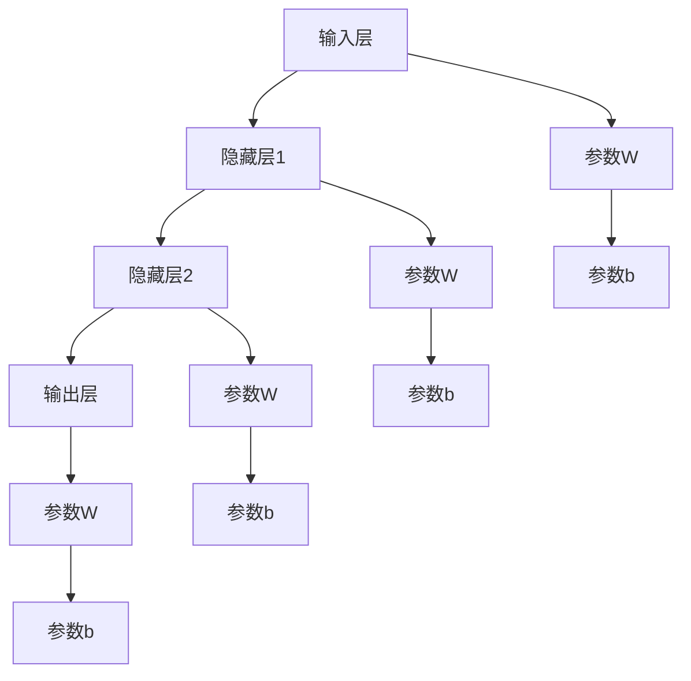

                 

# 神经网络：开启智能新纪元

在科技发展的长河中，每一次技术的突破都伴随着新纪元的开启。从电报到电话，从互联网到移动互联网，技术的应用为人类社会带来了深刻变革。如今，我们正处在人工智能(AI)的全新纪元，而神经网络(Neural Networks)作为AI的核心技术，为智能新纪元的到来打下了坚实的基础。

## 1. 背景介绍

### 1.1 问题由来

早在1943年，神经科学家罗森布拉特和斯珀林提出了神经网络的概念，其灵感来源于大脑的神经元网络。然而，受限于当时的计算资源和算法，神经网络的发展一度停滞。直到1980年代，随着计算机性能的飞速提升和反向传播(Backpropagation)算法的提出，神经网络开始重新焕发活力。

如今，神经网络已经成为深度学习中不可或缺的核心技术，广泛应用于计算机视觉、自然语言处理、语音识别、推荐系统等多个领域。尤其是深度卷积神经网络(Convolutional Neural Networks, CNNs)和循环神经网络(Recurrent Neural Networks, RNNs)，更是引领了计算机视觉和语音识别技术的大发展。

尽管神经网络技术已经取得了显著的进展，但在应用过程中仍面临一些挑战。如何设计高效的神经网络结构，如何优化训练过程，如何构建大规模、高效的神经网络系统，这些问题依然困扰着开发者和研究者。

### 1.2 问题核心关键点

神经网络的核心在于其强大的非线性映射能力和泛化能力。其主要包括以下几个关键点：

1. 非线性变换：通过多层神经元网络的堆叠，实现对输入数据的非线性变换，捕捉数据复杂的非线性特征。
2. 梯度下降：通过反向传播算法，不断优化模型参数，使得损失函数最小化，实现模型的精确拟合。
3. 正则化：通过L1、L2正则化、Dropout等手段，防止模型过拟合，提高泛化能力。
4. 数据增强：通过数据变换、扩充等手段，增加训练样本多样性，提升模型鲁棒性。
5. 多模态融合：将视觉、语音、文本等多种模态信息融合，实现跨模态的智能交互。

这些核心点构成了神经网络的基本框架，其演进和优化直接影响了AI技术的发展。

## 2. 核心概念与联系

### 2.1 核心概念概述

神经网络是一种模拟人脑神经元网络的计算模型，主要由输入层、隐藏层和输出层组成。每一层包含多个神经元，每个神经元接收输入数据并传递信号，最终将输入转换为输出。其核心思想是：通过多层非线性变换，将输入数据映射为输出数据。

为更好地理解神经网络的核心概念和架构，下面将通过Mermaid流程图展示其基本结构和工作流程：



### 2.2 核心概念原理和架构

神经网络的每个神经元接收输入并产生输出，公式如下：

$$
\text{输出} = \sigma\left(\text{输入} \times \text{权重} + \text{偏置}\right)
$$

其中，$\sigma$表示激活函数，权重$W$和偏置$b$为可学习的参数。

对于隐藏层，每一层输出都是上一层输出的非线性变换，公式如下：

$$
\text{隐藏层} = \sigma\left(\text{输入} \times \text{权重} + \text{偏置}\right)
$$

重复以上步骤，神经网络可以对输入数据进行多次非线性变换，最终输出期望的结果。

## 3. 核心算法原理 & 具体操作步骤

### 3.1 算法原理概述

神经网络的核心算法是反向传播算法(Backpropagation)，其目标是找到一组参数，使得神经网络输出与真实标签之间的差异最小化。反向传播算法通过链式法则计算损失函数对每个参数的偏导数，从而实现参数优化。

神经网络训练过程大致分为以下几个步骤：

1. 前向传播：将输入数据输入神经网络，经过多层非线性变换，得到最终输出。
2. 计算损失函数：将输出结果与真实标签比较，计算损失函数。
3. 反向传播：通过链式法则，计算损失函数对每个参数的偏导数。
4. 参数更新：使用梯度下降算法，根据偏导数更新每个参数的值。
5. 重复迭代：不断重复以上步骤，直至损失函数收敛或达到预设轮数。

### 3.2 算法步骤详解

以下是神经网络训练的具体步骤：

**Step 1: 数据准备**
- 收集训练集、验证集和测试集，每个样本包含输入数据和真实标签。
- 对输入数据进行预处理，如归一化、标准化、数据增强等。

**Step 2: 搭建网络架构**
- 定义神经网络的输入层、隐藏层和输出层的神经元数量，确定激活函数。
- 随机初始化权重和偏置参数。

**Step 3: 设置超参数**
- 确定学习率、优化器、批大小、迭代轮数等超参数。
- 选择正则化技术，如L1、L2正则化、Dropout等。

**Step 4: 前向传播**
- 将训练集数据分批次输入模型，前向传播计算每个神经元的输出。
- 使用激活函数将输出转化为最终结果。

**Step 5: 计算损失函数**
- 将模型输出与真实标签比较，计算损失函数。
- 将损失函数作为优化目标，度量模型预测结果与真实标签的差距。

**Step 6: 反向传播**
- 根据链式法则，反向计算损失函数对每个参数的偏导数。
- 将偏导数传递回每一层，更新权重和偏置参数。

**Step 7: 参数更新**
- 使用梯度下降算法，根据偏导数更新每个参数的值。
- 更新后返回模型，进入下一轮迭代。

**Step 8: 评估模型**
- 在验证集上评估模型性能，监控模型是否过拟合。
- 在测试集上评估模型泛化能力，验证模型效果。

### 3.3 算法优缺点

神经网络作为一种强大的机器学习算法，具有以下优点：

1. 非线性映射能力：通过多层非线性变换，可以逼近任意复杂的非线性函数，实现对输入数据的精细建模。
2. 泛化能力强：通过反向传播算法，不断优化模型参数，提高模型的泛化能力，减少过拟合。
3. 并行计算效率高：神经网络计算过程可以并行化，适合大规模数据集和高并行计算环境。
4. 易于优化：使用梯度下降等优化算法，可以高效地对模型参数进行优化。

然而，神经网络也存在一些缺点：

1. 需要大量数据：神经网络对训练数据的要求较高，需要大量的标注数据进行训练。
2. 模型复杂度高：神经网络模型参数量较大，训练和推理过程较为复杂。
3. 可解释性差：神经网络的内部工作机制难以解释，存在"黑盒"问题。
4. 训练耗时长：神经网络训练过程需要大量的计算资源和时间，耗时较长。
5. 局部最优解：反向传播算法存在梯度消失和梯度爆炸问题，易陷入局部最优解。

尽管存在这些局限性，但神经网络作为AI的核心技术，仍具有不可替代的重要价值。

### 3.4 算法应用领域

神经网络的应用范围十分广泛，以下列举几个典型的应用领域：

1. 计算机视觉：神经网络被广泛应用于图像识别、物体检测、人脸识别等领域。CNNs通过卷积操作提取图像特征，实现对视觉数据的有效建模。

2. 自然语言处理：神经网络在语言建模、文本分类、机器翻译、问答系统等方面表现优异。RNNs和Transformer模型通过循环和自注意力机制，捕捉语言序列的复杂关系。

3. 语音识别：神经网络在语音识别和语音合成中有着广泛应用，通过卷积和循环神经网络，实现对声音信号的建模和转换。

4. 推荐系统：神经网络在推荐系统中发挥着重要作用，通过学习用户行为和商品特征，实现个性化推荐。

5. 强化学习：神经网络在强化学习中用于决策模型的构建，通过与环境的互动，学习最优策略，实现智能决策。

## 4. 数学模型和公式 & 详细讲解 & 举例说明

### 4.1 数学模型构建

神经网络模型的数学模型通常包括输入数据、权重和偏置参数、激活函数、损失函数和优化算法等。以下以最简单的单层神经网络为例，介绍其数学模型构建。

设输入数据为 $\mathbf{x} \in \mathbb{R}^d$，权重为 $\mathbf{W} \in \mathbb{R}^{d \times m}$，偏置为 $\mathbf{b} \in \mathbb{R}^m$，激活函数为 $\sigma$，输出为 $\mathbf{y} \in \mathbb{R}^m$。则单层神经网络的数学模型为：

$$
\mathbf{y} = \sigma(\mathbf{x} \times \mathbf{W} + \mathbf{b})
$$

对于多层神经网络，其数学模型可以扩展为：

$$
\mathbf{y} = \sigma(\sigma(\ldots\sigma(\mathbf{x} \times \mathbf{W}_1 + \mathbf{b}_1) \times \mathbf{W}_2 + \mathbf{b}_2)\ldots)
$$

### 4.2 公式推导过程

以下是单层神经网络的反向传播算法及其公式推导：

设输入数据为 $\mathbf{x}$，真实标签为 $\mathbf{t}$，预测输出为 $\mathbf{y}$，损失函数为 $L$。则反向传播的算法流程如下：

1. 前向传播：
   $$
   \mathbf{y} = \sigma(\mathbf{x} \times \mathbf{W} + \mathbf{b})
   $$

2. 计算损失函数：
   $$
   L(\mathbf{y}, \mathbf{t}) = \frac{1}{2}\|\mathbf{y} - \mathbf{t}\|^2
   $$

3. 计算梯度：
   $$
   \frac{\partial L}{\partial \mathbf{y}} = \mathbf{y} - \mathbf{t}
   $$
   $$
   \frac{\partial L}{\partial \mathbf{W}} = \frac{\partial L}{\partial \mathbf{y}} \times \frac{\partial \mathbf{y}}{\partial \mathbf{x}} \times \mathbf{x}^T
   $$
   $$
   \frac{\partial L}{\partial \mathbf{b}} = \frac{\partial L}{\partial \mathbf{y}}
   $$

4. 更新参数：
   $$
   \mathbf{W} = \mathbf{W} - \eta \frac{\partial L}{\partial \mathbf{W}}
   $$
   $$
   \mathbf{b} = \mathbf{b} - \eta \frac{\partial L}{\partial \mathbf{b}}
   $$

其中，$\eta$为学习率，$\frac{\partial \mathbf{y}}{\partial \mathbf{x}}$表示前向传播过程中对输入数据 $\mathbf{x}$ 的导数，可以通过链式法则递归计算。

## 5. 项目实践：代码实例和详细解释说明

### 5.1 开发环境搭建

在进行神经网络开发前，我们需要准备好开发环境。以下是使用Python进行PyTorch开发的环境配置流程：

1. 安装Anaconda：从官网下载并安装Anaconda，用于创建独立的Python环境。

2. 创建并激活虚拟环境：
```bash
conda create -n pytorch-env python=3.8 
conda activate pytorch-env
```

3. 安装PyTorch：根据CUDA版本，从官网获取对应的安装命令。例如：
```bash
conda install pytorch torchvision torchaudio cudatoolkit=11.1 -c pytorch -c conda-forge
```

4. 安装各类工具包：
```bash
pip install numpy pandas scikit-learn matplotlib tqdm jupyter notebook ipython
```

完成上述步骤后，即可在`pytorch-env`环境中开始神经网络开发。

### 5.2 源代码详细实现

下面我们以简单的手写数字识别任务为例，给出使用PyTorch实现神经网络的代码实现。

首先，定义神经网络模型：

```python
import torch
import torch.nn as nn

class MNISTModel(nn.Module):
    def __init__(self, input_dim=784, hidden_dim=256, output_dim=10):
        super(MNISTModel, self).__init__()
        self.fc1 = nn.Linear(input_dim, hidden_dim)
        self.fc2 = nn.Linear(hidden_dim, output_dim)
        self.relu = nn.ReLU()
        
    def forward(self, x):
        x = x.view(-1, 28*28)
        x = self.fc1(x)
        x = self.relu(x)
        x = self.fc2(x)
        return x
```

然后，定义训练和评估函数：

```python
from torch.utils.data import DataLoader
from torchvision.datasets import MNIST
from torchvision.transforms import ToTensor
import torch.optim as optim

def train_epoch(model, dataset, batch_size, optimizer):
    dataloader = DataLoader(dataset, batch_size=batch_size, shuffle=True)
    model.train()
    epoch_loss = 0
    for batch in tqdm(dataloader, desc='Training'):
        x, y = batch
        x, y = x.to(device), y.to(device)
        optimizer.zero_grad()
        outputs = model(x)
        loss = criterion(outputs, y)
        epoch_loss += loss.item()
        loss.backward()
        optimizer.step()
    return epoch_loss / len(dataloader)

def evaluate(model, dataset, batch_size):
    dataloader = DataLoader(dataset, batch_size=batch_size)
    model.eval()
    preds, labels = [], []
    with torch.no_grad():
        for batch in tqdm(dataloader, desc='Evaluating'):
            x, y = batch
            x, y = x.to(device), y.to(device)
            outputs = model(x)
            _, preds = torch.max(outputs, 1)
            batch_preds = preds.to('cpu').tolist()
            batch_labels = y.to('cpu').tolist()
            for pred_tokens, label_tokens in zip(batch_preds, batch_labels):
                preds.append(pred_tokens)
                labels.append(label_tokens)
                
    print('Accuracy: {:.3f}'.format(accuracy_score(labels, preds)))
```

最后，启动训练流程并在测试集上评估：

```python
device = torch.device('cuda') if torch.cuda.is_available() else torch.device('cpu')

input_dim = 784
hidden_dim = 256
output_dim = 10
learning_rate = 0.001

# 数据准备
train_dataset = MNIST(root='data/', train=True, transform=ToTensor(), download=True)
test_dataset = MNIST(root='data/', train=False, transform=ToTensor(), download=True)

# 模型定义和优化器
model = MNISTModel(input_dim=input_dim, hidden_dim=hidden_dim, output_dim=output_dim).to(device)
criterion = nn.CrossEntropyLoss()
optimizer = optim.Adam(model.parameters(), lr=learning_rate)

# 训练过程
epochs = 10
batch_size = 64

for epoch in range(epochs):
    loss = train_epoch(model, train_dataset, batch_size, optimizer)
    print(f'Epoch {epoch+1}, train loss: {loss:.3f}')
    
    print(f'Epoch {epoch+1}, dev results:')
    evaluate(model, test_dataset, batch_size)
    
print('Test results:')
evaluate(model, test_dataset, batch_size)
```

以上就是使用PyTorch对简单的手写数字识别任务进行神经网络微调的完整代码实现。可以看到，借助PyTorch和TensorBoard等工具，开发神经网络变得简洁高效。

### 5.3 代码解读与分析

让我们再详细解读一下关键代码的实现细节：

**MNISTModel类**：
- `__init__`方法：定义神经网络的层数和激活函数，并随机初始化权重和偏置参数。
- `forward`方法：定义神经网络的前向传播过程，实现对输入数据的处理和计算。

**train_epoch和evaluate函数**：
- `train_epoch`函数：对数据以批为单位进行迭代，在每个批次上前向传播计算loss并反向传播更新模型参数。
- `evaluate`函数：与训练类似，不同点在于不更新模型参数，并在每个batch结束后将预测和标签结果存储下来，最后使用准确率等指标评估模型效果。

**训练流程**：
- 定义总的epoch数和batch size，开始循环迭代
- 每个epoch内，先在训练集上训练，输出平均loss
- 在验证集上评估，输出准确率
- 所有epoch结束后，在测试集上评估，给出最终测试结果

可以看到，神经网络的开发需要开发者对数学模型和算法有深刻的理解，才能编写出高效的代码。此外，合理利用工具和框架，如PyTorch、TensorBoard等，可以大幅提升开发效率和模型训练效果。

## 6. 实际应用场景

### 6.1 智能推荐系统

神经网络在智能推荐系统中有着广泛应用。传统的推荐系统通常基于用户的历史行为数据进行推荐，难以捕捉用户潜在的兴趣点。而神经网络模型通过学习用户行为和商品特征，可以更全面地理解用户兴趣，实现个性化推荐。

在实践中，神经网络推荐系统可以通过RNNs和CNNs等结构，捕捉时间序列和图像信息等特征。同时，结合注意力机制和交叉验证等技术，可以提升推荐系统的准确性和多样性。

### 6.2 自然语言处理

神经网络在自然语言处理(NLP)领域的应用十分广泛，以下列举几个典型场景：

1. 文本分类：使用RNNs和Transformer等模型，对文本进行分类，如新闻分类、情感分析等。
2. 机器翻译：使用RNNs和Transformer等模型，实现不同语言之间的翻译，如Google翻译。
3. 问答系统：使用RNNs和Transformer等模型，对自然语言问题进行理解和生成，如IBM Watson。
4. 对话系统：使用RNNs和Transformer等模型，实现机器与人类之间的自然对话，如Chatbot。

### 6.3 计算机视觉

神经网络在计算机视觉领域的应用也十分广泛，以下列举几个典型场景：

1. 图像识别：使用CNNs等模型，对图像进行分类、检测、分割等操作，如物体识别、人脸识别等。
2. 目标跟踪：使用RNNs等模型，对视频序列进行目标跟踪，如运动物体跟踪、行为分析等。
3. 场景生成：使用GANs等模型，生成逼真图像，如人脸生成、场景模拟等。

## 7. 工具和资源推荐

### 7.1 学习资源推荐

为了帮助开发者系统掌握神经网络的理论基础和实践技巧，这里推荐一些优质的学习资源：

1. 《深度学习》书籍：由Yoshua Bengio、Ian Goodfellow和Aaron Courville合著，全面介绍了深度学习的原理、算法和应用。
2. 《神经网络与深度学习》课程：由Michael Nielsen编写，通过互动式编程的方式，讲解神经网络的工作原理和训练过程。
3. CS231n《卷积神经网络》课程：斯坦福大学开设的计算机视觉课程，涵盖了卷积神经网络的原理和实践。
4. PyTorch官方文档：详细介绍了PyTorch框架的使用方法和API接口，是神经网络开发的重要参考。
5. TensorFlow官方文档：详细介绍了TensorFlow框架的使用方法和API接口，是神经网络开发的重要参考。

通过对这些资源的学习实践，相信你一定能够快速掌握神经网络的核心原理和应用技巧，并用于解决实际的AI问题。

### 7.2 开发工具推荐

高效的开发离不开优秀的工具支持。以下是几款用于神经网络开发的常用工具：

1. PyTorch：基于Python的开源深度学习框架，灵活动态的计算图，适合快速迭代研究。
2. TensorFlow：由Google主导开发的开源深度学习框架，生产部署方便，适合大规模工程应用。
3. Keras：基于Python的高级深度学习框架，易于上手，适合快速原型开发。
4. JAX：由Google开发的深度学习框架，支持高效自动微分和并行计算，适合高性能计算。
5. PyTorch Lightning：基于PyTorch的轻量级框架，提供高级API和丰富的插件，适合快速原型开发和生产部署。

合理利用这些工具，可以显著提升神经网络开发的效率和性能，加快创新迭代的步伐。

### 7.3 相关论文推荐

神经网络的发展源于学界的持续研究。以下是几篇奠基性的相关论文，推荐阅读：

1. "Deep Learning" by Yoshua Bengio, Ian Goodfellow, Aaron Courville：全面介绍了深度学习的理论基础和实践技巧。
2. "ImageNet Classification with Deep Convolutional Neural Networks" by Alex Krizhevsky, Ilya Sutskever, and Geoffrey Hinton：提出AlexNet模型，开启了深度卷积神经网络的时代。
3. "Language Models are Unsupervised Multitask Learners" by Alec Radford, Jeff Wu, Rewon Child, David Luan, Dario Amodei, and Ilya Sutskever：提出GPT模型，展示了语言模型的强大zero-shot学习能力。
4. "Convolutional Neural Networks for Image Classification" by Karen Simonyan and Andrew Zisserman：提出VGG模型，开创了深度卷积神经网络的先河。
5. "Diving into the CNN Zoo" by Aaron van den Oord and Nal Kalchbrenner：总结了多种卷积神经网络的结构和应用，为卷积神经网络的应用提供了丰富的参考。

这些论文代表了大规模神经网络的研究脉络。通过学习这些前沿成果，可以帮助研究者把握学科前进方向，激发更多的创新灵感。

## 8. 总结：未来发展趋势与挑战

### 8.1 研究成果总结

本文对神经网络的核心概念和应用进行了全面系统的介绍。首先，我们介绍了神经网络的基本原理和结构，并通过Mermaid流程图展示了其工作流程。其次，我们详细讲解了神经网络的数学模型和反向传播算法，并给出了完整的代码实现。最后，我们分析了神经网络的应用场景和未来发展趋势。

通过本文的系统梳理，可以看到，神经网络作为一种强大的机器学习算法，其非线性映射能力和泛化能力使其在多个领域取得了显著成效。未来的神经网络研究需要在模型结构、训练算法、优化方法等方面不断探索和创新，以实现更高效、更普适的智能系统。

### 8.2 未来发展趋势

展望未来，神经网络的发展将呈现以下几个趋势：

1. 模型结构更加复杂。随着神经网络结构的发展，未来将出现更加复杂的模型结构，如Transformer-XL、BERT等，实现对复杂序列数据的有效建模。
2. 分布式训练更加普及。神经网络训练过程需要大量的计算资源，分布式训练可以大幅提高训练效率。未来分布式训练将更加普及，应用于更多的实际场景中。
3. 迁移学习更加广泛。神经网络迁移学习可以将大规模预训练模型应用于新任务，实现更高效、更通用的智能系统。未来迁移学习将更加广泛地应用于实际应用中。
4. 模型压缩和加速更加高效。神经网络模型参数量巨大，计算资源需求高。未来，通过模型压缩和加速技术，可以大幅提高模型的推理速度和存储效率。
5. 端到端学习更加普遍。神经网络与自然语言处理、计算机视觉、语音识别等领域结合，实现端到端学习，提升系统的综合性能。

### 8.3 面临的挑战

尽管神经网络已经取得了显著的进展，但在迈向更加智能化、普适化应用的过程中，它仍面临诸多挑战：

1. 数据需求依然高。神经网络训练需要大量的标注数据，对于长尾应用场景，难以获得充足的高质量标注数据。
2. 计算资源消耗大。神经网络模型参数量巨大，计算资源消耗高，训练和推理过程耗时长。
3. 可解释性差。神经网络模型难以解释其内部工作机制，存在"黑盒"问题。
4. 鲁棒性不足。神经网络面对噪声、异常等干扰时，容易产生误判。
5. 模型易过拟合。神经网络模型容易过拟合，特别是在数据集较小的情况下。

尽管存在这些挑战，但神经网络作为AI的核心技术，仍具有不可替代的重要价值。相信未来，随着模型结构的不断优化和训练算法的持续改进，这些挑战终将得到解决。

### 8.4 研究展望

面对神经网络面临的挑战，未来的研究需要在以下几个方面寻求新的突破：

1. 探索更高效的模型结构。如Transformer-XL、BERT等，实现对复杂序列数据的有效建模。
2. 研究更高效的训练算法。如优化器、正则化等，提升神经网络训练效率和效果。
3. 开发更高效的模型压缩和加速技术。如知识蒸馏、模型剪枝、量化等，提高模型的推理速度和存储效率。
4. 探索更普适的迁移学习方法。如小样本学习、零样本学习等，提升神经网络的通用性和适应性。
5. 研究更可解释的模型解释技术。如LIME、SHAP等，增强模型的可解释性和可信度。

这些研究方向的探索，必将引领神经网络技术迈向更高的台阶，为构建安全、可靠、可解释、可控的智能系统铺平道路。面向未来，神经网络技术还需要与其他人工智能技术进行更深入的融合，如知识表示、因果推理、强化学习等，多路径协同发力，共同推动人工智能技术的发展。只有勇于创新、敢于突破，才能不断拓展神经网络技术的边界，让智能技术更好地造福人类社会。

## 9. 附录：常见问题与解答

**Q1：神经网络是否适用于所有数据类型？**

A: 神经网络通常适用于结构化数据，如图像、音频、文本等。对于非结构化数据，如时间序列数据、时序图像等，需要特殊处理才能输入神经网络。

**Q2：如何选择神经网络的激活函数？**

A: 激活函数的选择需要根据具体的任务和模型结构进行选择。常见的激活函数包括sigmoid、ReLU、Tanh等，ReLU是目前最常用的激活函数，具有速度快、易优化等优点。

**Q3：如何优化神经网络的训练过程？**

A: 优化神经网络的训练过程主要通过以下方式：
1. 使用更高效的优化算法，如Adam、RMSprop等，提升训练效率。
2. 引入正则化技术，如L1、L2正则化、Dropout等，防止过拟合。
3. 使用数据增强技术，如数据扩充、数据增强等，提升模型的泛化能力。
4. 使用早停策略，防止模型过拟合。

这些方法可以显著提升神经网络的训练效果，提高模型的泛化能力。

**Q4：神经网络在落地部署时需要注意哪些问题？**

A: 将神经网络模型转化为实际应用，还需要考虑以下因素：
1. 模型裁剪：去除不必要的层和参数，减小模型尺寸，加快推理速度。
2. 量化加速：将浮点模型转为定点模型，压缩存储空间，提高计算效率。
3. 服务化封装：将模型封装为标准化服务接口，便于集成调用。
4. 监控告警：实时采集系统指标，设置异常告警阈值，确保服务稳定性。
5. 安全防护：采用访问鉴权、数据脱敏等措施，保障数据和模型安全。

合理利用这些技术，可以显著提升神经网络模型的实际应用效果，确保其稳定性、可靠性和安全性。

---

作者：禅与计算机程序设计艺术 / Zen and the Art of Computer Programming

