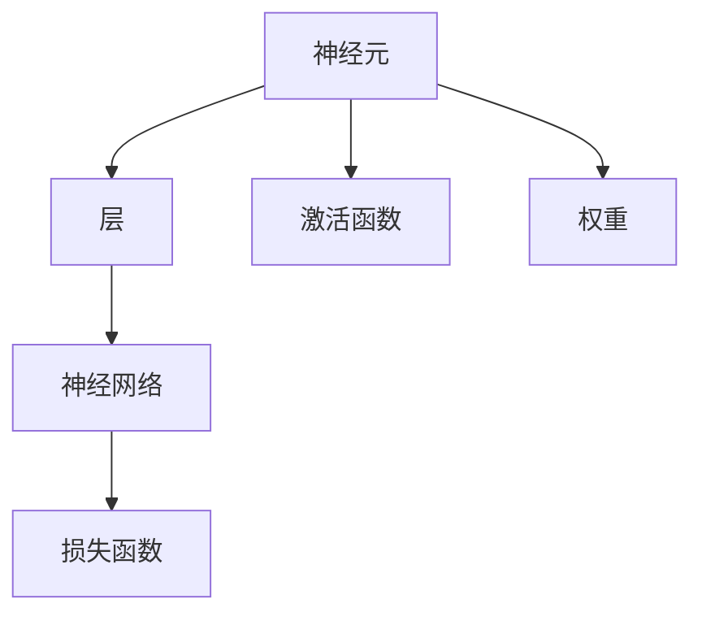

                 

# 神经网络：探索未知的领域

## 1. 背景介绍

### 1.1 问题由来
随着人工智能技术的迅猛发展，神经网络(Neural Networks)已成为研究的热点之一。然而，神经网络为何能如此高效地处理复杂问题，其背后的原理和机制仍然存在诸多未解之谜。本文旨在探索神经网络的未知领域，深入理解其工作机制，为未来神经网络研究和应用提供新的视角。

### 1.2 问题核心关键点
神经网络的核心在于其强大的模式识别和预测能力。神经网络通过多层次的非线性映射，能够高效地从大量数据中提取高层次的特征表示，从而实现复杂非线性的学习任务。然而，这一过程的具体数学原理和计算方法仍未完全明确，使得神经网络在工程实践中仍然存在许多挑战和困惑。

### 1.3 问题研究意义
深入研究神经网络的工作原理和计算方法，对于推动人工智能技术的发展，探索智能系统的一般原理具有重要意义。理解神经网络的核心机制，不仅有助于优化现有的神经网络结构，更可以为未来的研究提供理论支持，引领人工智能技术的突破。

## 2. 核心概念与联系

### 2.1 核心概念概述

神经网络(Neural Networks)是一种由多个神经元通过连接组成的网络结构，用于处理和预测数据。它通过模拟人脑的神经元工作机制，实现了数据的非线性变换和复杂模式的识别。

- **神经元(Neuron)**：神经网络的基本单元，接收输入数据，通过加权求和和激活函数计算输出。
- **层(Layer)**：神经网络的基本组成单元，由多个神经元按顺序连接组成。
- **权重(Weight)**：神经元之间的连接强度，通过学习算法进行优化。
- **激活函数(Activation Function)**：神经元输出的非线性函数，常用的有Sigmoid、ReLU、Tanh等。
- **损失函数(Loss Function)**：衡量模型预测与真实标签之间差异的函数，用于指导模型的训练。

### 2.2 核心概念原理和架构的 Mermaid 流程图



这个流程图展示了神经网络的基本架构和核心概念：

1. 神经元接收输入数据，通过权重和激活函数计算输出。
2. 多个神经元按顺序连接组成层。
3. 神经网络通过多层非线性变换，将输入数据映射到高层次的特征表示。
4. 损失函数衡量模型预测与真实标签之间的差异，指导模型训练。

## 3. 核心算法原理 & 具体操作步骤

### 3.1 算法原理概述

神经网络的核心原理是利用多层非线性变换，通过反向传播算法优化权重，实现数据的复杂模式识别。其主要流程包括前向传播和反向传播两个阶段。

- **前向传播(Forward Propagation)**：将输入数据通过多层神经元计算，得到最终的预测输出。
- **反向传播(Backpropagation)**：根据预测输出与真实标签的差异，反向传播误差信号，调整神经元之间的权重，更新模型参数。

神经网络的训练过程主要依赖于优化算法和损失函数。常见的优化算法包括梯度下降(GD)、Adam、Adagrad等，损失函数则根据具体任务选择，如均方误差、交叉熵等。

### 3.2 算法步骤详解

神经网络的训练过程可以总结为以下几个关键步骤：

**Step 1: 初始化模型参数**
- 随机初始化神经网络的权重和偏置。

**Step 2: 前向传播**
- 将输入数据依次通过各层神经元计算，得到最终输出。

**Step 3: 计算损失**
- 根据预测输出与真实标签计算损失函数，衡量模型预测的准确性。

**Step 4: 反向传播**
- 将误差信号反向传播到各层神经元，计算梯度。

**Step 5: 参数更新**
- 使用优化算法更新模型参数，最小化损失函数。

**Step 6: 重复训练**
- 重复执行上述步骤，直至模型收敛。

### 3.3 算法优缺点

神经网络的主要优点包括：

1. 强大的非线性映射能力：多层非线性变换可以处理复杂非线性的学习任务。
2. 自动特征提取：通过反向传播算法自动学习数据的高级特征表示。
3. 模型泛化能力强：经过充分训练的神经网络能够适应新数据的泛化能力。

然而，神经网络也存在一些缺点：

1. 计算资源需求高：神经网络的训练和推理需要大量的计算资源。
2. 过拟合风险大：神经网络的模型复杂度高，容易过拟合。
3. 模型难以解释：神经网络的决策过程缺乏可解释性。
4. 参数调优复杂：需要调整的超参数众多，调试复杂。

### 3.4 算法应用领域

神经网络广泛应用于图像识别、自然语言处理、语音识别、推荐系统等多个领域。

- **图像识别**：通过卷积神经网络(Convolutional Neural Networks, CNNs)实现图像分类、目标检测等任务。
- **自然语言处理**：通过循环神经网络(Recurrent Neural Networks, RNNs)和Transformer等架构实现文本分类、情感分析、机器翻译等任务。
- **语音识别**：通过长短时记忆网络(Recurrent Neural Networks, RNNs)实现语音识别、语音合成等任务。
- **推荐系统**：通过协同过滤和深度学习模型实现个性化推荐等任务。

## 4. 数学模型和公式 & 详细讲解 & 举例说明

### 4.1 数学模型构建

假设神经网络包含$n$个输入特征，$m$个隐藏层神经元，$l$个输出特征。神经网络的结构可以用以下公式表示：

$$
\begin{aligned}
&h_1 = W_1x + b_1 \\
&h_2 = W_2h_1 + b_2 \\
&\cdots \\
&h_l = W_lh_{l-1} + b_l
\end{aligned}
$$

其中$x$表示输入向量，$h_i$表示第$i$层神经元的输出向量，$W_i$和$b_i$分别表示第$i$层的权重和偏置。最终的输出向量为$h_l$。

### 4.2 公式推导过程

对于任意一层神经元$i$，其输出为：

$$
h_i = f(W_ih_{i-1} + b_i)
$$

其中$f$表示激活函数。假设激活函数为ReLU，则有：

$$
h_i = \max(0, W_ih_{i-1} + b_i)
$$

对于一个神经网络，其损失函数可以定义为：

$$
L = \frac{1}{N} \sum_{i=1}^N ||y_i - f(W_lh_{l-1} + b_l)||^2
$$

其中$y_i$表示第$i$个样本的真实标签，$||\cdot||$表示欧氏距离。

### 4.3 案例分析与讲解

以MNIST手写数字识别任务为例，解释神经网络的训练过程。假设神经网络包含一个输入层、两个隐藏层和一个输出层，每层神经元个数分别为784、256和10。训练数据集为MNIST数据集，每个样本为28x28的灰度图像。

1. **初始化参数**：随机初始化权重和偏置。
2. **前向传播**：将输入图像$x$通过神经网络计算，得到输出向量$h_l$。
3. **计算损失**：根据预测输出$h_l$和真实标签$y$计算损失函数$L$。
4. **反向传播**：计算梯度，将误差信号反向传播到各层神经元。
5. **参数更新**：使用Adam优化算法更新模型参数。
6. **重复训练**：重复执行上述步骤，直至模型收敛。

最终，经过充分训练的神经网络能够准确识别MNIST数据集中的手写数字，实现了复杂的模式识别任务。

## 5. 项目实践：代码实例和详细解释说明

### 5.1 开发环境搭建

要进行神经网络的项目实践，首先需要配置好开发环境。以下是使用Python进行TensorFlow开发的配置流程：

1. 安装Anaconda：从官网下载并安装Anaconda，用于创建独立的Python环境。

2. 创建并激活虚拟环境：
```bash
conda create -n tf-env python=3.8
conda activate tf-env
```

3. 安装TensorFlow：
```bash
conda install tensorflow
```

4. 安装其他必要的工具包：
```bash
pip install numpy matplotlib scikit-learn pandas
```

完成上述步骤后，即可在`tf-env`环境中进行TensorFlow项目开发。

### 5.2 源代码详细实现

以下是一个使用TensorFlow实现卷积神经网络(CNN)进行图像分类的示例代码。

```python
import tensorflow as tf
from tensorflow.keras import datasets, layers, models

# 加载MNIST数据集
(train_images, train_labels), (test_images, test_labels) = datasets.mnist.load_data()

# 数据预处理
train_images = train_images.reshape((60000, 28, 28, 1))
train_images = train_images / 255.0

test_images = test_images.reshape((10000, 28, 28, 1))
test_images = test_images / 255.0

# 定义模型结构
model = models.Sequential()
model.add(layers.Conv2D(32, (3, 3), activation='relu', input_shape=(28, 28, 1)))
model.add(layers.MaxPooling2D((2, 2)))
model.add(layers.Conv2D(64, (3, 3), activation='relu'))
model.add(layers.MaxPooling2D((2, 2)))
model.add(layers.Conv2D(64, (3, 3), activation='relu'))
model.add(layers.Flatten())
model.add(layers.Dense(64, activation='relu'))
model.add(layers.Dense(10))

# 编译模型
model.compile(optimizer='adam',
              loss=tf.keras.losses.SparseCategoricalCrossentropy(from_logits=True),
              metrics=['accuracy'])

# 训练模型
model.fit(train_images, train_labels, epochs=5, 
          validation_data=(test_images, test_labels))

# 评估模型
test_loss, test_acc = model.evaluate(test_images,  test_labels, verbose=2)
print('\nTest accuracy:', test_acc)
```

### 5.3 代码解读与分析

让我们再详细解读一下关键代码的实现细节：

**数据预处理**：
- 将MNIST数据集中的图像转换为三维张量，并进行归一化处理。

**模型结构定义**：
- 使用Sequential模型定义卷积神经网络结构，包含多个卷积层、池化层和全连接层。

**模型编译**：
- 定义优化器、损失函数和评价指标，编译模型。

**模型训练**：
- 使用训练数据集进行模型训练，定义训练轮数和验证集。

**模型评估**：
- 在测试数据集上评估模型性能，输出测试精度。

可以看到，TensorFlow提供了强大的API，使神经网络的构建和训练变得简单高效。开发者可以更加专注于模型设计和训练策略的优化，而不必过多关注底层实现细节。

## 6. 实际应用场景

### 6.1 图像识别

卷积神经网络(CNN)在图像识别领域表现出色，广泛应用于医学影像诊断、自动驾驶、安防监控等多个场景。通过在卷积层和池化层中提取图像的局部特征，CNN能够高效地识别复杂图像模式，实现准确的图像分类和目标检测。

### 6.2 自然语言处理

循环神经网络(RNN)和Transformer等架构在自然语言处理领域得到了广泛应用。通过在RNN或Transformer中引入多层非线性映射，能够处理文本序列的复杂模式，实现文本分类、情感分析、机器翻译等任务。

### 6.3 语音识别

循环神经网络(RNN)在语音识别领域表现出色。通过在RNN中引入长短时记忆网络(LSTM)或门控循环单元(GRU)，能够处理语音信号的序列特征，实现高精度的语音识别和语音合成。

### 6.4 推荐系统

协同过滤和深度学习模型在推荐系统中得到了广泛应用。通过构建用户-物品的协同矩阵，协同过滤能够高效地预测用户对物品的评分。而深度学习模型通过多层非线性变换，能够从大量用户行为数据中提取高层次的特征表示，实现个性化推荐。

## 7. 工具和资源推荐

### 7.1 学习资源推荐

为了帮助开发者系统掌握神经网络的理论基础和实践技巧，这里推荐一些优质的学习资源：

1. 《深度学习》系列书籍：Ian Goodfellow、Yoshua Bengio、Aaron Courville所著，系统介绍了深度学习的原理和实践。
2. CS231n《卷积神经网络》课程：斯坦福大学开设的计算机视觉课程，提供了丰富的深度学习实践案例。
3. CS224n《自然语言处理》课程：斯坦福大学开设的自然语言处理课程，涵盖了NLP的广泛知识。
4. CS373《强化学习》课程：斯坦福大学开设的强化学习课程，介绍了深度学习在强化学习中的应用。
5. 《神经网络与深度学习》书籍：Michael Nielsen所著，通俗易懂地介绍了神经网络的基本原理和计算方法。

通过对这些资源的学习实践，相信你一定能够快速掌握神经网络的核心机制，并用于解决实际的深度学习问题。

### 7.2 开发工具推荐

高效的深度学习开发离不开优秀的工具支持。以下是几款用于神经网络开发的常用工具：

1. TensorFlow：由Google主导开发的开源深度学习框架，生产部署方便，适合大规模工程应用。
2. PyTorch：Facebook开发的开源深度学习框架，灵活易用，适合快速迭代研究。
3. Keras：高层API，基于TensorFlow和Theano，简化了深度学习模型的构建和训练。
4. JAX：由Google开发的高级Python库，支持自动微分和分布式计算，提升了深度学习模型的开发效率。
5. MXNet：由Apache开发的深度学习框架，支持多种编程语言，适用于多种计算平台。

合理利用这些工具，可以显著提升神经网络的开发效率，加快创新迭代的步伐。

### 7.3 相关论文推荐

神经网络技术的发展源于学界的持续研究。以下是几篇奠基性的相关论文，推荐阅读：

1. 《深度学习》书籍：Ian Goodfellow、Yoshua Bengio、Aaron Courville所著，全面介绍了深度学习的原理和实践。
2. 《卷积神经网络》论文：Yann LeCun、Geoffrey Hinton、Sung Taegyoon Lee所著，介绍了卷积神经网络的结构和应用。
3. 《循环神经网络》论文：Yann LeCun、Geoffrey Hinton、Ronald J. Williams所著，介绍了循环神经网络的结构和应用。
4. 《Transformer》论文：Ashish Vaswani等人所著，介绍了Transformer的结构和应用。
5. 《残差网络》论文：Kaiming He等人所著，介绍了残差网络的架构和训练技巧。

这些论文代表了大神经网络技术的发展脉络。通过学习这些前沿成果，可以帮助研究者把握学科前进方向，激发更多的创新灵感。

## 8. 总结：未来发展趋势与挑战

### 8.1 总结

本文对神经网络的核心原理和计算方法进行了全面系统的介绍。首先阐述了神经网络的工作机制和应用场景，明确了神经网络在深度学习中的重要地位。其次，从原理到实践，详细讲解了神经网络的数学模型和训练过程，给出了神经网络开发的完整代码实例。同时，本文还探讨了神经网络在多个行业领域的应用前景，展示了神经网络技术的广泛应用潜力。

通过本文的系统梳理，可以看到，神经网络在图像识别、自然语言处理、语音识别、推荐系统等多个领域得到了广泛应用，推动了人工智能技术的产业化进程。未来，伴随神经网络技术的不断演进，相信神经网络必将在更广阔的应用领域大放异彩，深刻影响人类的生产生活方式。

### 8.2 未来发展趋势

展望未来，神经网络技术将呈现以下几个发展趋势：

1. 模型规模持续增大。随着算力成本的下降和数据规模的扩张，神经网络模型将不断增大，推动深度学习技术的进一步发展。
2. 模型结构更加复杂。未来神经网络将融合更多先验知识，引入更多的层级和分支，实现更加复杂和精确的模型结构。
3. 模型泛化能力增强。经过充分训练的神经网络将具备更强的泛化能力，能够适应更多领域和场景的复杂问题。
4. 模型训练效率提升。通过优化算法和硬件设备的改进，神经网络模型将能够更快地训练和推理，降低计算成本。
5. 模型解释性增强。未来的神经网络将更加注重可解释性，能够提供更加透明的决策过程和推理逻辑。
6. 模型安全性提升。神经网络将引入更多的安全机制，防止恶意攻击和误导性输出，保障系统的稳定性和安全性。

以上趋势凸显了神经网络技术的广阔前景。这些方向的探索发展，必将进一步推动深度学习技术的进步，引领人工智能技术的突破。

### 8.3 面临的挑战

尽管神经网络技术已经取得了瞩目成就，但在迈向更加智能化、普适化应用的过程中，它仍面临着诸多挑战：

1. 计算资源瓶颈。神经网络模型往往具有高参数、高计算需求，对硬件设备要求较高。如何优化神经网络模型的计算效率，降低计算成本，是未来需要解决的重要问题。
2. 模型过拟合风险。神经网络模型复杂度高，容易过拟合。如何在保持模型复杂度的同时，提高泛化能力，防止过拟合，是未来研究的重要方向。
3. 模型可解释性不足。神经网络模型通常缺乏可解释性，难以理解其内部决策过程。如何在保持模型性能的同时，增强可解释性，是未来需要解决的重要问题。
4. 模型安全性问题。神经网络模型可能被攻击者利用进行恶意行为，如何增强模型安全性，防止恶意攻击，是未来需要解决的重要问题。
5. 模型公平性问题。神经网络模型可能存在偏见和歧视，如何提升模型的公平性和公正性，是未来需要解决的重要问题。

这些挑战凸显了神经网络技术的复杂性和不确定性。只有在技术、工程、伦理等多个维度进行全面优化，才能真正实现神经网络技术的落地应用。

### 8.4 研究展望

面对神经网络面临的种种挑战，未来的研究需要在以下几个方面寻求新的突破：

1. 探索高效的模型压缩和量化技术。通过模型压缩和量化，降低神经网络模型的计算资源需求，提升模型的推理速度和效率。
2. 研究更加高效的模型训练方法。通过自监督学习、迁移学习等方法，降低神经网络模型对标注数据的依赖，提升模型的泛化能力。
3. 引入更多先验知识。将符号化的先验知识，如知识图谱、逻辑规则等，与神经网络模型进行巧妙融合，提升模型的泛化能力和鲁棒性。
4. 结合因果分析和博弈论工具。将因果分析方法引入神经网络模型，增强模型的因果推理能力，防止模型的脆弱性，提高系统的稳定性。
5. 引入更多的安全机制。在神经网络模型中加入更多的安全机制，防止恶意攻击和误导性输出，保障系统的稳定性和安全性。
6. 引入更多的伦理机制。在神经网络模型的训练和应用中，引入更多的伦理机制，防止模型偏见和歧视，提升模型的公平性和公正性。

这些研究方向的探索，必将引领神经网络技术的进步，推动人工智能技术的突破。未来，神经网络技术必将在更广阔的应用领域大放异彩，深刻影响人类的生产生活方式。

## 9. 附录：常见问题与解答

**Q1：神经网络为何能够处理复杂问题？**

A: 神经网络通过多层非线性变换，能够高效地从大量数据中提取高层次的特征表示，实现复杂非线性的学习任务。其核心在于通过反向传播算法优化权重，使模型能够学习到数据的高级特征表示。

**Q2：神经网络为何需要大规模训练数据？**

A: 神经网络模型复杂度高，需要大量的训练数据进行充分训练。只有通过充分训练，神经网络模型才能学习到数据的高级特征表示，提高泛化能力。

**Q3：神经网络为何难以解释？**

A: 神经网络模型的决策过程通常缺乏可解释性，难以理解其内部工作机制和决策逻辑。未来需要通过引入可解释性机制，增强模型的可解释性。

**Q4：神经网络为何容易过拟合？**

A: 神经网络模型复杂度高，容易过拟合。可以通过正则化、dropout等方法，防止模型过拟合，提升模型的泛化能力。

**Q5：神经网络为何需要优化算法？**

A: 神经网络模型的训练过程需要进行优化，通过优化算法最小化损失函数，使模型参数不断优化，提升模型性能。

这些问题的解答，可以帮助开发者更好地理解神经网络的核心机制，提高模型设计和训练的效率。

---

作者：禅与计算机程序设计艺术 / Zen and the Art of Computer Programming

