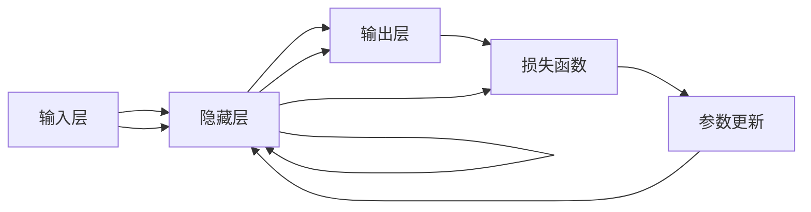

                 

# 神经网络：机器学习的新范式

## 1. 背景介绍

### 1.1 问题由来

自20世纪80年代以来，人工智能(AI)领域发生了革命性变化，从传统的符号主义人工智能(Symbolic AI)转向了基于数据驱动的机器学习(ML)。随着计算机硬件的飞速发展，大规模数据集的广泛可用，以及深度学习(Deep Learning, DL)技术的突破，机器学习进入了一个新的纪元。

其中，神经网络(Neural Networks, NN)作为机器学习的一种核心方法，凭借其强大的表达能力和泛化能力，成为引领AI发展的重要力量。从早期的感知机(Perceptron)、多层感知器(Multilayer Perceptron, MLP)，到近期的卷积神经网络(Convolutional Neural Networks, CNN)、循环神经网络(Recurrent Neural Networks, RNN)和深度神经网络(Deep Neural Networks, DNN)，神经网络技术不断演进，并在图像识别、语音处理、自然语言处理(NLP)等诸多领域取得了令人瞩目的成果。

神经网络不仅在技术上取得了巨大突破，还在实践中不断拓展其应用边界，如图像分类、目标检测、语音识别、机器翻译、自然语言生成等，为各行各业带来了革命性变革。

### 1.2 问题核心关键点

本文聚焦于神经网络，即机器学习的新范式，深入探讨了神经网络的基本原理、算法实现、应用场景及未来发展方向。神经网络通过模拟生物神经系统的结构与功能，实现了对复杂非线性关系的建模，成为了现代机器学习中最强大、最具代表性的方法之一。

神经网络的核心思想是利用大量的人工神经元，通过多层堆叠和复杂连接，实现对高维输入数据的映射和分类。具体来说，神经网络通常由输入层、若干隐藏层和输出层组成，每层之间通过权值和偏置进行连接，并通过反向传播算法(BP)进行参数优化。

神经网络的优点在于：
- 强大的表达能力：可以处理高维、非线性的数据，并具有可扩展性。
- 自动特征提取：通过多层非线性变换，自动提取数据特征，减少了特征工程的复杂度。
- 泛化能力强：在大量数据上训练的神经网络，具有较好的泛化能力，能够在新数据上表现出色。

然而，神经网络也存在一些局限性：
- 计算复杂度高：大规模神经网络的训练和推理需要大量的计算资源和时间。
- 可解释性差：神经网络的决策过程通常是"黑箱"，难以解释其内部工作机制。
- 数据依赖性强：需要大量标注数据进行训练，且对于新数据的泛化能力有限。

尽管存在这些局限，神经网络仍因其强大的表达能力和泛化能力，成为了当前机器学习领域的核心方法之一，值得深入研究和学习。

## 2. 核心概念与联系

### 2.1 核心概念概述

为更好地理解神经网络的基本原理和算法实现，本节将介绍几个核心概念：

- 神经元(Neuron)：神经网络的基本单位，通过接收输入、加权求和、激活函数等操作，实现信息的处理和传递。
- 权重(Weight)：连接神经元之间的参数，通过学习得到最优值。
- 偏置(Bias)：用于调整激活函数的输出，帮助模型更好地拟合数据。
- 激活函数(Activation Function)：用于引入非线性变换，增强模型的表达能力。
- 反向传播算法(Backpropagation)：一种基于梯度的参数优化算法，通过链式法则计算梯度，更新模型参数。
- 损失函数(Loss Function)：衡量模型预测输出与真实标签之间的差异，用于优化模型参数。

这些核心概念之间的逻辑关系可以通过以下Mermaid流程图来展示：



这个流程图展示了大规模神经网络的基本结构：

1. 输入层接收原始数据，通过连接权值和偏置，传递给隐藏层。
2. 隐藏层经过多次非线性变换，逐步提取数据特征。
3. 输出层对隐藏层处理后的特征进行映射，得到最终预测结果。
4. 损失函数衡量预测结果与真实标签之间的差异。
5. 通过反向传播算法，计算梯度并更新模型参数，最小化损失函数。

## 3. 核心算法原理 & 具体操作步骤

### 3.1 算法原理概述

神经网络是一种通过多层非线性变换进行数据建模的机器学习算法。其核心思想是利用人工神经元，通过连接权值和偏置，模拟生物神经系统的结构和功能，实现对复杂非线性关系的建模。

在训练过程中，神经网络通过反向传播算法(BP)，利用损失函数(Loss Function)对模型参数进行优化。具体来说，BP算法将输出误差从输出层反向传播到输入层，通过链式法则计算各层参数的梯度，并据此更新模型权重和偏置，最小化损失函数，使得模型预测结果尽可能接近真实标签。

神经网络的参数优化目标通常可以表示为：

$$
\min_{\theta} \mathcal{L}(\theta) = \frac{1}{N} \sum_{i=1}^N \ell(y_i, \hat{y}_i)
$$

其中，$\theta$ 为模型参数，$\mathcal{L}$ 为损失函数，$\ell$ 为样本损失函数，$y_i$ 为真实标签，$\hat{y}_i$ 为模型预测结果。

### 3.2 算法步骤详解

神经网络的训练通常包括以下几个关键步骤：

**Step 1: 数据准备**
- 准备训练集、验证集和测试集，划分为训练集、验证集和测试集。
- 对数据进行预处理，如归一化、标准化、数据增强等。

**Step 2: 模型初始化**
- 随机初始化神经网络的权重和偏置。
- 设置损失函数和优化器，如交叉熵损失、SGD、Adam等。

**Step 3: 前向传播**
- 将输入数据传递给神经网络，通过各层神经元计算得到输出结果。

**Step 4: 计算损失**
- 将模型预测结果与真实标签进行比较，计算损失函数值。

**Step 5: 反向传播**
- 利用链式法则计算损失函数对各层参数的梯度。
- 根据梯度更新模型参数，最小化损失函数。

**Step 6: 验证和调整**
- 在验证集上评估模型性能，调整超参数，如学习率、批大小等。
- 重复上述步骤直至收敛或达到预设轮数。

**Step 7: 测试和部署**
- 在测试集上评估模型性能，对比训练前后的精度提升。
- 使用模型进行推理预测，集成到实际应用系统中。

以上是神经网络训练的一般流程。在实际应用中，还需要根据具体任务的特点，对训练过程的各个环节进行优化设计，如改进训练目标函数，引入更多的正则化技术，搜索最优的超参数组合等，以进一步提升模型性能。

### 3.3 算法优缺点

神经网络作为一种机器学习算法，具有以下优点：
- 强大的表达能力：能够处理高维、非线性的数据，并具有可扩展性。
- 自动特征提取：通过多层非线性变换，自动提取数据特征，减少了特征工程的复杂度。
- 泛化能力强：在大量数据上训练的神经网络，具有较好的泛化能力，能够在新数据上表现出色。

同时，神经网络也存在一些局限性：
- 计算复杂度高：大规模神经网络的训练和推理需要大量的计算资源和时间。
- 可解释性差：神经网络的决策过程通常是"黑箱"，难以解释其内部工作机制。
- 数据依赖性强：需要大量标注数据进行训练，且对于新数据的泛化能力有限。

尽管存在这些局限，神经网络仍因其强大的表达能力和泛化能力，成为了当前机器学习领域的核心方法之一，值得深入研究和学习。

### 3.4 算法应用领域

神经网络作为一种通用的人工智能方法，已经在诸多领域得到了广泛的应用，包括但不限于：

- 计算机视觉：如图像分类、目标检测、图像生成等。
- 自然语言处理：如文本分类、情感分析、机器翻译等。
- 语音识别：如语音识别、说话人识别、语音合成等。
- 机器人学：如路径规划、动作控制、行为学习等。
- 生物信息学：如基因序列分析、蛋白质结构预测等。
- 游戏AI：如游戏策略学习、角色控制等。
- 自动驾驶：如环境感知、路径规划、决策控制等。

除此之外，神经网络还被创新性地应用到更多场景中，如可控图像生成、知识图谱构建、情绪识别等，为人工智能技术带来了全新的突破。随着神经网络技术的不断进步，相信神经网络必将在更广阔的应用领域大放异彩。

## 4. 数学模型和公式 & 详细讲解  
### 4.1 数学模型构建

本节将使用数学语言对神经网络的基本原理和算法实现进行更加严格的刻画。

记神经网络模型为 $M_{\theta}(x)$，其中 $\theta$ 为模型参数，$x$ 为输入数据。定义模型在数据集 $D=\{(x_i,y_i)\}_{i=1}^N$ 上的损失函数为 $\mathcal{L}(\theta) = \frac{1}{N} \sum_{i=1}^N \ell(M_{\theta}(x_i),y_i)$，其中 $\ell$ 为样本损失函数。

神经网络的前向传播过程可以表示为：

$$
z_l = \sum_{i=1}^n w_{il} a_{i-1}
$$

$$
a_l = f(z_l) = \begin{cases}
tanh(z_l) & l \neq 0 \\
softmax(z_l) & l = n
\end{cases}
$$

其中 $z_l$ 为层 $l$ 的输入，$w_{il}$ 为连接第 $i$ 个神经元和第 $l$ 层的权重，$a_l$ 为层 $l$ 的输出，$f$ 为激活函数。

神经网络的反向传播过程通过链式法则计算梯度，更新模型参数：

$$
\frac{\partial \mathcal{L}}{\partial w_{il}} = \frac{\partial \ell}{\partial z_l} \frac{\partial z_l}{\partial w_{il}}
$$

$$
\frac{\partial \mathcal{L}}{\partial a_l} = \frac{\partial \ell}{\partial z_l} \frac{\partial z_l}{\partial a_l} = \frac{\partial \ell}{\partial z_l} f'(z_l)
$$

通过上述公式，神经网络可以高效地计算损失函数对各层参数的梯度，并进行参数更新，最小化损失函数。

### 4.2 公式推导过程

以下我们以二分类任务为例，推导交叉熵损失函数及其梯度的计算公式。

假设模型 $M_{\theta}$ 在输入 $x$ 上的输出为 $\hat{y}=M_{\theta}(x)$，表示样本属于正类的概率。真实标签 $y \in \{0,1\}$。则二分类交叉熵损失函数定义为：

$$
\ell(M_{\theta}(x),y) = -[y\log \hat{y} + (1-y)\log (1-\hat{y})]
$$

将其代入损失函数公式，得：

$$
\mathcal{L}(\theta) = -\frac{1}{N}\sum_{i=1}^N [y_i\log M_{\theta}(x_i)+(1-y_i)\log(1-M_{\theta}(x_i))]
$$

根据链式法则，损失函数对参数 $\theta_k$ 的梯度为：

$$
\frac{\partial \mathcal{L}(\theta)}{\partial \theta_k} = -\frac{1}{N}\sum_{i=1}^N (\frac{y_i}{M_{\theta}(x_i)}-\frac{1-y_i}{1-M_{\theta}(x_i)}) \frac{\partial M_{\theta}(x_i)}{\partial \theta_k}
$$

其中 $\frac{\partial M_{\theta}(x_i)}{\partial \theta_k}$ 可进一步递归展开，利用自动微分技术完成计算。

在得到损失函数的梯度后，即可带入参数更新公式，完成模型的迭代优化。重复上述过程直至收敛，最终得到适应下游任务的最优模型参数 $\theta^*$。

## 5. 项目实践：代码实例和详细解释说明
### 5.1 开发环境搭建

在进行神经网络开发前，我们需要准备好开发环境。以下是使用Python进行TensorFlow开发的环境配置流程：

1. 安装Anaconda：从官网下载并安装Anaconda，用于创建独立的Python环境。

2. 创建并激活虚拟环境：
```bash
conda create -n tensorflow-env python=3.8 
conda activate tensorflow-env
```

3. 安装TensorFlow：根据CUDA版本，从官网获取对应的安装命令。例如：
```bash
conda install tensorflow -c tensorflow -c conda-forge
```

4. 安装各类工具包：
```bash
pip install numpy pandas scikit-learn matplotlib tqdm jupyter notebook ipython
```

完成上述步骤后，即可在`tensorflow-env`环境中开始神经网络实践。

### 5.2 源代码详细实现

下面我们以手写数字识别(MNIST)任务为例，给出使用TensorFlow和Keras进行神经网络开发的PyTorch代码实现。

首先，定义神经网络模型：

```python
import tensorflow as tf
from tensorflow.keras import layers

class NeuralNetwork(tf.keras.Model):
    def __init__(self):
        super(NeuralNetwork, self).__init__()
        self.flatten = layers.Flatten()
        self.d1 = layers.Dense(128, activation='relu')
        self.d2 = layers.Dense(10)

    def call(self, x):
        x = self.flatten(x)
        x = self.d1(x)
        return self.d2(x)
```

然后，定义训练和评估函数：

```python
import numpy as np
import matplotlib.pyplot as plt

def train_epoch(model, dataset, batch_size, optimizer):
    dataloader = tf.data.Dataset.from_tensor_slices(
        (dataset.images, dataset.labels)).batch(batch_size).shuffle(buffer_size=1024).repeat()
    model.train()
    epoch_loss = 0
    for batch in dataloader:
        with tf.GradientTape() as tape:
            x = batch[0]
            y = batch[1]
            logits = model(x, training=True)
            loss = tf.reduce_mean(tf.keras.losses.sparse_categorical_crossentropy(y, logits))
        epoch_loss += loss.numpy()
        grads = tape.gradient(loss, model.trainable_variables)
        optimizer.apply_gradients(zip(grads, model.trainable_variables))
    return epoch_loss / len(dataloader)

def evaluate(model, dataset, batch_size):
    dataloader = tf.data.Dataset.from_tensor_slices((dataset.images, dataset.labels)).batch(batch_size).repeat()
    correct_predictions = 0
    with tf.GradientTape() as tape:
        model.eval()
        for batch in dataloader:
            x = batch[0]
            y = batch[1]
            logits = model(x, training=False)
            preds = tf.argmax(logits, axis=1)
            correct_predictions += tf.reduce_sum(tf.cast(preds == y, dtype=tf.int32))
    accuracy = correct_predictions.numpy() / len(dataset)
    print(f"Accuracy: {accuracy:.2f}")
```

最后，启动训练流程并在测试集上评估：

```python
epochs = 10
batch_size = 128

model = NeuralNetwork()
optimizer = tf.keras.optimizers.Adam(learning_rate=0.001)

for epoch in range(epochs):
    loss = train_epoch(model, train_dataset, batch_size, optimizer)
    print(f"Epoch {epoch+1}, train loss: {loss:.2f}")
    
    print(f"Epoch {epoch+1}, test accuracy:")
    evaluate(model, test_dataset, batch_size)
    
print("Final test accuracy:")
evaluate(model, test_dataset, batch_size)
```

以上就是使用TensorFlow进行神经网络训练和评估的完整代码实现。可以看到，TensorFlow和Keras提供了强大的高层次API，使得神经网络的构建和训练变得非常简单。

### 5.3 代码解读与分析

让我们再详细解读一下关键代码的实现细节：

**NeuralNetwork类**：
- `__init__`方法：定义模型的层结构和参数初始化。
- `call`方法：定义模型的前向传播过程。

**train_epoch和evaluate函数**：
- `train_epoch`方法：对数据集进行迭代训练，计算损失函数并更新模型参数。
- `evaluate`方法：对测试集进行评估，计算模型准确率。

**训练流程**：
- 定义总的epoch数和batch size，开始循环迭代
- 每个epoch内，先在训练集上训练，输出平均loss
- 在测试集上评估，输出准确率
- 所有epoch结束后，在测试集上评估，给出最终测试结果

可以看到，TensorFlow和Keras使得神经网络的开发和训练变得非常简单高效。开发者可以将更多精力放在模型改进和数据预处理等高层逻辑上，而不必过多关注底层的实现细节。

当然，工业级的系统实现还需考虑更多因素，如模型的保存和部署、超参数的自动搜索、更灵活的网络结构等。但核心的训练流程基本与此类似。

## 6. 实际应用场景
### 6.1 图像分类

图像分类是神经网络的一个重要应用场景。神经网络通过学习大量图像数据，自动提取图像特征，并能够对新的图像数据进行分类。在实际应用中，神经网络已经被广泛应用于医疗影像分析、自动驾驶、安防监控等领域。

以医学影像分析为例，神经网络可以通过对大量医学影像数据进行训练，学习到关于疾病诊断的特征。对于新的医学影像数据，神经网络能够自动提取特征并进行分类，辅助医生进行疾病诊断和治疗决策。

### 6.2 语音识别

语音识别是神经网络的另一个重要应用场景。神经网络通过学习大量语音数据，自动提取语音特征，并能够将语音转换为文本。在实际应用中，神经网络已经被广泛应用于语音助手、智能音箱、电话客服等领域。

以语音助手为例，神经网络可以通过对大量语音数据进行训练，学习到关于语音识别的特征。对于用户的语音输入，神经网络能够自动提取特征并进行识别，辅助用户进行语音指令操作。

### 6.3 自然语言处理

自然语言处理是神经网络的重要应用领域。神经网络通过学习大量文本数据，自动提取文本特征，并能够对新的文本数据进行分类、情感分析、翻译等任务。在实际应用中，神经网络已经被广泛应用于机器翻译、智能客服、情感分析等领域。

以机器翻译为例，神经网络可以通过对大量双语文本数据进行训练，学习到关于翻译的特征。对于新的文本数据，神经网络能够自动提取特征并进行翻译，辅助人类进行跨语言沟通。

### 6.4 未来应用展望

随着神经网络技术的不断进步，其在更多领域的应用前景广阔。

在智慧医疗领域，神经网络可以帮助医生进行疾病诊断、药物研发、病理分析等，提高医疗服务的智能化水平，辅助医生诊疗，加速新药开发进程。

在智能教育领域，神经网络可以应用于作业批改、学情分析、知识推荐等方面，因材施教，促进教育公平，提高教学质量。

在智慧城市治理中，神经网络可以应用于城市事件监测、舆情分析、应急指挥等环节，提高城市管理的自动化和智能化水平，构建更安全、高效的未来城市。

此外，在企业生产、社会治理、文娱传媒等众多领域，神经网络也将不断拓展应用，为传统行业数字化转型升级提供新的技术路径。

## 7. 工具和资源推荐
### 7.1 学习资源推荐

为了帮助开发者系统掌握神经网络的基本原理和实践技巧，这里推荐一些优质的学习资源：

1. 《深度学习》课程：斯坦福大学开设的深度学习经典课程，全面介绍了深度学习的基本概念和核心算法。
2. 《神经网络与深度学习》书籍：Michael Nielsen著作，深入浅出地介绍了神经网络的基本原理和实际应用。
3. 《Python深度学习》书籍：Francois Chollet著作，详细介绍了使用Keras框架进行深度学习的全流程。
4. CS231n《卷积神经网络》课程：斯坦福大学开设的计算机视觉课程，介绍了卷积神经网络的基本原理和实践技巧。
5. 《自然语言处理综论》书籍：Jurafsky和Martin著作，全面介绍了自然语言处理的基本概念和核心算法。

通过对这些资源的学习实践，相信你一定能够快速掌握神经网络的基本原理和实践技巧，并用于解决实际的NLP问题。

### 7.2 开发工具推荐

高效的开发离不开优秀的工具支持。以下是几款用于神经网络开发的常用工具：

1. TensorFlow：由Google主导开发的深度学习框架，支持分布式训练和生产部署，适合大规模工程应用。
2. PyTorch：由Facebook开发的深度学习框架，具有动态图和静态图两种模式，适合快速迭代研究。
3. Keras：高层次API框架，基于TensorFlow和Theano实现，使得神经网络的开发和训练变得非常简单高效。
4. Jupyter Notebook：交互式编程环境，支持Python和R等多种语言，适合快速原型开发和实验验证。
5. Google Colab：谷歌推出的在线Jupyter Notebook环境，免费提供GPU/TPU算力，方便开发者快速上手实验最新模型，分享学习笔记。

合理利用这些工具，可以显著提升神经网络开发的效率，加快创新迭代的步伐。

### 7.3 相关论文推荐

神经网络作为一种经典的人工智能方法，其发展和演进过程伴随着大量经典论文的诞生。以下是几篇奠基性的相关论文，推荐阅读：

1. Deep Learning（论文一）：Hinton等人发表的深度学习经典论文，介绍了深度学习的基本原理和核心算法。
2. Convolutional Neural Networks for Visual Recognition（论文二）：LeCun等人发表的卷积神经网络论文，介绍了卷积神经网络的基本原理和实践技巧。
3. Attention is All You Need（论文三）：Vaswani等人发表的Transformer论文，介绍了Transformer的基本原理和实际应用。
4. Generative Adversarial Nets（论文四）：Goodfellow等人发表的生成对抗网络论文，介绍了生成对抗网络的基本原理和实际应用。
5. Sequence to Sequence Learning with Neural Networks（论文五）：Sutskever等人发表的序列到序列学习论文，介绍了基于神经网络的机器翻译方法。

这些论文代表了大规模神经网络的发展脉络。通过学习这些前沿成果，可以帮助研究者把握神经网络的前沿动态，激发更多的创新灵感。

## 8. 总结：未来发展趋势与挑战

### 8.1 总结

本文对神经网络作为机器学习的新范式进行了全面系统的介绍。首先阐述了神经网络的基本原理和核心算法，深入讲解了神经网络的数学模型和算法实现。然后通过代码实例，展示了神经网络在实际应用中的构建和训练过程。同时，本文还广泛探讨了神经网络在图像分类、语音识别、自然语言处理等诸多领域的应用前景，展示了神经网络技术的巨大潜力。

通过本文的系统梳理，可以看到，神经网络作为机器学习的重要核心，已经广泛应用于各种实际应用中，并为各行各业带来了革命性变革。其强大的表达能力和泛化能力，使其成为了当前人工智能领域中最强大、最具代表性的方法之一。

### 8.2 未来发展趋势

展望未来，神经网络技术将呈现以下几个发展趋势：

1. 模型规模持续增大。随着算力成本的下降和数据规模的扩张，神经网络的参数量还将持续增长。超大规模神经网络蕴含的丰富知识，有望支撑更加复杂多变的下游任务。

2. 模型结构更加多样。未来的神经网络将不断演进，出现更多新颖的网络结构，如Capsule Network、Graph Neural Network等，进一步提升表达能力和泛化能力。

3. 可解释性增强。随着神经网络在更多领域的应用，其决策过程的可解释性将受到更多关注。未来将会有更多研究致力于提升神经网络的可解释性，帮助用户理解和信任神经网络的决策过程。

4. 自动化和自适应。未来的神经网络将更加自动化和自适应，通过元学习、自监督学习等方式，减少人工干预，提高模型的鲁棒性和泛化能力。

5. 多模态融合。神经网络将不断拓展应用领域，实现视觉、语音、文本等多种模态数据的融合，形成更加全面、准确的信息整合能力。

6. 推理加速和模型压缩。随着神经网络的应用场景越来越复杂，其推理速度和模型大小将成为瓶颈。未来将会有更多研究致力于优化神经网络的推理速度和模型压缩，提高其实时性和轻量化水平。

以上趋势凸显了神经网络技术的广阔前景。这些方向的探索发展，必将进一步提升神经网络系统的性能和应用范围，为人工智能技术带来新的突破。

### 8.3 面临的挑战

尽管神经网络技术已经取得了显著进展，但在迈向更加智能化、普适化应用的过程中，其仍然面临诸多挑战：

1. 计算资源瓶颈。大规模神经网络的训练和推理需要大量的计算资源和时间，如何高效利用计算资源是关键问题。

2. 可解释性不足。神经网络的决策过程通常是"黑箱"，难以解释其内部工作机制，这对于医疗、金融等高风险应用尤为重要。

3. 数据依赖性强。需要大量标注数据进行训练，且对于新数据的泛化能力有限。

4. 鲁棒性问题。神经网络面对域外数据时，泛化性能往往大打折扣，如何提高神经网络的鲁棒性，避免灾难性遗忘，还需要更多理论和实践的积累。

5. 安全性问题。神经网络可能学习到有偏见、有害的信息，如何从数据和算法层面消除模型偏见，避免恶意用途，确保输出的安全性，也将是重要的研究课题。

6. 知识整合能力不足。现有的神经网络往往局限于任务内数据，难以灵活吸收和运用更广泛的先验知识，如何将神经网络与外部知识库、规则库等专家知识结合，形成更加全面、准确的信息整合能力，还有很大的想象空间。

这些挑战使得神经网络技术在实际应用中仍需不断优化和改进。唯有勇于创新、敢于突破，才能使神经网络技术在更多领域中得到广泛应用，为人类社会带来更大的福祉。

### 8.4 研究展望

面对神经网络面临的诸多挑战，未来的研究需要在以下几个方面寻求新的突破：

1. 探索无监督和半监督学习。摆脱对大规模标注数据的依赖，利用自监督学习、主动学习等无监督和半监督范式，最大限度利用非结构化数据，实现更加灵活高效的神经网络。

2. 研究参数高效和计算高效的神经网络。开发更加参数高效的神经网络，在固定大部分预训练参数的同时，只更新极少量的任务相关参数。同时优化神经网络的计算图，减少前向传播和反向传播的资源消耗，实现更加轻量级、实时性的部署。

3. 引入更多先验知识。将符号化的先验知识，如知识图谱、逻辑规则等，与神经网络模型进行巧妙融合，引导神经网络学习更准确、合理的特征表示。同时加强不同模态数据的整合，实现视觉、语音等多模态信息与文本信息的协同建模。

4. 结合因果分析和博弈论工具。将因果分析方法引入神经网络，识别出模型决策的关键特征，增强输出解释的因果性和逻辑性。借助博弈论工具刻画人机交互过程，主动探索并规避模型的脆弱点，提高系统稳定性。

5. 纳入伦理道德约束。在神经网络训练目标中引入伦理导向的评估指标，过滤和惩罚有偏见、有害的输出倾向。同时加强人工干预和审核，建立神经网络行为的监管机制，确保输出符合人类价值观和伦理道德。

这些研究方向的探索，必将引领神经网络技术迈向更高的台阶，为构建安全、可靠、可解释、可控的智能系统铺平道路。面向未来，神经网络技术还需要与其他人工智能技术进行更深入的融合，如知识表示、因果推理、强化学习等，多路径协同发力，共同推动人工智能技术的发展和进步。只有勇于创新、敢于突破，才能不断拓展神经网络的边界，让智能技术更好地造福人类社会。

## 9. 附录：常见问题与解答

**Q1：神经网络在实际应用中存在哪些优势和劣势？**

A: 神经网络在实际应用中具有以下优势：
1. 强大的表达能力：能够处理高维、非线性的数据，并具有可扩展性。
2. 自动特征提取：通过多层非线性变换，自动提取数据特征，减少了特征工程的复杂度。
3. 泛化能力强：在大量数据上训练的神经网络，具有较好的泛化能力，能够在新数据上表现出色。

但同时，神经网络也存在以下劣势：
1. 计算复杂度高：大规模神经网络的训练和推理需要大量的计算资源和时间。
2. 可解释性差：神经网络的决策过程通常是"黑箱"，难以解释其内部工作机制。
3. 数据依赖性强：需要大量标注数据进行训练，且对于新数据的泛化能力有限。

尽管存在这些局限，神经网络仍因其强大的表达能力和泛化能力，成为了当前机器学习领域的核心方法之一，值得深入研究和学习。

**Q2：神经网络如何处理高维数据？**

A: 神经网络通过多层非线性变换，能够处理高维数据。具体来说，神经网络的每层都包含了多个神经元，每个神经元可以接收多个输入，并通过加权和和激活函数进行非线性变换，从而逐步提取数据的高级特征。

对于高维数据，神经网络可以通过以下方式进行处理：
1. 降维：使用PCA、t-SNE等降维方法，将高维数据转换为低维数据，以便于神经网络处理。
2. 数据增强：通过对原始数据进行旋转、平移、缩放等变换，生成更多样化的训练样本，提高神经网络的泛化能力。
3. 模型设计：使用卷积神经网络(CNN)、循环神经网络(RNN)、自编码器(Autoencoder)等特殊结构，处理高维数据。

这些方法能够显著提升神经网络对高维数据的处理能力，使其能够更好地应用于图像、语音、文本等多种高维数据场景。

**Q3：如何优化神经网络的推理速度？**

A: 优化神经网络的推理速度可以从以下几个方面入手：
1. 模型剪枝：去除不必要的层和参数，减小模型尺寸，加快推理速度。
2. 量化加速：将浮点模型转为定点模型，压缩存储空间，提高计算效率。
3. 模型并行：使用分布式计算和模型并行技术，将计算任务分配到多个GPU/TPU上进行并行计算，提高推理速度。
4. 推理引擎：使用专门的推理引擎，如TensorFlow Lite、ONNX Runtime等，优化推理过程，提高推理速度。
5. 硬件加速：使用GPU、TPU等专用硬件进行加速，提高推理效率。

通过这些优化方法，可以显著提升神经网络的推理速度，使其能够更快地响应实际应用需求。

**Q4：神经网络在处理图像数据时如何进行特征提取？**

A: 神经网络通过卷积神经网络(CNN)结构进行特征提取。CNN通过卷积层、池化层和全连接层等组成，能够在图像数据中自动提取高层次的特征。

具体来说，CNN通过卷积层对图像数据进行滤波和卷积操作，提取局部特征；通过池化层对特征图进行降维和归一化，减少特征维度；通过全连接层对高维特征进行分类和预测。

在特征提取过程中，CNN的卷积层和池化层能够自动学习图像数据的局部和全局特征，实现对复杂图像数据的有效建模。

**Q5：神经网络在自然语言处理中的应用有哪些？**

A: 神经网络在自然语言处理(NLP)中得到了广泛应用，包括但不限于：
1. 机器翻译：通过神经网络对文本进行序列到序列的翻译，实现跨语言沟通。
2. 文本分类：通过神经网络对文本进行分类，如情感分析、主题分类、意图识别等。
3. 命名实体识别：通过神经网络对文本中的人名、地名、机构名等特定实体进行识别。
4. 关系抽取：通过神经网络从文本中抽取实体之间的语义关系。
5. 问答系统：通过神经网络对自然语言问题进行理解和解答。
6. 文本摘要：通过神经网络对长文本进行压缩和摘要，生成简短摘要。

这些应用展示了神经网络在NLP中的强大能力，能够对自然语言数据进行高效建模和处理，实现各种智能交互任务。

**Q6：神经网络在语音识别中的应用有哪些？**

A: 神经网络在语音识别中得到了广泛应用，包括但不限于：
1. 语音识别：通过神经网络对语音进行识别，将语音转换为文本。
2. 说话人识别：通过神经网络对语音进行特征提取和分类，实现说话人身份识别。
3. 语音合成：通过神经网络对文本进行语音合成，实现语音播报和智能客服等功能。
4. 语音情感识别：通过神经网络对语音进行情感分析，识别说话人的情绪和情感状态。
5. 语音指令控制：通过神经网络对语音进行指令识别和执行，实现智能家居、车载系统等功能。

这些应用展示了神经网络在语音识别中的强大能力，能够对语音数据进行高效建模和处理，实现各种智能交互任务。

**Q7：神经网络在图像分类中的应用有哪些？**

A: 神经网络在图像分类中得到了广泛应用，包括但不限于：
1. 图像分类：通过神经网络对图像进行分类，如手写数字识别、物体识别、人脸识别等。
2. 目标检测：通过神经网络对图像中的物体进行检测和定位，实现自动驾驶、安防监控等功能。
3. 图像生成：通过神经网络对图像进行生成，实现超分辨率、图像修复、风格转换等功能。
4. 图像标注：通过神经网络对图像进行标注，提取图像中的关键信息，辅助医疗影像分析、城市管理等功能。
5. 图像检索：通过神经网络对图像进行检索，实现图像相似性匹配，辅助版权保护、推荐系统等功能。

这些应用展示了神经网络在图像分类中的强大能力，能够对图像数据进行高效建模和处理，实现各种智能应用。

---

作者：禅与计算机程序设计艺术 / Zen and the Art of Computer Programming

