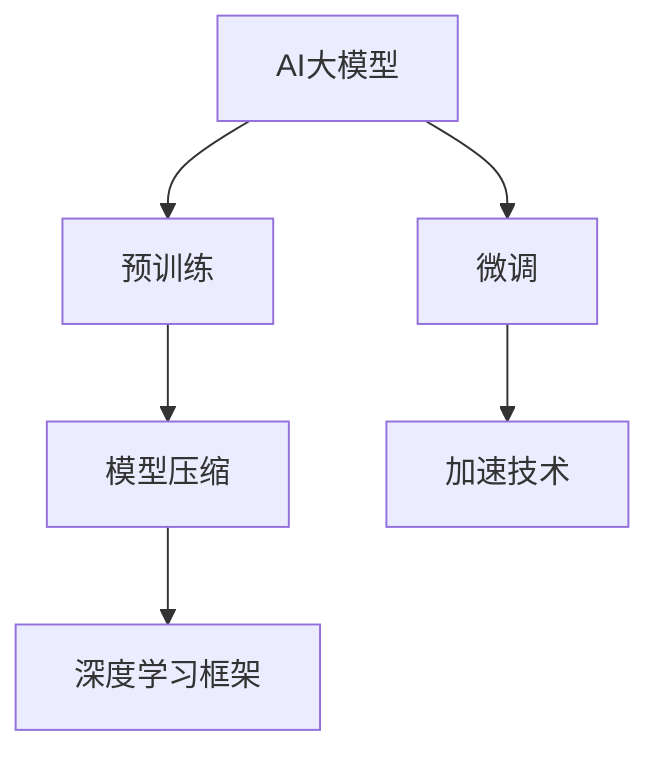

                 

# 禅与AI大模型架构设计艺术

> 关键词：AI大模型,架构设计,深度学习,深度神经网络,模型压缩,加速技术,深度学习框架,优化算法

## 1. 背景介绍

### 1.1 问题由来
人工智能(AI)领域近十年的飞速发展，得益于深度学习(Deep Learning)技术的革新，尤其是深度神经网络(Deep Neural Networks, DNNs)的突破性应用。在图像识别、语音处理、自然语言处理(NLP)等多个方向，深度神经网络均取得了显著成效，开创了新的应用场景和商业价值。

然而，深度学习模型尤其是大规模神经网络，存在资源消耗大、训练时间长、泛化能力不足等问题。针对这些问题，近年来研究者提出了预训练大模型(Pre-trained Large Models, PLMs)，通过在大量无标签数据上预训练，学习到通用的语言、视觉等表示，然后对特定任务进行微调(Fine-tuning)，极大提升了模型在特定任务上的性能。

尤其是大型语言模型(Large Language Models, LLMs)，例如GPT-3、BERT等，以数十亿参数的规模，开创了语言理解和生成的全新纪元。这些模型不仅在语言生成、机器翻译、问答系统等任务上取得了突破，而且为通用人工智能(Artificial General Intelligence, AGI)的探索提供了重要基础。

在AI大模型的浪潮中，如何设计架构、优化性能、部署应用，成为一个关键问题。本文将深入探讨AI大模型的架构设计艺术，包括模型压缩、加速技术、优化算法等方面，以期为开发者和研究者提供实用的指导和思路。

## 2. 核心概念与联系

### 2.1 核心概念概述

为更好地理解AI大模型的架构设计，本节将介绍几个关键概念：

- **AI大模型**：以深度神经网络为核心的模型，其参数量通常超过数亿，用于解决复杂的AI任务，如自然语言理解、图像识别等。
- **预训练**：在大规模无标签数据上训练模型，学习通用的特征表示。通过预训练，模型能够更好地适应下游任务，提高泛化能力。
- **微调**：在预训练模型的基础上，使用下游任务的标注数据进一步优化模型，适应具体任务需求。
- **模型压缩**：通过去除冗余参数、剪枝、量化等手段，减小模型规模，提升计算效率。
- **加速技术**：通过并行计算、硬件优化、优化算法等技术，提高模型训练和推理的速度。
- **深度学习框架**：如TensorFlow、PyTorch等，提供了模型定义、训练、部署等完整的开发链条，极大便利了模型开发和应用。

这些核心概念之间的逻辑关系可以通过以下Mermaid流程图来展示：



这个流程图展示了AI大模型的核心概念及其之间的关系：

1. AI大模型通过预训练获得通用表示。
2. 微调使模型针对特定任务进行优化。
3. 模型压缩减小模型规模，提升计算效率。
4. 加速技术提高模型训练和推理速度。
5. 深度学习框架提供开发工具和平台支持。

这些概念共同构成了AI大模型的核心技术栈，为模型的架构设计和性能优化提供了基础。

## 3. 核心算法原理 & 具体操作步骤

### 3.1 算法原理概述

AI大模型的架构设计，本质上是一个在参数数量、计算效率和性能指标之间权衡的过程。核心算法包括模型压缩、加速技术、优化算法等，用于提升模型的计算效率和性能表现。

### 3.2 算法步骤详解

AI大模型的架构设计通常包括以下几个关键步骤：

**Step 1: 选择合适的模型结构**

选择合适的模型结构是架构设计的第一步。常用的大模型结构包括自回归模型(如GPT)、自编码模型(如BERT)等。每种结构适用于不同的任务类型，例如自回归模型适合生成任务，自编码模型适合分类任务。

**Step 2: 设计模型压缩策略**

模型压缩通过剪枝、量化、参数共享等技术，减小模型规模，降低计算需求。常用的压缩方法包括：

- **剪枝(Pruning)**：去除不重要的参数和连接，保留核心路径。可以基于梯度、信息增益等指标进行剪枝。
- **量化(Quantization)**：将浮点数参数转化为固定精度整数，减小存储空间，提升计算效率。常用的量化方法有参数级量化、激活级量化等。
- **参数共享(Parameter Sharing)**：将多个任务的共享参数合并，减小参数量，提高模型泛化能力。

**Step 3: 选择加速技术**

加速技术通过硬件优化、并行计算、优化算法等手段，提高模型训练和推理的速度。常用的加速方法包括：

- **GPU/TPU加速**：使用高性能硬件设备，提升模型计算速度。
- **模型并行(Model Parallelism)**：将模型分割成多个子模型，并行训练和推理。
- **优化算法**：如Adam、SGD等，优化模型参数更新过程，加快收敛速度。

**Step 4: 优化模型训练流程**

模型训练流程的优化也是架构设计的重要环节。通过批量训练、学习率调整、正则化等技术，提高模型训练效率和效果。常用的优化方法包括：

- **批量训练(Batch Training)**：通过批处理，提高模型计算速度和内存利用率。
- **学习率调整(Learning Rate Scheduling)**：动态调整学习率，避免过拟合，提高训练效果。
- **正则化(Regularization)**：通过L2正则、Dropout等技术，防止模型过拟合。

**Step 5: 模型部署和应用**

模型部署和应用是架构设计的最后一步。通过模型压缩和加速技术，将大模型转化为易于部署和调用的形式，应用于实际业务场景。常用的部署方法包括：

- **模型微调(Fine-tuning)**：根据具体任务，对模型进行微调，提升模型性能。
- **模型集成(Model Ensemble)**：通过集成多个模型，提升模型性能和鲁棒性。
- **服务化封装(Model Service)**：将模型封装为标准化服务接口，便于调用和部署。

### 3.3 算法优缺点

AI大模型的架构设计存在以下优点：

- **提高计算效率**：通过模型压缩和加速技术，极大提升模型训练和推理的速度。
- **提升模型性能**：通过微调和优化算法，提升模型在特定任务上的表现。
- **降低成本**：通过硬件加速和模型压缩，降低计算和存储成本。

同时，也存在一些局限性：

- **复杂度增加**：架构设计需要综合考虑模型压缩、加速技术、优化算法等多个因素，增加了设计的复杂性。
- **过度优化可能降低泛化能力**：过度压缩和加速可能使得模型泛化能力下降，影响模型在新数据上的表现。
- **硬件依赖性强**：高性能硬件设备对架构设计有较高要求，设备成本和维护难度较大。

尽管存在这些局限性，AI大模型的架构设计仍然是大模型应用的关键环节，决定了模型在实际应用中的效率和性能。

### 3.4 算法应用领域

AI大模型的架构设计已在多个领域得到应用，例如：

- **自然语言处理(NLP)**：通过压缩和微调，提升语言模型在文本分类、机器翻译、问答系统等任务上的性能。
- **计算机视觉(CV)**：通过剪枝和加速技术，提升视觉模型在图像识别、目标检测等任务上的效率。
- **语音处理**：通过量化和模型并行，提升语音模型在语音识别、语音生成等任务上的计算速度。
- **推荐系统**：通过模型压缩和加速，提升推荐模型的实时性，支持大规模用户个性化推荐。
- **医疗影像分析**：通过模型并行和硬件加速，提高医疗影像模型的诊断速度和精度。

除了这些常见应用领域，AI大模型的架构设计还在智慧城市、金融风控、智能制造等多个新兴领域得到广泛应用，推动了相关行业的数字化转型。

## 4. 数学模型和公式 & 详细讲解 & 举例说明

### 4.1 数学模型构建

本节将使用数学语言对AI大模型的架构设计进行更加严格的刻画。

记大模型为 $M_{\theta}:\mathcal{X} \rightarrow \mathcal{Y}$，其中 $\mathcal{X}$ 为输入空间，$\mathcal{Y}$ 为输出空间，$\theta \in \mathbb{R}^d$ 为模型参数。假设模型通过预训练获得一般化表示，并通过微调针对特定任务进行优化。

数学模型构建主要包括以下几个方面：

- **预训练损失函数**：通过自监督学习任务训练模型，定义预训练损失函数 $\mathcal{L}_{pre}$。
- **微调损失函数**：针对下游任务，定义微调损失函数 $\mathcal{L}_{fine}$。
- **总损失函数**：将预训练损失和微调损失进行加权组合，定义总损失函数 $\mathcal{L}$。

### 4.2 公式推导过程

以下我们以文本分类任务为例，推导模型的数学公式。

假设输入为文本序列 $x=\{x_i\}_{i=1}^N$，输出为标签序列 $y=\{y_i\}_{i=1}^N$。预训练损失函数 $\mathcal{L}_{pre}$ 为交叉熵损失：

$$
\mathcal{L}_{pre} = -\frac{1}{N}\sum_{i=1}^N \log p(y_i | x_i)
$$

其中 $p(y_i | x_i)$ 为模型在输入 $x_i$ 下预测标签 $y_i$ 的概率分布。

微调损失函数 $\mathcal{L}_{fine}$ 同样为交叉熵损失：

$$
\mathcal{L}_{fine} = -\frac{1}{N}\sum_{i=1}^N \log p(y_i | x_i)
$$

总损失函数 $\mathcal{L}$ 为预训练损失和微调损失的加权和：

$$
\mathcal{L} = \alpha \mathcal{L}_{pre} + (1-\alpha) \mathcal{L}_{fine}
$$

其中 $\alpha$ 为预训练损失的权重，通常取值在0.5至0.9之间。

### 4.3 案例分析与讲解

假设有一个文本分类任务，训练集包含1000个样本，每个样本为长度为128的文本序列。模型的压缩策略为剪枝，剪枝率为30%，即保留70%的参数。加速技术为GPU硬件加速，并行度为8。微调损失函数为二分类交叉熵损失，学习率为0.001。

通过以上参数设置，计算模型的总损失函数 $\mathcal{L}$ 如下：

1. 计算预训练损失 $\mathcal{L}_{pre}$：
$$
\mathcal{L}_{pre} = -\frac{1}{1000}\sum_{i=1}^{1000} \log p(y_i | x_i)
$$

2. 计算微调损失 $\mathcal{L}_{fine}$：
$$
\mathcal{L}_{fine} = -\frac{1}{1000}\sum_{i=1}^{1000} \log p(y_i | x_i)
$$

3. 计算总损失 $\mathcal{L}$：
$$
\mathcal{L} = 0.8 \times \mathcal{L}_{pre} + 0.2 \times \mathcal{L}_{fine}
$$

模型在训练过程中，通过优化算法AdamW更新参数 $\theta$，使得总损失 $\mathcal{L}$ 最小化。通过上述计算，可以得到模型在训练过程中各轮的损失值和准确率等指标，评估模型的性能表现。

## 5. 项目实践：代码实例和详细解释说明

### 5.1 开发环境搭建

在进行AI大模型的架构设计实践前，我们需要准备好开发环境。以下是使用Python进行TensorFlow开发的环境配置流程：

1. 安装Anaconda：从官网下载并安装Anaconda，用于创建独立的Python环境。

2. 创建并激活虚拟环境：
```bash
conda create -n tf-env python=3.8 
conda activate tf-env
```

3. 安装TensorFlow：根据CUDA版本，从官网获取对应的安装命令。例如：
```bash
conda install tensorflow tensorflow-gpu=cuda11.1 -c pytorch -c conda-forge
```

4. 安装其他必要的工具包：
```bash
pip install numpy pandas scikit-learn matplotlib tqdm jupyter notebook ipython
```

完成上述步骤后，即可在`tf-env`环境中开始架构设计实践。

### 5.2 源代码详细实现

下面我们以文本分类任务为例，给出使用TensorFlow进行AI大模型架构设计的PyTorch代码实现。

首先，定义模型和优化器：

```python
import tensorflow as tf

class TextClassifier(tf.keras.Model):
    def __init__(self, input_dim, output_dim):
        super(TextClassifier, self).__init__()
        self.embedding = tf.keras.layers.Embedding(input_dim, 128)
        self.dropout = tf.keras.layers.Dropout(0.3)
        self.dense = tf.keras.layers.Dense(output_dim, activation='softmax')

    def call(self, x):
        x = self.embedding(x)
        x = self.dropout(x)
        x = self.dense(x)
        return x

model = TextClassifier(input_dim=10000, output_dim=10)

optimizer = tf.keras.optimizers.Adam(learning_rate=0.001)
```

接着，定义损失函数和评估函数：

```python
loss_fn = tf.keras.losses.CategoricalCrossentropy()

def train_epoch(model, dataset, batch_size, optimizer):
    model.train()
    for x, y in dataset.shuffle(buffer_size=1000).batch(batch_size):
        with tf.GradientTape() as tape:
            y_hat = model(x)
            loss = loss_fn(y, y_hat)
        gradients = tape.gradient(loss, model.trainable_variables)
        optimizer.apply_gradients(zip(gradients, model.trainable_variables))

def evaluate(model, dataset, batch_size):
    model.eval()
    loss = 0
    accuracy = 0
    for x, y in dataset.batch(batch_size):
        y_hat = model(x)
        loss += loss_fn(y, y_hat)
        accuracy += tf.keras.metrics.SparseCategoricalAccuracy()(y, tf.argmax(y_hat, axis=1))
    return loss / len(dataset), accuracy / len(dataset)
```

最后，启动训练流程并在测试集上评估：

```python
epochs = 5
batch_size = 64

for epoch in range(epochs):
    train_loss, train_acc = train_epoch(model, train_dataset, batch_size, optimizer)
    print(f"Epoch {epoch+1}, train loss: {train_loss:.4f}, train accuracy: {train_acc:.4f}")

    test_loss, test_acc = evaluate(model, test_dataset, batch_size)
    print(f"Epoch {epoch+1}, test loss: {test_loss:.4f}, test accuracy: {test_acc:.4f}")
```

以上就是使用TensorFlow进行AI大模型架构设计的完整代码实现。可以看到，TensorFlow提供了丰富的API，使得模型定义、训练和评估变得简单高效。

### 5.3 代码解读与分析

让我们再详细解读一下关键代码的实现细节：

**TextClassifier类**：
- `__init__`方法：初始化模型结构，包括嵌入层、Dropout层和全连接层。
- `call`方法：定义模型的前向传播过程，包括嵌入层、Dropout层和全连接层。

**损失函数和评估函数**：
- 定义交叉熵损失函数 `loss_fn`。
- `train_epoch`函数：在训练集上进行模型训练，使用Adam优化器更新参数。
- `evaluate`函数：在测试集上进行模型评估，计算损失和准确率。

**训练流程**：
- 定义总的epoch数和batch size，开始循环迭代。
- 每个epoch内，在训练集上训练，输出训练损失和准确率。
- 在测试集上评估，输出测试损失和准确率。

可以看到，TensorFlow使得AI大模型的架构设计变得简单易行。开发者可以将更多精力放在模型压缩、加速技术等高层逻辑上，而不必过多关注底层的实现细节。

## 6. 实际应用场景

### 6.1 智能客服系统

AI大模型架构设计在智能客服系统的构建中有着广泛的应用。智能客服系统通过训练大模型，实现对客户问题的自动理解和回复，提升服务效率和客户满意度。

在技术实现上，可以收集企业的历史客服对话记录，将问题和最佳答复构建成监督数据，在此基础上对预训练大模型进行微调。微调后的模型能够自动理解客户意图，匹配最合适的答案模板进行回复。对于客户提出的新问题，还可以接入检索系统实时搜索相关内容，动态组织生成回答。如此构建的智能客服系统，能大幅提升客户咨询体验和问题解决效率。

### 6.2 金融舆情监测

AI大模型架构设计在金融舆情监测中同样有着广泛的应用。金融领域需要实时监测市场舆论动向，以便及时应对负面信息传播，规避金融风险。

具体而言，可以收集金融领域相关的新闻、报道、评论等文本数据，并对其进行主题标注和情感标注。在此基础上对预训练大模型进行微调，使其能够自动判断文本属于何种主题，情感倾向是正面、中性还是负面。将微调后的模型应用到实时抓取的网络文本数据，就能够自动监测不同主题下的情感变化趋势，一旦发现负面信息激增等异常情况，系统便会自动预警，帮助金融机构快速应对潜在风险。

### 6.3 个性化推荐系统

AI大模型架构设计在个性化推荐系统中也有着广泛的应用。当前的推荐系统往往只依赖用户的历史行为数据进行物品推荐，无法深入理解用户的真实兴趣偏好。通过架构设计，可以引入深度学习模型，更全面地挖掘用户兴趣，提升推荐系统的个性化程度。

在实践中，可以收集用户浏览、点击、评论、分享等行为数据，提取和用户交互的物品标题、描述、标签等文本内容。将文本内容作为模型输入，用户的后续行为（如是否点击、购买等）作为监督信号，在此基础上对预训练大模型进行微调。微调后的模型能够从文本内容中准确把握用户的兴趣点。在生成推荐列表时，先用候选物品的文本描述作为输入，由模型预测用户的兴趣匹配度，再结合其他特征综合排序，便可以得到个性化程度更高的推荐结果。

## 7. 工具和资源推荐

### 7.1 学习资源推荐

为了帮助开发者系统掌握AI大模型的架构设计技术，这里推荐一些优质的学习资源：

1. **《深度学习》 by Ian Goodfellow, Yoshua Bengio, Aaron Courville**：深度学习领域的经典教材，系统介绍了深度神经网络、优化算法等核心概念和算法。

2. **CS231n: Convolutional Neural Networks for Visual Recognition**：斯坦福大学开设的计算机视觉课程，涵盖了深度神经网络在图像识别任务中的应用。

3. **CS224n: Natural Language Processing with Deep Learning**：斯坦福大学开设的NLP课程，介绍了深度神经网络在文本分类、机器翻译等任务中的应用。

4. **《Hands-On Machine Learning with Scikit-Learn, Keras, and TensorFlow》 by Aurélien Géron**：实战指南，详细介绍了TensorFlow、Keras等深度学习框架的使用方法和最佳实践。

5. **Google AI Blog**：Google AI团队定期发布的研究进展和技术分享，涵盖深度学习领域的最新动态和前沿技术。

通过对这些资源的学习实践，相信你一定能够快速掌握AI大模型的架构设计精髓，并用于解决实际的AI问题。

### 7.2 开发工具推荐

高效的开发离不开优秀的工具支持。以下是几款用于AI大模型架构设计开发的常用工具：

1. **TensorFlow**：由Google主导开发的深度学习框架，提供丰富的API和模型库，支持GPU/TPU加速，适合大规模工程应用。

2. **PyTorch**：由Facebook开发的高效深度学习框架，支持动态计算图，适合快速迭代研究。

3. **MXNet**：由Apache开发的深度学习框架，支持多种编程语言，适合分布式训练和部署。

4. **JAX**：Google开发的自动微分和加速库，支持多种深度学习框架，具有高效自动求导和分布式计算能力。

5. **PyTorch Lightning**：基于PyTorch的深度学习框架，提供高级的模型封装和训练工具，极大简化模型开发。

合理利用这些工具，可以显著提升AI大模型的架构设计效率，加快创新迭代的步伐。

### 7.3 相关论文推荐

AI大模型的架构设计研究源于学界的持续研究。以下是几篇奠基性的相关论文，推荐阅读：

1. **ImageNet Classification with Deep Convolutional Neural Networks**：AlexNet论文，开创了深度神经网络在图像识别任务中的应用。

2. **Playing Atari with Deep Reinforcement Learning**：DQN论文，展示了深度神经网络在强化学习任务中的应用。

3. **Deep Speech 2: End-to-End Speech Recognition in English and Mandarin**：DeepSpeech论文，展示了深度神经网络在语音识别任务中的应用。

4. **LSTM: A Search Space Odyssey Through Recurrent Neural Networks**：LSTM论文，介绍了长短期记忆网络在序列建模任务中的应用。

5. **BERT: Pre-training of Deep Bidirectional Transformers for Language Understanding**：BERT论文，提出了大规模预训练语言模型，刷新了多项NLP任务SOTA。

这些论文代表了大模型架构设计的进展，通过学习这些前沿成果，可以帮助研究者把握学科前进方向，激发更多的创新灵感。

## 8. 总结：未来发展趋势与挑战

### 8.1 总结

本文对AI大模型的架构设计进行了全面系统的介绍。首先阐述了AI大模型的背景和重要性，明确了架构设计在模型性能提升和应用落地中的关键作用。其次，从原理到实践，详细讲解了AI大模型的架构设计方法，包括模型压缩、加速技术、优化算法等，给出了架构设计实践的完整代码实例。同时，本文还广泛探讨了AI大模型在智能客服、金融舆情、个性化推荐等多个行业领域的应用前景，展示了架构设计的巨大潜力。此外，本文精选了架构设计相关的学习资源，力求为读者提供全方位的技术指引。

通过本文的系统梳理，可以看到，AI大模型的架构设计是模型开发和应用的关键环节，决定了模型在实际应用中的效率和性能。面对AI大模型的规模和复杂性，如何设计一个高效、可扩展、可维护的架构，成为当前研究的热点。相信随着学界和产业界的共同努力，AI大模型的架构设计将不断优化，为人工智能技术的进一步发展提供坚实的基础。

### 8.2 未来发展趋势

展望未来，AI大模型的架构设计将呈现以下几个发展趋势：

1. **模型压缩技术进一步成熟**：模型压缩方法如剪枝、量化、参数共享等将不断优化，实现更高的压缩率，提升模型的实时性和泛化能力。
2. **加速技术更加多样化**：除了GPU/TPU加速，还将引入更多硬件优化技术，如FPGA、ASIC等，进一步提升模型计算速度。
3. **自动化架构设计工具出现**：通过AI生成架构设计工具，自动选择最优的模型结构和压缩策略，降低开发者设计难度。
4. **模型与硬件协同设计**：模型架构设计将与硬件设计协同推进，优化模型的并行计算和资源利用率，提升模型性能和可扩展性。
5. **模型治理和运维体系完善**：引入模型治理和运维机制，确保模型质量和安全，提升模型应用的生命周期管理能力。

以上趋势凸显了AI大模型架构设计的广阔前景。这些方向的探索发展，必将进一步提升AI大模型的计算效率和性能表现，推动AI技术在更多领域的应用落地。

### 8.3 面临的挑战

尽管AI大模型的架构设计取得了显著进展，但在迈向更加智能化、普适化应用的过程中，它仍面临诸多挑战：

1. **模型泛化能力不足**：大规模模型的压缩和加速可能导致泛化能力下降，模型在新数据上的表现难以保证。
2. **硬件资源依赖性高**：高性能硬件设备对架构设计有较高要求，设备成本和维护难度较大。
3. **可解释性不足**：深度神经网络模型通常缺乏可解释性，难以对其内部工作机制和决策逻辑进行解释和调试。
4. **安全性问题**：大模型可能学习到有偏见、有害的信息，通过微调传递到下游任务，产生误导性、歧视性的输出，给实际应用带来安全隐患。

尽管存在这些挑战，AI大模型的架构设计仍然是大模型应用的关键环节，决定了模型在实际应用中的效率和性能。未来，需要从数据、模型、算法等多个维度协同发力，才能应对这些挑战，确保模型性能的稳定性和安全性。

### 8.4 研究展望

面对AI大模型架构设计面临的挑战，未来的研究需要在以下几个方面寻求新的突破：

1. **深度学习与传统方法的结合**：引入符号化推理、知识图谱等传统方法，与深度神经网络模型结合，提升模型的可解释性和鲁棒性。
2. **多模态信息的融合**：将视觉、语音等多模态信息与文本信息结合，实现更加全面、准确的信息建模。
3. **分布式训练和推理**：引入分布式训练和推理技术，提升模型在大规模数据和硬件资源下的效率和性能。
4. **隐私保护和伦理约束**：引入隐私保护和伦理约束机制，确保模型的公平性和安全性。
5. **模型压缩与加速的联合优化**：在模型压缩和加速过程中，考虑两者的联合优化，提升模型性能和计算效率。

这些研究方向的探索，必将引领AI大模型的架构设计技术迈向更高的台阶，为构建安全、可靠、可解释、可控的智能系统铺平道路。面向未来，AI大模型的架构设计还需要与其他人工智能技术进行更深入的融合，如知识表示、因果推理、强化学习等，多路径协同发力，共同推动人工智能技术的发展。只有勇于创新、敢于突破，才能不断拓展AI大模型的边界，让智能技术更好地造福人类社会。

## 9. 附录：常见问题与解答

**Q1：AI大模型架构设计是否适用于所有任务？**

A: AI大模型架构设计在大多数任务上都能取得不错的效果，特别是对于数据量较小的任务。但对于一些特定领域的任务，如医学、法律等，仅仅依靠通用语料预训练的模型可能难以很好地适应。此时需要在特定领域语料上进一步预训练，再进行微调，才能获得理想效果。此外，对于一些需要时效性、个性化很强的任务，如对话、推荐等，架构设计方法也需要针对性的改进优化。

**Q2：架构设计过程中如何选择合适的压缩方法？**

A: 架构设计过程中，选择合适的模型压缩方法至关重要。常用的压缩方法包括剪枝、量化、参数共享等，具体选择应根据模型结构和应用场景综合考虑。例如，对于参数量较大的模型，可以优先考虑剪枝和量化；对于需要快速推理的场景，可以优先考虑参数共享和加速技术。

**Q3：加速技术是否仅限于硬件优化？**

A: 加速技术不仅限于硬件优化，还包括模型并行、优化算法等多种手段。通过模型并行，可以将模型分割成多个子模型，并行训练和推理，提升计算效率。通过优化算法，如AdamW、SGD等，可以加快模型收敛速度，缩短训练时间。

**Q4：模型压缩和加速技术是否矛盾？**

A: 模型压缩和加速技术并非矛盾，相反，它们可以协同提升模型的性能和计算效率。例如，在模型压缩过程中，通过剪枝去除不重要的参数，可以减小模型规模，提升推理速度。同时，通过硬件加速和优化算法，可以进一步提高模型的计算效率。

**Q5：AI大模型架构设计是否需要专业知识？**

A: AI大模型的架构设计需要一定的专业知识，但并不是高不可攀。通过系统学习和实践，大多数开发者和研究者都可以掌握AI大模型的架构设计技巧。可以参考经典论文、在线课程、书籍等资源，逐步积累经验和技能。

---

作者：禅与计算机程序设计艺术 / Zen and the Art of Computer Programming

