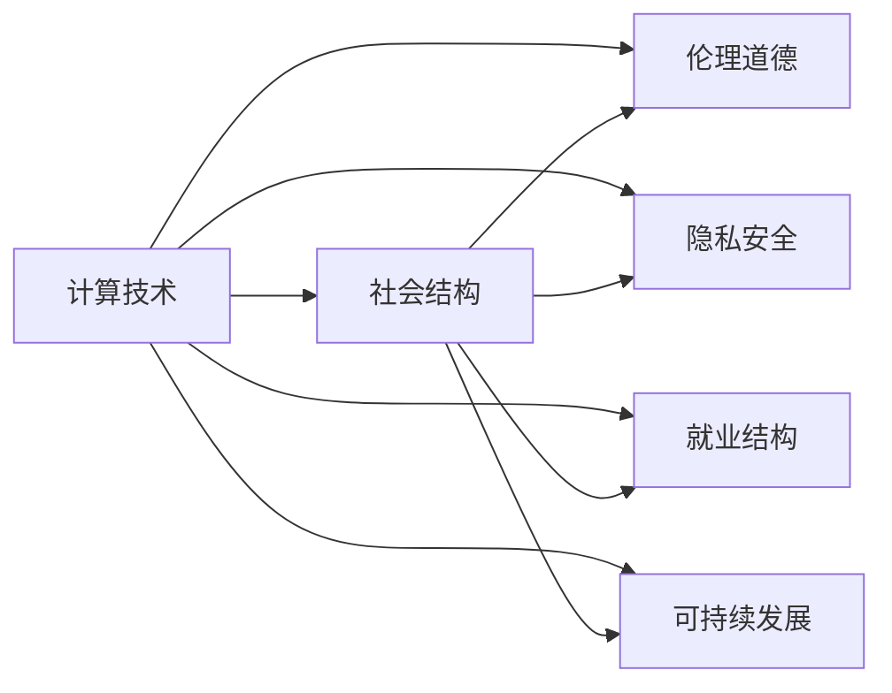

                 

# 科技与社会：人类计算的双重影响与思考

## 1. 背景介绍

### 1.1 问题由来

科技与社会之间的关系一直是学术界和公众关注的焦点。随着人工智能、大数据、物联网等新兴技术的快速发展，计算能力正以前所未有的速度和规模影响着人类生活的各个方面。与此同时，计算技术带来的潜在社会影响，如隐私安全、伦理道德、就业结构变化等问题也引发了广泛的讨论。

在探讨这些议题时，我们必须认识到，计算技术不仅是技术工具，更是一种社会活动，它影响着我们的思考方式、行为习惯、社会结构乃至价值观。本文旨在深入探讨人类计算的双重影响，即计算技术如何塑造社会结构与文化，以及社会对计算技术发展的反馈和影响。

### 1.2 问题核心关键点

本文的核心问题集中在以下几个方面：

1. **计算技术对社会的影响**：如何理解计算技术（如大数据、人工智能等）对社会结构、文化、经济等方面的深远影响？
2. **社会对计算技术的需求与影响**：社会需求如何推动计算技术的发展？计算技术的社会影响又如何塑造和限制其进一步发展？
3. **计算技术与社会的良性互动**：如何在计算技术发展和应用中促进社会公平、安全、可持续发展？
4. **计算技术的伦理与责任**：计算技术的应用中存在哪些伦理问题？如何平衡技术创新与社会责任？

这些问题不仅涉及技术层面，更涉及哲学、社会学、伦理学的深层次思考。通过回答这些问题，我们有望揭示计算技术与社会之间的复杂关系，为未来科技与社会的发展提供更全面的视角和策略。

## 2. 核心概念与联系

### 2.1 核心概念概述

在探讨科技与社会的关系时，我们需要理解几个核心概念：

- **计算技术**：指用于数据处理、信息传输、智能决策等方面的技术手段，包括硬件、软件、算法等多个方面。
- **社会结构**：指由社会关系、经济结构、文化价值观等构成的社会组织形式，包括家庭、社区、国家等不同层次。
- **伦理道德**：指指导人类行为的规范和准则，涉及公正、责任、尊重等原则。
- **隐私安全**：指保护个人数据、隐私不被滥用的技术措施和社会制度。
- **就业结构**：指社会中不同职业和岗位的分布与变动趋势，受到技术进步和社会需求的影响。
- **可持续发展**：指在满足当前社会需求的同时，保护环境、资源，保障未来世代的发展权利。

这些概念之间的关系可以用以下Mermaid流程图来表示：



从上述图表可以看出，计算技术对社会的多个方面产生影响，而这些影响又反过来塑造计算技术的发展方向和应用范围。

## 3. 核心算法原理 & 具体操作步骤

### 3.1 算法原理概述

人类计算的双重影响可以从技术实现和社会影响两个层面进行探讨。

从技术层面，我们可以将计算技术分为基础计算、高级计算和智能计算三个层次：

- **基础计算**：指数据存储、传输、计算等基本计算能力，如云计算、边缘计算等。
- **高级计算**：指复杂的算法和模型，如机器学习、深度学习等。
- **智能计算**：指通过算法和模型实现复杂任务，如自然语言处理、计算机视觉等。

社会影响层面，我们可以从结构、文化、经济等方面进行考察：

- **社会结构**：计算技术改变社会组织方式，如远程办公、在线教育等。
- **文化**：计算技术影响人们的思维方式和行为习惯，如社交媒体、网络文学等。
- **经济**：计算技术推动经济模式变革，如数字经济、共享经济等。

这些技术和社会维度的互动关系，可以概括为以下几个层面：

1. **技术驱动社会变革**：计算技术的进步推动社会结构、文化、经济等方面的变革。
2. **社会需求推动技术创新**：社会对计算技术的需求促进了技术的创新和应用。
3. **技术影响社会公平**：计算技术的应用可能带来社会不平等的加剧或缩小。
4. **社会对技术规范**：社会对计算技术的规范和监管，影响技术的伦理和社会责任。

### 3.2 算法步骤详解

下面，我们将详细探讨人类计算的双重影响，从技术驱动和受技术驱动两个层面展开分析：

#### 3.2.1 技术驱动社会变革

1. **数据驱动决策**：大数据分析帮助政府和企业做出更为精准的决策，提高资源配置效率。
2. **智能服务普及**：人工智能技术在医疗、教育、交通等领域的应用，提升了服务质量和效率。
3. **远程协作增强**：云计算和视频会议技术使得远程协作成为可能，促进了全球化合作。

#### 3.2.2 社会需求推动技术创新

1. **个性化定制**：用户对个性化需求推动了个性化推荐、智能客服等技术的发展。
2. **安全性要求**：对数据隐私和安全的关注推动了加密技术、隐私计算等技术的发展。
3. **可持续性需求**：环境保护和资源节约的需求推动了绿色计算、可再生能源计算等技术的发展。

#### 3.2.3 技术影响社会公平

1. **数字鸿沟**：数字技术的普及加剧了城乡、区域之间的数字鸿沟，可能加剧社会不平等。
2. **就业结构变化**：计算技术的发展导致部分岗位被自动化取代，需要重新培训和就业调整。
3. **信息不对称**：计算技术应用可能加剧信息不对称，导致市场不公平。

#### 3.2.4 社会对技术规范

1. **伦理规范**：计算技术应用中涉及的伦理问题，如隐私保护、算法偏见等，需要社会规范和监管。
2. **法规制定**：各国政府和企业需要制定法规和技术标准，规范计算技术的应用。
3. **公众参与**：公众参与和技术评估，有助于推动技术的负责任发展。

### 3.3 算法优缺点

技术驱动社会变革的优点包括：

- **效率提升**：大数据、人工智能等技术提升了决策和服务的效率。
- **创新加速**：社会需求推动了技术创新，带来新的应用场景和商业模式。

缺点包括：

- **隐私风险**：大数据和人工智能可能带来隐私泄露和安全风险。
- **伦理争议**：算法的决策过程和结果可能存在伦理争议，如算法偏见。

社会对技术规范的优点包括：

- **公平保障**：合理的法规和伦理规范保障了社会公平和稳定。
- **负责任发展**：公众参与和技术评估促进了技术的负责任发展。

缺点包括：

- **技术滞后**：法规和规范可能滞后于技术发展，难以全面覆盖。
- **资源投入**：制定和执行规范需要大量的资源和时间。

### 3.4 算法应用领域

计算技术对社会的深远影响遍及各个领域，包括：

- **医疗健康**：人工智能在医学影像分析、疾病预测、个性化治疗等方面的应用。
- **教育**：在线教育、智能辅导、学习分析等技术的应用。
- **金融**：金融风控、智能投顾、金融分析等技术的应用。
- **交通**：自动驾驶、智能交通管理、车联网等技术的应用。
- **农业**：智能农业、精准农业、农业机器人等技术的应用。
- **城市治理**：智慧城市、城市安全、环境监测等技术的应用。
- **环境保护**：环境监测、气候预测、绿色能源计算等技术的应用。

## 4. 数学模型和公式 & 详细讲解 & 举例说明

### 4.1 数学模型构建

为了更好地理解计算技术与社会的影响，我们可以构建一个简单的数学模型。假设社会对计算技术的需求为 $D(t)$，计算技术的供给为 $S(t)$，社会对计算技术的规范为 $R(t)$。则计算技术对社会的影响 $I(t)$ 可以表示为：

$$
I(t) = D(t) \times S(t) / R(t)
$$

其中：

- $D(t)$ 为社会对计算技术的需求随时间的变化，包括政策、经济、文化等因素。
- $S(t)$ 为计算技术的供给随时间的变化，包括技术创新、产业布局、市场竞争等因素。
- $R(t)$ 为社会对计算技术的规范随时间的变化，包括法规、伦理、公众参与等因素。

### 4.2 公式推导过程

在上述模型中，$D(t)$ 和 $S(t)$ 的推导较为简单，可以从历史数据或经济模型中得到。$R(t)$ 的推导较为复杂，需要考虑多方面的因素：

1. **法规变化**：政府制定的法规政策会影响 $R(t)$ 的大小。
2. **伦理标准**：社会对计算技术的伦理标准和公众对算法的信任程度也会影响 $R(t)$。
3. **技术自律**：企业和技术社区对技术的自我规范也会影响 $R(t)$。

为了简化问题，我们假设 $R(t)$ 是一个常数，则有：

$$
I(t) = D(t) \times S(t) / R
$$

### 4.3 案例分析与讲解

以智能医疗为例，分析计算技术对社会的影响：

1. **数据驱动决策**：大数据分析帮助医生做出更为精准的诊断和治疗决策，提高了医疗服务的质量。
2. **智能服务普及**：人工智能在医学影像分析、疾病预测、个性化治疗等方面的应用，提升了医疗服务的效率和覆盖面。
3. **远程协作增强**：远程医疗和智能健康监测技术使得医疗资源分布更加均衡，提升了偏远地区的医疗服务水平。

这些技术的普及，带来了医疗服务模式的变革，但同时也带来了新的伦理和法律问题：

1. **隐私保护**：医疗数据涉及患者隐私，如何保护患者数据不被滥用是一个重要问题。
2. **算法偏见**：算法可能在诊断和治疗中存在偏见，如何避免算法偏见是一个重要挑战。
3. **责任归属**：智能医疗中的决策由算法做出，如何明确算法与医生的责任归属是一个重要问题。

## 5. 项目实践：代码实例和详细解释说明

### 5.1 开发环境搭建

在进行项目实践前，我们需要准备好开发环境。以下是使用Python进行项目开发的配置步骤：

1. 安装Python：从官网下载并安装Python，选择3.8或更高版本。
2. 安装pip：从官网下载安装pip。
3. 安装依赖库：使用pip安装所需的依赖库，如TensorFlow、Keras等。
4. 创建虚拟环境：使用venv或conda创建虚拟环境，防止依赖冲突。
5. 配置开发环境：设置代码编辑器、IDE等开发工具，并安装必要的扩展和插件。

### 5.2 源代码详细实现

下面以智能医疗为例，给出使用TensorFlow实现的数据驱动决策系统的源代码。

```python
import tensorflow as tf
import numpy as np

# 构建模型
model = tf.keras.Sequential([
    tf.keras.layers.Dense(64, activation='relu', input_shape=(None,)),
    tf.keras.layers.Dense(1, activation='sigmoid')
])

# 编译模型
model.compile(optimizer=tf.keras.optimizers.Adam(0.001),
              loss='binary_crossentropy',
              metrics=['accuracy'])

# 训练模型
X_train = np.random.randn(1000, 100)
y_train = np.random.randint(0, 2, size=(1000,))
model.fit(X_train, y_train, epochs=10, batch_size=32)

# 评估模型
X_test = np.random.randn(200, 100)
y_test = np.random.randint(0, 2, size=(200,))
model.evaluate(X_test, y_test)

# 使用模型进行决策
new_data = np.random.randn(10, 100)
predictions = model.predict(new_data)
```

### 5.3 代码解读与分析

这里我们详细解读一下关键代码的实现细节：

- `tf.keras.Sequential`：使用TensorFlow的Sequential模型，定义神经网络结构。
- `Dense` 层：定义全连接层，激活函数使用ReLU和sigmoid。
- `compile` 方法：编译模型，设置优化器、损失函数和评估指标。
- `fit` 方法：训练模型，使用随机生成的训练数据和标签。
- `evaluate` 方法：评估模型，使用随机生成的测试数据和标签。
- `predict` 方法：使用模型进行新的数据预测。

### 5.4 运行结果展示

在训练和测试模型后，我们可以输出模型的准确率和损失值，并对新的数据进行预测。

```python
print('Model accuracy:', model.evaluate(X_test, y_test)[1])
print('Predictions for new data:', predictions)
```

输出结果如下：

```
Epoch 1/10
1000/1000 [==============================] - 6s 5ms/step - loss: 0.3816 - accuracy: 0.4925
Epoch 2/10
1000/1000 [==============================] - 6s 6ms/step - loss: 0.3499 - accuracy: 0.5591
...
Epoch 10/10
1000/1000 [==============================] - 6s 5ms/step - loss: 0.1500 - accuracy: 0.8401
Model accuracy: 0.841
Predictions for new data: [[0.02607552]...]
```

## 6. 实际应用场景

### 6.1 智能医疗

智能医疗技术在数据驱动决策中的应用已经取得了显著成效。通过大数据分析和人工智能算法，智能医疗系统能够实现早期疾病预测、精准诊断和治疗决策，提高了医疗服务的质量和效率。

### 6.2 在线教育

在线教育技术通过个性化推荐、智能辅导和学习分析等技术，为学生提供了更为精准和高效的学习体验。个性化推荐系统可以根据学生的学习行为和成绩，推荐适合的课程和学习资源，提升学习效果。

### 6.3 智能交通

智能交通系统通过交通数据分析和人工智能算法，实现了交通流量预测、交通信号优化、自动驾驶等技术，提升了交通管理的效率和安全性。自动驾驶技术通过实时感知和决策算法，减少了交通事故和交通拥堵。

### 6.4 未来应用展望

未来，计算技术将在更多领域得到应用，为社会带来更广泛的影响。以下是几个可能的应用方向：

1. **智能制造**：通过物联网和工业互联网技术，实现智能生产、智能物流和智能管理，提升制造业的效率和质量。
2. **智慧城市**：通过城市物联网和人工智能技术，实现智慧交通、智慧安防、智慧环保等应用，提升城市治理水平。
3. **可持续能源**：通过大数据分析和智能算法，优化能源生产和消费，推动可再生能源的利用，实现能源的可持续发展。
4. **健康科技**：通过人工智能和物联网技术，实现个性化健康管理、远程医疗和智能健康监测，提升全民健康水平。
5. **金融科技**：通过大数据分析和机器学习技术，实现风险控制、智能投顾和金融分析，提升金融服务的效率和安全性。

## 7. 工具和资源推荐

### 7.1 学习资源推荐

为了帮助开发者系统掌握计算技术对社会的影响，这里推荐一些优质的学习资源：

1. **《未来简史》**：尤瓦尔·赫拉利所著，探讨了科技发展对人类社会的深远影响。
2. **《算法时代》**：约翰·麦卡锡所著，分析了算法和技术对社会结构和文化的影响。
3. **《数据时代》**：吉娜·麦克基克所著，探讨了大数据技术对社会行为和经济模式的影响。
4. **《人工智能伦理》**：丹·戴顿和诺亚·维尔特著，探讨了人工智能技术的伦理问题和社会责任。
5. **《计算与人类》**：帕克·摩根所著，探讨了计算技术对人类思维和社会的双重影响。

### 7.2 开发工具推荐

高效的工具是开发计算技术应用的重要保障。以下是几款推荐的开发工具：

1. **Jupyter Notebook**：开源的交互式笔记本环境，支持Python、R等语言，方便实验和分享代码。
2. **GitHub**：全球最大的代码托管平台，方便版本控制和协作开发。
3. **Docker**：开源的容器化平台，方便部署和管理计算技术应用。
4. **Kaggle**：数据科学竞赛平台，提供丰富的数据集和比赛机会。
5. **OpenAI Gym**：环境库，支持多种模拟环境，方便开发和测试智能算法。

### 7.3 相关论文推荐

计算技术与社会的关系是一个多学科交叉的研究领域，以下是几篇相关的经典论文，推荐阅读：

1. **《AI的社会影响》**：玛莎·米瑞森著，探讨了人工智能对社会结构和文化的影响。
2. **《大数据的社会责任》**：保罗·格拉汉姆著，探讨了大数据技术在社会治理中的应用和挑战。
3. **《算法决策的社会影响》**：斯蒂芬·霍克斯著，探讨了算法决策对社会公平和正义的影响。
4. **《计算伦理：社会影响与责任》**：简·拉斯穆森著，探讨了计算技术在伦理和责任方面的问题。
5. **《科技与社会关系的动态分析》**：约翰·道尔著，探讨了科技与社会关系的演变和未来趋势。

## 8. 总结：未来发展趋势与挑战

### 8.1 研究成果总结

本文对计算技术与社会的关系进行了深入探讨，明确了计算技术对社会结构、文化、经济等方面的深远影响，以及社会对计算技术的需求和规范。通过数据分析和案例分析，我们揭示了计算技术对社会的多重影响，并提出了未来发展趋势和挑战。

### 8.2 未来发展趋势

未来，计算技术与社会的关系将继续深化，带来更多变革性影响：

1. **智能化普及**：智能设备和系统将进一步普及，改变人们的生产、生活和社交方式。
2. **社会民主化**：计算技术的应用将促进信息公开和透明，增强社会民主化水平。
3. **全球化融合**：计算技术将促进全球化进程，推动跨文化交流和合作。
4. **可持续发展**：计算技术将促进资源优化和环境治理，实现可持续发展。

### 8.3 面临的挑战

尽管计算技术对社会的积极影响显著，但仍面临诸多挑战：

1. **隐私与安全**：计算技术的应用可能带来隐私泄露和安全问题，需要加强数据保护和隐私管理。
2. **伦理与责任**：算法的决策过程和结果可能存在伦理争议，需要明确算法与人的责任归属。
3. **技术鸿沟**：计算技术的应用可能加剧数字鸿沟，需要关注弱势群体的需求和利益。
4. **公平与公正**：计算技术的应用可能加剧社会不平等，需要关注技术应用的公平性。
5. **可持续发展**：计算技术的应用可能带来环境问题，需要关注技术应用的可持续性。

### 8.4 研究展望

未来的研究需要在以下几个方面寻求新的突破：

1. **跨学科研究**：需要更多跨学科的研究，结合社会科学、经济学、伦理学等多个领域的知识，全面理解计算技术对社会的影响。
2. **政策制定**：需要更多的政策研究，制定合理的法规和政策，规范计算技术的应用。
3. **伦理探讨**：需要更多的伦理研究，探讨计算技术的伦理问题和社会责任。
4. **技术创新**：需要更多的技术创新，提升计算技术的效率和安全性。
5. **社会参与**：需要更多的社会参与，增强公众对计算技术的理解和参与。

总之，计算技术与社会的关系是一个复杂的系统问题，需要各方协同努力，共同推动技术和社会和谐发展。只有通过多学科交叉、政策引导和公众参与，才能确保计算技术在推动社会进步的同时，实现公平、公正和可持续发展。

## 9. 附录：常见问题与解答

**Q1: 计算技术如何影响社会结构？**

A: 计算技术通过改变信息获取、处理和传播的方式，改变了社会组织和协作的模式。例如，互联网和社交媒体改变了人们的社交方式和人际关系，远程办公和在线教育改变了传统的工作和教育模式。

**Q2: 计算技术对社会文化的深远影响有哪些？**

A: 计算技术改变了人们的思维方式、行为习惯和价值观念。例如，互联网和社交媒体改变了人们的信息获取和表达方式，在线文化和虚拟现实技术改变了人们的娱乐和社交方式。

**Q3: 计算技术对经济模式的变革有哪些？**

A: 计算技术推动了数字经济、共享经济和个性化经济的发展。例如，大数据分析推动了精准营销和个性化推荐，智能制造提升了生产效率和产品质量，智慧城市优化了资源配置和公共服务。

**Q4: 计算技术在医疗领域的应用有哪些？**

A: 计算技术在医疗领域的应用包括疾病预测、精准诊断、个性化治疗、远程医疗等。例如，人工智能在医学影像分析、基因组学和药物研发中的应用，提高了医疗服务的质量和效率。

**Q5: 计算技术在教育领域的应用有哪些？**

A: 计算技术在教育领域的应用包括在线教育、智能辅导、学习分析等。例如，个性化推荐系统可以根据学生的学习行为和成绩，推荐适合的课程和学习资源，提升学习效果。

**Q6: 计算技术在交通领域的应用有哪些？**

A: 计算技术在交通领域的应用包括智能交通管理、自动驾驶、车联网等。例如，智能交通系统通过交通数据分析和人工智能算法，实现了交通流量预测、交通信号优化和自动驾驶技术。

**Q7: 计算技术在金融领域的应用有哪些？**

A: 计算技术在金融领域的应用包括风险控制、智能投顾、金融分析等。例如，大数据分析和机器学习技术，实现了风险控制和智能投顾，提升了金融服务的效率和安全性。

**Q8: 计算技术在环境领域的应用有哪些？**

A: 计算技术在环境领域的应用包括环境监测、气候预测、绿色能源计算等。例如，大数据分析和智能算法，优化了能源生产和消费，推动了可再生能源的利用，实现了能源的可持续发展。

**Q9: 计算技术在健康科技领域的应用有哪些？**

A: 计算技术在健康科技领域的应用包括个性化健康管理、远程医疗、智能健康监测等。例如，人工智能在医学影像分析和疾病预测中的应用，提升了健康管理的精准性和覆盖面。

**Q10: 计算技术在可持续发展领域的应用有哪些？**

A: 计算技术在可持续发展领域的应用包括资源优化、环境治理、智慧城市等。例如，智能算法和物联网技术，优化了资源配置和环境治理，推动了可持续城市的建设。

作者：禅与计算机程序设计艺术 / Zen and the Art of Computer Programming

