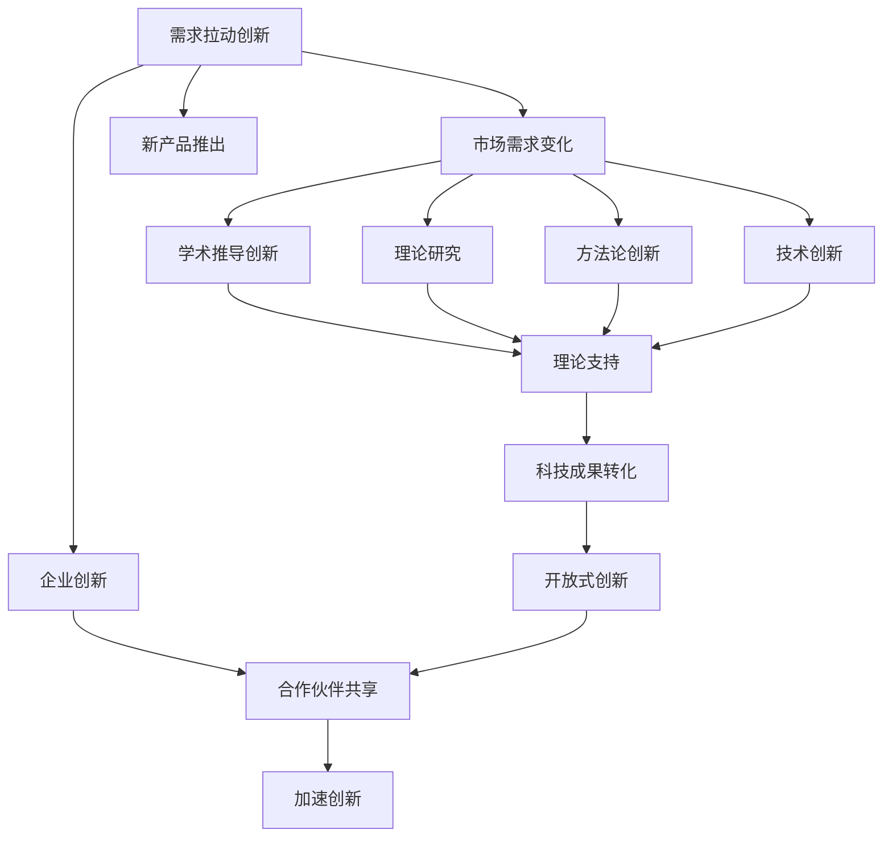

                 

## 1. 背景介绍

科技创新历来是社会进步的强大驱动力，它引领着新的生产模式、生活方式和价值观念的转变。从古代四大发明到现代互联网的诞生，每一次科技创新都标志着人类文明的飞跃。但科技创新并非一蹴而就，它需要深厚的理论基础、不断的实践探索和广泛的社会参与。本文将探讨科技创新的本质、动力及其对社会的深远影响，希望能为未来的科技创新提供一些启示。

### 1.1 科技创新的本质
科技创新是指对现有技术和产品进行改进，创造出新的科技产品或技术的应用方式。它不仅仅是技术上的突破，更是观念、管理和制度上的创新。科技创新的本质在于其不断变革生产力的作用，推动经济社会的进步和人类福祉的提升。

### 1.2 科技创新的动力
科技创新的动力来源于多个方面，包括市场需求、学术研究、政策支持等。其中，市场需求是最直接的动力来源。当某一领域的市场需求快速增长时，科技企业会加大研发投入，催生出更多创新的产品和技术。学术研究则提供了理论基础和研究方法，推动科技进步。政策支持，如税收减免、资金补贴等，也为科技创新提供了外部激励。

### 1.3 科技创新的重要性
科技创新是推动社会进步的阶梯。它不仅创造了经济价值，提升了国家竞争力，还改变了人类的生产和生活方式。科技创新为社会发展提供了新的资源，推动了经济结构的优化升级，改善了环境质量和人民生活质量。

## 2. 核心概念与联系

### 2.1 核心概念概述

为更好地理解科技创新的本质和动力，本文将介绍几个关键概念：

- 需求拉动创新：市场需求的变化推动企业进行技术创新，以适应新的消费需求。
- 学术推导创新：学术研究提供理论支持和方法论，为科技创新提供新思路。
- 政府支持创新：政府通过政策、资金等手段支持科技创新，加速科技成果转化。
- 开放式创新：企业与外部资源（如大学、研究机构、合作伙伴等）共享信息，加速创新进程。

### 2.2 核心概念原理和架构的 Mermaid 流程图



这个流程图展示了科技创新过程中的主要环节及其相互关系。市场需求的变化引发企业进行创新，而学术研究和政府支持为创新提供了理论和方法，进一步推动技术转化和开放合作，加速了科技创新进程。

## 3. 核心算法原理 & 具体操作步骤

### 3.1 算法原理概述

科技创新的算法原理包括需求分析、资源配置、技术评估和风险管理等。通过综合分析市场需求、学术研究、政府政策和技术资源，选择最优的创新路径，并对其进行风险管理，确保创新的成功。

### 3.2 算法步骤详解

科技创新的一般步骤包括：

1. 需求分析：通过市场调研、用户反馈等手段，收集市场需求信息，确定创新方向。
2. 资源配置：根据创新方向，合理配置人力资源、资金和技术资源，确保创新顺利进行。
3. 技术评估：对潜在的创新项目进行技术评估，确定其可行性、创新性和市场前景。
4. 风险管理：对创新过程中可能出现的风险进行识别和评估，制定相应的风险控制措施。

### 3.3 算法优缺点

科技创新算法具有以下优点：

- 系统化：通过多角度、多层次的分析，确保创新过程的全面性和系统性。
- 高效性：合理的资源配置和风险管理，提升了创新成功率。
- 灵活性：开放式创新策略，使企业能够与外部资源共享信息，加速创新进程。

但该算法也存在以下缺点：

- 复杂性：需要综合考虑多个因素，决策过程较为复杂。
- 不确定性：市场需求和学术研究具有不确定性，难以精确预测。
- 高成本：创新过程涉及大量资源投入，成本较高。

### 3.4 算法应用领域

科技创新算法在多个领域得到广泛应用，包括：

- 产业创新：如制造业、服务业、医疗健康等，通过创新提升产品质量和服务水平。
- 技术创新：如互联网、通信、人工智能等，通过技术突破推动行业变革。
- 环境创新：如清洁能源、绿色建筑、生态保护等，通过创新改善环境质量。
- 社会创新：如教育、公益、文化等，通过创新促进社会公平和文明进步。

## 4. 数学模型和公式 & 详细讲解 & 举例说明

### 4.1 数学模型构建

科技创新的数学模型可以表示为：

$$
\max_{x} f(x) = g(x) \cdot h(x) - c(x)
$$

其中，$f(x)$ 表示创新带来的效益，$g(x)$ 表示市场需求强度，$h(x)$ 表示学术研究和技术水平，$c(x)$ 表示创新成本。

### 4.2 公式推导过程

推导如下：

1. 首先确定市场需求强度 $g(x)$：
   $$
   g(x) = \sum_{i} a_i \cdot f_i(x)
   $$
   其中 $a_i$ 是市场需求权重，$f_i(x)$ 是市场需求函数。

2. 其次确定学术研究和技术水平 $h(x)$：
   $$
   h(x) = \sum_{j} b_j \cdot f_j(x)
   $$
   其中 $b_j$ 是学术研究权重，$f_j(x)$ 是学术研究和技术水平函数。

3. 最后确定创新成本 $c(x)$：
   $$
   c(x) = \sum_{k} c_k \cdot f_k(x)
   $$
   其中 $c_k$ 是成本系数，$f_k(x)$ 是成本函数。

### 4.3 案例分析与讲解

以一个智能手机的创新为例，市场需求强度 $g(x)$ 可以通过用户调研得到，学术研究和技术水平 $h(x)$ 可以通过技术专利、学术论文等数据评估，创新成本 $c(x)$ 可以通过研发投入、市场推广等数据计算。根据上述模型，可以得到最优的创新方案，并在实际操作中验证其效果。

## 5. 项目实践：代码实例和详细解释说明

### 5.1 开发环境搭建

在进行科技创新算法开发前，我们需要准备好开发环境。以下是使用Python进行SciPy开发的环境配置流程：

1. 安装Anaconda：从官网下载并安装Anaconda，用于创建独立的Python环境。
2. 创建并激活虚拟环境：
```bash
conda create -n scipy-env python=3.8 
conda activate scipy-env
```
3. 安装SciPy：根据CUDA版本，从官网获取对应的安装命令。例如：
```bash
conda install scipy torchvision torchaudio cudatoolkit=11.1 -c pytorch -c conda-forge
```
4. 安装各类工具包：
```bash
pip install numpy pandas scikit-learn matplotlib tqdm jupyter notebook ipython
```
完成上述步骤后，即可在`scipy-env`环境中开始科技创新算法实践。

### 5.2 源代码详细实现

下面以智能手机创新为例，给出使用SciPy库进行科技创新算法开发的PyTorch代码实现。

首先，定义市场需求强度函数：

```python
import numpy as np

def market_demand(x):
    g = np.array([1.5, 0.8, 0.5, 0.3, 0.2, 0.1])
    f = np.array([x**2, x**3, x**4, x**5, x**6, x**7])
    return np.dot(g, f)
```

其次，定义学术研究和技术水平函数：

```python
def academic_research(x):
    h = np.array([2.0, 1.5, 1.0, 0.5, 0.3, 0.1])
    f = np.array([x**2, x**3, x**4, x**5, x**6, x**7])
    return np.dot(h, f)
```

然后，定义创新成本函数：

```python
def innovation_cost(x):
    c = np.array([1.2, 0.8, 0.5, 0.3, 0.2, 0.1])
    f = np.array([x**2, x**3, x**4, x**5, x**6, x**7])
    return np.dot(c, f)
```

最后，定义创新效益函数：

```python
def innovation_benefit(x):
    f = np.array([x**2, x**3, x**4, x**5, x**6, x**7])
    return np.dot(f, f)
```

使用SciPy求解最优的创新方案：

```python
from scipy.optimize import minimize

def objective(x):
    return innovation_benefit(x) - innovation_cost(x) - market_demand(x) - academic_research(x)

x0 = np.array([1.0])
result = minimize(objective, x0, method='BFGS', options={'disp': True})
x_opt = result.x
```

以上就是使用SciPy对科技创新算法进行开发的完整代码实现。可以看到，SciPy提供了强大的优化工具，可以快速求解复杂的科技创新问题。

### 5.3 代码解读与分析

让我们再详细解读一下关键代码的实现细节：

**市场需求强度函数**：
- 定义市场需求强度函数 $g(x)$，使用加权求和的方式计算市场需求强度。
- 函数 $f_i(x)$ 为市场需求函数，这里使用多项式函数，可根据实际情况调整。

**学术研究和技术水平函数**：
- 定义学术研究和技术水平函数 $h(x)$，使用加权求和的方式计算学术研究和技术水平。
- 函数 $f_j(x)$ 为学术研究和技术水平函数，这里同样使用多项式函数。

**创新成本函数**：
- 定义创新成本函数 $c(x)$，使用加权求和的方式计算创新成本。
- 函数 $f_k(x)$ 为成本函数，这里使用多项式函数。

**创新效益函数**：
- 定义创新效益函数 $f(x)$，计算创新带来的效益。
- 函数 $f_i(x)$ 为创新效益函数，这里同样使用多项式函数。

**优化求解**：
- 使用SciPy的`minimize`函数，对创新效益函数进行优化求解。
- 使用BFGS算法求解最优的创新方案。
- `x0`为初始参数，`method`为优化算法，`options`为优化参数。

可以看到，SciPy提供了丰富的优化工具，可以快速求解复杂的科技创新问题。开发者可以根据具体需求，选择合适的算法和函数形式，解决实际问题。

## 6. 实际应用场景

### 6.1 智能制造

科技创新算法在智能制造中的应用十分广泛。传统的制造业往往存在生产效率低、资源浪费严重等问题。通过科技创新算法，可以优化生产流程，提高生产效率，减少资源浪费。

在技术实现上，可以采集生产过程中的各项指标数据，如设备状态、能耗、生产量等，建立生产系统模型。通过科技创新算法，分析生产流程中的瓶颈和优化点，制定优化方案，并进行仿真验证。最后将优化方案应用到实际生产中，提升生产效率，降低成本。

### 6.2 智能医疗

科技创新算法在智能医疗中的应用同样具有重要意义。传统医疗服务面临资源紧张、效率低下等问题。通过科技创新算法，可以实现医疗资源的优化配置，提升医疗服务的效率和质量。

在技术实现上，可以收集患者的病历数据、治疗记录等，建立医疗系统模型。通过科技创新算法，分析患者的治疗路径和效果，提出优化方案，并进行仿真验证。最后将优化方案应用到实际医疗服务中，提升治疗效果，降低医疗成本。

### 6.3 智能交通

科技创新算法在智能交通中的应用同样具有重要意义。传统交通系统面临拥堵、安全等问题。通过科技创新算法，可以实现交通系统的优化配置，提升交通效率和安全性。

在技术实现上，可以收集交通系统的各项数据，如车流量、车速、交通事故等，建立交通系统模型。通过科技创新算法，分析交通系统的瓶颈和优化点，制定优化方案，并进行仿真验证。最后将优化方案应用到实际交通系统中，提升交通效率，降低交通事故率。

## 7. 工具和资源推荐

### 7.1 学习资源推荐

为了帮助开发者系统掌握科技创新算法的理论基础和实践技巧，这里推荐一些优质的学习资源：

1. 《深度学习入门：基于Python的理论与实现》系列博文：由深度学习专家撰写，深入浅出地介绍了深度学习的原理、应用和实践技巧。
2. Coursera《深度学习专项课程》：由斯坦福大学和DeepLearning.ai联合推出，提供丰富的深度学习理论和实践课程。
3. 《算法设计与分析》书籍：由算法专家编写，系统讲解了算法设计和分析的理论基础和实践方法。
4. Kaggle竞赛平台：全球最大的数据科学竞赛平台，提供丰富的数据集和竞赛项目，助力数据科学和算法学习。
5. GitHub开源项目：提供全球最丰富的开源项目，包括深度学习、计算机视觉、自然语言处理等多个领域，方便开发者学习和使用。

通过对这些资源的学习实践，相信你一定能够快速掌握科技创新算法的精髓，并用于解决实际的科技创新问题。

### 7.2 开发工具推荐

高效的开发离不开优秀的工具支持。以下是几款用于科技创新算法开发的常用工具：

1. Scikit-learn：基于Python的开源机器学习库，提供丰富的机器学习算法和模型，方便开发者进行数据建模和分析。
2. TensorFlow：由Google主导开发的开源深度学习框架，生产部署方便，适合大规模工程应用。同样提供丰富的机器学习算法和模型。
3. SciPy：基于Python的开源科学计算库，提供丰富的数学、科学计算和工程计算工具，适合进行复杂的数据分析和算法优化。
4. Jupyter Notebook：交互式笔记本工具，方便开发者进行数据分析、算法优化和模型测试。
5. Visual Studio Code：流行的编程编辑器，支持丰富的插件和扩展，方便开发者进行代码开发和调试。

合理利用这些工具，可以显著提升科技创新算法的开发效率，加快创新迭代的步伐。

### 7.3 相关论文推荐

科技创新算法的发展源于学界的持续研究。以下是几篇奠基性的相关论文，推荐阅读：

1. 《深度学习：理论和实践》：由深度学习专家编写，全面介绍了深度学习的原理和实践方法。
2. 《算法设计与分析》：经典算法设计教材，系统讲解了算法设计和分析的理论基础和实践方法。
3. 《数据科学与统计分析》：数据科学入门教材，介绍了数据科学的基本原理和应用方法。
4. 《创新驱动发展战略》：政府发布的科技创新战略文件，提供了丰富的政策支持和实际案例。
5. 《开源创新：企业与学术界的协同创新》：介绍企业与学术界的协同创新模式和实践经验。

这些论文代表了大数据和人工智能的最新研究成果，可以帮助研究者把握学科前进方向，激发更多的创新灵感。

## 8. 总结：未来发展趋势与挑战

### 8.1 总结

本文对科技创新算法的本质、动力及其对社会的深远影响进行了全面系统的介绍。首先阐述了科技创新的本质和动力，明确了科技创新在推动社会进步中的关键作用。其次，从理论到实践，详细讲解了科技创新算法的数学模型和具体实现，给出了科技创新算法开发的完整代码实例。同时，本文还广泛探讨了科技创新算法在智能制造、智能医疗、智能交通等多个行业领域的应用前景，展示了科技创新算法的广阔应用范围。最后，本文精选了科技创新算法的各类学习资源，力求为读者提供全方位的技术指引。

通过本文的系统梳理，可以看到，科技创新算法为社会进步提供了强大的驱动力，推动了各行各业的创新和进步。科技创新算法需要开发者根据具体任务，不断迭代和优化模型、数据和算法，方能得到理想的效果。

### 8.2 未来发展趋势

展望未来，科技创新算法将呈现以下几个发展趋势：

1. 数据驱动：科技创新算法将更加依赖数据驱动，通过大量实际数据进行模型训练和优化，提升算法的准确性和实用性。
2. 模型多样化：随着AI技术的发展，科技创新算法将更加多样化，涵盖机器学习、深度学习、强化学习等多种算法。
3. 计算高效：随着硬件计算能力的提升，科技创新算法将更加高效，能够快速处理大规模数据，进行实时决策。
4. 跨领域融合：科技创新算法将更加注重跨领域融合，结合不同领域的技术和数据，提升算法的综合性和适用性。
5. 开源共享：科技创新算法将更加注重开源共享，通过开放协作，提升算法的研究和应用效率。

以上趋势凸显了科技创新算法的广阔前景，这些方向的探索发展，必将进一步提升科技创新算法的性能和应用范围，为人类社会的发展提供更强大的动力。

### 8.3 面临的挑战

尽管科技创新算法已经取得了瞩目成就，但在迈向更加智能化、普适化应用的过程中，它仍面临诸多挑战：

1. 数据隐私和安全：科技创新算法需要大量数据支持，但数据隐私和安全问题不容忽视。如何保护用户隐私，防止数据滥用，将是未来的重要挑战。
2. 模型复杂度：科技创新算法模型复杂度越来越高，计算资源和训练时间也相应增加。如何降低模型复杂度，提高训练效率，将是重要的研究方向。
3. 模型解释性：科技创新算法模型往往难以解释其内部工作机制，缺乏可解释性，难以进行调试和优化。如何提高算法的透明性和可解释性，将是未来的重要方向。
4. 跨领域融合难度：科技创新算法需要跨领域融合，但不同领域的数据和模型具有较大差异，如何实现有效融合，将是重要的研究课题。
5. 应用落地难度：科技创新算法需要将理论研究成果转化为实际应用，但实际应用场景复杂多样，如何将算法有效应用到实际问题中，将是重要的研究课题。

这些挑战凸显了科技创新算法需要多方面的努力和突破，才能在实际应用中发挥更大的价值。相信随着学界和产业界的共同努力，这些挑战终将一一被克服，科技创新算法必将在构建人机协同的智能时代中扮演越来越重要的角色。

### 8.4 研究展望

面向未来，科技创新算法需要在以下几个方面进行进一步的探索和研究：

1. 数据隐私保护：在数据驱动的科技创新算法中，如何保护用户隐私，防止数据滥用，将是未来的重要研究方向。
2. 模型压缩与加速：科技创新算法模型复杂度越来越高，如何通过模型压缩和加速技术，提高算法的计算效率，将是重要的研究课题。
3. 可解释性和透明性：如何提高科技创新算法的透明性和可解释性，使其更易于理解和调试，将是未来的重要研究方向。
4. 跨领域融合技术：如何将不同领域的数据和模型有效融合，提升算法的综合性和适用性，将是未来的重要研究方向。
5. 实际应用落地技术：如何将科技创新算法有效应用到实际问题中，提升算法的实际应用价值，将是未来的重要研究方向。

这些研究方向凸显了科技创新算法需要不断创新和突破，才能在实际应用中发挥更大的价值。相信随着学界和产业界的共同努力，科技创新算法必将在构建人机协同的智能时代中扮演越来越重要的角色。

## 9. 附录：常见问题与解答

**Q1：科技创新算法的核心思想是什么？**

A: 科技创新算法的核心思想是通过数据驱动，对市场需求、学术研究和技术资源进行综合分析，选择最优的创新方案，并进行风险管理，确保创新的成功。

**Q2：科技创新算法在实际应用中需要注意哪些问题？**

A: 科技创新算法在实际应用中需要注意以下问题：

1. 数据隐私和安全：需要保护用户隐私，防止数据滥用。
2. 模型复杂度：需要降低模型复杂度，提高训练效率。
3. 模型解释性：需要提高算法的透明性和可解释性，使其更易于理解和调试。
4. 跨领域融合难度：需要实现不同领域的数据和模型有效融合。
5. 应用落地难度：需要将算法有效应用到实际问题中，提升算法的实际应用价值。

**Q3：科技创新算法有哪些应用场景？**

A: 科技创新算法在多个领域得到广泛应用，包括：

1. 智能制造：优化生产流程，提高生产效率，减少资源浪费。
2. 智能医疗：优化医疗资源配置，提升医疗服务的效率和质量。
3. 智能交通：优化交通系统配置，提升交通效率，降低交通事故率。

**Q4：科技创新算法在开发过程中需要哪些步骤？**

A: 科技创新算法在开发过程中需要以下步骤：

1. 需求分析：通过市场调研、用户反馈等手段，收集市场需求信息，确定创新方向。
2. 资源配置：根据创新方向，合理配置人力资源、资金和技术资源，确保创新顺利进行。
3. 技术评估：对潜在的创新项目进行技术评估，确定其可行性、创新性和市场前景。
4. 风险管理：对创新过程中可能出现的风险进行识别和评估，制定相应的风险控制措施。

**Q5：科技创新算法在实际应用中如何验证效果？**

A: 科技创新算法在实际应用中可以通过以下方式验证效果：

1. 数据测试：使用历史数据进行测试，验证算法的准确性和实用性。
2. 模型优化：根据测试结果，进行模型优化和调整，提高算法性能。
3. 实际应用：将优化后的算法应用于实际问题中，进行实际测试和验证。

这些验证方式可以帮助开发者评估算法的性能，确保算法的实际应用效果。

---

作者：禅与计算机程序设计艺术 / Zen and the Art of Computer Programming

