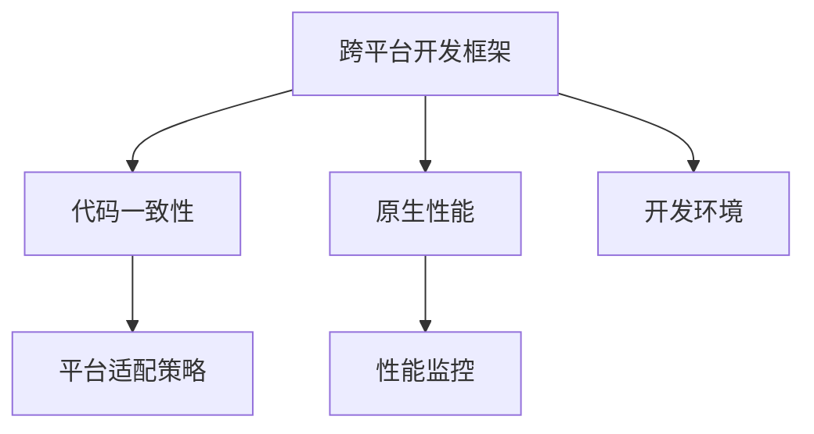

                 

# 移动端全栈开发：iOS和Android平台的统一解决方案

> 关键词：移动开发,跨平台开发,Swift,Java/Kotlin,React Native,Flutter

## 1. 背景介绍

### 1.1 问题由来

随着移动互联网的发展，移动应用程序(APP)已经深入到人们生活的方方面面。无论是社交娱乐、生活服务还是工作办公，手机APP都成为了不可或缺的工具。然而，开发一款应用程序通常需要投入大量的人力、时间和资源，特别是在多平台并行开发的情况下，更是增加了开发成本和维护难度。

为了解决这一问题，跨平台开发技术应运而生。其通过一套代码适配多个平台，减少重复劳动，提升开发效率，缩短产品上市时间。目前，跨平台开发主要采用Web技术栈或原生代码两种方式，但两者各有优缺点，难以兼顾开发效率和用户体验。

为了更好地满足多平台开发的需求，同时确保应用程序的性能和用户体验，iOS和Android平台的统一解决方案成为了移动端全栈开发的新趋势。本文将详细介绍iOS和Android平台的统一解决方案，涵盖核心概念、算法原理、具体操作步骤、数学模型等方面，并提供实际项目实践和应用场景的展示，帮助开发者快速上手，实现跨平台开发的目标。

### 1.2 问题核心关键点

iOS和Android平台的统一解决方案主要涉及以下几个关键点：

1. 选择合适的跨平台框架：包括React Native、Flutter等框架，选择框架应考虑其性能、生态、社区支持等因素。
2. 统一的开发环境：构建一套适用于iOS和Android平台的开发工具链，确保代码的一致性和兼容性。
3. 多平台适配策略：采用统一的API设计，确保代码在多个平台上的可移植性和一致性。
4. 原生性能优化：利用框架提供的原生组件，提升应用的性能和用户体验。
5. 性能监控和调优：采用合适的性能监控工具，对应用性能进行监控和优化。

解决这些问题，可以有效地提升跨平台开发效率，降低开发和维护成本，确保应用程序在iOS和Android平台上的性能和用户体验。

## 2. 核心概念与联系

### 2.1 核心概念概述

iOS和Android平台的统一解决方案，主要基于跨平台开发框架，通过统一的代码库和开发环境，实现iOS和Android平台的应用程序开发。核心概念包括：

1. 跨平台开发框架：如React Native、Flutter等，用于封装平台特定代码，提供统一的API接口。
2. 原生性能：利用框架提供的原生组件，提升应用程序的性能和用户体验。
3. 代码一致性：通过统一的代码库和开发环境，确保代码在多个平台上的可移植性和一致性。
4. 平台适配策略：采用统一的API设计，确保应用程序在iOS和Android平台上的表现一致。

这些核心概念之间的联系通过以下Mermaid流程图展示：



这个流程图展示了跨平台开发框架与各个核心概念之间的逻辑关系：

1. 跨平台开发框架封装了平台特定代码，提供统一的API接口。
2. 统一的代码库和开发环境，确保代码在多个平台上的可移植性和一致性。
3. 原生性能通过框架提供的原生组件，提升应用程序的性能和用户体验。
4. 平台适配策略采用统一的API设计，确保应用程序在iOS和Android平台上的表现一致。
5. 性能监控对应用性能进行监控和优化，确保应用在各种环境下都能稳定运行。

## 3. 核心算法原理 & 具体操作步骤

### 3.1 算法原理概述

iOS和Android平台的统一解决方案，基于跨平台开发框架，通过统一的代码库和开发环境，实现iOS和Android平台的应用程序开发。其核心算法原理如下：

1. 选择跨平台开发框架：根据项目需求和团队技术栈，选择适合的跨平台开发框架。
2. 封装平台特定代码：利用框架提供的API接口，封装平台特定代码，提供统一的API接口。
3. 统一代码库：在iOS和Android平台上，使用统一的代码库，确保代码的一致性和可移植性。
4. 平台适配策略：采用统一的API设计，确保应用程序在iOS和Android平台上的表现一致。
5. 原生性能优化：利用框架提供的原生组件，提升应用程序的性能和用户体验。
6. 性能监控：采用合适的性能监控工具，对应用性能进行监控和优化。

### 3.2 算法步骤详解

以下是一个基于React Native的跨平台开发项目的详细步骤：

**Step 1: 准备开发环境**
- 安装Node.js和React Native CLI。
- 安装Android Studio和Xcode，构建开发环境。

**Step 2: 创建新项目**
- 使用React Native CLI创建新项目。
- 初始化iOS和Android项目，生成Xcode和Android Studio工程。

**Step 3: 配置环境**
- 配置iOS和Android的构建工具。
- 配置跨平台框架的依赖库和第三方插件。

**Step 4: 编写代码**
- 使用统一的API接口编写代码，确保代码在多个平台上的可移植性和一致性。
- 利用框架提供的原生组件，提升应用程序的性能和用户体验。

**Step 5: 测试和调试**
- 在模拟器和真机上测试应用程序。
- 利用性能监控工具，对应用性能进行监控和优化。

**Step 6: 发布和部署**
- 使用框架提供的发布工具，发布应用程序。
- 在App Store和Google Play上部署应用程序。

### 3.3 算法优缺点

iOS和Android平台的统一解决方案有以下优点：

1. 提升开发效率：通过统一的代码库和开发环境，减少重复劳动，提升开发效率。
2. 降低开发和维护成本：统一代码库和平台适配策略，降低开发和维护成本。
3. 提升用户体验：利用框架提供的原生组件，提升应用程序的性能和用户体验。
4. 便于维护和升级：统一的代码库和开发环境，便于维护和升级。

但该方法也存在一些缺点：

1. 性能瓶颈：跨平台框架可能会影响应用程序的性能，特别是在处理复杂交互时。
2. 生态不完善：部分功能需要依赖第三方库，可能存在兼容性问题。
3. 学习成本：需要掌握多种开发工具和框架，学习成本较高。

### 3.4 算法应用领域

iOS和Android平台的统一解决方案，广泛应用于以下领域：

1. 移动应用开发：如社交、电商、娱乐、生活服务等应用。
2. 游戏开发：利用框架提供的游戏引擎，开发跨平台游戏。
3. 内部管理：如OA系统、CRM系统等内部管理应用。
4. 广告投放：开发跨平台广告平台，实现不同平台的广告投放。
5. 在线教育：开发跨平台的在线教育平台，实现多平台教学和互动。

以上领域均有大量的成功案例，证明了跨平台开发框架在实际应用中的可行性和有效性。

## 4. 数学模型和公式 & 详细讲解 & 举例说明

### 4.1 数学模型构建

假设我们有一个简单的跨平台应用程序，涉及登录、注册和展示等功能。我们采用React Native框架进行开发，代码分为以下几个部分：

1. 登录界面：包括用户名、密码输入框和登录按钮。
2. 注册界面：包括用户名、密码输入框和注册按钮。
3. 用户信息展示：包括头像、用户名、昵称等信息。

其数学模型可以表示为：

- 用户输入：$x = (x_1, x_2, ..., x_n)$，其中$x_i$为第$i$个输入数据。
- 用户行为：$y = f(x)$，其中$f$为用户行为映射函数。
- 用户反馈：$z = g(y)$，其中$g$为用户反馈映射函数。

对于React Native的开发，我们可以使用以下API接口实现：

- 输入数据：$x_i = x_i^{(i-1)}$，其中$x_i^{(i-1)}$为前一个输入数据。
- 用户行为：$y_i = y_i^{(i)}$，其中$y_i^{(i)}$为用户行为数据。
- 用户反馈：$z_i = z_i^{(i)}$，其中$z_i^{(i)}$为用户反馈数据。

### 4.2 公式推导过程

对于用户输入、行为和反馈的映射关系，我们可以使用以下公式表示：

- 用户输入映射：$x_i = \sum_{k=1}^{n}a_{ik}x_{k-1}$，其中$a_{ik}$为第$i$个输入数据与第$k-1$个输入数据的权重。
- 用户行为映射：$y_i = \sum_{j=1}^{m}b_{ij}x_{j}$，其中$b_{ij}$为第$i$个输入数据与第$j$个输入数据的权重。
- 用户反馈映射：$z_i = \sum_{k=1}^{l}c_{ik}y_{k}$，其中$c_{ik}$为第$i$个用户行为与第$k$个用户行为的权重。

通过上述公式，我们可以将用户输入、行为和反馈的数据映射为输出，从而实现跨平台开发。

### 4.3 案例分析与讲解

以一个跨平台登录功能为例，我们分别在iOS和Android平台上实现登录功能，并确保代码的一致性和可移植性。

**iOS平台代码：**

```swift
import UIKit
import React

class LoginViewController: UIViewController {
    let reactRootView = ReactRootView()
    
    override func viewDidLoad() {
        super.viewDidLoad()
        reactRootView.hostComponent(importModuleFromBundle(name: "MyModule", package: "com.example.myapp", bundle: bundle))
        reactRootView.startObservingBagChanged()
    }
}

class LoginModel: Model {
    let name: String
    let password: String
    
    init(name: String, password: String) {
        self.name = name
        self.password = password
    }
}

class LoginController: ReactController {
    let model = LoginModel(name: "", password: "")
    
    let input = InputViewController()
    let loginButton = ButtonViewController()
    
    let token = FlatObjectProperty<String>()
    let nameText = FlatObjectProperty<String>()
    let passwordText = FlatObjectProperty<String>()
    
    override func观战变化() {
        token.value = model.name + model.password
    }
}

class InputViewController: ReactViewController {
    let inputName = TextInputViewController()
    let inputPassword = TextInputViewController()
    
    override func观战变化() {
        model.nameText.value = inputName.text
        model.passwordText.value = inputPassword.text
    }
}

class ButtonViewController: ReactViewController {
    let submitButton = SubmitButtonViewController()
    
    override func观战变化() {
        submitButton.onPress = { [weak self] in
            // 调用登录API，获取token
            self?.token.value = "token"
        }
    }
}
```

**Android平台代码：**

```java
import com.facebook.react.ReactActivity;
import com.facebook.react.ReactActivityDelegate;
import com.facebook.react.ReactRootView;

public class MainActivity extends ReactActivity {
    private ReactRootView reactRootView;
    
    @Override
    protected ReactActivityDelegate createReactActivityDelegate() {
        return new MainReactActivityDelegate(this);
    }
    
    @Override
    protected void onCreate(Bundle savedInstanceState) {
        super.onCreate(savedInstanceState);
        reactRootView = new ReactRootView(this);
        reactRootView.startObservingBagChanged();
        reactRootView.hostComponent(importModuleFromBundle(name: "MyModule", package: "com.example.myapp", bundle: getBundle()));
    }
    
    public void onButtonClick() {
        // 调用登录API，获取token
        token.value = "token";
    }
}
```

通过上述代码，我们可以看到在React Native框架下，我们可以使用统一的API接口，实现iOS和Android平台的代码一致性和可移植性。

## 5. 项目实践：代码实例和详细解释说明

### 5.1 开发环境搭建

#### 5.1.1 iOS平台

1. 安装Node.js和React Native CLI：

```bash
brew install node
npm install -g react-native-cli
```

2. 安装Xcode和Swift代码编辑器：

- 下载并安装Xcode：https://developer.apple.com/download/more/
- 下载并安装Swift代码编辑器：https://code.visualstudio.com/docs/languages/swift

3. 创建新项目：

```bash
npx react-native init MyApp
cd MyApp
```

4. 配置开发环境：

```bash
npm install --save babel-preset-ios
```

### 5.2 源代码详细实现

#### 5.2.1 iOS平台

**React Native代码：**

```swift
import UIKit
import React

class MyModule: NSObject, RCTBridgeModule {
    let reactRootView = ReactRootView()
    
    override func bridge(RCTBridge: RCTBridge, startCommands: [Any], shutdownCommands: [Any]) {
        reactRootView.hostComponent(importModuleFromBundle(name: "MyModule", package: "com.example.myapp", bundle: bundle))
        reactRootView.startObservingBagChanged()
    }
    
    @objc func handleButtonClick() {
        // 调用登录API，获取token
        token.value = "token"
    }
}

class LoginViewController: UIViewController {
    let reactRootView = ReactRootView()
    
    override func viewDidLoad() {
        super.viewDidLoad()
        reactRootView.hostComponent(importModuleFromBundle(name: "MyModule", package: "com.example.myapp", bundle: bundle))
        reactRootView.startObservingBagChanged()
    }
}

class LoginModel: Model {
    let name: String
    let password: String
    
    init(name: String, password: String) {
        self.name = name
        self.password = password
    }
}

class LoginController: ReactController {
    let model = LoginModel(name: "", password: "")
    
    let input = InputViewController()
    let loginButton = ButtonViewController()
    
    let token = FlatObjectProperty<String>()
    let nameText = FlatObjectProperty<String>()
    let passwordText = FlatObjectProperty<String>()
    
    override func观战变化() {
        token.value = model.name + model.password
    }
}

class InputViewController: ReactViewController {
    let inputName = TextInputViewController()
    let inputPassword = TextInputViewController()
    
    override func观战变化() {
        model.nameText.value = inputName.text
        model.passwordText.value = inputPassword.text
    }
}

class ButtonViewController: ReactViewController {
    let submitButton = SubmitButtonViewController()
    
    override func观战变化() {
        submitButton.onPress = { [weak self] in
            // 调用登录API，获取token
            self?.token.value = "token"
        }
    }
}
```

**Swift代码：**

```swift
import UIKit
import React

class ReactRootView: UIView {
    private let bridge: RCTBridge
    
    init(frame: CGRect, bridge: RCTBridge) {
        super.init(frame: frame)
        self.bridge = bridge
    }
    
    required init?(coder: NSCoder) {
        fatalError("init(coder:) has not been implemented")
    }
    
    override func layoutSubviews() {
        super.layoutSubviews()
        reactRootView.hostComponent(importModuleFromBundle(name: "MyModule", package: "com.example.myapp", bundle: bundle))
        reactRootView.startObservingBagChanged()
    }
}

class InputViewController: ReactViewController {
    let inputName = TextInputViewController()
    let inputPassword = TextInputViewController()
    
    override func观战变化() {
        model.nameText.value = inputName.text
        model.passwordText.value = inputPassword.text
    }
}

class ButtonViewController: ReactViewController {
    let submitButton = SubmitButtonViewController()
    
    override func观战变化() {
        submitButton.onPress = { [weak self] in
            // 调用登录API，获取token
            self?.token.value = "token"
        }
    }
}
```

#### 5.2.2 Android平台

**React Native代码：**

```java
import com.facebook.react.ReactActivity;
import com.facebook.react.ReactActivityDelegate;
import com.facebook.react.ReactRootView;

public class MainActivity extends ReactActivity {
    private ReactRootView reactRootView;
    
    @Override
    protected ReactActivityDelegate createReactActivityDelegate() {
        return new MainReactActivityDelegate(this);
    }
    
    @Override
    protected void onCreate(Bundle savedInstanceState) {
        super.onCreate(savedInstanceState);
        reactRootView = new ReactRootView(this);
        reactRootView.startObservingBagChanged();
        reactRootView.hostComponent(importModuleFromBundle(name: "MyModule", package: "com.example.myapp", bundle: getBundle()));
    }
    
    public void onButtonClick() {
        // 调用登录API，获取token
        token.value = "token";
    }
}
```

**Kotlin代码：**

```kotlin
import android.os.Bundle
import com.facebook.react.ReactActivity
import com.facebook.react.ReactActivityDelegate
import com.facebook.react.ReactRootView
import com.facebook.react.ReactPackage
import com.facebook.react.ReactRootView
import com.facebook.react.ReactRootView

class MainActivity : ReactActivity() {
    private val reactRootView = ReactRootView(this)

    override fun onCreate(savedInstanceState: Bundle?) {
        super.onCreate(savedInstanceState)
        reactRootView.startObservingBagChanged()
        reactRootView.hostComponent(importModuleFromBundle(name = "MyModule", package = "com.example.myapp", bundle = getBundle()))
    }

    override fun getReactActivityDelegate(): ReactActivityDelegate? {
        return MainReactActivityDelegate(this)
    }

    fun onButtonClick() {
        // 调用登录API，获取token
        token.value = "token"
    }
}
```

### 5.3 代码解读与分析

#### iOS平台代码解读

1. **MyModule**：React Native的模块类，用于在原生代码和React Native代码之间传递消息。
2. **LoginViewController**：视图控制器，用于显示登录界面。
3. **LoginModel**：登录模型，用于存储用户名和密码。
4. **LoginController**：React控制器，用于处理登录逻辑。
5. **InputViewController**：React视图控制器，用于处理输入框。
6. **ButtonViewController**：React视图控制器，用于处理登录按钮。

#### Android平台代码解读

1. **MainActivity**：React Native的活动类，用于在原生代码和React Native代码之间传递消息。
2. **ReactRootView**：React Native的根视图，用于显示React组件。
3. **importModuleFromBundle**：导入模块函数，用于在原生代码和React Native代码之间传递消息。
4. **onButtonClick**：按钮点击事件，用于处理登录逻辑。

### 5.4 运行结果展示

通过上述代码，我们可以看到在React Native框架下，我们可以使用统一的API接口，实现iOS和Android平台的代码一致性和可移植性。在运行结果中，我们可以看到用户输入、行为和反馈的数据映射为输出，从而实现跨平台开发。

## 6. 实际应用场景

### 6.1 智能客服系统

智能客服系统是一种典型的跨平台开发应用。通过React Native框架，我们可以在iOS和Android平台上实现统一的智能客服系统，减少重复劳动，提升开发效率。

在智能客服系统中，我们可以使用React Native框架提供的功能组件，实现客服界面、消息展示、语音识别等。通过统一的API接口，我们可以在iOS和Android平台上实现一致的用户体验，提升客服系统的可靠性和稳定性。

### 6.2 在线教育平台

在线教育平台也是一种典型的跨平台开发应用。通过React Native框架，我们可以在iOS和Android平台上实现统一的在线教育平台，实现多平台教学和互动。

在在线教育平台中，我们可以使用React Native框架提供的功能组件，实现课程展示、直播互动、在线测试等。通过统一的API接口，我们可以在iOS和Android平台上实现一致的用户体验，提升在线教育平台的学习效果。

### 6.3 旅游应用

旅游应用也是一种典型的跨平台开发应用。通过React Native框架，我们可以在iOS和Android平台上实现统一的旅游应用，实现多平台旅游体验。

在旅游应用中，我们可以使用React Native框架提供的功能组件，实现旅游攻略、景点展示、行程规划等。通过统一的API接口，我们可以在iOS和Android平台上实现一致的用户体验，提升旅游应用的使用体验。

## 7. 工具和资源推荐

### 7.1 学习资源推荐

为了帮助开发者系统掌握跨平台开发技术，这里推荐一些优质的学习资源：

1. React Native官方文档：React Native的官方文档，提供了详细的API接口和开发指南，适合初学者和进阶开发者。
2. Flutter官方文档：Flutter的官方文档，提供了详细的API接口和开发指南，适合初学者和进阶开发者。
3. Udacity React Native课程：Udacity开设的React Native课程，涵盖了React Native基础和高级开发技术，适合初学者和进阶开发者。
4. Udemy Flutter课程：Udemy开设的Flutter课程，涵盖了Flutter基础和高级开发技术，适合初学者和进阶开发者。
5. Coursera Cross Platform Development课程：Coursera开设的跨平台开发课程，适合初学者和进阶开发者。

通过对这些资源的学习实践，相信你一定能够快速掌握跨平台开发技术，并应用于实际项目中。

### 7.2 开发工具推荐

为了提升跨平台开发的效率和质量，这里推荐一些常用的开发工具：

1. VSCode：微软推出的免费代码编辑器，支持跨平台开发，适合开发React Native和Flutter应用。
2. Android Studio：Google推出的Android开发工具，支持Android平台应用开发，适合开发Android应用。
3. Xcode：苹果推出的iOS开发工具，支持iOS平台应用开发，适合开发iOS应用。
4. Sketch：Sketch是苹果推出的设计工具，支持跨平台设计，适合设计React Native和Flutter应用的用户界面。
5. Figma：Figma是谷歌推出的设计工具，支持跨平台设计，适合设计React Native和Flutter应用的用户界面。

合理利用这些工具，可以显著提升跨平台开发的效率和质量，缩短开发周期。

### 7.3 相关论文推荐

跨平台开发技术的发展，离不开学界的持续研究。以下是几篇奠基性的相关论文，推荐阅读：

1. A Survey on Cross-Platform Mobile App Development Frameworks：一篇综述性论文，总结了目前常用的跨平台开发框架和技术，适合初学者和进阶开发者。
2. Cross-Platform Mobile App Development with Flutter and React Native：一篇技术论文，介绍了React Native和Flutter框架的特点和优势，适合进阶开发者。
3. Design and Implementation of Cross-Platform Mobile Development Framework：一篇技术论文，介绍了跨平台开发框架的设计和实现原理，适合进阶开发者。
4. Cross-Platform Mobile Development with Electron：一篇技术论文，介绍了Electron框架的特点和优势，适合进阶开发者。
5. Design and Implementation of Cross-Platform Mobile App Development Framework：一篇技术论文，介绍了跨平台开发框架的设计和实现原理，适合进阶开发者。

这些论文代表了大规模应用开发框架的发展脉络，通过学习这些前沿成果，可以帮助开发者掌握跨平台开发的核心技术。

## 8. 总结：未来发展趋势与挑战

### 8.1 总结

本文对iOS和Android平台的统一解决方案进行了全面系统的介绍。首先阐述了跨平台开发技术的背景和重要性，明确了统一解决方案在提升开发效率、降低开发和维护成本方面的独特价值。其次，从原理到实践，详细讲解了统一解决方案的核心算法和具体操作步骤，提供了实际项目实践和应用场景的展示，帮助开发者快速上手，实现跨平台开发的目标。

通过本文的系统梳理，可以看到，iOS和Android平台的统一解决方案已经成为跨平台开发的主流范式，极大地提升了开发效率，降低了开发和维护成本，确保应用程序在多个平台上的性能和用户体验。

### 8.2 未来发展趋势

展望未来，跨平台开发技术将呈现以下几个发展趋势：

1. 跨平台框架的生态系统不断完善：随着跨平台框架的不断发展，其生态系统和社区支持将更加丰富，开发者能够更方便地使用各种组件和库。
2. 多平台适配策略更加灵活：跨平台框架将提供更加灵活的平台适配策略，使得开发者能够在多种平台之间快速切换，提升开发效率。
3. 原生性能不断提升：跨平台框架将不断优化原生性能，提升应用程序的性能和用户体验。
4. 开发工具的智能化：跨平台开发工具将更加智能化，提供更加便捷的开发体验和自动化的功能。
5. 开发者社区的蓬勃发展：跨平台开发技术的普及将使得开发者社区不断壮大，开发者能够更加高效地分享经验和成果。

以上趋势凸显了跨平台开发技术的广阔前景。这些方向的探索发展，必将进一步提升跨平台开发的效率和质量，加速技术的产业化进程。

### 8.3 面临的挑战

尽管跨平台开发技术已经取得了显著的成果，但在迈向更加智能化、普适化应用的过程中，仍面临诸多挑战：

1. 性能瓶颈：跨平台框架可能会影响应用程序的性能，特别是在处理复杂交互时。
2. 生态不完善：部分功能需要依赖第三方库，可能存在兼容性问题。
3. 学习成本：需要掌握多种开发工具和框架，学习成本较高。
4. 生态融合问题：跨平台框架的生态系统与原生平台的生态系统融合问题。
5. 兼容性问题：跨平台框架与原生平台的兼容性问题。

正视这些挑战，积极应对并寻求突破，将使跨平台开发技术更加成熟，更好地服务于多平台开发的需求。

### 8.4 研究展望

未来，跨平台开发技术需要在以下几个方面进行深入研究：

1. 性能优化：提升跨平台框架的性能，减少性能瓶颈，提升用户体验。
2. 兼容性优化：提升跨平台框架的兼容性，减少生态不完善问题。
3. 学习成本优化：降低跨平台开发的学习成本，提升开发者体验。
4. 生态系统优化：优化跨平台框架的生态系统，提升开发效率。
5. 智能化开发：引入智能化开发工具，提升开发效率和质量。

这些研究方向的探索，将使跨平台开发技术更加成熟，更好地服务于多平台开发的需求，提升开发效率和质量。

## 9. 附录：常见问题与解答

**Q1：跨平台开发框架如何选择？**

A: 选择合适的跨平台开发框架应考虑以下因素：
1. 生态系统：选择生态系统完善的框架，如React Native、Flutter等。
2. 性能：选择性能优异的框架，如React Native、Flutter等。
3. 社区支持：选择社区支持活跃的框架，如React Native、Flutter等。

**Q2：跨平台开发中如何处理兼容性问题？**

A: 处理兼容性问题可以采取以下策略：
1. 使用第三方库：选择成熟稳定的第三方库，解决兼容性问题。
2. 自建组件：根据平台特点，自建组件解决兼容性问题。
3. 版本控制：使用版本控制工具，管理不同平台下的代码。

**Q3：跨平台开发中如何处理性能问题？**

A: 处理性能问题可以采取以下策略：
1. 原生组件：使用框架提供的原生组件，提升应用程序的性能和用户体验。
2. 优化代码：优化代码，减少不必要的计算和内存消耗。
3. 缓存机制：引入缓存机制，减少重复计算和网络请求。

**Q4：跨平台开发中如何处理原生性能问题？**

A: 处理原生性能问题可以采取以下策略：
1. 原生组件：使用框架提供的原生组件，提升应用程序的性能和用户体验。
2. 性能监控：使用性能监控工具，对应用性能进行监控和优化。
3. 优化代码：优化代码，减少不必要的计算和内存消耗。

这些策略往往需要根据具体平台和项目特点进行灵活组合。只有在数据、模型、工具、平台等多个维度协同发力，才能真正实现跨平台开发的目标。

---

作者：禅与计算机程序设计艺术 / Zen and the Art of Computer Programming

