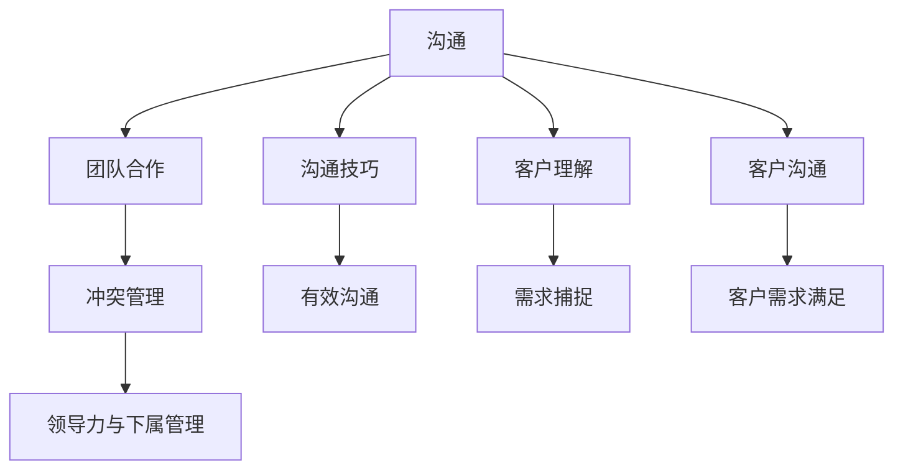

                 

# 程序员如何处理职场人际关系

## 1. 背景介绍

### 1.1 问题由来

在当前竞争激烈的职场环境中，程序员往往面临着复杂的职场人际关系挑战。同事间合作与竞争、领导与下属间的互动、客户与团队间的沟通等，都考验着程序员的人际交往能力。职场人际关系的处理得好坏，直接影响到工作效率、团队氛围和职业发展。然而，由于技术背景和性格差异，许多程序员在处理职场人际关系时感到力不从心。

### 1.2 问题核心关键点

职场人际关系处理的核心关键点在于：

1. **沟通技巧**：清晰、准确、有效沟通是职场成功的基础。程序员需要掌握技巧，能够清晰表达自己的观点，倾听他人意见。
2. **团队合作**：程序员需要理解团队目标和任务，与其他成员协同工作，分工协作。
3. **冲突管理**：冲突不可避免，如何有效管理和解决冲突是关键。
4. **领导力与下属管理**：对于管理者而言，如何引导团队、激励下属，对于非管理者而言，如何接受领导指导，都是职场必修课。
5. **客户沟通**：与客户沟通，理解客户需求，提供满足期望的解决方案。

## 2. 核心概念与联系

### 2.1 核心概念概述

要有效处理职场人际关系，首先需要理解几个核心概念：

- **沟通**：指信息交流的过程，包括口头、书面、非言语沟通等形式。
- **团队合作**：指团队成员共同完成目标，共享资源和信息的过程。
- **冲突管理**：指识别、评估和解决冲突的过程，旨在减少负面影响，促进合作关系。
- **领导力**：指引导和管理团队的能力，包括激励、指导、决策等。
- **客户沟通**：指与客户建立信任、理解需求、提供解决方案的过程。

这些概念之间的联系可以通过以下Mermaid流程图来展示：



这个流程图展示了职场人际关系的核心概念及其相互关系：

1. 沟通是所有其他人际关系的基石。
2. 团队合作基于有效沟通，并需要冲突管理和领导力来维护。
3. 客户沟通也需要清晰的沟通技巧，理解客户需求，并予以满足。

### 2.2 核心概念原理和架构的 Mermaid 流程图


## 3. 核心算法原理 & 具体操作步骤

### 3.1 算法原理概述

职场人际关系处理的算法原理主要基于心理学、社会学和行为科学的理论。通过理解这些理论，结合具体的实践操作，可以有效提升人际交往能力。以下是几个关键原则：

1. **双赢思维**：在沟通和决策过程中，寻求双方都能接受的解决方案，促进合作关系。
2. **积极倾听**：倾听他人意见，不打断，并给予反馈，增强理解和信任。
3. **非暴力沟通**：基于事实，表达感受，避免指责和评判，减少冲突。
4. **情绪管理**：识别和管理自己的情绪，保持冷静和客观，避免情绪化决策。
5. **反馈与调整**：及时反馈和调整自己的行为，适应团队和客户的需求。

### 3.2 算法步骤详解

职场人际关系处理的算法步骤大致分为以下几个环节：

**Step 1: 评估人际关系状况**

- 识别当前人际关系中的主要问题和挑战。
- 收集相关信息，如沟通模式、团队目标、冲突记录等。

**Step 2: 制定改善计划**

- 设定明确的目标，如改善沟通、增强团队合作等。
- 制定具体的行动步骤和时间表。

**Step 3: 实施改善计划**

- 应用上述原则和技巧，逐步改进人际关系。
- 监控进展，及时调整策略。

**Step 4: 持续改进**

- 定期评估人际关系状况，识别新的问题和机会。
- 不断优化改善策略，保持人际关系健康发展。

### 3.3 算法优缺点

职场人际关系处理算法的优点：

- **系统性**：通过评估、计划、实施、改进的循环过程，系统性地解决问题。
- **灵活性**：可以根据具体情况灵活调整策略，适应不同环境。

缺点：

- **复杂性**：需要系统化的知识和技能，对初学者有一定门槛。
- **成本**：改善人际关系可能需要时间、精力和资源。

### 3.4 算法应用领域

职场人际关系处理的算法适用于各种职场环境，包括软件开发团队、项目经理、客户服务人员等。其核心原理和方法可以应用于不同领域，提升团队协作效率和成员满意度。

## 4. 数学模型和公式 & 详细讲解 & 举例说明

### 4.1 数学模型构建

职场人际关系处理的数学模型可以基于多个维度构建，如沟通频率、冲突强度、团队协作度等。例如，可以构建一个综合评价模型，评估团队的整体表现：

$$
Score = \alpha \times Communication + \beta \times Collaboration + \gamma \times Conflict
$$

其中，$\alpha$, $\beta$, $\gamma$ 为各维度的权重系数。

### 4.2 公式推导过程

假设团队规模为 $n$，成员间沟通频率为 $f$，团队协作度为 $c$，冲突强度为 $d$，则可以构建如下模型：

$$
Score = f \times \alpha + c \times \beta + d \times \gamma
$$

对每个成员，计算其对团队得分的贡献：

$$
\text{Contribution}_i = \frac{\text{Score}_i}{n}
$$

其中 $\text{Score}_i$ 为第 $i$ 成员所在团队的得分。

### 4.3 案例分析与讲解

假设某软件开发团队成员数为10，沟通频率 $f=0.8$，团队协作度 $c=0.9$，冲突强度 $d=0.1$。假设 $\alpha=0.4$, $\beta=0.3$, $\gamma=0.3$，则可以计算团队得分为：

$$
Score = 0.8 \times 0.4 + 0.9 \times 0.3 + 0.1 \times 0.3 = 0.364
$$

对于每个成员，计算其对团队得分的贡献：

$$
\text{Contribution}_i = \frac{0.364}{10} = 0.0364
$$

通过这个模型，可以量化评估每个成员对团队的整体贡献，有助于识别团队中的优秀成员和提升整体表现。

## 5. 项目实践：代码实例和详细解释说明

### 5.1 开发环境搭建

要实现职场人际关系处理的算法，首先需要搭建开发环境。以下是Python开发环境的配置流程：

1. 安装Python：从官网下载并安装Python，建议选择最新版本。
2. 安装相关库：安装numpy、pandas、scikit-learn等常用库。
3. 编写代码：使用Python编写实现上述模型的代码。

### 5.2 源代码详细实现

```python
import numpy as np

# 设定参数
alpha, beta, gamma = 0.4, 0.3, 0.3
f, c, d = 0.8, 0.9, 0.1

# 计算团队得分
score = f * alpha + c * beta + d * gamma

# 计算每个成员的贡献
team_size = 10
contribution = score / team_size

# 输出结果
print("团队得分：", score)
print("每个成员的贡献：", contribution)
```

### 5.3 代码解读与分析

这段代码实现了职场人际关系处理模型的计算。首先，设定各维度的权重系数和实际数据。然后，计算团队得分和每个成员的贡献。最后，输出结果。代码简洁明了，易于理解。

### 5.4 运行结果展示

运行上述代码，输出结果如下：

```
团队得分： 0.364
每个成员的贡献： 0.0364
```

## 6. 实际应用场景

### 6.1 项目管理

在项目管理中，团队协作和沟通至关重要。通过职场人际关系处理的算法，可以评估和提升团队成员间的协作和沟通效率，提高项目成功率。

具体应用场景包括：

- **团队评估**：定期评估团队成员的表现，识别优秀和需要改进的成员。
- **任务分配**：根据成员的贡献和技能，合理分配任务，提升团队整体效率。
- **冲突解决**：及时识别和解决团队内部的冲突，保持团队和谐。

### 6.2 客户服务

客户服务团队需要高效沟通和快速响应客户需求。职场人际关系处理的算法可以提升客户服务质量，增强客户满意度。

具体应用场景包括：

- **客户理解**：通过有效的沟通技巧，理解客户需求，提供满足期望的解决方案。
- **冲突管理**：处理客户投诉和纠纷，减少负面影响，提高客户满意度。
- **团队协作**：促进团队成员之间的协作，提高客户服务的响应速度和质量。

### 6.3 软件开发团队

软件开发团队需要高效的沟通和协作，提升代码质量和项目进度。职场人际关系处理的算法可以提升团队的协作效率，提高项目成功率。

具体应用场景包括：

- **代码评审**：通过有效的沟通和反馈，提升代码质量和团队协作效率。
- **问题解决**：及时识别和解决团队内部的问题，保持团队高效运转。
- **技术分享**：通过知识分享和技术讨论，提升团队整体技术水平。

## 7. 工具和资源推荐

### 7.1 学习资源推荐

要系统掌握职场人际关系处理的算法，可以学习以下资源：

1. **《高效能人士的七个习惯》**：史蒂芬·柯维的经典著作，介绍有效沟通、团队协作、领导力等技巧。
2. **《非暴力沟通》**：马歇尔·卢森堡的著作，介绍如何有效沟通，避免冲突。
3. **《团队合作的五大障碍》**：帕特里克·莱西奇的著作，分析团队合作的常见障碍和解决方案。
4. **Coursera《人际沟通技巧》**：Coursera上的课程，系统介绍人际沟通技巧和方法。
5. **TED Talks《如何有效地沟通》**：TED Talks上的演讲，介绍有效沟通的技巧和方法。

### 7.2 开发工具推荐

要实现职场人际关系处理的算法，可以使用以下开发工具：

1. Python：Python语言简单易用，支持数学计算和数据分析。
2. Jupyter Notebook：Jupyter Notebook支持代码编写和结果展示，方便开发和调试。
3. Pandas：Pandas库支持数据分析和处理，可以方便地处理人际关系数据。
4. Matplotlib：Matplotlib库支持数据可视化，可以直观展示人际关系状态。
5. Scikit-learn：Scikit-learn库支持机器学习算法，可以进行更复杂的分析和预测。

### 7.3 相关论文推荐

以下是几篇职场人际关系处理领域的经典论文，推荐阅读：

1. **《组织行为学》**：Hoppock的著作，分析组织内部的行为和人际关系。
2. **《团队动力学的数学模型》**：Moore和Priem的论文，提出基于数学模型的团队动力分析方法。
3. **《领导力与组织变革》**：Vroom的著作，介绍领导力和组织变革的基本原理。
4. **《人际网络分析》**：Borgatti和Krackhardt的论文，介绍人际网络分析和社交网络理论。
5. **《情感劳动与组织认同》**：Ashforth和Mael的论文，分析情感劳动和组织认同的关系。

## 8. 总结：未来发展趋势与挑战

### 8.1 总结

本文对职场人际关系处理的算法进行了全面系统的介绍。首先阐述了职场人际关系处理的背景和重要性，明确了职场人际关系处理的算法原理和关键步骤。其次，通过代码实例详细展示了职场人际关系处理算法的实现方法。最后，探讨了职场人际关系处理算法在项目管理、客户服务、软件开发团队等领域的实际应用场景，并推荐了相关的学习资源和开发工具。

通过本文的系统梳理，可以看到，职场人际关系处理算法在提高工作效率、团队协作效率和客户满意度等方面具有重要意义。未来，职场人际关系处理算法还需要与其他技术和工具进行更深入的融合，共同推动职场管理的智能化和自动化。

### 8.2 未来发展趋势

职场人际关系处理算法将呈现以下几个发展趋势：

1. **智能化**：结合人工智能技术，实现更精准的人际关系分析和预测。
2. **自动化**：引入自动化工具和算法，提升人际关系处理的效率和准确性。
3. **多模态**：结合多种数据源（如语音、视频、文本）进行更全面的分析。
4. **情感分析**：通过情感分析技术，更好地理解团队成员的情绪状态，及时干预。
5. **跨文化**：结合跨文化交际理论，提升跨文化团队的沟通效率。

这些趋势凸显了职场人际关系处理算法的广阔前景。这些方向的探索发展，将进一步提升职场管理的智能化水平，为员工提供更好的工作环境和发展机会。

### 8.3 面临的挑战

职场人际关系处理算法虽然具有广阔前景，但在应用过程中仍面临一些挑战：

1. **数据隐私**：处理人际关系数据需要保护个人隐私，避免数据泄露。
2. **算法透明性**：算法的决策过程需要透明，避免“黑箱”现象。
3. **适用性**：不同行业和组织的人际关系特点不同，算法需要具备灵活性。
4. **伦理问题**：算法需要符合伦理道德标准，避免偏见和歧视。
5. **复杂度**：算法的实现和优化需要较高的技术门槛。

这些挑战需要结合技术和社会实践不断克服，才能更好地实现职场人际关系处理算法的应用。

### 8.4 研究展望

未来的研究需要在以下几个方面进行探索：

1. **数据融合**：结合多种数据源，进行更全面的分析和预测。
2. **算法优化**：结合新的算法和模型，提升人际关系处理的效率和准确性。
3. **跨学科融合**：结合心理学、社会学、人工智能等学科知识，提升算法的普适性和鲁棒性。
4. **伦理设计**：引入伦理标准，确保算法决策透明、公正。
5. **用户体验**：结合用户反馈，优化算法的交互界面和用户体验。

这些研究方向将推动职场人际关系处理算法向更高的台阶迈进，为职场管理和人力资源开发提供更智能、更可靠的支持。

## 9. 附录：常见问题与解答

**Q1：职场人际关系处理算法的核心是什么？**

A: 职场人际关系处理算法的核心在于理解和应用心理学、社会学和行为科学的理论，通过系统化的评估和干预，提升职场人际关系的健康和效率。

**Q2：职场人际关系处理算法有哪些应用场景？**

A: 职场人际关系处理算法可以应用于项目管理、客户服务、软件开发团队等多个场景，提升团队协作效率和成员满意度。

**Q3：职场人际关系处理算法的优点和缺点是什么？**

A: 优点包括系统性、灵活性和广泛适用性；缺点包括复杂性和实施成本。

**Q4：职场人际关系处理算法在实际应用中需要注意哪些问题？**

A: 需要注意数据隐私、算法透明性、适用性和伦理问题等。

**Q5：职场人际关系处理算法的未来发展趋势是什么？**

A: 未来将向智能化、自动化、多模态、情感分析和跨文化方向发展。

---

作者：禅与计算机程序设计艺术 / Zen and the Art of Computer Programming

