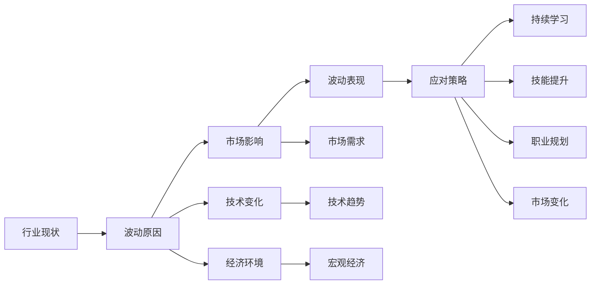

                 

## 1. 背景介绍

随着信息技术的迅猛发展和人工智能的兴起，程序员的行业地位日益提升，薪资水平也水涨船高。然而，技术的变化和市场的需求波动，使得程序员的薪资水平存在着较大的波动性。如何应对这一现象，成为每一个程序员需要思考的问题。本文将从行业现状、波动原因以及应对策略等方面，深入探讨这一问题，并给出实用的建议。

## 2. 核心概念与联系

### 2.1 核心概念概述

- **行业现状**：当前信息技术行业的薪资水平整体较高，但不同地区、不同职位、不同技术栈的薪资差异较大。
- **波动原因**：技术趋势的变化、市场需求的不确定性、宏观经济环境的影响等因素，都会导致程序员薪资水平的波动。
- **应对策略**：持续学习、技能提升、合理规划职业发展路径、积极应对市场变化等。

### 2.2 核心概念原理和架构的 Mermaid 流程图



这个流程图展示了行业现状、波动原因与应对策略之间的逻辑关系，旨在帮助程序员理解背后的原理和架构。

## 3. 核心算法原理 & 具体操作步骤

### 3.1 算法原理概述

在信息技术行业中，程序员的薪资水平受到多种因素的影响。技术趋势、市场需求、宏观经济环境等外部因素，以及个人技能、职业规划、工作地点的内部因素，都会对薪资产生波动。通过系统分析这些因素，并采取相应的应对策略，可以帮助程序员更好地应对薪资波动。

### 3.2 算法步骤详解

1. **数据收集与分析**：收集相关行业的薪资数据，包括不同地区、不同职位、不同技术栈的薪资情况，分析其波动趋势。
2. **因素分析**：识别影响薪资波动的关键因素，包括技术趋势、市场需求、宏观经济环境等。
3. **策略制定**：根据分析结果，制定针对性的应对策略，如持续学习、技能提升、职业规划等。
4. **实施与评估**：执行策略，并定期评估其效果，根据市场变化进行调整。

### 3.3 算法优缺点

**优点**：
- 系统性分析薪资波动因素，制定更加科学的应对策略。
- 根据市场变化灵活调整策略，提升薪资水平。

**缺点**：
- 数据分析过程较为复杂，需要投入较多时间和资源。
- 市场变化多端，策略调整需要不断跟进。

### 3.4 算法应用领域

该算法适用于任何信息技术行业的程序员，无论处于哪个地区、哪个职位、哪个技术栈，都可以使用。

## 4. 数学模型和公式 & 详细讲解 & 举例说明

### 4.1 数学模型构建

设 $S_i$ 为第 $i$ 职位在时间 $t$ 的薪资水平，影响因素包括技术趋势 $T_i$、市场需求 $D_i$、宏观经济环境 $E_i$ 等，薪资波动的数学模型可以表示为：

$$ S_i(t) = f(T_i, D_i, E_i) $$

其中 $f$ 为薪资波动函数。

### 4.2 公式推导过程

以市场需求 $D_i$ 为例，市场需求对薪资的影响可以表示为：

$$ D_i = \alpha_1 \times \text{技术难度} + \alpha_2 \times \text{人才稀缺度} + \alpha_3 \times \text{行业发展趋势} $$

其中 $\alpha_1$、$\alpha_2$、$\alpha_3$ 为市场需求的影响系数，技术难度、人才稀缺度、行业发展趋势分别为市场需求的不同因素。

### 4.3 案例分析与讲解

以机器学习工程师为例，机器学习在各个行业的渗透率逐渐提高，导致市场需求持续增长。但同时，市场上机器学习人才的供给也在增加，薪资水平因此呈现波动状态。

## 5. 项目实践：代码实例和详细解释说明

### 5.1 开发环境搭建

为了进行数据分析和薪资预测，需要搭建一个数据科学项目环境。以下是Python环境搭建的详细步骤：

1. 安装Anaconda，并创建新的虚拟环境。
2. 安装Python依赖包，包括NumPy、Pandas、Matplotlib等。
3. 安装R语言环境，并导入相关包。
4. 使用RMarkdown或Jupyter Notebook进行数据分析和可视化。

### 5.2 源代码详细实现

以下是一个简单的Python代码示例，用于收集和分析薪资数据：

```python
import pandas as pd
import numpy as np

# 收集薪资数据
salary_data = pd.read_csv('salary_data.csv')

# 数据清洗与预处理
salary_data = salary_data.dropna()

# 计算平均薪资
avg_salary = salary_data['Salary'].mean()

# 可视化薪资分布
salary_data.hist(by='Salary', bins=50, figsize=(12, 8))
```

### 5.3 代码解读与分析

这段代码展示了如何使用Pandas进行数据收集、清洗和可视化。通过平均薪资的计算和可视化，可以初步了解当前薪资水平及其波动情况。

### 5.4 运行结果展示

运行上述代码，可以得到薪资数据的分布图，帮助程序员直观了解行业现状。

## 6. 实际应用场景

### 6.1 技术栈选择

在选择技术栈时，应考虑当前和未来的市场需求。如大数据、人工智能、云计算等领域，薪资水平较高且需求量大。

### 6.2 地区选择

不同地区的薪资水平存在差异，应根据个人职业规划和生活需求，选择适合的地区工作。

### 6.3 职业发展路径

明确职业发展路径，不断提升技能，增强竞争力。通过参加培训、学习新技术，保持行业竞争力。

### 6.4 未来应用展望

随着技术的不断发展，程序员的职业选择和薪资水平将面临更多变化。持续学习和适应新技术，是应对未来薪资波动的重要策略。

## 7. 工具和资源推荐

### 7.1 学习资源推荐

1. **《程序员如何应对行业薪资波动》系列博文**：详细讲解薪资波动的原因和应对策略。
2. **Coursera《数据科学导论》课程**：系统学习数据科学的基础知识和技能。
3. **Google Data Analytics Professional Certificate**：通过官方认证，掌握数据处理和分析技能。

### 7.2 开发工具推荐

1. **Python**：数据科学和机器学习领域的主要编程语言。
2. **R语言**：用于统计分析和数据可视化。
3. **Jupyter Notebook**：交互式数据分析和可视化工具。

### 7.3 相关论文推荐

1. **《数据科学中的数据驱动决策》**：探讨数据驱动决策在工资选择中的应用。
2. **《机器学习工程师薪资研究》**：分析机器学习工程师薪资波动的因素和影响。

## 8. 总结：未来发展趋势与挑战

### 8.1 研究成果总结

本文深入探讨了信息技术行业中程序员薪资波动的背景、原因和应对策略，提出了一套系统性的分析方法，并提供了实际可行的解决方案。

### 8.2 未来发展趋势

- **技术趋势**：人工智能、大数据、云计算等技术的发展，将进一步提升程序员的薪资水平。
- **市场需求**：新兴领域如自动驾驶、生物信息学等，将带来新的薪资增长点。
- **职业规划**：持续学习和技能提升，是应对未来薪资波动的重要手段。

### 8.3 面临的挑战

- **数据隐私和安全**：收集和分析薪资数据时，需注意数据隐私和安全性问题。
- **模型泛化能力**：构建薪资波动模型时，需注意其泛化能力，避免过度拟合。

### 8.4 研究展望

未来应加强对市场变化和技术趋势的预测，构建更加动态的薪资预测模型。同时，结合大数据和人工智能技术，提升模型预测的准确性和可靠性。

## 9. 附录：常见问题与解答

### 附录：常见问题与解答

**Q1：如何确定自己的技术栈选择？**

A：了解当前和未来的市场需求，选择有发展前景的技术栈。同时，结合个人兴趣和职业规划，做出合理选择。

**Q2：如何选择适合自己的工作地点？**

A：根据薪资水平、生活成本、职业发展机会等因素，选择适合自己的工作地点。考虑未来发展，选择具有良好职业发展前景的城市。

**Q3：如何规划自己的职业发展路径？**

A：明确职业目标，制定详细的职业规划。通过持续学习新技术、参加培训、积累项目经验等方式，提升自身竞争力。

**Q4：如何应对技术趋势的变化？**

A：持续关注技术趋势，参加培训、学习新技术，保持行业竞争力。同时，灵活调整技术栈选择，适应市场需求的变化。

---

作者：禅与计算机程序设计艺术 / Zen and the Art of Computer Programming

