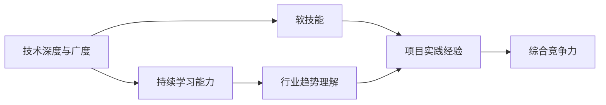

                 

# 程序员如何建立长期的职业竞争力

在快速发展的IT行业，保持长期职业竞争力是每个程序员必须面对的挑战。技术的日新月异、行业的发展趋势、自身的职业规划等因素都影响着程序员的成长。本文将从背景介绍、核心概念与联系、核心算法原理与操作步骤、数学模型和公式、项目实践、实际应用场景、工具和资源推荐、总结与展望等角度，深入探讨程序员如何建立长期的职业竞争力。

## 1. 背景介绍

### 1.1 问题由来
现代IT行业的发展速度和变化频率令人目不暇接。新的编程语言、框架、工具和最佳实践层出不穷，这让程序员面临不断学习和适应的压力。与此同时，技术的快速迭代也对职场竞争提出了新的要求，程序员必须不断提升自身技能，才能在职场中保持领先。

### 1.2 问题核心关键点
长期职业竞争力涉及技术深度、广度、软技能、持续学习能力等多个方面。当前IT行业的技术动态变化迅速，如何在变化中保持自己的竞争优势，成为每个程序员的挑战。

### 1.3 问题研究意义
建立长期职业竞争力，不仅有助于程序员个人成长，也为其所在企业带来价值。在企业中，优秀的程序员是团队的核心，其技术水平、工作态度和团队协作能力直接影响企业产品和服务质量。因此，研究和探讨如何培养和提升程序员的长期职业竞争力，对企业和个人都具有重要意义。

## 2. 核心概念与联系

### 2.1 核心概念概述

本节将介绍几个核心概念，帮助读者理解长期职业竞争力的构建。

- **技术深度与广度**：掌握深度知识的同时，也需要广泛涉猎，了解多个技术栈和应用场景。
- **软技能**：包括沟通能力、团队合作、时间管理、压力应对等，对个人和团队的协同工作至关重要。
- **持续学习能力**：保持学习和提升，适应新技术和行业变化。
- **项目实践经验**：通过实际操作，积累项目经验，提高问题解决能力。
- **行业趋势理解**：关注行业动态，把握技术发展趋势。

这些核心概念之间存在紧密联系，相互补充。理解并掌握这些概念，能够帮助程序员构建全面的职业竞争力。

### 2.2 核心概念原理和架构的 Mermaid 流程图

这个流程图展示了各个核心概念之间的联系。技术深度与广度是基础，持续学习能力推动个人进步，软技能和项目实践经验是应用实践，行业趋势理解引导方向，最终形成综合竞争力。

## 3. 核心算法原理 & 具体操作步骤

### 3.1 算法原理概述

建立长期职业竞争力可以看作一个持续优化的过程，涉及多个维度的不断提升。以下是基于算法原理的技术路线图：

1. **技术深度与广度提升**：选择合适的学习路径，逐步掌握深度知识和广泛技能。
2. **持续学习能力的培养**：制定个人学习计划，保持学习习惯。
3. **软技能培养**：通过团队合作、项目管理、沟通训练等提升软技能。
4. **项目实践经验积累**：通过实际项目积累经验，提升问题解决能力。
5. **行业趋势理解**：关注行业动态，参与开源项目、技术社区交流等。

### 3.2 算法步骤详解

#### 3.2.1 技术深度与广度提升

- **选择合适的学习路径**：
  - **深度学习**：掌握TensorFlow、PyTorch等框架。
  - **前端技术**：学习React、Vue、Angular等框架。
  - **后端技术**：熟悉Node.js、Django、Flask等技术栈。
  - **云计算**：了解AWS、Azure、Google Cloud等云平台。
  - **数据科学**：掌握SQL、Python、R等数据分析工具和语言。
  
- **制定学习计划**：
  - **短期目标**：每周设定小目标，如学习10个新单词、完成一个练习项目等。
  - **中期目标**：每季度学习新技能，如掌握一门新编程语言或一个新框架。
  - **长期目标**：每年深入一个技术领域，如在深度学习领域完成一个大型项目。

#### 3.2.2 持续学习能力的培养

- **制定学习计划**：
  - **日计划**：每天花一定时间学习新技术或复习已有知识。
  - **周计划**：每周总结学习内容，形成学习笔记。
  - **月计划**：每月评估学习进展，调整学习计划。

- **利用学习工具**：
  - **在线课程**：Coursera、Udacity、edX等平台提供大量高质量课程。
  - **视频教程**：YouTube、Bilibili等平台上有丰富的技术讲解视频。
  - **阅读资料**：Medium、Towards Data Science等网站有大量技术文章和论文。

#### 3.2.3 软技能培养

- **沟通能力**：
  - **书面沟通**：定期写作技术博客或论文，分享经验。
  - **口头沟通**：参加技术会议、讲座或团队讨论。
  
- **团队合作**：
  - **代码评审**：参与项目代码评审，提高代码质量。
  - **项目协作**：参与开源项目，与全球开发者合作。

- **时间管理**：
  - **任务优先级**：使用优先级清单或项目管理工具（如Trello、JIRA）。
  - **时间分配**：每天设定固定时间段专注于学习和项目。

- **压力应对**：
  - **健身运动**：通过运动减轻压力。
  - **冥想放松**：通过冥想或深呼吸技巧缓解压力。

#### 3.2.4 项目实践经验积累

- **参与开源项目**：
  - **GitHub**：在GitHub上寻找感兴趣的开源项目，贡献代码或提出建议。
  - **贡献社区**：在Stack Overflow等技术社区回答问题，帮助他人解决问题。

- **构建个人项目**：
  - **技术实验**：实现一个小型实验项目，如自动聊天机器人、数据分析工具等。
  - **应用开发**：开发一个实际应用，如简易博客、学生管理系统等。

#### 3.2.5 行业趋势理解

- **技术社区参与**：
  - **技术会议**：参加本地的技术会议、黑客松活动。
  - **技术沙龙**：参与技术沙龙、读书会等活动。

- **关注行业动态**：
  - **技术博客**：定期阅读技术博客，关注行业领袖的观点。
  - **技术新闻**：订阅技术新闻网站、邮件列表，如TechCrunch、InfoQ等。

- **参与开源项目**：
  - **贡献代码**：在开源项目中贡献代码，了解最新的技术实践。
  - **项目维护**：参与开源项目的维护和改进，提升技术能力。

### 3.3 算法优缺点

#### 3.3.1 优点

- **提升技术深度**：通过系统学习，掌握深度知识，提高专业水平。
- **提升软技能**：通过团队合作和项目管理，提升沟通和协作能力。
- **积累项目经验**：通过实际项目，提高问题解决能力。
- **保持行业趋势**：通过技术社区和开源项目，了解最新行业动态。

#### 3.3.2 缺点

- **学习成本高**：需要投入大量时间学习新技术和广泛技能。
- **持续学习压力大**：需要长期坚持，保持学习动力。
- **项目实践挑战**：高质量项目需要时间积累，经验总结。
- **行业变化快速**：需要持续跟进行业趋势，适应技术变化。

### 3.4 算法应用领域

长期职业竞争力的建立涉及多个技术栈和应用场景。以下是几个关键应用领域：

- **软件开发**：掌握多种编程语言和框架，提升代码质量和开发效率。
- **数据科学**：熟练掌握数据分析工具和算法，提升数据处理和建模能力。
- **云计算**：熟悉云计算平台，实现高效的云资源管理。
- **人工智能**：掌握深度学习、自然语言处理等技术，提升算法和模型构建能力。
- **网络安全**：学习网络安全知识，保护企业和用户数据安全。

## 4. 数学模型和公式 & 详细讲解 & 举例说明

### 4.1 数学模型构建

建立长期职业竞争力可以看作一个优化问题，目标是在一定资源约束下，最大化职业能力。可以用数学模型表示为：

$$
\text{Maximize } f(x) = \text{技能深度} \times \text{技能广度} \times \text{软技能} \times \text{项目经验} \times \text{行业理解}
$$

其中，$x$ 表示用于提升各个技能的时间、精力等资源。

### 4.2 公式推导过程

根据上述模型，可以推导出以下公式：

$$
\text{资源约束} = \text{时间资源} + \text{精力资源} + \text{学习资源} + \text{项目资源} + \text{社交资源}
$$

- **时间资源**：每周可用于学习的时间，如8小时。
- **精力资源**：每天可用于学习的精力，如2小时。
- **学习资源**：每周可用于学习的资金投入，如500元用于购买书籍和课程。
- **项目资源**：每周可用于开发项目的时间，如10小时。
- **社交资源**：每周可用于参与技术社区的时间，如5小时。

### 4.3 案例分析与讲解

假设某程序员每天可投入2小时学习，每周总共20小时，其中10小时用于项目开发，5小时用于社交活动，还有5小时用于学习。按照上述模型计算：

- 每周总学习资源为 $2 \times 20 + 500 = 120$ 元。
- 每周总项目开发资源为 $10 \times 20 = 200$ 小时。
- 每周总社交资源为 $5 \times 20 = 100$ 小时。

根据公式，可以计算出每周各项技能的提升值：

- 技能深度提升值 $=\frac{120}{\text{技能深度成本}}$
- 技能广度提升值 $=\frac{120}{\text{技能广度成本}}$
- 软技能提升值 $=\frac{100}{\text{软技能成本}}$
- 项目经验提升值 $=\frac{200}{\text{项目经验成本}}$
- 行业理解提升值 $=\frac{100}{\text{行业理解成本}}$

通过不断优化资源分配，提升各项技能，最终实现长期职业竞争力的最大化。

## 5. 项目实践：代码实例和详细解释说明

### 5.1 开发环境搭建

开发环境搭建是程序员日常工作的基础，以下是详细的搭建流程：

1. **安装操作系统**：选择一个稳定的操作系统，如Ubuntu或Windows Server。
2. **安装编译器**：安装C/C++编译器，如GCC或Clang。
3. **安装开发工具**：安装IDE（如Visual Studio、Eclipse等）和版本控制系统（如Git、SVN）。
4. **配置环境变量**：配置PATH、LD_LIBRARY_PATH等环境变量，确保工具链和库文件可访问。
5. **安装依赖库**：安装必要的依赖库和工具包，如OpenSSL、Boost等。

### 5.2 源代码详细实现

以下是一个简单的Java项目示例，包括需求分析、设计、实现和测试：

1. **需求分析**：
   - 开发一个命令行工具，实现字符串加密功能。
   - 用户输入字符串，工具输出加密结果。

2. **设计**：
   - 设计类图，定义加密算法类和命令行工具类。
   - 确定加密算法的实现细节，如AES、RSA等。

3. **实现**：
   - 编写加密算法类，实现加密和解密功能。
   - 编写命令行工具类，实现用户交互逻辑。
   - 编写测试类，测试工具的正确性。

4. **测试**：
   - 编写测试用例，模拟各种输入情况。
   - 运行测试，检查工具的正确性和健壮性。

### 5.3 代码解读与分析

在上述Java项目中，加密算法类的实现是核心，命令行工具类的设计和实现则是用户体验的关键。通过项目实践，程序员能够深入理解编码规范、程序设计和测试方法，积累实际开发经验。

### 5.4 运行结果展示

运行命令行工具，输入测试字符串，工具输出加密结果。通过不断优化算法和代码，提升工具的性能和可靠性。

## 6. 实际应用场景

### 6.1 软件开发

软件开发是程序员的主要职业领域，以下是实际应用场景：

- **敏捷开发**：
  - **需求分析**：与客户沟通需求，制定敏捷开发计划。
  - **故事开发**：通过故事卡记录开发任务，迭代式完成功能开发。
  - **代码评审**：定期进行代码评审，提升代码质量和团队协作。

- **测试驱动开发**：
  - **单元测试**：编写单元测试用例，确保代码模块的正确性。
  - **集成测试**：编写集成测试用例，测试系统集成效果。
  - **性能测试**：使用工具进行性能测试，优化系统性能。

- **DevOps**：
  - **持续集成**：使用CI工具进行代码自动构建和测试。
  - **持续部署**：使用CD工具实现代码自动部署。
  - **监控告警**：使用监控工具实时监测系统状态，设置异常告警阈值。

### 6.2 数据科学

数据科学是程序员的另一个重要应用领域，以下是实际应用场景：

- **数据清洗**：
  - **数据导入**：从各种数据源导入数据，如SQL数据库、API接口等。
  - **数据预处理**：处理缺失值、异常值等，确保数据质量。
  - **特征工程**：提取和构建有意义的特征，提升数据建模效果。

- **数据建模**：
  - **算法选择**：根据数据特点选择合适的算法，如线性回归、决策树等。
  - **模型训练**：使用数据训练模型，进行参数调优。
  - **模型评估**：使用测试数据评估模型性能，优化模型效果。

- **机器学习项目**：
  - **项目策划**：明确项目目标、数据来源、技术栈等。
  - **数据探索**：探索数据特征，寻找数据规律。
  - **模型应用**：将模型应用到实际问题中，解决业务需求。

### 6.3 云计算

云计算是现代软件开发的基础设施，以下是实际应用场景：

- **云资源管理**：
  - **资源配置**：根据项目需求配置云资源，如虚拟机、存储等。
  - **资源监控**：实时监控云资源状态，确保资源利用率。
  - **资源优化**：根据监控数据优化资源配置，降低成本。

- **云服务集成**：
  - **云存储服务**：使用云存储服务存储和管理数据。
  - **云计算服务**：使用云计算服务处理数据和任务。
  - **云网络服务**：使用云网络服务实现数据传输和通信。

- **云安全管理**：
  - **身份认证**：使用云身份认证服务管理用户权限。
  - **数据加密**：使用云数据加密服务保护数据安全。
  - **访问控制**：使用云访问控制服务限制资源访问。

### 6.4 未来应用展望

未来，程序员的职业竞争力将更加依赖于多方面的综合能力，以下是几个未来应用展望：

- **自动化**：
  - **自动化测试**：使用自动化测试工具提高测试效率，减少人工干预。
  - **自动化部署**：使用自动化部署工具实现持续集成和持续部署。
  - **自动化运维**：使用自动化运维工具监测系统状态，自动修复问题。

- **人工智能**：
  - **智能开发工具**：使用AI技术辅助开发，提高开发效率和代码质量。
  - **智能测试工具**：使用AI技术进行测试用例生成和测试执行。
  - **智能运维工具**：使用AI技术进行异常检测和问题诊断。

- **协同工作**：
  - **协作平台**：使用协作平台进行项目管理、代码评审和团队沟通。
  - **远程工作**：使用远程工作工具进行远程协作，确保团队高效协作。
  - **知识共享**：使用知识共享工具进行文档管理、经验分享和问题解答。

## 7. 工具和资源推荐

### 7.1 学习资源推荐

1. **《代码大全》**：这是一本经典的编程书籍，涵盖大量编程技巧和最佳实践。
2. **Coursera**：提供大量高质量的在线课程，涵盖多种编程语言和技术栈。
3. **GitHub**：全球最大的开源社区，可以学习和贡献大量高质量项目。
4. **Stack Overflow**：全球最大的编程问答社区，提供丰富的技术讨论和问题解答。
5. **Medium**：一个优秀的技术文章平台，提供大量深入浅出的技术文章。

### 7.2 开发工具推荐

1. **Visual Studio**：一款功能强大的IDE，支持多种编程语言和平台。
2. **Eclipse**：一款开源的IDE，支持Java等多种编程语言。
3. **Git**：一款常用的版本控制系统，支持分布式协作开发。
4. **JIRA**：一款流行的项目管理工具，支持敏捷开发和任务管理。
5. **Docker**：一款容器化平台，支持快速部署和扩展。

### 7.3 相关论文推荐

1. **《敏捷软件开发实践》**：介绍敏捷开发的最佳实践和技术。
2. **《数据科学导论》**：一本优秀的数据科学教材，涵盖数据清洗、建模、应用等多个方面。
3. **《云计算技术架构》**：介绍云计算的基础知识和应用实践。
4. **《机器学习实战》**：一本实战型的机器学习教材，涵盖算法和应用案例。

## 8. 总结：未来发展趋势与挑战

### 8.1 研究成果总结

本文从背景介绍、核心概念与联系、核心算法原理与操作步骤、数学模型和公式、项目实践、实际应用场景、工具和资源推荐等多个角度，深入探讨了程序员如何建立长期的职业竞争力。通过系统学习、不断实践和持续优化，程序员能够在不断变化的技术环境中保持竞争力，实现职业成长和业务提升。

### 8.2 未来发展趋势

未来，程序员的职业发展将更加依赖于多方面的综合能力，以下是几个未来发展趋势：

1. **自动化技术**：自动化测试、部署和运维将大幅提升开发效率和系统稳定性。
2. **人工智能应用**：AI技术将在软件开发、数据科学和运维等多个领域发挥重要作用。
3. **远程协作**：远程工作、协作平台和知识共享将提升团队协作效率。
4. **云计算普及**：云计算技术将成为软件开发的基础设施，提升系统资源利用率和运维效率。

### 8.3 面临的挑战

尽管未来发展前景广阔，但程序员的职业发展仍面临诸多挑战：

1. **技术更新快**：新技术和新工具层出不穷，需要不断学习和适应。
2. **项目复杂度高**：大规模、高复杂度的项目需要团队协作和项目管理能力。
3. **数据安全和隐私**：数据安全和隐私问题日益重要，需要开发安全可靠的系统。
4. **系统性能优化**：系统性能优化是长期挑战，需要持续改进和优化。

### 8.4 研究展望

面对这些挑战，未来需要在以下方面进行深入研究：

1. **持续学习机制**：建立持续学习的机制，确保程序员不断更新知识和技能。
2. **团队协作方法**：提升团队协作能力，建立高效的项目管理机制。
3. **数据安全和隐私保护**：研究和实施数据安全和隐私保护技术，确保数据安全。
4. **系统性能优化**：研究和应用系统性能优化技术，提升系统效率和稳定性。

## 9. 附录：常见问题与解答

### 9.1 常见问题

**Q1：如何提升技术深度和广度？**

A: 制定详细的学习计划，逐步掌握深度知识和广泛技能。

**Q2：如何保持持续学习动力？**

A: 设定小目标，定期回顾学习进度，不断调整学习计划。

**Q3：如何提升软技能？**

A: 通过团队合作和项目管理，提升沟通和协作能力。

**Q4：如何积累项目经验？**

A: 参与开源项目和实际项目，积累实际开发经验。

**Q5：如何理解行业趋势？**

A: 关注技术博客、参加技术会议和开源项目，了解最新行业动态。

### 9.2 解答

通过不断学习和实践，程序员可以在技术深度和广度、软技能、项目经验等多个方面不断提升，建立长期的职业竞争力。持续学习、团队合作、项目实践和行业理解是关键，只有全面提升个人能力，才能在不断变化的技术环境中保持竞争力。

---

作者：禅与计算机程序设计艺术 / Zen and the Art of Computer Programming

